<properties
  pageTitle="Priprema vaše okruženje za sigurnosno kopiranje radnih opterećenja pomoću poslužitelja za sigurnosno kopiranje Azure | Microsoft Azure"
  description="Pripremu okruženja za korištenje Azure sigurnosne kopije poslužitelja da biste zaštitili ili sigurnosno kopiranje radnih opterećenja."
  services="backup"
  documentationCenter=""
  authors="PVRK"
  manager="shivamg"
  editor=""
  keywords="poslužitelj za Azure sigurnosne kopije; Zaštita radnih opterećenja; sigurnosno kopiranje radnih opterećenja"/>

<tags
  ms.service="backup"
  ms.workload="storage-backup-recovery"
  ms.tgt_pltfrm="na"
  ms.devlang="na"
  ms.topic="article"
  ms.date="09/27/2016"
  ms.author="jimpark;trinadhk;pullabhk;markgal"/>

# <a name="preparing-to-back-up-workloads-using-azure-backup-server"></a>Priprema za sigurnosno kopiranje radnih opterećenja pomoću poslužitelja za sigurnosno kopiranje Azure

> [AZURE.SELECTOR]
- [Poslužitelj za Azure sigurnosne kopije](backup-azure-microsoft-azure-backup.md)
- [SCDPM](backup-azure-dpm-introduction.md)
- [Poslužitelj za Azure sigurnosne kopije (Classic)](backup-azure-microsoft-azure-backup-classic.md)
- [SCDPM (Classic)](backup-azure-dpm-introduction-classic.md)

U ovom se članku objašnjava kako pripremu okruženja za sigurnosno kopiranje radnih opterećenja pomoću poslužitelja za sigurnosno kopiranje Azure. S poslužiteljem za Azure sigurnosne kopije, možete zaštititi radnih opterećenja aplikacije kao što su VMs Hyper-V, Microsoft SQL Server, sustava SharePoint Server, Microsoft Exchange i klijenti sustava Windows s konzole za jedan. Možete zaštititi i podatke kao opterećenjem server (IaaS) kao što je VMs u Azure.

> [AZURE.NOTE] Azure sadrži dvije implementacije modela za stvaranje i rad s resursima: [Voditelj resursa i classic](../resource-manager-deployment-model.md). Ovaj članak sadrži informacije i postupci za vraćanje VMs implementiran pomoću modela Voditelj resursa.

Poslužitelj za Azure sigurnosne kopije nasljeđuje velik broj funkcionalnosti sigurnosne kopije radno opterećenje s podacima zaštitu Manager (DPM). U ovom članku navode veze na dokumentaciju DPM objašnjavaju neke zajedničke funkcija. Kroz poslužitelj za Azure sigurnosne kopije zajednički koristi približno ista funkcija kao DPM. Poslužitelj za Azure sigurnosne kopije ne sigurnosno kopiranje na vrpcu, kao ni ne je integrirati s centrom za sustav.

## <a name="1-choose-an-installation-platform"></a>1. Odaberite instalacijske platforme

Prvi korak pri njihovu sigurnosnu kopiju Server Azure postavljanju i upotrebi je da biste postavili Windows Server. Poslužitelj može biti u Azure ili na lokalnim poslužiteljima.

### <a name="using-a-server-in-azure"></a>Pomoću poslužitelja u Azure

Prilikom odabira poslužitelj za izvođenje Server Azure sigurnosne kopije, preporučuje se počinju galerije Windows Server 2012 R2 podatkovnog centra. U članku [Stvaranje prve strojno virtualne Windows Azure portalu](..\virtual-machines\virtual-machines-windows-hero-tutorial.md), sadrži vodič za početak rada s preporučene virtualnog računala Azure, čak i ako dosad niste koristili Azure prije. Preporučeni minimalni preduvjeti za poslužitelj virtualnog računala (VM) mora biti: A2 standardne s 2 jezgri i 3,5 GB RAM-a.

Zaštita radnih opterećenja s poslužiteljem za sigurnosno kopiranje Azure ima mnogo nuances. U članku [Instalacija DPM kao Azure virtualnog računala](https://technet.microsoft.com/library/jj852163.aspx)olakšava objašnjavaju te nuances. Pročitajte ovaj članak potpuno prije no što implementirate na računalu.

### <a name="using-an-on-premises-server"></a>Korištenje lokalnog poslužitelja

Ako ne želite pokrenuti osnovni poslužitelja u Azure, možete pokrenuti poslužitelj na Hyper-V VM, VMware VM ili fizičke glavnog računala. Preporučeni minimalni preduvjeti za poslužitelj hardver su 2 jezgri i 4 GB RAM-a. Podržani operacijski sustavi su navedene u tablici u nastavku.

| Operacijski sustav        | Platforme           | SKU  |
| :------------- |-------------| :-----|
|Windows Server 2012 R2 i najnovije SPs| 64-bitni| Standardna, podatkovnog centra, Foundation|
|Windows Server 2012 i najnovije SPs|    64-bitni| Standardna podatkovnog centra, Foundation,|
|Windows prostora za pohranu Server 2012 R2 i najnovije SPs  |64-bitni|    Standardna, radna grupa|
|Windows prostora za pohranu Server 2012 i najnovije SPs |64-bitni |Standardna, radna grupa|


Možete deduplicate prostora za pohranu DPM pomoću Poništavanje duplikacije Windows Server. Dodatne informacije o [servisu DPM i Poništavanje duplikacije](https://technet.microsoft.com/library/dn891438.aspx) funkcioniranje kada implementiran u VMs Hyper-V.

> [AZURE.NOTE]  Na računalu s instaliranim programom kao kontroler domene nije moguće instalirati Server Azure sigurnosnu kopiju.

Morate uključiti Server Azure sigurnosno kopiranje s domenom. Ako planirate da biste premjestili na poslužitelju na drugu domenu, preporučuje se da se pridružite poslužitelj za novu domenu prije instalacije Server Azure sigurnosnu kopiju. Premještanje postojeće računala za poslužitelj za Azure sigurnosne kopije za novu domenu nakon implementacije *nisu podržani*.

## <a name="2-recovery-services-vault"></a>2. sigurnog servise za oporavak

Hoće li poslati sigurnosne kopije podataka Azure ili održavali lokalno, softver mora biti povezano s Azure. Želite li biti određene, pokrenite poslužitelj za Azure sigurnosnu kopiju mora biti registriran u sigurnog za usluge oporavak.

Da biste stvorili sigurnog za usluge oporavak:

1. Prijavite se na [portal za Azure](https://portal.azure.com/).

2. Na izborniku koncentrator kliknite **Pregledaj** , a zatim na popisu resursi upišite **Servise za oporavak**. Kao što počnete pisati, na popisu će filtrirati na temelju unos. Kliknite **zbirke ključeva servisa za oporavak**.

    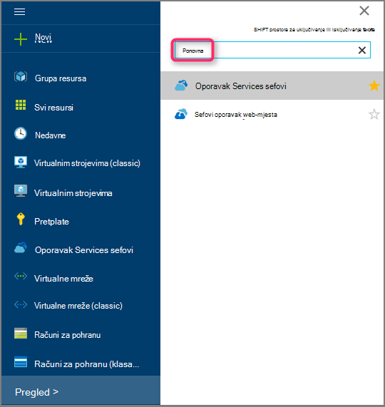 <br/>

    Prikazat će se popis sefovi servise za oporavak.

3. Na izborniku **sefovi oporavak servisi** kliknite **Dodaj**.

    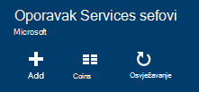

    Otvorit će se sigurnog plohu oporavak servise koje možete unijeti **naziv**, **pretplatu**, **grupa resursa**i **mjesto**pitanja.

    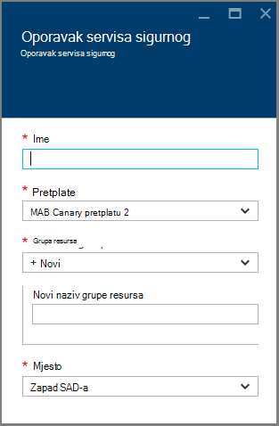

4. U odjeljku **naziv**unesite neslužbeni naziv da biste odredili na zbirke ključeva. Naziv mora biti jedinstvena za Azure pretplatu. Upišite naziv koji sadrži od 2 do 50 znakova. Morate pokrenuti slovom i mogu sadržavati samo slova, brojeve i spojnice.

5. Kliknite **pretplatu** da biste vidjeli dostupne popis pretplata. Ako niste sigurni koju pretplatu za korištenje, koristite zadanu (ili predložena) pretplate. Pojavit će se više mogućnosti samo ako je povezan s više pretplata Azure računa tvrtke ili ustanove.

6. Kliknite **grupu resursa** da biste vidjeli popis dostupnih grupa resursa ili **Novo** da biste stvorili novu grupu resursa. Potpune informacije o grupama resursa potražite u članku [Pregled upravljanja resursima za Azure](../azure-resource-manager/resource-group-overview.md)

7. Kliknite **mjesto** da biste odabrali regiji u zbirke ključeva.

8. Kliknite **Stvori**. Može potrajati neko vrijeme za oporavak servisa sigurnog će biti stvoren. Praćenje obavijesti o statusu u gornjem desnom području na portalu.
Nakon stvaranja vaše zbirke ključeva otvara se na portal.

### <a name="set-storage-replication"></a>Postavljanje ponavljanja prostora za pohranu

Mogućnost replikacije pohrane omogućuje odabir između zemlj suvišnih prostora za pohranu i lokalno suvišnih prostora za pohranu. Prema zadanim postavkama vašeg sigurnog ima zemlj suvišnih prostora za pohranu. Ostavite mogućnost postaviti zemlj suvišnih prostora za pohranu ako je primarni sigurnosnu kopiju. Ako želite da se jeftinijim mogućnost koja nije baš kao i durable, odaberite lokalno suvišnih prostora za pohranu. Dodatne informacije o [zemlj suvišne](../storage/storage-redundancy.md#geo-redundant-storage) i [lokalno suvišne](../storage/storage-redundancy.md#locally-redundant-storage) mogućnosti pohrane u [Pregled replikacije Azure prostora za pohranu](../storage/storage-redundancy.md).

Da biste uredili replikacije postavku za pohranu:

1. Odaberite vaše zbirke ključeva da biste otvorili na nadzornoj ploči sigurnog i plohu postavke. Ako ne možete otvoriti plohu **Postavke** , kliknite **sve postavke** na nadzornoj ploči zbirke ključeva.

2. Na plohu **Postavke** kliknite **Sigurnosno kopiranje infrastrukture** > **Konfiguracije sigurnosnu kopiju** da biste otvorili plohu **Konfiguracije sigurnosnu kopiju** . Na plohu **Sigurnosne kopije konfiguracije** odaberite mogućnost replikacije prostora za pohranu za vaše zbirke ključeva.

    

    Nakon odabira mogućnosti prostora za pohranu za vaše zbirke ključeva, spremni ste za pridruživanje s VM na sigurnog. Da biste započeli pridruživanja, otkrivanje i registrirati Azure virtualnih računala.

## <a name="3-software-package"></a>3. paket softver

### <a name="downloading-the-software-package"></a>Preuzimanje paketa softver
1. Prijavite se na [portal za Azure](https://portal.azure.com/).

2. Ako već imate otvorenu oporavak servisa sigurnog, prijeđite na 3. Ako ste oporavak servisa sigurnog otvori, ali se na portalu Azure na izborniku koncentrator kliknite **Pregledaj**.

    - Na popisu resursa upišite **Servise za oporavak**.
    - Kao što počnete pisati, na popisu će filtrirati na temelju unos. Kada se prikaže **sefovi oporavak Services**, kliknite ga.

    

    Pojavit će se popis sefovi servise za oporavak.

    - Na popisu sefovi oporavak Servisi odaberite na zbirke ključeva.

    Otvorit će se na nadzornoj ploči odabrane zbirke ključeva.

    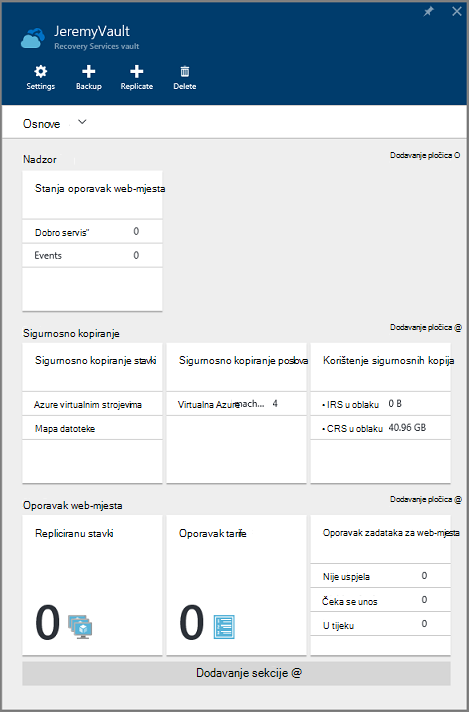

3. Prema zadanim postavkama, otvorit će se postavke plohu prema gore. Ako je zatvoren, kliknite **Postavke** da biste otvorili plohu postavke.

    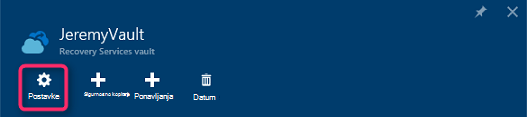

4. Kliknite **sigurnosne kopije** u **Početak rada** da biste otvorili čarobnjak za početak rada.

    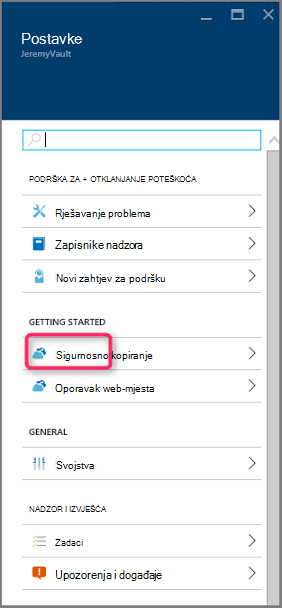

5. U Uvod koji će se otvoriti, ciljevi za sigurnosno kopiranje zaslona će biti automatski odabran.
    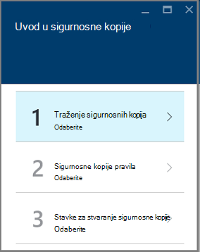

    U odjeljku **sigurnosno kopiranje ciljeva** odaberite *lokalnog* *gdje svoje radno opterećenje*radi.

    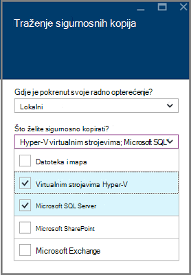

6. Odaberite radnih opterećenja koji želite zaštititi pomoću poslužitelja za sigurnosno kopiranje Azure u *koje radnih opterećenja koji želite zaštititi* , a zatim kliknite u **redu**.

    > [AZURE.NOTE] Ako namjeravate zaštititi samo datoteke i mape, pa preporučujemo korištenje Azure Backup agent. Ako namjeravate zaštititi više radnih opterećenja od samo datoteke i mape ili u budućnosti namjeravate da biste proširili potrebama za zaštitu, odaberite sve te radnih opterećenja.

    To će se promijeniti čarobnjaka za početak rada da biste pripremili infrastrukture za zaštitu radnih opterećenja lokalnim Azure.

    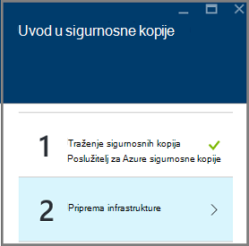

7. U **Pripremi infrastrukture** plohu koji će se otvoriti kliknite veza za **Preuzimanje** za instaliranje Server Azure sigurnosnu kopiju i preuzimanje sigurnog vjerodajnice. Korištenje vjerodajnice sigurnog tijekom Registracija Azure sigurnosne kopije poslužitelja servisa sigurnog oporavak. Veze doći do centra za preuzimanje koje je moguće preuzeti softverski paket.

    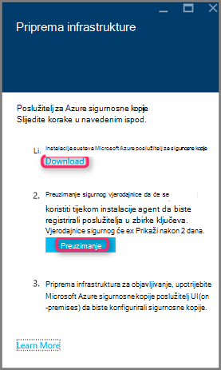

8. Odaberite sve datoteke, a zatim kliknite **Dalje**. Sve datoteke dolaze iz sigurnosne kopije Microsoft Azure stranicu za preuzimanje preuzmite i postavite sve datoteke u istoj mapi.

    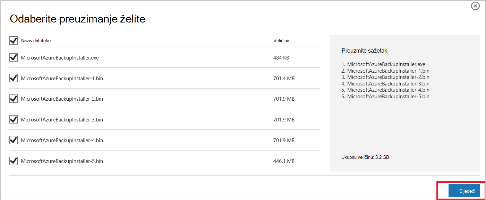

    Budući da veličina preuzimanja svih datoteka zajedno je > 3G, na na 10Mbps veza za preuzimanje može potrajati do 60 minuta za preuzimanje da biste dovršili.


### <a name="extracting-the-software-package"></a>Izdvajanje softverski paket

Nakon što preuzmete sve datoteke, kliknite **MicrosoftAzureBackupInstaller.exe**. To će se pokrenuti **Čarobnjak za postavljanje programa Microsoft Azure sigurnosnu kopiju** da biste izdvojili datoteke postavljanja na mjesto na koje ste naveli. Nastavite slijediti čarobnjak i kliknite gumb za **izdvajanje** da biste započeli postupak za izdvajanje.

> [AZURE.WARNING] Da biste izdvojili datoteke za postavljanje potreban je barem 4GB slobodnog prostora.


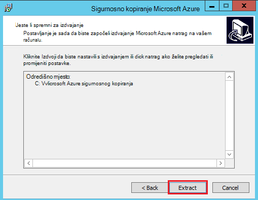

Kada se dovrši obrađivati izdvajanje, potvrdite okvir da biste pokrenuli freshly izdvojene *setup.exe* da biste započeli instalaciju sustava Microsoft Azure sigurnosne kopije Server, a zatim kliknite gumb **Završi** .

### <a name="installing-the-software-package"></a>Instalacija softvera paketa

1. Kliknite **Microsoft Azure Backup** da biste pokrenuli čarobnjak za postavljanje.

    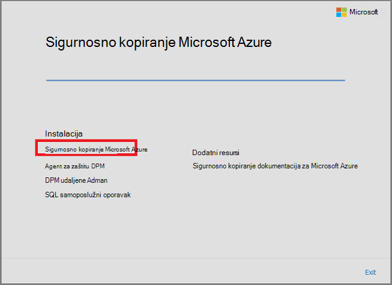

2. Na zaslonu dobrodošlice kliknite gumb **Dalje** . To će vas odvesti do odjeljka *Pripremni provjerava* . Na zaslonu, kliknite gumb **Provjeri** da biste odredili ako su ispunjeni hardverski i softverski preduvjeti za poslužitelj za Azure sigurnosnu kopiju. Ako su svi preduvjete su uspješno zadovoljen, vidjet ćete poruku koja navodi da računalo zadovoljava preduvjete. Kliknite gumb **Dalje** .

    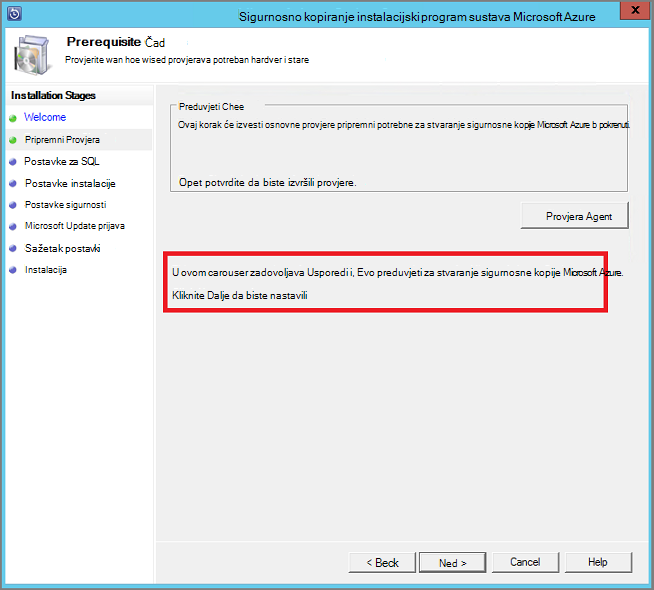

3. Microsoft Azure sigurnosne kopije poslužitelj zahtijeva SQL Server Standard, a instalacijski paket Server Azure sigurnosnu kopiju u sklopu paketu na odgovarajuću SQL Server binarne datoteke potrebne. Prilikom pokretanja novi instalacijama Server Azure sigurnosne kopije, trebali biste odaberite željenu mogućnost **Instaliraj novu instancu sustava SQL Server s ovaj će instalacijski program** i kliknite gumb **Provjera i instalirajte** . Kada uspješno su instalirani preduvjete, kliknite **Dalje**.

    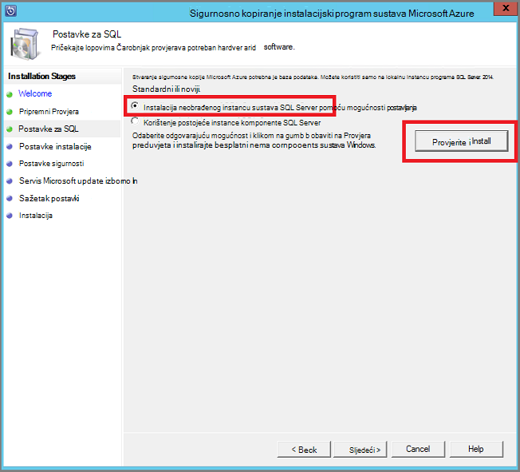

    Ako dođe do pogreške s preporuke za ponovno pokrenite računalo, učiniti, a zatim kliknite **Ponovno provjeriti**.

    > [AZURE.NOTE] Poslužitelj za Azure sigurnosnog kopiranja neće funkcionirati ako udaljene instancu sustava SQL Server. Instance koristi Server Azure sigurnosnu kopiju mora biti lokalni.

4. Mjesto za instalaciju sustava Microsoft Azure Backup datoteke poslužitelja, a zatim kliknite **Dalje**.

    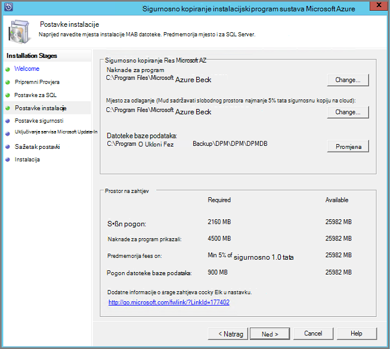

    Preduvjet za natrag na Azure je prazno mjesto. Provjerite je li prazno mjesto barem 5% podataka planirano za sigurnosno kopiranje s oblakom. Radi zaštite disk, potrebno je konfigurirati nakon dovršetka instalacije zasebnom diskova. Dodatne informacije o grupe za pohranu potražite u članku [Konfiguriranje prostora za pohranu grupe i prostora za pohranu na disku](https://technet.microsoft.com/library/hh758075.aspx).

5. Navedite jaku lozinku za ograničena lokalne korisničke račune, a zatim kliknite **Dalje**.

    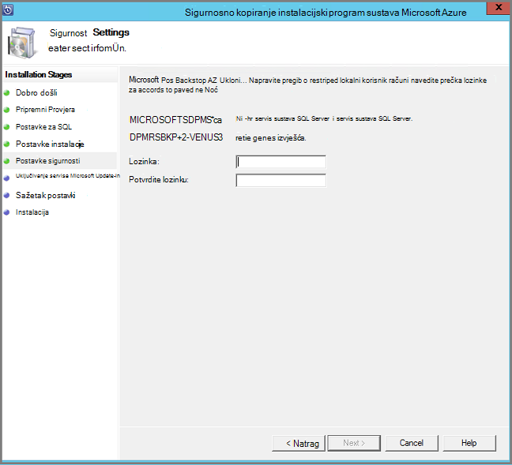

6. Odaberite želite li koristiti *Servis Microsoft Update* da biste provjerili ima li ažuriranja i kliknite **Dalje**.

    >[AZURE.NOTE] Preporučujemo da imate Windows Update preusmjeravanje na Microsoft Update, koji nudi sigurnosnih i važnih ažuriranja za Windows i ostale proizvode kao što je Microsoft Azure sigurnosne kopije Server.

    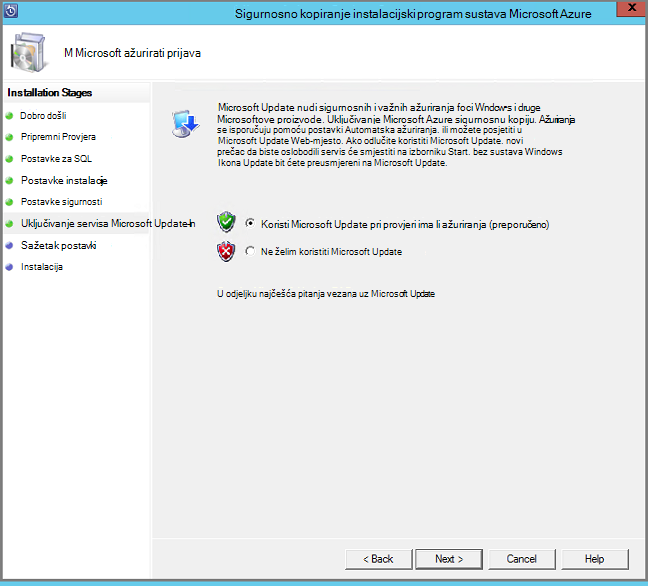

7. Pregledajte *Sažetak postavke* , a zatim kliknite **Instaliraj**.

    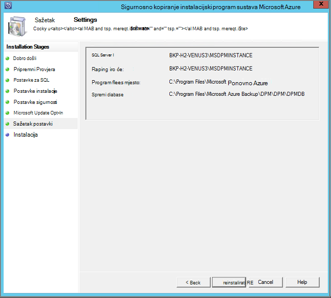

8. Instalacija se događa u fazama. Prva faza agenta za servise sustava Microsoft Azure oporavak instalacije na poslužitelju. Čarobnjak provjerava za povezivanje s Internetom. Ako je dostupan internetska veza možete nastaviti s instalacijom, ako nije, morate navesti proxy detalje za povezivanje s Internetom.

    Sljedeći je korak konfiguriranje agenta servisa za oporavak Microsoft Azure. U sklopu konfiguraciju, morat ćete unijeti vjerodajnice sigurnog da biste registrirali računalo servisa sigurnog oporavak. Pristupni izraz za šifriranje/dešifriranje podataka koji se šalju između Azure i vaši lokalno i dati. Automatski možete generirati pristupni izraz ili pružaju vlastite minimalne pristupni izraz 16 znakova. Nastavite pomoću čarobnjaka za sve dok je konfiguriran agenta.

    

9. Nakon registracije poslužitelja Microsoft Azure Backup uspješno završi, cjelokupan Čarobnjak za postavljanje nastavlja se do instalacije i konfiguracije SQL Server i komponente Server Azure sigurnosnu kopiju. Nakon dovršetka instalacije komponente SQL Server instaliraju se komponente Server Azure sigurnosnu kopiju.

    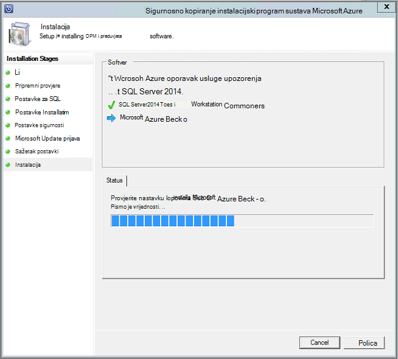


Kada korak instalacija dovrši, ikona na radnoj površini proizvoda će stvorena kao i. Samo dvokliknite ikonu da biste pokrenuli proizvoda.

### <a name="add-backup-storage"></a>Dodavanje prostora za pohranu za sigurnosne kopije

Prvi sigurnosne kopije zadržavaju se na pohranu priložiti strojno poslužitelj za Azure sigurnosne kopije. Dodatne informacije o dodavanju diskova potražite u članku [Konfiguriranje prostora za pohranu grupe i prostora za pohranu na disku](https://technet.microsoft.com/library/hh758075.aspx).

> [AZURE.NOTE] Morate dodati sigurnosne kopije prostora za pohranu, čak i ako planirate slati podatke Azure. U trenutnom arhitektura poslužitelj za Azure sigurnosne kopije Azure sigurnosno kopiranje zbirke ključeva sadrži *drugi* kopiju podataka dok je lokalno spremište sadrži sigurnosne kopije prvi (i obavezno).

## <a name="4-network-connectivity"></a>4. veza s mrežom

Server Azure sigurnosne kopije potrebna je veza sa servisom Azure sigurnosne kopije za proizvod rad uspješno. Da biste provjerili koristi li se na računalu je veza s Azure, koristite na ```Get-DPMCloudConnection``` cmdlet na konzoli za Azure sigurnosne kopije poslužitelja PowerShell. Ako je rezultat cmdlet TRUE povezivanje postoji, a zatim još nema nema povezivanja.

U isto vrijeme Azure pretplate mora biti u dobar stanju. Da biste saznali stanja pretplate i upravljati, prijavite se na [portal za pretplatu]( https://account.windowsazure.com/Subscriptions).

Kada znate stanje Azure s povezivanjem i Azure pretplatu, možete koristiti u tablici u nastavku da biste saznali utjecaj na funkciju sigurnosnog kopiranja i vraćanja nudi.

| Povezivanje stanja | Azure pretplate | Sigurnosno kopiranje za Azure| Sigurnosno kopiranje na disk | Vraćanje iz Azure | Vraćanje s diska |
| -------- | ------- | --------------------- | ------------------- | --------------------------- | ----------------------- |
| Povezani | Aktivni | Dopuštene | Dopuštene | Dopuštene | Dopuštene |
| Povezani | Istekla | Zaustavi | Zaustavi | Dopuštene | Dopuštene |
| Povezani | Pretplati su uklonjeni resursi | Zaustavi | Zaustavi | Točke Zaustavi i Azure Oporavak izbrisane | Zaustavi |
| Gube povezivanje > petnaest dana | Aktivni | Zaustavi | Zaustavi | Dopuštene | Dopuštene |
| Gubi povezivanje > petnaest dana | Istekla | Zaustavi | Zaustavi | Dopuštene | Dopuštene |
| Gubi povezivanje > petnaest dana | Pretplati su uklonjeni resursi | Zaustavi | Zaustavi |  Točke Zaustavi i Azure Oporavak izbrisane | Zaustavi |

### <a name="recovering-from-loss-of-connectivity"></a>Oporavak u slučaju gubitka veze
Ako imate vatrozid ili proxy poslužitelj Azure onemogućuje pristup, morate whitelist sljedeće adrese domene u profilu vatrozida/proxy poslužitelja:

- www.msftncsi.com
- \*. Microsoft.com
- \*. WindowsAzure.com
- \*. microsoftonline.com
- \*. windows.net

Kada se veza s Azure vraćena je na računalu Server Azure sigurnosne kopije, operacije koje možete izvršiti ovise o stanju Azure pretplate. Prethodno navedenoj tablici sadrži detalje o operacije dopušteno kada na ovom računalu "uspostavi".

### <a name="handling-subscription-states"></a>Rukovanje stanja pretplate

Moguće je da iskoristite Azure pretplate iz stanju *istekao* ili *Deprovisioned* *Active* stanje. No to sadrži neke utjecaju na ponašanje proizvoda dok još nije *aktivna*stanje:

- Pretplata na *Deprovisioned* gubi funkcije za razdoblje za koje je se uklanjaju resursi. O uključivanju *aktivna*, revived je funkcionalnost proizvoda sigurnosnog kopiranja i vraćanja. Sigurnosno kopiranje podataka na lokalnom disku i mogu biti dohvaćeni ako je čuva razdoblje zadržavanja dovoljno velikim. Sigurnosno kopiranje podataka u Azure irretrievably gubi se kada pretplata unosi *Deprovisioned* stanje.
- Pretplatu na *istekao* samo gubi funkcija dok je izvršena *aktivni* ponovno. Sve sigurnosne kopije planirano je pretplata *isteklo* razdoblje neće funkcionirati.


## <a name="troubleshooting"></a>Otklanjanje poteškoća

Ako poslužitelj za Microsoft Azure sigurnosne kopije neuspješan uz pogreške tijekom faze Postava (ili sigurnosno kopiranje ili vraćanje), pročitajte ovaj [dokument šifre pogreške](https://support.microsoft.com/kb/3041338) dodatne informacije.
Možete se referirati [sigurnosne kopije Azure povezane najčešća pitanja](backup-azure-backup-faq.md)


## <a name="next-steps"></a>Daljnji koraci

Detaljne informacije o [Pripremi okruženja za DPM](https://technet.microsoft.com/library/hh758176.aspx) možete dobiti na web-mjestu Microsoft TechNet. Sadrži i informacije o podržanim konfiguracije na kojem Server Azure sigurnosne kopije mogu uvesti i koristiti.

Pomoću ovih članaka možete dobiti detaljnije objašnjenje zaštite radno opterećenje pomoću poslužitelja za stvaranje sigurnosne kopije Microsoft Azure.

- [Sigurnosno kopiranje sustava SQL Server](backup-azure-backup-sql.md)
- [Sigurnosno kopiranje sustava SharePoint server](backup-azure-backup-sharepoint.md)
- [Zamjenski poslužitelj sigurnosnog kopiranja](backup-azure-alternate-dpm-server.md)
