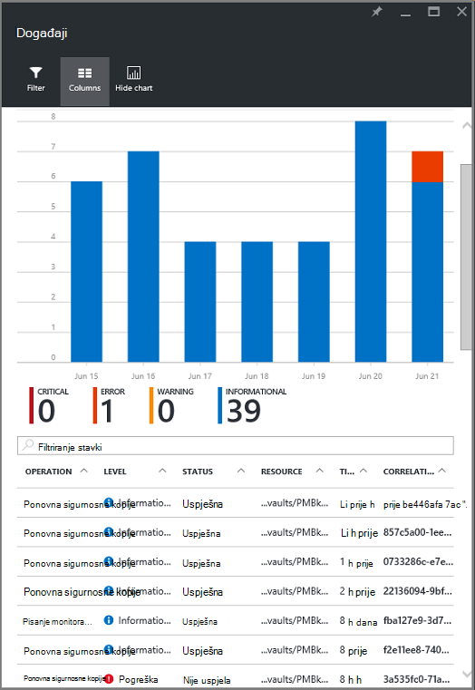
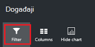

<properties
   pageTitle="Voditelj resursa monitor implementiran virtualnog računala kopija | Microsoft Azure"
   description="Praćenje događaja i upozorenja iz sigurnosnih kopija resursima implementiran virtualnog računala. Slanje e-pošte na temelju upozorenja."
   services="backup"
   documentationCenter="dev-center-name"
   authors="markgalioto"
   manager="cfreeman"
   editor=""/>

<tags
ms.service="backup"
ms.workload="storage-backup-recovery"
ms.tgt_pltfrm="na"
ms.devlang="na"
ms.topic="article"
ms.date="08/25/2016"
ms.author="trinadhk; giridham;"/>

# <a name="monitor-alerts-for-azure-virtual-machine-backups"></a>Praćenje upozorenja za sigurnosno kopiranje Azure virtualnog računala

Upozorenja su odgovori na servisu da se događaj prag ispunjen ili koncentratora. Kada zna prilikom početka probleme može biti ključnih čuvanja tvrtke troškove prema dolje. Upozorenja obično ne pojavljuju na raspored i tako da je korisno je znati čim nakon upozorenja. Ako, na primjer, kada sigurnosnog kopiranja i vraćanja zadatak neuspješan, upozorenje dolazi do pet minuta pogreške. Na nadzornoj ploči sigurnog pločicu upozorenja sigurnosnu kopiju prikazuje kritično i razina za upozorenje o događajima. U odjeljku postavke upozorenja za sigurnosne kopije možete pogledati sve događaje. No što učiniti ako se pojavi upozorenje kada radite na zasebnom problem? Ako ne znate kada se dogodi upozorenje, Razlog može biti manji neugodnosti ili ga nije moguće ugroziti podataka. Da biste provjerili je li određenim osobama nisu svjesni postojanja upozorenje – kada se pojavljuje, konfiguriranje servisa za slanje upozorenja putem e-pošte. Detalje o postavljanju obavijesti e-poštom potražite u članku [Konfiguriranje obavijesti](backup-azure-monitor-vms.md#configure-notifications).

## <a name="how-do-i-find-information-about-the-alerts"></a>Kako pronaći informacije o upozorenjima?

Da biste vidjeli informacije o događaju koji izbacio upozorenja, morate otvoriti plohu upozorenja za sigurnosno kopiranje. Dva su načina za otvaranje sigurnosne kopije upozorenja plohu: iz sigurnosne kopije upozorenja pločica na nadzornoj ploči sigurnog ili iz plohu upozorenja i događaje.

Da biste otvorili plohu sigurnosne kopije upozorenja iz sigurnosne kopije upozorenja pločica:

- Na pločici **Sigurnosne kopije upozorenja** na nadzornoj ploči za sigurnog kliknite **kritično** ili **upozorenje** da biste pogledali događaje radu sa servisom za tu razinu težinu.

    


Da biste otvorili plohu upozorenja za sigurnosno kopiranje s plohu upozorenja i događaja:

1. Na nadzornoj ploči sigurnog kliknite **Sve postavke**. 

2. Na plohu **Postavke** kliknite **upozorenja i događaje**. 

3. Na plohu **upozorenja i događaje** kliknite **Sigurnosno kopiranje upozorenja**. 

    **Sigurnosno kopiranje upozorenja** plohu otvara i prikazuje filtrirane upozorenja.

    

4. Da biste pogledali detaljne informacije o određeni upozorenje, s popisa događaji, kliknite upozorenje da biste otvorili njegov plohu **pojedinosti** .

    

    Da biste prilagodili atributa koji se prikazuju na popisu, potražite u članku [Prikaz dodatni događaju atributa](backup-azure-monitor-vms.md#view-additional-event-attributes)

## <a name="configure-notifications"></a>Konfiguriranje obavijesti

 Možete konfigurirati servis za slanje obavijesti e-pošte za upozorenja koja se pojavila tijekom proteklog hour ili kada se dogodi određene vrste događaja.

Da biste postavili obavijesti e-pošte za upozorenja

1. Na izborniku sigurnosne kopije upozorenja kliknite **Konfiguriraj obavijesti**

    

    Otvorit će se obavijesti plohu Konfiguriraj.

    

2. **Na obavijesti plohu Konfiguriraj na obavijesti e-pošte, kliknite.**

    Primatelji i težinu dijaloški okviri su zvjezdica nalazi pokraj nje jer je potrebna te podatke. Navedite adresu e-pošte barem jedan pa odaberite barem jedan težinu.

3. U dijaloškom okviru **Primatelji (e-pošte)** unesite adrese e-pošte za koji je primanje obavijesti. Koristite oblik: username@domainname.com. Više adresa e-pošte razdvojite zarezom (;).

4. U području **obavijesti** , odaberite **Po upozorenja** za slanje obavijesti kada se pojavi upozorenje navedeni ili **Svaki sat sažetka** da biste poslali sažetak proteklih h.

5. U dijaloškom okviru **težinu** odaberite jednu ili više razine koje želite pokrenuti obavijest e-pošte.

6. Kliknite **Spremi**.
### <a name="what-alert-types-are-available-for-azure-iaas-vm-backup"></a>Kakve upozorenja su dostupne za sigurnosno kopiranje Azure IaaS VM?
| Razina upozorenja  | Upozorenja šalje |
| ------------- | ------------- |
| Od ključne važnosti | Sigurnosne kopije pogrešku, pogreška oporavak  |
| Upozorenje  | Ništa |
| Informativna  | Ništa  |

### <a name="are-there-situations-where-email-isnt-sent-even-if-notifications-are-configured"></a>Ima li situacija u kojima ne šalje e-poštu čak i ako su konfigurirana obavijesti?

Postoje situacije u kojima ne šalju upozorenja, čak i ako se obavijesti imati pravilno konfigurirani. U sljedećim situacijama e-pošte obavijesti ne šalju da biste izbjegli upozorenja Šum:

- Ako obavijesti konfigurirani tako da svaki sat sažetka i upozorenja je podignut i razriješiti unutar sat.
- Zadatak je prekinuti.
- Sigurnosno kopiranje se pokreće, a zatim ne uspije, a drugi sigurnosno kopiranje je u tijeku.
- Zakazano sigurnosno kopiranje s omogućenim resursima VM pokrene, ali u VM više ne postoji.

## <a name="customize-your-view-of-events"></a>Prilagodba prikaza događaja

Postavke **zapisnika nadzora** isporučuje se s unaprijed definiranih skup filtara i stupaca koji se prikazuje informacije o radu sa servisom događaj. Prikaz možete prilagoditi tako da se prilikom otvaranja plohu **događaje** , pokazuje željene podatke.

1. U [nadzorne ploče sigurnog](./backup-azure-manage-vms.md#open-a-recovery-services-vault-in-the-dashboard)pronađite i kliknite **Zapisnike nadzora** da biste otvorili plohu **događaja** .

    

    Otvorit će se plohu **događaje** radu događajima filtrirano samo za trenutni zbirke ključeva.

    

    Na plohu prikazuje popis od ključne važnosti, pogreške, upozorenja i informativnu događaje do kojih je došlo tijekom proteklog tjedna. Vremenskog razdoblja je zadana vrijednost postavite **Filtar**. **Događaji** plohu prikazuje i na trakastom grafikonu praćenja kada se pojavio događaje. Ako ne želite da biste vidjeli trakasti grafikon u izborniku **događaje** , kliknite **Sakrij grafikon** da biste se prebacivali pored grafikona. Zadani prikaz događaja prikazuje operaciju, razina, stanje, resursa i vrijeme informacije. Informacije o će se događaj atribute, potražite u odjeljku [Proširivanje informacije o događajima](backup-azure-monitor-vms.md#view-additional-event-attributes).

2. Dodatne informacije o radu događaja, u stupcu **operacija** kliknite događaj radu da biste otvorili njegov plohu. Na plohu sadrži detaljne informacije o događajima. Događaji grupirane prema svojim ID korelacije i popis događaja do kojih je došlo u vremenskog razdoblja.

    

3. Da biste pogledali detaljne informacije o određenom događaj, na popisu događaja, kliknite događaj da biste otvorili njegov plohu **pojedinosti** .

    

    Informacije o razina događaja su detaljne kao dohvaća podatke. Ako radije prikazuju tom koliko informacije o svaki događaj, a želite dodati tom količinu pojedinosti plohu **događaje** , potražite u članku sekcije [Proširivanje informacije o događajima](backup-azure-monitor-vms.md#view-additional-event-attributes).


## <a name="customize-the-event-filter"></a>Prilagodba filtra za događaj
Da biste prilagodili ili odaberite informacije koje se prikazuju u određenom plohu pomoću **filtra** . Da biste filtrirali podatke događaja:

1. U [nadzorne ploče sigurnog](./backup-azure-manage-vms.md#open-a-recovery-services-vault-in-the-dashboard)pronađite i kliknite **Zapisnike nadzora** da biste otvorili plohu **događaja** .

    

    Otvorit će se plohu **događaje** radu događajima filtrirano samo za trenutni zbirke ključeva.

    

2. Na izborniku **događaja** kliknite **Filtar** da biste otvorili tu plohu.

    

3. Na plohu **Filtar** prilagodite **razinu** **vremena obuhvaćaju**i **pozivatelja** filtre. Ostali filtri nisu dostupne jer su postavljeni za davanje aktualne informacije za oporavak servisa sigurnog.

    

    Možete navesti **razinu** događaj: problematično pogreške, upozorenja ili Informational. Možete odabrati bilo koju kombinaciju razine događaj, ali morate imati barem jedno odabrane razine. Razina Uključivanje i isključivanje. Filtar **vremena obuhvaćaju** omogućuje određivanje vremena za snimanje događaja. Ako koristite prilagođeni vremenskog razdoblja, možete postaviti vrijeme početka i završetka.

4. Kada ste spremni poslati upit zapisnike operacije pomoću filtar, kliknite **Ažuriraj**. Rezultati prikazuju se u plohu **događaja** .

    


### <a name="view-additional-event-attributes"></a>Prikaz dodatnih događaj atributa
Pomoću gumba **stupce** , možete omogućiti dodatni događaju atribute da se pojavi na popisu plohu **događaja** . Zadani popis događaja prikazuju se podaci za postupak, razina, stanje, resursa i vrijeme. Da biste omogućili atribute:

1. Na plohu **događaja** kliknite **Stupci**.

    

    Otvorit će se plohu **Odabir stupaca** .

    

2. Da biste odabrali atribut, potvrdite okvir. Potvrdni okvir atribut preklapa uključiti i isključiti.

3. Kliknite **Vrati izvorno** da biste ponovno postavili popis atributa u plohu **događaja** . Nakon dodavanja ili uklanjanja atribute s popisa, koristite **Vrati izvorno** da biste prikazali novi popis atributa događaj.

4. Kliknite **Ažuriraj** da biste ažurirali podatke u atributima događaj. U sljedećoj su tablici navedene informacije o svaki atribut.

| Naziv stupca      |Opis|
| -----------------|-----------|
| Postupak|Naziv operacije|
| Razina|Razinu operacije vrijednosti mogu biti: Informativna, upozorenje, pogrešku ili od ključne važnosti|
|Status|Opisna stanje operacije|
|Resurs|URL koji označava resurs; poznata i kao Identifikator resursa|
|Vrijeme|Vrijeme u mjeri od trenutnog vremena kada došlo je do događaja|
|Pozivatelja|Tko ili što naziva ili pokrenulo događaj; može biti sustav ili korisnika|
|Vremenska oznaka|Vrijeme kad je događaj pokrenut|
|Grupa resursa|Grupa pridružene resursa|
|Vrsta resursa|Vrsta Interna resursa koji se koriste upravitelj resursa|
|ID pretplate|ID povezane pretplate|
|Kategorija|Kategorija događaja|
|ID korelacije|Uobičajeni ID-a za povezane događaje|


## <a name="use-powershell-to-customize-alerts"></a>Korištenje ljuske PowerShell za prilagodbu upozorenja
Prilagođena upozorenja za poslove možete dobiti na portalu. Da biste dobili ove zadatke, definirati PowerShell upozorenja pravila na radu zapisnika događaja. Korištenje *PowerShell verziju 1.3.0 ili noviji*.

Da biste odredili prilagođene obavijest upozorenje za sigurnosne kopije pogreške, poslužite se naredbom kao što su sljedeću skriptu:

```
PS C:\> $actionEmail = New-AzureRmAlertRuleEmail -CustomEmail contoso@microsoft.com
PS C:\> Add-AzureRmLogAlertRule -Name backupFailedAlert -Location "East US" -ResourceGroup RecoveryServices-DP2RCXUGWS3MLJF4LKPI3A3OMJ2DI4SRJK6HIJH22HFIHZVVELRQ-East-US -OperationName Microsoft.Backup/RecoveryServicesVault/Backup -Status Failed -TargetResourceId /subscriptions/86eeac34-eth9a-4de3-84db-7a27d121967e/resourceGroups/RecoveryServices-DP2RCXUGWS3MLJF4LKPI3A3OMJ2DI4SRJK6HIJH22HFIHZVVELRQ-East-US/providers/microsoft.backupbvtd2/RecoveryServicesVault/trinadhVault -Actions $actionEmail
```

**ResourceId** : ResourceId možete pristupiti iz zapisnika nadzora. U ResourceId je URL-a u stupcu resursa zapisnike operacija.

**OperationName** : OperationName je u obliku "Microsoft.RecoveryServices/recoveryServicesVault/*EventName*" pri čemu može biti *EventName* :<br/>
- Registrirajte se <br/>
- Poništavanje registracije <br/>
- ConfigureProtection <br/>
- Sigurnosno kopiranje <br/>
- Vraćanje <br/>
- StopProtection <br/>
- DeleteBackupData <br/>
- CreateProtectionPolicy <br/>
- DeleteProtectionPolicy <br/>
- UpdateProtectionPolicy <br/>

**Status** : podržani vrijednosti su koraci, je uspjelo ili nije uspjelo.

**ResourceGroup** : to je resursa grupe kojoj pripada resurs. Stupac grupa resursa možete dodati generirani zapisnike. Grupa resursa je jedan od dostupnih vrsta informacije o događajima.

**Naziv** : naziv upozorenja pravila.

**CustomEmail** : odredite na prilagođenu adresu e-pošte na koju želite poslati obavijest o upozorenja

**SendToServiceOwners** : tu mogućnost šalje i obavijesti upozorenje svim administratorima i dodatnih administratora pretplate. Može se koristiti u cmdleta **New AzureRmAlertRuleEmail**

### <a name="limitations-on-alerts"></a>Ograničenja vezana uz upozorenja
Upozorenja temeljenih na događaj utječe na sljedeća ograničenja:

1. Upozorenja aktiviraju se na sve virtualnim strojevima sigurnog servise za oporavak. Ne možete prilagoditi upozorenja za podskup virtualnim strojevima u oporavak servisa sigurnog.
2. Ta je značajka u pretpregledu. [uči više](../monitoring-and-diagnostics/insights-powershell-samples.md#create-alert-rules)
3. Upozorenja šalju se sa "alerts-noreply@mail.windowsazure.com". Trenutno ne možete mijenjati pošiljatelja e-pošte.


## <a name="next-steps"></a>Daljnji koraci

Zapisnike događaja omogućite sjajno objavu mortem i nadzor podrška za operacije sigurnosnog kopiranja. Prijavljeni ste sljedeće postupke:

- Registrirajte se
- Poništavanje registracije
- Konfiguriranje zaštitu
- Sigurnosno kopiranje (obje zakazano kao i sigurnosna kopija na zahtjev)
- Vraćanje
- Prekini zaštitu
- Brisanje sigurnosne kopije podataka
- Dodavanje pravila
- Brisanje pravila
- Ažuriranje pravila
- Otkazivanje posla

Općenite objašnjenje događaje, operacije i zapisnika nadzora putem servisa Azure potražite u članku [Prikaz događaja i zapisnika nadzora](../monitoring-and-diagnostics/insights-debugging-with-events.md).

Informacije o ponovno stvaranje virtualnog računala s oporavak točke, pogledajte [Vraćanje VMs Azure](backup-azure-restore-vms.md). Ako trebate informacije o zaštiti virtualnim računalima, pročitajte članak [najprije izgledati: sigurnosno kopiranje VMs za oporavak servisa sigurnog](backup-azure-vms-first-look-arm.md). Saznajte više o zadatke upravljanja sigurnosnih kopija VM u članku [Upravljanje Azure virtualnog računala kopija](backup-azure-manage-vms.md).
