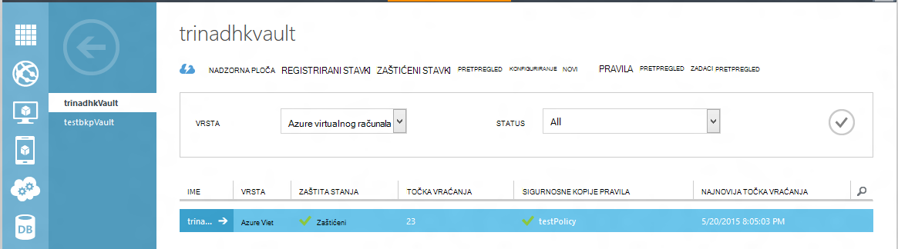
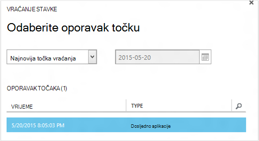
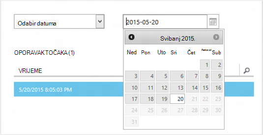
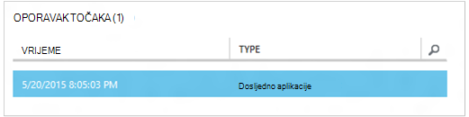
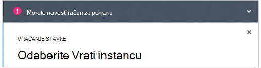
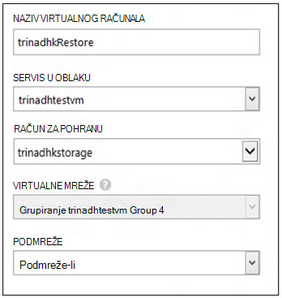
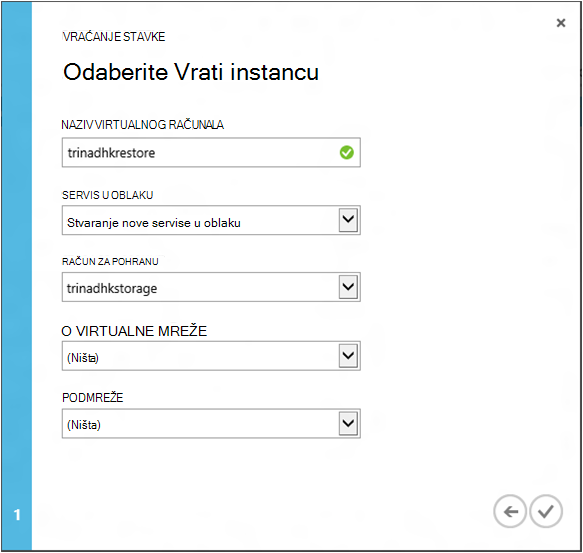
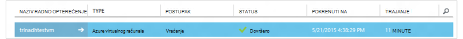

<properties
    pageTitle="Vraćanje virtualnim strojevima iz sigurnosne kopije | Microsoft Azure"
    description="Saznajte kako vratiti Azure virtualnog računala s oporavak točke"
    services="backup"
    documentationCenter=""
    authors="trinadhk"
    manager="shreeshd"
    editor=""
    keywords="Vraćanje sigurnosne kopije; Kako vratiti; oporavak zareza"/>

<tags
    ms.service="backup"
    ms.workload="storage-backup-recovery"
    ms.tgt_pltfrm="na"
    ms.devlang="na"
    ms.topic="article"
    ms.date="08/02/2016"
    ms.author="trinadhk; jimpark;"/>

# Vraćanje virtualnim strojevima servisu Azure

> [AZURE.SELECTOR]
- [Vraćanje VMs portalu za Azure](backup-azure-arm-restore-vms.md)
- [Vraćanje VMs klasični portalu](backup-azure-restore-vms.md)

Vraćanje virtualnog računala da biste novi VM iz sigurnosne kopije pohranjene u Azure sigurnosne kopije sigurnog sa sljedećim koracima.

## Vraćanje tijeka rada

### 1. Odaberite stavku koju želite vratiti

1. Idite na karticu **Zaštićeni stavke** , a zatim odaberite virtualnog računala koju želite vratiti novi VM.

    

    Stupac **Točka vraćanja** na stranici **Zaštićeni stavke** se broj točaka oporavak za virtualnog računala. Stupac **Točka vraćanja najnovijeg** obavijestit će vas vrijeme najnovija sigurnosna kopija iz kojeg se može vratiti virtualnog računala.

2. Kliknite **Vrati** da biste otvorili čarobnjak za **vraćanje stavke** .

    

### 2. Odaberite točka vraćanja

1. Na zaslonu za **Odabir točke oporavka** možete vratiti najnovija točka vraćanja ili iz prethodne točke u vremenu. Zadana mogućnost odabrali prilikom otvorit će se Čarobnjak je *Točka vraćanja najnovijeg*.

    

2. Da biste odabrali ranije točke u vremenu, odaberite mogućnost za **Odabir datuma** na padajućem popisu, a zatim odaberite datum u kontroli kalendara klikom na **ikonu kalendara**. U kontroli sve datume koji imaju oporavak točke popunjavaju se osnovna nijanse sive i su moguće odabrati korisnik.

    

    Kada kliknete datum u kontroli kalendara, oporavak upućuje dostupni na datum će se prikazati u dolje navedenoj tablici točke oporavak. Stupac **vrijeme** označava vrijeme snimljena snimke. U stupcu **Vrsta** prikazuje [dosljednost](https://azure.microsoft.com/documentation/articles/backup-azure-vms/#consistency-of-recovery-points) točka vraćanja. Zaglavlja tablice prikazuje broj točaka oporavak dostupne na taj dan u zagrade.

    

3. Odaberite točke oporavak tablici **Oporavak točke** , a zatim kliknite strelica sljedeće da biste prešli na sljedećem zaslonu.

### 3. Navedite odredišnog mjesta

1. Na zaslonu **Odaberite Vrati instancu** navedite detalje o gdje da biste vratili virtualnog računala.

  - Navedite naziv virtualnog računala: U navedeni u oblaku, mora biti jedinstven naziv virtualnog računala. Ne podržavamo previše postojeće VM za pisanje. 
  - Odaberite neki servis u oblaku za na VM: to je obavezan za stvaranje na VM. Možete koristiti postojeće oblaku ili stvorite novi servis u oblaku.

        Whatever cloud service name is picked should be globally unique. Typically, the cloud service name gets associated with a public-facing URL in the form of [cloudservice].cloudapp.net. Azure will not allow you to create a new cloud service if the name has already been used. If you choose to create select create a new cloud service, it will be given the same name as the virtual machine – in which case the VM name picked should be unique enough to be applied to the associated cloud service.

        We only display cloud services and virtual networks that are not associated with any affinity groups in the restore instance details. [Learn More](../virtual-network/virtual-networks-migrate-to-regional-vnet.md).

2. Odaberite račun za pohranu za na VM: to je obavezan za stvaranje na VM. Na raspolaganju su vam postojećih računa za pohranu u području isti kao sigurnog Azure sigurnosnu kopiju. Ne podržavamo račune za pohranu koji će biti zonu suvišne ili vrste Premium prostora za pohranu.

    Ako nema prostora za pohranu računa s konfiguracijom podržani, stvorite račun za pohranu podržani konfiguracije prije pokretanja postupak vraćanja.

    

3. Odaberite virtualne mreže: prilikom stvaranja na VM mora biti označena virtualne mreže (VNET) za virtualnog računala. Vraćanje korisničkog Sučelja prikazuje sve VNETs unutar ove pretplate koje je moguće koristiti. Nije obavezno da biste odabrali na VNET za vraćene VM – moći povezati vraćene virtualnog računala putem Interneta čak i ako nije primijenjena na VNET.

    Ako je odabran servisa u oblaku povezana s virtualne mreže, ne možete promijeniti virtualne mreže.

    

4. Odaberite podmreži: U slučaju da se VNET ima podmreže, po zadanom prvi podmreže će biti odabran. S padajućeg izbornika mogućnosti odaberite podmreži po izboru. Podmreže pojedinosti potražite u mrežama proširenja na [početnoj stranici portala](https://manage.windowsazure.com/), idite na **Virtualne mreže** odaberite virtualne mreže i naniže u Konfiguriraj da biste vidjeli detalje podmreže.

    

5. Kliknite ikonu **Pošalji** u čarobnjaku da biste poslali pojedinosti i stvorite posao vraćanja.

## Pratite postupak vraćanja
Nakon što ste sve podatke u čarobnjak za vraćanje za unos i poslali ga sigurnosne kopije Azure će pokušati da biste stvorili zadatak da biste pratili postupak vraćanja.

Ako je zadatak stvaranja uspije, vidjet ćete na skočnoj obavijesti koja označava da se stvara zadatak. Više detalja možete dobiti klikom na gumb **Prikaz posla** koji će vas odvesti **poslove** kartica.

Po dovršetku postupak vraćanja će biti označen kao dovršen na kartici **Zadaci** .

Nakon vraćanja virtualnog računala možda ćete morati ponovno instalirati extensions postojeće na izvornom VM i [Izmjena krajnjih točaka](../virtual-machines/virtual-machines-windows-classic-setup-endpoints.md) za virtualnog računala na portalu za Azure.

## Naknadno vraćanje korake
Ako koristite raspodjele Linux oblaka pokretanja temelji kao što su Ubuntu, sigurnosnih vam razloga, bit će blokirane lozinku objavljuju vraćanja. Koristite VMAccess nastavak vraćene VM ponovno postavljanje [lozinke](../virtual-machines/virtual-machines-linux-classic-reset-access.md). Preporučujemo korištenje SSH tipke na te distribucija da biste izbjegli ponovno postavljanje lozinke objavu vraćanja. 

## Sigurnosna kopija vraćene VMs
Ako ste vratili VM isti servis u oblaku s istim nazivom kao izvorno sigurnosno VM, sigurnosno kopiranje će i dalje na objavu vraćanja VM. Ako imate vraćena Vm na drugi servis u oblaku ili navedeni neki drugi naziv vraćene VM, to će se smatrati novi VM i vraćene VM potrebno sigurnosno kopirati postavljanje.

## Vraćanje na VM tijekom Azure Izrada podatkovnim centrom
Azure sigurnosne kopije omogućuje vraćanje sigurnosne kopije VMs u paru podatkovnog centra u slučaju primarne centrirali gdje VMs koristite Izrada sučelja i konfigurirali sigurnosno kopiranje zbirke ključeva biti suvišnih zemlj.. Tijekom takvim slučajevima, morate odabrati račun za pohranu koji je koje su prisutne u paru podatkovnog centra, a ostatak postupak vraćanja ostaju iste. Azure sigurnosne kopije koristi računalnim servisa upareni zemlj da biste stvorili vraćene virtualnog računala. 

## Vraćanje VMs kontroler domene
Sigurnosne kopije kontroler domene (Kontroler) virtualnim strojevima je podržana scenarij pomoću sigurnosnog kopiranja Azure. No neke, potrebno je poduzeti tijekom postupka vraćanja. Sučelje za vraćanje razlikuje se vastly VMs kontroler domene u konfiguraciji jednostruko Kontroler nasuprot VMs u konfiguraciji višestruki Kontroler.

### Jedan kontroler domene
Na VM iz moguće vratiti (kao što je bilo koji drugi VM) na Azure portala i pomoću komponente PowerShell.

### Više skupa
Ako imate više Kontroler okruženja, kontrolera domena imati vlastite način čuvanje podataka u sinkronizaciji. Kada je starije sigurnosne kopije točke vraćene *bez odgovarajuće mjere opreza*, u USN vraćanje postupak možete wreak havoc u okruženju višestruki Kontroler. U desno da biste oporavili takve VM tako da pokretanje u načinu DSRM.

Problem nastaje jer DSRM način ne postoji u Azure. Tako da biste vratili takve VM, nećete moći koristiti portal za Azure. Jedini podržane vraćanja mehanizam je temeljenog na disku vraćanja pomoću komponente PowerShell.

>[AZURE.WARNING] Za VMs kontroler domene u okruženju višestruki Kontroler, nemojte koristiti Azure portal za vraćanje! Podržana je samo PowerShell temelji vraćanja

Dodatne informacije o [USN vraćanje problema](https://technet.microsoft.com/library/dd363553) i strategije predložena alata za popravak.

## Vraćanje VMs s posebnim mrežnim konfiguracijama
Azure sigurnosne kopije podržava sigurnosne kopije za iza posebne mrežnim konfiguracijama virtualnih računala.

- VMs u odjeljku opterećenja (interne i vanjske)
- VMs s više rezerviranih IP-ovi
- VMs s više NIC-ovi

Ove konfiguracije prema iza okolnosti pri vraćanju.

>[AZURE.TIP] Ponovno stvorite posebne mrežnoj konfiguraciji VMs objavu vraćanja pomoću tijek vraćanja PowerShell temelje.

### Vraćanje iz korisničkog Sučelja:
Prilikom vraćanja iz korisničko Sučelje, **uvijek odaberite novi servis u oblaku**. Uzmite u obzir jer portal samo vodi obavezno parametara tijekom vraćanja protok VMs vratiti korištenjem korisničkog Sučelja ćete izgubiti posebno mrežna konfiguracija oni imaju. Drugim riječima, vraćanje VMs bit će normalno VMs bez konfiguracije raspoređivača opterećenja ili više SLIKA ili više IP rezervirane.

### Vraćanje iz komponente PowerShell:
PowerShell sadrži mogućnost samo vratiti diskova VM iz sigurnosne kopije, a zatim nije moguće stvoriti virtualnog računala. To je korisno kada vraćanje virtualnim strojevima koji zahtijevaju posebnim mrežnim konfiguracijama mentined iznad.

Da biste u potpunosti ponovno stvorite diskova vraćanje podataka za objavu na virtualnog računala, slijedite ove korake:

1. Vraćanje na diskova iz sigurnosne kopije sigurnog korištenja [Azure sigurnosne kopije PowerShell](../backup-azure-vms-classic-automation.md#restore-an-azure-vm)

2. Stvaranje config VM potrebne za opterećenja / više NIC-više Rezervirana IP pomoću cmdleta ljuske PowerShell i koristite da biste stvorili VM od želji konfiguracije.
    - Stvaranje VM u oblaku s [internim opterećenja](https://azure.microsoft.com/documentation/articles/load-balancer-internal-getstarted/)
    - Stvaranje VM povezivanje [Internetom nasuprotne opterećenja] (https://azure.microsoft.com/en-us/documentation/articles/load-balancer-internet-getstarted/)
    - Stvaranje VM s [više NIC-ovi](https://azure.microsoft.com/documentation/articles/virtual-networks-multiple-nics/)
    - Stvaranje VM s [više rezerviranih IP-ovi](https://azure.microsoft.com/documentation/articles/virtual-networks-reserved-public-ip/)

## Daljnji koraci
- [Otklanjanje poteškoća](backup-azure-vms-troubleshoot.md#restore)
- [Upravljanje virtualnim strojevima](backup-azure-manage-vms.md)
