<properties
   pageTitle="Vratiti podatke za Windows Server ili Windows klijent iz Azure pomoću modela uvođenje klasičnog | Microsoft Azure"
   description="Saznajte kako vratiti iz programa Windows Server ili klijenta sustava Windows."
   services="backup"
   documentationCenter=""
   authors="saurabhsensharma"
   manager="shivamg"
   editor=""/>

<tags
   ms.service="backup"
   ms.workload="storage-backup-recovery"
     ms.tgt_pltfrm="na"
     ms.devlang="na"
     ms.topic="article"
     ms.date="08/02/2016"
     ms.author="trinadhk; jimpark; markgal;"/>

# Vraćanje datoteka Windows server ili Windows klijentskom računalu pomoću modela klasični implementacije

> [AZURE.SELECTOR]
- [Klasični portal](backup-azure-restore-windows-server-classic.md)
- [Portal za Azure](backup-azure-restore-windows-server.md)

U ovom se članku objašnjava pravilan postupak potrebne za izvršavanje dvije vrste operacija vraćanja:

- Vraćanje podataka na tom računalu iz kojeg je sigurnosnih kopija okrenutim.
- Vraćanje podataka na drugo računalo.

U oba slučaja učitavanja podataka iz zbirke ključeva Azure sigurnosnu kopiju.

[AZURE.INCLUDE [learn-about-deployment-models](../../includes/learn-about-deployment-models-classic-include.md)]

## Oporavak podataka na tom računalu
Ako slučajno izbrisane datoteke, a želite ga vratiti na tom računalu (iz kojeg sigurnosne kopije uzeti), na sljedeći način olakšava oporaviti podatke.

1. Otvorite **Microsoft Azure Backup** poravnavanja u.
2. Kliknite **Oporavi podatke** za pokretanje tijeka rada.

    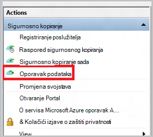

3. Odaberite na * *ovaj poslužitelj (*yourmachinename*) ** mogućnost vraćanja sigurnosne kopije datoteke na istom računalu.

    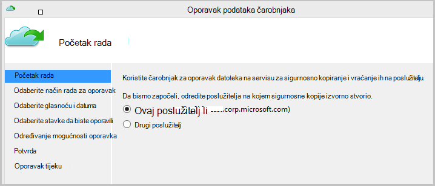

4. Odaberite da biste **pregledali datoteke** ili **pretraživanje datoteka**.

    Ako namjeravate vratiti jednu ili više datoteka čiji put je poznato, ostavite zadanu mogućnost. Ako niste sigurni o struktura mape, ali želite da biste pronašli datoteku, odaberite mogućnost **pretraživanja za datoteke** . Radi u ovom se odjeljku smo će nastaviti s zadana mogućnost.

    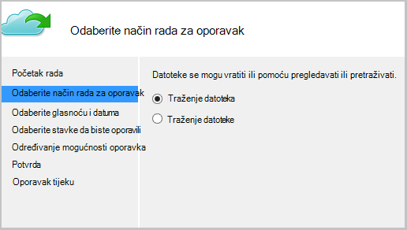

5. Odaberite jedinice iz kojeg želite vratiti.

    Možete se vratiti na bilo kojem mjestu u vremenu. Datumi koji se pojavljuju u **Podebljano** u kontroli kalendara označavaju dostupnost točku vraćanja. Kada je odabrana datum, na temelju raspored sigurnosnog kopiranja (i sigurnosne kopije operacije), možete odabrati točku u vremenu od na padajućem izborniku **vrijeme** prema dolje.

    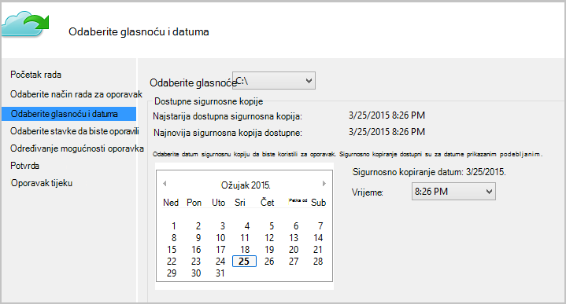

6. Odabir stavki za oporavak. Možete višestrukog odabira mape i datoteke koju želite vratiti.

    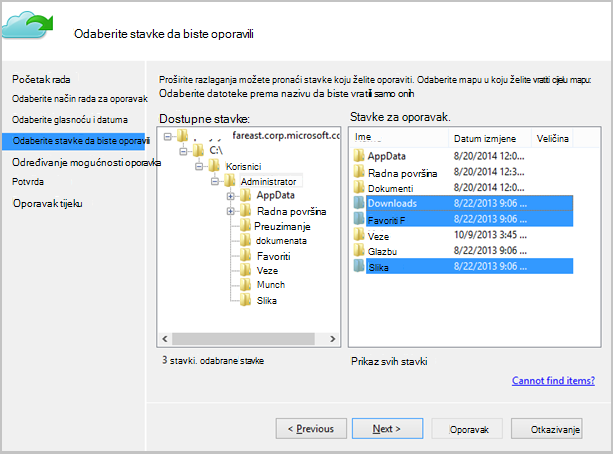

7. Odredite parametre za oporavak.

    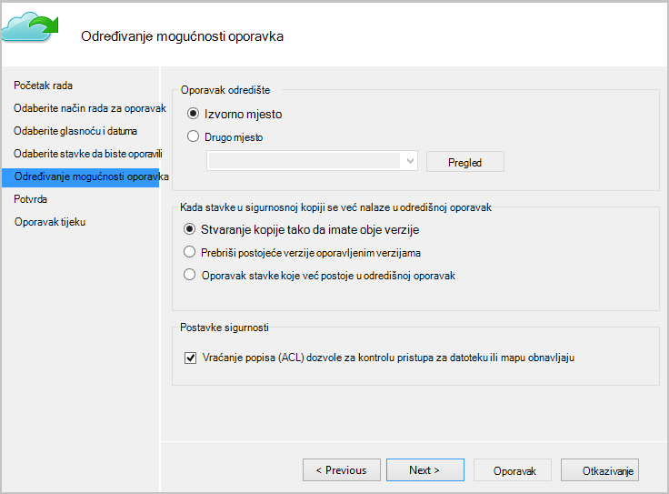

  - Imate mogućnost vraćanja na izvorno mjesto (u kojoj datoteka/mapa će prebrisati) ili na drugo mjesto u istom.
  - Ako postoji mapa koje želite vratiti u odredišnog mjesta, možete stvoriti kopije (dvije verzije iste datoteke), prebrisati datoteke na odredištu ili preskočiti oporavak datoteka koje postoji u ciljnom.
  - Preporučujemo da ostavite zadana mogućnost vraćanja ACL-a na datoteke koje su obnavljaju.

8. Kada su dani te unose, kliknite **Dalje**. Tijek rada oporavak, koji vraća datoteke na ovom računalu, će početi.

## Oporavak zamjenski računalo
Ako je poslužitelj za cijelu izgubiti, i dalje možete oporaviti podatke iz sigurnosne kopije Azure na drugo računalo. Sljedeći koraci objašnjavaju tijeka rada.  

Obuhvaća terminologija koristi u ove korake:

- *Izvor računalu* – izvornog računala iz koji sigurnosne kopije snimljena te koji je trenutno nije dostupna.
- *Ciljnom računalu* – na računalu na koje je obnavljaju podatke.
- *Ogledna sigurnog* – u sigurnosne kopije sigurnog kojoj *stroj izvora* i *ciljnom računalu* registrirane.  

> [AZURE.NOTE] Sigurnosno kopiranje uzeti stroj nije moguće vratiti na računalo koje koristi stariju verziju operacijskog sustava. Ako, na primjer, ako sigurnosne kopije uzimaju se s računala za Windows 7, može ga vratiti na sustavu Windows 8 ili noviji računala. No u obratno ne držite true.

1. Otvorite **Microsoft Azure Backup** poravnavanja u na *ciljnom računalu*.
2. Provjerite je li *ciljnom računalu* i *izvor računalu* registrirane na istom sigurnosno kopiranje zbirke ključeva.
3. Kliknite **Oporavi podatke** za pokretanje tijeka rada.

    

4. Odaberite **drugi poslužitelj**

    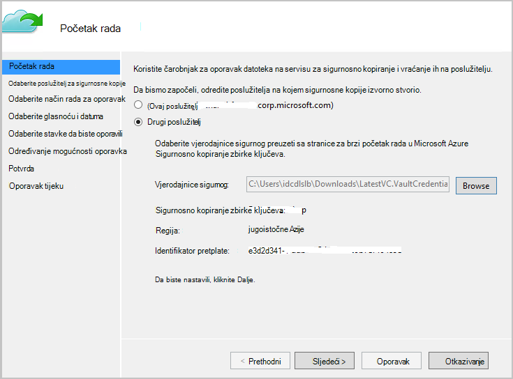

5. Pružanje datoteci vjerodajnica sigurnog koji odgovara *sigurnog uzorka*. Ako je datoteka vjerodajnica zbirke ključeva koji nisu valjani (ili istekle) preuzmite nove datoteke vjerodajnica sigurnog iz *uzorka sigurnog* Azure klasični portalu. Kada datoteku vjerodajnica sigurnog nije naveden, prikazat će se sigurnosno kopiranje zbirke ključeva protiv vjerodajnica datoteke zbirke ključeva.

6. Odaberite *izvor računala* s popisa prikazanog strojeva.

    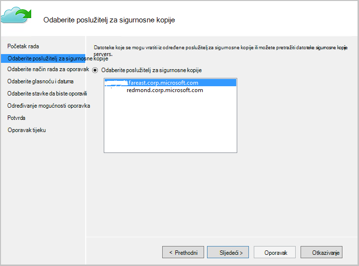

7. Odaberite mogućnost **pretraživanja za datoteke** ili **potražiti datoteke** . Radi u ovom se odjeljku koristit ćemo mogućnost **pretraživanja za datoteke** .

    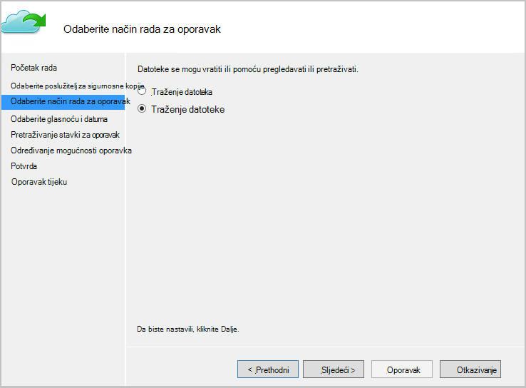

8. Odaberite glasnoću i datuma na sljedećem zaslonu. Traženje naziv mape i datoteke koju želite vratiti.

    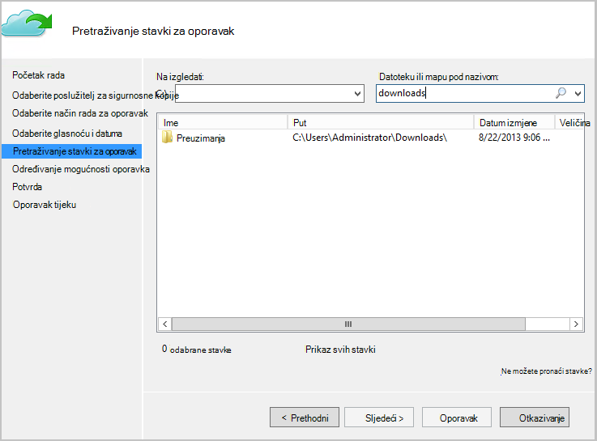

9. Odaberite mjesto na kojem datoteke morate vratiti.

    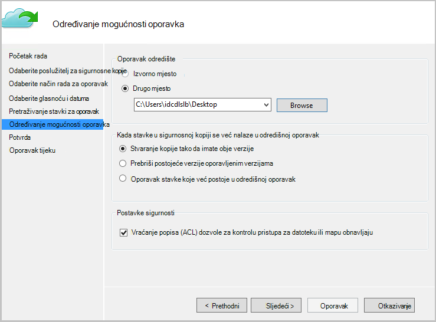

10. Unesite pristupni izraz za šifriranje koju ste dobili tijekom registracije *izvornog računala* *sigurnog uzorka*.

    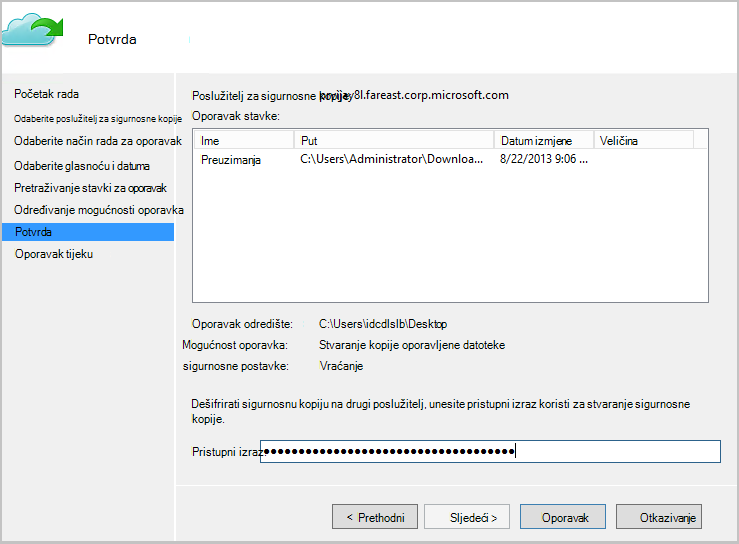

11. Kada unos nije naveden, kliknite **Oporavi**, koji se pokreće vraćanja sigurnosne datoteke da biste dobili odredište.

## Daljnji koraci
- [Najčešća pitanja o Azure sigurnosne kopije](backup-azure-backup-faq.md)
- Posjetite [Forum za Azure sigurnosne kopije](http://go.microsoft.com/fwlink/p/?LinkId=290933).

## uči više
- [Azure pregled sigurnosne kopije](http://go.microsoft.com/fwlink/p/?LinkId=222425)
- [Sigurnosno kopiranje Azure virtualnim strojevima](backup-azure-vms-introduction.md)
- [Sigurnosno kopiranje gore radnih opterećenja Microsoft](backup-azure-dpm-introduction.md)
