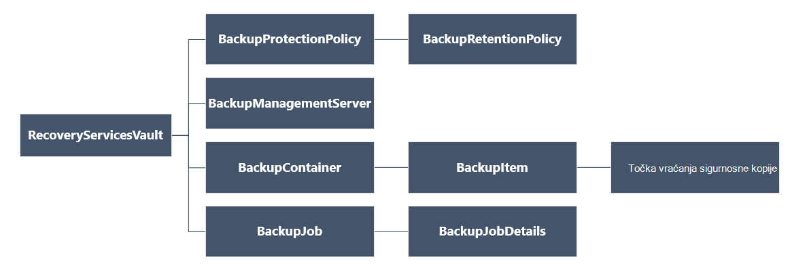
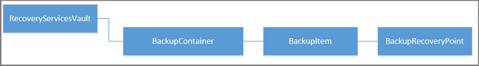

<properties
   pageTitle="Upravljanje sigurnosne kopije za resursima implementiran VMs pomoću komponente PowerShell i | Microsoft Azure"
   description="Uvođenje i upravljanje kopija u Azure za resursima implementiran VMs pomoću komponente PowerShell"
   services="backup"
   documentationCenter=""
   authors="markgalioto"
   manager="cfreeman"
   editor=""/>

<tags
   ms.service="backup"
   ms.devlang="na"
   ms.topic="article"
   ms.tgt_pltfrm="na"
   ms.workload="storage-backup-recovery"
   ms.date="08/03/2016"
   ms.author="markgal; trinadhk"/>

# <a name="deploy-and-manage-backups-for-resource-manager-deployed-vms-using-powershell"></a>Uvođenje i upravljanje sigurnosne kopije za resursima implementiran VMs pomoću komponente PowerShell

> [AZURE.SELECTOR]
- [Voditelj resursa](backup-azure-vms-automation.md)
- [Klasični](backup-azure-vms-classic-automation.md)

U ovom se članku objašnjava pomoću cmdleta ljuske PowerShell Azure sigurnosno kopirati, a zatim Oporavi Azure virtualnog računala (VM) iz zbirke ključeva servisa za oporavak. Oporavak servisa sigurnog programa resurs Voditelj resursa Azure i se koristi za zaštitu podataka i resursima u servisa Azure sigurnosne kopije i oporavak Azure web-mjesta. Oporavak servisa sigurnog možete koristiti da biste zaštitili Upravitelj servisa Azure implementiran VMs, kao i upravljanja resursima Azure implementiran VMs.

>[AZURE.NOTE] Azure sadrži dvije implementacije modela za stvaranje i rad s resursima: [Voditelj resursa i Classic](../resource-manager-deployment-model.md). U ovom se članku je za korištenje s VMs stvoren pomoću modela Voditelj resursa.

U ovom se članku vodit će vas kroz pomoću komponente PowerShell da biste zaštitili na VM i vratiti podatke iz točka vraćanja.

## <a name="concepts"></a>Koncepti

Ako niste upoznati sa servisom Azure sigurnosnu kopiju da biste saznali kako servisa, pogledajte [što je sigurnosne kopije Azure?](backup-introduction-to-azure-backup.md) Prije nego što počnete, provjerite je li da prekrije Osnove o preduvjeti potreban za rad s Azure sigurnosne kopije i ograničenja trenutnog VM sigurnosne kopije rješenja.

Da biste učinkovito pomoću komponente PowerShell je potrebno da biste shvatili hijerarhije objekata i iz koje treba pokrenuti.



Cmdlet referenca AzureRmRecoveryServicesBackup PowerShell potražite u članku [Sigurnosne kopije Azure - cmdleti za oporavak servisa](https://msdn.microsoft.com/library/mt723320.aspx) Azure bibliotekom.
Cmdlet referenca AzureRmRecoveryServicesVault PowerShell potražite u članku [Cmdleti za oporavak servisom za Azure](https://msdn.microsoft.com/library/mt643905.aspx).


## <a name="setup-and-registration"></a>Postavljanje i Registracija

Da biste započeli:

1. [Preuzmite najnoviju verziju programa PowerShell](https://github.com/Azure/azure-powershell/releases) (Minimalna verzija potrebno je: 1.4.0)

2. Da biste pronašli cmdleta Azure sigurnosne kopije PowerShell dostupna tako da upišete sljedeću naredbu:

```
PS C:\> Get-Command *azurermrecoveryservices*

CommandType     Name                                               Version    Source
-----------     ----                                               -------    ------
Cmdlet          Backup-AzureRmRecoveryServicesBackupItem           1.4.0      AzureRM.RecoveryServices.Backup
Cmdlet          Disable-AzureRmRecoveryServicesBackupProtection    1.4.0      AzureRM.RecoveryServices.Backup
Cmdlet          Enable-AzureRmRecoveryServicesBackupProtection     1.4.0      AzureRM.RecoveryServices.Backup
Cmdlet          Get-AzureRmRecoveryServicesBackupContainer         1.4.0      AzureRM.RecoveryServices.Backup
Cmdlet          Get-AzureRmRecoveryServicesBackupItem              1.4.0      AzureRM.RecoveryServices.Backup
Cmdlet          Get-AzureRmRecoveryServicesBackupJob               1.4.0      AzureRM.RecoveryServices.Backup
Cmdlet          Get-AzureRmRecoveryServicesBackupJobDetails        1.4.0      AzureRM.RecoveryServices.Backup
Cmdlet          Get-AzureRmRecoveryServicesBackupManagementServer  1.4.0      AzureRM.RecoveryServices.Backup
Cmdlet          Get-AzureRmRecoveryServicesBackupProperties        1.4.0      AzureRM.RecoveryServices
Cmdlet          Get-AzureRmRecoveryServicesBackupProtectionPolicy  1.4.0      AzureRM.RecoveryServices.Backup
Cmdlet          Get-AzureRMRecoveryServicesBackupRecoveryPoint     1.4.0      AzureRM.RecoveryServices.Backup
Cmdlet          Get-AzureRmRecoveryServicesBackupRetentionPolic... 1.4.0      AzureRM.RecoveryServices.Backup
Cmdlet          Get-AzureRmRecoveryServicesBackupSchedulePolicy... 1.4.0      AzureRM.RecoveryServices.Backup
Cmdlet          Get-AzureRmRecoveryServicesVault                   1.4.0      AzureRM.RecoveryServices
Cmdlet          Get-AzureRmRecoveryServicesVaultSettingsFile       1.4.0      AzureRM.RecoveryServices
Cmdlet          New-AzureRmRecoveryServicesBackupProtectionPolicy  1.4.0      AzureRM.RecoveryServices.Backup
Cmdlet          New-AzureRmRecoveryServicesVault                   1.4.0      AzureRM.RecoveryServices
Cmdlet          Remove-AzureRmRecoveryServicesProtectionPolicy     1.4.0      AzureRM.RecoveryServices.Backup
Cmdlet          Remove-AzureRmRecoveryServicesVault                1.4.0      AzureRM.RecoveryServices
Cmdlet          Restore-AzureRMRecoveryServicesBackupItem          1.4.0      AzureRM.RecoveryServices.Backup
Cmdlet          Set-AzureRmRecoveryServicesBackupProperties        1.4.0      AzureRM.RecoveryServices
Cmdlet          Set-AzureRmRecoveryServicesBackupProtectionPolicy  1.4.0      AzureRM.RecoveryServices.Backup
Cmdlet          Set-AzureRmRecoveryServicesVaultContext            1.4.0      AzureRM.RecoveryServices
Cmdlet          Stop-AzureRmRecoveryServicesBackupJob              1.4.0      AzureRM.RecoveryServices.Backup
Cmdlet          Unregister-AzureRmRecoveryServicesBackupContainer  1.4.0      AzureRM.RecoveryServices.Backup
Cmdlet          Unregister-AzureRmRecoveryServicesBackupManagem... 1.4.0      AzureRM.RecoveryServices.Backup
Cmdlet          Wait-AzureRmRecoveryServicesBackupJob              1.4.0      AzureRM.RecoveryServices.Backup
```


Sa servisom PowerShell moguće je automatizirati sljedeće zadatke:

- Stvaranje oporavak servisa sigurnog
- Sigurnosno kopiranje ili zaštita Azure VMs
- Pokretanje zadatka sigurnosnog kopiranja
- Praćenje zadatka sigurnosnog kopiranja
- Vraćanje Azure VM

## <a name="create-a-recovery-services-vault"></a>Stvaranje sigurnog za usluge oporavak

Sljedeći koraci će vas voditi kroz stvaranje oporavak servisa sigurnog. Oporavak servisa sigurnog razlikuje se od zbirke ključeva za sigurnosno kopiranje.

1. Ako koristite Azure sigurnosnu kopiju, morate koristiti cmdlet **[Register AzureRMResourceProvider](https://msdn.microsoft.com/library/mt679020.aspx)** da biste registrirali Azure oporavak usluga s pretplatom.

    ```
    PS C:\> Register-AzureRmResourceProvider -ProviderNamespace "Microsoft.RecoveryServices"
    ```

2. Oporavak servisa sigurnog je resursa u resursima da morate smjestite unutar grupu resursa. Možete koristiti postojeću grupu resursa ili stvoriti novu grupu resursa pomoću cmdleta **[New-AzureRmResourceGroup](https://msdn.microsoft.com/library/mt678985.aspx)** . Kada stvorite novu grupu resursa, navedite naziv i mjesto za grupu resursa.  

    ```
    PS C:\> New-AzureRmResourceGroup –Name "test-rg" –Location "West US"
    ```

3. Pomoću cmdleta **[New-AzureRmRecoveryServicesVault](https://msdn.microsoft.com/library/mt643910.aspx)** da biste stvorili novi zbirke ključeva. Ne zaboravite da biste odredili na isto mjesto za na sigurnog kao što je korišten za grupu resursa.

    ```
    PS C:\> New-AzureRmRecoveryServicesVault -Name "testvault" -ResourceGroupName " test-rg" -Location "West US"
    ```

4. Određivanje vrste zalihosti prostora za pohranu za korištenje; možete koristiti [Lokalno suvišne prostora za pohranu (LRS)](../storage/storage-redundancy.md#locally-redundant-storage) ili [Zemlj suvišne prostora za pohranu (GRS)](../storage/storage-redundancy.md#geo-redundant-storage). Sljedeći primjer prikazuje mogućnost - BackupStorageRedundancy za testVault postavljen na GeoRedundant.

    ```
    PS C:\> $vault1 = Get-AzureRmRecoveryServicesVault –Name "testVault"
    PS C:\> Set-AzureRmRecoveryServicesBackupProperties  -Vault $vault1 -BackupStorageRedundancy GeoRedundant
    ```

    > [AZURE.TIP] Mnoge cmdleti za sigurnosno kopiranje Azure zahtijevaju oporavak servisa sigurnog objekt kao ulaz. Zbog toga je prikladno za pohranu zbirke ključeva objekta servisa za oporavak sigurnosne kopije u varijablu.

## <a name="view-the-vaults-in-a-subscription"></a>Prikaz sefova u pretplatu
**[Get-AzureRmRecoveryServicesVault](https://msdn.microsoft.com/library/mt643907.aspx)** koristite da biste vidjeli popis svih sefovi u trenutne pretplate. Ta se naredba možete koristiti da biste provjerili je stvorena nova sigurnog ili da biste vidjeli što sefovi dostupne u pretplatu.

Pokrenite naredbu Get-AzureRmRecoveryServicesVault i navedeni su sve sefovi u pretplate.

```
PS C:\> Get-AzureRmRecoveryServicesVault
Name              : Contoso-vault
ID                : /subscriptions/1234
Type              : Microsoft.RecoveryServices/vaults
Location          : WestUS
ResourceGroupName : Contoso-docs-rg
SubscriptionId    : 1234-567f-8910-abc
Properties        : Microsoft.Azure.Commands.RecoveryServices.ARSVaultProperties
```


## <a name="backup-azure-vms"></a>Sigurnosno kopiranje Azure VMs
Sad kad ste stvorili sigurnog za usluge oporavak, možete je koristiti za zaštitu virtualnog računala. Međutim prije primjene zaštitu, morate postaviti kontekst sigurnog i želite da biste provjerili pravilnik o zaštiti. Kontekst sigurnog definira vrstu podataka koja je zaštićena u na zbirke ključeva. Pravilnik o zaštiti je raspored kada se pokrene sigurnosno kopiranje i koliko se zadržavaju svaki sigurnosne kopije snimke.

Prije omogućivanja zaštite u VM, morate postaviti sigurnog kontekstu. Kontekst primjenjuje se na sve sljedeće Cmdlete.

```
PS C:\> Get-AzureRmRecoveryServicesVault -Name testvault | Set-AzureRmRecoveryServicesVaultContext
```

### <a name="create-a-protection-policy"></a>Stvaranje pravila za zaštitu

Prilikom stvaranja nove zbirke ključeva dolazi s zadani pravilnik. Ovo pravilo pokreće sigurnosno kopiranje svakog dana u određeno vrijeme. Po zadani pravilnik sigurnosne kopije snimke zadržava se 30 dana. Možete koristiti zadani pravilnik brzo Zaštita vaše VM i uređivanje pravilnika kasnije s različitim pojedinosti.

**[Get-AzureRmRecoveryServicesBackupProtectionPolicy](https://msdn.microsoft.com/library/mt723300.aspx)** koristiti radi prikaza na popisu raspoloživih pravila u sigurnog:

```
PS C:\> Get-AzureRmRecoveryServicesBackupProtectionPolicy -WorkloadType AzureVM
Name                 WorkloadType       BackupManagementType BackupTime                DaysOfWeek
----                 ------------       -------------------- ----------                ----------
DefaultPolicy        AzureVM            AzureVM              4/14/2016 5:00:00 PM
```

> [AZURE.NOTE] Vremenska zona BackupTime polju u ljusci PowerShell je UTC-a. Međutim, kad sigurnosne kopije vrijeme je prikazano na portalu za Azure, vrijeme je prilagoditi kako bi vaše lokalne vremenska zona.

Zaštita sigurnosne kopije pravila je pridružen barem jedan pravilnika o zadržavanju.  Pravila zadržavanja određuje koliko točku oporavak čuva se sigurnosno kopiranje Azure. **Get-AzureRmRecoveryServicesBackupRetentionPolicyObject** koristite da biste prikazali zadani pravilnik zadržavanja.  Na sličan način možete koristiti **Get-AzureRmRecoveryServicesBackupSchedulePolicyObject** da biste dobili zadani Pravilnik za raspored. Objekti pravilnika za raspored i zadržavanja se koriste kao unosi u cmdleta **New-AzureRmRecoveryServicesBackupProtectionPolicy** .

Zaštita sigurnosne kopije pravila određuje kada i kako često sigurnosnu kopiju stavke gotovo. Cmdlet novo AzureRmRecoveryServicesBackupProtectionPolicy stvara objekt PowerShell koja sadrži informacije o pravilima sigurnosne kopije. Sigurnosne kopije pravila koristi se kao ulaz cmdletu Enable AzureRmRecoveryServicesBackupProtection.

```
PS C:\> $schPol = Get-AzureRmRecoveryServicesBackupSchedulePolicyObject -WorkloadType "AzureVM"
PS C:\>  $retPol = Get-AzureRmRecoveryServicesBackupRetentionPolicyObject -WorkloadType "AzureVM"
PS C:\>  New-AzureRmRecoveryServicesBackupProtectionPolicy -Name "NewPolicy" -WorkloadType AzureVM -RetentionPolicy $retPol -SchedulePolicy $schPol
Name                 WorkloadType       BackupManagementType BackupTime                DaysOfWeek
----                 ------------       -------------------- ----------                ----------
NewPolicy           AzureVM            AzureVM              4/24/2016 1:30:00 AM
```

### <a name="enable-protection"></a>Omogući zaštitu

Omogućivanje zaštitu obuhvaća dva objekta – do stavke i pravila. Da biste omogućili zaštitu na na sigurnog moraju i objekte. Kada pravila povezan je s na sigurnog, sigurnosne kopije tijek rada se pokreće trenutku definirano u rasporedu pravila.

Da biste omogućili zaštitu na koje nisu šifrirane VMs ARM

```
PS C:\> $pol=Get-AzureRmRecoveryServicesBackupProtectionPolicy -Name "NewPolicy"
PS C:\> Enable-AzureRmRecoveryServicesBackupProtection -Policy $pol -Name "V2VM" -ResourceGroupName "RGName1"
```

Da biste omogućili zaštitu na šifrirane VMs [šifriranjem BEK i KEK], morate dati dozvole za servis Azure sigurnosnu kopiju da biste pročitali ključeva i tajne iz ključa zbirke ključeva. 

```
PS C:\> Set-AzureRmKeyVaultAccessPolicy -VaultName 'KeyVaultName' -ResourceGroupName 'RGNameOfKeyVault' -PermissionsToKeys backup,get,list -PermissionsToSecrets get,list -ServicePrincipalName 262044b1-e2ce-469f-a196-69ab7ada62d3
PS C:\> $pol=Get-AzureRmRecoveryServicesBackupProtectionPolicy -Name "NewPolicy"
PS C:\> Enable-AzureRmRecoveryServicesBackupProtection -Policy $pol -Name "V2VM" -ResourceGroupName "RGName1"
```

ASM temelji VMs

```
PS C:\>  $pol=Get-AzureRmRecoveryServicesBackupProtectionPolicy -Name "NewPolicy"
PS C:\>  Enable-AzureRmRecoveryServicesBackupProtection -Policy $pol -Name "V1VM" -ServiceName "ServiceName1"
```

### <a name="modify-a-protection-policy"></a>Izmjena pravilnik o zaštiti

Da biste izmijenili pravila izmjena objekta BackupSchedulePolicyObject ili BackupRetentionPolicy i izmjena pravila pomoću skupa AzureRmRecoveryServicesBackupProtectionPolicy

Sljedeći primjer mijenja se broj zadržavanja 365.

```
PS C:\> $retPol = Get-AzureRmRecoveryServicesBackupRetentionPolicyObject -WorkloadType "AzureVM"
PS C:\> $retPol.DailySchedule.DurationCountInDays = 365
PS C:\> $pol= Get-AzureRmRecoveryServicesBackupProtectionPolicy -Name NewPolicy
PS C:\> Set-AzureRmRecoveryServicesBackupProtectionPolicy -Policy $pol  -RetentionPolicy  $RetPol
```

## <a name="run-an-initial-backup"></a>Pokretanje početne sigurnosnog kopiranja

Raspored sigurnosnog kopiranja pokreće potpuno sigurnosno kopiranje na početni natrag za stavku. Na sljedećim sigurnosne kopije, sigurnosne kopije je rastuće Kopiraj. Ako želite da biste nametnuli početne sigurnosnu kopiju da se dogodi u određeno vrijeme ili čak i odmah koristiti **[Sigurnosne kopije AzureRmRecoveryServicesBackupItem](https://msdn.microsoft.com/library/mt723312.aspx)** cmdlet:

```
PS C:\> $namedContainer = Get-AzureRmRecoveryServicesBackupContainer -ContainerType "AzureVM" -Status "Registered" -Name "V2VM"
PS C:\> $item = Get-AzureRmRecoveryServicesBackupItem -Container $namedContainer -WorkloadType "AzureVM"
PS C:\> $job = Backup-AzureRmRecoveryServicesBackupItem -Item $item
WorkloadName     Operation            Status               StartTime                 EndTime                   JobID
------------     ---------            ------               ---------                 -------                   ----------
V2VM              Backup               InProgress            4/23/2016 5:00:30 PM                       cf4b3ef5-2fac-4c8e-a215-d2eba4124f27
```

> [AZURE. Napomena: Vremenska zona polja StartTime i EndTime u ljusci PowerShell je UTC-a. Međutim, kad je vrijeme prikazan na portalu za Azure, vrijeme je prilagoditi kako bi vaše lokalne vremenska zona.

## <a name="monitoring-a-backup-job"></a>Nadzor zadatka sigurnosnog kopiranja

Većina dugoročnih postupaka sigurnosnog kopiranja Azure modelled su kao posao. To olakšava praćenje tijeka bez potrebe da biste zadržali Azure portal Otvori cijelo vrijeme.

Da biste dobili najnovije stanje sustava u tijeku zadatka, koristite cmdlet Get-AzureRmRecoveryservicesBackupJob.

```
PS C:\ > $joblist = Get-AzureRmRecoveryservicesBackupJob –Status InProgress
PS C:\ > $joblist[0]
WorkloadName     Operation            Status               StartTime                 EndTime                   JobID
------------     ---------            ------               ---------                 -------                   ----------
V2VM             Backup               InProgress            4/23/2016 5:00:30 PM           cf4b3ef5-2fac-4c8e-a215-d2eba4124f27
```

Umjesto ankete ove zadatke za dovršetak – što je nepotrebne dodatni kod – pomoću cmdleta **[Čekanja AzureRmRecoveryServicesBackupJob](https://msdn.microsoft.com/library/mt723321.aspx)** . Ovaj cmdlet zaustavlja izvršavanja dok se ne dovrši posao ili zbirka dostigne navedeni vremenskog ograničenja vrijednost.

```
PS C:\> Wait-AzureRmRecoveryServicesBackupJob -Job $joblist[0] -Timeout 43200
```

## <a name="restore-an-azure-vm"></a>Vraćanje Azure VM

Postoji ključne razlike između vraćanje VM pomoću portala za Azure i vraćanje VM pomoću komponente PowerShell. Pomoću komponente PowerShell postupak vraćanja dovršetka nakon stvaranja diskova i informacije o konfiguraciji od točke za oporavak. Postupak vraćanja nije moguće stvoriti virtualnog računala. Upute za stvaranje virtualnog računala s diskova postoje. Međutim, da biste potpuno vratili na VM, morate raditi putem sljedećih postupaka:

- Odaberite na VM
- Odaberite točku oporavak
- Vraćanje na disk
- Stvaranje na VM iz spremljene diskova

Zaokruženu na donjoj prikazuje hijerarhiji objekta iz RecoveryServicesVault prema dolje do na BackupRecoveryPoint.



Da biste vratili sigurnosne kopije podataka, odredite sigurnosno kopirane stavke i točka vraćanja koja sadrži podatkovne točke u vrijeme. Zatim pomoću cmdleta za **[Vraćanje AzureRmRecoveryServicesBackupItem](https://msdn.microsoft.com/library/mt723316.aspx)** da biste vratili podatke iz sustava sigurnog računu kupca.

### <a name="select-the-vm"></a>Odaberite na VM

Da biste objekt PowerShell koja služi za identifikaciju desno sigurnosnu kopiju stavke, pokretanje spremnik u na sigurnog i rade na način hijerarhiju objekta. Da biste odabrali spremnik koji predstavlja na VM, pomoću cmdleta **[Get-AzureRmRecoveryServicesBackupContainer](https://msdn.microsoft.com/library/mt723319.aspx)** i pipe koji cmdlet **[Get-AzureRmRecoveryServicesBackupItem](https://msdn.microsoft.com/library/mt723305.aspx)** .

```
PS C:\> $namedContainer = Get-AzureRmRecoveryServicesBackupContainer  -ContainerType AzureVM –Status Registered -Name 'V2VM'
PS C:\> $backupitem = Get-AzureRmRecoveryServicesBackupItem –Container $namedContainer  –WorkloadType "AzureVM"
```

### <a name="choose-a-recovery-point"></a>Odaberite točku oporavak

Pomoću cmdleta **[Get-AzureRmRecoveryServicesBackupRecoveryPoint](https://msdn.microsoft.com/library/mt723308.aspx)** popis svih točaka oporavak sigurnosne kopije stavke. Zatim odaberite oporavak točku da biste vratili. Ako niste sigurni koji točka vraćanja da biste koristili, dobro da biste odabrali najnovije RecoveryPointType je = AppConsistent točke na popisu.

U sljedeću skriptu je varijabla, **$rp**polje točaka oporavak za odabranu stavku sigurnosne kopije. Polja vremena s najnovijim oporavak točku u indeks 0 se sortira obrnutim redoslijedom. Pomoću standardnih polja PowerShell indeksiranje odaberite točka vraćanja. Na primjer: $rp [0] će odabir najnovije točke za oporavak.

```
PS C:\> $startDate = (Get-Date).AddDays(-7)
PS C:\> $endDate = Get-Date
PS C:\> $rp = Get-AzureRmRecoveryServicesBackupRecoveryPoint -Item $backupitem -StartDate $startdate.ToUniversalTime() -EndDate $enddate.ToUniversalTime()
PS C:\> $rp[0]
RecoveryPointAdditionalInfo :
SourceVMStorageType         : NormalStorage
Name                        : 15260861925810
ItemName                    : VM;iaasvmcontainer;RGName1;V2VM
RecoveryPointId             : /subscriptions/XX/resourceGroups/ RGName1/providers/Microsoft.RecoveryServices/vaults/testvault/backupFabrics/Azure/protectionContainers/IaasVMContainer;iaasvmcontainer;RGName1;V2VM/protectedItems/VM;iaasvmcontainer; RGName1;V2VM
                              /recoveryPoints/15260861925810
RecoveryPointType           : AppConsistent
RecoveryPointTime           : 4/23/2016 5:02:04 PM
WorkloadType                : AzureVM
ContainerName               : IaasVMContainer;iaasvmcontainer; RGName1;V2VM
ContainerType               : AzureVM
BackupManagementType        : AzureVM
```


### <a name="restore-the-disks"></a>Vraćanje na disk

Pomoću cmdleta za **[Vraćanje AzureRmRecoveryServicesBackupItem](https://msdn.microsoft.com/library/mt723316.aspx)** da biste vratili podatke i konfiguracije za stavku sigurnosne kopije točku za oporavak. Kada ste identificirali točka vraćanja je koristiti kao vrijednost za parametar **- RecoveryPoint** . U kodu prethodni primjer **$rp [0]** nije odabran kao točku oporavak da biste koristili. U primjeru koda ispod, **$rp [0]** je navedena kao točka vraćanja želite koristiti za vraćanje na disk.

Da biste vratili diskova i informacije o konfiguraciji

```
PS C:\> $restorejob = Restore-AzureRmRecoveryServicesBackupItem -RecoveryPoint $rp[0] -StorageAccountName DestAccount -StorageAccountResourceGroupName DestRG
PS C:\> $restorejob
WorkloadName     Operation          Status               StartTime                 EndTime            JobID
------------     ---------          ------               ---------                 -------          ----------
V2VM              Restore           InProgress           4/23/2016 5:00:30 PM                        cf4b3ef5-2fac-4c8e-a215-d2eba4124f27
```

Kada zadatak obnavljanja završi, pomoću cmdleta **[Get-AzureRmRecoveryServicesBackupJobDetails](https://msdn.microsoft.com/library/mt723310.aspx)** da biste vidjeli detalje postupak vraćanja. Svojstvo JobDetails sadrži podatke potrebne za ponovno stvaranje na VM.

```
PS C:\> $restorejob = Get-AzureRmRecoveryServicesBackupJob -Job $restorejob
PS C:\> $details = Get-AzureRmRecoveryServicesBackupJobDetails
```

Kada se vratite na disk, prijeđite na odjeljak sljedeće informacije o stvaranju na VM.

### <a name="create-a-vm-from-restored-disks"></a>Stvaranje na VM iz vraćene diskova

Nakon što ste vratili na diskova, koristite ove korake za stvaranje i konfiguriranje virtualnog računala s diska.

1. Upit svojstva vraćenu diska detalje posao.

    ```
    PS C:\> $properties = $details.properties
    PS C:\> $storageAccountName = $properties["Target Storage Account Name"]
    PS C:\> $containerName = $properties["Config Blob Container Name"]
    PS C:\> $blobName = $properties["Config Blob Name"]
    ```

2. Postavljanje konteksta Azure prostora za pohranu i vraćanje JSON konfiguracijskoj datoteci.

    ```
    PS C:\> Set-AzureRmCurrentStorageAccount -Name $storageaccountname -ResourceGroupName testvault
    PS C:\> $destination_path = "C:\vmconfig.json"
    PS C:\> Get-AzureStorageBlobContent -Container $containerName -Blob $blobName -Destination $destination_path
    PS C:\> $obj = ((Get-Content -Path $destination_path -Encoding Unicode)).TrimEnd([char]0x00) | ConvertFrom-Json
    ```

3. Korištenje JSON konfiguracijska datoteka da biste stvorili konfiguraciju VM.

    ```
  PS C:\> $vm = New-AzureRmVMConfig -VMSize $obj.HardwareProfile.VirtualMachineSize -VMName "testrestore"
    ```

4. Priložite OS disku i diskova podataka.

      Za koje nisu šifrirane VMs

       ```
       PS C:\> Set-AzureRmVMOSDisk -VM $vm -Name "osdisk" -VhdUri $obj.StorageProfile.OSDisk.VirtualHardDisk.Uri -CreateOption “Attach”
       PS C:\> $vm.StorageProfile.OsDisk.OsType = $obj.StorageProfile.OSDisk.OperatingSystemType foreach($dd in $obj.StorageProfile.DataDisks)
       {
       $vm = Add-AzureRmVMDataDisk -VM $vm -Name "datadisk1" -VhdUri $dd.VirtualHardDisk.Uri -DiskSizeInGB 127 -Lun $dd.Lun -CreateOption Attach
       }
       ```
      Za šifriranu VMs, morate navesti [ključ sigurnog informacije](https://msdn.microsoft.com/library/dn868052.aspx) prije nego što možete priložiti diskova.
      
      ```
      PS C:\> Set-AzureRmVMOSDisk -VM $vm -Name "osdisk" -VhdUri $obj.StorageProfile.OSDisk.VirtualHardDisk.Uri -DiskEncryptionKeyUrl "https://ContosoKeyVault.vault.azure.net:443/secrets/ContosoSecret007" -DiskEncryptionKeyVaultId "/subscriptions/abcdedf007-4xyz-1a2b-0000-12a2b345675c/resourceGroups/ContosoRG108/providers/Microsoft.KeyVault/vaults/ContosoKeyVault" -KeyEncryptionKeyUrl "https://ContosoKeyVault.vault.azure.net:443/keys/ContosoKey007" -KeyEncryptionKeyVaultId "subscriptions/abcdedf007-4xyz-1a2b-0000-12a2b345675c/resourceGroups/ContosoRG108/providers/Microsoft.KeyVault/vaults/ContosoKeyVault" -CreateOption "Attach" -Windows
      PS C:\> $vm.StorageProfile.OsDisk.OsType = $obj.StorageProfile.OSDisk.OperatingSystemType foreach($dd in $obj.StorageProfile.DataDisks)
       {
       $vm = Add-AzureRmVMDataDisk -VM $vm -Name "datadisk1" -VhdUri $dd.VirtualHardDisk.Uri -DiskSizeInGB 127 -Lun $dd.Lun -CreateOption Attach
       }
      ```
      
5. Postavljanje postavki mreže.

    ```
    PS C:\> $nicName="p1234"
    PS C:\> $pip = New-AzureRmPublicIpAddress -Name $nicName -ResourceGroupName "test" -Location "WestUS" -AllocationMethod Dynamic
    PS C:\> $vnet = Get-AzureRmVirtualNetwork -Name "testvNET" -ResourceGroupName "test"
    PS C:\> $nic = New-AzureRmNetworkInterface -Name $nicName -ResourceGroupName "test" -Location "WestUS" -SubnetId $vnet.Subnets[$subnetindex].Id -PublicIpAddressId $pip.Id
    PS C:\> $vm=Add-AzureRmVMNetworkInterface -VM $vm -Id $nic.Id
    ```

6. Stvaranje virtualnog računala.

    ```
    PS C:\> $vm.StorageProfile.OsDisk.OsType = $obj.StorageProfile.OSDisk.OperatingSystemType
    PS C:\> New-AzureRmVM -ResourceGroupName "test" -Location "WestUS" -VM $vm
    ```

## <a name="next-steps"></a>Daljnji koraci

Ako radije koristite PowerShell da biste sudjelovati s Azure resursa, pogledajte članak ljuske PowerShell za zaštitu Windows Server, [uvođenje i upravljanje sigurnosne kopije za Windows Server](./backup-client-automation.md). Postoji članak ljuske PowerShell za upravljanje DPM sigurnosne kopije, [uvođenje i upravljanje sigurnosne kopije za DPM](./backup-dpm-automation.md). Od ovih članaka imat verzije za implementacijama Voditelj resursa, kao i klasični implementacije.  
