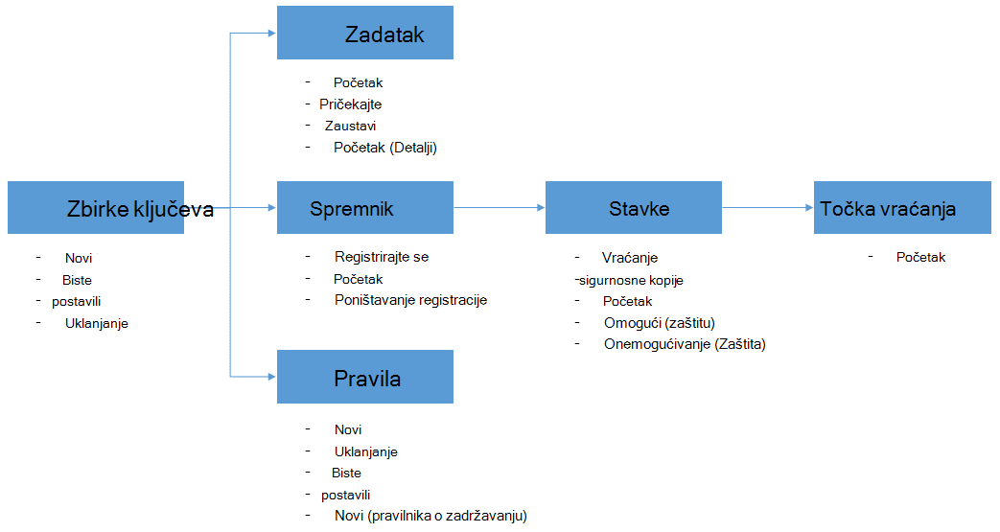

<properties
    pageTitle="Upravljanje sigurnosne kopije za Azure VMs pomoću komponente PowerShell i | Microsoft Azure"
    description="Saznajte kako uvesti i upravljanje sigurnosne kopije Azure pomoću komponente PowerShell"
    services="backup"
    documentationCenter=""
    authors="markgalioto"
    manager="cfreeman"
    editor=""/>

<tags
    ms.service="backup"
    ms.workload="storage-backup-recovery"
    ms.tgt_pltfrm="na"
    ms.devlang="na"
    ms.topic="article"
    ms.date="08/08/2016"
    ms.author="markgal;trinadhk;jimpark" />


# <a name="deploy-and-manage-backup-for-azure-vms-using-powershell"></a>Uvođenje i upravljanje sigurnosne kopije za Azure VMs pomoću komponente PowerShell

> [AZURE.SELECTOR]
- [Voditelj resursa](backup-azure-vms-automation.md)
- [Klasični](backup-azure-vms-classic-automation.md)

U ovom se članku objašnjava korištenje ljuske PowerShell Azure za sigurnosno kopiranje i vraćanje Azure VMs. Azure sadrži dva različitoj implementaciji modela za stvaranje i rad s resursima: Resouce upravitelj i Classic. U ovom se članku opisuje pomoću modela implementacije klasični. Microsoft preporučuje da najčešće novi implementacijama korištenje modela Voditelj resursa.

## <a name="concepts"></a>Koncepti


Ovaj članak sadrži informacije specifične za PowerShell cmdleti za sigurnosno kopiranje virtualnih računala. Uvodne informacije o zaštiti Azure VMs pročitajte članak [Plan preduvjete VM sigurnosne kopije infrastrukture u Azure](backup-azure-vms-introduction.md).

> [AZURE.NOTE] Prije nego što počnete, pročitajte [preduvjeti](backup-azure-vms-prepare.md) potrebni za rad s Azure sigurnosne kopije i [ograničenja](backup-azure-vms-prepare.md#limitations) trenutnog VM sigurnosne kopije rješenja.

Učinkovito korištenje ljuske PowerShell potrajati koji trenutak da biste shvatili hijerarhije objekata i iz koje treba pokrenuti.



Dva najvažnija tokova su Omogućivanje zaštitu na VM i vraća podatke iz oporavak točke. Da biste lakše postaju adept pri radu s cmdleta ljuske PowerShell da biste omogućili dva scenarija je žarište ovog članka.


## <a name="setup-and-registration"></a>Postavljanje i Registracija
Da biste započeli:

1. [Preuzmite najnovije PowerShell](https://github.com/Azure/azure-powershell/releases) (Minimalna verzija potrebno je: 1.0.0)

2. Da biste pronašli cmdleta Azure sigurnosne kopije PowerShell dostupna tako da upišete sljedeću naredbu:

```
PS C:\> Get-Command *azurermbackup*

CommandType     Name                                               Version    Source
-----------     ----                                               -------    ------
Cmdlet          Backup-AzureRmBackupItem                           1.0.1      AzureRM.Backup
Cmdlet          Disable-AzureRmBackupProtection                    1.0.1      AzureRM.Backup
Cmdlet          Enable-AzureRmBackupContainerReregistration        1.0.1      AzureRM.Backup
Cmdlet          Enable-AzureRmBackupProtection                     1.0.1      AzureRM.Backup
Cmdlet          Get-AzureRmBackupContainer                         1.0.1      AzureRM.Backup
Cmdlet          Get-AzureRmBackupItem                              1.0.1      AzureRM.Backup
Cmdlet          Get-AzureRmBackupJob                               1.0.1      AzureRM.Backup
Cmdlet          Get-AzureRmBackupJobDetails                        1.0.1      AzureRM.Backup
Cmdlet          Get-AzureRmBackupProtectionPolicy                  1.0.1      AzureRM.Backup
Cmdlet          Get-AzureRmBackupRecoveryPoint                     1.0.1      AzureRM.Backup
Cmdlet          Get-AzureRmBackupVault                             1.0.1      AzureRM.Backup
Cmdlet          Get-AzureRmBackupVaultCredentials                  1.0.1      AzureRM.Backup
Cmdlet          New-AzureRmBackupProtectionPolicy                  1.0.1      AzureRM.Backup
Cmdlet          New-AzureRmBackupRetentionPolicyObject             1.0.1      AzureRM.Backup
Cmdlet          New-AzureRmBackupVault                             1.0.1      AzureRM.Backup
Cmdlet          Register-AzureRmBackupContainer                    1.0.1      AzureRM.Backup
Cmdlet          Remove-AzureRmBackupProtectionPolicy               1.0.1      AzureRM.Backup
Cmdlet          Remove-AzureRmBackupVault                          1.0.1      AzureRM.Backup
Cmdlet          Restore-AzureRmBackupItem                          1.0.1      AzureRM.Backup
Cmdlet          Set-AzureRmBackupProtectionPolicy                  1.0.1      AzureRM.Backup
Cmdlet          Set-AzureRmBackupVault                             1.0.1      AzureRM.Backup
Cmdlet          Stop-AzureRmBackupJob                              1.0.1      AzureRM.Backup
Cmdlet          Unregister-AzureRmBackupContainer                  1.0.1      AzureRM.Backup
Cmdlet          Wait-AzureRmBackupJob                              1.0.1      AzureRM.Backup
```

Sljedeće zadatke postavljanje i registracija moguće je automatizirati sa servisom PowerShell:

- Stvaranje sigurnosne kopije zbirke ključeva
- Prijava na VMs sa servisom Azure sigurnosnog kopiranja

### <a name="create-a-backup-vault"></a>Stvaranje sigurnosne kopije zbirke ključeva

> [AZURE.WARNING] Za korisnike koji se koriste sigurnosne kopije Azure prvi put, morate registrirati davatelja sigurnosne kopije Azure koja će se koristiti s pretplatom. To možete učiniti tako da pokrenete sljedeću naredbu: Register AzureRmResourceProvider - ProviderNamespace "Microsoft.Backup"

Možete stvoriti novu sigurnosnu kopiju sigurnog pomoću cmdleta **New-AzureRmBackupVault** . Sigurnosno kopiranje zbirke ključeva je resursa u OBLAK da morate smjestite unutar grupu resursa. Povećani Azure PowerShell konzoli pokrenite sljedeće naredbe:

```
PS C:\> New-AzureRmResourceGroup –Name “test-rg” –Location “West US”
PS C:\> $backupvault = New-AzureRmBackupVault –ResourceGroupName “test-rg” –Name “test-vault” –Region “West US” –Storage GeoRedundant
```

Popis sigurnosne kopije sefovi možete dobiti u određenom pretplatu pomoću cmdleta **Get-AzureRmBackupVault** .

> [AZURE.NOTE] Dobro je spremiti objekt sigurnosno kopiranje zbirke ključeva u varijablu. Objekt sigurnog potreban je kao ulaz za mnoge cmdleta Azure sigurnosnu kopiju.


### <a name="registering-the-vms"></a>Prijava na VMs
Prvi korak pri konfiguriranju sigurnosno kopiranje s Azure sigurnosne kopije je morate registrirati računalu ili VM Azure sigurnosno kopiranje zbirke ključeva. Cmdlet **Register AzureRmBackupContainer** uzima ulazne podatke programa Azure IaaS virtualnog računala i registrira s navedenom zbirke ključeva. Operacija register Azure virtualnog računala pridružuje sigurnosno kopiranje zbirke ključeva i prati VM tijekom sigurnosne kopije životnog ciklusa.

Registracija vaše VM sa servisom Azure sigurnosne kopije stvara najviše razine spremnik objekta. Spremnik obično sadrži više stavki koje se mogu se sigurnosno, ali slučaju VMs će biti samo jedna stavka sigurnosne kopije za spremnik.

```
PS C:\> $registerjob = Register-AzureRmBackupContainer -Vault $backupvault -Name "testvm" -ServiceName "testvm"
```

## <a name="backup-azure-vms"></a>Sigurnosno kopiranje Azure VMs

### <a name="create-a-protection-policy"></a>Stvaranje pravila za zaštitu
Nije obavezna za stvaranje novog pravila zaštite da biste pokrenuli sigurnosnu kopiju vašeg VMs. U sklopu sustava sigurnog 'zadana pravila"koja se može koristiti da biste brzo omogućili zaštitu i uređivati kasnije uz desni detalje o. Pomoću cmdleta **Get-AzureRmBackupProtectionPolicy** možete dohvatiti popis dostupne u na sigurnog pravila:

```
PS C:\> Get-AzureRmBackupProtectionPolicy -Vault $backupvault

Name                      Type               ScheduleType       BackupTime
----                      ----               ------------       ----------
DefaultPolicy             AzureVM            Daily              26-Aug-15 12:30:00 AM
```

> [AZURE.NOTE] Vremenska zona BackupTime polju u ljusci PowerShell je UTC-a. Međutim, kad sigurnosne kopije vrijeme je prikazano na portalu za Azure, na vremenska zona je poravnat u lokalnom sustavu uz UTC pomak.

Sigurnosne kopije pravila je pridružen barem jedan pravilnika o zadržavanju. Pravila zadržavanja određuje koliko točku oporavak čuva se sigurnosno kopiranje Azure. Cmdlet **Novo AzureRmBackupRetentionPolicy** stvara PowerShell objekata koji sadrže informacije o pravilima zadržavanja. Ove objekti pravilnika zadržavanja se koriste kao unosa cmdleta *New-AzureRmBackupProtectionPolicy* ili pak izravno s cmdlet *Enable AzureRmBackupProtection* .

Sigurnosne kopije pravila definira kada i kako često sigurnosnu kopiju stavke gotovo. Cmdlet **Novo AzureRmBackupProtectionPolicy** stvara objekt PowerShell koja sadrži informacije o pravilima sigurnosne kopije. Sigurnosne kopije pravila koristi se kao ulaz cmdletu *Enable AzureRmBackupProtection* .

```
PS C:\> $Daily = New-AzureRmBackupRetentionPolicyObject -DailyRetention -Retention 30
PS C:\> $newpolicy = New-AzureRmBackupProtectionPolicy -Name DailyBackup01 -Type AzureVM -Daily -BackupTime ([datetime]"3:30 PM") -RetentionPolicy $Daily -Vault $backupvault

Name                      Type               ScheduleType       BackupTime
----                      ----               ------------       ----------
DailyBackup01             AzureVM            Daily              01-Sep-15 3:30:00 PM
```

### <a name="enable-protection"></a>Omogući zaštitu
Omogućivanje zaštitu obuhvaća dva objekta – do stavke i pravila, i oba morate nalaze u istom zbirke ključeva. Kada pravilo nije povezan sa stavkom, sigurnosne kopije tijek rada će pokretanje na definirani raspored.

```
PS C:\> Get-AzureRmBackupContainer -Type AzureVM -Status Registered -Vault $backupvault | Get-AzureRmBackupItem | Enable-AzureRmBackupProtection -Policy $newpolicy
```

### <a name="initial-backup"></a>Početna sigurnosnog kopiranja
Raspored sigurnosnog kopiranja će voditi brigu o način potpuni početne kopiju stavke, a rastuće kopija za kasnije sigurnosne kopije. Međutim, ako želite da biste nametnuli početne sigurnosnu kopiju da se dogodi u određeno vrijeme ili čak i odmah koristiti **Sigurnosne kopije AzureRmBackupItem** cmdlet:

```
PS C:\> $container = Get-AzureRmBackupContainer -Vault $backupvault -Type AzureVM -Name "testvm"
PS C:\> $backupjob = Get-AzureRmBackupItem -Container $container | Backup-AzureRmBackupItem
PS C:\> $backupjob

WorkloadName    Operation       Status          StartTime              EndTime
------------    ---------       ------          ---------              -------
testvm          Backup          InProgress      01-Sep-15 12:24:01 PM  01-Jan-01 12:00:00 AM
```

> [AZURE.NOTE] Vremenska zona StartTime i EndTime polja prikazanih u ljusci PowerShell je UTC-a. No kada na portalu za Azure prikazuju se slično kao podaci, u vremenska zona je poravnat sata lokalnog sustava.

### <a name="monitoring-a-backup-job"></a>Nadzor zadatka sigurnosnog kopiranja
Većina dugoročnih postupaka sigurnosnog kopiranja Azure modelled su kao posao. To olakšava praćenje tijeka bez potrebe da biste zadržali Azure portal Otvori cijelo vrijeme.

Da biste dobili najnovije stanje sustava u tijeku zadatka, koristite cmdlet **Get-AzureRmBackupJob** .

```
PS C:\> $joblist = Get-AzureRmBackupJob -Vault $backupvault -Status InProgress
PS C:\> $joblist[0]

WorkloadName    Operation       Status          StartTime              EndTime
------------    ---------       ------          ---------              -------
testvm          Backup          InProgress      01-Sep-15 12:24:01 PM  01-Jan-01 12:00:00 AM
```

Umjesto provjere ove zadatke za dovršetak – što je nepotrebne dodatne kod - je jednostavnije pomoću cmdleta **Čekanja AzureRmBackupJob** . Kada se koristi u skripti, cmdlet će Pauziraj izvršavanja dok se ne dovrši posao ili zbirka dostigne navedeni vremenskog ograničenja vrijednost.

```
PS C:\> Wait-AzureRmBackupJob -Job $joblist[0] -Timeout 43200
```


## <a name="restore-an-azure-vm"></a>Vraćanje Azure VM

Da biste vratili sigurnosne kopije podataka, morate utvrditi sigurnosno kopirane stavke i točka vraćanja koja sadrži podatkovne točke u vrijeme. Ti podaci se dodjeljuje cmdlet Vrati AzureRmBackupItem da biste započeli vraćanja podataka iz sustava sigurnog računu klijenta.

### <a name="select-the-vm"></a>Odaberite na VM

Da biste objekt PowerShell koja služi za identifikaciju desno sigurnosnu kopiju stavke, morate pokretanje spremnik u na sigurnog i rad na način hijerarhiju objekta. Da biste odabrali spremnik koji predstavlja na VM, pomoću cmdleta **Get-AzureRmBackupContainer** i pipe koji cmdlet **Get-AzureRmBackupItem** .

```
PS C:\> $backupitem = Get-AzureRmBackupContainer -Vault $backupvault -Type AzureVM -name "testvm" | Get-AzureRmBackupItem
```

### <a name="choose-a-recovery-point"></a>Odaberite točku oporavak

Sada možete popis svih točaka oporavak sigurnosne kopije stavke pomoću cmdleta **Get-AzureRmBackupRecoveryPoint** i odaberite točke oporavak da biste vratili. Obično korisnicima odabir najnovije *AppConsistent* točke na popisu.

```
PS C:\> $rp =  Get-AzureRmBackupRecoveryPoint -Item $backupitem
PS C:\> $rp

RecoveryPointId    RecoveryPointType  RecoveryPointTime      ContainerName
---------------    -----------------  -----------------      -------------
15273496567119     AppConsistent      01-Sep-15 12:27:38 PM  iaasvmcontainer;testvm;testv...
```

Varijabla ```$rp``` je polje točaka oporavak za odabranu sigurnosnu kopiju stavke, sortirani obrnutim redoslijedom vremena – najnovije točka vraćanja na indeks 0. Pomoću standardnih polja PowerShell indeksiranje odaberite točka vraćanja. Na primjer: ```$rp[0]``` ćete odabrati najnovije točka vraćanja.

### <a name="restoring-disks"></a>Vraćanje diskova

Postoji ključa razlika između operacije vraćanja gotovo kroz Azure portal i Azure PowerShell. Pomoću komponente PowerShell postupak vraćanja tabulatora vraćanje diskova i konfiguracija informacije iz točka vraćanja. Stvaranje virtualnog računala.

> [AZURE.WARNING] Vraćanje AzureRmBackupItem nije moguće stvoriti u VM. Samo vraća na diskova račun navedeni prostora za pohranu. Ovo nije isto ponašanje će se dogoditi na portalu za Azure.

```
PS C:\> $restorejob = Restore-AzureRmBackupItem -StorageAccountName "DestAccount" -RecoveryPoint $rp[0]
PS C:\> $restorejob

WorkloadName    Operation       Status          StartTime              EndTime
------------    ---------       ------          ---------              -------
testvm          Restore         InProgress      01-Sep-15 1:14:01 PM   01-Jan-01 12:00:00 AM
```

Detalje o operaciji vraćanja pomoću cmdleta **Get-AzureRmBackupJobDetails** kad Završi zadatak obnavljanja možete dobiti. Svojstvo *ErrorDetails* će imati podatke koji su potrebni za ponovno stvaranje na VM.

```
PS C:\> $restorejob = Get-AzureRmBackupJob -Job $restorejob
PS C:\> $details = Get-AzureRmBackupJobDetails -Job $restorejob
```

### <a name="build-the-vm"></a>Sastavljanje u VM

Stvaranje VM iz vraćene diskova mogu se izvršiti korištenju starije cmdleta ljuske PowerShell za upravljanje servisa Azure, novih predložaka za Azure Voditelj resursa ili čak i pomoću portala za Azure. U primjeru brzi, Pokazat ćemo kako da dođete Onamo pomoću cmdleta za upravljanje servisom Azure.

```
 $properties  = $details.Properties

 $storageAccountName = $properties["Target Storage Account Name"]
 $containerName = $properties["Config Blob Container Name"]
 $blobName = $properties["Config Blob Name"]

 $keys = Get-AzureStorageKey -StorageAccountName $storageAccountName
 $storageAccountKey = $keys.Primary
 $storageContext = New-AzureStorageContext -StorageAccountName $storageAccountName -StorageAccountKey $storageAccountKey


 $destination_path = "C:\Users\admin\Desktop\vmconfig.xml"
 Get-AzureStorageBlobContent -Container $containerName -Blob $blobName -Destination $destination_path -Context $storageContext


$obj = [xml](((Get-Content -Path $destination_path -Encoding UniCode)).TrimEnd([char]0x00))
 $pvr = $obj.PersistentVMRole
 $os = $pvr.OSVirtualHardDisk
 $dds = $pvr.DataVirtualHardDisks
 $osDisk = Add-AzureDisk -MediaLocation $os.MediaLink -OS $os.OS -DiskName "panbhaosdisk"
 $vm = New-AzureVMConfig -Name $pvr.RoleName -InstanceSize $pvr.RoleSize -DiskName $osDisk.DiskName

 if (!($dds -eq $null))
 {
     foreach($d in $dds.DataVirtualHardDisk)
     {
         $lun = 0
         if(!($d.Lun -eq $null))
         {
             $lun = $d.Lun
         }
         $name = "panbhadataDisk" + $lun
     Add-AzureDisk -DiskName $name -MediaLocation $d.MediaLink
     $vm | Add-AzureDataDisk -Import -DiskName $name -LUN $lun
    }
}

New-AzureVM -ServiceName "panbhasample" -Location "SouthEast Asia" -VM $vm
```

Dodatne informacije o sastavljanje VM iz vraćene diskova, pročitajte sljedeće Cmdlete:

- [Dodavanje AzureDisk](https://msdn.microsoft.com/library/azure/dn495252.aspx)
- [Novi AzureVMConfig](https://msdn.microsoft.com/library/azure/dn495159.aspx)
- [Novi AzureVM](https://msdn.microsoft.com/library/azure/dn495254.aspx)

## <a name="code-samples"></a>Primjere koda

### <a name="1-get-the-completion-status-of-job-sub-tasks"></a>1. dobiti Stanje dovršenja podređenu zadataka posla

Da biste pratili Stanje dovršenja pojedinačne podređenu zadataka, koristite cmdlet **Get-AzureRmBackupJobDetails** :

```
PS C:\> $details = Get-AzureRmBackupJobDetails -JobId $backupjob.InstanceId -Vault $backupvault
PS C:\> $details.SubTasks

Name                                                        Status
----                                                        ------
Take Snapshot                                               Completed
Transfer data to Backup vault                               InProgress
```

### <a name="2-create-a-dailyweekly-report-of-backup-jobs"></a>2. stvoriti izvješće dnevnu/tjedno sigurnosne kopije zadataka

Administratori obično želite saznati što sigurnosne kopije zadataka pokrenuli u zadnja 24 sata, statusa te sigurnosne kopije zadataka. Uz to, količinu podataka koji se prenose daje administratorima omogućuje procjenu mjesečni podatkovni promet. Ispod skripte povlači sirovim podacima iz servisa Azure sigurnosnu kopiju i prikazuje informacije u konzole za PowerShell.

```
param(  [Parameter(Mandatory=$True,Position=1)]
        [string]$backupvaultname,

        [Parameter(Mandatory=$False,Position=2)]
        [int]$numberofdays = 7)


#Initialize variables
$DAILYBACKUPSTATS = @()
$backupvault = Get-AzureRmBackupVault -Name $backupvaultname
$enddate = ([datetime]::Today).AddDays(1)
$startdate = ([datetime]::Today)

for( $i = 1; $i -le $numberofdays; $i++ )
{
    # We query one day at a time because pulling 7 days of data might be too much
    $dailyjoblist = Get-AzureRmBackupJob -Vault $backupvault -From $startdate -To $enddate -Type AzureVM -Operation Backup
    Write-Progress -Activity "Getting job information for the last $numberofdays days" -Status "Day -$i" -PercentComplete ([int]([decimal]$i*100/$numberofdays))

    foreach( $job in $dailyjoblist )
    {
        #Extract the information for the reports
        $newstatsobj = New-Object System.Object
        $newstatsobj | Add-Member -Type NoteProperty -Name Date -Value $startdate
        $newstatsobj | Add-Member -Type NoteProperty -Name VMName -Value $job.WorkloadName
        $newstatsobj | Add-Member -Type NoteProperty -Name Duration -Value $job.Duration
        $newstatsobj | Add-Member -Type NoteProperty -Name Status -Value $job.Status

        $details = Get-AzureRmBackupJobDetails -Job $job
        $newstatsobj | Add-Member -Type NoteProperty -Name BackupSize -Value $details.Properties["Backup Size"]
        $DAILYBACKUPSTATS += $newstatsobj
    }

    $enddate = $enddate.AddDays(-1)
    $startdate = $startdate.AddDays(-1)
}

$DAILYBACKUPSTATS | Out-GridView
```

Ako želite dodati mogućnosti izrade grafikona u izlaz ovog izvješća Saznajte iz članka za blog TechNet [Charting sa servisom PowerShell](http://blogs.technet.com/b/richard_macdonald/archive/2009/04/28/3231887.aspx)

## <a name="next-steps"></a>Daljnji koraci

Ako radije koristite PowerShell da biste sudjelovati s Azure resursa, pogledajte članak ljuske PowerShell za zaštitu Windows Server, [uvođenje i upravljanje sigurnosne kopije za Windows Server](./backup-client-automation-classic.md). Postoji članak ljuske PowerShell za upravljanje DPM sigurnosne kopije, [uvođenje i upravljanje sigurnosne kopije za DPM](./backup-dpm-automation-classic.md). Od ovih članaka imat verziju za implementacijama Voditelj resursa, kao i klasični implementacije.
