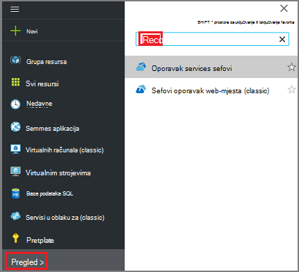
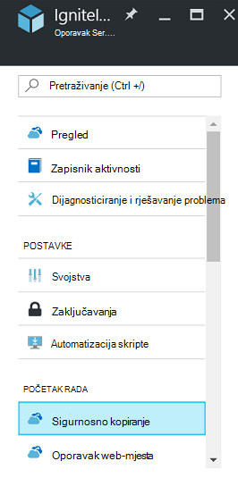
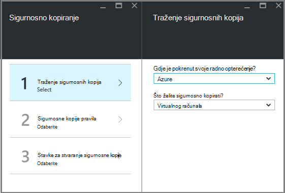
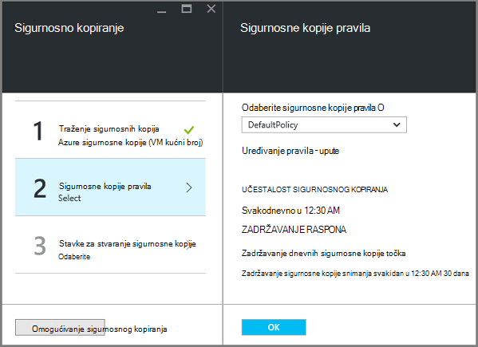
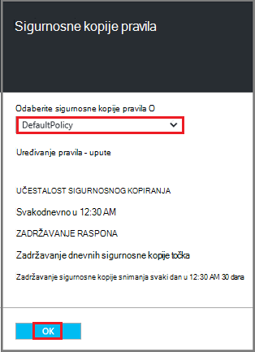
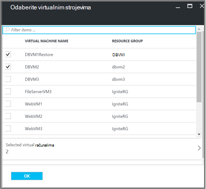
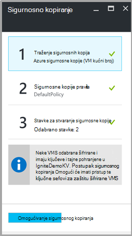

<properties
   pageTitle="Sigurnosno kopiranje i vraćanje šifrirane VMs pomoću sigurnosnog kopiranja Azure"
   description="U ovom se članku govori o sigurnosnog kopiranja i vraćanja sučelje za VMs šifriranjem Azure šifriranje."
   services="backup"
   documentationCenter=""
   authors="JPallavi"
   manager="vijayts"
   editor=""/>
<tags
   ms.service="backup"
   ms.devlang="na"
   ms.topic="article"
   ms.tgt_pltfrm="na"
   ms.workload="storage-backup-recovery"
   ms.date="10/25/2016"
   ms.author="markgal; jimpark; trinadhk"/>

# Sigurnosno kopiranje i vraćanje šifrirane VMs pomoću sigurnosnog kopiranja Azure

U ovom se članku govori o koracima sigurnosnog kopiranja i vraćanja virtualnim strojevima pomoću Azure sigurnosne kopije. Također nudi detalje o podržanim scenariji, stara requisites i upute za otklanjanje poteškoća za slučaj da se pogreška.

## Podržani scenariji

> [AZURE.NOTE]
1.  Sigurnosno kopiranje i vraćanje šifrirane VMs je podržano samo za Voditelj resursa implementiran virtualnih računala. Nije podržana za klasičnom virtualnih računala.  
2.  Podržana je samo za virtualnim strojevima šifriran pomoću ključa za šifriranje BitLocker i ključ za šifriranje. Nije podržana za virtualnim strojevima šifrirane samo pomoću ključa za šifriranje BitLocker.  

## Prije requisites

1.  Virtualnog računala sadrži šifrirane pomoću [Azure šifriranje](../security/azure-security-disk-encryption.md). Ga mora biti šifrirane pomoću ključa za šifriranje BitLocker i ključ za šifriranje.
2.  Oporavak servisa sigurnog stvorio i pohranu replikacije postavite pomoću koraka navedenih u članku [Priprema okruženja za sigurnosno kopiranje](backup-azure-arm-vms-prepare.md).

## Sigurnosno kopiranje šifrirane VM
Poduzmite sljedeće korake da biste postavili sigurnosne kopije cilja, definirati pravila, konfiguriranje stavki i sigurnosno kopiranje okidača.

### Konfiguriranje sigurnosnog kopiranja

1. Ako već imate oporavak servisa sigurnog otvorite, prijeđite na sljedeći korak. Ako ste oporavak servisa sigurnog otvori, ali se na portalu Azure na izborniku koncentrator kliknite **Pregledaj**.

  - Na popisu resursa upišite **Servise za oporavak**.
  - Kao što počnete pisati, filtri popisa koji se temelji na unos. Kada se prikaže **sefovi oporavak Services**, kliknite ga.
  
        

    Pojavit će se popis sefovi servise za oporavak. Na popisu sefovi oporavak Servisi odaberite na zbirke ključeva.

    Otvorit će se na nadzornoj ploči odabrane zbirke ključeva.

2. Na popisu stavki koji se pojavljuje u odjeljku sigurnog kliknite **sigurnosnu kopiju** da biste otvorili plohu sigurnosnu kopiju.

       
    
3. Na plohu sigurnosne kopije kliknite **cilj sigurnosnu kopiju** da biste otvorili plohu cilj sigurnosnu kopiju.

       
    
4.   Na plohu sigurnosne kopije cilja postavite **gdje je svoje radno opterećenje pokrenut** na Azure i **što želite sigurnosno kopirati** da biste virtualnog računala, pa kliknite **u redu**.

    Zatvara plohu cilj sigurnosnu kopiju i otvara plohu pravila za sigurnosno kopiranje.

       

5. Na pravila plohu sigurnosno kopiranje odaberite sigurnosne kopije pravila koje želite primijeniti na sigurnog te kliknite **u redu**.

       

    Detalje o zadani pravilnik navedene su u odjeljku detalja. Ako želite stvoriti pravilo, odaberite **Stvori novo** na padajućem izborniku. Kada kliknete **u redu**, sigurnosne kopije pravila povezan je s na zbirke ključeva.

    Zatim odaberite VMs želite pridružiti na sigurnog.
    
6. Odaberite šifrirane virtualnim strojevima pridružiti određena pravila, a zatim kliknite **u redu**.

      
   
7. Ova stranica prikazuje se poruka o ključa sigurnog povezane šifrirane VMs odabran. Servis za sigurnosne kopije zahtijeva samo za čitanje pristup ključeva i tajne u ključa zbirke ključeva. Koristi tih dozvola sigurnosne kopije ključ i tajna uz povezane VMs. 

      

      Sad kad ste definirali sve postavke za sigurnog u plohu sigurnosne kopije kliknite Omogući sigurnosno kopiranje pri dnu stranice. Sigurnosno kopiranje Omogući uvodi pravila u sigurnog i na VMs.

8. Sljedeće faze u Priprema instalira VM Agent ili provjerite VM Agent instaliran. Izvršite isti pomoću koraka navedenih u članku [Priprema okruženja za sigurnosno kopiranje](backup-azure-arm-vms-prepare.md). 

### Pokretački zadatka sigurnosnog kopiranja
Slijedite korake spomenute u članak [Sigurnosne kopije Azure VMs za oporavak servisa sigurnog](backup-azure-arm-vms.md) okidača sigurnosno kopiranje.

## Vraćanje šifrirane VM
Vraćanje sučelje za šifrirane i koje nisu šifrirane virtualnim strojevima jednak je. Slijedite korake u [Vraćanje virtualnim strojevima Azure portalu](backup-azure-arm-restore-vms.md) navode da biste vratili šifrirane VM. U slučaju da morate vratiti tipke i tajne osigurati te ključne sigurnog njihova vraćanja mora već postoji.

## Otklanjanje poteškoća

| Postupak | Detalje o pogrešci | Razlučivost |
| -------- | -------- | -------|
| Sigurnosno kopiranje | Provjera valjanosti nije uspjela tijekom virtualnog računala šifriran pomoću BEK samostalno. Sigurnosne kopije možete omogućiti samo za virtualnim strojevima šifrirane i zaštićene BEK i KEK. | Virtualnog računala mora biti šifriran pomoću BEK i KEK. Nakon toga mora biti omogućen sigurnosnu kopiju. |
| Vraćanje | U ovom šifrirane VM nije moguće vratiti jer ključa sigurnog povezan s ovom VM ne postoji. | Stvaranje ključa sigurnog korištenja [Početak rada s sigurnog ključ Azure](../key-vault/key-vault-get-started.md). Pročitajte članak [Vraćanje ključa sigurnog ključ i tajna korištenju sigurnosnih kopija Azure](backup-azure-restore-key-secret.md) da biste vratili ključ i tajna ako ih ne postoje. |
| Vraćanje | U ovom šifrirane VM nije moguće vratiti jer ključ i tajna povezan s ovom VM ne postoji. | Pročitajte članak [Vraćanje ključa sigurnog ključ i tajna korištenju sigurnosnih kopija Azure](backup-azure-restore-key-secret.md) da biste vratili ključ i tajna ako ih ne postoje. |
