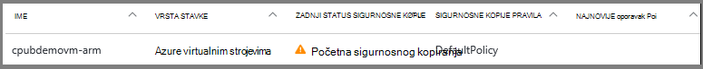
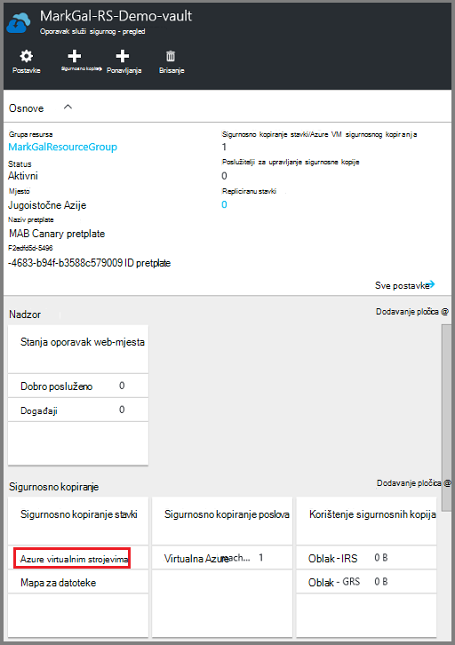
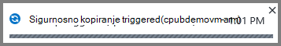
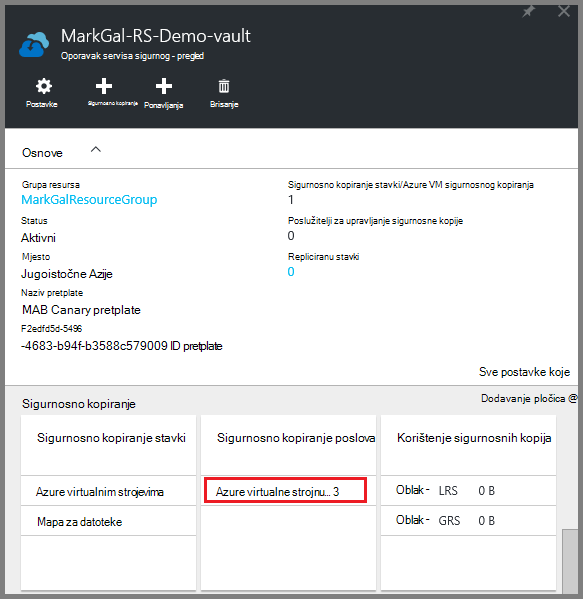

<properties
    pageTitle="Najprije izgledati: zaštita Azure VMs s sigurnog za usluge oporavak | Microsoft Azure"
    description="Zaštita Azure VMs s sigurnog za usluge oporavak. Zaštita podataka pomoću sigurnosne kopije resursima implementiran VMs, klasični implementiran VMs i VMs Premium prostora za pohranu. Stvaranje i registrirati sigurnog za usluge oporavak. Registriranje VMs, stvaranje pravila i zaštiti VMs u Azure."
    services="backup"
    documentationCenter=""
    authors="markgalioto"
    manager="cfreeman"
    editor=""
    keyword="backups; vm backup"/>

<tags
    ms.service="backup"
    ms.workload="storage-backup-recovery"
    ms.tgt_pltfrm="na"
    ms.devlang="na"
    ms.topic="hero-article"
    ms.date="10/13/2016"
    ms.author="markgal; jimpark"/>

# Najprije izgledati: zaštita Azure VMs s sigurnog za usluge oporavak

> [AZURE.SELECTOR]
- [Zaštita VMs s sigurnog za usluge oporavak](backup-azure-vms-first-look-arm.md)
- [Zaštita VMs s sigurnosno kopiranje zbirke ključeva](backup-azure-vms-first-look.md)

Pomoću ovog praktičnog vodiča vodi vas kroz korake za stvaranje sigurnog za usluge oporavak i sigurnosno kopiranje Azure virtualnog računala (VM). Oporavak services sefovi zaštititi:

- Voditelj resursa implementiran VMs za Azure
- Klasični VMs
- Standardni prostora za pohranu VMs
- Prostor za pohranu Premium VMs
- VMs šifriran pomoću Azure šifriranje, s BEK i KEK

Dodatne informacije o zaštiti Premium prostora za pohranu VMs potražite u članku [sigurnosno kopiranje i vraćanje VMs Premium prostora za pohranu](backup-introduction-to-azure-backup.md#back-up-and-restore-premium-storage-vms)

>[AZURE.NOTE] Pomoću ovog praktičnog vodiča pretpostavlja već na VM u pretplatu za Azure i koje ste snimili mjere da biste omogućili sigurnosne kopije servisa za pristup na VM.

[AZURE.INCLUDE [learn-about-Azure-Backup-deployment-models](../../includes/backup-deployment-models.md)]

Visoke razine, ovdje su koraci koje ćete izvršiti.  

1. Stvaranje sigurnog za usluge oporavak za na VM.
2. Pomoću portala za Azure odaberite scenarij, postavljanje pravila i prepoznavanje stavki za zaštitu.
3. Pokrenuti početne sigurnosno kopiranje.

## Stvaranje sigurnog za usluge oporavak za na VM

Sigurnog za usluge oporavak je entitet koji pohranjuje sigurnosne kopije i oporavak točke stvorenog tijekom vremena. Servisa sigurnog oporavak sadrži sigurnosne kopije pravila primjenjuje se na zaštićenom VMs.

>[AZURE.NOTE] Sigurnosno kopiranje VMs je lokalni procesa. Ne možete stvoriti sigurnosnu VMs s jednog mjesta na servisa sigurnog za oporavak na neko drugo mjesto. Tako, za svaku Azure mjesto koje sadrži VMs za sigurnosno kopiranje barem jedan oporavak servisa sigurnog moraju se nalaziti u tom mjestu.

Da biste stvorili sigurnog za usluge oporavak:

1. Prijavite se na [portal za Azure](https://portal.azure.com/).

2. Na izborniku koncentrator kliknite **Pregledaj** , a zatim na popisu resursi upišite **Servise za oporavak**. Kao što počnete pisati, filtri popisa koji se temelji na unos. Kliknite **zbirke ključeva servisa za oporavak**.

      

    Prikazuju se na popisu sefovi servise za oporavak.

3. Na izborniku **sefovi oporavak servisi** kliknite **Dodaj**.

    

    Otvorit će se sigurnog plohu oporavak servise koje možete unijeti **naziv**, **pretplatu**, **grupa resursa**i **mjesto**pitanja.

    

4. U odjeljku **naziv**unesite neslužbeni naziv da biste odredili na zbirke ključeva. Naziv mora biti jedinstvena za Azure pretplatu. Upišite naziv koji sadrži od 2 do 50 znakova. Morate pokrenuti slovom i mogu sadržavati samo slova, brojeve i spojnice.

5. Kliknite **pretplatu** da biste vidjeli dostupne popis pretplata. Ako niste sigurni koju pretplatu za korištenje, koristite zadanu (ili predložena) pretplate. Nema više mogućnosti samo ako je povezan s više pretplata Azure računa tvrtke ili ustanove.

6. Kliknite **grupu resursa** da biste vidjeli popis dostupnih grupa resursa ili **Novo** da biste stvorili grupu resursa. Potpune informacije o grupama resursa potražite u članku [Pregled upravljanja resursima za Azure](../azure-resource-manager/resource-group-overview.md)

7. Kliknite **mjesto** da biste odabrali regiji u zbirke ključeva. Sigurnog **mora** biti u istom području kao virtualnim strojevima koji želite zaštititi.

    >[AZURE.IMPORTANT] Ako niste sigurni lokacije u kojem postoji vaše VM, zatvorite iz dijaloškom okviru Stvaranje sigurnog te otvorite popis virtualnim strojevima na portalu. Ako imate virtualnim strojevima u više područja, stvaranje sigurnog za usluge oporavak u svakom području. Stvorite na sigurnog na prvom mjestu prije prelaska na sljedeću lokaciju. Nema potrebe za određivanje računa za pohranu za spremanje sigurnosne kopije podataka – servisa sigurnog oporavak i servis za Azure sigurnosne kopije obradu to automatski.

8. Kliknite **Stvori**. Može potrajati neko vrijeme da se servisa sigurnog oporavak će biti stvoren. Praćenje obavijesti o statusu u gornjem desnom području na portalu. Nakon stvaranja vaše zbirke ključeva, pojavljuje se na popisu sefovi servise za oporavak.

    

Sad kad ste stvorili vaše zbirke ključeva, informacije o postavljanju replikacije prostora za pohranu.

### Postavljanje ponavljanja prostora za pohranu

Mogućnost replikacije pohrane omogućuje odabir između zemlj suvišnih prostora za pohranu i lokalno suvišnih prostora za pohranu. Prema zadanim postavkama vašeg sigurnog ima zemlj suvišnih prostora za pohranu. Ostavite mogućnost postaviti zemlj suvišnih prostora za pohranu ako je primarni sigurnosnu kopiju. Ako želite da se jeftinijim mogućnost koja nije kao durable, odaberite lokalno suvišne prostora za pohranu. Dodatne informacije o [zemlj suvišne](../storage/storage-redundancy.md#geo-redundant-storage) i [lokalno suvišne](../storage/storage-redundancy.md#locally-redundant-storage) mogućnosti pohrane u [Pregled replikacije Azure prostora za pohranu](../storage/storage-redundancy.md).

Da biste uredili replikacije postavku za pohranu:

1. Odaberite vaše zbirke ključeva da biste otvorili na nadzornoj ploči sigurnog i plohu postavke. Ako ne možete otvoriti plohu **Postavke** , kliknite **sve postavke** na nadzornoj ploči zbirke ključeva.

2. Na plohu **Postavke** kliknite **Sigurnosno kopiranje infrastrukture** > **Konfiguracije sigurnosnu kopiju** da biste otvorili plohu **Konfiguracije sigurnosnu kopiju** . Na plohu **Sigurnosne kopije konfiguracije** odaberite mogućnost replikacije prostora za pohranu za vaše zbirke ključeva.

    

    Nakon odabira mogućnosti prostora za pohranu za vaše zbirke ključeva, spremni ste za pridruživanje s VM na sigurnog. Da biste započeli pridruživanja, otkrivanje i registrirati Azure virtualnih računala.

## Odaberite sigurnosne kopije cilj, postavljanje pravila i definiranje stavki za zaštitu

Prije registracije VM s sigurnog, pokrenite istrage da biste bili sigurni sve nove virtualnim strojevima koji su dodani na pretplatu prepoznaju. Naziv usluge oblaka i područja, kao što su upiti postupak Azure popis virtualnim strojevima u pretplatu, zajedno s dodatnim informacijama. Na portalu Azure scenarij se odnosi na što namjeravate staviti u servisa sigurnog oporavak. Pravilo je raspored koliko često i kada se uzimaju oporavak točke. Pravila sadrži i raspon zadržavanja za oporavak točke.

1. Ako već imate oporavak servisa sigurnog otvorite, prijeđite na stranici korak 2. Ako nemate oporavak servisa sigurnog otvori, ali se na portalu Azure na izborniku koncentrator kliknite **Pregledaj**.

  - Na popisu resursa upišite **Servise za oporavak**.
  - Kao što počnete pisati, filtri popisa koji se temelji na unos. Kada se prikaže **sefovi oporavak Services**, kliknite ga.

      

    Pojavit će se popis sefovi servise za oporavak.
  - Na popisu sefovi servise za oporavak odaberite na zbirke ključeva.

    Otvorit će se na nadzornoj ploči odabrane zbirke ključeva.

    

2. Na izborniku nadzorne ploče sigurnog kliknite **sigurnosnu kopiju** da biste otvorili plohu sigurnosnu kopiju.

    

    Kad se otvori u plohu, servis za sigurnosno kopiranje Traži sve nove VMs u pretplate.

    

3. Na plohu sigurnosne kopije kliknite **cilj sigurnosnu kopiju** da biste otvorili plohu cilj sigurnosnu kopiju.

    

4. Na plohu sigurnosne kopije cilja postavite **gdje je svoje radno opterećenje pokrenut** na Azure i **što želite sigurnosno kopirati** da biste virtualnog računala, pa kliknite **u redu**.

    Zatvara plohu cilj sigurnosnu kopiju i otvara plohu pravila za sigurnosno kopiranje.

    

5. Na pravila plohu sigurnosno kopiranje odaberite sigurnosne kopije pravila koje želite primijeniti na sigurnog te kliknite **u redu**.

    

    Detalje o zadani pravilnik navedene su u odjeljku detalja. Ako želite stvoriti pravilo, odaberite **Stvori novo** na padajućem izborniku. Padajući izbornik nudi i mogućnost da biste se prebacili vrijeme kada je potrebno snimka za 7 Poslijepodne. Upute o definiranju sigurnosne kopije pravila potražite u članku [Definiranje sigurnosne kopije pravila](backup-azure-vms-first-look-arm.md#defining-a-backup-policy). Kada kliknete **u redu**, sigurnosne kopije pravila povezan je s na zbirke ključeva.

    Zatim odaberite VMs želite pridružiti na sigurnog.

6. Odaberite virtualnim strojevima za povezivanje s navedenim pravilima, a zatim kliknite **Odaberi**.

    

    Ako ne vidite željeni VM, provjerite postoji li na istom mjestu Azure kao sigurnog servise za oporavak.

7. Sad kad ste definirali sve postavke za sigurnog u plohu sigurnosne kopije kliknite **Omogući sigurnosne kopije** pri dnu stranice. To pravilo uvodi na sigurnog i na VMs.

    

## Početna sigurnosnog kopiranja

Kada sigurnosne kopije pravila implementiran na virtualnog računala koje ne znači podatke sigurnosno je. Prema zadanim postavkama, prvi zakazano sigurnosno kopiranje (kako je definirano u sigurnosne kopije pravila) je početna sigurnosnu kopiju. Dok se ne pojavljuje se početni sigurnosnog kopiranja, zadnje sigurnosne kopije Status na plohu **Sigurnosne kopije zadataka** prikazuje se kao **upozorenje (Početna sigurnosne kopije na čekanju)**.

Osim u slučaju da Početna sigurnosnu kopiju dospije da biste započeli uskoro, preporučuje se da pokrenete **sada sigurnosno kopiranje**.

Da biste pokrenuli **sigurnosno kopiranje sada**:

1. Na nadzornoj ploči sigurnog, na pločici **sigurnosnog kopiranja** , kliknite **virtualnim računalima sustava Azure**  
    

    Otvorit će se plohu **Sigurnosnu kopiju stavke** .

2. Na plohu **Sigurnosnu kopiju stavke** , desnom tipkom miša kliknite sigurnog koje želite sigurnosno kopirati pa kliknite **sigurnosnu kopiju**.

    

    Sigurnosno kopiranje posla se pokreće.  

    

3. Da biste pogledali da Početna sigurnosnu kopiju dovrši, na nadzornoj ploči sigurnog, na pločici **Sigurnosne kopije zadataka** kliknite **Azure virtualnih računala**.

    

    Otvorit će se plohu sigurnosne kopije zadataka.

4. U zadacima plohu sigurnosnog kopiranja možete vidjeti status svih zadataka.

    

    >[AZURE.NOTE] U sklopu postupka sigurnosne kopije, servis za Azure sigurnosne kopije problemi naredbe za sigurnosne kopije datotečni nastavak u svakom VM pražnjenje sve zapisivanja i stvorite dosljedan snimku.

    Po završetku sigurnosno kopiranje status je *Dovršeno*.

[AZURE.INCLUDE [backup-create-backup-policy-for-vm](../../includes/backup-create-backup-policy-for-vm.md)]

## Kliknite pločicu VM Agent virtualnog računala

Ti podaci navedeni u slučaju da je to potrebno. Agent za Azure VM mora biti instaliran na Azure virtualnog računala za sigurnosno kopiranje nastavak rada. Međutim, ako je vaš VM stvorena iz galerije Azure, zatim VM Agent već se nalazi na virtualnog računala. VMs migriraju se od lokalnog podatkovnim centrima bi nije VM Agent instaliran. U tom slučaju VM Agent potrebno je instalirati. Ako imate problema s sigurnosno kopiranje Azure VM, provjerite je li Azure VM Agent pravilno instalirani na virtualnog računala (pogledajte tablicu u nastavku). Ako stvorite prilagođeni VM, [Provjerite je li potvrđen okvir **Instalacija VM Agent** ](../virtual-machines/virtual-machines-windows-classic-agents-and-extensions.md) prije virtualnog računala je dodijeljena.

Informirajte se o [VM Agent](https://go.microsoft.com/fwLink/?LinkID=390493&clcid=0x409) i [kako ga instalirati](../virtual-machines/virtual-machines-windows-classic-manage-extensions.md).

Sljedeća tablica sadrži dodatne informacije o VM Agent za Windows i Linux VMs.

| **Postupak** | **Windows** | **Linux** |
| --- | --- | --- |
| Instaliranje VM Agent | <li>Preuzmite i instalirajte [agent MSI](http://go.microsoft.com/fwlink/?LinkID=394789&clcid=0x409). Potreban vam je ovlasti administratora da biste dovršili instalaciju. <li>Određivanje je li instaliran agenta [ažurirali svojstvo VM](http://blogs.msdn.com/b/mast/archive/2014/04/08/install-the-vm-agent-on-an-existing-azure-vm.aspx) . | <li> Instalirajte najnovije [Linux agent](https://github.com/Azure/WALinuxAgent) iz GitHub. Potreban vam je ovlasti administratora da biste dovršili instalaciju. <li> Određivanje je li instaliran agenta [ažurirali svojstvo VM](http://blogs.msdn.com/b/mast/archive/2014/04/08/install-the-vm-agent-on-an-existing-azure-vm.aspx) . |
| Ažuriranje VM Agent | Ažuriranje VM Agent jednostavan je ponovno instalirati program [VM Agent binarne datoteke](http://go.microsoft.com/fwlink/?LinkID=394789&clcid=0x409).  Provjerite je li nijedna sigurnosne kopije operacija sustavom dok VM agent ažurira. | Slijedite upute o [ažuriranju Linux VM Agent ](../virtual-machines-linux-update-agent.md).  Provjerite je li nijedna sigurnosne kopije operacija sustavom dok VM Agent ažurira. |
| Provjera valjanosti instalacije VM Agent | <li>Dođite do mape u *C:\WindowsAzure\Packages* u Azure VM. <li>Trebali biste pronađete datoteku WaAppAgent.exe prezentacija.<li> Desnom tipkom miša kliknite datoteku, idite na **Svojstva**, a zatim odaberite karticu **Detalji** . Polje verziju proizvoda mora biti 2.6.1198.718 ili noviji. | N/D |

### Proširenje sigurnosne kopije

Kada je na virtualnog računala instaliran VM Agent, servisa Azure sigurnosne kopije instalira sigurnosne kopije proširenje VM Agent. Servis za Azure sigurnosne kopije jednostavno nadograđuje i zakrpa sigurnosne kopije nastavak bez intervencije dodatne korisnika.

Servis za sigurnosno kopiranje sigurnosne kopije proširenje instalirao li instalirana na VM. Izvodi VM nudi maksimalnog izgledi početak točku aplikaciju dosljedan oporavak. Međutim, servisa Azure sigurnosnu kopiju i dalje sigurnosne kopije na VM čak i ako je isključena i nastavak nije moguće instalirati. To se naziva izvanmrežnom načinu rada VM. U ovom slučaju točke oporavak bit će *rušenje dosljedni*.

## Informacije o otklanjanju poteškoća
Ako imate problema izvršavanje neke zadatke u ovom članku, pogledajte [upute za otklanjanje poteškoća](backup-azure-vms-troubleshoot.md).

## Cijene
Azure sigurnosne kopije VM naplatiti ovisno o zaštićeni instance modela. Dodatne informacije na [Cijene sigurnosnog kopiranja](https://azure.microsoft.com/pricing/details/backup/)

## Pitanja?
Ako imate pitanja ili ako postoji svih značajki koje želite da biste vidjeli sadrži, [Pošaljite nam povratnu informaciju](http://aka.ms/azurebackup_feedback).
