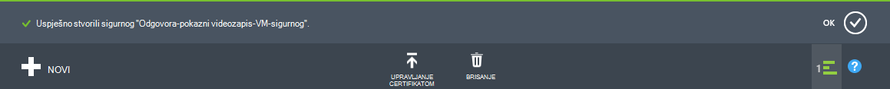
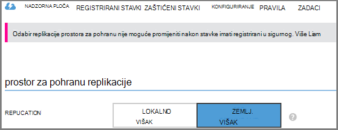
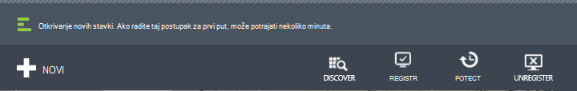
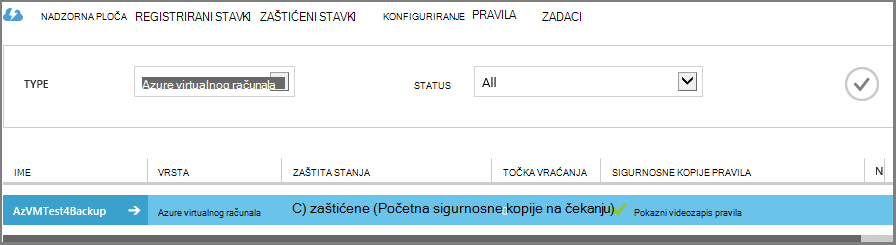

<properties
    pageTitle="Prvi pogled: Zaštita Azure VMs s sigurnosno kopiranje zbirke ključeva | Microsoft Azure"
    description="Zaštita Azure VMs s sigurnog sigurnosnu kopiju. Praktični vodič objašnjava stvaranje sigurnog, registrirati VMs, stvaranje pravila i zaštita VMs u Azure."
    services="backup"
    documentationCenter=""
    authors="markgalioto"
    manager="cfreeman"
    editor=""/>

<tags
    ms.service="backup"
    ms.workload="storage-backup-recovery"
    ms.tgt_pltfrm="na"
    ms.devlang="na"
    ms.topic="hero-article"
    ms.date="09/15/2016"
    ms.author="markgal; jimpark"/>

# Najprije izgledati: sigurnosno kopiranje Azure virtualnim strojevima

> [AZURE.SELECTOR]
- [Zaštita VMs s sigurnog za usluge oporavak](backup-azure-vms-first-look-arm.md)
- [Zaštita Azure VMs s sigurnosno kopiranje zbirke ključeva](backup-azure-vms-first-look.md)

Pomoću ovog praktičnog vodiča vodi vas kroz korake za stvaranje sigurnosne kopije Azure virtualnog računala (VM) za sigurnosno kopiranje zbirke ključeva u Azure. U ovom se članku opisuju modela Classic ili Upravitelj servisa za implementaciju modela, sigurnosno kopiranje VMs. Ako vas zanima stvaranju sigurnosnih kopija na VM za oporavak servisa sigurnog koji pripada grupu resursa, pročitajte članak [najprije izgledati: zaštita VMs s sigurnog za usluge oporavak](backup-azure-vms-first-look-arm.md). Za uspješan dovršetak ovog praktičnog vodiča, mora postojati te preduvjete:

- Stvorili ste na VM za Azure pretplatu.
- Na VM je veza s Azure javnu IP adrese. Dodatne informacije potražite u odjeljku [veza s mrežom](./backup-azure-vms-prepare.md#network-connectivity).

Stvaranje sigurnosne kopije na VM, postoje pet glavna koraka:  

 stvaranje sigurnosne kopije sigurnog ili prepoznavanje postojeće sigurnosne kopije sigurnog.  
 pomoću portala za Azure klasični da biste otkrili i registrirati virtualnim računalima.  
 instalacija VM Agent.  
 stvaranje pravila za zaštitu virtualnih računala.  
 pokrenuti sigurnosno kopiranje.

>[AZURE.NOTE] Azure sadrži dvije implementacije modela za stvaranje i rad s resursima: [Voditelj resursa i Classic](../resource-manager-deployment-model.md). Pomoću ovog praktičnog vodiča je za korištenje s VMs koje je moguće stvoriti na portalu za Azure klasični. Servis za sigurnosno kopiranje Azure podržava utemeljen na resursima VMs. Detalje o stvaranju sigurnosnih kopija VMs za sigurnog za usluge oporavak potražite u članku [prvi izgledati: zaštita VMs s sigurnog za usluge oporavak](backup-azure-vms-first-look-arm.md).

## Korak 1 – da biste stvorili sigurnosnu kopiju zbirke ključeva za na VM

Sigurnosno kopiranje zbirke ključeva je entitet koji pohranjuje sigurnosne kopije i oporavak točke stvorenog tijekom vremena. Sigurnosno kopiranje zbirke ključeva sadrži sigurnosne kopije pravila koja se primjenjuju na virtualnim strojevima stvara sigurnosnu kopiju.

1. Prijavite se na [portal za Azure klasični](http://manage.windowsazure.com/).

2. U donjem lijevom kutu Azure portal kliknite **Novo**

    

3. U čarobnjaku za brzo stvaranje kliknite **Data Services** > **Oporavak Services** > **Sigurnosno kopiranje zbirke ključeva** > **Brzo stvaranje**.

    

    Čarobnjak će vas pita za **ime** i **regija**. Ako upravljate više pretplata, pojavit će se dijaloški okvir za odabir pretplate.

4. U odjeljku **naziv**unesite neslužbeni naziv da biste odredili na zbirke ključeva. Naziv mora biti jedinstvena za Azure pretplatu.

5. U **regiji**, odaberite regiji u zbirke ključeva. Sigurnog **mora** biti na istom području virtualnim strojevima ga štiti.

    Ako ne znate područje u kojem postoji vaše VM, zatvorite čarobnjak pa kliknite **virtualnim strojevima** na popisu servisa Azure. U stupcu mjesto navedeni naziv regije. Ako imate virtualnim strojevima u više područja, stvorite sigurnosnu kopiju sigurnog na svakom području.

6. Ako u čarobnjaku dijaloški za **pretplatu** , prijeđite na sljedeći korak. Ako radite s više pretplata odaberite pretplatu želite pridružiti novi sigurnosno kopiranje zbirke ključeva.

    

7. Kliknite **Stvaranje sigurnog**. Može potrajati neko vrijeme da sigurnosno kopiranje zbirke ključeva će biti stvoren. Praćenje obavijesti o statusu pri dnu portalu.

    

    Poruke potvrđuje na sigurnog uspješno je stvorena. Na stranici **servisa oporavak** se navodi kao **aktivna**.

    

8. Na popisu sefovi na stranici **Uslugama za oporavak** odaberite sigurnog koji ste stvorili za pokretanje stranice za **Brzo pokretanje** .

    

9. Na stranici za **Brzo pokretanje** kliknite **Konfiguriraj** da biste otvorili mogućnost replikacijom prostora za pohranu.
    

10. Na mogućnost **replikacijom prostora za pohranu** , odaberite mogućnost replikacijom za vaše zbirke ključeva.

    

    Prema zadanim postavkama vašeg sigurnog ima zemlj suvišnih prostora za pohranu. Ako je primarni sigurnosnu kopiju, odaberite zemlj suvišnih prostora za pohranu. Ako želite da se jeftinijim mogućnost koja nije baš kao i durable, odaberite lokalno suvišnih prostora za pohranu. Saznajte više o mogućnostima zemlj redundantnih i lokalno suvišnih prostora za pohranu u [Pregled replikacijom Azure prostora za pohranu](../storage/storage-redundancy.md).

Nakon odabira mogućnosti prostora za pohranu za vaše zbirke ključeva, spremni ste za pridruživanje s VM na sigurnog. Da biste započeli pridruživanja, otkrivanje i registrirati Azure virtualnih računala.

## Korak 2 - otkrivanje i virtualnim računalima sustava registrirati Azure
Prije nego što Registracija na VM s na sigurnog, pokrenite istrage da biste odredili sve nove VMs. To vraća popis virtualnim strojevima u pretplatu, zajedno s dodatnim informacijama, kao što su naziv usluge oblaka i regija.

1. Prijava na [portal za klasični Azure](http://manage.windowsazure.com/)

2. Azure klasični portalu kliknite **Oporavak Services** da biste otvorili popis sefovi servise za oporavak.
    

3. Na popisu sefovi odaberite sigurnog sigurnosne kopije na VM.

    Kad odaberete vaše zbirke ključeva, otvara se na stranici za **Brzi početak rada**

4. Na izborniku sigurnog kliknite **Registrirane stavke**.

    

5. S izbornika **Vrsta** odaberite **Azure virtualnog računala**.

    

6. Kliknite **OTKRIVANJE** pri dnu stranice.
    

    Postupak otkrivanja može potrajati nekoliko minuta dok su u tijeku pozivu virtualnim računalima. Postoji obavijesti pri dnu zaslona koji vam daje do znanja da se izvršava proces.

    

    Promjena obavijesti kada se postupak dovršite.

    

7. Kliknite **REGISTRIRATI** pri dnu stranice.
    

8. Na izborničkom prečacu **Registrirati stavki** odaberite virtualnim strojevima koji želite da biste registrirali.

    >[AZURE.TIP] Više virtualnih računala mogu biti registrirani odjednom.

    Za svaki virtualnog računala koju ste odabrali stvara se posao.

9. Kliknite **Prikaz zadatka** u poruci s obavijesti da biste otvorili stranicu **zadatke** .

    

    Na popisu registrirani stavki, uključujući stanja postupka Registracija pojavljuje se i virtualnog računala.

    

    Prilikom dovršetka postupka promjenu statusa u skladu s vizualnim stanje *registriran* .

    

## Korak 3 – instalacija VM Agent na virtualnog računala

Agent za Azure VM mora biti instaliran na Azure virtualnog računala za sigurnosno kopiranje nastavak rada. Ako je vaš VM stvorena iz galerije Azure, VM Agent već se nalazi na na VM. Možete preskočiti [Zaštita vaše VMs](backup-azure-vms-first-look.md#step-4-protect-azure-virtual-machines).

Ako vaš VM migrirati iz podatkovnog centra sustava lokalnog, na VM vjerojatno nemate instaliran Agent VM. Agent za VM morate instalirati na virtualnog računala prije nastavka da biste zaštitili na VM. Detaljne upute o instaliranju VM Agent potražite u [odjeljku VM Agent članka VMs sigurnosnu kopiju](backup-azure-vms-prepare.md#vm-agent).

## Korak 4 – stvaranje sigurnosne kopije pravila
Prije nego što se pokrenuti početne sigurnosno kopiranje, postavite mogućnost raspored kada uzimaju se sigurnosno kopiranje snimke. Raspored kada uzimaju se sigurnosno kopiranje snimke i trajanja te snimke se zadržavaju, sigurnosne kopije pravila. Informacije o zadržavanju temelji se na Grandfather očeva sin sigurnosne kopije zakretanje shemu.

1. Dođite do sigurnosne kopije sigurnog pod **Oporavak usluge** na portalu za Azure klasični pa kliknite **Registrirane stavke**.
2. S padajućeg izbornika odaberite **Azure virtualnog računala** .

    

3. Kliknite **zaštiti** pri dnu stranice.
    

    **Čarobnjak za zaštitu stavke** pojavit će se i popise *samo* virtualnim strojevima registrirana i nije zaštićen.

    

4. Odaberite virtualnim strojevima koji želite zaštititi.

    Ako postoje dva ili više virtualnim strojevima s istim nazivom, razlikovali virtualnih računala pomoću servisa u Oblaku.

5. Na izborniku **Zaštita Konfiguriraj** odaberite postojećeg pravila ili stvaranje novog pravila da biste zaštitili virtualnim strojevima koji ste naveli.

    Novi sefovi sigurnosne kopije imati zadani pravilnik pridružene na zbirke ključeva. Ovo pravilo traje dnevnu snimke svaki večer, a dnevne slike se zadržavaju 30 dana. Svaki sigurnosne kopije pravila može imati više virtualnim strojevima pridružen. Međutim, virtualnog računala mogu se povezati samo s jednog pravila odjednom.

    

    >[AZURE.NOTE] Sigurnosne kopije pravila sadrži shemu zadržavanja za zakazano sigurnosne kopije. Ako ste odabrali postojećeg sigurnosne kopije pravila, neće biti moguće za izmjenu mogućnosti zadržavanja u sljedećem koraku.

6. **Zadržavanje** raspona definiranje opsega dnevno, tjedno, mjesečno i godišnje za određene trenutke sigurnosne kopije.

    

    Pravila zadržavanja određuje trajanja za spremanje sigurnosne kopije. Možete navesti različite zadržavanja na temelju ako je mjesto sigurnosne kopije.

7. Kliknite **Zadaci** da biste vidjeli popis zadataka za **Konfiguriranje zaštitu** .

    

    Sad kad ste odredili pravilnik, prijeđite na sljedeći korak i pokrenuti početne sigurnosno kopiranje.

## Korak 5 - početni sigurnosnog kopiranja

Kada virtualnog računala zaštićen s pravilima, odnos možete pogledati na kartici **Zaštićeni stavke** . Dok se ne pojavljuje se početni sigurnosnog kopiranja, **Zaštitu stanja** prikazuje se kao **zaštićenog - (čeka početne sigurnosne kopije)**. Prema zadanim postavkama, prvi zakazano sigurnosno kopiranje je *Početna sigurnosnu kopiju*.

Da biste odmah pokrenuli početne sigurnosne kopije:

1. Na stranici **Zaštićeni stavke** kliknite **Sigurnosno kopiranje sada** pri dnu stranice.
    

    Servis za Azure sigurnosne kopije stvara sigurnosno kopiranje za operaciju početne sigurnosne kopije.

2. Kliknite karticu **zadataka** da biste vidjeli na popisu zadataka.

    

    Po dovršetku početne sigurnosne kopije status virtualnog računala na kartici **Stavke zaštićeni** je *zaštićenog*.

    

    >[AZURE.NOTE] Sigurnosno kopiranje virtualnim strojevima je lokalni procesa. Ne možete stvoriti sigurnosnu virtualnim strojevima iz jednog područja za sigurnosno kopiranje zbirke ključeva u drugoj regiji. Dakle, za svaku Azure područje koje je VMs koje su potrebne za sigurnosno kopiranje najmanje jednu sigurnosnu kopiju sigurnog moraju se stvoriti u tom području.

## Daljnji koraci
Sad kad uspješno sigurnosno je VM, postoji nekoliko sljedeći koraka koji bi mogli koji vas zanimaju. Većina logički korak je Upoznajte se s vraća podatke s VM. No postoje zadatke upravljanja koji će vam pomoći shvatiti kako zadržati podatke sigurnih i minimiziranja troškove.

- [Upravljanje i nadzirati virtualnim strojevima](backup-azure-manage-vms.md)
- [Vraćanje virtualnim strojevima](backup-azure-restore-vms.md)
- [Upute za otklanjanje poteškoća](backup-azure-vms-troubleshoot.md)

## Pitanja?
Ako imate pitanja ili ako postoji svih značajki koje želite da biste vidjeli sadrži, [Pošaljite nam povratnu informaciju](http://aka.ms/azurebackup_feedback).
