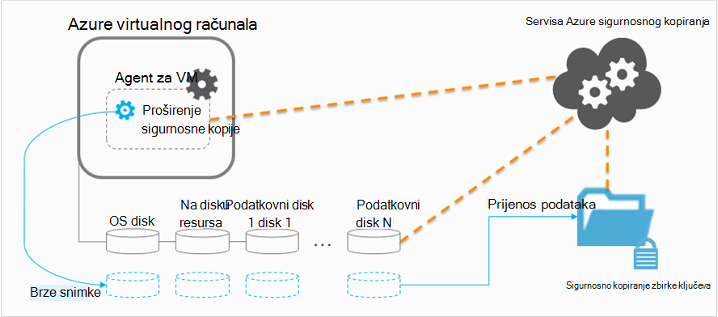

<properties
    pageTitle="Planiranje preduvjete VM sigurnosne kopije infrastrukture u Azure | Microsoft Azure"
    description="Važne napomene vezane uz planiranje sigurnosne kopije virtualnim strojevima servisu Azure"
    services="backup"
    documentationCenter=""
    authors="markgalioto"
    manager="cfreeman"
    editor=""
    keywords="sigurnosno kopiranje vms, sigurnosno kopiranje virtualnim strojevima"/>

<tags
    ms.service="backup"
    ms.workload="storage-backup-recovery"
    ms.tgt_pltfrm="na"
    ms.devlang="na"
    ms.topic="article"
    ms.date="10/19/2016"
    ms.author="trinadhk; jimpark; markgal;"/>

# <a name="plan-your-vm-backup-infrastructure-in-azure"></a>Planiranje preduvjete VM sigurnosne kopije infrastrukture u Azure
Ovaj članak sadrži performanse i prijedloge resursa da biste lakše isplanirali preduvjete VM infrastrukture za sigurnosno kopiranje. Definira i ključne aspekte servis sigurnosnog kopiranja ove aspekte može biti ključne prilikom određivanja arhitektura, Planiranje i raspored kapaciteta. Ako ste [spremni okruženju sustava](backup-azure-vms-prepare.md), to je na sljedeći korak prije početka [sigurnosno kopiranje VMs](backup-azure-vms.md). Ako trebate dodatne informacije o Azure virtualnim strojevima, potražite u [dokumentaciji virtualnih računala](https://azure.microsoft.com/documentation/services/virtual-machines/).

## <a name="how-does-azure-back-up-virtual-machines"></a>Kako Azure sigurnosno kopiranje virtualnih računala?
Kada je servis Azure sigurnosne kopije pokreće sigurnosno kopiranje zakazano vrijeme, pokreće se sigurnosno kopiranje nastavak da biste preuzeli snimku točke u vrijeme. Te snimke koristi se u koordinaciji s na glasnoću sjene Kopiraj servisa (VSS) da biste dobili dosljedan snimke od diskova u virtualnog računala bez potrebe da biste ga isključili.

Kada se koristi se snimke, podaci se prenose Azure sigurnosne kopije servis sigurnosno kopiranje zbirke ključeva. Da biste učinkovito postupak sigurnosnog kopiranja, servis prepoznaje i prenosi blokovi podataka koji su se promijenile od zadnjeg sigurnosnu kopiju.



Nakon dovršetka prijenosa podataka, snimka se uklanja, a zatim stvori točka za oporavak.

### <a name="data-consistency"></a>Dosljednost podataka
Sigurnosno kopiranje i vraćanje tvrtke ključnih podataka je komplicirano po činjenica da mora biti sigurnosno ključnih podataka tvrtke tijekom aplikacije koje daju podatke izvodi. Da biste to riješili, sigurnosno kopiranje Azure nudi aplikacije dosljedan sigurnosne kopije za Microsoft radnih opterećenja pomoću VSS da biste bili sigurni podataka ispravno napisan za pohranu.

>[AZURE.NOTE] Za Linux virtualnim strojevima samo dosljedan datoteku sigurnosne kopije su moguće, jer Linux nema ekvivalentnu platformu za VSS.

Azure sigurnosne kopije preuzima VSS puno kopija Windows VMs (Dodatne informacije o [VSS sigurnosnu kopiju cijelog](http://blogs.technet.com/b/filecab/archive/2008/05/21/what-is-the-difference-between-vss-full-backup-and-vss-copy-backup-in-windows-server-2008.aspx)za čitanje). Da biste omogućili VSS sigurnosne kopije, u ispod registra ključ mora biti postavljena na na VM.

```
[HKEY_LOCAL_MACHINE\SOFTWARE\MICROSOFT\BCDRAGENT]
"USEVSSCOPYBACKUP"="TRUE"
```


Ova tablica donosi vrste dosljednost i uvjete koje se pojavljuju u odjeljku tijekom Azure VM sigurnosno kopiranje i vraćanje postupke.

| Dosljednost | VSS-poštu | Objašnjenje i detalja |
|-------------|-----------|---------|
| Dosljednost aplikacije | Da | Ovo je vrsta idealna dosljednost za Microsoft radnih opterećenja kao osigurava da:<ol><li> Na VM *pokretati prema gore*. <li>Postoji *bez oštećenja*. <li>Nema *gubitka podataka*.<li> Podaci su dosljedan aplikaciji koja koristi podatke, tako da obuhvaćaju aplikacije u trenutku sigurnosnog kopiranja – pomoću VSS.</ol> Većina radnih opterećenja Microsoft imati VSS autorima koje specifične za radno opterećenje akcije koje su povezane podatke dosljednost. Ako, na primjer, Microsoft SQL Server je napisao VSS koji jamči da zapisivanja u zapisnik transakcija i baza podataka gotovi pravilno da.<br><br> Azure VM sigurnosne kopije, početak točku aplikacije dosljedan oporavak znači sigurnosne kopije proširenje mogao pozovete tijek rada VSS i dovršavanja *pravilno* prije snimanja VM snimke. Prirodno, to znači da ste autorima VSS aplikacija u Azure VM te je pozvati.<br><br>( [Osnove VSS](http://blogs.technet.com/b/josebda/archive/2007/10/10/the-basics-of-the-volume-shadow-copy-service-vss.aspx) i prikazali duboke detalja o [načina funkcioniranja tijeka rada](https://technet.microsoft.com/library/cc785914%28v=ws.10%29.aspx)). |
| Dosljednost datotečnom sustavu | Da – za računala sa sustavom Windows | Postoje dva scenarija gdje točke oporavak može biti *datoteka sustava dosljedan*:<ul><li>Sigurnosne kopije Linux VMs u Azure, jer Linux nema ekvivalentnu platformu za VSS.<li>Pogreška VSS tijekom sigurnosne kopije za Windows VMs u Azure.</li></ul> U oba tim slučajevima najbolje koje je moguće izvršiti je provjerite: <ol><li> Na VM *pokretati prema gore*. <li>Postoji *bez oštećenja*.<li>Nema *gubitka podataka*.</ol> Aplikacije moraju implementirati vlastite mehanizam "popravak kopirane" na vraćene podatke.|
| Pasti dosljednosti | ne | U ovom slučaju jednako virtualnog računala koja se pojave "pad" (putem ili mekim ili teško vraćanja izvornih postavki). To se obično događa kada Azure virtualnog računala isključi trenutku sigurnosnu kopiju. Sigurnosnih kopija Azure virtualnog računala početak sredstava točke rušenje dosljedan oporavak sigurnosne Azure omogućuje bez jamstva oko dosljednost podatke na pohranjivanje – iz perspektive operacijski sustav ili iz perspektive aplikacije. Samo podaci koji već postoji na disku u trenutku sigurnosne kopije je što se bilježe i sigurnosnu kopiju. <br/> <br/> Dok je ne jamstva, u većini slučajeva, operacijski sustav će se pokrenuti. To obično slijedi postupak koji se na disku provjeru, kao što su chkdsk, da biste ispravili pogreške oštećenja. Svi podaci u memoriji ili pisanja koje ste nije potpuno izbrisana na disk izgubit će se. Aplikacija s vlastiti mehanizam provjere obično slijedi u slučaju da podaci vraćanje je potrebno učiniti. <br><br>Na primjer, ako je zapisnik transakcija stavke koje se nalaze u bazi podataka, zatim softver za bazu podataka ne vraćanje dok se podaci nalaze u skladu. Kada je podataka podjele na više virtualne diskova (kao što je rastegnute jedinice), točku rušenje dosljedan oporavak nudi bez jamstva ispravnosti podataka.|


## <a name="performance-and-resource-utilization"></a>Upotreba performanse i resursa
Kao što je softver za sigurnosno kopiranje koji je distribuiranih lokalnog, trebali biste planiranja kapaciteta i Upotreba resursa potrebama kada sigurnosno kopiranje VMs u Azure. [Ograničenja prostora za pohranu Azure](azure-subscription-service-limits.md#storage-limits) odredite kako strukturirati VM implementacijama da biste dobili maksimalno performansi uz Minimalna utjecaj na pokrenut radnih opterećenja.

Obratite pozornost na sljedeća ograničenja prostora za pohranu Azure prilikom planiranja sigurnosne kopije performanse:

- Max izlazne po računu za pohranu
- Zahtjev za Ukupno stopa za pohranu računa

### <a name="storage-account-limits"></a>Ograničenja prostora za pohranu računa
Kad god sigurnosne kopije podaci kopiraju se s računa za pohranu, broji prema operacija ulaza i izlaza po sekundi (IOPS) i izlazne (ili propusnost) mjernih podataka računa za pohranu. U isto vrijeme virtualnim strojevima su pokrenuti i troše IOPS i propusnost. Cilj je da biste bili sigurni ukupni promet - sigurnosne kopije i virtualnog računala - premašuju račun ograničenja prostora za pohranu.

### <a name="number-of-disks"></a>Broj diskova
Postupak sigurnosnog kopiranja pokušava najbrže što može dovršenje zadatka sigurnosnog kopiranja. Tako, troši proizvoljan broj resurse kao što je moguće. Međutim, sve operacije/i ograničeni su po *Cilj propusnost za jednu Blob*koji ima ograničenje od 60 MB sekundi. Pokušaj Maksimiziranje brzinu, postupak sigurnosnog kopiranja pokušava sigurnosne kopije svih na VM diskova *paralelno*. Tako, ako je VM ima četiri diskova, zatim sigurnosno kopiranje Azure pokušava sigurnosno kopirajte sve četiri diskova paralelno. Zbog toga najvažnije faktor određivanje sigurnosne kopije promet zatvaranja računa za pohranu klijenta je **broj diskova** stvaranje sigurnosnih kopija na računu za pohranu.

### <a name="backup-schedule"></a>Raspored sigurnosnog kopiranja
Dodatni faktor koji utječe performanse je **raspored sigurnosnog kopiranja**. Konfigurirajte pravilnike tako da sva VMs sigurnosno kopiraju u isto vrijeme, zakazali promet zastoj. Postupak sigurnosnog kopiranja će pokušati sigurnosne kopije svih disketa paralelno. Da biste smanjili sigurnosne kopije promet s računa za pohranu je – provjerite imaju različite VMs sigurnosne kopije na različita doba dana s nema preklapanja.

## <a name="capacity-planning"></a>Planiranje kapaciteta
Izgradnja sljedećih čimbenika, to znači da korištenje spremišta račun nije potrebno pravilno planiranog. Preuzmite [VM sigurnosne kopije kapaciteta planiranja proračunsku tablicu programa Excel](https://gallery.technet.microsoft.com/Azure-Backup-Storage-a46d7e33) da biste vidjeli utjecaj na disku i odabire raspored sigurnosnog kopiranja.

### <a name="backup-throughput"></a>Sigurnosno kopiranje propusnost
Za svaki disk stvara sigurnosnu kopiju, Azure sigurnosne kopije čita blokova na disku i sprema samo promijenjene podatke (rastuće sigurnosne kopije). Ova tablica prikazuje prosječnu propusnost vrijednosti koje možete očekivati iz sigurnosne kopije Azure. Koristite, možete procjenu vremenskog razdoblja koja će trebati sigurnosne kopije na disku određene veličine.

| Postupak stvaranja sigurnosne kopije | Najpovoljnijeg propusnost |
| ---------------- | ---------- |
| Početna sigurnosnog kopiranja | 160 MB/s |
| Sigurnosno kopiranje rastuća (DR) | 640 MB/s <br><br> U ovom propusnost možete znatno odbaciti ako postoji mnogo raspršenim churn na disk koji je potrebno za sigurnosno kopiranje. |

## <a name="total-vm-backup-time"></a>Ukupno vrijeme VM sigurnosne kopije
Dok je većina sigurnosne kopije vremena potrošeno na čitanje i kopiranje podataka, postoje drugi operacije koje pridonose Ukupno vrijeme potrebno za sigurnosno kopiranje s VM:

- Vrijeme potrebno za [instalaciju ili ažurirajte sigurnosne kopije datotečni nastavak](backup-azure-vms.md#offline-vms).
- Vrijeme snimke koju je vrijeme potrebno za pokretanje brze snimke. Snimke se aktiviraju blizu zakazano vrijeme sigurnosne kopije.
- Vrijeme čekanja u redu. Budući da servis za sigurnosno kopiranje obrađuje sigurnosne kopije više klijenata, kopiranje sigurnosne kopije podataka iz snimke u sigurnosno kopiranje ili oporavak servisa sigurnog neće započeti odmah. U vrijeme Vršna učitajte, čekanja mogu rastezanje do osam sati zbog broj kopija obrade. Međutim, ukupno vrijeme sigurnosne kopije VM neće biti manje od 24 sata dnevno sigurnosne kopije pravila.

## <a name="best-practices"></a>Najbolje prakse
Predlažemo da slijedeći ove savjete tijekom konfiguriranja sigurnosne virtualnim računalima sustava:

- Ne raspored više od četiri klasični VMs iz iste servis u oblaku sigurnosnu kopiju u isto vrijeme. Predlažemo da staggering vremena početka sigurnosno kopiranje sat vremena ako želite da sigurnosno kopirate više VMs s istom servis u oblaku.
- Zakazivanje većoj od 40 resursima implementiran VMs sigurnosnu kopiju u isto vrijeme.
- Zakazivanje sigurnosne kopije VM tijekom vremena koje nisu Vršna tako da servis za sigurnosne kopije koristi IOPS za prijenos podataka s računa za pohranu klijenta za sigurnosno kopiranje ili oporavak servisa sigurnog.
- Provjerite je li pravilo adrese je VMs dodijeliti većem prostora za pohranu za različite račune. Predlažemo da više od 20 disketa s računa za jednu za pohranu zaštićen jedan pravila. Ako imate veće od 20 diskova na računu za pohranu, šire te VMs preko više pravila da biste dobili potrebne IOPS tijekom faze prijenos postupaka sigurnosnog kopiranja.
- Vraćanje VM na ostalo Premium za pohranu isti račun za pohranu. Ako se operacija postupak vraćanja coincides operacijom sigurnosne kopije, smanjuje dostupne IOPS za sigurnosno kopiranje.
- Preporučujemo da koristite svaki VM Premium na račun za pohranu distinct premium da biste omogućili optimalne performanse sigurnosne kopije.

## <a name="data-encryption"></a>Šifriranje podataka

Azure sigurnosne kopije šifriranje podataka u sklopu postupak sigurnosnog kopiranja. Međutim, šifriranje podataka unutar na VM i jednostavno sigurnosno kopiranje zaštićenog podataka (Dodatne informacije o [sigurnosnu kopiju šifrirane podatke](backup-azure-vms-encryption.md)za čitanje).


## <a name="how-are-protected-instances-calculated"></a>Način izračuna zaštićeni instance?
Azure virtualnih računala koje se sigurnosno putem sigurnosne kopije Azure podliježe [sigurnosne kopije Azure cijene](https://azure.microsoft.com/pricing/details/backup/). Izračun zaštićeni instance temelji se na *stvarnoj* veličini virtualnog računala, što je zbroj svih podataka u virtualnog računala – bez "disk resursa".

Koje se *ne* naplaćuju koji se temelji na maksimalne veličine koja je podržana za svaki podatkovni disk priložena virtualnog računala, ali na stvarnih podataka pohranjenih u podatkovni disk. Na sličan način naplate sigurnosne kopije za pohranu temelji se na količinu podataka koja je spremljena s Azure sigurnosne kopije, što je zbroj stvarnih podataka u svakom točka vraćanja.

Na primjer, potrebno je A2 standardne veličine virtualnog računala koja ima dvije diskova dodatne podatke s Maksimalna veličina 1 TB. Tablica u nastavku nudi stvarnih podataka pohranjene u svakom od tih diskova:

|Vrsta diska|Maksimalna veličina|Prikaz stvarnih podataka|
|---------|--------|------|
| Operacijski sustav na disku | 1023 GB | 17 GB |
| Na lokalnom disku / disk resursa | 135 GB | 5 GB (neće biti uvršteni za sigurnosno kopiranje) |
| Podatkovni disk 1 | 1023 GB | 30 GB |
| Podatkovni disk 2 | 1023 GB | 0 GB |

U ovom slučaju, *stvarnoj* veličini virtualnog računala je 17 GB + 30 GB + 0 GB = 47 GB. To će biti zaštićene instancu veličine mjesečni račun temelji se na. Rastom količinu podataka u virtualnog računala zaštićeni instancu veličinu za naplatu i će promijeniti sukladno tome.

Naplata neće započeti dok se prvo sigurnosno kopiranje uspješno je dovršena. Sada će početi naplate za pohranu i zaštićene instance. Naplata i dalje dok god postoji *sigurnosne kopije podataka spremljena s Azure sigurnosne kopije* za virtualnog računala. Izvođenje operacije Prekini zaštitu zaustavite naplata ako sigurnosne kopije podaci se zadržavaju.

Naplata za navedeni virtualnog računala će biti ukinute samo ako je zaštitu Zaustavi *i* sigurnosne kopije podataka izbrisati. Kada je aktivna sigurnosne kopije poslovi (kada je zaštita prestao je), veličina virtualnog računala vrijeme zadnje uspješno sigurnosno kopiranje postaje veličinu zaštićeni instancu koju mjesečni račun temelji se na.

## <a name="questions"></a>Pitanja?
Ako imate pitanja ili ako postoji svih značajki koje želite da biste vidjeli sadrži, [Pošaljite nam povratnu informaciju](http://aka.ms/azurebackup_feedback).

## <a name="next-steps"></a>Daljnji koraci

- [Stvaranje sigurnosne kopije virtualnim strojevima](backup-azure-vms.md)
- [Upravljanje sigurnosne kopije virtualnog računala](backup-azure-manage-vms.md)
- [Vraćanje virtualnim strojevima](backup-azure-restore-vms.md)
- [Otklanjanje poteškoća s VM sigurnosne kopije](backup-azure-vms-troubleshoot.md)
