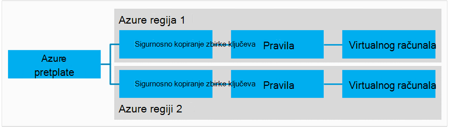
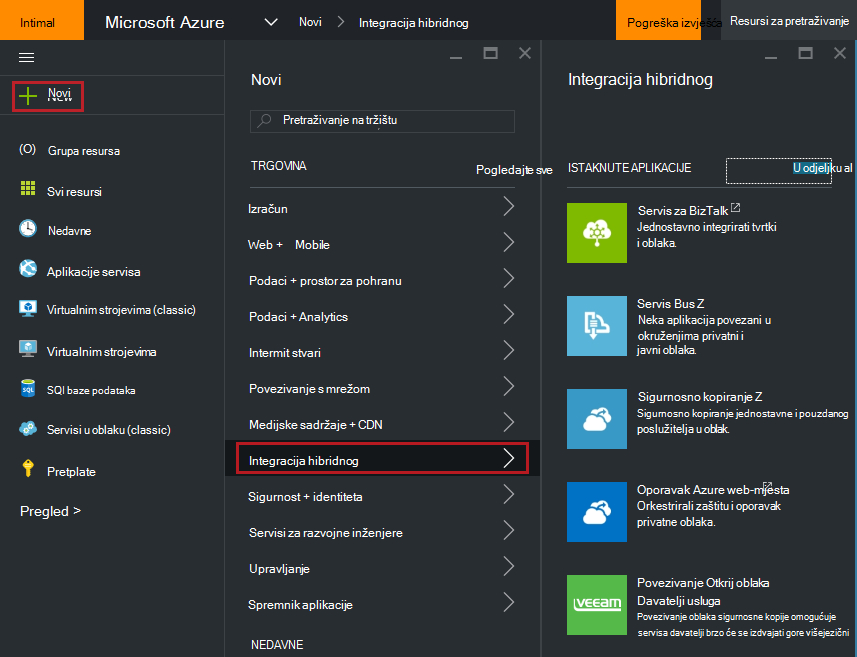
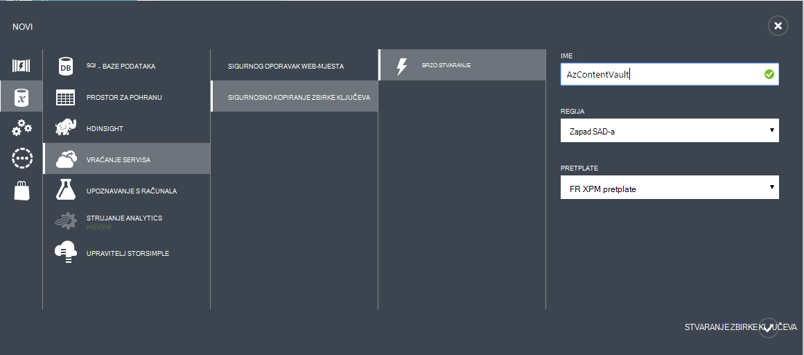
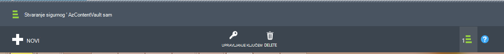
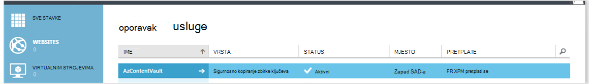
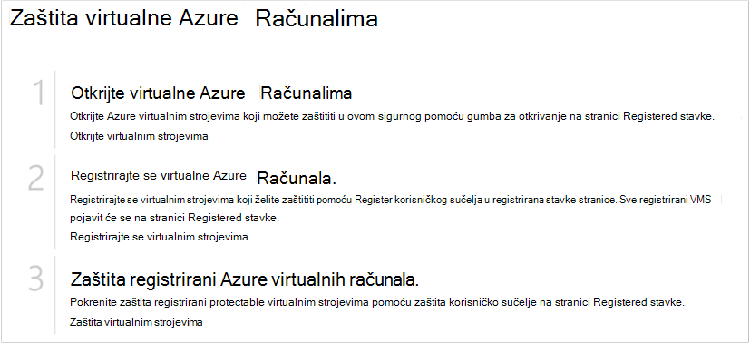
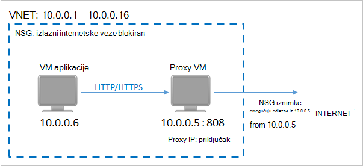
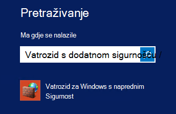
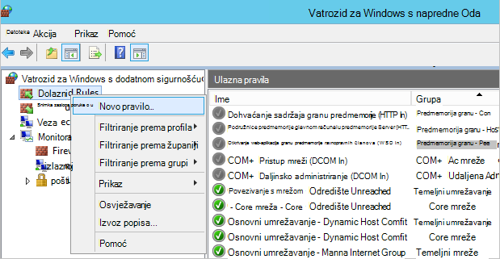
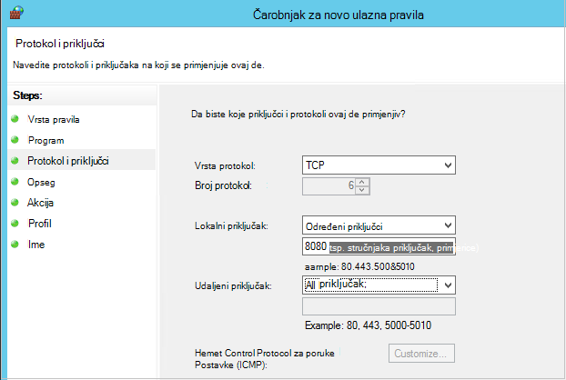

<properties
    pageTitle="Priprema vaše okruženje za sigurnosno kopiranje Azure virtualnim strojevima | Microsoft Azure"
    description="Provjerite je li vaše okruženje je pripremiti za sigurnosno kopiranje virtualnim strojevima servisu Azure"
    services="backup"
    documentationCenter=""
    authors="markgalioto"
    manager="cfreeman"
    editor=""
    keywords="sigurnosno kopiranje; sigurnosno kopiranje;"/>

<tags
    ms.service="backup"
    ms.workload="storage-backup-recovery"
    ms.tgt_pltfrm="na"
    ms.devlang="na"
    ms.topic="article"
    ms.date="08/26/2016"
    ms.author="trinadhk; jimpark; markgal;"/>


# <a name="prepare-your-environment-to-back-up-azure-virtual-machines"></a>Pripremu okruženja za sigurnosno kopiranje Azure virtualnim strojevima

> [AZURE.SELECTOR]
- [Model upravitelj resursa](backup-azure-arm-vms-prepare.md)
- [Klasični modela](backup-azure-vms-prepare.md)

Prije nego što se može sigurnosno kopirati Azure virtualnog računala (VM), postoje tri uvjeta mora postojati.

- Morate stvoriti sigurnosnu kopiju sigurnog ili prepoznavanje na postojeće sigurnosne kopije sigurnog *u području isti kao vaše VM*.
- Uspostavljanje mrežne veze između Azure javno internetske adrese i krajnje točke Azure prostora za pohranu.
- Kliknite pločicu VM agent na VM.

Ako znate da sljedeće uvjete već postoje u okruženju sustava zatim nastavite s [sigurnosnu kopiju vašeg VMs članka](backup-azure-vms.md). U suprotnom, nastavite čitati, u ovom se članku će vas voditi kroz korake za pripremu okruženja za sigurnosno kopiranje programa Azure VM.


## <a name="limitations-when-backing-up-and-restoring-a-vm"></a>Ograničenja kad sigurnosno kopiranje i vraćanje na VM

>[AZURE.NOTE] Azure sadrži dvije implementacije modela za stvaranje i rad s resursima: [Voditelj resursa i classic](../resource-manager-deployment-model.md). Sljedeći popis sadrži ograničenja prilikom implementacije u klasični modelu.

- Sigurnosno kopiranje virtualnim strojevima s više od 16 diskova podataka nije podržana.
- Sigurnosno kopiranje virtualnim strojevima s rezerviranim IP adresa i bez definirani krajnje točke nije podržana.
- Sigurnosno kopiranje podataka ne obuhvaća mreže postavljena pogona priložiti VM. 
- Zamjena postojećeg virtualnog računala tijekom vraćanja nije podržana. Najprije izbrišite postojeće virtualnog računala i sve povezane diskova, a zatim vratiti podatke iz sigurnosne kopije.
- Više područja sigurnosno kopiranje i vraćanje nije podržana.
- Sigurnosno kopiranje virtualnih računala pomoću servisa Azure sigurnosne kopije podržana u svim područjima javno Azure (pogledajte [kontrolnog popisa](https://azure.microsoft.com/regions/#services) podržanih regija). Ako regiju koju tražite nije podržana danas, on se neće pojaviti na padajućem popisu tijekom stvaranja zbirke ključeva.
- Sigurnosno kopiranje virtualnih računala pomoću servisa Azure sigurnosne kopije je podržano samo za verzije odaberite operacijski sustav:
  - **Linux**: Azure sigurnosne kopije podržava [popis raspodjele koji su licencira po Azure](../virtual-machines/virtual-machines-linux-endorsed-distros.md) osim Core OS Linux. Distribucija druge Premjesti-vaše – vlasnik – Linux možda sve dok se VM agent dostupna je na virtualnog računala i podrška za Python postoji.
  - **Windows Server**: verzije starije od Windows Server 2008 R2 nisu podržane.
- Vraćanje kontroler domene VM (Kontroler) koja je dio višestruki Kontroler konfiguracije podržana je samo putem komponente PowerShell. Dodatne informacije o [vraćanju kontroler višestruki Kontroler domene](backup-azure-restore-vms.md#restoring-domain-controller-vms).
- Vraćanje virtualnim strojevima koji imaju sljedeće posebne mrežnim konfiguracijama podržana je samo putem komponente PowerShell. VMs koje stvarate pomoću tijeka rada za vraćanje u korisničkom Sučelju ne sadrži ove konfiguracije mreže nakon dovršetka postupka vraćanja. Dodatne informacije potražite u članku [Obnavljanje VMs s posebnim mrežnim konfiguracijama](backup-azure-restore-vms.md#restoring-vms-with-special-netwrok-configurations).
    - Virtualnim strojevima u odjeljku konfiguracije raspoređivača opterećenja (interne i vanjske)
    - Virtualnim strojevima s više rezerviranih IP adresa
    - Virtualnim strojevima sa većeg broja mrežnih prilagodnika

## <a name="create-a-backup-vault-for-a-vm"></a>Stvaranje sigurnosne kopije zbirke ključeva za na VM

Sigurnosno kopiranje zbirke ključeva je entitet koji pohranjuje sigurnosne kopije i oporavak točke stvorenog tijekom vremena. Sigurnosno kopiranje zbirke ključeva sadrži sigurnosne kopije pravila koja će se primijeniti na virtualnim strojevima stvara sigurnosnu kopiju.

Na ovoj se slici prikazuje odnose između različitih entiteti sigurnosne kopije Azure:     

Stvaranje sigurnosne kopije sigurnog:

1. Prijavite se na [portal za Azure](http://manage.windowsazure.com/).

2. Na portalu za Azure kliknite **Novo** > **Integracija hibridnog** > **sigurnosnu kopiju**. Kada kliknete **sigurnosne kopije**, koje se automatski prijeći u klasični portal (prikazan nakon bilješke).

    

    >[AZURE.NOTE] Ako pretplatu zadnjeg korištenja na portalu klasični, pretplate može se otvoriti na portalu klasični. U tom slučaju, da biste stvorili sigurnosnu kopiju sigurnog, kliknite **Novo** > **Data Services** > **Oporavak Services** > **Sigurnosne kopije sigurnog** > **Brzo stvaranje** (pogledajte na slici u nastavku).

    

3. U odjeljku **naziv**unesite neslužbeni naziv da biste odredili na zbirke ključeva. Naziv mora biti jedinstvena za Azure pretplatu. Upišite naziv koji sadrži od 2 do 50 znakova. Morate pokrenuti slovom i mogu sadržavati samo slova, brojeve i spojnice.

4. U **regiji**, odaberite regiji u zbirke ključeva. Na sigurnog mora biti u istom području kao virtualnim strojevima koji želite zaštititi. Ako imate virtualnim strojevima u više područja, morate stvoriti sigurnosnu kopiju sigurnog na svakom području. Nema potrebe da biste odredili račune za pohranu za spremanje sigurnosne kopije podataka – sigurnosno kopiranje zbirke ključeva i ručicu servisa Azure sigurnosne kopije to automatski.

5. U **pretplate** odaberite pretplatu koju želite pridružiti sigurnosno kopiranje zbirke ključeva. Pojavit će se više mogućnosti samo ako je povezan s više pretplata Azure računa tvrtke ili ustanove.

6. Kliknite **Stvaranje sigurnog**. Može potrajati neko vrijeme da sigurnosno kopiranje zbirke ključeva će biti stvoren. Praćenje obavijesti o statusu pri dnu portalu.

    

7. Poruka će potvrdite da se sigurnog uspješno je stvorena. On će biti naveden na stranici **servisa oporavak** kao **aktivnu**. Obavezno odaberite mogućnost desno zalihosti odgovarajuće prostora za pohranu nakon stvaranja u zbirke ključeva. Saznajte više o [postavljanju zalihosti mogućnost pohrane u sigurnosno kopiranje zbirke ključeva](backup-configure-vault.md#azure-backup---storage-redundancy-options).

    

8. Kliknite sigurnosne kopije sigurnog otvorite stranicu **Brzi Start** gdje se upute za stvaranje sigurnosne kopije Azure virtualnim strojevima prikazuju.

    


## <a name="network-connectivity"></a>Veza s mrežom

Da biste upravljali VM snimke, sigurnosno kopiranje proširenje mora veza s Azure javnu IP adrese. Bez desnom internetska veza virtualnog računala HTTP zatraži istek vremena i sigurnosne kopije operacija neće uspjeti. Ako implementaciju sustava ima ograničenja pristupa na mjestu (putem mreže sigurnosne grupe (NSG), na primjer), zatim odaberite neku od ovih mogućnosti za dohvat Očisti put za sigurnosne kopije promet:

- [Rasponi Whitelist Azure podatkovnog centra IP](http://www.microsoft.com/en-us/download/details.aspx?id=41653) - potražite u članku upute na način da biste whitelist na IP adrese.
- Implementacija HTTP proxy poslužitelj za usmjeravanje prometa.

Pri odabiru koju mogućnost da biste koristili u gubitke su između mogućnost upravljanja, zrnastog kontrole i trošak.

|Mogućnost|Prednosti|Nedostaci|
|------|----------|-------------|
|Whitelist IP rasponi| Bez dodatnih troškova.<br><br>Za otvaranje programa access u programa NSG, koristite cmdlet <i>Skup AzureNetworkSecurityRule</i> . | Složena da biste upravljali kao utjecati na IP rasponi mijenjaju tijekom vremena.<br><br>Omogućuje pristup cijeli od Azure, a ne samo za pohranu.|
|HTTP proxy| Zrnastog nad proxyju prostora za pohranu dopušteno URL-ova.<br>Pristup jednu točku Internet VMs.<br>Ne primjenjuje promjenama Azure IP adrese.| Dodatne troškove za pokretanje programa VM sa softverom za proxy poslužitelj.|

### <a name="whitelist-the-azure-datacenter-ip-ranges"></a>Rasponi IP Whitelist Azure podatkovnim centrom

Whitelist IP rasponi Azure podatkovnog centra potražite sustava [Azure web-mjesto](http://www.microsoft.com/en-us/download/details.aspx?id=41653) detalje na IP rasponi i upute.

### <a name="using-an-http-proxy-for-vm-backups"></a>Korištenje HTTP proxy sigurnosnih kopija VM
Kada sigurnosno kopiranje s VM, sigurnosne kopije nastavak na na VM šalje snimke upravljanje naredbe za pohranu Azure pomoću HTTPS API. Usmjeravanje prometa sigurnosne kopije proširenje HTTP proxy Budući da je to jedina komponenta konfigurirana za pristup Internetu javno.

>[AZURE.NOTE] Postoji nema preporuku za proxy softver koji želite koristiti. Provjerite je li odaberete proxy kompatibilan s konfiguracije korake u nastavku.

Primjer slici u nastavku prikazuje tri konfiguracijske korake potrebne da biste koristili HTTP proxy:

- Aplikacija VM usmjerava sve HTTP promet vezana za javne Internet kroz Proxy VM.
- Proxy VM dopušta promet iz VMs u virtualne mreže.
- Na mreži sigurnosnih grupa (NSG) pod nazivom NSF-zaključati da biste potrebno je sigurnost pravilo allowing izlaznog internetski promet iz Proxy VM.



Da biste koristili HTTP proxy za komunikaciju javnog Interneta, slijedite ove korake:

#### <a name="step-1-configure-outgoing-network-connections"></a>Korak 1. Konfiguriranje izlazne mrežne veze
###### <a name="for-windows-machines"></a>Za računala za Windows
To će se instalacija konfiguracija proxy poslužitelja za lokalni račun sustava.

1. Preuzmite [PsExec](https://technet.microsoft.com/sysinternals/bb897553)
2. Sljedeća Naredba Pokreni s dodatnim upita

     ```
     psexec -i -s "c:\Program Files\Internet Explorer\iexplore.exe"
     ```
     Otvorit će se prozor za internet explorer.
3. Idi na Alati -> internetske mogućnosti -> veza -> Postavke LAN-a.
4. Provjerite postavke proxy poslužitelja za račun sustava. Postavljanje IP proxy poslužitelja i priključka.
5. Zatvorite Internet Explorer.

Postavit će strojno razini proxy konfiguracije te će se koristiti za sve odlazni promet HTTP/HTTPS.

Ako instalacijski program proxy poslužitelj na trenutni korisnički račun (ne lokalni sustav račun), koristite sljedeću skriptu da biste primijenili SYSTEMACCOUNT:

```
   $obj = Get-ItemProperty -Path Registry::”HKEY_CURRENT_USER\Software\Microsoft\Windows\CurrentVersion\Internet Settings\Connections"
   Set-ItemProperty -Path Registry::”HKEY_USERS\S-1-5-18\Software\Microsoft\Windows\CurrentVersion\Internet Settings\Connections" -Name DefaultConnectionSettings -Value $obj.DefaultConnectionSettings
   Set-ItemProperty -Path Registry::”HKEY_USERS\S-1-5-18\Software\Microsoft\Windows\CurrentVersion\Internet Settings\Connections" -Name SavedLegacySettings -Value $obj.SavedLegacySettings
   $obj = Get-ItemProperty -Path Registry::”HKEY_CURRENT_USER\Software\Microsoft\Windows\CurrentVersion\Internet Settings"
   Set-ItemProperty -Path Registry::”HKEY_USERS\S-1-5-18\Software\Microsoft\Windows\CurrentVersion\Internet Settings" -Name ProxyEnable -Value $obj.ProxyEnable
   Set-ItemProperty -Path Registry::”HKEY_USERS\S-1-5-18\Software\Microsoft\Windows\CurrentVersion\Internet Settings" -Name Proxyserver -Value $obj.Proxyserver
```

>[AZURE.NOTE] Ako "(407) provjera autentičnosti proxy poslužitelja potrebna" pridržavajte se u zapisniku proxy poslužitelj, provjerite svoje authrntication ispravno je postavljena.

######<a name="for-linux-machines"></a>Za Linux računalima

Dodajte na sljedeći redak u ```/etc/environment``` datoteke:

```
http_proxy=http://<proxy IP>:<proxy port>
```

Dodajte sljedeće retke da biste na ```/etc/waagent.conf``` datoteke:

```
HttpProxy.Host=<proxy IP>
HttpProxy.Port=<proxy port>
```

#### <a name="step-2-allow-incoming-connections-on-the-proxy-server"></a>Korak 2. Dopusti dolazne veze na proxy poslužitelju:

1. Proxy poslužitelj, otvorite Vatrozid za Windows. Da biste pristupili vatrozida najjednostavnije da biste potražili Vatrozid za Windows s dodatnom sigurnošću.

    

2. U dijaloškom okviru Vatrozid za Windows, desnom tipkom miša kliknite **Ulazna pravila** , a zatim kliknite **… Novo pravilo**.

    

3. U **Novi dolazni Čarobnjak za pravila**odabrali mogućnost **Prilagođeni** **Vrste pravila** , a zatim kliknite **Dalje**.

4. Na stranici da biste odabrali **Program**, odaberite **Svi programi** , a zatim kliknite **Dalje**.

5. Na stranici **protokol i priključaka** unesite sljedeće podatke, a zatim kliknite **Dalje**:

    

    - za *vrstu protokol* odaberite *TCP*
    - *Lokalni priključak* odabrati *Određene priključke*, u polje ispod navesti na ```<Proxy Port>``` koji je konfiguriran.
    - *udaljeni priključak* odaberite *Svih priključaka*

    Do kraja čarobnjaka kliknite sve do završetka, a naziv ovog pravila.

#### <a name="step-3-add-an-exception-rule-to-the-nsg"></a>Korak 3. Dodajte pravilo iznimku na NSG:

U naredbeni redak programa Azure PowerShell unesite sljedeću naredbu:

Sljedeća naredba dodaje iznimku na NSG. Ova se iznimka omogućuje TCP promet iz bilo kojeg priključka na 10.0.0.5 sve internetsku adresu na priključak (HTTP) 80 i 443 (HTTPS). Ako tražite određeni priključak u javni Internet, obavezno da biste dodali te priključak na ```-DestinationPortRange``` kao i.

```
Get-AzureNetworkSecurityGroup -Name "NSG-lockdown" |
Set-AzureNetworkSecurityRule -Name "allow-proxy " -Action Allow -Protocol TCP -Type Outbound -Priority 200 -SourceAddressPrefix "10.0.0.5/32" -SourcePortRange "*" -DestinationAddressPrefix Internet -DestinationPortRange "80-443"
```

*Provjerite je li zamijeniti imena u primjeru s pojedinostima za implementaciju sustava.*


## <a name="vm-agent"></a>Agent za VM

Prije nego što se može sigurnosno kopirati Azure virtualnog računala, potrebno je provjeriti agent za Azure VM pravilno instaliran na virtualnog računala. Budući da VM agent je neobavezna komponenta trenutku stvorenoj virtualnog računala, provjerite je potvrđen okvir za VM agent prije nego što je dodjeli virtualnog računala.

### <a name="manual-installation-and-update"></a>Ručna instalacija i ažuriranje

Agent za VM već nalazi u VMs koje su stvorene iz galerije Azure. Međutim, virtualnim strojevima migriraju se od lokalnog podatkovnim centrima želite imati instaliran agent VM. Za pretraživanje kao VMs VM agent potrebno je instalirati izričito. Saznajte više o [instaliranju agent VM na postojeće VM](http://blogs.msdn.com/b/mast/archive/2014/04/08/install-the-vm-agent-on-an-existing-azure-vm.aspx).

| **Postupak** | **Windows** | **Linux** |
| --- | --- | --- |
| Instaliranje VM agent | <li>Preuzmite i instalirajte [agent MSI](http://go.microsoft.com/fwlink/?LinkID=394789&clcid=0x409). Trebat će vam administratorske ovlasti da biste dovršili instalaciju. <li>Određivanje je li instaliran agenta [ažurirali svojstvo VM](http://blogs.msdn.com/b/mast/archive/2014/04/08/install-the-vm-agent-on-an-existing-azure-vm.aspx) . | <li> Instalirajte najnovije [Linux agent](https://github.com/Azure/WALinuxAgent) iz GitHub. Trebat će vam administratorske ovlasti da biste dovršili instalaciju. <li> Određivanje je li instaliran agenta [ažurirali svojstvo VM](http://blogs.msdn.com/b/mast/archive/2014/04/08/install-the-vm-agent-on-an-existing-azure-vm.aspx) . |
| Ažuriranje VM agent | Ažuriranje VM agent jednostavan je ponovno instalirati [binarne datoteke VM agent](http://go.microsoft.com/fwlink/?LinkID=394789&clcid=0x409). <br><br>Provjerite je li nijedna sigurnosne kopije operacija sustavom dok VM agent ažurira. | Slijedite upute o [ažuriranju agent Linux VM ](../virtual-machines-linux-update-agent.md). <br><br>Provjerite je li nijedna sigurnosne kopije operacija sustavom dok VM agent ažurira. |
| Provjera valjanosti VM agent za instalaciju | <li>Dođite do mape u *C:\WindowsAzure\Packages* u Azure VM. <li>Trebali biste pronađete datoteku WaAppAgent.exe prezentacija.<li> Desnom tipkom miša kliknite datoteku, idite na **Svojstva**, a zatim odaberite karticu **Detalji** . Polje verziju proizvoda mora biti 2.6.1198.718 ili noviji. | N/D |


Informirajte se o [VM agent](https://go.microsoft.com/fwLink/?LinkID=390493&clcid=0x409) i [kako ga instalirati](https://azure.microsoft.com/blog/2014/04/15/vm-agent-and-extensions-part-2/).

### <a name="backup-extension"></a>Proširenje sigurnosne kopije

Da biste sigurnosno virtualnog računala, servisa Azure sigurnosne kopije instalira datotečni nastavak VM agent. Servis za Azure sigurnosne kopije jednostavno nadograđuje i zakrpa sigurnosne kopije nastavak bez intervencije dodatne korisnika.

Ako je pokrenut na VM je instaliran sigurnosne kopije datotečni nastavak. Izvodi VM omogućuje maksimalnog izgledi početak točku aplikacije dosljedan oporavak. Međutim, sigurnosno kopiranje Azure servisa će se i dalje sigurnosno kopiranje VM – čak i ako je isključena i nastavak nije moguće instalirati (ili izvanmrežno VM). U ovom slučaju točke oporavak bit će *rušenje dosljedan* kako je opisano iznad.


## <a name="questions"></a>Pitanja?
Ako imate pitanja ili ako postoji svih značajki koje želite da biste vidjeli sadrži, [Pošaljite nam povratnu informaciju](http://aka.ms/azurebackup_feedback).

## <a name="next-steps"></a>Daljnji koraci
Sad kad ste spremni okruženja za stvaranje sigurnosne kopije vaše VM, sljedeći logički je korak da biste stvorili sigurnosnu kopiju. U članku planiranje sadrži detaljne informacije o stvaranju sigurnosne kopije VMs.

- [Stvaranje sigurnosne kopije virtualnim strojevima](backup-azure-vms.md)
- [Planiranje preduvjete VM infrastrukture za sigurnosne kopije](backup-azure-vms-introduction.md)
- [Upravljanje sigurnosne kopije virtualnog računala](backup-azure-manage-vms.md)
