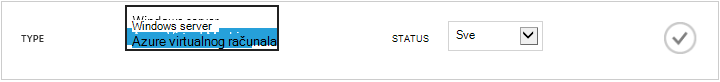
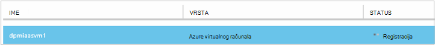
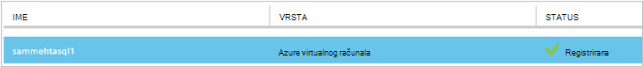
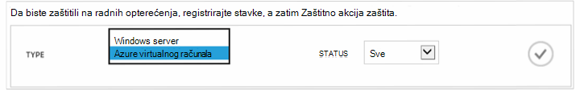
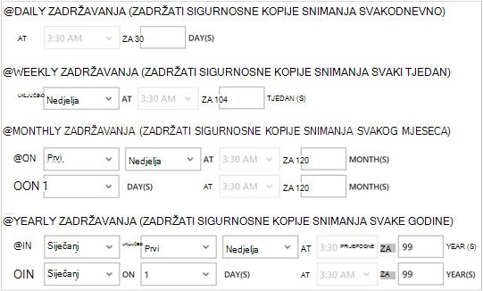

<properties
    pageTitle="Sigurnosno kopiranje Azure virtualnim strojevima | Microsoft Azure"
    description="Otkrivanje, registrirati i sigurnosno kopiranje virtualnim strojevima sa ove postupke za stvaranje sigurnosne kopije Azure virtualnog računala."
    services="backup"
    documentationCenter=""
    authors="markgalioto"
    manager="jwhit"
    editor=""
    keywords="sigurnosno kopiranje virtualnog računala; Stvaranje sigurnosne kopije virtualnog računala; sigurnosno kopiranje i Izrada oporavak; sigurnosno kopiranje VM"/>

<tags
    ms.service="backup"
    ms.workload="storage-backup-recovery"
    ms.tgt_pltfrm="na"
    ms.devlang="na"
    ms.topic="article"
    ms.date="09/28/2016"
    ms.author="trinadhk; jimpark; markgal;"/>

# Stvaranje sigurnosne kopije Azure virtualnim strojevima

> [AZURE.SELECTOR]
- [Sigurnosno kopiranje VMs za oporavak servisa sigurnog](backup-azure-arm-vms.md)
- [Sigurnosno kopiranje VMs za sigurnosno kopiranje zbirke ključeva](backup-azure-vms.md)

Ovaj članak sadrži postupke za sigurnosno kopiranje klasični implementiran Azure virtualni stroj (VM) da biste zbirke ključeva za sigurnosno kopiranje. Postoji nekoliko zadataka koje morate izvršiti prije nego što se može sigurnosno kopirati Azure virtualnog računala. Ako to još niste učinili, dovršite [preduvjeti](backup-azure-vms-prepare.md) za pripremu okruženja za stvaranje sigurnosne kopije vaše VMs.

Dodatne informacije potražite u člancima [Planiranje preduvjete VM sigurnosne kopije infrastrukture u Azure](backup-azure-vms-introduction.md) i [Azure virtualnim računalima](https://azure.microsoft.com/documentation/services/virtual-machines/).

>[AZURE.NOTE] Azure sadrži dvije implementacije modela za stvaranje i rad s resursima: [Voditelj resursa i Classic](../resource-manager-deployment-model.md). Sigurnosno kopiranje sigurnog samo možete zaštititi klasični implementiran VMs. Nije moguće zaštititi resursima implementiran VMs s zbirke ključeva za sigurnosno kopiranje. Potražite u članku [Stvaranje sigurnosne kopije VMs za oporavak servisa sigurnog](backup-azure-arm-vms.md) dodatne informacije o radu s sefovi servise za oporavak.

Sigurnosno kopiranje Azure virtualnim strojevima obuhvaća tri koraka ključa:

>[AZURE.NOTE] Sigurnosno kopiranje virtualnim strojevima je lokalni procesa. Ako ne možete kopirati virtualnim strojevima u jednom području za sigurnosno kopiranje zbirke ključeva u drugoj regiji. Tako, morate stvoriti sigurnosnu kopiju sigurnog na svakom području Azure gdje se nalaze VMs koji će se sigurnosna kopija.

## Korak 1 - otkrivanje Azure virtualnim strojevima
Da biste osigurali sve nove virtualnim strojevima (VMs) dodati u pretplati se identificirati prije registracije, pokrenite postupak otkrivanja. Naziv usluge oblaka i područja, kao što su upiti postupak Azure popis virtualnim strojevima u pretplatu, zajedno s dodatnim informacijama.

1. Prijava na [Classic portal](http://manage.windowsazure.com/)

2. Na popisu servisa Azure kliknite **Oporavak Services** da biste otvorili popis sefovi sigurnosno kopiranje i vraćanje web-mjesta.
    

3. Na popisu sefovi sigurnosno kopiranje odaberite sigurnog sigurnosne kopije na VM.

    Ako je ovo novi sigurnog portalu otvorit će se na stranicu za **Brzo pokretanje** .

    

    Ako na sigurnog prethodno konfigurirana, na portalu otvorit će se izbornik nedavno korištene.

4. Na izborniku sigurnog (pri vrhu stranice) kliknite **Registrirane stavke**.

    

5. S izbornika **Vrsta** odaberite **Azure virtualnog računala**.

    

6. Kliknite **OTKRIVANJE** pri dnu stranice.
    

    Postupak otkrivanja može potrajati nekoliko minuta dok su u tijeku pozivu virtualnim računalima. Postoji obavijesti pri dnu zaslona koji vam daje do znanja da se izvršava proces.

    

    Promjena obavijesti kada se postupak dovršite. Ako postupak otkrivanja niste pronašli virtualnim strojevima, najprije provjerite je li u VMs postoji. Ako postoji u VMs, provjerite je li u VMs se nalazite na istom području sigurnosno kopiranje zbirke ključeva. Ako na VMs postoji i u istom području, provjerite je li u VMs su nije registriran već sigurnosno kopiranje zbirke ključeva. Ako je na VM dodijeljena sigurnosno kopiranje zbirke ključeva nije dostupna želite dodijeliti drugim sefovi sigurnosne kopije.

    

    Nakon što ste pronađu nove stavke, idite na korak 2 i registrirati svoje VMs.

##  Korak 2 - Register Azure virtualnim strojevima
Registrirajte se Azure virtualnog računala za povezivanje sa servisom Azure sigurnosnu kopiju. To je obično jednokratne aktivnosti.

1. Dođite do sigurnosne kopije sigurnog pod **Oporavak usluge** na portalu za Azure, a zatim **Registrirana stavke**.

2. S padajućeg izbornika odaberite **Azure virtualnog računala** .

    

3. Kliknite **REGISTRIRATI** pri dnu stranice.
    

4. Na izborničkom prečacu **Registrirati stavki** odaberite virtualnim strojevima koji želite da biste registrirali. Ako postoje dva ili više virtualnim strojevima s istim nazivom, pomoću servisa u oblaku da biste ih razlikovali.

    >[AZURE.TIP] Više virtualnih računala mogu biti registrirani odjednom.

    Za svaki virtualnog računala koju ste odabrali stvara se posao.

5. Kliknite **Prikaz zadatka** u poruci s obavijesti da biste otvorili stranicu **zadatke** .

    

    Na popisu registrirani stavki, uključujući stanja postupka Registracija pojavljuje se i virtualnog računala.

    

    Prilikom dovršetka postupka promjenu statusa u skladu s vizualnim stanje *registriran* .

    

## Korak 3 – zaštita Azure virtualnim strojevima
Sada možete postaviti pravila za sigurnosno kopiranje i zadržavanja za virtualnog računala. Više virtualnim strojevima možete zaštititi pomoću jedan zaštita akcija.

Azure sigurnosne kopije sefovi stvorene nakon svibanj 2015 isporučuju uz zadani pravilnik ugrađen u na zbirke ključeva. Zadani pravilnik o isporučuje se s zadani zadržavanja 30 dana i jednom dnevnu raspored za sigurnosnog kopiranja.

1. Dođite do sigurnosne kopije sigurnog pod **Oporavak usluge** na portalu za Azure, a zatim **Registrirana stavke**.
2. S padajućeg izbornika odaberite **Azure virtualnog računala** .

    

3. Kliknite **zaštiti** pri dnu stranice.

    Pojavit će se **Čarobnjak za zaštitu stavke** . Čarobnjak navodi se samo na virtualnim strojevima registrirana i nije zaštićen. Odaberite virtualnim strojevima koji želite zaštititi.

    Ako postoje dva ili više virtualnim strojevima s istim nazivom, razlikovali virtualnih računala pomoću servisa u oblaku.

    >[AZURE.TIP] Istodobno možete zaštititi više virtualnih računala.

    

4. Odaberite **raspored sigurnosnog kopiranja** sigurnosne kopije virtualnim strojevima koju ste odabrali. Možete odabrati iz postojeći skup pravila ili definirajte novi.

    Svaki sigurnosne kopije pravila može imati više virtualnim strojevima pridružen. Međutim, virtualnog računala mogu se povezati samo s jednog pravila bilo kojem trenutku navedene u vremenu.

    

    >[AZURE.NOTE] Sigurnosne kopije pravila sadrži shemu zadržavanja za zakazano sigurnosne kopije. Ako ste odabrali postojećeg sigurnosne kopije pravila, ne možete mijenjati mogućnosti zadržavanja u sljedećem koraku.

5. Odaberite **raspon zadržavanja** želite pridružiti sigurnosnih kopija.

    

    Pravila zadržavanja određuje trajanja za spremanje sigurnosne kopije. Možete navesti različite zadržavanja na temelju ako je mjesto sigurnosne kopije. Na primjer, sigurnosne kopije točku snimanja svakodnevno (koji služi kao točku radu oporavak) mogu se očuvati za 90 dana. U usporedbi, točku sigurnosne kopije izvedena na kraju tromjesečju (svrhu nadzora) morati sačuvati za više mjeseci ili godina.

    

    Na ovoj slici primjer:

    - **Dnevni pravilnika o zadržavanju**: sigurnosne kopije snimanja svakodnevno pohranjuju 30 dana.
    - **Tjedni pravilnika o zadržavanju**: sigurnosne kopije snimanja svaki tjedan u nedjelju zadržavaju za 104 tjedana.
    - **Mjesečni pravilnika o zadržavanju**: sigurnosne kopije snimanja zadnje nedjelje svakog mjeseca zadržavaju 120 mjeseca.
    - **Godišnji pravilnika o zadržavanju**: sigurnosne kopije snimljenih prve nedjelje svaki siječanj zadržavaju 99 godina.

    Konfiguriranje pravilnik o zaštiti i pridruživanje virtualnih računala da biste to pravilo za svaki virtualnog računala koju ste odabrali se stvara zadatak.

6. Da biste vidjeli popis zadataka za **Konfiguriranje zaštitu** , na izborniku sefovi kliknite **Poslovi** i odaberite **Konfiguriranje zaštite** filtra **operacija** .

    

## Početna sigurnosnog kopiranja
Kada s pravilima koja je zaštićena virtualnog računala, prikazuje se prema gore na kartici **Zaštićeni stavke** čiji je status *zaštićenog - (čeka početne sigurnosne kopije)*. Prema zadanim postavkama, prvi zakazano sigurnosno kopiranje je *Početna sigurnosnu kopiju*.

Da biste pokrenuli početne sigurnosne kopije odmah nakon konfiguriranja zaštite:

1. Pri dnu stranice **Zaštićeni stavki** , kliknite **Odmah sigurnosnu kopiju**.

    Servis za Azure sigurnosne kopije stvara sigurnosno kopiranje za operaciju početne sigurnosne kopije.

2. Kliknite karticu **zadataka** da biste vidjeli na popisu zadataka.

    

>[AZURE.NOTE] Tijekom operacije sigurnosne kopije servisa Azure sigurnosne kopije problemi naredbu za sigurnosne kopije datotečni nastavak u svakom virtualnog računala pražnjenje sve zadatke za pisanje i stvorite dosljedan snimku.

Kada se dovrši početne sigurnosnog kopiranja, status virtualnog računala na kartici **Stavke zaštićena** je *zaštićenog*.

## Prikaz statusa sigurnosne kopije i detalja
Kada je zaštićena, Brojanje virtualnog računala i povećava sažetak stranice **nadzorne ploče** . Stranice **nadzorne ploče** prikazuje i broj zadataka iz zadnja 24 sata i koji su *uspješno*su *nije uspjelo*te su *u tijeku*. Na stranici **Poslovi** pomoću **statusa**, **postupka**ili **pošiljatelj** i **primatelj** izbornike i filtrirati zadatke.

Vrijednosti na nadzornoj ploči osvježavaju se svaka 24 sata.

## Otklanjanje poteškoća
Ako naiđete na probleme pri stvaranju sigurnosnih kopija virtualnog računala, pogledajte [članak o otklanjanju poteškoća VM](backup-azure-vms-troubleshoot.md) pomoć.

## Daljnji koraci

- [Upravljanje i nadzirati virtualnim strojevima](backup-azure-manage-vms.md)
- [Vraćanje virtualnim strojevima](backup-azure-restore-vms.md)
