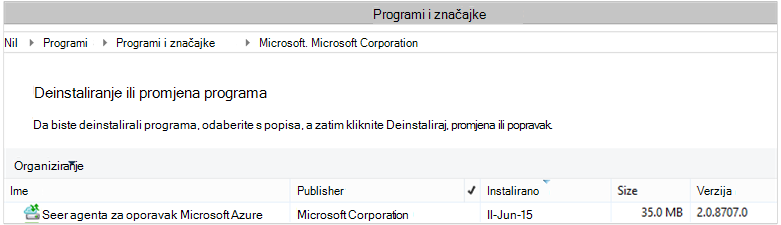

<properties
    pageTitle="Upravljanje sigurnosne kopije za Windows Server/klijent pomoću komponente PowerShell i | Microsoft Azure"
    description="Saznajte kako uvesti i upravljanje sigurnosne kopije Azure pomoću komponente PowerShell"
    services="backup"
    documentationCenter=""
    authors="saurabhsensharma"
    manager="shivamg"
    editor=""/>

<tags
    ms.service="backup"
    ms.workload="storage-backup-recovery"
    ms.tgt_pltfrm="na"
    ms.devlang="na"
    ms.topic="article"
    ms.date="09/01/2016"
    ms.author="saurabhsensharma;markgal;jimpark;nkolli;trinadhk"/>


# <a name="deploy-and-manage-backup-to-azure-for-windows-serverwindows-client-using-powershell"></a>Uvođenje i upravljanje sigurnosne kopije Azure za Windows Server i Windows klijentu pomoću komponente PowerShell

> [AZURE.SELECTOR]
- [ARM](backup-client-automation.md)
- [Klasični](backup-client-automation-classic.md)

U ovom se članku objašnjava korištenje ljuske PowerShell za postavljanje Azure sigurnosne kopije na Windows Server i Windows klijenta i upravljanje i oporavak sigurnosne kopije.

## <a name="install-azure-powershell"></a>Instaliranje modula Azure PowerShell

[AZURE.INCLUDE [learn-about-deployment-models](../../includes/learn-about-deployment-models-include.md)]

2015 listopad izdavanja Azure PowerShell 1.0. To je izdanje uspjela na 0.9.8 pustite, a ne unese neke značajan promjene, posebice u imenovanja uzorak s cmdletima. 1.0 cmdleta slijedite obrazac imenovanja {glagolski}-{imenični}; AzureRm dok se 0.9.8 nazivi sadrže **upravitelja resursa** (na primjer, New-AzureRmResourceGroup umjesto novo AzureResourceGroup). Prilikom korištenja Azure PowerShell 0.9.8, najprije morate omogućiti MOD upravitelja resursa tako da pokrenete naredbu **AzureResourceManager parametar AzureMode** . Ta naredba nije potrebno na 1.0 ili novije.

Ako želite koristiti skripte sastavljene za u 0.9.8 okruženju, u okruženju 1.0 ili novije pažljivo testirajte skripte u okruženju stara radnog prije nego ih u proizvodnje da biste izbjegli neočekivane utjecaja.

[Preuzmite najnovije izdanje PowerShell](https://github.com/Azure/azure-powershell/releases) (Minimalna verzija potrebno je: 1.0.0)


[AZURE.INCLUDE [arm-getting-setup-powershell](../../includes/arm-getting-setup-powershell.md)]


## <a name="create-a-backup-vault"></a>Stvaranje sigurnosne kopije zbirke ključeva

> [AZURE.WARNING] Za korisnike koji se koriste sigurnosne kopije Azure prvi put, morate registrirati davatelja sigurnosne kopije Azure koja će se koristiti s pretplatom. To možete učiniti tako da pokrenete sljedeću naredbu: Register AzureProvider - ProviderNamespace "Microsoft.Backup"

Možete stvoriti novu sigurnosnu kopiju sigurnog pomoću cmdleta **New-AzureRMBackupVault** . Sigurnosno kopiranje zbirke ključeva je resursa u OBLAK da morate smjestite unutar grupu resursa. Povećani Azure PowerShell konzoli pokrenite sljedeće naredbe:

```
PS C:\> New-AzureResourceGroup –Name “test-rg” -Region “West US”
PS C:\> $backupvault = New-AzureRMBackupVault –ResourceGroupName “test-rg” –Name “test-vault” –Region “West US” –Storage GeoRedundant
```

Pomoću cmdleta **Get-AzureRMBackupVault** popis sigurnosne kopije sefovi u pretplatu.


## <a name="installing-the-azure-backup-agent"></a>Instaliranje agent za sigurnosno kopiranje Azure
Prije instalacije agent za sigurnosno kopiranje Azure, morate koristiti instalacijski program preuzeta i izlaganje na poslužitelju sustava Windows. Instalacijski program na najnoviju verziju možete dobiti iz [Microsoftova centra za preuzimanje](http://aka.ms/azurebackup_agent) ili iz sigurnosne kopije sigurnog stranica nadzorne ploče. Spremanje instalacijski program pristupačne mjesto kao što su * C:\Downloads\*.

Da biste instalirali agenta, u dodatnim konzole PowerShell pokrenite sljedeću naredbu:

```
PS C:\> MARSAgentInstaller.exe /q
```

Instalira se agenta na sa svim zadane mogućnosti. Instalacija traje nekoliko minuta u pozadini. Ako ne navedete mogućnost */nu* prozoru **Windows Update** će se otvoriti na kraju instalacije na Potraži ažuriranja. Kad instalirate, agenta prikazat će se na popisu instaliranih programa.

Da biste vidjeli popis instaliranih programa, idite na **Upravljačku ploču** > **programa** > **Programi i značajke**.



### <a name="installation-options"></a>Mogućnosti instalacije

Da biste vidjeli sve mogućnosti koje su dostupne putem naredbenog retka, koristite sljedeću naredbu:

```
PS C:\> MARSAgentInstaller.exe /?
```

Dostupne mogućnosti obuhvaćaju sljedeće:

| Mogućnost | Pojedinosti | Zadani |
| ---- | ----- | ----- |
| / q | Tihi instalacije | - |
| /p: "mjesto" | Put do instalacijsku mapu za agent za Azure sigurnosnu kopiju. | C:\Programske datoteke\Microsoft Azure oporavak Services Agent |
| / s: "mjesto" | Put do mape u predmemoriji za agent za Azure sigurnosnu kopiju. | C:\Programske datoteke\Microsoft Azure oporavak usluge Agent\Scratch |
| /m | Prijava za Microsoft Update | - |
| /nU | Provjerava ima li ažuriranja nakon dovršetka instalacije | - |
| /d | Deinstalira agenta servisa za oporavak Microsoft Azure | - |
| /ph | Proxy adrese za glavno računalo | - |
| /po | Broj priključka proxy glavnog računala | - |
| /pu | Korisničko ime proxy glavnog računala | - |
| /PW | Proxy lozinke | - |


## <a name="registering-with-the-azure-backup-service"></a>Registracija sa servisom Azure sigurnosnog kopiranja
Biste mogli registrirati sa servisom Azure sigurnosne kopije, koje je potrebno provjeriti [preduvjeti](backup-configure-vault.md) zadovoljeni. Moraš:

- Imate valjan Azure pretplatu
- Ste sigurnosno kopiranje zbirke ključeva

Da biste preuzeli sigurnog vjerodajnice, pokrenite cmdlet **Get-AzureRMBackupVaultCredentials** konzoli za Azure PowerShell i spremite ga na određenom mjestu kao što su * C:\Downloads\*.

```
PS C:\> $credspath = "C:\"
PS C:\> $credsfilename = Get-AzureRMBackupVaultCredentials -Vault $backupvault -TargetLocation $credspath
PS C:\> $credsfilename
f5303a0b-fae4-4cdb-b44d-0e4c032dde26_backuprg_backuprn_2015-08-11--06-22-35.VaultCredentials
```

Prijava na računalu s na sigurnog obavlja pomoću cmdleta [Start OBRegistration](https://technet.microsoft.com/library/hh770398%28v=wps.630%29.aspx) :

```
PS C:\> $cred = $credspath + $credsfilename
PS C:\> Start-OBRegistration -VaultCredentials $cred -Confirm:$false

CertThumbprint      : 7a2ef2caa2e74b6ed1222a5e89288ddad438df2
SubscriptionID      : ef4ab577-c2c0-43e4-af80-af49f485f3d1
ServiceResourceName : test-vault
Region              : West US

Machine registration succeeded.
```

> [AZURE.IMPORTANT] Da biste odredili datoteku sigurnog vjerodajnice pomoću relativni putovi. Apsolutni put morate unijeti kao ulaz cmdletu.

## <a name="networking-settings"></a>Postavke mreže
Kada je povezivanje s računala za Windows s internetom putem proxy poslužitelja, postavke proxyja možete i dobili agenta. U ovom primjeru postoji nema proxy poslužitelj, pa ne možemo su izričito poništite sve informacije vezane uz proxy poslužitelja.

Korištenja propusnosti može se kontrolirati i pomoću mogućnosti ```work hour bandwidth``` i ```non-work hour bandwidth``` za zadani skup dane u tjednu.

Detalji propusnost i proxy postavke obavlja pomoću cmdleta [Skup OBMachineSetting](https://technet.microsoft.com/library/hh770409%28v=wps.630%29.aspx) :

```
PS C:\> Set-OBMachineSetting -NoProxy
Server properties updated successfully.

PS C:\> Set-OBMachineSetting -NoThrottle
Server properties updated successfully.
```

## <a name="encryption-settings"></a>Postavke šifriranja
Sigurnosno kopiranje podataka koji se šalju za Azure sigurnosne kopije šifrirana zaštita povjerljivost podataka. Pristupni izraz za šifriranje je "lozinkom" dešifrirati podatke u trenutku vraćanja.

```
PS C:\> ConvertTo-SecureString -String "Complex!123_STRING" -AsPlainText -Force | Set-OBMachineSetting
Server properties updated successfully
```

> [AZURE.IMPORTANT] Zadržati informacije pristupni izraz siguran i kada je postavljen. Nećete moći vratiti podatke iz Azure bez taj se pristupni izraz.

## <a name="back-up-files-and-folders"></a>Stvaranje sigurnosne kopije datoteka i mapa
Sve sigurnosne kopije s poslužiteljima sustava Windows i klijentima za sigurnosno kopiranje Azure mjerodavni su pravila. Pravilnik sastoji se od tri dijela:

1. **Raspored sigurnosnog kopiranja** koji određuje kada sigurnosne kopije morate uzeti i sinkronizira sa servisom.
2. **Raspored zadržavanja** koji određuje koliko će se zadržavati oporavak točke u Azure.
3. **Specifikacija uključivanje/isključivanje datoteku** koja određuje što treba sigurnosne kopije.

U ovom dokumentu jer smo si automatske sigurnosnog kopiranja, ne možemo ćete pretpostavlja ništa nije konfiguriran. Početak tako da stvorite novu sigurnosne kopije pravila pomoću cmdleta [New-OBPolicy](https://technet.microsoft.com/library/hh770416.aspx) te ga koristiti.

```
PS C:\> $newpolicy = New-OBPolicy
```

Trenutačno se pravila prazan, a drugi cmdleta su potrebne da biste odredili što će stavke biti uključene ili isključenih, kada sigurnosno kopiranje će pokrenuti i gdje će se spremiti sigurnosnih kopija.

### <a name="configuring-the-backup-schedule"></a>Konfiguriranje raspored sigurnosnog kopiranja
Prvi 3 dijelove pravila je raspored sigurnosnog kopiranja, koji je stvoren pomoću cmdleta [New-OBSchedule](https://technet.microsoft.com/library/hh770401) . Raspored sigurnosnog kopiranja određuje kada se sigurnosno kopiranje potrebno da bi se otvorila. Prilikom stvaranja rasporeda morate navesti 2 ulaznih parametara:

- **Dane u tjednu** koji se izvoditi sigurnosnu kopiju. Možete pokrenuti sigurnosno kopiranje samo jedan dan ili svaki dan u tjednu ili bilo koju kombinaciju između.
- **Doba dana** kada se izvoditi sigurnosnu kopiju. Možete definirati do 3 različita doba dana kada se pokrenuti sigurnosno kopiranje.

Na primjer, možete konfigurirati sigurnosne kopije pravila koja se pokreće pri 4 PM svaki Subota i nedjelja.

```
PS C:\> $sched = New-OBSchedule -DaysofWeek Saturday, Sunday -TimesofDay 16:00
```

Raspored sigurnosnog kopiranja mora biti povezan s pravilima, a to se može postići pomoću cmdleta [Skup OBSchedule](https://technet.microsoft.com/library/hh770407) .

```
PS C:> Set-OBSchedule -Policy $newpolicy -Schedule $sched
BackupSchedule : 4:00 PM Saturday, Sunday, Every 1 week(s) DsList : PolicyName : RetentionPolicy : State : New PolicyState : Valid
```
### <a name="configuring-a-retention-policy"></a>Konfiguriranje pravilnika o zadržavanju
Pravila zadržavanja određuje koliko se zadržavaju oporavak točke stvorene iz sigurnosne kopije zadataka. Prilikom stvaranja novog pravilnika o zadržavanju pomoću cmdleta [New-OBRetentionPolicy](https://technet.microsoft.com/library/hh770425) , možete navesti broj dana koje točke Vraćanje sigurnosne kopije moraju biti zadržani s Azure sigurnosne kopije. U primjeru u nastavku postavlja pravilnika o zadržavanju od sedam dana.

```
PS C:\> $retentionpolicy = New-OBRetentionPolicy -RetentionDays 7
```

Pravila zadržavanja moraju biti povezane s glavnom pravila pomoću cmdleta [Skup OBRetentionPolicy](https://technet.microsoft.com/library/hh770405):

```
PS C:\> Set-OBRetentionPolicy -Policy $newpolicy -RetentionPolicy $retentionpolicy

BackupSchedule  : 4:00 PM
                  Saturday, Sunday,
                  Every 1 week(s)
DsList          :
PolicyName      :
RetentionPolicy : Retention Days : 7

                  WeeklyLTRSchedule :
                  Weekly schedule is not set

                  MonthlyLTRSchedule :
                  Monthly schedule is not set

                  YearlyLTRSchedule :
                  Yearly schedule is not set

State           : New
PolicyState     : Valid
```
### <a name="including-and-excluding-files-to-be-backed-up"></a>Uključivanje i izuzimanje datoteke za sigurnosno kopiranje
Na ```OBFileSpec``` objekt definira datoteke uključiti i isključiti iz sigurnosne kopije. To je skup pravila koji opsega zaštićenim datotekama i mapama na računalo. Možete imati više datoteka uključivanje ili isključivanje pravila prema potrebi, a pridružiti pravila. Prilikom stvaranja novog OBFileSpec objekta, možete učiniti sljedeće:

- Navedite datoteke i mape koje želite obuhvatiti
- Navedite datoteke i mape koje treba izostaviti
- Navedite rekurzivne sigurnosne kopije podataka u mapu (ili) je li potrebno sigurnosno samo najviše razine datoteke u navedenu mapu prema gore.

Drugu mogućnost je postići pomoću zastavica - NonRecursive u novo OBFileSpec naredbi.

U primjeru u nastavku ćemo ćete sigurnosno kopirati glasnoću C: i D:, a isključi binarne datoteke OS u mapu sustava Windows i privremene mape. Da biste učinili pa ćemo stvorit ćete dva datoteka specifikacije pomoću cmdleta [New-OBFileSpec](https://technet.microsoft.com/library/hh770408) - jedan za uključivanje i jedan za izuzetaka. Nakon što stvorite specifikacije datoteke, one se povezuju s pravilima pomoću cmdleta [Dodaj OBFileSpec](https://technet.microsoft.com/library/hh770424) .

```
PS C:\> $inclusions = New-OBFileSpec -FileSpec @("C:\", "D:\")

PS C:\> $exclusions = New-OBFileSpec -FileSpec @("C:\windows", "C:\temp") -Exclude

PS C:\> Add-OBFileSpec -Policy $newpolicy -FileSpec $inclusions

BackupSchedule  : 4:00 PM
                  Saturday, Sunday,
                  Every 1 week(s)
DsList          : {DataSource
                  DatasourceId:0
                  Name:C:\
                  FileSpec:FileSpec
                  FileSpec:C:\
                  IsExclude:False
                  IsRecursive:True

                  , DataSource
                  DatasourceId:0
                  Name:D:\
                  FileSpec:FileSpec
                  FileSpec:D:\
                  IsExclude:False
                  IsRecursive:True

                  }
PolicyName      :
RetentionPolicy : Retention Days : 7

                  WeeklyLTRSchedule :
                  Weekly schedule is not set

                  MonthlyLTRSchedule :
                  Monthly schedule is not set

                  YearlyLTRSchedule :
                  Yearly schedule is not set

State           : New
PolicyState     : Valid


PS C:\> Add-OBFileSpec -Policy $newpolicy -FileSpec $exclusions

BackupSchedule  : 4:00 PM
                  Saturday, Sunday,
                  Every 1 week(s)
DsList          : {DataSource
                  DatasourceId:0
                  Name:C:\
                  FileSpec:FileSpec
                  FileSpec:C:\
                  IsExclude:False
                  IsRecursive:True
                  ,FileSpec
                  FileSpec:C:\windows
                  IsExclude:True
                  IsRecursive:True
                  ,FileSpec
                  FileSpec:C:\temp
                  IsExclude:True
                  IsRecursive:True

                  , DataSource
                  DatasourceId:0
                  Name:D:\
                  FileSpec:FileSpec
                  FileSpec:D:\
                  IsExclude:False
                  IsRecursive:True

                  }
PolicyName      :
RetentionPolicy : Retention Days : 7

                  WeeklyLTRSchedule :
                  Weekly schedule is not set

                  MonthlyLTRSchedule :
                  Monthly schedule is not set

                  YearlyLTRSchedule :
                  Yearly schedule is not set

State           : New
PolicyState     : Valid
```

### <a name="applying-the-policy"></a>Primjena pravila
Sada objekta pravilnika dovršetka i sadrži povezane raspored sigurnosnog kopiranja, pravilnika o zadržavanju i popisa uključivanje/isključivanje datoteka. Ovo pravilo sada može biti izvršenja za Azure sigurnosnu kopiju da biste koristili. Prije primjene novostvorenu pravila provjeriti postoje li bez postojeća sigurnosne kopije pravila pomoću cmdleta [Ukloni OBPolicy](https://technet.microsoft.com/library/hh770415) povezan s poslužiteljem. Uklanjanje pravila će Pitaj za potvrdu. Da biste preskočili koristi potvrde u ```-Confirm:$false``` zastavice s cmdlet.

```
PS C:> Get-OBPolicy | Remove-OBPolicy
Microsoft Azure Backup Are you sure you want to remove this backup policy? This will delete all the backed up data. [Y] Yes [A] Yes to All [N] No [L] No to All [S] Suspend [?] Help (default is "Y"):
```

Potvrđivanja objekta pravilnika obavlja pomoću cmdleta [Skup OBPolicy](https://technet.microsoft.com/library/hh770421) . To će i Pitaj za potvrdu. Da biste preskočili koristi potvrde u ```-Confirm:$false``` zastavice s cmdlet.

```
PS C:> Set-OBPolicy -Policy $newpolicy
Microsoft Azure Backup Do you want to save this backup policy ? [Y] Yes [A] Yes to All [N] No [L] No to All [S] Suspend [?] Help (default is "Y"):
BackupSchedule : 4:00 PM Saturday, Sunday, Every 1 week(s)
DsList : {DataSource
         DatasourceId:4508156004108672185
         Name:C:\
         FileSpec:FileSpec
         FileSpec:C:\
         IsExclude:False
         IsRecursive:True,

         FileSpec
         FileSpec:C:\windows
         IsExclude:True
         IsRecursive:True,

         FileSpec
         FileSpec:C:\temp
         IsExclude:True
         IsRecursive:True,

         DataSource
         DatasourceId:4508156005178868542
         Name:D:\
         FileSpec:FileSpec
         FileSpec:D:\
         IsExclude:False
         IsRecursive:True
    }
PolicyName : c2eb6568-8a06-49f4-a20e-3019ae411bac
RetentionPolicy : Retention Days : 7
              WeeklyLTRSchedule :
              Weekly schedule is not set

              MonthlyLTRSchedule :
              Monthly schedule is not set

              YearlyLTRSchedule :
              Yearly schedule is not set
State : Existing PolicyState : Valid
```

Možete pogledati detalje o postojeće sigurnosne kopije pravila pomoću cmdleta [Get-OBPolicy](https://technet.microsoft.com/library/hh770406) . Koje se naniže dodatno pomoću cmdleta [Get-OBSchedule](https://technet.microsoft.com/library/hh770423) raspored sigurnosnog kopiranja i cmdlet [Get-OBRetentionPolicy](https://technet.microsoft.com/library/hh770427) za pravila zadržavanja

```
PS C:> Get-OBPolicy | Get-OBSchedule
SchedulePolicyName : 71944081-9950-4f7e-841d-32f0a0a1359a
ScheduleRunDays : {Saturday, Sunday}
ScheduleRunTimes : {16:00:00}
State : Existing

PS C:> Get-OBPolicy | Get-OBRetentionPolicy
RetentionDays : 7
RetentionPolicyName : ca3574ec-8331-46fd-a605-c01743a5265e
State : Existing

PS C:> Get-OBPolicy | Get-OBFileSpec
FileName : *
FilePath : \?\Volume{b835d359-a1dd-11e2-be72-2016d8d89f0f}\
FileSpec : D:\
IsExclude : False
IsRecursive : True

FileName : *
FilePath : \?\Volume{cdd41007-a22f-11e2-be6c-806e6f6e6963}\
FileSpec : C:\
IsExclude : False
IsRecursive : True

FileName : *
FilePath : \?\Volume{cdd41007-a22f-11e2-be6c-806e6f6e6963}\windows
FileSpec : C:\windows
IsExclude : True
IsRecursive : True

FileName : *
FilePath : \?\Volume{cdd41007-a22f-11e2-be6c-806e6f6e6963}\temp
FileSpec : C:\temp
IsExclude : True
IsRecursive : True
```

### <a name="performing-an-ad-hoc-backup"></a>Izvođenje programa ad-hoc sigurnosnog kopiranja
Kada je postavljena sigurnosne kopije pravila sigurnosnih kopija će se dogoditi po raspored. Pokretanje programa ad-hoc sigurnosne kopije moguće je i pomoću cmdleta [Start OBBackup](https://technet.microsoft.com/library/hh770426) :

```
PS C:> Get-OBPolicy | Start-OBBackup
Taking snapshot of volumes...
Preparing storage...
Estimating size of backup items...
Estimating size of backup items...
Transferring data...
Verifying backup...
Job completed.
The backup operation completed successfully.
```

## <a name="restore-data-from-azure-backup"></a>Vraćanje podataka iz sigurnosne kopije Azure
U ovom se odjeljku će vas voditi kroz korake za automatiziranje oporavak podataka iz sigurnosne kopije Azure. To obuhvaća sljedeće korake:

1. Odaberite izvor glasnoće
2. Odaberite sigurnosne kopije točku da biste vratili
3. Odaberite stavku koju želite vratiti
4. Pokretanje postupak vraćanja

### <a name="picking-the-source-volume"></a>Prilikom odabira glasnoće izvora
Da biste vratili stavke iz sigurnosne kopije Azure, najprije morate identifikaciju izvora stavke. Budući da u kontekstu sustava Windows Server ili Windows klijent ćemo se izvršavanje naredbe, na računalu već otkrili. Sljedeći korak u identificiranje izvora je prepoznavanje jedinica koja je sadrži. Popis količine ili izvora stvara sigurnosnu kopiju na ovom računalu mogu biti dohvaćeni izvršavanjem cmdlet [Get-OBRecoverableSource](https://technet.microsoft.com/library/hh770410) . Ta naredba Vrati polja svih izvora sigurnosnu kopiju s poslužitelja/klijenta.

```
PS C:> $source = Get-OBRecoverableSource
PS C:> $source
FriendlyName : C:\
RecoverySourceName : C:\
ServerName : myserver.microsoft.com

FriendlyName : D:\
RecoverySourceName : D:\
ServerName : myserver.microsoft.com
```

### <a name="choosing-a-backup-point-to-restore"></a>Odabir točku sigurnosnu kopiju da biste vratili
Izvršavanjem cmdlet [Get-OBRecoverableItem](https://technet.microsoft.com/library/hh770399.aspx) s odgovarajućim parametra je moguće dohvatiti popis sigurnosne kopije točaka. U našem primjeru radimo ćete odabrati najnovije sigurnosne kopije točku za izvor jedinicu *D:* i koristiti da biste oporavili određenom datotekom.

```
PS C:> $rps = Get-OBRecoverableItem -Source $source[1]
IsDir : False
ItemNameFriendly : D:\
ItemNameGuid : \?\Volume{b835d359-a1dd-11e2-be72-2016d8d89f0f}\
LocalMountPoint : D:\
MountPointName : D:\
Name : D:\
PointInTime : 18-Jun-15 6:41:52 AM
ServerName : myserver.microsoft.com
ItemSize :
ItemLastModifiedTime :

IsDir : False
ItemNameFriendly : D:\
ItemNameGuid : \?\Volume{b835d359-a1dd-11e2-be72-2016d8d89f0f}\
LocalMountPoint : D:\
MountPointName : D:\
Name : D:\
PointInTime : 17-Jun-15 6:31:31 AM
ServerName : myserver.microsoft.com
ItemSize :
ItemLastModifiedTime :
```
Objekt ```$rps``` je polje sigurnosne kopije točaka. Prvi element je točke najnovije i ti element je najstarije točke. Da biste odabrali najnovije točke, koristit ćemo ```$rps[0]```.

### <a name="choosing-an-item-to-restore"></a>Odabir stavke da biste vratili
Da biste odredili točan datoteku ili mapu koju želite vratiti, rekurzivno pomoću cmdleta [Get-OBRecoverableItem](https://technet.microsoft.com/library/hh770399.aspx) . Na taj način u hijerarhiji mapa može biti klikanju isključivo pomoću na ```Get-OBRecoverableItem```.

U ovom primjeru, ako želimo da biste vratili datoteke *finances.xls* ćemo možete referencirati koji pomoću objekta ```$filesFolders[1]```.

```
PS C:> $filesFolders = Get-OBRecoverableItem $rps[0]
PS C:> $filesFolders
IsDir : True
ItemNameFriendly : D:\MyData\
ItemNameGuid : \?\Volume{b835d359-a1dd-11e2-be72-2016d8d89f0f}\MyData\
LocalMountPoint : D:\
MountPointName : D:\
Name : MyData
PointInTime : 18-Jun-15 6:41:52 AM
ServerName : myserver.microsoft.com
ItemSize :
ItemLastModifiedTime : 15-Jun-15 8:49:29 AM

PS C:> $filesFolders = Get-OBRecoverableItem $filesFolders[0]
PS C:> $filesFolders
IsDir : False
ItemNameFriendly : D:\MyData\screenshot.oxps
ItemNameGuid : \?\Volume{b835d359-a1dd-11e2-be72-2016d8d89f0f}\MyData\screenshot.oxps
LocalMountPoint : D:\
MountPointName : D:\
Name : screenshot.oxps
PointInTime : 18-Jun-15 6:41:52 AM
ServerName : myserver.microsoft.com
ItemSize : 228313
ItemLastModifiedTime : 21-Jun-14 6:45:09 AM

IsDir : False
ItemNameFriendly : D:\MyData\finances.xls
ItemNameGuid : \?\Volume{b835d359-a1dd-11e2-be72-2016d8d89f0f}\MyData\finances.xls
LocalMountPoint : D:\
MountPointName : D:\
Name : finances.xls
PointInTime : 18-Jun-15 6:41:52 AM
ServerName : myserver.microsoft.com
ItemSize : 96256
ItemLastModifiedTime : 21-Jun-14 6:43:02 AM
```

Možete i potražiti vraćanje pomoću stavki u ```Get-OBRecoverableItem``` cmdlet. U našem primjeru da biste potražili *finances.xls* ćemo nije moguće dobiti bolji uvid u datoteku tako da pokrenete sljedeću naredbu:

```
PS C:\> $item = Get-OBRecoverableItem -RecoveryPoint $rps[0] -Location "D:\MyData" -SearchString "finance*"
```

### <a name="triggering-the-restore-process"></a>Pokretanje postupak vraćanja
Da biste pokrenuli postupak vraćanja, najprije moramo da biste odredili mogućnosti za oporavak. To možete učiniti pomoću cmdleta [New-OBRecoveryOption](https://technet.microsoft.com/library/hh770417.aspx) . Na primjer, pretpostavimo pretpostavlja želimo da biste vratili datoteke *C:\temp*. Pogledajmo i pretpostavlja želimo da biste preskočili datoteke koje već postoje na odredišnu mapu *C:\temp*. Da biste stvorili takve mogućnost oporavka, koristite sljedeću naredbu:

```
PS C:\> $recovery_option = New-OBRecoveryOption -DestinationPath "C:\temp" -OverwriteType Skip
```

Sada pokretanje vraćanja pomoću naredbe za [Početak OBRecovery](https://technet.microsoft.com/library/hh770402.aspx) na odabrani ```$item``` Mapiraj u ```Get-OBRecoverableItem``` cmdlet:

```
PS C:\> Start-OBRecovery -RecoverableItem $item -RecoveryOption $recover_option
Estimating size of backup items...
Estimating size of backup items...
Estimating size of backup items...
Estimating size of backup items...
Job completed.
The recovery operation completed successfully.
```


## <a name="uninstalling-the-azure-backup-agent"></a>Deinstalacija agent za sigurnosno kopiranje Azure
Deinstaliranje agent za Azure sigurnosnog kopiranja možete učiniti pomoću sljedeće naredbe:

```
PS C:\> .\MARSAgentInstaller.exe /d /q
```

Deinstalacija binarne datoteke agent na računalu sadrži neke posljedice treba uzeti u obzir:

- Uklanja filtar datoteka na računalu pa je zaustavljena evidentiranje promjena.
- Sve informacije o pravilima da je uklonjena s računala, no informacije o pravilima dalje biti pohranjena na servisu.
- Uklanjaju se svi rasporedi sigurnosne kopije, a uzimaju se bez daljnje sigurnosne kopije.

Međutim, podaci se pohranjuju u Azure ostaje i se zadržavaju u skladu sa postavljanja pravilnika zadržavanja koje ste. Starije točke se automatski Dospjeli.

## <a name="remote-management"></a>Daljinsko upravljanje
Upravljanje oko agent Azure sigurnosne kopije, pravila i izvore podataka možete učiniti daljinski putem komponente PowerShell. Stroju koji će se upravljati daljinski mora se pripremite pravilno.

Prema zadanim postavkama, servis WinRM je konfiguriran za ručno pokretanje. Vrsta pokretanja mora biti postavljena na *automatski* , a moraju se pokrenuti servis. Da biste provjerili je li servis WinRM pokrenut, vrijednost svojstvo Stanje mora biti *pokrenut*.

```
PS C:\> Get-Service WinRM

Status   Name               DisplayName
------   ----               -----------
Running  winrm              Windows Remote Management (WS-Manag...
```

PowerShell mora biti konfigurirana za remoting.

```
PS C:\> Enable-PSRemoting -force
WinRM is already set up to receive requests on this computer.
WinRM has been updated for remote management.
WinRM firewall exception enabled.

PS C:\> Set-ExecutionPolicy unrestricted -force
```

Na računalu sada može upravljati daljinski - počevši od instalacije agenta. Na primjer, sljedeću skriptu kopira agenta na udaljenom računalu i instalirati ga.

```
PS C:\> $dloc = "\\REMOTESERVER01\c$\Windows\Temp"
PS C:\> $agent = "\\REMOTESERVER01\c$\Windows\Temp\MARSAgentInstaller.exe"
PS C:\> $args = "/q"
PS C:\> Copy-Item "C:\Downloads\MARSAgentInstaller.exe" -Destination $dloc - force

PS C:\> $s = New-PSSession -ComputerName REMOTESERVER01
PS C:\> Invoke-Command -Session $s -Script { param($d, $a) Start-Process -FilePath $d $a -Wait } -ArgumentList $agent $args
```

## <a name="next-steps"></a>Daljnji koraci
Dodatne informacije o potražite u članku Azure sigurnosne kopije za Windows Server/klijenta

- [Uvod u Azure sigurnosnog kopiranja](backup-introduction-to-azure-backup.md)
- [Stvaranje sigurnosne kopije poslužiteljima sustava Windows](backup-configure-vault.md)
