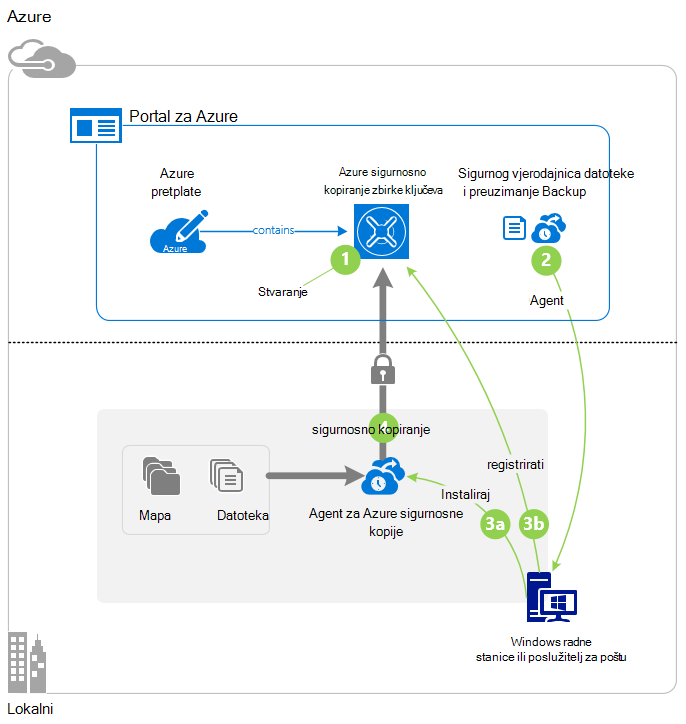
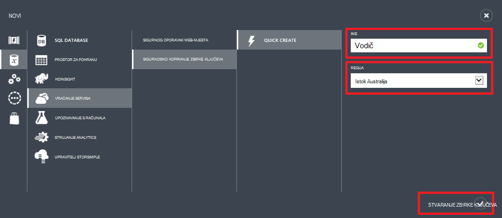
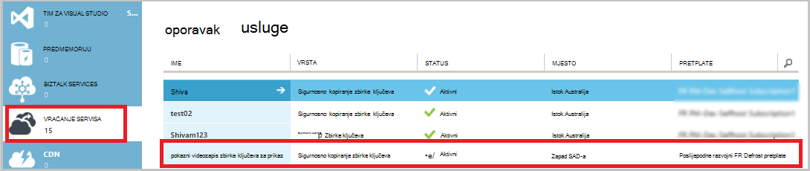
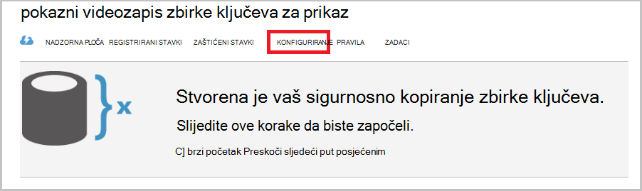
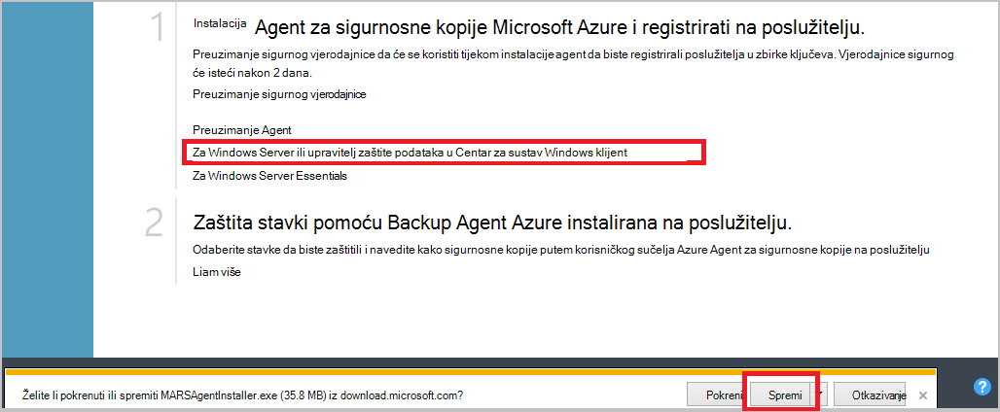
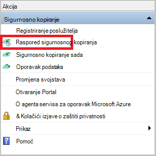
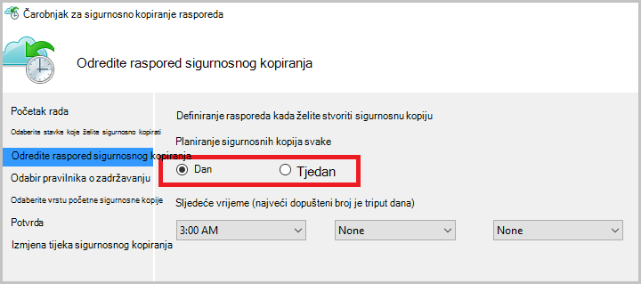
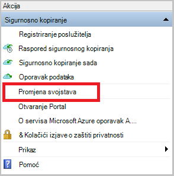
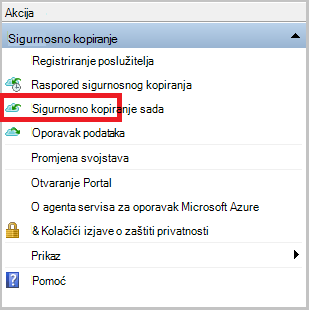
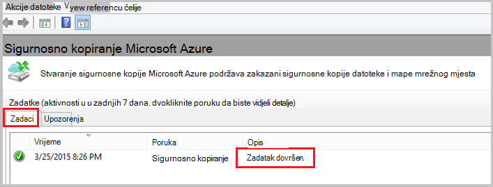

<properties
    pageTitle="Sigurnosno kopiranje Windows server ili klijenta za Azure pomoću modela uvođenje klasičnog | Microsoft Azure"
    description="Sigurnosno kopiranje poslužiteljima sustava Windows ili klijenata za Azure stvaranje sigurnosne kopije sigurnog, preuzimanje vjerodajnice, instalacije agent za sigurnosne kopije i dovršavanje početne sigurnosnog kopiranja datoteke i mape."
    services="backup"
    documentationCenter=""
    authors="markgalioto"
    manager="cfreeman"
    editor=""
    keywords="sigurnosno kopiranje zbirke ključeva; sigurnosno kopiranje Windows server; sigurnosno kopiranje windows;"/>

<tags
    ms.service="backup"
    ms.workload="storage-backup-recovery"
    ms.tgt_pltfrm="na"
    ms.devlang="na"
    ms.topic="article"
    ms.date="08/08/2016"
    ms.author="jimpark; trinadhk; markgal"/>

# Sigurnosno kopiranje Windows server ili klijenta za Azure pomoću modela klasični implementacije

> [AZURE.SELECTOR]
- [Klasični portal](backup-configure-vault-classic.md)
- [Portal za Azure](backup-configure-vault.md)

U ovom se članku opisuje postupke koje su vam potrebne upute za pripremu okruženja i sigurnosno kopiranje Windows server (ili klijent) za Azure. Pokriva i zahtjevi za uvođenje sigurnosnih kopija rješenje. Ako vas zanima pokušaja sigurnosne kopije Azure prvi put, u ovom se članku brzo vodit će vas kroz postupak.

>[AZURE.IMPORTANT] Azure sadrži dva različitoj implementaciji modela za stvaranje i rad s resursima: Voditelj resursa i classic. U ovom se članku opisuje pomoću klasične implementacije modela. Microsoft preporučuje da najčešće novi implementacijama korištenje modela Voditelj resursa.

## Prije početka
Stvaranje sigurnosne kopije poslužitelja ili klijenta za Azure, potreban vam je račun za Azure. Ako ga nemate, možete stvoriti [pomoću računa](https://azure.microsoft.com/free/) u samo nekoliko minuta.

## Korak 1: Stvaranje sigurnosne kopije zbirke ključeva
Sigurnosnu kopiju datoteke i mape s poslužitelja ili klijenta, morate stvoriti sigurnosnu kopiju zbirke ključeva u regiji mjesto na koje želite spremiti podatke.

### Da biste stvorili sigurnosnu kopiju zbirke ključeva

1. Prijavite se na [portal sustava klasični](https://manage.windowsazure.com/).

2. Kliknite **Novo** > **Data Services** > **Oporavak Services** > **Sigurnog sigurnosnu kopiju**, a zatim odaberite **Brzo stvaranje**.

3. **Naziv** parametra unesite neslužbeni naziv za sigurnosno kopiranje zbirke ključeva. Upišite naziv koji sadrži od 2 do 50 znakova. Morate pokrenuti slovom i mogu sadržavati samo slova, brojeve i spojnice. Taj naziv mora biti jedinstvena za svaku pretplatu.

4. Za parametar **regija** odaberite regiji za sigurnosno kopiranje zbirke ključeva. Taj odabir određuje regiji koju se šalju podataka iz sigurnosne kopije. Odabirom regiji sličan onome svoju lokaciju možete smanjiti latenciju mreže kada sigurnosno Azure.

5. Kliknite **Stvaranje sigurnog**.

    

    Može potrajati neko vrijeme da sigurnosno kopiranje zbirke ključeva će biti stvoren. Da biste provjerili status, praćenje obavijesti pri dnu klasični portal.

    Nakon stvaranja sigurnosnih kopija sigurnog vidjet ćete poruku da na sigurnog uspješno je stvorena. Također se pojavljuje kao **aktivnu** na popisu resursa za **Servise za oporavak** .

    

4. Odaberite željenu mogućnost zalihosti prostora za pohranu slijedeći korake opisane u nastavku.

    >[AZURE.IMPORTANT] Najbolje vrijeme za prepoznavanje zalihosti mogućnosti prostora za pohranu je desno nakon stvaranja sigurnog i prije jednom računalu registrirane da biste na zbirke ključeva. Kada stavku registrirani u sigurnog, zalihosti mogućnost pohrane je zaključan i ne može se mijenjati.

    Ako koristite Azure kao krajnja točka primarni sigurnosne kopije prostora za pohranu (na primjer, radite sigurnosne kopije za Azure s poslužiteljem Windows), razmislite o izdvajanju (zadano) mogućnost [zemlj suvišnih pohrane](../storage/storage-redundancy.md#geo-redundant-storage) .

    Ako koristite Azure kao krajnja točka tertiary sigurnosne kopije prostora za pohranu (, na primjer, koristite Upravitelj za zaštitu podataka u sustav centar za lokalnu sigurnosnu kopiju lokalne pohrane i korištenje Azure za Dugoročne zadržavanja mora), preporučujemo da odaberete [lokalno suvišnih prostora za pohranu](../storage/storage-redundancy.md#locally-redundant-storage). Tako ćete prikazati dolje trošak pohrana podataka u Azure, tijekom pružanja smanjiti razinu rok trajanja za podatke koji mogu biti prihvatljiva za tertiary kopije.

    **Da biste odabrali mogućnost zalihosti pohrane:**

    na. Kliknite zbirke ključeva koji ste upravo stvorili.

    b. Na stranici za brzo pokretanje odaberite **Konfiguriraj**.

    

    c. Odaberite mogućnost zalihosti odgovarajuće prostora za pohranu.

    Ako ste odabrali **Lokalno suvišnih**, morate kliknuti **Spremi** (jer **Zemlj Redundant** je zadana mogućnost).

    d. U lijevom navigacijskom oknu kliknite **Oporavak Services** da biste se vratili na popisu resursa za servise za oporavak.

## Korak 2: Preuzimanje datoteke vjerodajnica zbirke ključeva
Potrebno je moguće provjeriti autentičnost kod sigurnosno kopiranje zbirke ključeva prije nego što se može sigurnosno kopiranje podataka za Azure na lokalnom računalu. Provjera autentičnosti se postiže putem *sigurnog vjerodajnice*. Putem sigurnog kanala na portalu klasični preuzimanja datoteke sigurnog vjerodajnica. Privatni ključ certifikata zadržavaju se u web-mjesto portala ili u okvir za servis.

Saznajte više o [pomoću sigurnog vjerodajnice za provjeru sa servisom za sigurnosno kopiranje](backup-introduction-to-azure-backup.md#what-is-the-vault-credential-file).

### Da biste preuzeli datoteke vjerodajnica sigurnog na lokalno računalo

1. U lijevom navigacijskom oknu kliknite **Oporavak servise**, a zatim sigurnosno kopiranje zbirke ključeva koji ste stvorili.

    

2.  Na stranici za brzo pokretanje kliknite **Preuzimanje sigurnog vjerodajnice**.

    Klasični portal generira sigurnog vjerodajnica pomoću kombinacija naziva sigurnog i trenutni datum. Datoteka vjerodajnice sigurnog koristi se samo tijekom tijeka rada za registraciju i ističe nakon 48 sati.

    Datoteka vjerodajnica sigurnog mogu se preuzeti sa portalu.

3. Kliknite **Spremi** da biste preuzeli datoteke vjerodajnica sigurnog u mapi preuzimanja lokalnog računa. Možete odabrati i **Spremi kao** na izborniku **Spremi** da biste odredili mjesto spremanja datoteke vjerodajnica zbirke ključeva.

    >[AZURE.NOTE] Provjerite je li datoteka vjerodajnica sigurnog se sprema na mjesto kojemu je moguće pristupiti s računala. Ako je spremljena datoteka zajedničko korištenje ili poslužitelju poruke bloka, provjerite imate li dozvole za pristup.

## Korak 3: Preuzimanje, instaliranje i registrirati agent za sigurnosne kopije
Nakon što stvorite sigurnosnu kopiju sigurnog i preuzimanje datoteke vjerodajnica sigurnog, agent mora biti instaliran na svim računalima sustava Windows.

### Da biste preuzeli, instalacija i registracija agenta

1. Kliknite **Oporavak servise**, a zatim sigurnosno kopiranje zbirke ključeva koji želite da biste registrirali s poslužiteljem.

2. Na stranici za brzo pokretanje kliknite agent **Agent za Windows Server ili upravitelja za zaštitu podataka centar sustava ili klijenta sustava Windows**. Zatim kliknite **Spremi**.

    

3. Kada preuzmete sadrži MARSagentinstaller.exe datoteku, kliknite **Pokreni** (ili dvokliknite **MARSAgentInstaller.exe** sa mjesta spremanja).

4. Odaberite instalacijsku mapu i mape predmemorije koji su potrebni za agenta, a zatim kliknite **Dalje**. Navedite mjesto predmemorije mora imati slobodnog prostora jednako barem 5 posto sigurnosne kopije podataka.

5. Možete i dalje da biste se povezali s internetom putem zadane postavke proxyja.          Ako koristite proxy poslužitelj za povezivanje s Internetom, na stranici Konfiguracija proxy poslužitelj, potvrdite okvir **koristi proxy prilagođene postavke** , a zatim unesite detalje proxy poslužitelj. Ako koristite čija je autentičnost provjerena proxy poslužitelj, unesite korisničko ime i lozinku detalje, a zatim **Dalje**.

7. Kliknite da biste započeli instalaciju agent **instalirati** . Agent za sigurnosne kopije instalira .NET Framework 4,5 i komponente Windows PowerShell (Ako već nije instaliran) da biste dovršili instalaciju.

8. Nakon instalacije agenta kliknite **nastavili za registraciju** da biste nastavili s tijekom rada.

9. Na stranici sigurnog identifikacijski pronađite i odaberite datoteku sigurnog vjerodajnica koje ste prethodno preuzeli.

    Datoteka vjerodajnica sigurnog vrijedi samo 48 sati nakon preuzimanja s portala sustava. Ako naiđete na pogrešku na ovu stranicu (kao što su "sigurnog vjerodajnica navedena datoteka istekla"), prijavite se na portal i ponovno preuzeti datoteku sigurnog vjerodajnica.

    Provjerite je li datoteka vjerodajnica sigurnog dostupna na mjesto kojemu se pristupa putem aplikacije za postavljanje. Ako naiđete na pogrešaka vezanih uz pristup, kopirajte datoteku sigurnog vjerodajnica da biste privremeno mjesto na istom računalu, a zatim ponovite postupak.

    Ako naiđete na pogreške za vjerodajnica sigurnog kao što su "danih koji nisu valjani sigurnog vjerodajnica", je datoteka oštećena ili ne ne ste najnovije vjerodajnice povezali sa servisom za oporavak. Ponovite operaciju nakon preuzimanja nove zbirke ključeva vjerodajnica na portalu. Ta se pogreška može pojaviti i ako korisnik klikne mogućnost **preuzimanja sigurnog vjerodajnica** nekoliko puta u nizu brzi. U ovom slučaju samo zadnju sigurnog vjerodajnica datoteku je valjan.

9. Na stranici Postavke šifriranja možete generirati pristupni izraz ili pružiti pristupni izraz (najmanje 16 znakova). Imajte na umu da biste spremili pristupni izraz u sigurnom mjestu.

10. Kliknite **Završi**. Čarobnjak za registriranje poslužitelja registrira poslužitelj pomoću sigurnosnog kopiranja.

    >[AZURE.WARNING] Ako izgubite ili zaboravite pristupni izraz, Microsoft ne omogućuje oporavak sigurnosne kopije podataka. Vlasnik pristupni izraz za šifriranje i Microsoft nema uvid u pristupni izraz koji koristite. Spremite datoteku na sigurnom mjestu jer je bit će potrebno tijekom operacije za oporavak.

11. Nakon postavljanja ključa za šifriranje ostaviti uključen potvrdni okvir **Pokretanje Microsoft Azure Services agenta za oporavak** , a zatim kliknite **Zatvori**.

## Korak 4: Dovršavanje početne sigurnosnog kopiranja

Početna sigurnosne kopije sadrži dvije osnovne zadatke:

- Stvaranje sigurnosne kopije rasporeda
- Sigurnosno kopiranje datoteka i mapa za prvi put

Završetku sigurnosne kopije pravila početne sigurnosnog kopiranja, stvara sigurnosnu kopiju točke koje možete koristiti ako vam je potrebna oporaviti podatke. Sigurnosne kopije pravila to temeljena na rasporedu koju ste definirali.

### Da biste zakazali sigurnosnog kopiranja

1. Otvorite agent za stvaranje sigurnosne kopije Microsoft Azure. (Otvorit će automatski ako ostane **Pokretanje Microsoft Azure Services agenta za oporavak** potvrđenim okvirom kada ga zatvorite čarobnjak za registriranje poslužitelj.) Možete je pronaći traženjem računalu **Sigurnosna kopija Microsoft Azure**.

    

2. Agent za sigurnosne kopije kliknite **Raspored sigurnosnu kopiju**.

    

3. Na stranici prvi koraci čarobnjaka za sigurnosno kopiranje raspored, kliknite **Dalje**.

4. Stavke odaberite stranicu sigurnosnog kopiranja, kliknite **Dodaj stavke**.

5. Odaberite datoteke i mape koje želite sigurnosno kopirati, a zatim kliknite **redu**.

6. Kliknite **Dalje**.

7. Na stranici **Određivanje raspored sigurnosnog kopiranja** , navedite **raspored sigurnosnog kopiranja** , a zatim kliknite **Dalje**.

    Možete planirati dnevnu (Najveća brzina tri puta dnevno) ili s predlošcima tjednih sigurnosne kopije.

    

    >[AZURE.NOTE] Dodatne informacije o kako odrediti raspored sigurnosnog kopiranja, potražite u članku [Korištenje Azure sigurnosnu kopiju da biste zamijenili infrastruktura za vrpcu](backup-azure-backup-cloud-as-tape.md).

8. Na stranici **Odabir pravilnika o zadržavanju** odaberite **Pravilnika o zadržavanju** sigurnosne kopije.

    Pravila zadržavanja određuje trajanje za koje će se spremiti sigurnosnu kopiju. Umjesto samo određivanja "paušalni pravila" za sve točke sigurnosne kopije, možete odrediti različite zadržavanja na temelju kada se pojavi sigurnosno kopiranje. Možete izmijeniti dnevno, tjedno, mjesečno i godišnje zadržavanja prema svojim potrebama.

9. Na stranici odaberite početni sigurnosne kopije Vrsta odaberite vrstu početne sigurnosne kopije. Ostavite mogućnost **automatski putem mreže** odabrali, a zatim kliknite **Dalje**.

    Možete stvoriti sigurnosnu automatski putem mreže ili možete stvoriti sigurnosnu izvanmrežno. Ostatak u ovom se članku opisuje postupak za automatsko sigurnosno kopiranje. Ako biste radije da biste učinili izvanmrežno sigurnosne kopije, pogledajte članak o [izvanmrežne sigurnosne kopije tijek rada koji se Azure sigurnosne kopije](backup-azure-backup-import-export.md) za dodatnim informacijama.

10. Na stranici za potvrdu pregledajte podatke, a zatim kliknite **Završi**.

11. Kad čarobnjak dovrši stvaranje raspored sigurnosnog kopiranja, kliknite **Zatvori**.

### Omogućivanje mreže ograničavanje (nije obavezno)

Agent za sigurnosne kopije omogućuje ograničavanje mreže. Reguliranje kontrolira kako se koristi propusnost mreže tijekom prijenosa podataka. Ova kontrola može biti korisno ako je potrebno sigurnosno kopiranje podataka tijekom radno vrijeme, ali ne želite da se postupak sigurnosnog kopiranja da biste sukob s drugim internetski promet. Ograničavanje primjenjuje sigurnosno kopiranje i vraćanje aktivnosti.

**Da biste omogućili mrežni ograničavanje**

1. U agent za sigurnosne kopije kliknite **Promijeni svojstva**.

    

2. Na kartici **Throttling** odaberite potvrdni okvir **Omogući korištenja propusnosti internetske ograničavanje za sigurnosne kopije operacije** .

    

3. Nakon što ste omogućili ograničavanje, odredite dopuštene propusnosti za prijenos sigurnosne kopije podataka tijekom **radnog vremena** i **osobe koje nisu radno vrijeme**.

    Vrijednosti propusnosti pokrenuti 512 kilobita u sekundi (KB/s) te mogu posjetiti do 1,023 megabajta u sekundi (MB/s). Možete odrediti na početak i kraj **radnog vremena**i dane u tjednu se smatra radnih dana. Sata izvan određenu radnog vremena smatraju koje nisu posla sati.

4. Kliknite **u redu**.

### Sada sigurnosne kopije

1. U agent za sigurnosne kopije, kliknite **Odmah stvori sigurnosne kopije** da biste dovršili početne seeding putem mreže.

    

2. Na stranici za potvrdu pregledajte postavke koje ponovno se sada čarobnjak će koristiti sigurnosne kopije na računalu. Kliknite **Sigurnosno kopiranje**.

3. Kliknite **Zatvori** da biste zatvorili čarobnjak. Ako je to učiniti prije nego što završi postupak sigurnosnog kopiranja, čarobnjak nastavlja se izvoditi u pozadini.

Po dovršetku početne sigurnosne kopije status **zadatak dovršen** pojavit će se na konzoli za sigurnosno kopiranje.

## Daljnji koraci
- Prijavite se za [besplatnu račun za Azure](https://azure.microsoft.com/free/).

Dodatne informacije o stvaranju sigurnosnih kopija VMs ili drugih radnih opterećenja potražite u članku:

- [Stvaranje sigurnosne kopije IaaS VMs](backup-azure-vms-prepare.md)
- [Sigurnosno kopiranje radnih opterećenja za Azure s poslužiteljem za sigurnosno kopiranje Microsoft Azure](backup-azure-microsoft-azure-backup.md)
- [Sigurnosno kopiranje radnih opterećenja za Azure s DPM](backup-azure-dpm-introduction.md)
