<properties
    pageTitle="Sigurnosno kopiranje Windows Server ili klijenta za Azure pomoću sigurnosnog kopiranja Azure pomoću modela implementaciju upravljanja resursima | Microsoft Azure"
    description="Sigurnosno kopiranje poslužiteljima sustava Windows ili klijenata za Azure stvaranje sigurnosne kopije sigurnog, preuzimanje vjerodajnice, instalacije agent za sigurnosne kopije i dovršavanje početne sigurnosnog kopiranja datoteke i mape."
    services="backup"
    documentationCenter=""
    authors="markgalioto"
    manager="cfreeman"
    editor=""
    keywords="sigurnosno kopiranje zbirke ključeva; sigurnosno kopiranje Windows server; sigurnosno kopiranje windows;"/>

<tags
    ms.service="backup"
    ms.workload="storage-backup-recovery"
    ms.tgt_pltfrm="na"
    ms.devlang="na"
    ms.topic="article"
    ms.date="08/10/2016"
    ms.author="jimpark; trinadhk; markgal"/>

# Sigurnosno kopiranje Windows Server ili klijenta za Azure pomoću modela implementacije Voditelj resursa

> [AZURE.SELECTOR]
- [Portal za Azure](backup-configure-vault.md)
- [Klasični portal](backup-configure-vault-classic.md)

U ovom se članku objašnjava kako sigurnosnu kopiju sustava Windows Server (ili klijent za Windows) datoteka i mapa za Azure pomoću sigurnosnog kopiranja Azure pomoću modela implementacije Voditelj resursa.

[AZURE.INCLUDE [learn-about-deployment-models](../../includes/backup-deployment-models.md)]

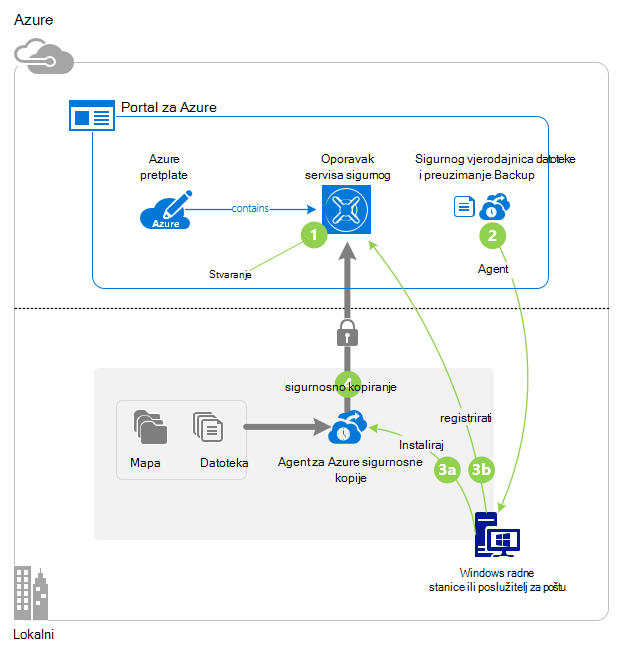

## Prije početka
Stvaranje sigurnosne kopije poslužitelja ili klijenta za Azure, potreban vam je račun za Azure. Ako ga nemate, možete stvoriti [pomoću računa](https://azure.microsoft.com/free/) u samo nekoliko minuta.

## Korak 1: Stvaranje oporavak servisa sigurnog

Oporavak servisa sigurnog je entitet koji pohranjuje sigurnosne kopije i oporavak točke stvorite tijekom vremena. Oporavak servisa sigurnog sadrži sigurnosne kopije pravila primjenjuju zaštićenim datotekama i mapama. Prilikom stvaranja oporavak servisa sigurnog i odaberite mogućnost zalihosti odgovarajuće prostora za pohranu.

### Da biste stvorili oporavak servisa sigurnog

1. Ako to još niste učinili, prijavite se na [Portal za Azure](https://portal.azure.com/) korištenja pretplate za Azure.

2. Na izborniku koncentrator kliknite **Pregledaj** , a zatim na popisu resursi upišite **Servise za oporavak**. Kao što počnete pisati, na popisu će filtrirati na temelju unos. Kliknite **sefovi servise za oporavak**.

    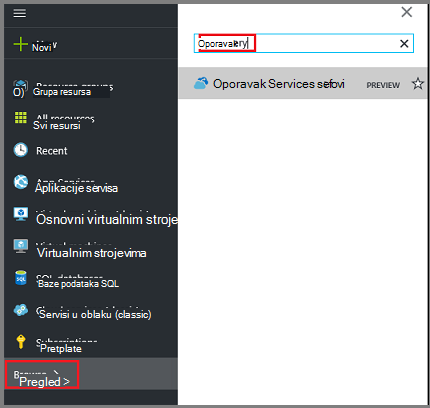  

    Prikazat će se popis sefovi servise za oporavak.

3. Na izborniku **sefovi oporavak servisi** kliknite **Dodaj**.

    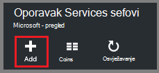

    Otvorit će se sigurnog plohu oporavak servise koje možete unijeti **naziv**, **pretplatu**, **grupa resursa**i **mjesto**pitanja.

    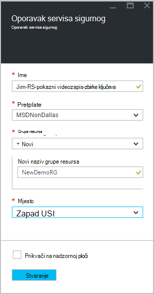

4. U odjeljku **naziv**unesite neslužbeni naziv da biste odredili na zbirke ključeva. Naziv mora biti jedinstvena za Azure pretplatu. Upišite naziv koji sadrži od 2 do 50 znakova. Morate pokrenuti slovom i mogu sadržavati samo slova, brojeve i spojnice.

5. Kliknite **pretplatu** da biste vidjeli dostupne popis pretplata. Ako niste sigurni koju pretplatu za korištenje, koristite zadanu (ili predložena) pretplate. Pojavit će se više mogućnosti samo ako je povezan s više pretplata Azure računa tvrtke ili ustanove.

6. Kliknite **grupu resursa** da biste vidjeli popis dostupnih grupa resursa ili **Novo** da biste stvorili novu grupu resursa. Potpune informacije o grupama resursa potražite u članku [Pregled upravljanja resursima za Azure](../azure-resource-manager/resource-group-overview.md)

7. Kliknite **mjesto** da biste odabrali regiji u zbirke ključeva. Taj odabir određuje regiji koju se šalju podataka iz sigurnosne kopije. Odabirom regiji sličan onome svoju lokaciju možete smanjiti latenciju mreže kada sigurnosno Azure.

8. Kliknite **Stvori**. Može potrajati neko vrijeme za oporavak servisa sigurnog će biti stvoren. Praćenje obavijesti o statusu u gornjem desnom području na portalu. Nakon stvaranja vaše zbirke ključeva, trebali biste otvoriti na portalu. Ako ne vidite svoje sigurnog naveden je dovršen, kliknite **Osvježi**. Kada se osvježavaju na popisu, kliknite naziv u zbirke ključeva.

### Da biste odredili zalihosti prostora za pohranu
Prilikom prvog stvaranja oporavak servisa sigurnog odredite koliko je prostora za pohranu replicirati.

1. U plohu **Postavke** koje se automatski otvara s sigurnog nadzorne ploče, kliknite **Infrastruktura za sigurnosno kopiranje**.

2. U plohu infrastruktura za sigurnosno kopiranje kliknite **Konfiguracije sigurnosnu kopiju** da biste pogledali **Vrsta replikacijom prostora za pohranu**.

    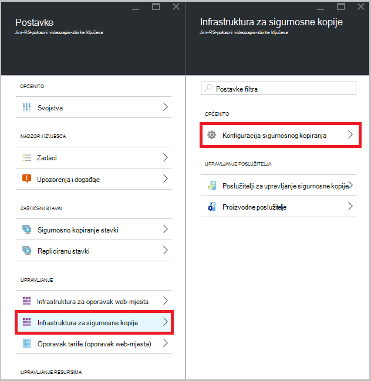

3. Odaberite mogućnost replikacijom prostora za pohranu za vaše zbirke ključeva.

    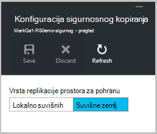

    Prema zadanim postavkama vašeg sigurnog ima zemlj suvišne prostora za pohranu. Ako koristite Azure kao krajnja točka primarni sigurnosne kopije prostora za pohranu, nastavite koristiti zemlj suvišnih prostora za pohranu. Ako koristite Azure kao krajnja točka za sigurnosne kopije prostora za pohranu koji nije primarni, odaberite lokalno suvišnih prostor za pohranu, čime će znatno smanjiti trošak pohrana podataka u Azure. Dodatne informacije o [zemlj suvišnih](../storage/storage-redundancy.md#geo-redundant-storage) i [lokalno suvišnih](../storage/storage-redundancy.md#locally-redundant-storage) mogućnosti pohrane u [Pregled](../storage/storage-redundancy.md).

    Nakon odabira mogućnosti prostora za pohranu za vaše zbirke ključeva, spremni ste za pridruživanje datoteka i mapa na zbirke ključeva.

Sad kad ste stvorili u sigurnog, pripremite vaše infrastrukturu za sigurnosno kopiranje datoteka i mapa, preuzimanje i instaliranje agent servisa Microsoft Azure oporavak Services, preuzimanje sigurnog vjerodajnice i korištenjem te vjerodajnice za registriranje agenta na sigurnog.

## Korak 2 – preuzimanje datoteke

>[AZURE.NOTE] Omogućavanje sigurnosne kopije putem portala za Azure uskoro dostupno. Trenutno koristite na agenta servisa za Microsoft Azure oporavak lokalnog sigurnosnu kopiju datoteke i mape.

1. Kliknite **Postavke** na nadzornoj ploči za oporavak servisa sigurnog.

    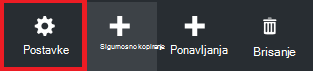

2. Kliknite **Uvod > sigurnosne kopije** na plohu postavke.

    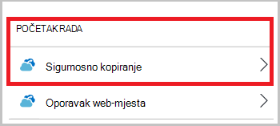

3. Kliknite **sigurnosne kopije cilj** plohu sigurnosnu kopiju.

    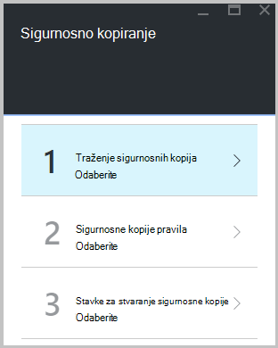

4. Odaberite **Lokalni** iz gdje je svoje radno opterećenje radi? izbornik.

5. Odaberite **datoteke i mape** na što želite sigurnosno kopirati? izbornik, a zatim kliknite **u redu**.

#### Preuzimanje agent za oporavak Services

1. Kliknite **Preuzimanje Agent za Windows Server i Windows klijent** plohu **Priprema infrastrukture** .

    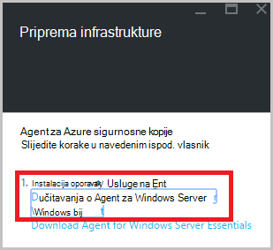

2. Kliknite **Spremi** u skočnom prozoru preuzimanja. Prema zadanim postavkama **MARSagentinstaller.exe** datoteka se sprema u mapi preuzimanja.

#### Preuzimanje sigurnog vjerodajnice

1. Kliknite **Preuzimanje > Spremanje** na infrastrukture plohu Priprema.

    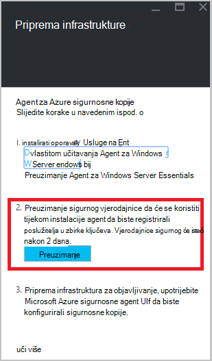

## Korak 3 – instalacija i registracija agenta

1. Pronađite i dvokliknite **MARSagentinstaller.exe** iz mape preuzimanja (ili drugih mjesta spremanja).

2. Dovršite Čarobnjak za postavljanje sustava Microsoft Azure oporavak Services Agent. Da biste dovršili Čarobnjak, morate:

    - Odaberite mjesto za instalaciju i mapu predmemorije.
    - Navedite proxy informacije o poslužitelju ako koristite proxy poslužitelj za povezivanje s Internetom.
    - Detalje svoje korisničko ime i lozinku ako koristite čija je autentičnost provjerena proxy poslužitelja.
    - Unesite vjerodajnice preuzete zbirke ključeva
    - Pristupni izraz za šifriranje spremite na sigurnom mjestu.

    >[AZURE.NOTE] Ako izgubite ili zaboravite pristupni izraz, Microsoft ne može pomoći oporavak sigurnosne kopije podataka. Spremite datoteku na sigurnom mjestu. Potrebna je za vraćanje sigurnosne kopije.

Agenta sada je instaliran, a vaše računalo registriran za na sigurnog. Spremni ste za konfiguriranje i planiranje sigurnosnu kopiju.

### Potvrda instalacije

Da biste potvrdili da agenta instaliranja i ispravno registriran, možete potražiti na stavke koje ste sigurnosno kopirali u odjeljku **Poslužitelj za proizvodnju** portala za upravljanje. Da biste to učinili:

1. Prijavite se na [Portal za Azure](https://portal.azure.com/) pomoću pretplate Azure.

2. Na izborniku koncentrator kliknite **Pregledaj** , a zatim na popisu resursi upišite **Servise za oporavak**. Kao što počnete pisati, na popisu će filtrirati na temelju unos. Kliknite **sefovi servise za oporavak**.

      

    Prikazat će se popis sefovi servise za oporavak.

2. Odaberite naziv zbirke ključeva koji ste stvorili.

    Otvorit će se plohu nadzorne ploče za oporavak servisa sigurnog.

    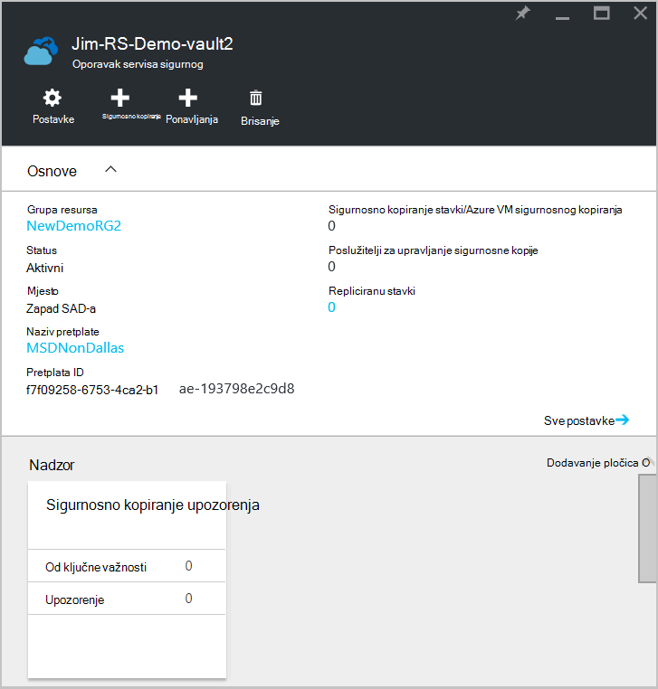  

3. Kliknite gumb **Postavke** pri vrhu stranice.

4. Kliknite **infrastrukture za sigurnosno kopiranje > proizvodne poslužitelje**.

    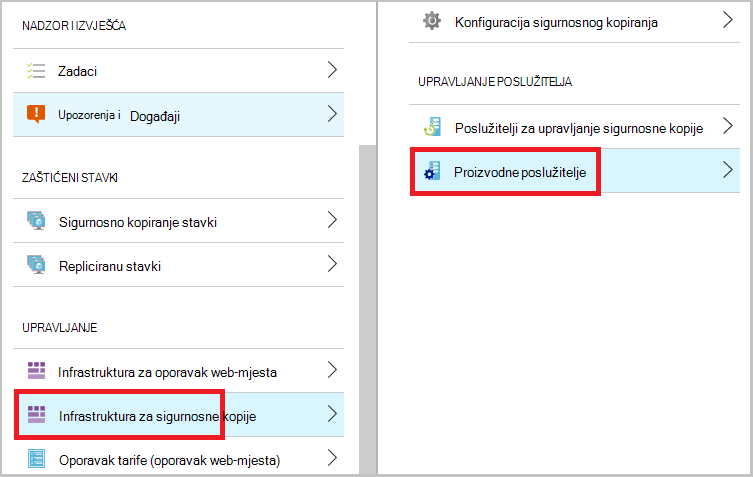

Ako vidite poslužiteljima na popisu, imate potvrdu da agenta instalirali i ispravno registriran.

## Korak 4: Dovršavanje početne sigurnosnog kopiranja

Početna sigurnosne kopije sadrži dvije osnovne zadatke:

- Raspored sigurnosnog kopiranja
- Sigurnosno kopiranje datoteka i mapa za prvi put

Da biste dovršili početne sigurnosnog kopiranja, koristite Microsoft Azure agent za sigurnosne kopije.

### Da biste zakazali sigurnosnog kopiranja

1. Otvorite agent za stvaranje sigurnosne kopije Microsoft Azure. Možete je pronaći traženjem računalu **Sigurnosna kopija Microsoft Azure**.

    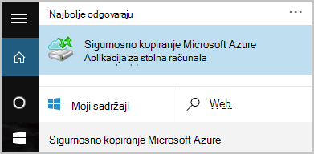

2. Agent za sigurnosne kopije kliknite **Raspored sigurnosnu kopiju**.

    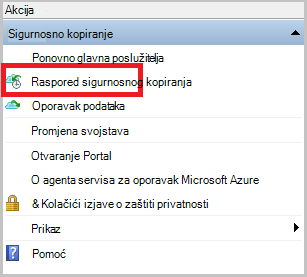

3. Na stranici prvi koraci čarobnjaka za sigurnosno kopiranje raspored, kliknite **Dalje**.

4. Stavke odaberite stranicu sigurnosnog kopiranja, kliknite **Dodaj stavke**.

5. Odaberite datoteke i mape koje želite sigurnosno kopirati, a zatim kliknite **redu**.

6. Kliknite **Dalje**.

7. Na stranici **Određivanje raspored sigurnosnog kopiranja** , navedite **raspored sigurnosnog kopiranja** , a zatim kliknite **Dalje**.

    Možete planirati dnevnu (Najveća brzina tri puta dnevno) ili s predlošcima tjednih sigurnosne kopije.

    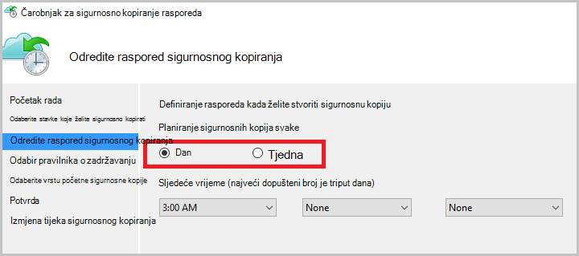

    >[AZURE.NOTE] Dodatne informacije o kako odrediti raspored sigurnosnog kopiranja, potražite u članku [Korištenje Azure sigurnosnu kopiju da biste zamijenili infrastruktura za vrpcu](backup-azure-backup-cloud-as-tape.md).

8. Na stranici **Odabir pravilnika o zadržavanju** odaberite **Pravilnika o zadržavanju** sigurnosne kopije.

    Pravila zadržavanja određuje trajanje za koje će se spremiti sigurnosnu kopiju. Umjesto samo određivanja "paušalni pravila" za sve točke sigurnosne kopije, možete odrediti različite zadržavanja na temelju kada se pojavi sigurnosno kopiranje. Možete izmijeniti dnevnih, tjedno, mjesečno i godišnje zadržavanja prema svojim potrebama.

9. Na stranici odaberite početni sigurnosne kopije Vrsta odaberite vrstu početne sigurnosne kopije. Ostavite mogućnost **automatski putem mreže** odabrali, a zatim kliknite **Dalje**.

    Možete stvoriti sigurnosnu automatski putem mreže ili možete stvoriti sigurnosnu izvanmrežno. Ostatak u ovom se članku opisuje postupak za automatsko sigurnosno kopiranje. Ako biste radije da biste učinili izvanmrežno sigurnosne kopije, pogledajte članak o [izvanmrežne sigurnosne kopije tijek rada koji se Azure sigurnosne kopije](backup-azure-backup-import-export.md) za dodatnim informacijama.

10. Na stranici za potvrdu pregledajte podatke, a zatim kliknite **Završi**.

11. Kad čarobnjak dovrši stvaranje raspored sigurnosnog kopiranja, kliknite **Zatvori**.

### Omogućivanje mreže ograničavanje (nije obavezno)

Agent za sigurnosne kopije omogućuje ograničavanje mreže. Reguliranje kontrolira kako se koristi propusnost mreže tijekom prijenosa podataka. Ova kontrola može biti korisno ako je potrebno sigurnosno kopiranje podataka tijekom radno vrijeme, ali ne želite da se postupak sigurnosnog kopiranja da biste sukob s drugim internetski promet. Ograničavanje primjenjuje sigurnosno kopiranje i vraćanje aktivnosti.

>[AZURE.NOTE] Ograničavanje mreže nije dostupna u sustavu Windows Server 2008 R2 SP1, Windows Server 2008 SP2 ili Windows 7 (sa servisnim paketima). Sigurnosno kopiranje Azure mreže ograničavanje značajki engages kvalitete Service (QoS) na lokalni operacijski sustav. Iako Azure sigurnosnog kopiranja možete zaštititi tih operacijskih sustava, verziju QoS dostupna na te platforme ne funkcionira s ograničavanje mreže Azure sigurnosnu kopiju. Ograničavanje mreži može se koristiti u svim drugim [podržani operacijski sustavi](backup-azure-backup-faq.md#installation-amp-configuration).

**Da biste omogućili mrežni ograničavanje**

1. U agent za sigurnosne kopije, kliknite **Promijeni svojstva**.

    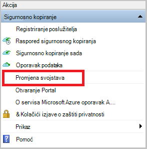

2. Na kartici **Throttling** odaberite potvrdni okvir **Omogući korištenja propusnosti internetske ograničavanje za sigurnosne kopije operacije** .

    

3. Nakon što ste omogućili ograničavanje, odredite dopuštene propusnosti za prijenos sigurnosne kopije podataka tijekom **radnog vremena** i **osobe koje nisu radno vrijeme**.

    Vrijednosti propusnosti pokrenuti 512 kilobita u sekundi (KB/s) te mogu posjetiti do 1,023 megabajta u sekundi (MB/s). Možete odrediti na početak i kraj **radnog vremena**i dane u tjednu se smatra radnih dana. Sata izvan određenu radnog vremena smatraju koje nisu posla sati.

4. Kliknite **u redu**.

### Stvaranje sigurnosne kopije datoteka i mapa za prvi put

1. U agent za sigurnosne kopije, kliknite **Odmah stvori sigurnosne kopije** da biste dovršili početne seeding putem mreže.

    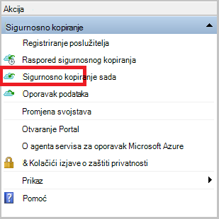

2. Na stranici za potvrdu pregledajte postavke koje ponovno se sada čarobnjak će koristiti sigurnosne kopije na računalu. Kliknite **Sigurnosno kopiranje**.

3. Kliknite **Zatvori** da biste zatvorili čarobnjak. Ako je to učiniti prije nego što završi postupak sigurnosnog kopiranja, čarobnjak nastavlja se izvoditi u pozadini.

Po dovršetku početne sigurnosne kopije na konzoli za sigurnosno kopiranje pojavit će se status **zadatak dovršen** .

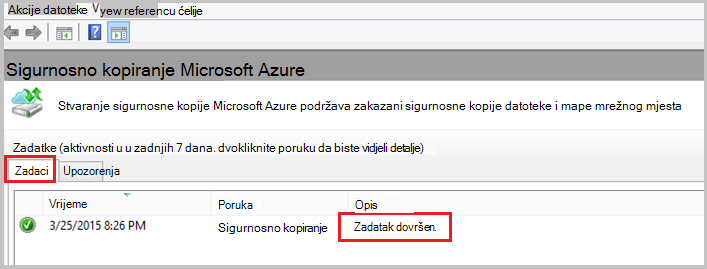

## Pitanja?
Ako imate pitanja ili ako postoji svih značajki koje želite da biste vidjeli sadrži, [Pošaljite nam povratnu informaciju](http://aka.ms/azurebackup_feedback).

## Daljnji koraci
Dodatne informacije o stvaranju sigurnosnih kopija VMs ili drugih radnih opterećenja potražite u članku:

- Sad kad ste sigurnosnu kopiju datoteke i mape, možete [upravljati sefovi i poslužitelja](backup-azure-manage-windows-server.md).
- Vraćanje sigurnosne kopije, koristite ovaj članak da biste [vratili datoteke na računalo sustava Windows](backup-azure-restore-windows-server.md).
