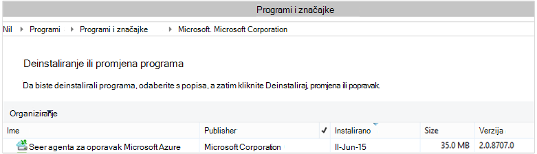

<properties
    pageTitle="Azure sigurnosno kopiranje - upravljanje i natrag za DPM pomoću komponente PowerShell | Microsoft Azure"
    description="Saznajte kako uvesti i upravljanje Azure sigurnosne kopije za podataka zaštitu Manager (DPM) pomoću komponente PowerShell"
    services="backup"
    documentationCenter=""
    authors="Nkolli1"
    manager="shreeshd"
    editor=""/>

<tags
    ms.service="backup"
    ms.workload="storage-backup-recovery"
    ms.tgt_pltfrm="na"
    ms.devlang="na"
    ms.topic="article"
    ms.date="09/27/2016"
    ms.author="jimpark; trinadhk; anuragm; markgal"/>


# <a name="deploy-and-manage-backup-to-azure-for-data-protection-manager-dpm-servers-using-powershell"></a>Uvođenje i upravljanje sigurnosnu kopiju za Azure za poslužitelje upravitelja podataka zaštitu (DPM) pomoću komponente PowerShell

> [AZURE.SELECTOR]
- [ARM](backup-dpm-automation.md)
- [Klasični](backup-dpm-automation-classic.md)

U ovom se članku objašnjava postavljanje Azure sigurnosnih kopija na poslužitelju DPM pomoću komponente PowerShell i upravljanje i oporavak sigurnosne kopije.

## <a name="setting-up-the-powershell-environment"></a>Postavljanje okruženja ljuske PowerShell

[AZURE.INCLUDE [learn-about-deployment-models](../../includes/learn-about-deployment-models-include.md)]

Prije korištenja ljuske PowerShell za upravljanje sigurnosne kopije iz podataka zaštitu upravitelja Azure, morat ćete imati desnom okruženje ljuske PowerShell. Na početku sesiju ljuske PowerShell, provjerite je li vam pokrenite sljedeću naredbu da biste uvezli desnom moduli i omogućuju vam pravilno referentni cmdleta DPM:

```
PS C:> & "C:\Program Files\Microsoft System Center 2012 R2\DPM\DPM\bin\DpmCliInitScript.ps1"

Welcome to the DPM Management Shell!

Full list of cmdlets: Get-Command
Only DPM cmdlets: Get-DPMCommand
Get general help: help
Get help for a cmdlet: help <cmdlet-name> or <cmdlet-name> -?
Get definition of a cmdlet: Get-Command <cmdlet-name> -Syntax
Sample DPM scripts: Get-DPMSampleScript
```

## <a name="setup-and-registration"></a>Postavljanje i Registracija
Da biste započeli:

1. [Preuzmite najnovije PowerShell](https://github.com/Azure/azure-powershell/releases) (Minimalna verzija potrebno je: 1.0.0)
2. Omogućivanje Cmdlete sigurnosne kopije Azure prebacivanjem na način *AzureResourceManager* pomoću cmdleta za **Promjenu AzureMode** :

```
PS C:\> Switch-AzureMode AzureResourceManager
```

Sljedeće zadatke postavljanje i registracija moguće je automatizirati sa servisom PowerShell:

- Stvaranje sigurnosne kopije zbirke ključeva
- Instaliranje agent za sigurnosno kopiranje Azure
- Registracija sa servisom Azure sigurnosnog kopiranja
- Postavke mreže
- Postavke šifriranja

### <a name="create-a-backup-vault"></a>Stvaranje sigurnosne kopije zbirke ključeva

> [AZURE.WARNING] Za korisnike koji se koriste sigurnosne kopije Azure prvi put, morate registrirati davatelja sigurnosne kopije Azure koja će se koristiti s pretplatom. To možete učiniti tako da pokrenete sljedeću naredbu: Register AzureProvider - ProviderNamespace "Microsoft.Backup"

Možete stvoriti novu sigurnosnu kopiju sigurnog pomoću cmdleta **New-AzureRMBackupVault** . Sigurnosno kopiranje zbirke ključeva je resursa u OBLAK da morate smjestite unutar grupu resursa. Povećani Azure PowerShell konzoli pokrenite sljedeće naredbe:

```
PS C:\> New-AzureResourceGroup –Name “test-rg” -Region “West US”
PS C:\> $backupvault = New-AzureRMBackupVault –ResourceGroupName “test-rg” –Name “test-vault” –Region “West US” –Storage GRS
```

Popis sigurnosne kopije sefovi možete dobiti u određenom pretplatu pomoću cmdleta **Get-AzureRMBackupVault** .


### <a name="installing-the-azure-backup-agent-on-a-dpm-server"></a>Agent za sigurnosne kopije Azure instalacije na poslužitelju DPM
Prije instalacije agent za sigurnosno kopiranje Azure, morate koristiti instalacijski program preuzeta i izlaganje na poslužitelju sustava Windows. Instalacijski program na najnoviju verziju možete dobiti iz [Microsoftova centra za preuzimanje](http://aka.ms/azurebackup_agent) ili iz sigurnosne kopije sigurnog stranica nadzorne ploče. Spremanje instalacijski program pristupačne mjesto kao što su * C:\Downloads\*.

Da biste instalirali agenta, pokrenite sljedeću naredbu na dodatnim PowerShell konzole **na poslužitelju DPM**:

```
PS C:\> MARSAgentInstaller.exe /q
```

Instalira se agenta na sa svim zadane mogućnosti. Instalacija traje nekoliko minuta u pozadini. Ako ne navedete mogućnost */nu* prozoru **Windows Update** će se otvoriti na kraju instalacije na Potraži ažuriranja.

Agenta prikazat će se na popisu instaliranih programa. Da biste vidjeli popis instaliranih programa, idite na **Upravljačku ploču** > **programa** > **Programi i značajke**.



#### <a name="installation-options"></a>Mogućnosti instalacije
Da biste vidjeli sve mogućnosti koje su dostupne putem naredbenog retka, koristite sljedeću naredbu:

```
PS C:\> MARSAgentInstaller.exe /?
```

Dostupne mogućnosti obuhvaćaju sljedeće:

| Mogućnost | Pojedinosti | Zadani |
| ---- | ----- | ----- |
| / q | Tihi instalacije | - |
| /p: "mjesto" | Put do instalacijsku mapu za agent za Azure sigurnosnu kopiju. | C:\Programske datoteke\Microsoft Azure oporavak Services Agent |
| / s: "mjesto" | Put do mape u predmemoriji za agent za Azure sigurnosnu kopiju. | C:\Programske datoteke\Microsoft Azure oporavak usluge Agent\Scratch |
| /m | Prijava za Microsoft Update | - |
| /nU | Provjerava ima li ažuriranja nakon dovršetka instalacije | - |
| /d | Deinstalira agenta servisa za oporavak Microsoft Azure | - |
| /ph | Proxy adrese za glavno računalo | - |
| /po | Broj priključka proxy glavnog računala | - |
| /pu | Korisničko ime proxy glavnog računala | - |
| /PW | Proxy lozinke | - |

### <a name="registering-with-the-azure-backup-service"></a>Registracija sa servisom Azure sigurnosnog kopiranja
Biste mogli registrirati sa servisom Azure sigurnosne kopije, koje je potrebno provjeriti [preduvjeti](backup-azure-dpm-introduction.md) zadovoljeni. Moraš:

- Imate valjan Azure pretplatu
- Ste sigurnosno kopiranje zbirke ključeva

Da biste preuzeli sigurnog vjerodajnice, pokrenite cmdlet **Get-AzureBackupVaultCredentials** konzoli za Azure PowerShell i spremite ga na određenom mjestu kao što su * C:\Downloads\*.

```
PS C:\> $credspath = "C:\"
PS C:\> $credsfilename = Get-AzureRMBackupVaultCredentials -Vault $backupvault -TargetLocation $credspath
PS C:\> $credsfilename
f5303a0b-fae4-4cdb-b44d-0e4c032dde26_backuprg_backuprn_2015-08-11--06-22-35.VaultCredentials
```

Prijava na računalu s na sigurnog obavlja pomoću cmdleta [Start DPMCloudRegistration](https://technet.microsoft.com/library/jj612787) :

```
PS C:\> $cred = $credspath + $credsfilename
PS C:\> Start-DPMCloudRegistration -DPMServerName "TestingServer" -VaultCredentialsFilePath $cred
```

To će registrirati DPM poslužitelj pod nazivom "TestingServer" s Microsoft Azure sigurnog pomoću vjerodajnica za navedeni sigurnog.

> [AZURE.IMPORTANT] Da biste odredili datoteku sigurnog vjerodajnice pomoću relativni putovi. Apsolutni put morate unijeti kao ulaz cmdletu.

### <a name="initial-configuration-settings"></a>Početna konfiguracija postavki
Kada poslužitelj DPM je registriran za sigurnosno kopiranje Azure sigurnog, počet će sa zadanim postavkama pretplate. Te postavke pretplate obuhvaćaju mreže, šifriranje i područja pripremna. Da biste započeli s promjenom postavki pretplate morate najprije dobiti bolji uvid u postojeće postavke (zadano) pomoću cmdleta [Get-DPMCloudSubscriptionSetting](https://technet.microsoft.com/library/jj612793) :

```
$setting = Get-DPMCloudSubscriptionSetting -DPMServerName "TestingServer"
```

Sve se izmjene nastaju na lokalni objekt PowerShell ```$setting``` i zatim cijeli objektni nastoji DPM i sigurnosno kopiranje Azure ih pomoću cmdleta [Skup DPMCloudSubscriptionSetting](https://technet.microsoft.com/library/jj612791) spremiti. Morate koristiti u ```–Commit``` zastavicu da biste bili sigurni da su promjene dosljedan. Postavke se neće primijeniti i koristiti sigurnosne kopije Azure osim ako izvršenom.

```
PS C:\> Set-DPMCloudSubscriptionSetting -DPMServerName "TestingServer" -SubscriptionSetting $setting -Commit
```

### <a name="networking"></a>Povezivanje s mrežom
Ako je povezivanje DPM računalu sa servisom Azure sigurnosne kopije na Internetu putem proxy poslužitelja, zatim postavke proxy poslužitelja biti dostupni sigurnosnih kopija da. To je izvršiti pomoću na ```-ProxyServer```, ```-ProxyPort```, ```-ProxyUsername``` i ```ProxyPassword``` parametara pomoću cmdleta [Skup DPMCloudSubscriptionSetting](https://technet.microsoft.com/library/jj612791) . U ovom primjeru postoji nema proxy poslužitelja pa ćemo su izričito poništite sve informacije vezane uz proxy poslužitelja.

```
PS C:\> Set-DPMCloudSubscriptionSetting -DPMServerName "TestingServer" -SubscriptionSetting $setting -NoProxy
```

Korištenja propusnosti može se kontrolirati i pomoću mogućnosti ```-WorkHourBandwidth``` i ```-NonWorkHourBandwidth``` za zadani skup dane u tjednu. U ovom primjeru smo ne postavljate sve ograničavanje.

```
PS C:\> Set-DPMCloudSubscriptionSetting -DPMServerName "TestingServer" -SubscriptionSetting $setting -NoThrottle
```

### <a name="configuring-the-staging-area"></a>Konfiguriranje pripremna područje
Agent za sigurnosne kopije Azure izvodi na poslužitelju DPM mora Privremena pohrana podataka vratiti iz oblaka (pripremna lokalna). Konfiguriranje područje pripremna pomoću cmdleta [Skup DPMCloudSubscriptionSetting](https://technet.microsoft.com/library/jj612791) i ```-StagingAreaPath``` parametar.

```
PS C:\> Set-DPMCloudSubscriptionSetting -DPMServerName "TestingServer" -SubscriptionSetting $setting -StagingAreaPath "C:\StagingArea"
```

U primjeru iznad područja pripremna će biti postavljena na *C:\StagingArea* u objektu PowerShell ```$setting```. Provjerite je li da već postoji u određenu mapu jer inače konačno potvrđivanje postavke pretplate neće uspjeti.


### <a name="encryption-settings"></a>Postavke šifriranja
Sigurnosno kopiranje podataka koji se šalju za Azure sigurnosne kopije šifrirana zaštita povjerljivost podataka. Pristupni izraz za šifriranje je "lozinkom" dešifrirati podatke u trenutku vraćanja. Važno je da bi ti podaci siguran i kada je postavljen.

U primjeru u nastavku prve naredbe Pretvara niz ```passphrase123456789``` sigurne niza i dodjeljuje pod nazivom sigurne niz varijabli ```$Passphrase```. drugi naredba postavlja sigurne niz u ```$Passphrase``` kao lozinka za šifriranje sigurnosne kopije.

```
PS C:\> $Passphrase = ConvertTo-SecureString -string "passphrase123456789" -AsPlainText -Force

PS C:\> Set-DPMCloudSubscriptionSetting -DPMServerName "TestingServer" -SubscriptionSetting $setting -EncryptionPassphrase $Passphrase
```

> [AZURE.IMPORTANT] Zadržati informacije pristupni izraz siguran i kada je postavljen. Nećete moći vratiti podatke iz Azure bez taj se pristupni izraz.

Sada, trebali biste ste sve potrebne promjene da biste na ```$setting``` objekt. Imajte na umu da biste potvrdili promjene.

```
PS C:\> Set-DPMCloudSubscriptionSetting -DPMServerName "TestingServer" -SubscriptionSetting $setting -Commit
```

## <a name="protect-data-to-azure-backup"></a>Zaštita podataka za sigurnosno kopiranje Azure
U ovom odjeljku ćete dodati na poslužitelj proizvodnje DPM i zaštiti podataka lokalno spremište DPM, a zatim sigurnosno kopiranje Azure. U primjerima smo će Demonstracija sigurnosnu kopiju datoteke i mape. Logika mogu se jednostavno proširiti za sigurnosno kopiranje svim izvorima podataka DPM podržane. Sve sigurnosne kopije DPM mjerodavni su tako da je zaštita grupe (stranica) s četiri dijela:

1. Popis svih protectable objekata (poznat i kao *Datasources* u DPM) koji želite zaštititi u istoj grupi Zaštita je **članove grupe** . Ako, na primjer, možda želite zaštititi radnog VMs u jednu grupu zaštitu i baza podataka sustava SQL Server u drugu grupu zaštite kao imaju različite sigurnosne preduvjete. Prije nego što možete sigurnosno kopirate sve izvora podataka na poslužitelju radnog potrebno da biste bili sigurni DPM Agent je instalirana na poslužitelju i upravlja DPM. Slijedite korake za [instalaciju DPM Agent](https://technet.microsoft.com/library/bb870935.aspx) i povezivanje na odgovarajući poslužitelj DPM.
2. **Način za zaštitu podataka** određuje na sigurnosne kopije odredišta - vrpce, na disku i u oblaku. U našem primjeru smo ćete zaštititi podatke na lokalnom disku i u oblak.
3. **Raspored sigurnosnog kopiranja** koji određuje kada sigurnosne kopije morate uzeti i koliko često podataka mora se sinkronizirati poslužitelja DPM poslužitelja radnog.
4. **Raspored zadržavanja** koji određuje koliko će se zadržavati oporavak točke u Azure.

### <a name="creating-a-protection-group"></a>Stvaranje grupe za zaštitu
Započnite tako da stvorite novu grupu za zaštitu pomoću cmdleta [New-DPMProtectionGroup](https://technet.microsoft.com/library/hh881722) .

```
PS C:\> $PG = New-DPMProtectionGroup -DPMServerName " TestingServer " -Name "ProtectGroup01"
```

Cmdlet iznad će stvoriti grupu zaštita pod nazivom *ProtectGroup01*. Postojeću grupu zaštita se i mijenjati kasnije da biste dodali sigurnosne kopije u oblak Azure. Međutim, promjene u grupi zaštita – novi ili postojeći - moramo dobiti bolji uvid u *mijenjati* objekt pomoću cmdleta [Get-DPMModifiableProtectionGroup](https://technet.microsoft.com/library/hh881713) .

```
PS C:\> $MPG = Get-ModifiableProtectionGroup $PG
```

### <a name="adding-group-members-to-the-protection-group"></a>Dodavanje članova grupe u grupi Zaštita
Svaki pojedini Agent DPM zna popis datasources na poslužitelju na kojem je instalirana na. Da biste dodali izvor grupi Zaštita, DPM Agent potrebno najprije poslati popis na datasources DPM poslužitelj. Jedan ili više datasources su odabrana i dodati grupi zaštita. PowerShell korake potrebne da biste postigli Ovo su:

1. Dohvaćanje popisa poslužiteljima na kojima upravlja DPM kroz DPM Agent.
2. Odaberite poslužitelj.
3. Dohvaćanje popisa svim izvorima podataka na poslužitelju.
4. Odaberite jednu ili više datasources i njihovo dodavanje u grupi Zaštita

Na popisu poslužitelja na kojem DPM Agent instalirana i upravlja poslužitelj DPM je nabaviti pomoću cmdleta [Get-DPMProductionServer](https://technet.microsoft.com/library/hh881600) . U ovom primjeru smo će filtrirati i samo konfiguriranje PS uz naziv *productionserver01* za sigurnosno kopiranje.

```
PS C:\> $server = Get-ProductionServer -DPMServerName "TestingServer" | where {($_.servername) –contains “productionserver01”
```

Sada na dohvaćanje popisa datasources ```$server``` pomoću cmdleta [Get-DPMDatasource](https://technet.microsoft.com/library/hh881605) . U ovom primjeru smo filtrirate jedinice *D:\* koje želimo da biste konfigurirali za sigurnosno kopiranje. Izvor podataka pa se dodaje grupe zaštitu pomoću cmdleta [Dodaj DPMChildDatasource](https://technet.microsoft.com/library/hh881732) . Imajte na umu da biste koristili u *modifable * Zaštita objekta grupe ```$MPG``` da bi se dodatke.

```
PS C:\> $DS = Get-Datasource -ProductionServer $server -Inquire | where { $_.Name -contains “D:\” }

PS C:\> Add-DPMChildDatasource -ProtectionGroup $MPG -ChildDatasource $DS
```

Ponovite ovaj korak neograničen broj puta prema potrebi, dok ste dodali svim odabranim izvorima podataka u grupi zaštita. Možete i započeti s jednog izvora podataka i dovršavanje tijeka rada za stvaranje grupe za zaštitu i noviji trenutku dodati više datasources grupi zaštita.

### <a name="selecting-the-data-protection-method"></a>Odabir načina za zaštitu podataka
Kada u datasources dodani u grupu zaštitu, sljedeći je korak da biste odredili način zaštitu pomoću cmdleta [Skup DPMProtectionType](https://technet.microsoft.com/library/hh881725) . U ovom primjeru grupi zaštita bit će instalacijski program za lokalni disk i sigurnosne kopije u oblak. Morate navesti izvor podataka koji želite zaštititi oblak pomoću cmdleta [Dodaj DPMChildDatasource](https://technet.microsoft.com/library/hh881732.aspx) zastavicom - Online.

```
PS C:\> Set-DPMProtectionType -ProtectionGroup $MPG -ShortTerm Disk –LongTerm Online
PS C:\> Add-DPMChildDatasource -ProtectionGroup $MPG -ChildDatasource $DS –Online
```

### <a name="setting-the-retention-range"></a>Postavke zadržavanja raspona
Postavite zadržavanja za sigurnosne kopije točkama pomoću cmdleta [Skup DPMPolicyObjective](https://technet.microsoft.com/library/hh881762) . Dok ga čini odd da biste postavili na zadržavanje prije raspored sigurnosnog kopiranja definiranu pomoću na ```Set-DPMPolicyObjective``` cmdlet automatski postavlja zadane sigurnosne kopije raspored koji se zatim može se promijeniti. Uvijek je skup sigurnosne kopije najprije zakazivanje i pravila zadržavanja nakon.

U primjeru u nastavku cmdlet postavlja parametara zadržavanja sigurnosnih kopija na disku. To će zadržati sigurnosne kopije 10 dana i sinkroniziranje podataka svakih 6 sati između radnog poslužitelja i DPM poslužitelja. Na ```SynchronizationFrequencyMinutes``` ne odrediti koliko često točku sigurnosne kopije stvaranja, ali kako često podaci kopiraju se s poslužiteljem DPM; To sprječava sigurnosne kopije postaje prevelika.

```
PS C:\> Set-DPMPolicyObjective –ProtectionGroup $MPG -RetentionRangeInDays 10 -SynchronizationFrequencyMinutes 360
```

Sigurnosnih kopija na Azure (DPM odnosi se na njih kao Online sigurnosne kopije) raspona zadržavanja moguće je konfigurirati za [dugoročnu zadržavanja pomoću sheme Grandfather očeva sin (GFS)](backup-azure-backup-cloud-as-tape.md). To jest, možete definirati pravila zadržavanja kombinirane koje obuhvaćaju jedanput dnevno, tjedno, mjesečno i godišnje pravilnika o zadržavanju. U ovom primjeru smo stvorite polja koja predstavlja shemu složene zadržavanja želimo i konfiguriranje zadržavanja raspona pomoću cmdleta [Skup DPMPolicyObjective](https://technet.microsoft.com/library/hh881762) .

```
PS C:\> $RRlist = @()
PS C:\> $RRList += (New-Object -TypeName Microsoft.Internal.EnterpriseStorage.Dls.UI.ObjectModel.OMCommon.RetentionRange -ArgumentList 180, Days)
PS C:\> $RRList += (New-Object -TypeName Microsoft.Internal.EnterpriseStorage.Dls.UI.ObjectModel.OMCommon.RetentionRange -ArgumentList 104, Weeks)
PS C:\> $RRList += (New-Object -TypeName Microsoft.Internal.EnterpriseStorage.Dls.UI.ObjectModel.OMCommon.RetentionRange -ArgumentList 60, Month)
PS C:\> $RRList += (New-Object -TypeName Microsoft.Internal.EnterpriseStorage.Dls.UI.ObjectModel.OMCommon.RetentionRange -ArgumentList 10, Years)
PS C:\> Set-DPMPolicyObjective –ProtectionGroup $MPG -OnlineRetentionRangeList $RRlist
```

### <a name="set-the-backup-schedule"></a>Postavljanje raspored sigurnosnog kopiranja
DPM zadani raspored za sigurnosne kopije automatski postavlja ako navedete u zaštitu ciljna pomoću na ```Set-DPMPolicyObjective``` cmdlet. Da biste promijenili zadani rasporedima, koristite cmdlet [Get-DPMPolicySchedule](https://technet.microsoft.com/library/hh881749) slijedi cmdlet [Skup DPMPolicySchedule](https://technet.microsoft.com/library/hh881723) .

```
PS C:\> $onlineSch = Get-DPMPolicySchedule -ProtectionGroup $mpg -LongTerm Online
PS C:\> Set-DPMPolicySchedule -ProtectionGroup $MPG -Schedule $onlineSch[0] -TimesOfDay 02:00
PS C:\> Set-DPMPolicySchedule -ProtectionGroup $MPG -Schedule $onlineSch[1] -TimesOfDay 02:00 -DaysOfWeek Sa,Su –Interval 1
PS C:\> Set-DPMPolicySchedule -ProtectionGroup $MPG -Schedule $onlineSch[2] -TimesOfDay 02:00 -RelativeIntervals First,Third –DaysOfWeek Sa
PS C:\> Set-DPMPolicySchedule -ProtectionGroup $MPG -Schedule $onlineSch[3] -TimesOfDay 02:00 -DaysOfMonth 2,5,8,9 -Months Jan,Jul
PS C:\> Set-DPMProtectionGroup -ProtectionGroup $MPG
```

U primjeru iznad, ```$onlineSch``` je polje s četiri elementima koji sadrži postojeći raspored online protection za grupu zaštite u shemi GFS:

1. ```$onlineSch[0]```će sadržavati dnevni raspored
2. ```$onlineSch[1]```će sadržavati tjednog rasporeda
3. ```$onlineSch[2]```će sadržavati mjesečni raspored
4. ```$onlineSch[3]```će sadržavati godišnje rasporeda

Da ako vam je potrebna za izmjenu tjedni raspored, morate uputiti na ```$onlineSch[1]```.

### <a name="initial-backup"></a>Početna sigurnosnog kopiranja
Kada prvi put, sigurnosno kopiranje izvor, DPM mora stvoriti do početne replike koji će stvoriti kopiju izvora podataka da biste biti zaštićene na DPM replike jedinici. Aktivnost može se zakazati ili za određeno vrijeme ili možete se pokreće ručno, pomoću cmdleta [Skup DPMReplicaCreationMethod](https://technet.microsoft.com/library/hh881715) s parametrom ```-NOW```.

```
PS C:\> Set-DPMReplicaCreationMethod -ProtectionGroup $MPG -NOW
```
### <a name="changing-the-size-of-dpm-replica--recovery-point-volume"></a>Promjena veličine DPM replike i oporavak točke glasnoće
Možete promijeniti i veličinu DPM replike glasnoće, kao i sjene glasnoću pomoću cmdleta [Skup DPMDatasourceDiskAllocation](https://technet.microsoft.com/library/hh881618.aspx) kao u u sljedećem primjeru: Get-DatasourceDiskAllocation - izvora podataka skup DatasourceDiskAllocation $DS - izvora podataka $DS - ProtectionGroup $MPG – ručno - ReplicaArea (2 gb) – ShadowCopyArea (2 gb)

### <a name="committing-the-changes-to-the-protection-group"></a>Zapisivanje u promjena u grupi Zaštita
Na kraju, promjene moraju biti izvršenja prije DPM može potrajati sigurnosne kopije po nova grupa zaštitu konfiguracija. To možete učiniti pomoću cmdleta [Skup DPMProtectionGroup](https://technet.microsoft.com/library/hh881758) .

```
PS C:\> Set-DPMProtectionGroup -ProtectionGroup $MPG
```
## <a name="view-the-backup-points"></a>Prikaz točke sigurnosne kopije
Cmdlet [Get-DPMRecoveryPoint](https://technet.microsoft.com/library/hh881746) možete koristiti da biste dobili popis svih oporavak točaka za izvor. U ovom primjeru provest će se:
- Dohvaćanje sve PGs na poslužitelju DPM koji će se spremiti u polju```$PG```
- Početak datasources odgovaraju na```$PG[0]```
- Pronađite sve točke oporavka za izvor.

```
PS C:\> $PG = Get-DPMProtectionGroup –DPMServerName "TestingServer"
PS C:\> $DS = Get-DPMDatasource -ProtectionGroup $PG[0]
PS C:\> $RecoveryPoints = Get-DPMRecoverypoint -Datasource $DS[0] -Online
```

## <a name="restore-data-protected-on-azure"></a>Vraćanje podataka koji su zaštićeni na Azure
Vraćanje podataka kombinacija je na ```RecoverableItem``` objekt, a ```RecoveryOption``` objekt. U prethodnom odjeljku smo imate popis sigurnosne kopije točke za izvor.

U primjeru u nastavku ćemo Demonstracija da biste vratili Hyper-V virtualnog računala iz sigurnosne kopije Azure kombiniranjem sigurnosne kopije točke s cilj za oporavak. To obuhvaća:

- Stvaranje mogućnost oporavka pomoću cmdleta [New-DPMRecoveryOption](https://technet.microsoft.com/library/hh881592) .
- Dohvaćanje polja sigurnosne kopije točkama pomoću na ```Get-DPMRecoveryPoint``` cmdlet.
- Odabir točku sigurnosnu kopiju da biste vratili iz.

```
PS C:\> $RecoveryOption = New-DPMRecoveryOption -HyperVDatasource -TargetServer "HVDCenter02" -RecoveryLocation AlternateHyperVServer -RecoveryType Recover -TargetLocation “C:\VMRecovery”

PS C:\> $PG = Get-DPMProtectionGroup –DPMServerName "TestingServer"
PS C:\> $DS = Get-DPMDatasource -ProtectionGroup $PG[0]
PS C:\> $RecoveryPoints = Get-DPMRecoverypoint -Datasource $DS[0] -Online

PS C:\> Restore-DPMRecoverableItem -RecoverableItem $RecoveryPoints[0] -RecoveryOption $RecoveryOption
```

Naredbe mogu se jednostavno proširiti za bilo koju vrstu izvora podataka.

## <a name="next-steps"></a>Daljnji koraci

- Dodatne informacije o Azure sigurnosne kopije za DPM potražite u članku [Uvod u DPM sigurnosnog kopiranja](backup-azure-dpm-introduction.md)
