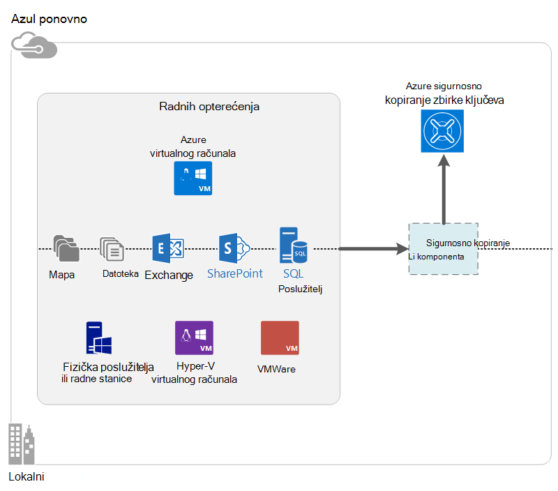

<properties
    pageTitle="Što je sigurnosne kopije Azure? | Microsoft Azure"
    description="Pomoću Azure sigurnosne kopije i oporavak Services možete sigurnosno kopirati, a vraćanja podataka i aplikacije s poslužitelja sustava Windows, Windows klijentskim računalima, DPM centar sustava poslužitelja i Azure virtualnim računalima."
    services="backup"
    documentationCenter=""
    authors="markgalioto"
    manager="cfreeman"
    editor="tysonn"
    keywords="sigurnosno kopiranje i vraćanje; servise za oporavak; sigurnosno kopiranje rješenja"/>

<tags
    ms.service="backup"
    ms.workload="storage-backup-recovery"
    ms.tgt_pltfrm="na"
    ms.devlang="na"
    ms.topic="get-started-article"
    ms.date="10/19/2016"
    ms.author="jimpark; trinadhk"/>

# Što je sigurnosne kopije Azure?
Azure sigurnosne kopije je servis koji koristite za sigurnosno kopiranje i vraćanje podataka u programu Microsoft Excel. Zamjenjuje postojeće lokalnog ili službenoj sigurnosne kopije rješenja s oblaku rješenje koje je pouzdan, siguran i konkurencije trošak. To također pomaže u zaštiti resursi koji se izvode u oblaku. Azure Backup omogućuje servise za oporavak utemeljena na svjetskim infrastruktura za skalabilni, durable i vrlo dostupna.

[Pogledajte videozapis pregled Azure sigurnosnog kopiranja](https://azure.microsoft.com/documentation/videos/what-is-azure-backup/)

## Zašto koristiti sigurnosne kopije Azure?
Tradicionalni sigurnosne kopije rješenja su razvile oblaka tretirati kao krajnje slično kao diskova ili vrpcu. Dok je takvog jednostavne, preporučuje se i ograničena. Moći iskoristiti platforme temeljnih oblaka i prevodi rješenja programa neučinkovito, skupi.
Nasuprot tome, Azure sigurnosne kopije nudi sve prednosti naprednih i jeftin oblaka rješenja za sigurnosne kopije. Slijede ključne pogodnosti koje pruža Azure sigurnosnu kopiju.

| Značajka | Pogodnost |
| ------- | ------- |
| Upravljanje pohranom automatski | Nema expenditure veliko slovo je potrebno za lokalni uređaji za pohranu. Azure sigurnosne kopije automatski dodjeljuje i upravlja sigurnosne kopije prostora za pohranu i koristi potrošnje plaćanje kao-vam – korištenje modela. |
| Neograničeno skaliranja | Iskoristite prednost visoke dostupnosti jamstva bez indirektnih troškova održavanja i nadzor. Azure sigurnosne kopije koristi podlozi power i skale Azure oblaka s njegovim mogućnostima nonintrusive autoscaling. |
| Više mogućnosti pohrane | Odaberite sigurnosne kopije prostora za pohranu na temelju potreba:<li>Blokiranje blob lokalno suvišnih prostora za pohranu idealna je za kupce cijena conscious pa je i dalje pomaže u zaštiti podataka na temelju lokalne hardverske pogreške. <li>Blob bloka za pohranu zemlj replikacije pruža tri više kopija u paru podatkovnog centra. Ove dodatne kopije osigurati da sigurnosne kopije podataka dostupna iznimno čak i ako se pojavi Azure Izrada za razini web-mjesta. |
| Prijenos neograničeno podataka | Postoji bez naknade za sve izlazne podatke (izlazni) prijenos tijekom operacije vraćanja iz zbirke ključeva za sigurnosno kopiranje. Dolazni podataka za Azure je besplatno. Radi sa servisom uvoz u kojem je dostupna. |
| Šifriranje podataka | Šifriranje podataka omogućuje sigurno prijenosa i prostora za pohranu podataka o klijentima u oblak javno. Pristupni izraz za šifriranje pohranjen u izvoru pa se nikad ne prenose ili pohranjena u Azure. Za vraćanje svih podataka potreban je ključa za šifriranje, a samo je korisnik odabrao ima puni pristup podacima na servisu. |  
| Aplikacija dosljedan sigurnosnog kopiranja | Aplikacija dosljedan sigurnosnih kopija na Windows osigurati da rješenja nije potreban trenutku vraćanja koji smanjuje cilj vremena za oporavak. Time se omogućuje klijentima da biste se vratili u stanje izvodi brže. |
| Dugoročne zadržavanja | Umjesto platiti službenoj vrpcu sigurnosne kopije rješenja, korisnici mogu spremiti sigurnosnu kopiju Azure, koji omogućuje atraktivnog rješenja nalik na vrpci pri na malom troškova. |

## Azure komponente sigurnosnog kopiranja
Budući da sigurnosno kopiranje hibridnog rješenja za sigurnosne kopije, sastoji se od više komponenti koji funkcioniraju zajedno da biste omogućili završetka do kraja sigurnosnog kopiranja i vraćanja tijekova rada.

### Scenariji za implementaciju

| Komponenta | Može se uvesti Azure? | Može biti distribuiranih lokalnog? | Cilj prostora za pohranu podržana|
| --- | --- | --- | --- |
| Agent za Azure sigurnosnog kopiranja | 
**Da**
 
Agent za sigurnosne kopije Azure može uvesti na bilo kojem VM Windows Server koji se izvodi u Azure.
 | 
**Da**
 
Agent za sigurnosne kopije može uvesti na bilo kojem Windows Server VM ili fizičke računala.
 | 
Azure sigurnog sigurnosnog kopiranja
 |
| Upravitelj podataka zaštite u Centar za sustav (DPM) | 
**Da**

Dodatne informacije o [zaštiti radnih opterećenja servisu Azure pomoću DPM centar sustava](http://blogs.technet.com/b/dpm/archive/2014/09/02/azure-iaas-workload-protection-using-data-protection-manager.aspx).
 | 
**Da**
 
Dodatne informacije o [zaštiti radnih opterećenja i VMs u vašem podatkovnog centra](https://technet.microsoft.com/library/hh758173.aspx).
 | 
Lokalno pridružene disk
 
Zbirke ključeva za Azure sigurnosnog kopiranja
 
Vrpca (lokalni samo)
 |
| Poslužitelj za Azure sigurnosne kopije | 
**Da**

Dodatne informacije o [zaštiti radnih opterećenja servisu Azure pomoću poslužitelja za sigurnosno kopiranje Azure](backup-azure-microsoft-azure-backup.md).
 | 
**Da**
 
Dodatne informacije o [zaštiti radnih opterećenja servisu Azure pomoću poslužitelja za sigurnosno kopiranje Azure](backup-azure-microsoft-azure-backup.md).
 | 
Lokalno pridružene disk
 
Azure sigurnog sigurnosnog kopiranja
 |
| Azure sigurnosne kopije (VM kućni broj) | 
**Da**

Dio Azure tkanina

Oblici sadrže za [sigurnosnu kopiju Azure infrastrukture kao virtualnim strojevima za servis (IaaS)](backup-azure-vms-introduction.md).
 | 
**ne**
 
Pomoću DPM centar sustava sigurnosno kopiranje virtualnim strojevima u vašem podatkovnog centra.
 | 
Azure sigurnog sigurnosnog kopiranja
 |

### Komponenta razine prednosti i ograničenja

| Komponenta | Prednosti | Ograničenja | Oporavak preciznosti |
| --- | --- | --- | --- |
| Agent za Azure sigurnosne kopije (OŽU) | <li>Sigurnosno kopirajte datoteke i mape na računalu s operacijskim Sustavom Windows, biti fizički ili virtualni (VMs može biti bilo gdje na lokalni ili Azure)<li>Nema zaseban sigurnosne kopije poslužitelj potrebna<li>Koristi Azure sigurnosno kopiranje zbirke ključeva | <li>Vraćanje triput dan/datoteka sigurnosne kopije razine<li>Datoteka/mapa/glasnoću razine Vrati ne aplikacije, samo umu<li>Nema podrške za Linux | datoteka/mapa/jedinice |
| Centar sustava Upravitelj za zaštitu podataka | <li>Brze snimke umu aplikaciju (VSS)<li>Potpuna fleksibilnost kada da biste preuzeli sigurnosne kopije<li>Oporavak granularnosti (sve)<li>Možete koristiti sigurnog Azure sigurnosnog kopiranja<li>Podrška za Linux (Ako se hostira na Hyper-V) | <li>Nedostatak heterogenih podrške (VMware VM naviše radno opterećenje Oracle sigurnosno kopiranje).  | datoteka/mapa/jedinice / VMs/aplikacije |
| Poslužitelj za sigurnosne kopije Microsoft Azure | <li>Brze snimke umu aplikaciju (VSS)<li>Potpuna fleksibilnost kada da biste preuzeli sigurnosne kopije<li>Oporavak granularnosti (sve)<li>Možete koristiti sigurnog Azure sigurnosnog kopiranja<li>Podrška za Linux (Ako se hostira na Hyper-V)<li>Potrebna licenca centar sustava | <li>Nedostatak heterogenih podrške (VMware VM naviše radno opterećenje Oracle sigurnosno kopiranje).<li>Uvijek zahtijeva uživo Azure pretplate<li>Nema podrške za sigurnosno kopiranje vrpce | datoteka/mapa/jedinice / VMs/aplikacije |
| Azure IaaS VM sigurnosnog kopiranja | <li>Izvorni sigurnosne kopije za Windows/Linux<li>Nije potrebna je instalacija određene agent<li>Tkanina razine sigurnosne kopije u programu bez sigurnosne kopije infrastrukture potrebno | <li>Jednom dnevno natrag gore/disk razine vraćanja<li>Nije moguće sigurnosnu kopiju lokalne | VMs Sve diskova (pomoću komponente PowerShell) |

## Koje aplikacije i radnih opterećenja mogu se sigurnosno?

| Radno opterećenje | Strojno izvora | Rješenja Azure sigurnosnog kopiranja |
| --- | --- |---|
| Datoteka i mapa | Windows Server | 
[Agent za sigurnosne kopije azure](backup-configure-vault.md)
 
[Centar za sustav DPM](backup-azure-dpm-introduction.md) (+ agent za sigurnosno kopiranje Azure),
 
[Poslužitelj za Azure sigurnosne kopije](backup-azure-microsoft-azure-backup.md) (uključuje agent za sigurnosno kopiranje Azure)
  |
| Datoteka i mapa | Klijent za Windows | 
[Agent za sigurnosne kopije azure](backup-configure-vault.md)
 
[Centar za sustav DPM](backup-azure-dpm-introduction.md) (+ agent za sigurnosno kopiranje Azure),
 
[Poslužitelj za Azure sigurnosne kopije](backup-azure-microsoft-azure-backup.md) (uključuje agent za sigurnosno kopiranje Azure)
  |
| Hyper-V virtualnog računala (Windows) | Windows Server | 
[Centar za sustav DPM](backup-azure-backup-sql.md) (+ agent za sigurnosno kopiranje Azure),
 
[Poslužitelj za Azure sigurnosne kopije](backup-azure-microsoft-azure-backup.md) (uključuje agent za sigurnosno kopiranje Azure)
 |
| Hyper-V virtualnog računala (Linux) | Windows Server | 
[Centar za sustav DPM](backup-azure-backup-sql.md) (+ agent za sigurnosno kopiranje Azure),
 
[Poslužitelj za Azure sigurnosne kopije](backup-azure-microsoft-azure-backup.md) (uključuje agent za sigurnosno kopiranje Azure)
  |
| Microsoft SQL Server | Windows Server | 
[Centar za sustav DPM](backup-azure-backup-sql.md) (+ agent za sigurnosno kopiranje Azure),
 
[Poslužitelj za Azure sigurnosne kopije](backup-azure-microsoft-azure-backup.md) (uključuje agent za sigurnosno kopiranje Azure)
  |
| Microsoft SharePoint | Windows Server | 
[Centar za sustav DPM](backup-azure-backup-sql.md) (+ agent za sigurnosno kopiranje Azure),
 
[Poslužitelj za Azure sigurnosne kopije](backup-azure-microsoft-azure-backup.md) (uključuje agent za sigurnosno kopiranje Azure)
   |
| Microsoft Exchange |  Windows Server | 
[Centar za sustav DPM](backup-azure-backup-sql.md) (+ agent za sigurnosno kopiranje Azure),
 
[Poslužitelj za Azure sigurnosne kopije](backup-azure-microsoft-azure-backup.md) (uključuje agent za sigurnosno kopiranje Azure)
   |
| Azure IaaS VMs (Windows) | - | [Azure sigurnosne kopije (VM kućni broj)](backup-azure-vms-introduction.md) |
| Azure IaaS VMs (Linux) | - | [Azure sigurnosne kopije (VM kućni broj)](backup-azure-vms-introduction.md) |

## ARM i Linux podrška

| Komponenta | Podrška za ARM | Linux (Azure licencira) podrška |
| --- | --- | --- |
| Agent za Azure sigurnosne kopije (OŽU) | Da | Nema (samo temelje agent za Windows) |
| Centar sustava Upravitelj za zaštitu podataka | Da (Agent u goste) | Moguće je samo Hyper-V (ne Azure VM) samo datoteke-dosljedan sigurnosnog kopiranja |
| Poslužitelj za Azure sigurnosne kopije (MABS) | Da (Agent u goste) | Samo moguće je samo datoteke-dosljedan sigurnosne kopije Hyper-V (ne Azure VM) (isto kao DPM) |
| Azure IaaS VM sigurnosnog kopiranja | Da | Da |

[AZURE.INCLUDE [learn-about-deployment-models](../../includes/learn-about-deployment-models-include.md)]

## Sigurnosno kopiranje i vraćanje VMs Premium prostora za pohranu

Servis za sigurnosno kopiranje Azure sada štiti VMs Premium prostora za pohranu.

### Stvaranje sigurnosne kopije VMs Premium prostora za pohranu

Tijekom sigurnosnog kopiranja VMs Premium prostora za pohranu, servis za sigurnosno kopiranje stvara privremeno pripremna mjesto u račun za pohranu Premium. Pripremna mjestu, pod nazivom "AzureBackup-", jednak je veličina Ukupno od premium diskova priložiti u VM.

>[AZURE.NOTE] Izmjena ili uredite pripremna mjesto.

Kada sigurnosno kopiranje završi, briše se pripremna mjesto. Cijena prostora za pohranu za pripremna mjesto je dosljedna sve [Premium prostora za pohranu cijene](../storage/storage-premium-storage.md#pricing-and-billing).

### Vraćanje VMs Premium prostora za pohranu

Premium prostora za pohranu VM može ih vratiti ili Premium prostora za pohranu ili normalno prostora za pohranu. Oporavak točku Premium prostora za pohranu VM vraćanja njegove Premium prostora za pohranu je uobičajenu postupak vraćanja. Međutim, možda ćete troškova učinkovitih da biste vratili točku oporavak Premium prostora za pohranu VM standardne prostora za pohranu. Ako vam je potrebna podskup datoteke iz sustava VM, može se koristiti ovu vrstu vraćanje.

## Funkcija
Tih pet tablica sažeti kako sigurnosne kopije funkcija obrađuje u svaku od njih.

### Prostor za pohranu

| Značajka | Agent za Azure sigurnosnog kopiranja | Centar za sustav DPM | Poslužitelj za Azure sigurnosne kopije | Azure sigurnosne kopije (VM kućni broj) |
| ------- | --- | --- | --- | ---- |
| Azure sigurnog sigurnosnog kopiranja | ![Da][green] | ![Da][green] | ![Da][green] | ![Da][green] |
| Prostor za pohranu na disku | | ![Da][green] | ![Da][green] |  |
| Vrpca za pohranu | | ![Da][green] |  | |
| Komprimiranje (u sigurnosno kopiranje zbirke ključeva) | ![Da][green] | ![Da][green]| ![Da][green] | |
| Rastuća sigurnosnog kopiranja | ![Da][green] | ![Da][green] | ![Da][green] | ![Da][green] |
| Poništavanje duplikacije disk | | ![Djelomično][yellow] | ![Djelomično][yellow]| | |

Sigurnosno kopiranje sigurnog je cilj Preferirani prostora za pohranu preko svih komponenti. Poslužitelj za sigurnosne kopije i DPM centar sustava omogućuje i mogućnost da bi kopiju na lokalnom disku. Međutim, samo DPM centar sustava pruža mogućnost zapisivanje podataka uređaj za pohranu vrpcu.

#### Rastuća sigurnosnog kopiranja
Svaka komponenta podržava rastuće sigurnosnog kopiranja bez obzira na ciljnom prostora za pohranu (disk, vrpcu, sigurnosno kopiranje zbirke ključeva). Rastuća sigurnosne kopije osigurava sigurnosne kopije jesu li web-mjesto za pohranu i u okvir za vrijeme učinkovitog, tako da prijenos samo promjene izvršene nakon zadnje sigurnosne kopije.

#### Sažimanje
Da biste smanjili potreban prostor su spojene sigurnosne kopije. Samo komponente koja koristi sažimanje je VM datotečni nastavak. S nastavkom VM sve sigurnosne kopije podaci kopiraju se s računa za pohranu klijenta za sigurnosno kopiranje zbirke ključeva u istom području bez sažimanje ga. Tijekom rada bez sažimanja malo inflates koristi prostora za pohranu, pohranjivanje podataka bez sažimanja omogućuje brže vraćanja vremena.

#### Poništavanje duplikacije
Poništavanje duplikacije nije podržana za sigurnosno kopiranje poslužitelj i DPM centar sustava kada je [uveden u Hyper-V virtualnog računala](http://blogs.technet.com/b/dpm/archive/2015/01/06/deduplication-of-dpm-storage-reduce-dpm-storage-consumption.aspx). Poništavanje duplikacije izvodi se na razini glavnog računala pomoću Poništavanje duplikacije Windows Server na virtualne tvrdom disku (VHDs) koje su priložene virtualnog računala kao sigurnosnu kopiju prostora za pohranu.

>[AZURE.WARNING] Poništavanje duplikacije nije dostupna u Azure za sve komponente za sigurnosno kopiranje. Kada su u Azure implementirana DPM centar sustava i poslužitelj za sigurnosne kopije, diskova za pohranu priložiti u VM ne deduplicated.

### Sigurnost

| Značajka | Agent za Azure sigurnosnog kopiranja | Centar za sustav DPM | Poslužitelj za Azure sigurnosne kopije | Azure sigurnosne kopije (VM kućni broj) |
| ------- | --- | --- | --- | ---- |
| Zaštita mreže (za Azure) | ![Da][green] |![Da][green] | ![Da][green] | ![Djelomično][yellow]|
| Sigurnost podataka (u Azure) | ![Da][green] |![Da][green] | ![Da][green] | ![Djelomično][yellow]|

Sve sigurnosne kopije promet s poslužitelja za sigurnosno kopiranje sigurnog šifriran pomoću napredne standardne 256 za šifriranje. Podaci se šalju putem sigurne HTTP vezu. Sigurnosne kopije podataka i pohranjena u sigurnog sigurnosnu kopiju u šifrirane obrasca. Samo klijent sadrži pristupni izraz da biste otključali te podatke. Microsoft ne može dešifrirati sigurnosne kopije podataka u bilo kojem trenutku.

>[AZURE.WARNING] Ključ za šifriranje sigurnosne kopije podataka postoji samo s klijentom. Microsoft održavati kopiju u Azure i imaju pristup ključu. Ako je izgubili ključ, Microsoft nije moguće vratiti sigurnosne kopije podataka.

Sigurnosno kopiranje Azure VMs zahtijeva postavljanje šifriranje *unutar* virtualnog računala. Korištenje programa BitLocker na virtualnim strojevima sa sustavom Windows i **dm crypt** na virtualnim strojevima Linux. Azure sigurnosne kopije Šifrirajte automatski sigurnosne kopije podataka koje prolazi kroz ovaj put.

### Podržani radnih opterećenja

| Značajka | Agent za Azure sigurnosnog kopiranja | Centar za sustav DPM | Poslužitelj za Azure sigurnosne kopije | Azure sigurnosne kopije (VM kućni broj) |
| ------- | --- | --- | --- | ---- |
| Strojno Windows Server – datoteka i mapa | ![Da][green] | ![Da][green] | ![Da][green] | |
| Windows klijentskom računalu – datoteka i mapa | ![Da][green] | ![Da][green] | ![Da][green] | |
| Hyper-V virtualnog računala (Windows) | | ![Da][green] | ![Da][green] | |
| Hyper-V virtualnog računala (Linux) | | ![Da][green] | ![Da][green] | |
| Microsoft SQL Server | | ![Da][green] | ![Da][green] | |
| Microsoft SharePoint | | ![Da][green] | ![Da][green] | |
| Microsoft Exchange  | | ![Da][green] | ![Da][green] | |
| Azure virtualnog računala (Windows) | | | | ![Da][green] |
| Azure virtualnog računala (Linux) | | | | ![Da][green] |

### Mreža

| Značajka | Agent za Azure sigurnosnog kopiranja | Centar za sustav DPM | Poslužitelj za Azure sigurnosne kopije | Azure sigurnosne kopije (VM kućni broj) |
| ------- | --- | --- | --- | ---- |
| Spajanje mreža (na poslužitelj za sigurnosne kopije) | | ![Da][green] | ![Da][green] | |
| Spajanje mreža (za sigurnosno kopiranje zbirke ključeva) | ![Da][green] | ![Da][green] | ![Da][green] | |
| Mrežni protokol (na poslužitelj za sigurnosne kopije) | | TCP | TCP | |
| Mrežni protokol (za sigurnosno kopiranje zbirke ključeva) | HTTPS | HTTPS | HTTPS | HTTPS |

Jer je datotečni nastavak VM čita podatke izravno s računa za Azure prostora za pohranu putem mreže za pohranu, nije potrebno optimizirati tog prometa. Promet je putem mreže lokalno spremište u podatkovnim centrom Azure pa nepotrebno za sažimanje zbog razmatranja propusnosti.

Ako se sigurnosno kopiranje podataka na poslužitelj za sigurnosne kopije (DPM ili poslužitelj za sigurnosne kopije), da biste spremili na propusnosti mogu biti spojene promet s poslužiteljem primarni poslužitelj za sigurnosne kopije.

#### Ograničavanje mreže
Agent za sigurnosne kopije Azure nudi regulacije mogućnost koja omogućuje kontrolu načina na koji se propusnost mreže koristi tijekom prijenosa podataka. Ograničavanje može biti korisno ako je potrebno sigurnosno kopiranje podataka tijekom radno vrijeme, ali ne želite da se postupak sigurnosnog kopiranja da biste sukob s drugim internetski promet. Ograničavanje podataka prijenos odnosi se na sigurnosno kopiranje i vraćanje aktivnosti.

### Sigurnosno kopiranje i zadržavanja

|  | Agent za Azure sigurnosnog kopiranja | Centar za sustav DPM | Poslužitelj za Azure sigurnosne kopije | Azure sigurnosne kopije (VM kućni broj) |
| --- | --- | --- | --- | --- |
| Sigurnosno kopiranje učestalost (za sigurnosno kopiranje zbirke ključeva) | Tri sigurnosne kopije prema danu | Dva kopija prema danu |Dva kopija prema danu | Jednu sigurnosnu kopiju prema danu |
| Sigurnosno kopiranje učestalost (na disku) | Nije primjenjivo | 
Svakih 15 minuta za SQL Server
 
Svaki sat za druge opterećenjem
 | 
Svakih 15 minuta za SQL Server
 
Svaki sat za drugih radnih opterećenja
 |Nije primjenjivo |
| Mogućnosti zadržavanja | Dnevno, tjedno, mjesečno, godišnje | Dnevno, tjedno, mjesečno, godišnje | Dnevno, tjedno, mjesečno, godišnje |Dnevno, tjedno, mjesečno, godišnje |
| Razdoblje zadržavanja | Do 99 godina | Do 99 godina | Do 99 godina | Do 99 godina |
| Oporavak naglaske iz zbirke ključeva sigurnosnog kopiranja | Neograničeno | Neograničeno | Neograničeno | Neograničeno |
| Oporavak točke na lokalni disk | Nije primjenjivo | 64 za poslužitelje datoteka  448 za poslužitelje aplikacije | 64 za poslužitelje datoteka  448 za poslužitelje aplikacije |Nije primjenjivo |
| Oporavak upućuje na vrpci | Nije primjenjivo | Neograničeno | Nije primjenjivo | Nije primjenjivo |

## Što je datoteka vjerodajnica sigurnog?

Datoteka vjerodajnice sigurnog je certifikat koji je generirao portal za svaki sigurnosno kopiranje zbirke ključeva. Na portalu zatim prenosi javni ključ da biste u Access kontrola servisa (ACS). Privatni ključ je omogućuje korisniku prilikom preuzimanja vjerodajnice i zatim unose tijekom registracije za računala. Privatni ključ potvrđuje računala da biste poslali sigurnosne kopije podataka identificirani sigurnog u servisu Azure sigurnosne kopije.

Samo tijekom tijeka rada za registraciju koristi se vjerodajnica zbirke ključeva. Je odgovornost da biste bili sigurni vjerodajnice datoteke sigurnog ne ugrožena. Ako se nalaze u ruke bilo koji rogue korisnik, datoteka vjerodajnice sigurnog mogu se registrirati druga računala na temelju isti sigurnog. Međutim, budući da sigurnosne kopije podataka šifriran pomoću pristupni izraz pripadaju samo klijent, postojeće sigurnosne kopije podataka ne može biti ugrožena. Da biste smanjili ovaj problem, sigurnog vjerodajnice su postavljene isteći u 48 sati. Dok možete preuzeti vjerodajnice sigurnog sigurnosnu kopiju vault više puta, samo najnovije datoteke je primjenjivo tijekom tijeka rada za registraciju.

## Kako se sigurnosno kopiranje Azure razlikuju oporavak Azure web-mjesta?
Više klijenata zbuniti Vraćanje sigurnosne kopije i oporavak Izrada. Oba prikupljanje podataka i navedite semantiku vraćanja, ali njihove propositions vrijednost temeljni se razlikuju.

Sigurnosno kopiranje s Azure stvara podataka na lokalno i u oblaku. Oporavak Azure web-mjesta koordinate virtualnog računala i poslužitelj za fizičke replikacije, prebacivanje i failback. Oba servisa važna su jer rješenje oporavak Izrada treba zadržali podatke sigurnih i koje se mogu vratiti (sigurnosno kopiranje) *i* zadržati svoje radnih opterećenja dostupna (oporavak web-mjesta) kada se dogodi kvarove.

Sljedeće koncepata vam važne odluke oko oporavak i Izrada sigurnosne kopije.

| Koncept | Pojedinosti | Sigurnosno kopiranje | Izrada oporavak (DR) |
| ------- | ------- | ------ | ----------------- |
| Oporavak točke cilj (RPO) | Iznos gubitak prihvatljiva podataka ako je oporavak je potrebno učiniti. | Sigurnosno kopiranje rješenja imati širine raznolikosti njihove prihvatljiva RPO. Sigurnosne kopije virtualnog računala obično je programa RPO jedan dan dok sigurnosne kopije baze podataka imaju RPOs niske, kao 15 minuta. | Izrada oporavak rješenja imaju manje RPOs. Kopiraj DR može biti iza nekoliko sekundi ili nekoliko minuta. |
| Oporavak vrijeme cilj (RTO) | Količinu vremena koje je potrebno da biste dovršili na oporavak ili vratili. | Zbog veće RPO količinu podataka koji je potrebno sigurnosno kopiranje rješenja za obradu veća je obično mnogo, koji vodi na dulje RTOs. Na primjer, to može potrajati dana da biste vratili podatke iz vrpce, ovisno o tome na vrijeme potrebno za prijenos vrpcu iz službenoj mjesto. | Izrada oporavak rješenja imaju manje RTOs jer su više sinkronizirana s izvorišnog web-mjesta. Manje promjene moraju biti obrađeni. |
| Zadržavanja | Koliko je podataka potrebno nalaziti | Za scenarije koje je potrebno radu oporavak (oštećenja podataka, brisanje slučajne datoteke, pogreška OS), sigurnosne kopije podataka obično se zadržavaju 30 dana ili manje. Iz programa aspekta usklađenosti podataka možda ćete morati pohraniti mjeseci ili čak i godina. Sigurnosno kopiranje podataka prikladan je najbolje za arhiviranje u tim slučajevima. | Izrada oporavak mora samo radu oporavak podataka, koji traje nekoliko sati ili najviše dana. Zbog snimanja preciznije podataka koristi u DR rješenja, korištenje DR podataka za Dugoročne zadržavanja ne preporučuje se. |

## Daljnji koraci

Isprobajte jednostavne Azure sigurnosnu kopiju. Upute potražite u članku jednu od ove upute:

- [Pokušajte Azure sigurnosnog kopiranja](backup-try-azure-backup-in-10-mins.md)
- [Pokušajte Azure VM sigurnosnog kopiranja](backup-azure-vms-first-look.md)

Jer te vam sigurnosno kopiranje brzo, prikazuju vam samo najčešće Izravni put za sigurnosno kopiranje podataka. Dodatne informacije o vrsti sigurnosne kopije koju želite, u odjeljku učinite sljedeće:

- [Stvaranje sigurnosne kopije računala za Windows](backup-configure-vault.md)
- [Sigurnosno kopiranje radnih opterećenja aplikacije](backup-azure-microsoft-azure-backup.md)
- [Sigurnosno kopiranje Azure IaaS VMs](backup-azure-vms-prepare.md)

[green]: ./media/backup-introduction-to-azure-backup/green.png
[yellow]: ./media/backup-introduction-to-azure-backup/yellow.png
[red]: ./media/backup-introduction-to-azure-backup/red.png
