<properties
   pageTitle="Naučite sigurnosno kopiranje datoteka i mapa iz prozora za Azure pomoću sigurnosnog kopiranja Azure pomoću modela implementaciju upravljanja resursima | Microsoft Azure"
   description="Saznajte kako se sigurnosno kopirajte podatke iz sustava Windows Server stvaranje na sigurnog, instalacije agent za oporavak Services i sigurnosno kopiranje datoteka i mapa za Azure."
   services="backup"
   documentationCenter=""
   authors="markgalioto"
   manager="cfreeman"
   editor=""
   keywords="upute za stvaranje sigurnosne kopije; Stvaranje sigurnosne kopije"/>

<tags
   ms.service="backup"
   ms.workload="storage-backup-recovery"
   ms.tgt_pltfrm="na"
   ms.devlang="na"
   ms.topic="hero-article"
   ms.date="09/27/2016"
   ms.author="markgal;"/>

# Najprije izgledati: sigurnosno kopiranje datoteka i mapa pomoću sigurnosnog kopiranja Azure pomoću modela implementacije Voditelj resursa

U ovom se članku objašnjava kako sigurnosnu kopiju sustava Windows Server (ili klijent za Windows) datoteka i mapa za Azure pomoću sigurnosnog kopiranja Azure pomoću upravitelja resursa. To je vodič namijenjen vodit će vas kroz osnovne korake. Ako želite da biste počeli koristiti Azure sigurnosne kopije, kojoj se nalazite na pravom mjestu.

Ako želite saznati više o Azure sigurnosne kopije, pročitajte [Pregled](backup-introduction-to-azure-backup.md).

Sigurnosno kopiranje datoteka i mapa za Azure zahtijeva sljedećih aktivnosti:

 pristupiti Azure pretplate (ako ga već nemate). 
 stvaranje oporavak servisa sigurnog. 
 preuzmite potrebne datoteke. 
 instalacija i register agenta servisa za oporavak. 
 sigurnosnu kopiju datoteke i mape.

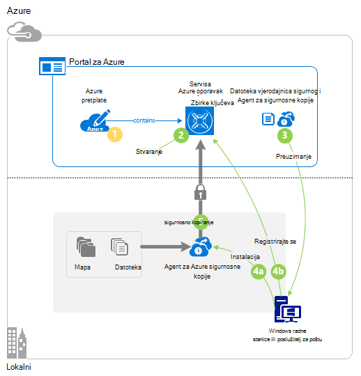

## Korak 1: Dobivanje Azure pretplate

Ako nemate pretplatu na Azure, stvorite [pomoću računa](https://azure.microsoft.com/free/) koji omogućuje pristup bilo koji servis za Azure.

## Korak 2: Stvaranje oporavak servisa sigurnog

Stvaranje sigurnosne kopije datoteka i mapa, potrebnih za stvaranje oporavak servisa sigurnog u regiji mjesto na koje želite spremiti podatke. Morate odrediti način na koji želite replicirati prostora za pohranu.

### Da biste stvorili oporavak servisa sigurnog

1. Ako to još niste učinili, prijavite se na [Portal za Azure](https://portal.azure.com/) korištenja pretplate za Azure.

2. Na izborniku koncentrator kliknite **Pregledaj** i na popisu resursi upišite **Oporavak servise** , a zatim kliknite **sefovi servise za oporavak**.

    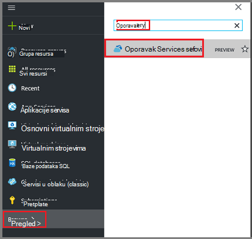  

3. Na izborniku **sefovi oporavak servisi** kliknite **Dodaj**.

    

    Otvorit će se sigurnog plohu oporavak servise koje možete unijeti **naziv**, **pretplatu**, **grupa resursa**i **mjesto**pitanja.

    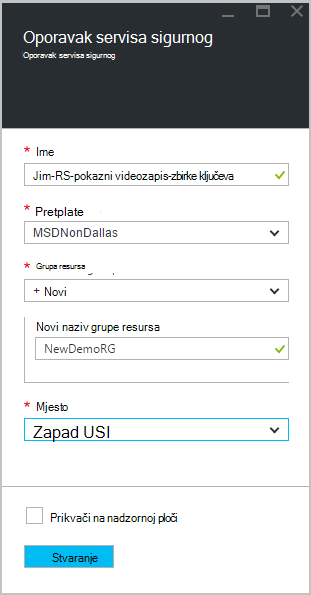

4. U odjeljku **naziv**unesite neslužbeni naziv da biste odredili na zbirke ključeva.

5. Kliknite **pretplatu** da biste vidjeli dostupne popis pretplata.

6. Kliknite **grupu resursa** da biste vidjeli popis dostupnih grupa resursa ili **Novo** da biste stvorili novu grupu resursa.

7. Kliknite **mjesto** da biste odabrali regiji u zbirke ključeva. Taj odabir određuje regiji koju se šalju podataka iz sigurnosne kopije.

8. Kliknite **Stvori**.

    Ako ne vidite svoje sigurnog naveden je dovršen, kliknite **Osvježi**. Kada se osvježavaju na popisu, kliknite naziv u zbirke ključeva.

### Da biste odredili zalihosti prostora za pohranu
Prilikom prvog stvaranja oporavak servisa sigurnog odredite koliko je prostora za pohranu replicirati.

1. Kliknite novi sigurnog da biste otvorili na nadzornoj ploči.

2. U plohu **Postavke** koje se automatski otvara s sigurnog nadzorne ploče, kliknite **Infrastruktura za sigurnosno kopiranje**.

3. U plohu infrastruktura za sigurnosno kopiranje kliknite **Konfiguracije sigurnosnu kopiju** da biste pogledali **Vrsta replikacijom prostora za pohranu**.

    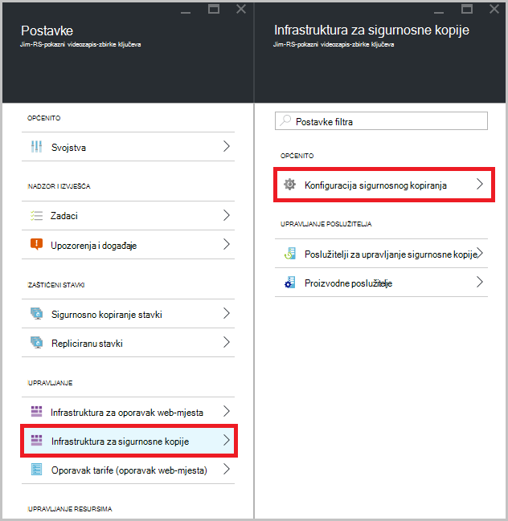

4. Odaberite mogućnost replikacijom odgovarajuće prostora za pohranu za vaše zbirke ključeva.

    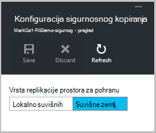

    Prema zadanim postavkama vašeg sigurnog ima zemlj suvišnih prostora za pohranu. Ako koristite Azure kao krajnja točka primarni sigurnosne kopije prostora za pohranu, nastavite koristiti zemlj suvišnih prostora za pohranu. Ako koristite Azure kao krajnja točka-primarni sigurnosne kopije prostora za pohranu, odaberite lokalno suvišne prostor za pohranu, čime će znatno smanjiti trošak pohrana podataka u Azure. Dodatne informacije o [zemlj suvišnih](../storage/storage-redundancy.md#geo-redundant-storage) i [lokalno suvišnih](../storage/storage-redundancy.md#locally-redundant-storage) mogućnosti pohrane u [Pregled](../storage/storage-redundancy.md).

Sad kad ste stvorili u sigurnog, pripremite vaše infrastrukturu za sigurnosno kopiranje datoteka i mapa tako da preuzmete servisa Microsoft Azure oporavak Services agent i sigurnog vjerodajnice.

## Korak 3 – preuzimanje datoteke

1. Kliknite **Postavke** na nadzornoj ploči za oporavak servisa sigurnog.

    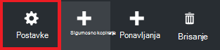

2. Kliknite **Početak > sigurnosne kopije** na plohu postavke.

    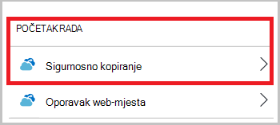

3. Kliknite **sigurnosne kopije cilj** plohu sigurnosnu kopiju.

    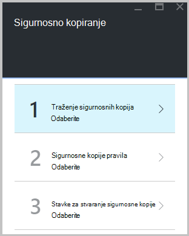

4. Odaberite **Lokalni** iz gdje je svoje radno opterećenje radi? izbornik.

5. Odaberite **datoteke i mape** na što želite sigurnosno kopirati? izbornik, a zatim kliknite **u redu**.

### Preuzimanje agent za oporavak Services

1. Kliknite **Preuzimanje Agent za Windows Server i Windows klijent** plohu **Priprema infrastrukture** .

    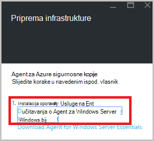

2. Kliknite **Spremi** u skočnom prozoru preuzimanja. Prema zadanim postavkama **MARSagentinstaller.exe** datoteka se sprema u mapi preuzimanja.

### Preuzimanje sigurnog vjerodajnice

1. Kliknite **Preuzimanje > Spremanje** na infrastrukture plohu Priprema.

    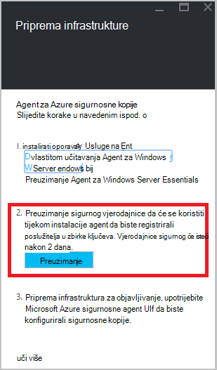

## Korak 4 - instalacija i registracija agenta

>[AZURE.NOTE] Omogućavanje sigurnosne kopije putem portala za Azure uskoro dostupno. Trenutno koristite na agenta servisa za Microsoft Azure oporavak lokalnog sigurnosnu kopiju datoteke i mape.

1. Pronađite i dvokliknite **MARSagentinstaller.exe** iz mape preuzimanja (ili drugih mjesta spremanja).

2. Dovršite Čarobnjak za postavljanje sustava Microsoft Azure oporavak Services Agent. Da biste dovršili Čarobnjak, morate:

    - Odaberite mjesto za instalaciju i mapu predmemorije.
    - Navedite proxy informacije o poslužitelju ako koristite proxy poslužitelj za povezivanje s Internetom.
    - Detalje svoje korisničko ime i lozinku ako koristite čija je autentičnost provjerena proxy poslužitelja.
    - Unesite vjerodajnice preuzete zbirke ključeva
    - Pristupni izraz za šifriranje spremite na sigurnom mjestu.

    >[AZURE.NOTE] Ako izgubite ili zaboravite pristupni izraz, Microsoft ne može pomoći oporavak sigurnosne kopije podataka. Spremite datoteku na sigurnom mjestu. Potrebna je za vraćanje sigurnosne kopije.

Agenta sada je instaliran, a vaše računalo registriran za na sigurnog. Spremni ste za konfiguriranje i planiranje sigurnosnu kopiju.

## Korak 5: Sigurnosno kopiranje datoteka i mapa

Početna sigurnosne kopije sadrži dvije osnovne zadatke:

- Raspored sigurnosnog kopiranja
- Sigurnosno kopiranje datoteka i mapa za prvi put

Da biste dovršili početne sigurnosnog kopiranja, koristite agent servisa Microsoft Azure oporavak Services.

### Da biste zakazali sigurnosnog kopiranja

1. Otvorite agent servisa Microsoft Azure oporavak Services. Možete je pronaći traženjem računalu **Sigurnosna kopija Microsoft Azure**.

    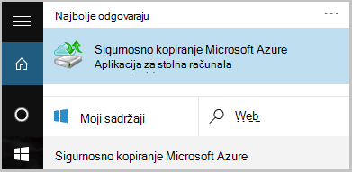

2. Agent za oporavak usluge kliknite **Raspored sigurnosnu kopiju**.

    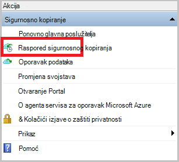

3. Na stranici prvi koraci čarobnjaka za sigurnosno kopiranje raspored, kliknite **Dalje**.

4. Stavke odaberite stranicu sigurnosnog kopiranja, kliknite **Dodaj stavke**.

5. Odaberite datoteke i mape koje želite sigurnosno kopirati, a zatim kliknite **redu**.

6. Kliknite **Dalje**.

7. Na stranici **Određivanje raspored sigurnosnog kopiranja** , navedite **raspored sigurnosnog kopiranja** , a zatim kliknite **Dalje**.

    Možete planirati dnevnu (Najveća brzina tri puta dnevno) ili s predlošcima tjednih sigurnosne kopije.

    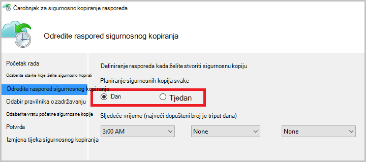

    >[AZURE.NOTE] Dodatne informacije o kako odrediti raspored sigurnosnog kopiranja, potražite u članku [Korištenje Azure sigurnosnu kopiju da biste zamijenili infrastruktura za vrpcu](backup-azure-backup-cloud-as-tape.md).

8. Na stranici **Odabir pravilnika o zadržavanju** odaberite **Pravilnika o zadržavanju** sigurnosne kopije.

    Pravila zadržavanja određuje trajanje za koje će se spremiti sigurnosnu kopiju. Umjesto samo određivanja "paušalni pravila" za sve točke sigurnosne kopije, možete odrediti različite zadržavanja na temelju kada se pojavi sigurnosno kopiranje. Možete izmijeniti dnevnih, tjedno, mjesečno i godišnje zadržavanja prema svojim potrebama.

9. Na stranici odaberite početni sigurnosne kopije Vrsta odaberite vrstu početne sigurnosne kopije. Ostavite mogućnost **automatski putem mreže** odabrali, a zatim kliknite **Dalje**.

    Možete stvoriti sigurnosnu automatski putem mreže ili možete stvoriti sigurnosnu izvanmrežno. Ostatak u ovom se članku opisuje postupak za automatsko sigurnosno kopiranje. Ako biste radije da biste učinili izvanmrežno sigurnosne kopije, pogledajte članak o [izvanmrežne sigurnosne kopije tijek rada koji se Azure sigurnosne kopije](backup-azure-backup-import-export.md) za dodatnim informacijama.

10. Na stranici za potvrdu pregledajte podatke, a zatim kliknite **Završi**.

11. Kad čarobnjak dovrši stvaranje raspored sigurnosnog kopiranja, kliknite **Zatvori**.

### Stvaranje sigurnosne kopije datoteka i mapa za prvi put

1. U agent za oporavak usluge kliknite **Odmah stvori sigurnosne kopije** da biste dovršili početne seeding putem mreže.

    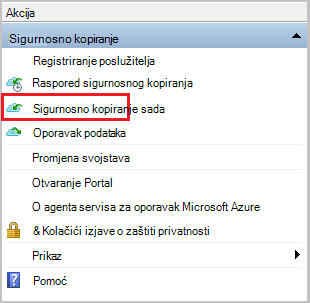

2. Na stranici za potvrdu pregledajte postavke koje ponovno se sada čarobnjak će koristiti sigurnosne kopije na računalu. Kliknite **Sigurnosno kopiranje**.

3. Kliknite **Zatvori** da biste zatvorili čarobnjak. Ako je to učiniti prije nego što završi postupak sigurnosnog kopiranja, čarobnjak nastavlja se izvoditi u pozadini.

Po dovršetku početne sigurnosne kopije na konzoli za sigurnosno kopiranje pojavit će se status **zadatak dovršen** .

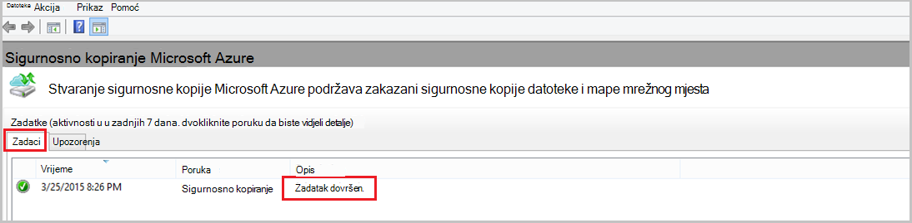

## Pitanja?
Ako imate pitanja ili ako postoji svih značajki koje želite da biste vidjeli sadrži, [Pošaljite nam povratnu informaciju](http://aka.ms/azurebackup_feedback).

## Daljnji koraci
- Pristup dodatnim informacijama o [sigurnosno kopiranje strojevima sa sustavom Windows](backup-configure-vault.md).
- Sad kad ste sigurnosnu kopiju datoteke i mape, možete [upravljati sefovi i poslužitelja](backup-azure-manage-windows-server.md).
- Vraćanje sigurnosne kopije, koristite ovaj članak da biste [vratili datoteke na računalo sustava Windows](backup-azure-restore-windows-server.md).
