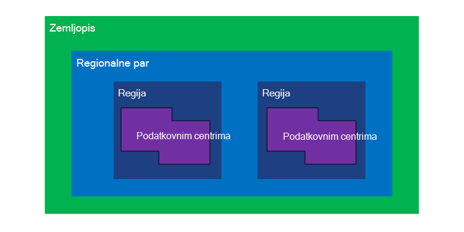
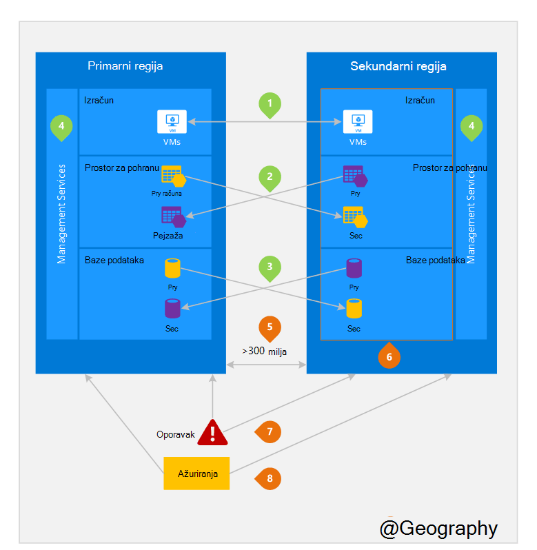

<properties
    pageTitle="Tvrtke continuity i Izrada oporavak (BCDR): Uparena područja Azure | Microsoft Azure"
    description="Azure regionalne parove aplikacije provjerite jesu li prebacuju tijekom neuspjeha centar podataka."
    services="site-recovery"
    documentationCenter=""
    authors="rayne-wiselman"
    manager="jwhit"
    editor=""/>

<tags
    ms.service="site-recovery"
    ms.workload="storage-backup-recovery"
    ms.tgt_pltfrm="na"
    ms.devlang="na"
    ms.topic="article"
    ms.date="08/23/2016"
    ms.author="raynew"/>

# Tvrtke continuity i Izrada oporavak (BCDR): Uparena područja Azure

## Što su Uparena regije?

Azure funkcionira u više geographies diljem svijeta. Azure Zemljopis je određeno područje svijeta koja sadrži barem jedan Azure regija. Azure regija je područje unutar Zemljopis koja sadrži jedan ili više podatkovnim centrima.

Svako područje Azure uparen je s drugog područja unutar iste Zemljopis zajedno upućivanje regionalne par. Iznimka je Jug Brazil koji je u paru s regija izvan njegov Zemljopis.

Slika 1 – Azure regionalne par dijagrama

| Zemljopis     |  Upareni regije  |                     |
| :-------------| :-------------   | :-------------      |
| Sjeverna Amerika | Sjeverna središnje SAD-a | Južna središnje SAD-a    |
| Sjeverna Amerika | Istočni SAD-a          | Zapad SAD-a             |
| Sjeverna Amerika | Istok SAD 2        | Središnja SAD-a          |
| Sjeverna Amerika | Zapad sad 2        | Zapad središnje SAD-a     |
| Europa        | Sjeverna Europa     | Europa Zapad         |
| Azija          | Južna istočnoazijski  | Istočnoazijski           |
| Kina         | Istočni Kina       | Sjeverna Kina         |
| Japan         | Istok Japan       | Japan Zapad          |
| Brazil        | Brazil Jug (1) | Južna središnje SAD-a    |
| Australija     | Istok Australija   | Australija Jugoistok |
| Vlada SAD-a | SAD Gov Iowa      | SAD Gov Virginia     |
| Indija         | Središnje Indija    | Južna Indija         |
| Kanada        | Središnja Kanada   | Istok Kanada         |
| VELIKA BRITANIJA            | Velika Britanija Zapad          | Južna velika Britanija            |

Tablica 1 – mapiranje azure regionalne parove

> (1) Jug Brazil jedinstven je jer uparen je s regija izvan vlastitu Zemljopis. Sekundarni regije Jug Brazil je Jug središnje NAM, ali Jug središnje NAM na sekundarnom regija nije Brazil Jug.

Preporučujemo da replicirati radnih opterećenja preko regionalne parove da im Azure, odvajanja i dostupnost pravila. Ako, na primjer, ažuriranja planiranog Azure sustava uvode se sekvencijalno (ne u isto vrijeme) preko upareni područja. To znači da čak i u rijetko događaj neispravan ažuriranja, obje regije neće utjecati istodobno. Osim toga, vjerojatno događaj općenite prekida, oporavak barem jedan područja iz svaki par je prioritet.

## Primjer upareni regije
2 na slici u nastavku prikazuje hipotetska aplikacije koja koristi regionalne par za oporavak Izrada. Zelena brojeve istaknite aktivnosti regije-tri Azure servisa (izračunati Azure, za pohranu i baze podataka) i način na koji su konfigurirana za replikaciju preko područja. Jedinstveni prednosti implementacija preko upareni područja istaknute su narančaste brojevima.

Slika 2 – Hipotetska Azure regionalnih par

## Aktivnosti objavljivanja u više područja
Kao što je naziva slici 2.

 **Azure izračunati (PaaS)** – morate Dodjela resursa dodatne računalnim unaprijed da biste bili sigurni dostupnih resursa u drugoj regiji tijekom na Izrada. Dodatne informacije potražite u članku [Azure otpornost Tehnički vodič](./resiliency/resiliency-technical-guidance.md).

 **Prostora za pohranu Azure** - zemlj suvišnih prostora za pohranu (GRS) po zadanom je konfiguriran stvaranja računa Azure prostora za pohranu. S GRS, vaši podaci se automatski replicirati triput unutar primarni područja, a zatim triput u paru regija. Dodatne informacije potražite u članku [Mogućnosti zalihosti pohrane za Azure](storage/storage-redundancy.md).

 **Baze podataka SQL Azure** – s Azure SQL standardni zemlj. – replikacije, možete konfigurirati asinkronog replikacije transakcija u paru područje. S replikacijom-Premium zemlj., možete konfigurirati replikacije za sve regije na svijetu No preporučujemo da implementacija tih resursa u paru regiji većini Izrada oporavak scenarija. Dodatne informacije potražite u članku [Zemlj replikacije u bazi podataka SQL Azure](./sql-database/sql-database-geo-replication-overview.md).

 **Upravitelj Azure resursa (ARM)** – ARM čini omogućuje logičke odvajanja komponente za upravljanje preko područja. To znači da logičke pogrešaka u jednom području vjerojatno manje utjecati na drugi.

## Prednosti upareni regije
Kao što je naziva slici 2.  

**fizičke odvajanja** – kada je to moguće, Azure želi barem 300 milja odvojenosti između podatkovnim centrima u regionalnim par, iako to nije praktično ili moguće u svim geographies. Fizička podatkovnog centra odvojenosti smanjuje vjerojatnost prirodnim disasters, građanske unrest, kvarove power ili fizičke mrežne kvarove utjecaja obje regije odjednom. Odvajanja podložni ograničenja unutar Zemljopis (veličina Zemljopis dostupnost power/mrežne infrastrukture, propisa, itd.).  

**pod uvjetom platformu replikacije** - neke servise kao što je zemlj suvišnih prostora za pohranu omogućuje automatsko replikacije upareni područje.

**regija oporavak redoslijed** – slučaju općenite nedostupnosti oporavak određenu regiju je prioritet iz svaki par. Aplikacijama koje su uvedene u paru regije su zajamčeno neka od područja oporaviti s prioritetom. Ako je aplikacija implementiran putem regije koje su Uparena, oporavak možda se može odgoditi – u najgoreg slučaja odabranog područja možda zadnje dvije šifriranjem.

**Sequential ažurira** – planirano Azure sustava ažuriranja su poslednjeg područja upareni sekvencijalno (ne u isto vrijeme) da biste minimizirali nedostupnost, učinak programskih pogrešaka i logički neuspjeha rijetko događaj neispravni ažuriranja.

**residency podataka** – područje nalazi unutar iste Zemljopis njegov paru (osim Jug Brazil) da bi se zadovoljava preduvjete residency podataka svrhe porez i zakon provođenja nadležnosti.

