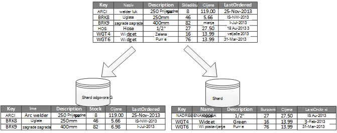
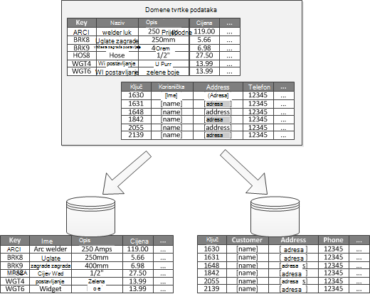
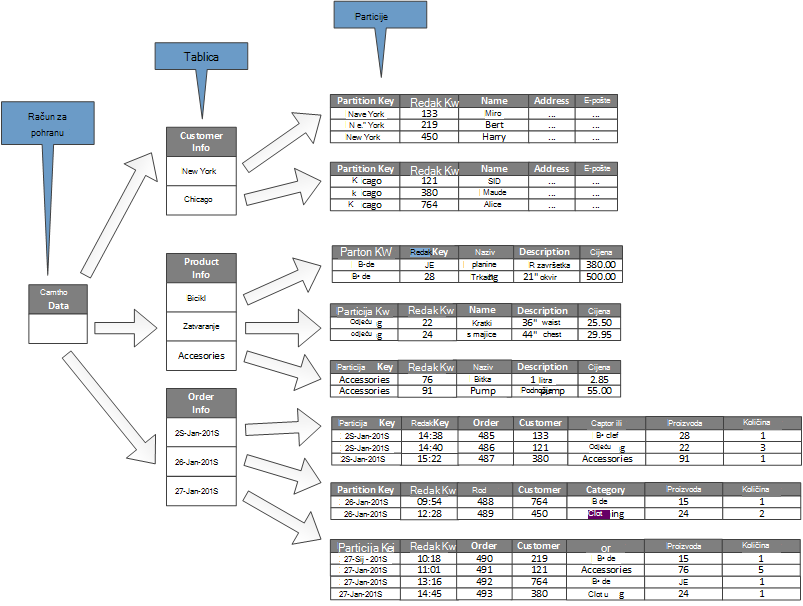

<properties
   pageTitle="Podaci particija smjernice | Microsoft Azure"
   description="Upute za razdvajanje razdjeljivanja za upravljati kao i pristupiti zasebno."
   services=""
   documentationCenter="na"
   authors="dragon119"
   manager="christb"
   editor=""
   tags=""/>

<tags
   ms.service="best-practice"
   ms.devlang="na"
   ms.topic="article"
   ms.tgt_pltfrm="na"
   ms.workload="na"
   ms.date="07/14/2016"
   ms.author="masashin"/>

# Upute za stvaranje particija podataka

[AZURE.INCLUDE [pnp-header](../includes/guidance-pnp-header-include.md)]

## Pregled

U mnogo veliki rješenja, podatke je podijeljen u zasebnom particije koje možete upravljati kao i pristupiti zasebno. Stvaranje particija strategije morate pažljivo odabrali Maksimiziranje prednosti tijekom minimiziranje štetnih. Particija može pridonijeti poboljšanju skalabilnost, smanjite Nadmetanje i optimiziranja performansi. Još jedna prednost particija je koje možete unijeti mehanizam za dijeljenje podataka s uzorkom korištenja. Na primjer, možete arhivirati stariji, manje active (Hladna) podataka u jeftinijim pohrana podataka.

## Zašto particija podataka?

Većina oblaka aplikacija i servisa pohranu i dohvaćanje podataka kao dio njihove operacije. Dizajn podataka u služi za pohranu koji koristi aplikacije mogu sadržavati značajan sa slikom na performanse, propusnost i skalabilnost sustava. Jedan postupak koji se obično primjenjuje u sustavima veliki je podjele podatke u zasebnom particije.

> Odnosi se na postupak fizički podjelom podataka trgovine zasebne podatke u termina _particija_ koja se koristi u ovom upute. Ovo nije isti kao SQL Server tablice particija, koji je drugi pojam.

Particija podataka nude brojne prednosti. Na primjer, mogu se primijeniti kako bi:

- **Poboljšanje skalabilnost**. Kada proširenja jednu bazu podataka sustava naposljetku dosegne ograničenje fizički hardverski. Ako podijelite podataka preko više particija, od kojih svaka se nalazi na istom poslužitelju, koje se gotovo beskonačno skaliranje izvan sustava.
- **Poboljšanje performansi**. Operacija podataka programa access na svakom particija odvija putem manju količinu podataka. Pod uvjetom da se podaci particije na odgovarajući način, particija možete učiniti sustav učinkovitiji. Operacije koje utječu na više particija mogu se izvoditi paralelno. Svaki particija može nalaziti blizu aplikacije koja koristi da biste minimizirali latenciju mreže.
- **Poboljšanje dostupnost**. Razdvajanje podataka na više poslužiteljima izbjegava jednu točku nije uspjelo. Ako na poslužitelju ne uspije, ili prolazi kroz planiranog održavanja, samo podatke iz tog particija nije dostupan. Možete nastaviti operacije na druge particije. Povećanje broja particije smanjuje relativni utjecaj pogreška poslužitelja smanjivanjem postotak podatke koji će biti dostupna. Replikaciju svaki particija možete dodatno smanjili izgledi neuspješne jedan particija utjecaja operacije. Ga i omogućuje razdvajanje ključne podatke koji moraju biti neprestano i Visoko nudi Najniža vrijednost podataka koji sadrži donjem preduvjeti dostupnosti (zapisnika datoteke, na primjer).
- **Poboljšanje sigurnosti**. Ovisno o prirode podaci i kako je particije, možda omogućuje razdvajanje osjetljive i koje nisu osjetljivih podataka u različitim particije i zbog toga u različitim poslužiteljima ili podataka pohranjuje. Sigurnost možete zatim posebno optimiziran za povjerljive podatke.
- **Osiguraj radu fleksibilnost**. Particija nudi mnoštvo mogućnosti za precizno ugađanje operacije, maksimiziranje administratora učinkovitosti i minimiziranje trošak. Na primjer, možete definirati različite Strategije za upravljanje, nadzor, sigurnosnog kopiranja i vraćanja i ostalih administrativnih zadataka na temelju važnost podatke u svakom particija.
- **Podudaranje s podacima pohraniti uzorak korištenja**. Particija omogućuje svaki particija uvesti na neku drugu vrstu spremišta podataka na temelju trošak i ugrađene značajke ponuda spremišta podataka. Na primjer, velike binarne podatke moguće pohraniti u podataka spremišta blobova platforme dok strukturiranih podataka možete rukama u bazi podataka za dokument. Dodatne informacije potražite u članku [Stvaranje polyglot rješenja] u vodiču za uzorke i prakse i [pristupa podacima za vrlo skalabilni rješenja: pomoću SQL, NoSQL i polyglot postojanost] na Microsoftovu web-mjestu.

Neki sustavi implementirati particija jer se smatra trošak umjesto prednost. U ovom rationale od uobičajenih uzroka obuhvaćaju sljedeće:

- Mnoge sustavi za pohranu podataka ne podržavaju spojeva preko particije, a može biti teško da biste zadržali referencijalni integritet u particioniranom sustava. Je često potrebno za implementaciju spojevi i integritet prijavi kod aplikacije (u stvaranje particija layer), što može uzrokovati dodatne/i i složenosti aplikacije.
- Održavanje particije nije uvijek trivial zadatka. U sustavu gdje je promjenjive podataka, možda ćete morati poduzme particije povremeno da biste smanjili Nadmetanje i slikovnim.
- Nekoliko uobičajenih alata neće funkcionirati prirodan particioniranom podataka.

## Dizajniranje particije

Podaci koje se mogu particije na različite načine: vodoravno, okomito ili functionally. Strategije odaberete ovisi o razlog particija podaci i preduvjetima aplikacija i servisa koji će koristiti podatke.

> [AZURE.NOTE] Stvaranje particija sheme opisani u ovom smjernice objašnjeni su na način koji ne ovisi o pozadinsku tehnologiju prostora za pohranu podataka. Mogu se primijeniti na razne vrste podataka trgovine, uključujući relacijske i NoSQL baze podataka.

### Stvaranje particija strategije

Tri standardne Strategije za particija podataka su:

- **Vodoravna particija** (često se nazivaju _sharding_). U ovom strategije svaki particija spremišta podataka u vlastitom desno, ali sve particije zadržali na istu shemu. Svaki particija zove _shard_ i sadrži određeni podskup podataka, kao što je sve narudžbe za određeni skup korisnika u aplikaciji za e-trgovine.
- **Okomiti particija**. U ovom strategije svaki particija sadrži podskup polja za stavke u spremištu podataka. Polja su podijeljene prema svojim uzoraka korištenja. Ako, na primjer, često pristupa polja biti smješten u okomiti particija i manje često pristupa polja u drugu.
- **Functional particija**. U ovom strategije podataka se pridružuje prema kako se koristi tako da svaki bounded kontekst u sustavu. Ako, na primjer, upit e-trgovine sustava primjenjuje odvojite poslovnih funkcija za slanje fakture te upravljanje zaliha proizvoda mogu sadržavati fakture podatke u jedan particija i proizvoda zaliha podataka u drugu.

Važno Imajte na umu tri strategije što je opisano u nastavku možete kombinirati je. Nisu isključivih pa preporučujemo da razmotriti ih sve prilikom dizajniranja aktiviranja sheme. Ako, na primjer, možda podjele podataka u shards, a zatim pomoću okomiti particija da biste dodatno Podjela podatke u svakom shard. Isto tako, podatke u funkcionalni particija može se podijeliti na shards (koji možete također biti okomito particije).

Međutim, različiti preduvjeti za svaki strategije možete podići broj sukobljenih problema. Morate procijeniti i saldo sve te pri dizajniranju shemu stvaranje particija koji ispunjava ciljeve cjelokupan obradu podataka za sustav. U sljedećim se odjeljcima Istražite svaki strategije detaljnije.

### Vodoravna particija (sharding)

Slika 1 prikazuje pregled vodoravni particija ili sharding. U ovom primjeru podatke o zalihama proizvoda je podijeljen u shards na temelju ključ proizvoda. Svaki shard sadrži podatke za raspon susjednih shard ključeva (A G i H + Z), abecedi.

_Slika 1. Vodoravno particija (sharding) podataka na temelju particija ključ_

Sharding pomaže vam podjele opterećenje na više računala koja se smanjuje Nadmetanje i poboljšavaju performanse. Dodavanjem dodatno shards koji se izvode na poslužiteljima dodatne mogu mijenjati veličinu sustava odgovor.

Najvažnije faktor prilikom implementacije ovaj stvaranje particija strategije je odabir sharding ključa. Možda ćete teško Promjena ključa nakon sustav u operaciji. Tipku osigurati da podataka particije tako da se povećavaju paran kao moguće preko na shards.

Imajte na umu da drugi shards mora sadržavati slične količine podataka. Umjesto toga važnijih važna je saldo broj zahtjeva. Neke shards može biti vrlo velike, ali svaka stavka je predmet malim brojem operacije u programu access. Drugi shards može biti manji, ali svaku stavku mnogo češće pristupiti. Također važno je da biste bili sigurni jedan shard premašuju ograničenja mjerilo (prema kapacitetu i obrada resursa) spremišta podataka koji se koristi za hostiranje te shard.

Ako koristite shemu sharding, izbjegavajte stvaranje pristupne točke (ili tipkovni particije) koji mogu utjecati na performanse i dostupnost. Ako, na primjer, ako koristite raspršivanje identifikatora klijenta umjesto prvo slovo naziva klijenta, onemogućite neizravnane raspodjele koja je rezultat uobičajenih i rjeđe početna slova. Ovo je uobičajeni postupak koji olakšava particije više ravnomjerno raspodijelite podataka.

Odaberite sharding ključ koji minimizira sve buduće preduvjeti podijeliti velike shards u manjim dijelova spajanje small shards u većim particije ili promjena sheme kojim opisujete podatke pohranjene u skupu particije. Te operacije može biti vrlo dugo trajati, a možda će biti potrebno izvanmrežno poduzimanja jedan ili više shards dok se izvode.

Ako su replicirati shards, možda će biti moguće zadržati neke replike Internetu dok drugi su Podjela, spojiti ili rekonfigurirati. No u sustavu možda morati ograničiti operacije koje možete izvršiti podatke iz ove shards tijekom na ponovno konfiguriranje. Ako, na primjer, podatke u na replike može biti označen kao samo za čitanje da biste ograničili opseg inconsistences do kojih može doći dok se ne restrukturiran shards.

> Detaljnije informacije i smjernice o mnoge te pitanja vezana uz i tehnika kojima se preporučuje za dizajniranje služi za pohranu podataka koji implementira vodoravni particija potražite u članku [Sharding uzorka].

### Okomiti particija

Najčešće se koristi za okomite particija je da biste smanjili u/i i performanse troškove Dohvaćanje stavke koje se najčešće pristupa. Slika 2 prikazuje primjer okomiti particija. U ovom primjeru različita svojstva za svaku stavku podataka drže u različite particije. Jedna particija sadrži podatke koji pristupa češće, uključujući naziv, opis i podatke o cijenama za proizvode. Drugi sadrži glasnoće u zalihama i najkasniji datum do uređeni.

_Slika 2. Okomito particija podataka po uzorak korištenja_

U ovom primjeru aplikacije redovito upiti naziv proizvoda, opis i cijena prilikom prikaza detalje o proizvodu klijentima. Burzovni razinu i datum kada je proizvod zadnje narudžbe od proizvođača drže se u zasebnom particija jer te dvije stavke koje se često koriste zajedno.

Ova shema particioniranja je dodana prednost kojima su relativno usporiti-premještanje podataka (naziv proizvoda, opis i cijena) odvojeni od dinamičnije podataka (razine zalihe i zadnji datum uređeni). Aplikacija ponekad je korisno podataka u predmemoriju usporiti premještanja u memoriji ako često pristupiti.

Drugi uobičajeni scenarij za ovaj stvaranje particija strategije je Maksimiziranje sigurnost povjerljive podatke. Na primjer, to možete učiniti spremanjem brojeve kreditnih kartica i odgovarajuće brojeve potvrdu karticu sigurnost u zasebnom particije.

Okomiti particija možete smanjiti količinu Istodobni access koje je potrebno za podatke.

> Okomiti particija pristajete na razini entitet unutar izvor podataka, djelomično normalizacija entitet prekinuti iz _široke_ stavke da biste postavili _suzili_ stavki. To je najbolje odgovara trgovine orijentirana podataka kao što su HBase i Cassandra. Ako su podaci u zbirci stupaca vjerojatno da biste promijenili, možete preporučujemo korištenje stupac pohranjuju u sustavu SQL Server.

### Funkcionalno particija

Za sustave kojima je moguće da biste odredili bounded kontekst za svako područje distinct tvrtke ili servisa u aplikaciji funkcionalni particija nudi tehnika za unaprjeđenje odvajanja i podataka iz programa access. Drugi uobičajeni funkcionalni particija je za razdvajanje čitanja i pisanja podatke iz samo za čitanje podataka koji se koristi za izvješćivanja. Slika 3 prikazuje pregled funkcionalni particija gdje se podatke o zalihama odvojeni od korisničkih podataka.

_Slika 3. Functionally particija podataka prema bounded kontekst ili poddomene_

U ovom stvaranje particija strategije smanjiti Nadmetanje podataka programa access preko različite dijelove sustava.

## Dizajniranje particije za skalabilnost

Je ključan razmislite o veličini i radno opterećenje svaki particije i saldo tako da se podaci su raspoređeni da biste postigli Maksimalna skalabilnost. Međutim, i morate particija podatke tako da se premašuju skaliranja ograničenja spremišta jedan particije.

Prilikom dizajniranja particije za skalabilnost, slijedite ove korake:

1. Analiza aplikacije da biste shvatili pristup uzorci podataka, kao što su veličina skup rezultata koji je vratio svaki upit, obrada zahtjeva za izračun učestalost programa access, postojećih Latencija i na strani poslužitelja. U mnogim slučajevima nekoliko glavne cjeline će potražnje Većina obrada resursa.
2. Koristite ovu analizu za određivanje ciljeve trenutne i buduće skalabilnost, kao što su veličina podataka i radno opterećenje. Zatim da podatke raspodijelite particije da bi odgovarao skalabilnost cilj. U vodoravni stvaranje particija Strategije odabirom odgovarajuće shard ključ važno je da biste bili sigurni raspodjele paran. Dodatne informacije potražite u članku [Sharding uzorka].
3. Provjerite jesu li dostupni za svaki particija resursi dovoljno rukovati zahtjevima skalabilnost veličina podataka i propusnost li. Ako, na primjer, čvor u kojem se nalazi particija može postaviti teško ograničenja količinu prostora za pohranu, obradu power ili propusnost mreže koje pruža. Ako potrebama za pohranu i obrada podataka vjerojatno će biti dulji od ta ograničenja, možda će biti potrebno suzite strategije stvaranje particija ili podjela podataka Dodatno. Na primjer, jedan skalabilnost pristup možda biti odvojite zapisivanje podataka od osnovne funkcije aplikacije. To se pomoću trgovine zasebne podatke da biste spriječili preduvjeti za pohranu Ukupno prekoračenju skaliranja ograničenje od čvor. Ako ukupan broj služi za pohranu podataka premašuje ograničenje čvor, možda je potrebno koristiti čvorove zasebnom prostora za pohranu.
4. Praćenje sustav u odjeljku korištenje da biste provjerili podatke distribuira prema očekivanjima i particije možete rukovati opterećenje što je to slučaj na njima. Moguće je korištenje odgovaraju upotrebe koja je očekivanu po analizu. U tom slučaju možda je moguće poduzme particije. Failing, možda će biti potrebno promijeniti dizajn neki dijelovi sustava da bi se dobio potrebna saldo.

Imajte na umu da nekim okruženjima oblaka dodjelu resursa pomoću infrastrukture ograničenja. Provjerite je li ograničenja na odabrani granicu pružaju je dovoljno prostora za sve predviđenu growth u količinu podataka, pohranjivanje podataka, obrada power i propusnosti.

Ako, na primjer, ako koristite spremište tablica platforme Azure, zauzet shard, morat dodatni resursi od dostupnih za jedna particija za rukovanje zahtjevima. (Nema ograničenje količinu zahtjevi za koje se jedna particija riješiti u određenom vremenskom razdoblju. Posjetite stranicu [Azure prostora za pohranu skalabilnost i performanse ciljnih web-mjesta] na web-mjestu Microsoft više pojedinosti.)

 Ako je to slučaj, na shard bi dobro da se repartitioned možete proširiti opterećenje. Ako ukupnu veličinu ili propusnost u ovim su tablicama premašuje kapacitet pohrane računa, možda će biti potrebno stvoriti dodatan prostor za pohranu računa i širenje tablice preko tih računa. Ako broj računa za pohranu premašuje broj računa koji su dostupni za pretplatu, zatim možda potrebno koristiti višestruke pretplate.

## Dizajniranje particije za performanse upita

Performanse upita često se boosted pomoću manje skupova podataka i tako da pokrenete paralelno upita. Svaki particija mora sadržavati mali dio cijeli skup podataka. Smanjenje glasnoću možete poboljšati performanse upita. Međutim, particija nije alternative za dizajniranje i prikladno Konfiguriranje baze podataka. Na primjer, provjerite je li imate potrebne indeksa na mjestu ako koristite relacijske baze podataka.

Prilikom dizajniranja particije za performanse upita, slijedite ove korake:

1. Pregledajte preduvjeti za aplikaciju i performanse:
    - Određivanje ključnih upite koji se moraju uvijek brzo izvršiti pomoću preduvjeti za tvrtke.
    - Praćenje sustava za prepoznavanje eventualne upite koji sporo.
    - Uspostavljanje koje upite najčešće izvršavaju. Instancu svaki upit može imati najmanje trošak, ali kumulativne potrošnje resursa može biti vrlo. Možda je odvojiti podatke dohvaćene te upiti u distinct particije ili čak i predmemoriju.
2. Particija podataka koji je uzrok slabe performanse:
    - Ograničiti veličinu svakog particije tako da se reakcija upita nalazi unutar cilj.
    - Dizajnirati tipku shard tako da se aplikacija lakše pronašli particije ako su implementacijom vodoravni particija. To sprječava upit potrebe za pregledavanje svaki particije.
    - Razmislite o mjestu particije. Ako je to moguće, pokušajte zadržati podatke u particije koji su geografski blizu aplikacija i korisnika koje joj pristupiti.
3. Ako je entitet propusnost i upit preduvjeti performanse, koristite funkcionalni particija koji se temelji na taj entitet. Ako to još uvijek ne zadovoljava preduvjete, primijenite kao i vodoravno particija. U većini slučajeva će suffice jedan stvaranje particija strategije, no u nekim slučajevima je učinkovitije kombinirati obje strategije.
4. Razmislite o korištenju asinkronog upite koji se izvode paralelno preko particije radi poboljšanja performansi.

## Dizajniranje particije dostupnost

Particija podataka možete poboljšati dostupnosti aplikacija zajamčiti cijeli skup podataka čine jednu točku nije uspjelo i da pojedinačne podskupove skupu podataka može upravljati pojedinačno. Replikaciju particije koje sadrže ključne podatke možete poboljšati i dostupnost.

Prilikom dizajniranja i implementaciju particije, razmotrite sljedeće čimbenike koji utječu na dostupnost:

- **Kako ključnih podaci tvrtke operacijama**. Neki podaci mogu sadržavati ključnih poslovnih informacija kao što su Detalji o fakturi ili bankovne transakcije. Ostali podaci mogu sadržavati manje od ključne važnosti radu podatke, kao što su datoteke zapisnika, kašnjenja performanse i tako dalje. Nakon prepoznavanje svaku vrstu podataka, imajte na umu:
    - Pohrana ključne podatke u iznimno dostupna particije s tarifom odgovarajuće sigurnosne kopije.
    - Uspostavljanje zasebnom upravljanje i nadzor mehanizme ili postupke za različite criticalities od svaki skup podataka. Postavite podataka koja ima istu razinu kritičnosti u istom particije tako da ga mogu se sigurnosno zajedno na odgovarajuće učestalost. Na primjer, particije koje sadrže podatke za bankovni transakcije možda morati sigurnosne kopije češće od particije koje držite zapisivanje ili Prati informacije.
- **Kako se upravlja pojedinačne particije**. Dizajniranje razdjeljivanja za podršku neovisno upravljanje i održavanje nudi nekoliko prednosti. Ako, na primjer:
    - Ako particije ne uspije, je može obnoviti neovisno bez utjecaja na instance aplikacija za pristup podacima u drugim particije.
    - Particija podataka prema zemljopisnom području omogućuje održavanje zadatke sati slabog opterećenja Budući za svaku lokaciju. Provjerite je li particije nisu prevelika da biste spriječili da sve planiranog održavanja dovršetak tijekom tog razdoblja.
- **Želite li za replikaciju ključnih podataka preko particije**. U ovom strategije možete poboljšati dostupnosti i performanse, premda ga može uzrokovati probleme dosljednost. Vrijeme promjene podataka u particije sinkronizirati s svaki replike potrebno. Tijekom tog razdoblja različite particije će sadrže vrijednosti različitih vrsta.

## Objašnjenje kako particija utječe dizajna i razvoj

Korištenje particija dodaje složenosti dizajna i razvoj sustava. Razmislite o particija u sklopu temeljne sustava dizajn čak i ako sustav prethodno sadrži samo jedna particija. Ako je adresa particija kao podsvjesna, kada se pokrene sustav da biste se performanse i skalabilnost problema, složenosti povećava jer ste je već uživo sustava da biste zadržali.

Ako ažurirate sustava ugraditi particija u ovom okruženju je potrebno izmjena logičku podataka programa access. To može obuhvaćati migracije velike količine postojeće podatke raspodijelite ga particije, često dok korisnici očekuju da će moći nastaviti koristiti sustav.

U nekim slučajevima particija se ne smatra važan jer početne dataset mala, a mogu se jednostavno obrađuje pojedinačni poslužitelj. To može biti zadovoljen u sustavu se očekuje da biste skalirali izvan početne veličine, ali mnogim komercijalne sustavima potrebno da biste proširili kao broj povećava korisnika. U ovom proširenja obično je praćeni growth u količinu podataka.

Također važno je da biste shvatili da particija nije uvijek funkciju velike podataka trgovine. Ako, na primjer, spremišta small podataka možda intenzivnog pristupati stotine Istodobni klijente. Particija podatke u tom slučaju može pomoći smanjiti Nadmetanje i poboljšati propusnost.

Prilikom dizajniranja podataka aktiviranja sheme Imajte na umu sljedeće:

- **Gdje je to moguće, zadržavati podaci za najčešćih postupaka baze podataka u svakom particija da biste minimizirali operacije više particija podataka programa access**. Slanje upita preko particije može potrajati više od upita samo unutar jedna particija, ali optimiziranje particije za jedan skup upiti mogu negativno utjecati na druge skupove upita. Kada ne možete izbjeći ispitivanje preko particije, smanjite vrijeme upita radi paralelno upita i zbrajanje rezultate u aplikaciji. Taj se način možda neće biti moguće u nekim slučajevima, kao što su kada je potrebno da biste dobili rezultat iz jednog upita i koristiti u sljedeći upit.
- **Ako upita preporučujemo korištenje relativno statičnog referentnih podataka, kao što su poštanski tablice ili popise proizvoda, razmislite o replikaciju podatke u sve particije da biste smanjili obavezu operacije zasebnom pretraživanja u različite particije**. Taj se način možete smanjiti vjerojatnost referentnih podataka postaje "tipkovni" skup podataka koji je dio povećanim prometom iz preko cijelog sustava. No postoji dodatni trošak povezan s sinkroniziranje sve promjene koje se mogu pojaviti u ovim podacima referencu.
- **Gdje je to moguće, minimiziranje preduvjeti za referencijalnog integriteta preko okomite i funkcionalne particije**. U te sheme same aplikacije je odgovoran za održavanje referencijalnog integriteta preko particije kada se ažuriraju i Potrošena podataka. Upiti koji morate uključiti podataka preko više particija pokrenuti sporije od upita koji uključivanje podataka samo unutar iste particije jer aplikacija obično mora poduzeti uzastopnih upite koji se temelji na tipke, a zatim na vanjski ključ. Umjesto toga, razmislite o replikaciju ili deaktivirali normalizacija relevantne podatke. Da biste minimizirali vrijeme upita gdje je potrebno više particija spojevi, pokrenite paralelno upita putem particije i spajanje podataka u aplikaciji.
- **Razmislite o željeni efekt shema particioniranja možda imaju na dosljednost podataka preko particije.** Procjenjuje treba li zapravo preduvjet je istaknuti dosljednost. Umjesto toga zajednički pristup u oblaku je implementirati usmjerenog dosljednost. Podatke u svakom particija ažurirati zasebno i logike aplikacije osigurava da ažuriranja su sve uspješno dovršena. Bavi i nedosljednosti koje se mogu pojaviti iz slanje upita za podatke dok se izvodi naposljetku dosljedan operacija. Dodatne informacije o implementacijom usmjerenog dosljednost potražite u članku [primer dosljednost podataka].
- **Razmislite o kako upita pronađite točan particije**. Ako upita mora skenirati sve particije da biste pronašli potrebnih podataka, postoji značajan utjecaj na performanse, čak i ako koristite više paralelnih upita. Upiti koji se koriste s okomitim i funkcionalne stvaranje particija strategije prirodan možete odrediti particije. Međutim, vodoravno particija (sharding) olakšavaju pronalaženje stavke teško jer svaki shard na istu shemu. Uobičajeni rješenje sharding je da bi se zadržao kartu koju možete koristiti da biste potražili shard mjesto za određene stavke podataka. Tu mapu možete implementirati logike sharding aplikacije ili održava spremišta podataka ako to podržava prozirnim sharding.
- **Prilikom korištenja vodoravni stvaranje particija strategije preporučuje se povremeno rebalancing na shards**. Omogućuje razmještavanje podatke prema veličini i radno opterećenje minimiziranje pristupne točke, maksimiziranje performanse upita i riješiti ograničenja fizičke prostora za pohranu. Međutim, to je složeni zadatak koji često zahtijeva korištenje prilagođenog alata ili postupak.
- **Ako je replicirati svaki particija pruža dodatne zaštitu od nije uspjelo**. Jedan replike ne uspije, možete upućivati upita pri radu kopiju.
- **Ako ne dođete do fizičke ograničenja stvaranje particija strategije, možda ćete morati proširiti skalabilnost razinu**. Ako, na primjer, ako particija na razini baze podataka, možda morate pronađite ili replicirati particije u više baza podataka. Ako particija je već na razini baze podataka, a fizičke ograničenja su problem, možda to znači da morate pronađite ili replicirati particije u više hostinga računa.
- **Izbjegavanje transakcije koji pristupa podacima u više particija**. Neki podaci trgovine implementacija transakcijskih dosljednost i integritet za operacije koje mijenjati podatke, ali samo ako se nalaze podaci u jedna particija. Ako vam je potrebna podrška za transakcijskih preko više particija, vjerojatno morat ćete provesti to kao dio logiku aplikacije jer najčešće stvaranje particija sustavi ne podržavaju nativni.

Sve trgovine podataka potreban je neke radu upravljanje i praćenje aktivnosti. Zadaci koje možete u rasponu od učitavanja podataka, sigurnosno kopiranje i vraćanje podataka, reorganiziranje podataka i osiguravanje sustav izvršava pravilno i učinkovito.

Imajte na umu sljedeće čimbenici koji utječu na radu upravljanja:

- **Kako implementirati odgovarajuće upravljačkih i operativnih zadataka kada je particije podatke**. Zadaci se mogu sadržavati sigurnosno kopiranje i vraćanje, arhiviranje podataka, nadzor sustava i druge administrativne zadatke. Ako, na primjer, održava logičke dosljednost tijekom postupaka sigurnosnog kopiranja i vraćanja može biti na pitanje.
- **Učitavanje podataka u više particija i dodavanje novih podataka koji je stiže iz drugih izvora**. Neki alati i uslužni programi možda ne podržavaju operacija sharded podataka kao što su učitavanja podataka u odgovarajuće particije. To znači da možda ćete morati stvoriti ili nabavite novih alata i uslužnih.
- **Kako arhivirati i brisanje podataka redovito**. Da biste spriječili viškom rast razdjeljivanja, morate arhiviranje i brisanje podataka redovito (možda mjesečno). Možda je potrebno za pretvaranje podataka tako da odgovara shemu arhiviranja.
- **Upute za pronalaženje problema s integritetom podataka**. Preporučujemo da povremeno procesa da biste pronašli sve problema s integritetom podataka kao što su podaci u particija koji referencira podataka koji nedostaju u drugu. Postupak možete bilo pokušaj automatski riješiti te probleme ili Potenciranje upozorenje operator ručno riješiti probleme. Ako, na primjer, u aplikaciji za e-trgovine, informacije o narudžbi možda sadrži particija ali stavki koje čine svakom nalogu možda rukama u drugoj. Postupak narudžba mora dodati druge particije. Ako taj postupak ne uspije, postoje stavke pohranjene za koji postoji bez odgovarajućih redoslijed.

Druge podatke za pohranu tehnologija obično sadrže vlastite značajke za podršku particija. U sljedećim se odjeljcima sažetak mogućnosti koje se primjenjuju spremišta podataka najčešće koriste Azure aplikacije. Koje opisuju i zahtjevi za dizajniranje aplikacije koje možete najbolje iskoristiti prednost te značajke.

## Stvaranje particija strategije baze podataka SQL Azure

Baze podataka SQL Azure je relacijske baze podataka – kao-na-servis koji se izvodi u oblak. Temelji se na Microsoft SQL Server. Relacijske baze podataka dijeli podatke u tablice, a svakoj tablici sadrži informacije o entiteti kao niz redaka. Svaki redak sadrži stupce koji sadrže podatke za pojedinačna polja entitet. Na stranici [što je baza podataka SQL Azure?] na Microsoft web-mjesto sadrži detaljne dokumentaciju o stvaranju i korištenju baze podataka SQL.

## Vodoravna particija s Elastic baze podataka

SQL baze podataka jedan je ograničenje količinu podataka koji se može sadržavati. Propusnost je ograničeno arhitektonski čimbenika i broj Istodobni veze koje podržava. Značajka Elastic baze podataka SQL baze podataka podržava vodoravno skaliranje SQL baze podataka. Pomoću Elastic baze podataka, možete particija podataka u shards koje se šire preko više baze podataka SQL. Također možete dodati ili ukloniti shards količinu podataka koje su vam potrebne za rukovanje rastom i smanjuje. Pomoću Elastic baze podataka mogu pomoći smanjiti Nadmetanje distribucija opterećenje preko baze podataka.

> [AZURE.NOTE] Elastic je baza podataka zamjenu za značajku Federations baze podataka SQL Azure. Postojeći vanjski pristup bazi podataka SQL instalacijama možete migrirati Elastic baze podataka pomoću uslužni Federations migracije. Umjesto toga možete implementirati vlastiti mehanizam sharding ako scenariju ne posuđivati sam prirodan značajke koje nudi Elastic baze podataka.

Svaki shard je implementirana kao SQL baze podataka. Na shard mogu sadržavati više od jednog skupa podataka (naziva se _shardlet_). Svaku bazu podataka zadržava metapodataka koji opisuje shardlets koje sadrži. Na shardlet može biti jedan podatkovni stavke ili može biti grupa stavki koje imaju isti shardlet ključa. Ako, na primjer, ako su podaci sharding u složene aplikacije, ključ shardlet može biti ID klijenta, a sve podatke za zadani klijent možete rukama kao dio iste shardlet. Podatke za drugi samoposlužni bi rukama u različitim shardlets.

Preporučuje se u programerskom odgovornost za skup podataka pridruživanje shardlet ključ. Zasebnu bazu podataka sustava SQL ponaša se kao globalni shard Upravitelj karta. Ova baza podataka sadrži popis svih shards i shardlets u sustavu. Klijentska aplikacija koja pristupa podacima povezuje najprije globalni shard karte Upravitelj baze podataka da biste dobili kopiju karti shard (popisom shards i shardlets), koji se zatim predmemorira lokalno.

Zatim aplikacija koristi ti podaci prikazivali zahtjevi za usmjeravanje na odgovarajuće shard. Ta je funkcija je skriven iza niz API-ji koje se nalaze u Azure SQL baza podataka Elastic baze podataka klijent biblioteku, koji je dostupan kao paket NuGet. Stranica [Pregled značajki Elastic baze podataka] na web-mjestu Microsoft pruža detaljnije Uvod u Elastic baze podataka.

> [AZURE.NOTE] Možete replicirati globalni shard karte Upravitelj baze podataka da biste smanjili Latencija i poboljšati dostupnost. Ako implementirate baze podataka pomoću neke od Premium razine za cijene, možete konfigurirati aktivni zemlj. – replikacije neprestano kopiranje podataka na baze podataka u različitim područjima. Stvorite kopiju baze podataka u svakom području u kojem se temelje korisnika. Zatim konfigurirali aplikaciju možete povezati ovu kopiju da biste dobili shard karte.

> Zamjenski pristup jest korištenje sinkronizacije podataka za SQL Azure ili na tvorničke podataka Azure kanalima za replikaciju baze podataka upravitelja karte shard preko područja. Ovaj obrazac ponavljanja povremeno pokreće, a je prikladniji ako karti shard diskovni promjene. Uz to, Upravitelj baze podataka shard karte nema će biti stvoren pomoću Premium cijene sloju.

Elastic baze podataka omogućuje dvije sheme za mapiranje podataka shardlets i pohranite u shards:

- Na **popisu shard karte** opisuju pridruživanja između jedne tipke i na shardlet. Na primjer, u sustavu za složene podatke za svaki klijent možete biti povezan s jedinstvenim ključem i spremljene u vlastitom shardlet. Da bi izjave o zaštiti privatnosti i odvajanja (to jest, da biste spriječili curenja resursa za pohranu za podataka drugima jednog klijenta), svaki shardlet možete rukama unutar vlastitu shard.

_Slika 4. Koristite mapu shard popis da biste pohranili podatke klijenta u zasebnom shards_

- **Raspon shard karte** opisuju pridruživanja između skup vrijednosti neprekinute ključa i na shardlet. U primjeru složene opisan alternative implementacijom namjenski shardlets na prethodno, podatke možete grupirati podatke za skup klijenata (svaka ima svoje ključa) unutar iste shardlet. Ovu shemu je manji od prvog (jer klijenata za omogućivanje zajedničkog korištenja resursa za pohranu podataka), ali i stvara rizika smanjene podataka o zaštiti privatnosti i odvajanja.

_Slika 5. Koristite mapu shard raspon radi pohrane podataka za raspon klijenata u na shard_

Imajte na umu da jedan shard mogu sadržavati podatke za nekoliko shardlets. Ako, na primjer, možete koristiti popis shardlets radi pohrane podataka za različite nesusjednih klijenata u istoj shard. Možete i kombinirati raspona shardlets i shardlets popisa u istoj shard Premda će se spomenuti putem različitih karte u bazi podataka manager karte globalni shard. (Baza podataka upravitelja karte globalni shard može sadržavati više mapa shard.) Slika 6 prikazuje takvog.

_6 slici. Implementacijom više shard karte_

Stvaranje particija shemu implementirate može imati značajan sa slikom na performanse sustava. To se može utjecati i brzina kojom shards morati dodati ili ukloniti ili Brzina kojom podataka mora repartitioned preko shards. Kada koristite Elastic baze podataka s podacima particija Imajte na umu sljedeće:

- Grupiranje podataka koji se zajednički koristi u istom shard i izbjegavajte operacije koje moraju imati pristup podacima koji sadrži više shards. Imajte na umu da s Elastic baze podataka u shard SQL baze podataka u vlastitom desno, a baze podataka SQL Azure ne podržava spojeva izdvojiti bazu podataka (koji se izvode na klijentskoj strani). Imajte na umu i da u bazi podataka SQL Azure, ograničenja referencijalnog integriteta, okidača i pohranjene procedure u jednoj bazi podataka ne možete se referencirati objekata u drugu. Zbog toga ne dizajna u sustavu koji ima ovisnosti između shards. SQL baze podataka može, međutim, sadržavati tablica koji sadrže kopije referentnih podataka koji se često koriste upite i ostale operacije. U ovim su tablicama nemaju pripadati neki određeni shardlet. Replikaciju ove podatke preko shards može pridonijeti uklanjanje potrebe za uključivanje podataka koji se proteže baze podataka. Najbolje tih podataka mora biti statički ili usporiti-premještanje da biste minimizirali trud replikacije i smanjili vjerojatnost ona postaje zastarjele.

    > [AZURE.NOTE] Iako SQL baze podataka ne podržava spojeva izdvojiti bazu podataka, možete izvršiti unakrsno shard upiti s Elastic API baze podataka. Te upite možete proziran iteracija kroz sadrži shardlets koje se pozivaju na kartu shard podatke. Na Elastic baze podataka API prijelome unakrsno-shard upiti prema dolje u niz pojedinačne upiti (jedan za svaki baze podataka), a spajanja rezultate. Dodatne informacije potražite u članku stranice [Ispitivanje više shard] na Microsoftovu web-mjestu.

- Podatke pohranjene u shardlets koji pripadaju isti map shard moraju imati istu shemu. Ako, na primjer, ne stvorite kartu shard popis koji pokazuje neke shardlets koji sadrži podatke o klijentu i druge shardlets koji sadrži informacije o proizvodu. Ovo pravilo nije postavio Elastic bazu podataka, ali upravljanje podacima i postavljanje upita postati vrlo složenim svaki shardlet sadrži drugu shemu. U primjeru samo citiranih pravi je rješenje da biste stvorili dvije karte shard popisa: onaj koji referencira klijentu podataka, a drugi koja upućuje na informacije o proizvodu. Imajte na umu podataka pripadaju različitim shardlets može se spremiti u istoj shard.

    > [AZURE.NOTE] Funkcionalnost unakrsno shard upita Elastic API baze podataka ovisi o svakom shardlet na karti shard koji sadrže istu shemu.

- Transakcijskih operacije podržani su samo za podatke koji se održava unutar iste shard, a ne putem shards. Transakcije mogu obuhvaćati shardlets dok god se nalazili dio iste shard. Stoga ako poslovne logike mora poduzeti transakcije, spremiti problematične podatke u istom shard ili implementirati usmjerenog dosljednost. Dodatne informacije potražite u članku [primer dosljednost podataka].
- Postavite shards blizu korisnika kojima se pristupa podacima u tim shards (drugim riječima, zemlj. – Pronađite u shards). U ovom strategije tako smanjili količinu Latencija.
- Izbjegnete različite iznimno aktivno (pristupne točke) i relativno Neaktivni shards. Pokušajte podjele opterećenje ravnomjerno preko shards. To može zahtijevati raspršivanje tipki shardlet.
- Ako ste zemlj pronalaženje shards, provjerite je li da tipke hashed mapiranje shardlets sadrži shards pohranjene blizu korisnika koje pristup tih podataka.
- Trenutno samo ograničeni skup podataka SQL vrste podržane su kao shardlet tipke; _Int, bigint, varbinary,_ a _Jedinstveni identifikator koji_. SQL vrste _int_ i _bigint_ odgovaraju vrstama podataka _int_ i _dugo_ u C# i imati isti raspona. SQL vrsta _varbinary_ se može riješiti pomoću _bajt_ polja u C#, a vrsta _uniqueidentier_ SQL odgovara _Guid_ klase u .NET Framework.

Kao što je naziv podrazumijeva, Elastic baze podataka omogućuje za sustav za dodavanje i uklanjanje shards količinu podataka smanjuje i poveća. API-ji u biblioteci klijent Azure SQL baza podataka Elastic baze podataka Omogućivanje aplikacije za stvaranje i brisanje shards dinamički (i proziran ažuriranje nadređenu mapu shard). Uklanjanje programa shard je Razorni postupak koji zahtijeva brisanje svih podataka u toj shard.

Ako je potrebno aplikaciju podijelite s shard u dva zasebna shards ili kombinirati shards, Elastic baze podataka nudi zaseban Podijeli cirkularnog pisma. Taj servis pokreće se u servis za oblak hostira (koji moraju se stvoriti tako da programer) i prenosi podatke sigurno između shards. Dodatne informacije potražite u temi [Skaliranje pomoću alata za podjelu cirkularnog pisma Elastic baze podataka] na Microsoftovu web-mjestu.

## Stvaranje particija Strategije za pohranu za Azure

Azure prostora za pohranu pruža tri abstractions za upravljanje podacima:

- Spremište tablica koji implementira skalabilni strukturu prostora za pohranu. Tablica sadrži skup entiteti, od kojih svaki može sadržavati skup vrijednosti i svojstva.
- Spremište blobova platforme koji daje prostora za pohranu za velike objekte i datoteke.
- Prostor za pohranu redova, koji podržava pouzdanog asinkronog razmjene poruka između aplikacija.

Spremište tablica i blobova su zapravo ključa vrijednosti one koji su optimizirani za odnosno držite strukturirane i nestrukturirane podatke. Prostor za pohranu redova nude mehanizam za stvaranje slobodnije povezano, skalabilni aplikacija. Spremište tablica, blobova i pohranu redova stvaraju se u kontekstu račun za Azure prostora za pohranu. Računi za pohranu podržava tri oblika zalihosti:

- **Lokalno suvišnih prostora za pohranu**, koji se održava tri kopije podataka u jednom podatkovnog centra. U ovom obrascu zalihosti štiti protiv kvara hardvera, ali ne na Izrada koji obuhvaća cijeli podatkovnog centra.
- **Zone-suvišnih prostora za pohranu**, koji se održava tri kopije podataka koje se šire preko različitih podatkovnim centrima unutar iste područja (ili preko dva područja geografski Zatvori). U ovom obrascu zalihosti štiti od disasters koji se pojavljuju u jednom podatkovnog centra, ali nije moguće zaštititi od veliki mreže prekida vezu koja utječu na cijelo područje. Imajte na umu da zone suvišnih prostora za pohranu trenutno dostupna je samo trenutno za blokiranje blob-ova.
- **Zemlj suvišnih prostora za pohranu**, koji se održava šest kopije podataka: tri kopije u jednom području (lokalni regija) i druge tri kopije u udaljene regiji. U ovom obrascu zalihosti nudi najvišu razinu zaštite Izrada.

Microsoft je objavljen skalabilnost ciljnih web-mjesta za pohranu Azure. Dodatne informacije potražite u članku stranice [za pohranu Azure skalabilnost i performanse ciljnih web-mjesta] na Microsoftovu web-mjestu. Trenutno ukupni kapaciteta račun ne može prelaziti 500 TB. (Obuhvaćaju veličina podataka koje je riječ o javnom u spremište tablica i spremište blobova platforme, kao i preostala poruke koje drže u redu čekanja za pohranu).

Zahtjev za maksimalnu stopa (pod pretpostavkom 1 KB entitet, blob ili veličine poruke) je 20 kb/s. Ako je vaš sustav vjerojatno će biti dulji od ta ograničenja, razmislite o particija mogućnost Učitaj u više računa za pohranu. Jedan Azure pretplate možete stvoriti do 100 račune za pohranu. Međutim, imajte na umu da određenog vremena mogu promijeniti ta ograničenja.

## Stvaranje particija spremište tablica platforme Azure

Spremište tablica platforme Azure je spremište ključa vrijednosti namijenjen oko particija. Svi entiteti spremaju se u particije i particije upravlja interno spremište tablica platforme Azure. Svaki entitet koji je pohranjen u tablici morate unijeti ključ Dvodijelno koja obuhvaća:

- **Tipku particije**. To je vrijednost niza koji određuje u koje particije spremište tablica platforme Azure postavite entitet. Svi entiteti s istim ključem particija će se spremiti u istom particije.
- **Tipku retka**. To je drugi vrijednost niza koja služi za identifikaciju entitet unutar particije. Svi entiteti unutar particije sortiraju lexically, uzlaznim redoslijedom, prema ovog ključa. Kombinacija tipki particija ključ/retka mora biti jedinstvena za svaki entitet i ne smije biti 1 KB duljina.

Ostatak podataka za entitet sastoji se od aplikacija definirana polja. Nema određenu sheme provode, a svaki redak može sadržavati drugačiji skup aplikacije definirana polja. Samo ograničenje je maksimalna veličina entitet (uključujući tipki particija i retka) trenutno 1 MB. Maksimalna veličina tablice je 200 TB, iako se ti podaci u budućnosti može promijeniti. (Provjera stranice [za pohranu Azure skalabilnost i performanse ciljnih web-mjesta] na web-mjestu Microsoft najnovije informacije o ta ograničenja.)

Ako pokušavate spremiti entiteti koje premašuju taj kapacitet, razmislite o podjele ih u većem broju tablica. Koristite okomiti particija podjele polja u grupe koje se najčešće moguć zajedno.

Slika 7 prikazuje logičke strukture primjer računa za pohranu (podacima tvrtke Contoso) za izmišljeni e-trgovine aplikacija. Račun za pohranu sadrži tri tablice: informacije klijenta, proizvoda informacije i informacije o narudžbi. Svaka tablica ima više particija.

U tablici kupaca informacije podatke particije prema gradu u kojem se nalazi kupac, a ključ redak sadrži ID korisnika. U tablici proizvoda informacije Proizvodi imaju po kategorijama proizvoda, a ključ redak sadrži broj proizvoda. U tablici Narudžbe informacije narudžbe imaju prema datumu na koji smještene su i tipku retka određuje vrijeme zaprimanja redoslijed. Imajte na umu da se svi podaci naručili tipke retka u svakom particije.

_Slika 7. Tablica i particije u račun za pohranu primjer_

> [AZURE.NOTE] Spremište tablica platforme Azure dodati polje s vremenskom oznakom svaki entitet. Polje s vremenskom oznakom održava spremište tablica, a ažurira svaki put promijenjen i zapisivanje particije entitet. Servis za pohranu tablice ovo polje koristi za implementaciju optimistična Procjena istodobnosti. (Svaki put kada aplikacija zapisuje entitet sa spremištem tablica, servis za pohranu tablice uspoređuje vrijednost vremenske oznake u onaj koji se piše s vrijednošću koji čuva se spremište tablica. Ako se vrijednosti razlikuju, to znači da neku drugu aplikaciju morate izmijenite entitet od posljednjeg učitavanja i pisanje ne uspije. Nemojte mijenjati ovo polje u vlastiti kod, a ne navedete vrijednost za ovo polje kada stvorite novi entitet.

Spremište tablica platforme Azure koristi tipku particija da biste saznali kako radi pohrane podataka. Ako je entitet se dodaje u tablicu s ključem prethodno korištene particije, spremište tablica platforme Azure stvara nova particija za ovaj entitet. Ostali entiteti s istim ključem particija će se spremiti u istom particije.

Ovaj mehanizam učinkovito implementira automatsko Strategije za skaliranje izlaz. Svaki particija pohranjuju se na jednom poslužitelju u Azure podatkovnog centra za brzo pokretanje upita koji dohvaćanje podataka iz jedna particija. Međutim, različite particije možete raspodijeliti na više poslužiteljima. Uz to, pojedinačni poslužitelj možete hostirati više particija ako te particije ograničen veličine.

Prilikom dizajniranja vaše entiteti za spremište tablica platforme Azure Imajte na umu sljedeće:

- Odabir particija ključ i redak vrijednosti ključa treba utemeljenima na sustav u kojoj se pristupa podatke. Odaberite kombinaciju tipki ključ/retka particije koji podržava većina upita. Najučinkovitiji upita dohvatiti podatke navođenjem tipku particija i tipku retka. Upiti koji odredite particije ključ i raspon tipke retka možete obaviti pregledom jedna particija. To je razmjerno brzo jer podatke čuva se ključa redoslijed redaka. Ako upita ne odredite koje particije skeniranje, tipku particija može zahtijevati spremište tablica platforme Azure pregledati svaki particija za vaše podatke.

    > [AZURE.TIP] Ako je entitet prirodnim tipku, koristite kao ključ particija i odredite prazni niz kao ključ retka. Ako je entitet složeni ključ comprising dva svojstva, odaberite svojstvo slowest promjenom kao tipku particije, a drugi kao ključ retka. Ako je entitet ima više od dva ključa svojstva, koristite Ulančavanje svojstva tipki particija i redaka.

- Ako redovito izvršavanje upita koji traženje podataka pomoću polja osim tipki particija i redak, preporučujemo da implementacijom [Uzorak tablice indeksa].
- Ako generiranje ključeva particija pomoću monotonic povećava ili smanjuje niza (kao što su "0001", "0002", "0003" i tako dalje), a svaki particija sadrži samo tijekom ograničenog vremenskog podataka, spremište tablica platforme Azure možete fizički grupirati te particije zajedno na istom poslužitelju. U ovom mehanizam pretpostavlja aplikacija je najvjerojatnije za izvođenje upita preko raspon susjednih razdjeljivanja (raspon upite), a optimizirana je za slučaj. Međutim, ovaj pristup može dovesti do pristupne točke filtriran na jednom poslužitelju jer su sva umetanja novi entiteti vjerojatno će biti concentrated na kraju ili druge neprekinute raspona. Možete smanjiti i skalabilnost. Da biste podjele opterećenje ravnomjerno više na poslužiteljima, razmotrite raspršivanje tipku particije da bi redoslijed više slučajni.
- Spremište tablica platforme Azure podržava transakcijskih postupci za entiteti koji se nalaze u istom particije. To znači da aplikaciju možete izvršiti više Umetanje, ažuriranje, brisanje, zamjena ili operacije spajanja kao jedinica atomske (dok god transakcije ne sadrži više od 100 entiteti i opseg zahtjev veća od 4 MB). Operacije koje se protežu na više particija nisu transakcijskih i možda će biti potrebno implementirati usmjerenog dosljednost kao što je opisano po [primer dosljednost podataka]. Dodatne informacije o spremište tablica i transakcije, idite na stranicu [Performing entitet grupe transakcije] na Microsoftovu web-mjestu.
- Dajte oprezu pažnju na preciznosti tipku particija zbog sljedećih razloga:
    - Korištenje iste particije ključa za svaki entitet uzrokuje servis za pohranu tablice da biste stvorili jedna particija velike je ostaju na jedan poslužitelj. Sprječava skaliranje izgleda i umjesto toga usredotočuje opterećenje na jednom poslužitelju. Kao rezultat takvog je samo prikladna za sustave koji upravljaju mali broj entiteti. Međutim, takvog bili sigurni da svi entiteti može sudjelovati u transakcije grupu entitet.
    - Pomoću tipke jedinstveni particija za svaki entitet uzrokuje servis za pohranu tablice da biste stvorili zasebnom particija za svaki entitet, vjerojatno rezultira velikog broja small particije (ovisno o veličini entiteti). Taj se način je više skalabilni od korištenja ključa jedan particija, ali transakcije grupu entitet nisu moguće. Upiti koji se dohvaćati više entitet može obuhvaćati čitanje s više od jednog poslužitelja. Međutim, ako aplikacija izvodi raspona upita, korištenje monotonic niz za generiranje ključeva particija predlažemo da optimiziranje tih upita.
    - Zajedničko korištenje tipku particija preko podskup entiteti omogućuje vam da grupirate povezani entiteti u istom particije. Operacije koje uključuju povezani entiteti može izvoditi pomoću transakcije grupu entitet, a upite koji se dohvaćati skup povezani entiteti mogu biti zadovoljeni tako da pristupite pojedinačni poslužitelj.

Dodatne informacije o stvaranje particija podataka u spremište tablica platforme Azure potražite u članku [Vodič za dizajn tablice Azure prostora za pohranu] na Microsoftovu web-mjestu.

## Stvaranje particija blobova platforme Azure

Spremište blobova platforme Azure omogućuje držite velike binarne – trenutno najviše do 200 GB za blokiranje blob-ova ili 1 TB za blob-Ova stranica. (Najnovije informacije, otvorite stranicu [za pohranu Azure skalabilnost i performanse ciljnih web-mjesta] na web-mjestu Microsoft.) Pomoću bloka blob-ova u slučajevima kao što su strujanje koja vam prijenos ili preuzimanje brzo velike količine podataka. Pomoću stranice blob-ova za programe koji zahtijevaju slučajni umjesto serijski pristupa dijelovima podataka.

Spremnik u račun za Azure prostora za pohranu čuva se svaki blob (blok ili stranice). Spremnici možete koristiti da biste grupirali povezane blob-ova koji imaju isti sigurnosne preduvjete, iako je Takvo grupiranje logičke umjesto fizičke. Unutar spremnika svaki blob ima jedinstveni naziv.

Spremište blobova platforme je automatski particije temelji se na nazivu blob. Svaki blob čuva se vlastitu particije. Blob-ova u istom spremniku zajedničko korištenje particije. U ovom arhitektura olakšava blobova platforme Azure da biste ravnomjerno rasporedili opterećenje na poslužiteljima proziran jer različite blob-ova u istom spremniku možete raspodijeliti različitim poslužiteljima.

Akcija pisanje jedan blok (Blok blob) ili stranica (stranica blob) su atomske, ali operacije koje se protežu na blokovi, stranica ili blob polja nisu. Ako je potrebno provjeriti dosljednost prilikom izvršavanja operacije pisanja preko blokovi, stranice i blob-ova, uklanjanje lokot pisanje pomoću blob Zakup.

Spremište blobova platforme Azure podržava prijenos stope od do 60 MB po za drugu ili 500 u sekundi za svaki blob. Ako predviđate surpassing ta ograničenja i blob podaci relativno statične, razmislite o replikaciju blob-ova pomoću na Azure sadržaja mreže za isporuku. Dodatne informacije potražite u članku stranice [pomoću sadržaja mreže za isporuku za Azure] na Microsoftovu web-mjestu. Dodatne informacije i pitanja vezana uz potražite u članku [pomoću sadržaja mreže za isporuku za Azure].

## Stvaranje particija redova Azure prostora za pohranu

Azure prostora za pohranu redova omogućuju implementaciju asinkronog poruka između procesa. Račun za Azure prostora za pohranu može sadržavati bilo koji broj redovima i svakom redu čekanja mogu sadržavati bilo koji broj poruka. Samo ograničenje je prostor za koji je dostupan na računu za pohranu. Maksimalna veličina pojedinačnu poruku je 64 KB. Ako je potrebna vam je poruka veća od to, razmislite o umjesto toga koristite redova Bus servisa Azure.

Svaki red za pohranu ima jedinstveni naziv subjekta prostora za pohranu koji je sadrži. Azure particije redova na temelju naziva. Sve poruke isti red spremaju se u isti particija koja upravlja u jednom poslužitelju. Različite redova upravljati njime mogu različitim poslužiteljima da biste lakše saldo opterećenje. Dodijeljeni redova poslužiteljima jednostavan je za aplikacije i korisnicima.

 U aplikaciji za veliki nemojte koristiti isti prostor za pohranu reda čekanja za sve instance programa jer se taj se način mogu uzrokovati poslužitelju na kojem se nalazi reda čekanja postane je aktivno mjesto. Umjesto toga koristite različite reda čekanja za različite područja funkcionalnosti aplikacije. Azure prostora za pohranu redova ne podržava transakcije, pa koja usmjeruje poruka na drugi redova mora imati učinka na porukama dosljednost.

Red čekanja za Azure prostora za pohranu možete rukovati do 2000 poruke u sekundi.  Ako vam je potrebna obradu poruka brzinom veći od ovog, razmislite o stvaranju više redova. Ako, na primjer, u aplikaciji za globalnu stvorite redova zasebnom prostora za pohranu u zasebnom prostora za pohranu računi za rukovanje instance aplikacije koje su pokrenute na svakom području.

## Stvaranje particija strategije Bus servisa Azure

Azure Bus servis koristi poruke broker učiniti poruke koje se šalju reda čekanja Bus servisa ili temu. Prema zadanim postavkama, sve poruke koje se šalju u redu čekanja ili temu rješava se isti postupak broker poruke. U ovom arhitektura možete smjestiti ograničenje na ukupnu propusnost red čekanja poruka. Međutim, koje možete i particija reda čekanja ili temu prilikom stvaranja. To se tako da postavite svojstvo _EnablePartitioning_ opis reda čekanja ili temu na _true_.

Particioniranom redu ili tema je podijeljen u više fragmentirane, od kojih svaka se sigurnosno spremište zasebnom poruka i broker poruke. Servis Bus vodi odgovornost za stvaranje i upravljanje njima te fragmentirane. Kada aplikacija Objava poruke particioniranom reda čekanja ili temu, servis Bus dodjeljuje poruku fragment za tog reda čekanja ili temu. Kada aplikacija Prima poruke iz reda čekanja ili pretplatu, servis Bus provjerava svaki dio za sljedeće poruke dostupne i prosljeđuje aplikacije za obradu.

Ovu strukturu olakšava opterećenje raspodijelite Brokerske djelatnosti poruke i sprema poruke, povećanje skalabilnost i poboljšanje dostupnost. Ako broker ili u poruci spremište poruka za jednu fragment privremeno nije dostupan, Bus servisa možete dohvatiti poruke iz jednog od preostale dostupna fragmentirane.

Servis Bus dodjeljuje poruke oznake na sljedeći način:

- Ako poruku pripada sesije, sve poruke koje sadrže iste vrijednosti za svojstvo _ID sesije_ šalju se isti fragment.
- Ako poruka ne pripada sesije, ali pošiljatelj odredio vrijednost za svojstvo _PartitionKey_ , sve poruke s istom vrijednošću _PartitionKey_ se šalju isti fragment.

    > [AZURE.NOTE] Ako su svojstva _ID sesije_ i _PartitionKey_ oba naveden, a zatim mora biti postavljena na istu vrijednost ili poruka će odbijena.
- Ako nisu navedeni _ID sesije_ i _PartitionKey_ svojstva za poruku, ali je omogućeno otkrivanje duplikata, koristit će se svojstvo _MessageId_ . Sve poruke koje sadrže isti _MessageId_ preusmjeravat će se iste fragment.
- Ako poruka sadrži _ID sesije, PartitionKey,_ ili _MessageId_ svojstva, zatim servisa Bus dodjeljuje poruke fragmentirane sekvencijalno. Ako nije dostupna u fragment Bus servisa će prijeđite na sljedeći. To znači da privremene kvara u infrastruktura za razmjenu uzrokovati poruke Pošalji operacije uvoza.

Imajte na umu sljedeće točke pri odabiru ako ili kako particija red čekanja poruka Bus servisa ili teme:

- Servis Bus redovima i teme se stvaraju unutar opsega servisa Bus prostora za naziv. Servis Bus trenutno omogućuje do 100 particioniranom redova ili teme po prostor naziva.
- Prostor naziva svaki servis Bus nameće kvota za dostupnih resursa, kao što je broj pretplate na temu, broj Istodobni slanje i primanje zahtjeva u drugu i najveći je broj Istodobni veze koje možete uspostaviti. Ove kvote su navedenih na Microsoftovu web-mjestu na stranici [servisa Bus kvote]. Ako očekujete da ćete biti dulji od te vrijednosti, stvorite dodatne prostora naziva s vlastite redovima i teme i dodijeliti rad većem te se prostori naziva. Ako, na primjer, u aplikaciji za globalnu stvaranje zasebnom prostora naziva na svakom području i konfiguriranje instanci aplikacije da biste koristili redovima i teme u najbliži naziva.
- Poruke koje se šalju u sklopu transakcije morate navesti ključ particije. To može biti _ID sesije_, _PartitionKey_ili _MessageId_ svojstvo. Sve poruke koje se šalju kao dio iste transakcije morate navesti isti ključa particija jer oni obradi isti postupak broker poruke. Poruka nije moguće poslati različite redova ili teme u istom transakcijom.
- Da biste automatski se izbrisati kada dođu u stanju mirovanja ne može konfigurirati particioniranom redovima i teme.
- Particioniranom redovima i teme nije trenutno moguće koristiti s na napredne poruke stavljanje Protocol (AMQP) ako su izrade različite platforme ili hibridnog rješenja.

## Stvaranje particija Strategije za Azure DocumentDB baze podataka

Azure DocumentDB je NoSQL bazu podataka koju možete pohraniti dokumente. Dokument u bazi podataka DocumentDB je prikaz JSON serijalizirani objekt ili neki drugi oblik podataka. Nema fixed sheme provode osim što se svaki dokument mora sadržavati jedinstveni ID-a.

Dokumenti su organizirane u zbirke. Možete grupirati povezane dokumente zajedno u zbirci. Na primjer, u sustavu koji se održava blogova, sadržaj svaki članak na blogu možete spremiti kao dokument u zbirci web. Možete stvoriti i zbirki za svaku vrstu predmet. Umjesto toga u složene aplikacije, kao što je sustav gdje drugi autori nadzor i upravljanje vlastite članaka za blog možete particija blogovi prema autoru i stvaranje odvojene zbirke za svakog autora. Prostora za pohranu koji je dodijeljen zbirke je elastic i možete smanjiti ili rast prema potrebi.

Dokument zbirke nude prirodnim mehanizam za particija podataka iz jedne baze podataka. Interno, DocumentDB baze podataka mogu obuhvaćati nekoliko poslužitelja i možda će pokušati podjele opterećenje raspodijeliti zbirke na poslužiteljima. Najjednostavniji način za implementaciju sharding je za stvaranje zbirke za svaku shard.

> [AZURE.NOTE] Svaki DocumentDB baza podataka ima _razina performansi_ koji određuje količinu resursa ga Prima. Razina učinkovitosti povezan je s ograničenje stopa _zahtjev jedinica_ (Pravi). Ograničenje prijenosa Pravi određuje količinu resursa koristiti to su isključivo rezervirane i dostupni za tu zbirku. Trošak zbirke ovisi o razini performanse koji je odabran za tu zbirku. Veći performanse razine (i Pravi stopa ograničenje) viša trošak. Razina performanse zbirke možete prilagoditi pomoću portala za Azure. Dodatne informacije potražite u članku stranici [performanse razina u DocumentDB] na Microsoftovu web-mjestu.

Sve baze podataka stvaraju se u kontekstu DocumentDB računa. Jedan račun DocumentDB može sadržavati nekoliko baza podataka, a navodi u koje regiji se stvaraju baze podataka. Svaki račun DocumentDB nameće i vlastitu kontrolu pristupa. Možete koristiti DocumentDB računa radi zemlj. – Pronađite shards (zbirke unutar baze podataka) blizu korisnike kojima je potrebna za pristup i proveli ograničenja tako da ti korisnici mogu povezati s njima.

Svaki račun DocumentDB ima ograničenja koja se ograničava broj baza podataka i zbirke koje može sadržavati i količinu prostora za pohranu dokumenata koji je dostupan. Ta ograničenja podložne su promjenama, ali opisani su na stranici [DocumentDB ograničenja i kvotama] na Microsoftovu web-mjestu. Moguće je theoretically da Ako implementirate sustava gdje svi shards pripadate istu bazu podataka, možda dođete do kapaciteta ograničenje prostora za pohranu računa.

U ovom slučaju, možda ćete morati stvoriti dodatne račune DocumentDB i baza podataka, a na shards raspodijelite te baze podataka. Međutim, čak i ako ste vjerojatno neće doći do kapaciteta baze podataka, je dobro koristiti više baza podataka. To je zato svaki baza podataka ima vlastiti skup korisnici i dozvole, a koristite ovaj mehanizam izdvojiti pristup zbirkama na temelju po bazi podataka.

Slika 8 prikazuje više razine strukturu arhitektura DocumentDB.

_Slika 8.  Struktura DocumentDB arhitekture_

Zadatak klijentska aplikacija za usmjeravanje zahtjevi za odgovarajući shard obično implementacijom vlastiti mehanizam mapiranje neki atributi definiranje tipku shard podataka na temelju je. Slika 9 prikazuje dvije DocumentDB baze podataka, svako koji sadrži dvije zbirke koje su ulozi shards. Podaci se sharded po klijentu ID-a i sadrži podatke za određeni klijent. Baza podataka stvaraju se u zasebnom DocumentDB računi. Poslovne subjekte nalaze se na istom području klijenata za koji sadrže podatke. Usmjeravanje logike u klijentskoj aplikaciji kao tipku shard koristi ID klijenta.

_Slika 9. Korištenje baze podataka programa Azure DocumentDB sharding implementacije_

Pri odabiru kako particija podatke s bazom podataka DocumentDB Imajte na umu sljedeće:

- **Resursi za bazu podataka DocumentDB podliježe ograničenja kvote DocumentDB računa**. Svaki baze podataka mogu sadržavati broj zbirki (ponovno postoji ograničenje), a svake zbirke je povezan s performansama razine koji određuje ograničenje Pravi stopa (rezervirane propusnost) za tu zbirku. Dodatne informacije potražite na Microsoftovu web-mjestu idite na stranicu [DocumentDB ograničenja i kvotama] .
- **Svaki dokument mora imati atribut koji mogu se identificirati samo taj dokument unutar zbirke u kojoj je sadrži**. Taj atribut razlikuje se od tipku shard koji određuje koje zbirke sadrži dokument. Zbirka mogu sadržavati velik broj dokumenata. U teorija, ograničen samo tako da Najveća duljina ID dokumenta ID-a dokumenta može biti najviše 255 znakova.
- **Sve operacije u odnosu na dokumentu možete izvesti u sklopu kontekstu transakcije. Transakcije u bazama podataka za DocumentDB imaju ograničen prikaz samo zbirke u kojoj se nalazi dokument.** Ako postupak ne uspije, rad koja je izvršena je vraćen. Dok je dokument primjenjuje operacije, sve promjene načinjene podliježe snimke razinu odvajanja. U ovom mehanizam jamčiti koji ako, na primjer, zahtjev za stvaranje novog dokumenta ne uspije, drugog korisnika koji je slanje upita baze podataka istodobno nećete vidjeti dio dokumenta koji zatim uklanjaju.
- **DocumentDB upiti baze podataka i iz djelokruga na razini zbirke**. Jedan upita možete dohvatiti podatke iz samo jedne zbirke. Ako je potrebno dohvatiti podatke iz više zbirki morate pojedinačno upit svake zbirke i spajanje rezultata u kodu aplikacije.
- **Baza podataka DocumentDB podržava tipkovnicu stavki koje sve moguće pohraniti u zbirci duž dokumenata**. To obuhvaća pohranjene procedure, korisnički definirane funkcije i okidača (napisan JavaScript). Te stavke možete pristupiti bilo kojem dokumentu u istoj zbirci. Osim toga, te stavke pokrenete bilo unutar djelokruga razine okolne transakcije (u slučaju okidača koji se aktivira se kao rezultat stvaranje, brisanje ili zamjena operacije obavljene protiv dokumenta) ili tako da pokrenete novi transakcije (u slučaju pohranjena procedura koja se izvodi kao rezultat zahtjeva za razmjenu eksplicitnih klijent). Ako je kod u tipkovnicu stavke throws iznimku, transakcija je vraćen. Možete koristiti pohranjene procedure i okidača da biste zadržali integritet i dosljednost između dokumenata, ali ti dokumenti svi moraju biti dio iste zbirke.
- **Zbirke koje namjeravate držite u bazama podataka na račun DocumentDB mora biti vjerojatno neće biti dulji od ograničenja propusnost definira razine performanse zbirki**. Na stranici [Upravljanje DocumentDB kapaciteta mora] na web-mjestu Microsoft opisana su ta ograničenja. Ako smatrate da ta ograničenja, razmislite o Podjela zbirke preko baze podataka u različite račune DocumentDB da biste smanjili mogućnost Učitaj po zbirci.

## Stvaranje particija Strategije za pretraživanje Azure

Mogućnost za traženje podataka često je primarni način navigacije i istraživanje koji je nudi brojne web-aplikacije. Lakše korisnike potražite resurse brzo (na primjer, proizvoda u aplikaciji za e-trgovine) na temelju kombinacije kriterije pretraživanja. Servis za pretraživanje Azure pruža mogućnosti pretraživanja cijelog teksta putem web-sadržaja, a uključuje značajke kao što su vrsta dovršena prije, predložene upite na osnovu blizu rezultata i slojevito navigacije. Puni opis ove mogućnosti dostupna je na stranici [što je pretraživanje Azure?] na Microsoftovu web-mjestu.

Azure pretraživanje sprema pretraživanja sadržaja kao JSON dokumenata u bazi podataka. Definiranje indeksa koji odredite polja pretraživanja u tih dokumenata i dati te definicije Azure pretraživanja. Kada korisnik pošalje zahtjev za pretraživanjem, pretraživanje Azure koristi odgovarajuće indeksi da biste pronašli stavke koje se podudaraju.

Da biste smanjili Nadmetanje prostora za pohranu koji koriste Azure pretraživanje može se podijeliti u 1, 2, 3, 4, 6 ili 12 particije, a svaki particije moguće je replicirati do 6 puta. Umnožak broj particije pomnožena s brojem replike naziva _jedinica za pretraživanje_ (SU). Instancu Azure pretraživanje može sadržavati najviše 36 SUs (baze podataka pomoću 12 particije podržava samo najviše 3 replike).

Za svaku SU dodijeljen se naplatiti za uslugu. Kao što je količinu pretraživanja sadržaja povećava ili stopa zahtjeva za pretraživanje rastom SUs možete dodati postojećim izdanjem Azure pretraživanja za rukovanje dodatni Učitaj. Azure pretraživanje sam dokumente distribuira ravnomjerno preko particije. Podržane su trenutno nema ručno stvaranje particija strategije.

Svaki particija može sadržavati najviše 15 milijuna dokumenata ili proširiti 300 GB prostora za pohranu (ovisno o tome što je manji). Možete stvoriti do 50 indeksi. Performanse servisa mijenja se i ovisi o složenosti dokumenata, dostupne indekse i efekata latenciju mreže. U jedan replike (1 SU) trebali biste moći upravljati upitima 15 sekundi (QPS), iako preporučujemo da izvođenje benchmarking s vlastitim podacima da biste dobili preciznije mjera propusnost. Dodatne informacije potražite u članku stranici [ograničenja servisa Azure pretraživanja] na Microsoftovu web-mjestu.

> [AZURE.NOTE] Ograničeni skup vrste podataka možete spremiti u pretraživanja dokumenata, uključujući nizovi Booleove vrijednosti, numeričke podatke, podataka datuma i vremena te neke geografske podatke. Dodatne informacije potražite u članku stranici [podržane vrste podataka (Azure pretraživanje)] na Microsoftovu web-mjestu.

Umanjenom sposobnosti kontrolu nad kako Azure pretraživanje particije podatke za svaku instancu servisa. No u okruženju globalni možda ćete moći poboljšati performanse i smanjiti Latencija i dodatno Nadmetanje particija servis sam pomoću bilo koju od sljedećih načina:

- Stvaranje instance komponente Azure pretraživanja u svakom regiji i provjerite je li pri upućeni klijentske aplikacije na najbliži dostupan instance. U ovom strategije potreban je replicirati li se ažuriranja pretraživanja sadržaja pravovremeno preko sve instance servisa.

- Stvaranje dvije razine Azure pretraživanje:
    - Lokalni servis na svakom području koje sadrži podatke koje se najčešće pristupiti u tom području. Korisnike možete usmjeriti ovdje zahtjeve za brzo, ali ograničeni rezultati.
    - Globalni servis koji obuhvaća sve podatke. Korisnike možete usmjeriti ovdje zahtjeve za sporije, ali potpuniji rezultate.

Taj se način je najčešće odgovarajuću kada značajan regionalne varijacije u podacima kojima se traže.

## Stvaranje particija strategije predmemorije Redis Azure

Azure Redis predmemorije nudi zajednički predmemoriranja servis u oblaku koja se temelji na spremišta Redis ključa vrijednosti podataka. Kao što mu naziv govori Azure Redis predmemorije namijenjen je kao predmemoriranja rješenje. Koristi se samo za čuvanje tranzitne podataka, a ne kao spremište trajna podataka. Programi koji koriste Azure Redis predmemorije trebali biste moći nastaviti raditi ako predmemorije nije dostupan. Azure Redis predmemorije podržava primarni/sekundarni replikacije omogućuju visoke dostupnosti, ali trenutno ograničava na Maksimalna veličina predmemorije 53 GB. Ako vam je potrebno više prostora od ovog, morate stvoriti dodatne predmemorije. Dodatne informacije potražite na Microsoftovu web-mjestu idite na stranicu [Azure Redis predmemoriju] .

Particija izvor podataka Redis uključuje Podjela podatke kroz sve instance Redis servisa. Svaku instancu čine jedna particija. Azure Redis predmemorije abstracts services Redis iza u façade te ih izravno izložiti. Najjednostavniji način za implementaciju particija jest da biste stvorili više instanci Azure Redis predmemorije i širenje podataka preko njih.

Identifikator (particija ključ) koji određuje koje predmemorije pohranjuje stavke podataka možete pridružiti svaku stavku podataka. Logika aplikacije klijenta možete koristiti ovaj identifikator za usmjeravanje zahtjeva za odgovarajuće particije. Ova je shema vrlo jednostavne, ali ako shema particioniranja Promijeni (na primjer, ako se stvaraju dodatne instance predmemorije Redis Azure), klijentske aplikacije možda morati treba rekonfigurirati.

Izvorni Redis (ne Azure Redis predmemorije) podržava poslužiteljsko particija na temelju Klasteriranje Redis. Na taj se način možete podijeliti podatke ravnomjerno na poslužiteljima koristeći raspršivanje mehanizam. Svaki poslužitelj Redis pohranjuje metapodataka koji opisuje raspon raspršivanje prečaci koji se nalaze se particije, a sadrži i podatke o koje raspršivanje tipke nalaze se u particije na drugim poslužiteljima.

Klijentske aplikacije jednostavno pošaljite zahtjeve na bilo koji sudjeluju Redis poslužitelji (vjerojatno najbliže jedan). Poslužitelj Redis pregledava zahtjev klijenta. Ako se može riješiti lokalno, izvodi traženi postupak. U suprotnom prosljeđuje zahtjev na odgovarajući poslužitelj.

Ovaj model je implementiran putem Redis Klasteriranje pa je podrobnije opisan u na stranici [Redis klaster vodič] Redis web-mjesta. Klasteriranje redis je proziran s klijentskim aplikacijama. Dodatni Redis poslužitelji mogu dodati klaster (i podatke možete ponovno particije) bez ponovo konfigurirati klijente.

> [AZURE.IMPORTANT] Azure Redis predmemorije u trenutno ne podržava Redis Klasteriranje. Ako želite implementirati takvog s Azure implementirati Redis poslužiteljima instalirate Redis na skupu Azure virtualnim strojevima i ih ručno konfiguriranje. Stranice [Radi Redis na VM za Linux CentOS u Azure] na web-mjestu Microsoft vodi kroz primjer u kojem se objašnjava omogućuje stvaranje i konfiguriranje Redis čvor izvodi kao VM programa Azure.

Na stranici [Partitioning: dijeljenju podataka između više instanci Redis] na na Redis web-mjesto pruža dodatne informacije o implementacijom particija s Redis. Ostatak u ovom se odjeljku pretpostavlja da su implementacijom klijentsko ili proxy Potpomognuta particija.

Pri odabiru kako particija podataka pomoću Azure Redis predmemorije Imajte na umu sljedeće:

- Azure Redis predmemorije nije namijenjen će poslužiti kao izvor podataka za trajni, da bi bilo kakve shema particioniranja implementirate, kodu aplikacije moraju imati mogućnost za dohvaćanje podataka s mjesta koje nije predmemoriju.
- Podaci koji se često pristupa zajedno će biti zadržane u istom particije. Redis je Napredna spremište ključa vrijednosti koje nudi nekoliko iznimno optimizirana mehanizme za strukturiranje podataka. Ove mehanizme može biti nešto od sljedećeg:
    - Jednostavan nizovi (binarne podatke do 512 MB duljina)
    - Vrsta zbrajanja kao što su popisi (što može poslužiti kao redova i snop)
    - Postavlja (uređeni i Neuređeni)
    - Raspršivanja (koji se mogu grupirati povezana polja, kao što su stavke koje predstavljaju polja u objekt)

- Zbrajanja vrste omogućuju pridružiti više povezanih vrijednosti u isti ključa. Ključ Redis označava popisa, skupa ili raspršivanje umjesto stavke podataka koje sadrži. Ove vrste svi dostupni su u predmemoriji Redis Azure i opisane su [vrste podataka] stranica na web-mjestu Redis. Na primjer, dijela sustava e-trgovine su evidentirane narudžbe smještene prema klijentima, detalje o svaki klijent moguće pohraniti u raspršivanje Redis koji se odnose pomoću ID korisnika. Svaki raspršivanje mogu sadržavati zbirke ID narudžbe za kupce. Skup zasebnom Redis mogu sadržavati narudžbe, ponovno strukturom raspršivanja i odnose pomoću ID narudžbe 10 slika prikazuje sljedeću strukturu. Imajte na umu da Redis implementirati bilo koji obrazac referencijalnog integriteta, tako da bude odgovornost za razvojne inženjere za održavanje odnose između klijenti i narudžbe.

_Slika 10. Predloženi struktura u Redis prostora za pohranu za snimanje narudžbe korisnika i detalje o njima_

> [AZURE.NOTE] U Redis, sve tipke koje su vrijednosti binarne podatke (kao što su nizovi Redis) i može sadržavati do 512 MB podataka. U teorija, ključ mogu sadržavati gotovo bilo kojeg informacije. No preporučujemo da usvojio na dosljedne konvencije imenovanja za ključeve to je opisni vrste podataka i koji prepoznaje entitet, ali nije prenapadno dugi. Zajednički pristup je za korištenje tipki obrasca "entity_type:ID". Ako, na primjer, možete koristiti "kupca: 99" da biste naznačili tipku za klijenta s 99 ID-a.

- Možete implementirati okomiti particija spremanjem povezanih informacija u različitim zbrajanja u istu bazu podataka. Ako, na primjer, u aplikaciji za e-trgovine, možete spremiti kojima se često pristupa informacije o proizvodima u jedan Redis raspršivanje i manje često korištenih detaljne informacije u drugu.
Oba raspršivanja možete koristiti isti ID proizvoda kao dio ključa. Na primjer, možete koristiti "proizvoda: _nn_" (gdje je _nn_ ID proizvoda) za informacije o proizvodu i "product_details: _nn_" za detaljne podatke. Ovaj strategije mogu pomoći smanjiti količinu podataka koji su vjerojatno dohvatiti Većina upita.
- Možete ponovno stvaranje particija Redis pohrana podataka, ali imajte na umu da je složeniji i dugotrajan zadatak. Klasteriranje redis možete ponovno stvaranje particija podataka automatski, ali nije dostupno u sklopu Azure Redis predmemorije tu mogućnost. Stoga prilikom dizajniranja aktiviranja sheme, pokušajte ostavite dovoljno slobodnog prostora na svakom particija da biste dopustili growth očekivanih podataka tijekom vremena. Međutim, zapamtite da Azure Redis predmemorije namijenjen podatke u predmemoriju privremeno, a koji sadrži podatke u predmemoriji može imati ograničeno vrijeme trajanja određen kao vrijednost vrijeme važenja (TTL). Relativno promjenjive podataka na TTL ne smije biti kratki, ali za statične podatke u TTL može biti puno dulje. Izbjegavajte pohranu velikih količina podataka long-lived u predmemoriji ako količinu ove podatke da biste nastavili predmemoriju. Možete odrediti da se pravilo eviction koji uzrokuje Azure Redis predmemorije da biste uklonili podatke ako je prostor pri na premium.

    > [AZURE.NOTE] Kada koristite Azure Redis predmemorije, navedite Maksimalna veličina predmemorije (od 250 MB do 53 GB) tako da odaberete odgovarajući cijene sloju. Međutim, nakon stvaranja programa Azure Redis predmemorije ne povećate (ili smanjite) njegovu veličinu.

- Skupina redis i transakcija ne može obuhvaćati više veza, tako da se svi podaci koji utječu na obradu ili transakcije količina u istu bazu podataka (shard).

    > [AZURE.NOTE] Slijed operacije u Redis transakcije nije nužno atomske. Naredbe koje sastavite transakcije provjeriti, a u redu čekanja mogu se pokrenuti. Ako se pojavi pogreška tijekom ovoj fazi, cijeli reda čekanja se odbacuju. Međutim, nakon transakcije uspješno je poslana, u redu čekanja naredbe pokrenuti u nizu. Ako bilo kojoj naredbi ne uspije, ta naredba će se prestati izvoditi. Sve prethodno i sljedeće naredbe u redu čekanja se izvode. Dodatne informacije potražite na web-stranici Redis otvorite stranicu [transakcije] .

- Redis podržava ograničen broj atomske operacije. Samo operacije te vrste koji podržavaju više tipki i vrijednosti su MGET i MSET operacija. Operacija MGET šalju skup vrijednosti za navedeni popis tipkovnih, a MSET operacije pohranu skup vrijednosti za navedeni popis tipkovnih. Ako je potrebno koristiti te operacije parovima ključnih vrijednosti koje se pozivaju naredbe MSET i MGET mora nalaziti unutar iste baze podataka.

## Rebalancing particije

Stari sustav i razumijevanje uzoraka korištenja bolje, možda ćete morati prilagoditi shema particioniranja. Pojedinačne particije, na primjer, možda pokrenite attracting disproportionate količinu promet i postaju tipkovni, oni mogu dovesti do viškom Nadmetanje. Uz to, koje možda imaju underestimated količinu podataka u nekim particije uzrokuje želite postići ograničenja kapacitet pohrane u te particije. Bilo kakve uzrok, katkad je potrebno poduzme particije možete proširiti opterećenje ravnomjerno više.

U nekim slučajevima sustavi za pohranu podataka koji ne javno izlažu kako podataka dodijeljen poslužitelje automatski poduzme particije unutar ograničenja dostupnih resursa. U drugim situacijama rebalancing je administrativnih zadataka koji se sastoji od dviju faza:

1. Određivanje novi stvaranje particija strategije da biste provjerili:
    - Koje particije možda morati biti Podjela (ili vjerojatno kombinirati).
    - Upute za dodjelu podataka te nove particije s dizajniranjem novog particija tipke.
2. Migracija problematične podatke iz starog shema particioniranja na novi skup particije.

> [AZURE.NOTE] Mapiranje DocumentDB zbirki baze podataka na poslužitelje je prozirni, ali i dalje možete dobiti kapacitet pohrane i ograničenja propusnost DocumentDB računa. Ako se to dogodi, možda ćete morati promijeniti dizajn aktiviranja sheme i migrirati podatke.

Ovisno o tehnologije prostora za pohranu podataka i dizajna sustava za pohranu podataka, možda ćete moći migrirati podataka između particije dok su u članku korištenje (Mrežna Migracija). Ako to nije moguće, možda ćete morati napravite problematične particije privremeno nedostupan dok se podaci nalaze je premještena (izvanmrežne Migracija).

## Izvanmrežna migracije

Izvanmrežna migracije arguably je najjednostavniji način jer smanjuje mogućnost Nadmetanje koje su se pojavile. Nemojte mijenjati podatke je tijekom premjestili i restrukturiran.

Pojmovno, taj proces sadrži sljedeće korake:

1. Označavanje shard izvanmrežno.
2. Podjela cirkularnog pisma i Premjesti podatke u novu shards.
3. Provjera podataka.
4. Otvorite novi shards putem Interneta.
5. Uklonite stari shard.

Da biste zadržali nekoliko dostupnost, možete označiti izvorne shard samo za čitanje u koraku 1 umjesto toga nije dostupan. Time se omogućuje aplikacije čitanje podataka dok je premješten, ali ne želite promijeniti.

## Mrežne migracije

Mrežna Migracija je složenije obaviti ali manje disruptive korisnicima jer podaci ostaju dostupne tijekom cijelog postupka. Postupak je slične onima koje se koriste izvanmrežne migracije, osim što izvorne shard je označen izvanmrežne (korak 1). Ovisno o preciznosti postupak migracije (na primjer, hoće li to učiniti stavke do stavke ili shard po shard), pristupnu šifru podataka u klijentskim aplikacijama možda ćete morati rukovati čitanje i pisanje podataka koji se održava na dva mjesta (izvorne shard i novi shard).

Primjer rješenje koje podržava mrežne migracije, potražite u članku [Promjena veličine pomoću alata za podjelu cirkularnog pisma Elastic baze podataka] na Microsoftovu web-mjestu.

## Srodni uzoraka i upute

Kada odlučuje Strategije za implementaciju dosljednost podataka sljedeće uzoraka može biti relevantnost scenariju:

- Stranica [primer dosljednost podataka] na web-mjestu Microsoft opisuje Strategije za održavanje dosljednosti u okruženju raspodijeljeno kao što je oblak.
- [Upute za stvaranje particija podataka] stranica na web-mjestu Microsoft pruža Općenito pregled uputa za dizajniranje particije da bi odgovarao različitih kriterija u raspodijeljeno rješenja.
- [Uzorak sharding] kao što je opisano na web-mjestu Microsoft navedene neke uobičajene strategije sharding podataka.
- [Indeks tablice uzorak] kao što je opisano na web-mjestu Microsoft prikazuje kako stvoriti sekundarne iznad podataka. Aplikaciju možete brzo pronaći podatke na taj se način pomoću upita koji upućuju primarni ključ zbirke.
- Na [materialized uzorak prikaz] kao što je opisano na web-mjestu Microsoft opisuje generiranje unaprijed unesene prikaza koji daju sažeti podaci za podršku operacija brzo upita. Taj se način mogu biti korisni u spremištu particioniranom podataka ako su particije koje sadrže podatke koje se zbraja raspodijeliti više web-mjesta.
- U članku [Korištenje Azure sadržaja mreže za isporuku] na web-mjestu Microsoft pruža dodatnih smjernica na konfiguriranje i korištenje mreže za isporuku sadržaja pomoću Azure.

## Dodatne informacije

- Na stranici [što je baza podataka SQL Azure?] na Microsoft web-mjesto sadrži detaljne dokumentaciji se opisuje stvaranje i korištenje baze podataka SQL.
- Stranica [Pregled značajki Elastic baze podataka] na web-mjestu Microsoft pruža potpun Uvod u Elastic baze podataka.
- Stranica [Skaliranje pomoću alata za podjelu cirkularnog pisma Elastic baze podataka] na web-mjestu Microsoft sadrži informacije o korištenju servisa za podjelu spajanje da biste upravljali shards Elastic baze podataka.
- Stranica [Azure prostora za pohranu skalabilnost i performanse ciljnih web-mjesta](https://msdn.microsoft.com/library/azure/dn249410.aspx) na web-mjestu Microsoft dokumenti trenutna ograničenja veličine i propusnost Azure prostora za pohranu.
- Na stranici [Performing entitet grupe transakcije] web-mjestu Microsoft pruža podrobne informacije o implementacijom transakcijskih operacije nad entiteti pohranjene u spremište tablica platforme Azure.
- U članku [Vodič za dizajn tablice Azure prostora za pohranu] na Microsoftovo web-mjesto sadrži detaljne informacije o stvaranje particija podataka u spremište tablica platforme Azure.
- Stranica [Pomoću Azure sadržaja mreže za isporuku] na web-mjestu Microsoft opisuje replicirati podatke koji čuva se blobova platforme Azure pomoću mreže isporuku sadržaja za Azure.
- Na stranicu [Upravljanje DocumentDB kapaciteta mora] na Microsoftovo web-mjesto sadrži informacije o kako baza podataka za Azure DocumentDB dodjelu resursa.
- Na stranici [što je pretraživanje Azure?] na Microsoft web-mjesto sadrži cijeli opis mogućnosti koje su dostupne u pretraživanju Azure.
- Stranica [ograničenja servisa Azure pretraživanja] na web-mjestu Microsoft sadrži informacije o kapacitet svaku instancu Azure pretraživanja.
- [Podržane vrste podataka (Azure pretraživanje)] stranice na web-mjestu Microsoft navedene vrste podataka koje možete koristiti u dokumente koji se može pretraživati i indeksi.
- Stranica [Azure Redis predmemorije] na web-mjestu Microsoft pruža Uvod u predmemoriji Redis Azure.
- Na [Partitioning: dijeljenju podataka između više instanci Redis] stranica na web-stranici Redis pruža informacije o implementaciji particija s Redis.
- Stranice [Radi Redis na VM za Linux CentOS u Azure] na web-mjestu Microsoft vodi kroz primjer u kojem se objašnjava omogućuje stvaranje i konfiguriranje Redis čvor izvodi kao VM programa Azure.
- [Vrste podataka] stranice na web-stranici Redis opisuju vrste podataka koje su dostupne u Redis i Azure Redis predmemoriju.

[Azure Redis predmemorije]: http://azure.microsoft.com/services/cache/
[Skalabilnost Azure prostora za pohranu i ciljeve]: storage/storage-scalability-targets.md
[Vodič za dizajn tablice Azure prostora za pohranu]: storage/storage-table-design-guide.md
[Stvaranje Polyglot rješenja]: https://msdn.microsoft.com/library/dn313279.aspx
[Pristup podacima za vrlo skalabilni rješenja: pomoću SQL, NoSQL i Polyglot postojanost]: https://msdn.microsoft.com/library/dn271399.aspx
[Primer dosljednost podataka]: http://aka.ms/Data-Consistency-Primer
[Upute za stvaranje particija podataka]: https://msdn.microsoft.com/library/dn589795.aspx
[Vrste podataka]: http://redis.io/topics/data-types
[Ograničenja DocumentDB i kvotama]: documentdb/documentdb-limits.md
[Pregled značajki za elastic baze podataka]: sql-database/sql-database-elastic-scale-introduction.md
[Federations Migration Utility]: https://code.msdn.microsoft.com/vstudio/Federations-Migration-ce61e9c1
[Uzorak tablice indeksa]: http://aka.ms/Index-Table-Pattern
[Upravljanje DocumentDB kapaciteta potrebama]: documentdb/documentdb-manage.md
[Uzorak materialized prikaz]: http://aka.ms/Materialized-View-Pattern
[Više shard upita]: sql-database/sql-database-elastic-scale-multishard-querying.md
[Particija: kako se dijele podataka između više instanci Redis]: http://redis.io/topics/partitioning
[Performanse razina u DocumentDB]: documentdb/documentdb-performance-levels.md
[Izvođenje grupu entitet transakcije]: https://msdn.microsoft.com/library/azure/dd894038.aspx
[Redis vodič klaster]: http://redis.io/topics/cluster-tutorial
[Redis sustavom Linux VM za CentOS u Azure]: http://blogs.msdn.com/b/tconte/archive/2012/06/08/running-redis-on-a-centos-linux-vm-in-windows-azure.aspx
[Promjena veličine pomoću alata za podjelu cirkularnog pisma Elastic baze podataka]: sql-database/sql-database-elastic-scale-overview-split-and-merge.md
[Korištenje mreže za isporuku Azure sadržaja]: cdn/cdn-create-new-endpoint.md
[Servis Bus kvote]: service-bus/service-bus-quotas.md
[Ograničenja servisa Azure pretraživanja]:  search/search-limits-quotas-capacity.md
[Sharding uzorak]: http://aka.ms/Sharding-Pattern
[Podržane vrste podataka (Azure pretraživanje)]:  https://msdn.microsoft.com/library/azure/dn798938.aspx
[Transakcije]: http://redis.io/topics/transactions
[Što je pretraživanje Azure?]: search/search-what-is-azure-search.md
[Što je baza podataka SQL Azure?]: sql-database/sql-database-technical-overview.md
