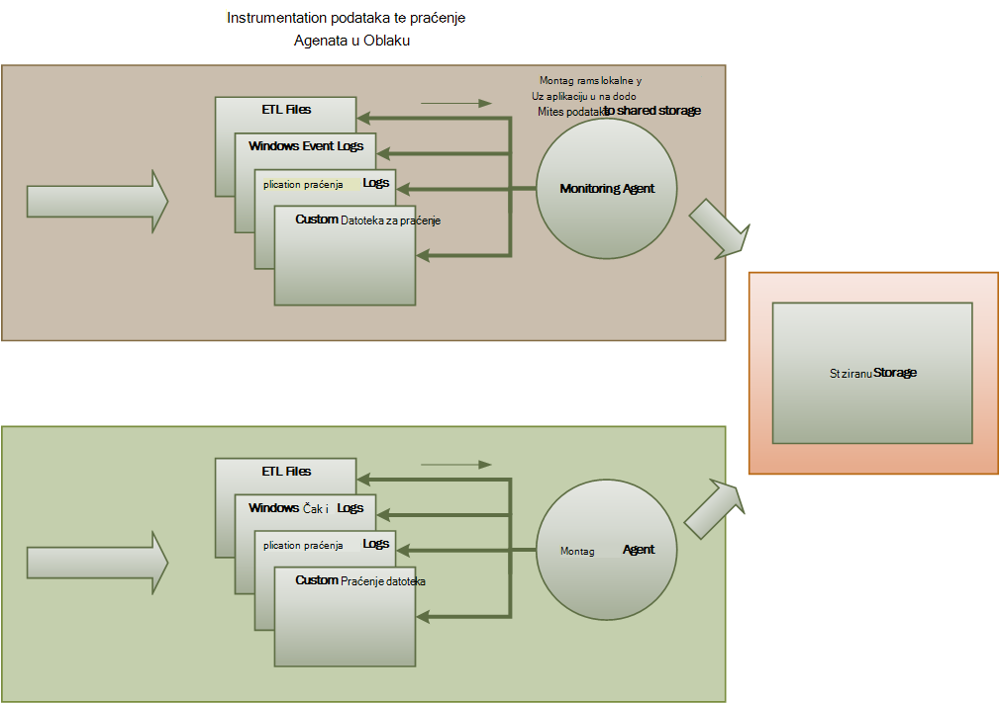
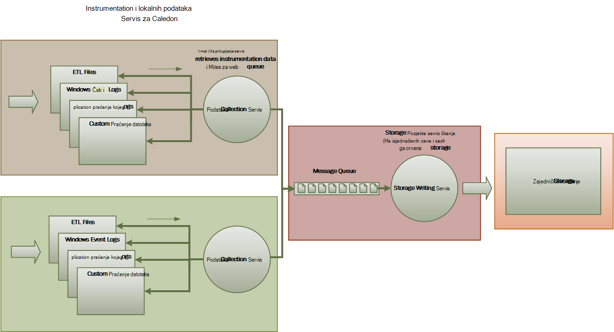
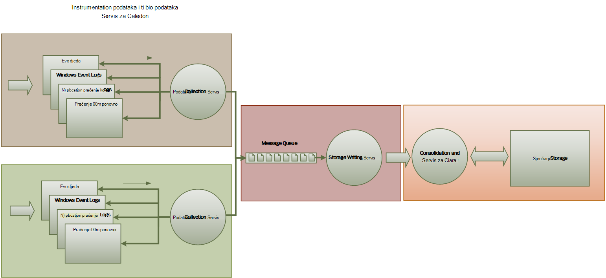

<properties
   pageTitle="Upute za nadzor i dijagnostici | Microsoft Azure"
   description="Najbolje prakse za nadzor distributed aplikacije u oblaku."
   services=""
   documentationCenter="na"
   authors="dragon119"
   manager="christb"
   editor=""
   tags=""/>

<tags
   ms.service="best-practice"
   ms.devlang="na"
   ms.topic="article"
   ms.tgt_pltfrm="na"
   ms.workload="na"
   ms.date="07/13/2016"
   ms.author="masashin"/>

# <a name="monitoring-and-diagnostics-guidance"></a>Upute za nadzor i dijagnostici

[AZURE.INCLUDE [pnp-header](../includes/guidance-pnp-header-include.md)]

## <a name="overview"></a>Pregled
Raspodijeljeno aplikacije i servise u oblaku su, njihove prirode, složene dijelove softvera koji čine mnogo premještanje dijelova. U okruženju radni je važno moći pratiti način u kojima korisnici koriste sustav, Upotreba resursa za praćenje i obično praćenje stanja i performanse sustava. Ove informacije možete koristiti kao dijagnostičkih pomagalo za otkrivanje i ispravljanje problema, a i da biste poboljšali mjestu potencijalne probleme i onemogućiti ih.

## <a name="monitoring-and-diagnostics-scenarios"></a>Scenariji za nadzor i dijagnostike
Nadzor možete koristiti da bi se dobio uvida u koliko će se dobro funkcionira u sustavu. Nadzor je presudne dio zadržavanje kvalitete servisa ciljnih web-mjesta. Uobičajeni scenariji za prikupljanje podataka o praćenju obuhvaćaju sljedeće:

- Osiguravanje ostaje li sustav dobar.
- Dostupnost sustava i njegovih elemenata komponenta za praćenje.
- Održavanje performanse da biste bili sigurni da propusnost sustav nije slabije neočekivano kao jedinica povećava rad.
- Jamstva ispunjava li sustav sve razini usluge (SLA) uspostaviti s klijentima.
- Zaštita privatnosti i sigurnosti u sustavu, korisnici i svoje podatke.
- Praćenje postupaka koji se izvode u svrhu nadzora ili propisima.
- Svakodnevno korištenje sustava i uočavanje trendove koji mogu uzrokovati poteškoće s ako ih ne adresirana za nadzor.
- Praćenje stavki koji se pojavljuju iz početno izvješće kroz da biste analizirali moguće uzroke, rectification, consequent softverska ažuriranja i implementaciju.
- Praćenje operacije i ispravljanje pogrešaka softver izdanja.

> [AZURE.NOTE] Ovaj popis je namijenjen biti potpun. Ovaj dokument usredotočuje se na sljedećim scenarijima kao najčešće situacijama za izvođenje nadzor. Možda postoje drugi koji su rjeđe ili specifične za vaše okruženje.

U sljedećim odjeljcima opisuju scenarija u više detalja. Podatke za svaku scenarij opisan u sljedećem obliku:

1. Kratki pregled scenarija
2. Uobičajeni preduvjeti za ovaj scenarij
3. Podaci neobrađenog instrumentation nužnog za podršku scenarij i moguće izvore podataka
4. Kako mogu analizirati i kombinirati da biste generirali smisleni dijagnostičke informacije u ovom sirovim podacima

## <a name="health-monitoring"></a>Nadzor stanja
U sustavu je dobar ako je pokrenut i instaliranog obrade zahtjeva za. Svrha nadzor stanja je da biste generirali snimke trenutno stanje sustava tako da možete provjeriti sve komponente sustava funkcioniraju prema očekivanjima.

### <a name="requirements-for-health-monitoring"></a>Preduvjeti za nadzor stanja
Operator trebali biste primali upozorenja o brzo (unutar relevantnim sekundi) ako je bilo koji dio sustava se smatra da je dobro. Operator trebali biste moći provjerili dijelove sustava normalno funkcionira i koje dijelove naišli na probleme. O općem stanju sustava mogu istaknuti promet svijetlo sustavu:

- Crvena za dobro (prestao sustav)
- Žuti za djelomično dobar (sustav radi sa smanjenom funkcionalnošću)
- Zelena za potpuno dobar

Potpun nadzor stanja sustava omogućuje operator da biste dubinski analizirati sustava da biste vidjeli status stanje podsustava i komponenata. Ako, na primjer, ako cjelokupnog sustava je prikazan kao djelomično dobar, operator trebali biste moći da biste uvećali ili odrediti koje funkcija trenutno nije dostupna.

### <a name="data-sources-instrumentation-and-data-collection-requirements"></a>Izvori podataka, instrumentation i preduvjeti za prikupljanje podataka
Sirovim podacima nužnog za podršku nadzor stanja mogu generirati a result od:

- Praćenje izvršenje zahtjeva za korisnika. Ove informacije mogu se odrediti zahtjeva za koje ste je uspjela, koji nije uspjela, a koliko dugo traje svaki zahtjev.
- Nadzor stilova sintetičkih korisnika. Ovaj postupak simulira korake obavlja korisnika, a slijedi unaprijed definirane niz koraka. Mora biti zabilježene rezultati svakog koraka.
- Bilježenje u zapisnik iznimke, kvarove i upozorenja. Ove informacije možete biti zabilježene kao rezultat naredbe prati ugrađen u kod aplikacija, kao i Dohvaćanje informacija iz zapisnika događaja bilo koje usluge koja se odnosi na sustav.
- Praćenje stanja servisi treće strane koja koristi sustav. Ovaj nadzor može zahtijevati dohvaćanje i analize stanja podatke koje navesti tih servisa. Ove informacije može potrajati raznih oblika.
- Nadzor krajnjoj točki. U ovom mehanizam je podrobnije opisan u u odjeljku "Dostupnost nadzor".
- Prikupljanje razine okolne performanse podatke, kao što su pozadina procesora ili aktivnosti/i (uključujući mreža).

### <a name="analyzing-health-data"></a>Analiza podataka o stanju sustava
Nadzor stanja primarni fokus je brzo određivanje hoće li sustav radi. Tipkovni analize podataka odmah možete pokrenuti upozorenje ako ključna komponenta otkrije kao dobro. (To ne reagira uzastopni niz Pingovi, na primjer.) Operator zatim možete poduzeti odgovarajuće korektivne akcije.

Naprednije sustava mogu sadržavati predvidljivu element koji se izvodi Hladna analizu preko radnih opterećenja nedavne i aktualne. Hladna analizu možete uočite trendove i odrediti je li sustav vjerojatno će ostati dobar ili li sustav ćete dodatne resurse. Taj element predvidljivu se temelji na metrika ključnih performanse, kao što su:

- Brzina zahtjeva za usmjereni na svaki servis ili podsustav.
- Vrijeme odaziva tih zahtjeva.
- Količinu podataka slijedi u i Odjava iz njega svaki servis.

Ako vrijednost bilo kojeg metriku premašuje definirani prag, sustav možete podići upozorenja da biste omogućili operatora ili autoscaling (Ako je dostupno) da biste poduzeti Preventivni potrebne za održavanje općem stanju sustava. Ove se radnje možda obuhvaćaju dodavanje resursa, a zatim ponovno pokrenuti jedne ili više usluga ne uspijeva ili Primjena ograničavanje na donjem prioritet zahtjeve.

## <a name="availability-monitoring"></a>Nadzor dostupnosti
Uistinu dobar sustav zahtijeva komponente i podsustava koje sastavite sustav dostupni. Dostupnost nadzor usko povezan s nadzor stanja. No dok nadzor stanja nudi trenutni prikaz trenutno stanje sustava, nadzor dostupnosti se bavi praćenja raspoloživost sustava i njegove komponente da biste generirali statističkih podataka o vrijeme aktivnosti sustava.

U mnogim sustavima neke komponente (kao što je baza podataka) konfigurirane su pomoću ugrađenih zalihosti dopustiti brzo prebacivanje u slučaju ozbiljnog kvara ili gubitka veze. Najbolje korisnici trebali ne imati na umu da kao što je pojavila se pogreška. No iz dostupnost nadzor perspektive, potrebno je prikupite suvišni o moguće takvih pogrešaka da bi utvrdio uzrok i korektivne poduzeti da biste spriječili da ih ponavljanja.

Podaci koje je potrebno da biste pratili dostupnost možda ovise o nekoliko čimbenika niže razine. Mnoge od sljedećih čimbenika mogu biti specifična za aplikacije, sustava i okruženje. Učinkovita nadzora sustava snima dostupnost podataka koji odgovara sljedećih čimbenika najniže razine, a zatim zbrajaju ih da bi se dobilo cjelokupan slike sustava. Poslovnu funkciju koja omogućuje kupac da biste postavili narudžbe u sustavu za e-trgovine, na primjer, možda ovise o spremište pohranjuju Detalji narudžbe i sustavom plaćanja koji rukuje novčani transakcije plaćanja za te narudžbe. Dostupnost redoslijed položaj dio sustava stoga je funkcija raspoloživost spremište i podsustavu plaćanja.

### <a name="requirements-for-availability-monitoring"></a>Preduvjeti za nadzor dostupnosti
Operator trebali biste moći ćete prikaz povijesne dostupnost svakog sustava i podsustav i te podatke koristiti za uočite trendove neki koji mogu uzrokovati jedan ili više podsustava povremeno uvoza. (Services započnite uvoza u određenom trenutku dana koje odgovara nastoji obrada?)

Nadzor rješenje mora sadržavati je trenutna i povijesne prikaz dostupnosti ili nedostupnosti svaki podsustav. Također mora biti možete brzo upozorenjem operator kada jedan ili više usluga nije uspjelo ili nije moguće korisnici povezuju sa servisima. Ovo je pitanje ne samo svaki servis za nadzor, ali i provjera radnje koje svakog korisnika ako se ove akcije neće uspjeti kada pokušaju komunikaciju s uslugom. Da biste određenoj mjeri stupanj nije uspjelo povezivanje je normalno, a možda je došlo do pogreške tranzitne. No može biti korisno da biste omogućili sustav Potenciranje upozorenja za broj neuspjelih za povezivanje za određeni podsustav koji se pojavljuju tijekom određenog razdoblja.

### <a name="data-sources-instrumentation-and-data-collection-requirements"></a>Izvori podataka, instrumentation i preduvjeti za prikupljanje podataka
Kao i u slučaju nadzor stanja neobrađenog podatke koje je potrebno za podršku dostupnost nadzor možete generirati uslijed stilova sintetičkih korisnika nadzora i bilježenja sve iznimke, kvarove i upozorenja koje se mogu pojaviti. Osim toga, dostupnost podataka možete preuzeti izvršavanju nadzor krajnjoj točki. Aplikaciju možete izložiti jedan ili više stanja krajnje točke, svaki testiranja pristup funkcionalno područje u sustavu. Nadzor sustava možete pomoću naredbe ping svaki krajnjoj točki slijedeći definirani raspored i prikupljanje rezultata (uspjelo ili nije uspjelo).

Moraju biti zabilježene vremensko ograničenje, pogrešaka u mreži s povezivanjem i pokušaja povezivanja pokušajte ponovno. Svi podaci moraju biti vremenskom oznakom.

<a name="analyzing-availability-data"></a>
### <a name="analyzing-availability-data"></a>Analiza podataka dostupnosti
Instrumentation podataka mora biti pridružuje i povezuju podržava sljedeće vrste analiza:

- Odmah dostupnost sustava i podsustava.
- Nije uspjelo stope dostupnost sustava i podsustava. Najbolje operator trebali biste moći povezivanje neuspjeha određene aktivnosti: što je događa kada sustav?
- Povijesne prikaz stope pogreška sustava ili bilo koju podsustava preko bilo navedeno razdoblje i mogućnost Učitaj u sustavu (broj zahtjeva za korisnika, na primjer) kada pojavila se pogreška.
- Razlozi za nedostupnosti sustava ili bilo koju podsustava. Na primjer, možda je razloga povezani servis nije pokrenut, povezivanje izgubiti, ali prekoračenja i povezani, ali stari pogrešaka.

Možete izračunati postotak dostupnost servisa vremenskom razdoblju pomoću sljedeće formule:

```
%Availability =  ((Total Time – Total Downtime) / Total Time ) * 100
```

To je korisno u svrhu SLA. ([SLA nadzor](#SLA-monitoring) je podrobnije opisan u kasnije u ovom uputama.) Definicija _nedostupnost_ ovisi o servis. Ako, na primjer, Visual Studio tima sastavljanje servis Services određuje nedostupnost kao razdoblja (Ukupna skupljena u minutama) tijekom kojeg sastavljanje servis nije dostupan. Minute se smatra dostupna ako sve neprekinuti HTTP zahtjevima za sastavljanje servisa za izvođenje operacija kupca pokrenut cijeloj minute rezultat je kod pogreške ili vratiti odgovor.

## <a name="performance-monitoring"></a>Praćenje performansi
Kao što je sustav smješta u odjeljku više opterećenjem (Povećavanje glasnoće korisnika), veličina skupove podataka koji rastom te korisnicima pristup i nastanka pogreške neke komponente postaje vjerojatnije. Često komponente neuspjeh prethodi smanjenje performanse. Ako možete otkriti takve smanjenje, možete poduzeti određene proaktivne korake da biste pravnog LIJEKA situaciji.

Performanse sustava ovisi o nekoliko čimbenika. Svaki faktor obično mjeri se kroz Ključni pokazatelji uspješnosti (KPI), kao što su broj transakcije baze podataka u sekundi ili količinu zahtjeva za mrežni uspješno servisirati u određeni vremenski okvir. Neke od ovih KPI-ja može biti dostupan kao performanse određene mjere, dok drugi mogu izvedene iz kombinacija metriku.

> [AZURE.NOTE] Određivanje nisku ili dobre performanse zahtijeva razumijete razinu performansi na kojoj se treba instaliranog pokretanje sustava. Za tu radnju opažanja sustav dok radi uobičajeni opterećenju i dohvaćanje podataka za svaki KPI vremenskom razdoblju. Može obuhvaćati sustav Simulirani opterećenju u okruženju test i prikupljanje odgovarajuće podatke prije implementacije sustava za radnog okruženja.

> Trebali biste provjeriti da nadzor za performanse predvidjeli postaje teret u sustavu. Možda ćete moći dinamički prilagodite razinu detalja za podatke koji prikuplja performanse nadzor postupak.

### <a name="requirements-for-performance-monitoring"></a>Preduvjeti za praćenje performansi
Da biste pregledali performanse sustava, operator obično treba da biste vidjeli podatke koji uključuje:

- Odgovor stope za zahtjevima korisnika.
- Broj zahtjeva Istodobni korisnika.
- Jedinica mrežni promet.
- Stope na koje se poslovne su dovršetak transakcije.
- Prosječno vrijeme obrade zahtjeva za.

Također može biti korisno omogućuju alate koji omogućuju operator radi mjestu korelacija, kao što su:

- Broj Istodobni korisnika i Latencija zahtjev za radno vrijeme (vremena potrebnog za pokretanje obrade zahtjeva za kada korisnik je poslao).
- Broj korisnika Istodobni nasuprot average reakcija (koliko dugo traje da biste dovršili zahtjeva kada je pokrenut obrade).
- Jedinica zahtjeve i broj obradu pogrešaka.

Uz ovaj više razine funkcionalni podatke operator trebali biste moći nabaviti detaljan prikaz performansi za svaku komponentu u sustavu. Ove podatke obično odvija pomoću mjerača najniže razine performansi koji kao što su praćenje informacija:

- Korištenje memorije.
- Broj niti.
- Vrijeme obrade procesora.
- Duljina reda čekanja zahtjeva.
- Na disku ili mreži/i stope i pogrešaka.
- Broja bajtova napisali ili čitati.
- Pokazatelji proizvod, kao što je Duljina reda čekanja.

Sve vizualizacije dopustite operator da biste odredili vremensko razdoblje. Prikazane podatke možda se snimke trenutačno stanje i/ili prikaza povijesnih performanse.

Operator trebali biste moći Potenciranje upozorenje koje se temelje na bilo kojem performanse mjere za bilo koju navedenu vrijednost neki određeni vremenski interval.

### <a name="data-sources-instrumentation-and-data-collection-requirements"></a>Izvori podataka, instrumentation i preduvjeti za prikupljanje podataka
Prateći tijeku zahtjeva za korisničku kao i stignu te proći kroz sustav možete prikupiti podataka o performansama više razine (propusnost, broj Istodobni korisnika, broj poslovnih transakcija, stope pogreške i tako dalje). To uključuje ugradnje praćenje naredbe na ključne točke u kodu aplikacije, zajedno s informacijama o tempiranje. Kvarove, iznimke i upozorenja treba zabilježene dovoljno podataka za correlating ih s zahtjevima za koje su uzrokovale ih. Zapisnik Internet Information Services (IIS) je drugi korisne izvor.

Ako je to moguće, trebali biste snimili i podataka o performansama za vanjski sustavi koji koristi aplikacija. Ove Vanjski sustavi dat će vlastite mjerača performansi ili drugih značajki za traženje podataka o performansama. Ako to nije moguće, zapisa podatke kao što su vrijeme početka i vrijeme završetka za svaki zahtjev s vanjskim sustavom, zajedno s status (uspjeh, nije uspjelo ili upozorenje) operacije. Ako, na primjer, možete koristiti štoperice pristup na zahtjeve za vrijeme: pokretanje vremena pri pokretanju zahtjev, a zatim zaustavite na mjerača vremena kada se dovrši zahtjev.

Podataka o performansama najniže razine za pojedinačne komponente u sustavu možda biti dostupne putem značajke i servise kao što su mjerača performansi sustava Windows i Dijagnostika Azure.

### <a name="analyzing-performance-data"></a>Analiza podataka o performansama
Većina poslovne analizu sastoji se od Zbrajanje podataka o performansama po vrsti zahtjev za korisnika i/ili podsustav ili servis na koji se šalje svaki zahtjev. Primjer zahtjev korisnika je dodavanje stavke u košaricu ili izvođenje postupka odjavu u sustavu za e-trgovine.

Drugi potrebna je sažimanje podataka o performansama u odabrani percentili. Operator, na primjer, možda odredite vrijeme odaziva za 99% zahtjeva, 95 posto zahtjeva za i postotak 70 zahtjeva za. Možda postoje SLA ciljnih web-mjesta ili druge ciljevi postavljeni za svaki percentil. Daljnje rezultate treba se prijavljivati u stvarnom vremenu u najbliži pomoći otkrivanju odmah problema. Rezultati treba se pridružuje i vremenom dulje statističke svrhe.

U slučaju problema Latencija utječu na performanse, operator trebali biste moći brzo prepoznavanja uzrok na usko grlo Provjera Latencija svakog koraka koji izvršava svaki zahtjev za potvrdu. Podataka o performansama stoga navedite srednje vrijednosti correlating performanse mjere svakog koraka za povezivanje ih u zahtjev za određene.

Ovisno o preduvjetima za vizualizaciju, možda će biti korisno za stvaranje i spremanje podataka kocke koja sadrži prikaze sirovim podacima. U ovom kocke podataka možete omogućiti složene ad hoc upite i analizu informacije o performansama.

## <a name="security-monitoring"></a>Nadzor sigurnosti
Sve komercijalne sustavima koji sadrže osjetljive podatke morate provesti sigurnost strukturu. Složenost mehanizam za sigurnost obično je funkcija osjetljivost podatke. U sustavu za koje je potrebno korisnicima moguće provjeriti autentičnost, trebali biste zabilježili:

- Sve prijavu pokušaji, hoće li se neće uspjeti ili uspjeti.
- Sve operacije izvoditi – i detalje o svim resursima pristupati – čija je autentičnost provjerena korisnika.
- Kada korisnik završava sesije i potpisuje.

Nadzor možda moći olakšavaju prepoznavanje napada u sustavu. Na primjer, velik broj neuspjelih pokušaja prijave mogu upućivati grube sile napada. Neočekivani stabilizatorom u zahtjevima za možda rezultat raspodijeljeno napada uskraćivanje servisa (DDoS). Potrebno pripremiti sve zahtjeve za sve resurse bez obzira na to izvora te zahtjeve za praćenje. Sustav koji ima slabe za prijavu možda slučajno izložiti resurse za vanjski svjetske bez potrebe korisnika zapravo prijaviti.

### <a name="requirements-for-security-monitoring"></a>Preduvjeti za nadzor sigurnosti
Najvažnija aspekte sigurnost nadzor brzo trebate omogućiti operator za:

- Otkriva koju ste pokušali izvršiti upada prema entitet Neprovjereni.
- Prilikom pokušaja prepoznavanja entiteti za izvođenje operacije na podacima za koje oni imaju pristup.
- Odrediti je li u odjeljku napada iz izvan ili unutar sustav ili neki dio sustav. (Na primjer, zlonamjernih korisnika čija je autentičnost provjerena možda pokušava sustav Premjesti.)

Operator trebaju biti obaviještene za podršku te preduvjete:

- Postaje jedan račun koji se ponavljaju nije uspjelo pokušaja prijave unutar određenog razdoblja.
- Ako jedan račun čija je autentičnost provjerena pritišćite pokušava pristupiti zabrane resursa tijekom određenog razdoblja.
- Ako velik broj Neprovjereni ili neovlašteno zahtjeva će se pojaviti tijekom određenog razdoblja.

Informacije koje se otvara kao operator treba uključiti adresu glavno računalo izvora za svaki zahtjev. Ako sigurnost kršenja redovito dođe do iz određeni raspon adresa, te domaćini možda blokiran.

Ključni dio u zaštiti sigurnosti u sustavu se mogućnost da biste brzo otkrili akcije koje proizlaze iz uobičajeni uzorka. Podaci kao što su broj neuspjelih i/ili uspješno prijavu zahtjeva prikazuje se vizualno olakšavaju prepoznavanje postoji li u šiljak u aktivnosti neobično vrijeme. (Primjer aktivnost je korisnicima prijaviti na adresi 3:00 Prijepodne i izvođenje velikog broja operacije prilikom njihova radni dan započinje 9:00 Prijepodne). Ove informacije možete također se pomoć za konfiguriranje temeljene autoscaling. Na primjer, ako operator uočiti da velik broj korisnika redovito prijavite se u određenom trenutku dana, operator možete urediti da biste pokrenuli dodatno unositi services za rukovanje količinu rad i isključivanje te dodatne usluge kad je na vrh prošao.

### <a name="data-sources-instrumentation-and-data-collection-requirements"></a>Izvori podataka, instrumentation i preduvjeti za prikupljanje podataka
Sigurnost je sve encompassing aspekt najčešće raspodijeljeno sustave. Relevantnih podataka je vjerojatno generirati više točaka cijelom sustavu. Razmislite o usvojio informacije o sigurnosti i upravljanje događaja (SIEM) pristup Prikupite informacije vezane uz sigurnost koja je rezultat događaje potenciju aplikaciju, opreme mreže, poslužitelje, vatrozida, antivirusnog softvera i ostale elemente podataka sprječavanje.

Nadzor sigurnosti možete uključivanje podataka iz alata koji nisu dio aplikacije. Ove alate možete uključiti uslužni programi koje označavaju priključak pregledavanje aktivnosti vanjskih agencije ili mreže filtri koji otkrivati pokušaje da biste pristupili Neprovjereni aplikaciju i podatke.

U svakom slučaju, gathered podataka morate omogućiti administrator da biste mogli odrediti prirode sve napadi i poduzeti odgovarajuće protumjere.

### <a name="analyzing-security-data"></a>Analiza podataka sigurnosti
Značajka sigurnosti nadzor je raznih izvora iz kojeg se nastaje podatke. Različite oblike i razina detalja često potreban složene analize podataka snimljenu sve zajedno u koherentnost niti podataka. Osim najjednostavnije predmeta (kao što su otkrivanje velik broj neuspjelih znak dodataka ili više pokušaja da bi se dobio neovlaštenog pristupa resursima ključnih), možda nije moguće izvršiti sve složenih automatiziranog obradu podataka sigurnost. Umjesto toga, možda je preporučuje zapisivanje podataka, vremenskom oznakom ali drukčije u izvornom obliku, sigurno spremište da biste dopustili expert analizu ručno.

<a name="SLA-monitoring"></a>

## <a name="sla-monitoring"></a>Nadzor SLA
Mnogim komercijalne sustavima koji podržavaju plaćanje kupcima provjerite jamstva o performansama sustava u obliku SLA. Zapravo, SLA stanja sustava možete rukovati definirani količinu posla unutar dogovoreni vremenskog razdoblja, a ne izgubite ključnih informacija. Nadzor SLA se bavi jamči da sustav zadovoljava brzom SLA.

> [AZURE.NOTE] Nadzor SLA usko povezan s praćenje performansi. No dok praćenje performansi se bavi koji jamči da u sustavu funkcije _optimalnog_, nadzor SLA uređena Stvaranje obveze koja definira koje _optimalnog_ zapravo znači.

SLA često su definirani u terms od:

- Dostupnost cjelokupnog sustava. Ako, na primjer, tvrtkom ili ustanovom možda jamči da sustav biti dostupno za 99.9 iznimaka tome pravilu. To daje rezultat u obliku više od 9 sati nedostupnost po godini ili više od 10 minuta dan.
- Radu propusnost. Ovaj razmjer često izražen kao jedan ili više visoke – vode znakovima, primjerice jamstva sustav možete podržava do 100 000 zahtjevima Istodobni korisnika ili rukovati 10 000 Istodobni poslovne transakcije.
- Odgovor radno vrijeme. Sustav također bi se mogla jamstva za stopu obrađuju zahtjeve. Primjer je da će 99 postotak sve poslovne transakcije dovrši u dvije sekunde, a ne jedna transakcija će trajati dulje od 10 sekundi.

> [AZURE.NOTE] Neke ugovore za komercijalne sustavi mogu sadržavati SLA službe za korisnike. Primjer je sve zahtjeve za službe za korisnike pomoći će elicit odgovor unutar pet minuta, a da 99% svih problema će biti potpuno adresirane 1 radni dan. Učinkovita [praćenje problema](#issue-tracking) (opisani kasnije u ovom odjeljku) je ključ za sastanak SLA kao što su.

### <a name="requirements-for-sla-monitoring"></a>Preduvjeti za nadzor SLA
Na najvišoj razini operator trebali biste moći pogledom utvrdite li sustav je sastanak dogovoreni SLA ili ne. Ako nije, operator trebali biste moći dubinske analize prema dolje i ispitivanje podlozi čimbenika da biste odredili razloge substandard performansi.

Uobičajeni više razine indikatore pomoću kojih se vizualno obuhvaćaju sljedeće:

- Postotak vrijeme aktivnosti servisa.
- Propusnost aplikacije (mjeri u uspješnih transakcija i/ili operacije u sekundi).
- Broj zahtjeva za uspješan/neuspjeh aplikacije.
- Broj kvarove aplikacije i sustav, iznimke i upozorenja.

Sve od ovih pokazatelja mora biti instaliranog filtrira određeno vrijeme.

Oblak aplikacija vjerojatno čini broj podsustava i komponenata. Operator trebali biste moći odabrati više razine pokazatelja i pregledati kako se sastoji od stanja podlozi elemenata. Na primjer, ako vrijeme aktivnosti cjelokupnog sustava pada ispod prihvatljiva vrijednost, operator moći da biste uvećali ili određuju koji elementi se pojačava tog problema.

> [AZURE.NOTE] Potrebno je pažljivo definirati vrijeme aktivnosti sustava. U sustavu koji koristi zalihosti za maksimalnu osiguraj pojedinačne instance elemenata možda neće uspjeti, ali sustav može ostati funkcionirati. Vrijeme sustava aktivnosti kao što je upit prateći stanja treba označavaju zbrajanja vrijeme aktivnosti svaki element te ne nužno li je zapravo zaustavljena sustav. Uz to, pogreške možda Izolirani. Pa čak i ako je određeni sustav nije dostupan, ostatak sustava može biti dostupna, iako funkcionalnošću smanjiti. (U sustavu za e-trgovine, pogreške u sustavu može se onemogućiti klijenta smještanje narudžbe, ali je korisnik odabrao mogu i dalje moći pregledavati kataloga proizvoda.)

Za upozorenjem svrhe, sustav trebali biste moći Potenciranje događaja Ako bilo koji od više razine pokazatelja prelaze određeni prag. Niže razine detalje o različitim čimbenicima koje sastavite indikator više razine mora biti dostupni kao kontekstnih podataka alerting sustav.

### <a name="data-sources-instrumentation-and-data-collection-requirements"></a>Izvori podataka, instrumentation i preduvjeti za prikupljanje podataka
Sirovim podacima koje je potrebno za podršku SLA nadzor je slična neobrađenog podatke koje je potrebno za praćenje performansi, zajedno s neke aspekte stanja i nadzor dostupnosti. (Pogledajte tih odjeljaka više detalja). Možete snimiti ove podatke prema:

- Izvođenje nadzor krajnjoj točki.
- Bilježenje u zapisnik iznimke, kvarove i upozorenja.
- Praćenje izvršenje zahtjeva za korisnika.
- Nadzor dostupnosti servisi treće strane koja koristi sustav.
- Korištenje metriku performanse i mjerača.

Svi podaci moraju biti timed i vremenskom oznakom.

### <a name="analyzing-sla-data"></a>Analiza podataka SLA
Da biste generirali slika performanse cjelokupnog sustava morate zbrojiti instrumentation podataka. Skupne podatke moraju također podržavati dubinske analize prema dolje da biste omogućili analize performansi podlozi podsustava. Na primjer, trebali biste moći:

- Izračun ukupan broj korisnika zahtjeva tijekom određenog vremenskog i odrediti stopa neuspješnom slanju tih zahtjeva.
- Kombiniranje vrijeme odaziva korisničkog zahtjeva za generiranje cjelokupan prikaza vremena za odgovor sustava.
- Analiza tijeku korisnika zahtjevi za raščlanjuju cjelokupan reakcija na zahtjev u vrijeme odaziva pojedinačnih radnih stavki u taj zahtjev.  
- Određivanje ukupnog dostupnost sustava kao postotak vrijeme aktivnosti za sve određenog razdoblja.
- Analiza dostupnost vrijeme postotka pojedinačnih komponenti i servisa u sustavu. To može obuhvaćati Raščlanjivanje zapisnika koji je generirao servisa drugih proizvođača.

Mnoge komercijalne sustavi moraju izvješća realni performanse slika protiv dogovoreni SLA za navedeno razdoblje, obično mjesec. Ti podaci se može koristiti za izračun kredita ili druge oblike repayments za kupce ako na SLA nije zadovoljen tijekom tog razdoblja. Dostupnost servisa, možete izračunati pomoću postupak opisan u odjeljku [analiziranje dostupnost podataka](#analyzing-availability-data).

Za internu upotrebu kao tvrtki ili ustanovi mogu i praćenje broj i prirode kupljenih koje su uzrokovale services uvoza. Smanjiti nedostupnost i zadovoljavaju SLA brzo ćete Naučite kako brzo rješavanje tih problema ili ih potpuno ukloniti.

## <a name="auditing"></a>Nadzor
Ovisno o prirode aplikaciju, možda postoje zakonska ili nekog drugog pravne propisa navedete preduvjeti za nadzor operacije korisnika i bilježenja svih podataka programa access. Nadzor unijeti dokaz kupci veze na određene zahtjeve. Osigurano priznavanje jest važan faktor u mnogim sustavima e tvrtke razloga pouzdanosti između klijenta i tvrtka ili ustanova odgovorna za aplikaciju ili servis.

### <a name="requirements-for-auditing"></a>Preduvjeti za nadzor
Programa analitičar moraju imati mogućnost prati slijed operacije tvrtke koje korisnici izvršavate tako da možete ponovno sastavit akcije korisnika. To može biti potrebno jednostavno kao relevantnim zapisa ili kao dio forensic istrage.

Informacije o reviziji je vrlo osjetljive. Vjerojatno neće sadržavati podataka koja služi za identifikaciju korisnika u sustavu, zajedno s zadatke koji su se izvodi. Zbog toga nadzora podataka najvjerojatnije se obrazac izvješća koje su dostupne samo pouzdanih analitičar analitičar podataka umjesto kao interaktivni sustav koji podržava dubinske analize grafički operacija. Programa analitičar trebali biste moći generirati raspon izvješća. Izvješća mogu, na primjer, navedite sve korisnike aktivnosti koje su se pojavile tijekom određeni vremenski okvir, detalja u kako kronološki, tako aktivnosti za jednog korisnika ili popis slijed operacije obavljene u odnosu na jedan ili više resursa.

### <a name="data-sources-instrumentation-and-data-collection-requirements"></a>Izvori podataka, instrumentation i preduvjeti za prikupljanje podataka
Primarni izvora podataka za nadzor mogu biti:

- Sigurnost sustava koja upravlja provjere autentičnosti korisnika.
- Praćenje zapisnika snimanje aktivnosti korisnika.
- Sigurnost zapisnika koje prate sve zahtjeve za identifikaciju osobe i unidentifiable mreže.

Oblika podatke o nadzoru i način u kojoj je pohranjen može biti pokreću pravnih. Ako, na primjer, možda nije moguće očistiti podatke na bilo koji način. (Ga mora biti naveden u izvornom obliku.) Pristup spremište gdje se održava mora biti zaštićene da onemogućuje neovlašteno mijenjanje.

### <a name="analyzing-audit-data"></a>Analiza podataka nadzora
Programa analitičar moraju imati mogućnost da biste pristupili sirovim podacima u potpunosti u izvornom obliku. Osim zahtjeva za generiranje izvješća o nadzoru uobičajenih alata za analizu ove podatke vjerojatno oblici sadrže i zadržati vanjskog sustava.

## <a name="usage-monitoring"></a>Nadzor korištenja
Nadzor korištenja prati kako se koriste značajke i komponente aplikacije. Operator možete koristiti gathered podataka:

- Odredite koje značajke intenzivnog korištenja i određivanje sve potencijalne pristupne točke u sustavu. Elementi najviša promet pogodnost možda funkcionirati particija ili čak replikacije možete proširiti opterećenje ravnomjerno više. Operator ove informacije možete koristiti da biste provjerili koje značajke diskovni koriste i su moguća kandidata za umirovljenje ili zamjena u budućim verzijama sustava.
- Prikupite informacije o radu sa servisom događaja sustava u odjeljku osnovne funkcionalnosti. Ako, na primjer, programa e-trgovine web-mjestu možete snimiti statističkih podataka o broju transakcije i količinu kupaca kojima ste odgovorni za njih. Ove informacije mogu koristiti za planiranje kapaciteta, kao što je broj kupaca poveća.
- Otkrivanje (vjerojatno neizravno) zadovoljstvo korisnika s performanse i funkcionalnost sustava. Ako, na primjer, ako velikog broja korisnika u sustavu za e-trgovine redovito ćete njihove kupovinu za kupnju, to možda zbog problema s funkcijama za odjavu.
- Generiranje podatke o naplati. Komercijalni aplikacije ili složene servis možda naplaćuje klijenata za resurse koji koriste.
- Nametanje kvote. Ako korisnik u sustavu za složene premašuje kvotu plaćenu obrade vremena ili resursa korištenje tijekom određenog razdoblja, njihov pristup može biti ograničeno ili obrada možete ograničio vrijeme.

### <a name="requirements-for-usage-monitoring"></a>Preduvjeti za korištenje nadzora
Da biste pregledali korištenju sustava, operator obično treba da biste vidjeli podatke koji uključuje:

- Broj zahtjeva koje su obradili svaki podsustav i usmjereni na svaki resurs.
- Rad koji izvršava svakog korisnika.
- Količinu podataka za pohranu koji zauzima svakog korisnika.
- Resursi koji pristupa svakog korisnika.

Operator trebali biste moći ćete generiranje grafikona. Ako, na primjer, grafikon mogu prikazati korisnici najčešće resursa hungry ili najčešće pristupiti resurse ili značajke sustava.

### <a name="data-sources-instrumentation-and-data-collection-requirements"></a>Izvori podataka, instrumentation i preduvjeti za prikupljanje podataka
Korištenje praćenja može izvoditi relativno visoke razine. Možete Napomena vremena početka i završetka svakog zahtjeva i prirode zahtjev (čitanje, pisanje i tako dalje, ovisno o resursa u pitanju). Možete dobiti tim podacima:

- Praćenje aktivnosti korisnika.
- Dohvaćanje mjerača performansi koji mjere Upotreba za svaki resurs.
- Nadzor potrošnje resursa tako da svaki korisnik.

Za mjerenje svrhe, morate omogućiti prepoznavanje korisnike koji su odgovorni za izvođenje operacijama i resurse koji se koriste te operacije. Gathered informacije treba detaljne dovoljno da biste omogućili točne naplata.

<a name="issue-tracking"></a>
## <a name="issue-tracking"></a>Praćenje problema
Klijentima i drugim korisnicima mogu prijaviti probleme ako neočekivanih događaja ili ponašanje pojavljuje se u sustavu. Praćenje problema se bavi upravljanje te probleme, pridruživanje naporima da biste riješili probleme podlozi u sustavu i koja obavještava kupci moguća rješenja.

### <a name="requirements-for-issue-tracking"></a>Preduvjeti za praćenje problema
Operatori često izvođenje Evidencija pomoću zasebnom sustav koji omogućuje ih zapisa i izvješća detalja o problemima koji korisnici izvješća. Zadatke koji je korisnik pokušava izvršiti simptomi problem, niz događaja, a pogreške ili poruka upozorenja koja je izdala su možete dodati te detalje.

### <a name="data-sources-instrumentation-and-data-collection-requirements"></a>Izvori podataka, instrumentation i preduvjeti za prikupljanje podataka
Početna izvor podataka za praćenje problema je korisnika koji je lakim prijavljenih problema. Korisnik može unijeti dodatne podatke kao što su:

- Pad (Ako aplikaciju obuhvaća komponentu koja se pokreće na radnoj površini korisnika).
- Snimka zaslona.
- Datum i vrijeme kada pogreške, zajedno s drugim okolini podatke kao što su korisnikovu lokaciju.

Ove informacije mogu se pomoć pogrešaka trud i pomoć sastavljanje zaostale za buduća izdanja softvera.

### <a name="analyzing-issue-tracking-data"></a>Analiza podataka za praćenje problema
Drugi korisnici mogu prijaviti isti problem. Praćenje problema sustava treba povezati uobičajenih izvješća.

Tijek pogrešaka trud trebali biste spremiti protiv svako izvješće problem. Kada je problem riješen, klijenta možete biti obaviješteni o rješenja.

Ako se korisnik prijavljuje problem koji sadrži poznati rješenja u sustavu za praćenje problema, operator trebali biste moći odmah obavještavanje korisnika o rješenja.

## <a name="tracing-operations-and-debugging-software-releases"></a>Praćenje operacije i ispravljanje pogrešaka softver izdanja
Kada se korisnik prijavljuje problem, korisnik je često samo svjesni odmah utjecaj koja ga je njihove operacije. Korisnik možete samo dojavite rezultate vlastite sučelje natrag operator zaduženog za održavanje sustava. Ove sučelja obično su samo vidljive simptoma jedan ili više temeljne problema. U mnogim slučajevima programa analitičar morat ćete istražujte kroz na kako kronološki, tako osnovne operacije da biste odredili uzrok problema. To se naziva _korijenski uzrokovati analize_.

> [AZURE.NOTE] Analizu korijenskog uzroka možda otkrijte neučinkovitosti u dizajnu aplikacije. U takvim slučajevima možda će biti moguće dorada radi korištenja problematične elemente i uvesti ih kao dio sljedećem izdanju. Ovaj postupak zahtijeva oprezni kontrolu, a ažurirane komponente treba nadzirati usko.

### <a name="requirements-for-tracing-and-debugging"></a>Preduvjeti za praćenje i ispravljanje pogrešaka
Za praćenje neočekivanih događaja i ostali problemi, je ključan nadzora podataka omogućuje je dovoljno informacija da biste omogućili programa analitičar pratiti natrag na drugačijeg izvora od tih problema i ponovno sastavit niz događaja koji se pojavila. Ove informacije mora biti potrebne da biste omogućili programa analitičar dijagnosticiranje uzrok problema. Razvojni inženjer može zatim unesite potrebne izmjene da biste spriječili da ih ponavljanja.

### <a name="data-sources-instrumentation-and-data-collection-requirements"></a>Izvori podataka, instrumentation i preduvjeti za prikupljanje podataka
Otklanjanje poteškoća s može obuhvaćati praćenje sve metode (i njihovim parametrima) pozvati kao dio operacije za stvaranje razlaganja koje prikazuje logičke tijeka kroz sustav kad klijenta zbog zahtjeva za određene. Iznimke i upozorenja koje generira sustav uslijed ovaj tijek potrebno bilježe i prijavljeni.

Da biste podržali ispravljanje pogrešaka, sustav možete unijeti spojnica koje omogućuju operator za prikupljanje informacija o stanju pri ključnih točaka u sustavu. Ili, sustav možete održati detaljne detaljne informacije kao tijeku odabrane operacije. Praćenjem pritisnutih podataka na ovoj razini detalja možete nametnuti dodatne opterećenje sustav i mora biti privremene procesa. Operator koristi ovaj postupak uglavnom prilikom visoko neobično niz događaja te je teško replicirati ili kada novo izdanje jedan ili više elemenata u sustavu zahtijeva oprezni nadzor osigurava da funkcija elementi prema očekivanjima.

## <a name="the-monitoring-and-diagnostics-pipeline"></a>Kanal za nadzor i dijagnostike
Nadzor veliki raspodijeljeno sustava predstavlja vrlo test. Svaki od scenariji opisane u prethodnom odjeljku nije nužno razmatranje u odvajanja. Vjerojatno će biti vrlo preklapanja u nadzora i dijagnostičkih podataka koje je potrebno za svaku situaciju iako se ti podaci možda morati obrađuju i prikazane na različite načine. Zbog sljedećih razloga morate poduzeti jednu zaokruženu prikaz nadzor i Dijagnostika.

Cijeli nadzor i Dijagnostika postupak možete envisage kao kanal koji se sastoji od faze prikazane u slika 1.


_Slika 1. Faza u kanalu nadzor i dijagnostike_

Slika 1 ističe kako se podaci za nadzor i dijagnostici mogu potjecati iz različitih izvora podataka. Prikupljanje i instrumentation faze se bavi identificiranje izvora iz gdje podataka mora biti zabilježene određivanje podatke koje želite snimiti, kako je snimiti i kako oblikovati te podatke tako da ga možete se jednostavno pregledavaju. Radni prostor za analizu/Dijagnostika uzima sirovim podacima i koristi za generiranje smislen informacije koje operator možete koristiti za utvrđivanje stanja sustava. Operator možete te podatke koristiti za donošenje odluka o mogućim akcije da biste preuzeli, a zatim dolaziti rezultate natrag faze instrumentation i zbirka. Faza faza vizualizacije/upozorenjem predstavlja potrošni prikaz stanja sustava. Može prikazati podatke u stvarnom vremenu u najbliži pomoću niza nadzorne ploče. A možete generirati izvješća, grafova i grafikona možete unijeti povijesne prikaz podataka koji olakšava prepoznavanje trendova Dugoročne. Ako informacija upućuje na to da KPI-JA vjerojatno će biti dulji od granica prihvatljiva, ovoj fazi možete pokrenuti i upozorenje operator. U nekim slučajevima upozorenje može se koristiti i da biste pokrenuli automatiziranog procesa koji se pokušava poduzeti ispravka, kao što su autoscaling.

Imajte na umu da korake čine neprekinuti tijek postupka gdje su faze događa paralelno. Najbolje sve faze mora biti dinamično prilagodljivo. Na nekim točke osobito kada je sustav upravo implementiran ili postoje problemi s, možda je potrebno prikupljanje prošireni podataka na temelju češće. Ponekad, mora biti moguće vratiti hvatanje razine osnovni ključne informacije da biste provjerili funkcionira li sustav ispravno.

Uz to, cijeli postupak nadzora razmatranje uživo, tijeku rješenje koje se primjenjuju prilagodbom te poboljšanja uslijed povratne informacije. Na primjer, možete započeti s mjerenje mnogo je čimbenika da biste odredili općem stanju sustava. Analizu tijekom vremena mogu dovesti do na sužavanja kao Odbaci mjere koje nisu relevantne, što vam omogućuje da biste preciznije podataka koje su vam potrebne tijekom minimiziranje pozadinski Šum.

## <a name="sources-of-monitoring-and-diagnostic-data"></a>Izvori nadzor i dijagnostičkih podataka
Podaci koji se koristi postupak nadzora mogu potjecati iz nekoliko izvora, kao što je prikazano na slici 1. Na razini aplikacije informacije dolazi iz zapisnika praćenja ugrađeni u kod sustava. Razvojni inženjeri morate slijediti standardne pristup za praćenje tijeka kontrole putem njihove koda. Na primjer, stavka metode možete šalji praćenja poruka koji određuje naziv metodu, trenutno vrijeme, vrijednosti parametra i drugih relevantnih podataka. Snimanje vremena za unos i završne možete također biti koristan.

Trebali biste prijave sve iznimke i upozorenja i provjerite je li zadržite cijelog prati sve ugniježđene iznimke i upozorenja. Najbolje trebali biste zabilježili i informacije koje služi za identifikaciju korisnika koji se izvodi kod, zajedno s korelacije informacija o aktivnosti (zahtjeva za praćenje kao što su proći kroz sustav). I zapisujte pokušaja pristup svim izvorima kao što su redovima poruka, baze podataka, datoteke i druge ovisne servise. Ove informacije može se koristiti za mjerenja i nadzor svrhe.

Provjerite mnoge aplikacije pomoću biblioteka i okviri izvoditi uobičajene zadatke kao što su pristupa spremišta podataka ili komunikaciju putem mreže. Ove okviri mogu konfigurirati vlastite o praćenju i neobrađenog dijagnostičke informacije, kao što su transakcije stope i uspjeha prijenos podataka i pogreške.

> [AZURE.NOTE] Mnoge Moderna okviri automatski objavljuj performanse i praćenje događaja. Dohvaćanje taj podatak jednostavno pitanje je pružanje sredstava za dohvat i spremite ga gdje ga možete obrađuju i analizirati.

Operacijski sustav na kojem se pokreće aplikacije mogu biti izvor najniže razine sistemskih informacija, kao što su mjerača performansi koje označavaju/i tečajeve, korištenje memorije i procesora. Operacijski sustav (kao što su pogreške prilikom otvaranja datoteke pravilno) možda također biti pogrešaka.

Trebali biste razmotriti podlozi infrastrukturu i komponente na kojem se izvodi sustav. Virtualnim strojevima, virtualne mreže i servise za pohranu sve može izvora mjerača važne infrastrukture razinom performansi i drugih dijagnostičkih podataka.

Ako aplikacija koristi drugih vanjskih servisa, kao što je web-poslužitelj ili sustavu upravljanja bazom podataka, te servise mogu objavljivati vlastite prati informacije, zapisnika i mjerača performansi. Primjeri dinamičnih prikaza upravljanja komponente SQL Server za razne operacije obavljene bazi podataka sustava SQL Server za praćenje i praćenje IIS zapisnike za snimanje zahtjeve unijeli na web-poslužitelj.

Kako se mijenjaju komponente sustava i uvode se nove verzije, važno je da biste mogli atribut problema, događaja i metriku za svaku verziju. Ove informacije treba biti uz natrag izdanje kanal tako da probleme s određenom verzijom komponente možete brzo prate i rectified.

Sigurnosnim problemima mogu se pojaviti bilo kojem trenutku u sustavu. Ako, na primjer, korisnik može pokušati prijavite se pomoću koji nisu valjani korisnički ID i lozinku. Da biste dobili neovlašten pristup resursu pokušajte čija je autentičnost provjerena korisnika. Ili korisnik može omogućiti ključa valjan ili je zastario da biste pristupili šifrirane informacije. Informacije o sigurnosti uspješnih i neuspješnih zahtjeva za moraju uvijek biti prijavljeni.

U odjeljku [Instrumenting aplikacije](#instrumenting-an-application) sadrži dodatne smjernice o informacije koje treba snimanje. No možete koristiti različite Strategije za prikupite te podatke:

- **Praćenje aplikacija/sustava**. U ovom strategije koristi internim izvorima aplikacije, okviri aplikacije, operacijski sustav i infrastrukture. Kod aplikacije možete stvoriti vlastitu nadzor brzina najvažnije točke tijekom životnog ciklusa zahtjeva za klijenta. Aplikaciju možete uključiti praćenje naredbe koje možda ga selektivno omogućiti ili onemogućiti kao određuju okolnostima. Možda je i moguće dinamički ubaciti Dijagnostika pomoću okvira za dijagnostiku. Ove okviri obično sadrže dodataka koje možete pridružiti različite instrumentation točke u kodu i snimiti praćenje podataka te točke.

    Uz to, kod i/ili podlozi infrastrukture možda Potenciranje događaje u točkama od ključne važnosti. Nadzor agenata konfiguriranih da biste preslušali za te događaje mogli bilježiti informacije događaj.

- **Nadzor pravi korisnik**. Taj se način zapisuje interakcije između korisnika i aplikacije i uočiti tijeka svakog zahtjeva i odgovora. Ove informacije možete imati dvije preklopa svrhu: može se koristiti za mjerenja korištenje svaki korisnik i koristi za određivanje hoće li korisnici primaju prikladan kvaliteta usluge (Ako, na primjer, puta brzi odgovor, niske latencije i Minimalna pogreške). Snimljenu podataka možete koristiti da biste odredili područja složen kojoj pojavljuju pogreške najčešće. Vam može poslužiti podatke za prepoznavanje elemenata gdje sustav usporava, vjerojatno zbog pristupne točke u aplikaciju ili neki drugi oblik usko grlo. Ako pažljivo implementirate takvog, možda će moći ponovno sastavit tokova korisnika pomoću aplikacije za ispravljanje pogrešaka i testiranja.

    > [AZURE.IMPORTANT] Razmislite o podataka koje je zabilježene prateći realni korisnicima biti vrlo osjetljive jer on može sadržavati povjerljive materijal. Ako spremite snimljenu podataka, spremite ga sigurno. Ako želite koristiti podatke performanse nadzor ili ispravljanje pogrešaka svrhe, najprije uklanjanje svih osobne podatke.

- **Nadzor stilova sintetičkih korisnika**. Na taj se način napišite vlastiti test klijent koji simulira korisnika i izvodi konfigurirati, ali uobičajeni niz operacije. Možete pratiti performansama klijenta test možete utvrditi stanje sustava. Možete koristiti i više instanci test klijenta u sklopu postupka učitavanja testiranje da biste odredili način na koji se sustav odgovori u odjeljku opterećenjem, a zatim željeni nadzor izlaza generira ispunjavate sljedeće uvjete.

    > [AZURE.NOTE] Možete implementirati realne i stilova sintetičkih korisnika nadzor uključivanjem kod koji prati i vremena izvođenja način pozive i druge ključnih dijelove aplikacija.

- **Profiliranje**. Taj se način prvenstveno ciljani pri nadzor i poboljšanje performansi aplikacije. Umjesto aktivan funkcionalna razina nadzor realne i stilova sintetičkih korisnika, pohranjuju niže razine podatke kao pokretanja aplikacije. Možete implementirati Profiliranje pomoću periodičku uzorkovanje stanje izvođenja aplikacije (određivanje koji dio kod koji program radi u određenom trenutku u vremenu). Možete koristiti i instrumentation umeće probes u kod na važne junctures (kao što su početak i završetak poziva metoda) i zapisa koje metode su pozvati, na koje se doba i koliko dugo traje svaki poziv. Zatim možete analizirati ove podatke da biste odredili kojim dijelovima aplikacije mogu uzrokovati probleme s performansama.

- **Nadzor krajnjoj točki**. Ovu tehniku koristi jedan ili više dijagnostičkih krajnje točke koje aplikacije izlaže posebno da biste omogućili nadzor. Krajnje nudi na pathway u kod aplikacije i vratiti informacije o stanju sustava. Različite krajnje točke možete se fokusirati na razne aspekte svake funkcije. Možete pisati vlastite Dijagnostika klijenta koji šalje periodičku zahtjeva te krajnje točke i poveži odgovore. Taj se način je opisano više u [Stanje nadzor uzorak krajnje točke](https://msdn.microsoft.com/library/dn589789.aspx) na Microsoftovu web-mjestu.

Za maksimalnu opseg koristite kombinaciju ove tehnike.

<a name="instrumenting-an-application"></a>
## <a name="instrumenting-an-application"></a>Instrumenting aplikacija
Instrumentation je ključnih dio postupak nadzora. Samo ako je snimiti podatke koji vam omogućuje da te odluke olakšavaju smisleni odluke o performansama i stanju sustava. Informacije koje ste prikupili pomoću instrumentation mora biti dovoljno jasan da biste mogli procijenite performanse, utvrditi probleme i donošenje odluka bez morate prijaviti na poslužitelj udaljene proizvodnje za izvođenje praćenje (i ispravljanje pogrešaka) ručno. Instrumentation podataka obično sastoji se od metriku i podaci za napisan zapisnika praćenja.

Sadržaj zapisnik praćenja može biti rezultat tekstualne podatke koji je napisao aplikacije ili binarne podatke koji je stvoren kao rezultat praćenje događaja (Ako aplikacija koristi događaj praćenje za Windows – ETW). Oni mogu i generirati iz zapisnika sustav koji snimanje događaje iz dijelove infrastrukturu, kao što je web-poslužitelj. Zapisnik tekstnih poruka često namijenjene mogli čitati Ljudski, ali moraju biti napisani i u obliku koji omogućuje automatiziranog sustava da biste ih jednostavno raščlaniti.

Trebali biste kategorizirati i zapisnika. Ne pisati sve podatke za praćenje u jedan zapisnik, ali pomoću zasebne zapisnike snimite praćenjem izlaza iz različitih aspekata radu sa servisom sustava. Možete zatim brzo filtrirati poruke zapisnika čitanju odgovarajuće zapisnika umjesto potrebe za obradu jednu dugotrajan datoteku. Nikad ne pisanje informacije koje sadrži različite sigurnosne preduvjete (kao što su podaci nadzora i ispravljanje pogrešaka podataka) u istom zapisnik.

> [AZURE.NOTE] Zapisnik može biti implementirano kao datoteku u datotečnom sustavu ili možda sadrži u neki drugi oblik, kao što su blob u spremište blobova platforme. Informacije u zapisniku i rukama u više strukturirane prostor za pohranu, kao što su redaka u tablici.

Metriku obično bit će mjere ili broj neke aspekte ili resursa u sustavu u određenom trenutku, s povezane oznake ili dimenzije (ponekad se zove i _ogledne_). Instancu metričkih podataka nije obično korisne odvajanja. Umjesto toga metriku moraju biti zabilježene tijekom vremena. Ključne problem treba uzeti u obzir je koji metriku moraju zabilježiti i koliko često. Generiranje podataka za metriku često možete nametnuti značajan dodatne Učitaj u sustavu dok praćenjem pritisnutih metriku diskovni može izazvati propustite okolnostima te vodi na značajnu događaj. Na pitanja vezana uz razlikuju se od metriku za metriku. Ako, na primjer, procesora na poslužitelju koji se mogu razlikovati znatno iz druge sekundu, ali visoke Upotreba postaje problem samo ako je long-lived premašila broj minuta.

<a name="information-for-correlating-data"></a>
### <a name="information-for-correlating-data"></a>Informacije o correlating podataka
Možete jednostavno praćenje mjerača pojedinačne performansi sustava razinom, snimiti metriku za resurse i dobiti informacije o aplikaciji praćenje iz različitih datoteka zapisnika. Ali neke oblike nadzor traži analizu i dijagnostici faza u praćenju kanalu za povezivanje s podacima koje dohvaća iz nekoliko izvora. Te podatke može potrajati nekoliko obrazaca u sirovim podacima, a proces analize mora se navesti s dovoljno instrumentation podataka da biste mogli da biste mapirali te različitih obrazaca. Na primjer, framework razini aplikacije zadatak možda prepoznaje niti ID. U aplikaciji, iste tvrtke možda biti pridruženi korisnički ID za korisnika koji izvršava taj zadatak.

Osim toga, postoji vjerojatno neće biti 1:1 mapiranja između niti i zahtjevi za korisnika, jer asinkronog operacije može ponovno koristiti isti niti za izvođenje operacija ime više korisnika. Da biste zakomplicirati stvarima Dodatno, jedan zahtjev možda može riješiti prema većem broju niti kao tokova izvođenja u sustavu. Ako je to moguće, da svaki zahtjev za pridružiti ID jedinstveni aktivnosti koja se upisuje u sustavu kao dio kontekst zahtjev. (Postupak za generiranje i uključujući aktivnosti ID-ove podatke o praćenju ovisi o tehnologija koja se koristi za prikupljanje podataka za praćenje.)

Svi podaci o praćenju mora biti vremensku oznaku na isti način. Dosljednost, zapis Svi datumi i vremena pomoću Koordinirano univerzalno vrijeme. To će vam pomoći jednostavnije nizove praćenje događaja.

> [AZURE.NOTE] Računala s operacijskim sustavom u različite vremenske zone i mreža možda se neće sinkronizirati. Ne ovise o pomoću vremenske oznake samostalno za correlating instrumentation podataka koji obuhvaća više računala.

### <a name="information-to-include-in-the-instrumentation-data"></a>Podaci će se uvrstiti u instrumentation podataka
Kada ste odlučili morate prikupiti podatke koji instrumentation Imajte na umu sljedeće:

- Provjerite nalazi li se informacije prikazuju praćenje događaja stroj i Ljudski čitljiv. Prihvaćaju dobro definirane sheme podataka da biste olakšali automatiziranog obrada podataka u zapisniku preko sustavi i pružanja dosljednost operacije i inženjerskih osoblje zapisnike za čitanje. Uvrstite okolini podatke, kao što su okruženju implementaciju, na računalu na kojem se izvršava proces, detalje o postupak i stog poziva.  
- Omogućivanje Profiliranje samo kada je to potrebno jer ga možete nametnuti značajan indirektni u sustavu. Profiliranje pomoću instrumentation zapisa događaja (kao što su pozivanje metode) svakog se pojavljuje, dok uzorkovanje zapise samo odabrane događaja. Odabir može biti temelje na vremenu (jedanput svakih *n* sekunde), učestalost sustavom ili (kada se zatraži svakih *n* ). Ako događajem vrlo često, Profiliranje po instrumentation može uzrokovati previše na teret i sam utjecati na performanse cjelokupnog. U ovom slučaju pristup uzorkovanje možda preporučuje. Međutim, ako je učestalost događaje niskog uzorkovanje možda propustiti ih. U ovom slučaju instrumentation možda bolje pristup.
- Pružaju kontekst potrebne da biste omogućili razvojni inženjer ili administrator da biste odredili izvor svaki zahtjev za potvrdu. To može sadržavati neki oblik ID aktivnosti koja služi za identifikaciju instancu zahtjev. Mogu sadržavati i informacije koje se mogu koristiti za povezivanje ove aktivnosti u računalne ono što ste napravili i resursa koji se koriste. Imajte na umu to funkcioniralo možda Unakrsna procesa i za strojne ograničenja. Za mjerenje, obuhvaćaju treba kontekstu (izravno ili posredno putem druge povezanog informacije) referenca klijenta koji je uzrok zahtjev za izvršiti. Taj kontekst navedene koristan informacije o stanju aplikacije u vrijeme koje je zabilježene nadzora podataka.
- Zapis sve zahtjeve i mjesta ili regije iz koje su izvršene tih zahtjeva. Ove informacije mogu pomoći prilikom određivanja postoje li pristupne točke bilo kojem mjestu. Ove informacije može biti korisna prilikom određivanja hoće li se aplikacija ili podatke koji se koristi za izradu particija.
- Snimanje i snimanje pojedinosti iznimke pažljivo. Često ključnih ispravljanje informacija nestaje uslijed rukovanje nisku iznimke. Snimite sve detalje iznimke throws aplikacije, uključujući iznimaka unutarnji i druge informacije o kontekstu. Ako je moguće uvrstiti stog poziva.
- Budu dosljedni u podatke koje snimite različitih elemenata aplikacije, jer je to vam mogu pomoći pri analiza događaje te ih correlating zahtjevima korisnički. Razmotrite korištenje zapisivanje potpun i konfigurirati paket za Prikupite informacije, a ne ovisno o razvojnim inženjerima prihvaćaju na isti način kao što su implementirati različite dijelove sustava. Prikupite podatke iz ključnog učinka mjerača, kao što su količinu/i izvršava, Upotreba mreže, broj zahtjeve, korištenje memorije i procesora. Neki servisi infrastrukturu dat će vlastite mjerača performansi određene, kao što je broj veza s bazom podataka, brzina kojom se provodi transakcije i broj transakcija koji slijedi ili neće uspjeti. Aplikacije mogu definirati vlastite mjerača određene performansi.
- Prijavite se sve pozive vanjske servisa, kao što je baza podataka sustava, web-servisi ili druge servise sustava razinom koje su dio Infrastruktura. Zapisivanje informacija o vremena potrebnog za izvođenje svakog poziva i uspjelo ili nije uspjelo poziva. Ako je to moguće, snimite informacije o svim pokušaj pokušaja i pogrešaka za tranzitne pogrešaka koje će se pojaviti.

### <a name="ensuring-compatibility-with-telemetry-systems"></a>Provjera kompatibilnosti s telemetriju sustava
U mnogim slučajevima, podaci koja daje instrumentation se kao niz događaja, a proslijediti zasebnom telemetriju sustava za obradu i analize. Telemetriju sustava je obično neovisno o određenoj aplikaciji ni tehnologiju, ali se očekuje podatke iz članaka koji obično definira shemu. Shema učinkovito određuje ugovora koji definira polja podataka i vrste koje se mogu ingest telemetriju sustava. Shema treba GRG generalizirano da biste dopustili podataka stiže iz raspona platforme i uređaje.

Uobičajeni sheme trebali biste uključiti polja koja su zajedničke Svi događaji instrumentation, kao što su naziv događaja, vrijeme događaja IP adrese pošiljatelja, a detalje koji su potrebni za correlating s drugim događajima (kao što su korisnički ID, ID uređaja i ID aplikacije). Imajte na umu bilo koji broj uređaja možda Potenciranje događaje, tako da u shemi ne treba ovise o vrsti uređaja. Uz to, različitim uređajima možda Potenciranje događaje iste aplikacije; Program možda podržava roaming ili neki drugi oblik različiti uređaji raspodjele.

Shema također mogu sadržavati domene polja koja se odnose na određene scenarij u kojem je zajednička preko različitih aplikacija. To može biti informacije o iznimke, pokretanje programa i događaje završetka i uspjeh i/ili Pogreška web servisa API poziva. Sve aplikacije koje koriste isti skup domene polja trebali biste šalji isti skup događaja, omogućivanje skup uobičajenih izvješća i analitiku sastavljanja.

Na kraju, shemu može sadržavati prilagođena polja za dohvaćanje pojedinosti o događajima specifičnim aplikacijama.

### <a name="best-practices-for-instrumenting-applications"></a>Najbolje prakse za instrumenting aplikacije
Na sljedećem su popisu navedene su najbolje prakse za instrumenting distribuirane aplikacije izvodi u oblaku.

- Provjerite zapisnike jednostavno čitanje i lako raščlaniti. Korištenje strukturiran zapisivanje gdje je to moguće. Biti kratka i opisan u porukama zapisnika.
- U svim zapisnicima prepoznavanje izvorišnog web-mjesta i pružaju kontekst i tempiranje informacije napisan svaki zapis zapisnika.
- Korištenje vremenske zone i oblik za sve vremenske oznake. Tako ćete lakše povezivanje događaje operacije koje se protežu na hardver i servise u različitim zemljopisna područja.
- Kategorizirajte zapisnika i pisanje poruka odgovarajuće zapisničke datoteke.
- Otkrivati povjerljive podatke o sustavu ili osobne podatke o korisnicima. Scrub ove informacije prije prijavljeni, ali bi se zadržavaju relevantne pojedinosti. Ako, na primjer, ID i lozinka za uklanjanje sve nizove veze baze podataka, ali pisanje preostale zapisnik tako da se analitičar možete odrediti da sustav pristupa točan baze podataka. Prijavite se sve ključne iznimke, ali omogućiti administrator da biste uključili ili isključili zapisivanje za niže razine iznimke i upozorenja. Osim toga, snimiti i prijavite se sve informacije o logike pokušajte ponovno. Ti podaci mogu biti korisni u nadzorni tranzitne stanja sustava.
- Praćenje iz procesa poziva, kao što su zahtjevi za vanjske web-servisi ili baze podataka.
- Nemojte kombinirati prijavi poruke s različitim sigurnosne preduvjete koje je u istoj datoteke zapisnika. Na primjer, ne pisanje ispravljanje pogrešaka i informacije u istom zapisnik nadzora.
- Uz iznimku nadzor događaje, provjerite jesu li da sve pozive zapisivanje fire – i – zaboraviti operacije koje blokirati tijeku operacije tvrtke. Nadzor događaji su izvanredne jer su ključna za tvrtke i mogu se klasificirati kao temeljne dio operacija tvrtke.
- Provjerite je li zapisivanje extensible i ne sadrži sve Izravni ovisnosti konkretni ciljnom. Ako, na primjer, umjesto pisanje informacije pomoću _System.Diagnostics.Trace_definirati Apstraktni sučelja (kao što je _ILogger_) koji se izlaže metode zapisivanje, a koje možete implementirati kroz sve odgovarajuće srednje vrijednosti.
- Provjerite je li sve zapisivanje fail-safe i nikad ne pokreće kaskadnih pogreške. Zapisivanje morate vratiti željene iznimke.
- Smatraj instrumentation je u tijeku s iteracijama postupak i redovito zapisnike, ne samo kada je došlo do problema.

## <a name="collecting-and-storing-data"></a>Prikupljanje podataka i spremanje podataka
Faza zbirke postupak nadzora se bavi Dohvaćanje informacija koje generira instrumentation, oblikovanje tih podataka radi lakšeg za analizu/Dijagnostika fazu trošiti i spremanje transformiranih podataka u pouzdanog prostora za pohranu. U mnogim mjestima i s različitim oblicima možete rukama instrumentation podatke koje prikupite iz različite dijelove raspodijeljeno sustava. Kodu aplikacije, na primjer, možda generiranje zapisničke datoteke za praćenje i generiranje podataka u zapisniku događaja aplikacije, dok mjerača performansi koji nadzirati ključa aspekte infrastrukture koji koristi vaše aplikacije koje se mogu zabilježene do druge tehnologije. Sve komponente drugih proizvođača i servisima da vaše aplikacije koristi dat će instrumentation informacije u različitim oblicima pomoću datoteke zasebnom praćenje bloba prostora za pohranu ili čak i u trgovini prilagođenih podataka.

Prikupljanje podataka često izvršiti putem servisa zbirke koji se može pokrenuti autonomously iz aplikacije koje generira instrumentation podataka. Slika 2 prikazuje primjer arhitektura, isticanje podsustavu instrumentation prikupljanje podataka.


_Slika 2. Prikupljanje podataka instrumentation_

Imajte na umu da je to pojednostavljeni prikaza. Servis prikupljanja nije nužno jedan proces, a možda čine mnogo sastavnoj dijelova na različitim računalima, kao što je opisano u sljedećim odjeljcima. Osim toga, ako analiza nekih telemetrijskih podataka moraju izvršiti brzo (tipkovne analiza, kao što je opisano u odjeljku [podrške Vruće, Toplo, i Hladna analize](#supporting-hot-warm-and-cold-analysis) kasnije u ovom dokumentu), lokalne komponente koje rade izvan servis prikupljanja možda izvršavanje zadataka analizu odmah. Slika 2 prikazuje u ovom slučaju za odabrani događaje. Nakon analitičke obrade rezultate možete biti preusmjereni izravno vizualizaciju i upozorenjem podsustav. Podaci koji se trpi da biste analizirali Toplo ili Hladno čuva se prostora za pohranu dok je awaits obrada.

Azure aplikacija i servisa Azure Dijagnostika predstavlja jednu dostupno rješenje za dohvaćanje podataka. Azure Dijagnostika prikuplja podatke iz sljedećih izvora za svaki čvor računalnim, zbrajaju ga i prenosi Azure prostora za pohranu:

- IIS zapisnika
- Nije uspjelo zahtjev za IIS zapisnika
- Zapisnike događaja sustava Windows
- Mjerača performansi
- Ispisi rušenje
- Azure zapisnika infrastrukture za dijagnostiku  
- Prilagođeni zapisivanje
- .NET EventSource
- Manifest sustavom ETW

Dodatne informacije potražite u članku [Azure: osnove Telemetrijskih i otklanjanje poteškoća](http://social.technet.microsoft.com/wiki/contents/articles/18146.windows-azure-telemetry-basics-and-troubleshooting.aspx).

### <a name="strategies-for-collecting-instrumentation-data"></a>Strategije za prikupljanje podataka instrumentation
Considering elastic prirode oblaka, a da biste izbjegli morati ručno dohvaćanja telemetrijskih podataka iz svakog čvor u sustavu, poredajte za podatke koje želite prenijeti na središnjem mjestu, a Konsolidirani. U sustavu koji obuhvaća više podatkovnim centrima može biti korisno najprije prikupljanje, konsolidacija, pohrane podataka na temelju regije po regija i zatim aggregate regionalni podaci u jedan središnje sustav.

Da biste optimizirali korištenja propusnosti, odaberite da biste prenijeli manje hitno podataka u blokova kao skupina. Međutim, podatke morate ne može odgoditi beskonačno, osobito ako sadrži informacije osjetljive na vrijeme.

#### <a name="pulling-and-pushing-instrumentation-data"></a>_Izvlačenja i margina instrumentation podataka_
Prikupljanje podataka podsustav instrumentation aktivno možete dohvatiti podatke instrumentation iz zapisnika za razne i drugih izvora za svaku instancu programa ( _istaknuti model_). Ili se može poslužiti kao pasivni tekstnog okvira koji čeka podataka da ju je poslala komponente koje čine svaku instancu programa ( _automatske model_).

Jedan pristup implementacijom modela istaknuti jest korištenje nadzora agenata koji se izvodi lokalno uz svaku instancu aplikacije. Agent za nadzor je drugi proces koji se povremeno vraća (povlači) telemetrijskih podataka koji se prikupljaju na lokalni čvor i piše te podatke izravno u središnje prostora za pohranu sve instance programa zajedničko korištenje. Ovo je mehanizam koji implementira Dijagnostika Azure. Svaku instancu Azure weba ili tempiranja uloge moguće je konfigurirati za snimanje dijagnostičkih i druge praćenje informacija koje se pohranjuju lokalno. Agent za nadzor koji se izvodi uz svaku instancu kopira navedeni podaci za Azure prostora za pohranu. U članku [Omogućivanje Dijagnostika Azure servise u Oblaku i virtualnim strojevima](./cloud-services/cloud-services-dotnet-diagnostics.md) navedeni su dodatni Detalji na taj proces. Neke elemente, kao što su IIS zapisnika rušenje ispisi te prilagođene zapisivanje, zapisuju se bloba prostora za pohranu. Podaci iz zapisnika događaja sustava Windows, ETW događaja i mjerača performansi naveden u spremište tablica. Slika 3 prikazuje ova mehanizam.



_Slika 3. Korištenje agent za nadzor istaknuti informacije i pisanja zajedničke pohrane_

> [AZURE.NOTE] Agent za nadzor korištenja prikladan je najbolje za dohvaćanje podataka instrumentation koji se povlače prirodan iz izvora podataka. Primjer su podaci iz SQL Server dinamičnih prikaza upravljanja ili duljinu red čekanja za Bus servisa Azure.


Nije izvedivo pristup samo opisana radi pohrane telemetrijskih podataka za aplikaciju manjih razmjera sustavom ograničen broj čvorove na jednom mjestu. Međutim, složene, Visoko prilagodljivi, globalni oblaka aplikacije možda generiranje velikog količine podataka iz stotine uloge web i tempiranja, shards baze podataka i ostale servise. U ovom preplaviti podataka možete jednostavno pretrpati propusnosti/i dostupne s jedne, središnje mjesto. Stoga rješenje telemetrijskih mora biti skalabilni da biste spriječili ulozi usko grlo kao proširuje sustav. Najbolje rješenje potrebno uključivanje stupanj zalihosti da biste smanjili rizika gubitka važne informacije nadzora (kao što su nadzora ili naplate podataka) ne uspijete dio sustava.

Da biste riješili te probleme, možete implementirati čekanja, kao što je prikazano na slici 4. U toj arhitekturi, na lokalni nadzor agent (Ako je moguće je konfigurirati komponenta) ili prilagođeni prikupljanje podataka servisa (Ako ne) objave podataka u red. Drugi proces pokrenut asinkrono (spremište pisanje servisa u 4 slici) uzima podatke u ovom slijedu i zapisuje zajedničkog prostora za pohranu. Red čekanja poruka je prikladan za taj scenarij jer pruža "barem jednom" semantiku koji osigurati da u redu čekanja podataka neće biti izgubljene kad je poslana. Možete implementirati pisanje servis pomoću ulogu zasebnom radnih prostora za pohranu.



_Slika 4. Korištenje čekanja za međuspremnik instrumentation podataka_

Servis za lokalni prikupljanje podataka podatke možete dodati u red odmah nakon primanja. Red čekanja ponaša se kao međuspremnika, a možete dohvatiti i zapisivanje podataka vlastitu tempom prostor za pohranu servisa za pisanje. Prema zadanim postavkama reda pristajete na temelju first-out prvog-u. No možete prioritet poruke koje sadrže podatke koje morate riješiti brže ih accelerate putem reda. Dodatne informacije potražite u članku uzorak [Prioritet reda](https://msdn.microsoft.com/library/dn589794.aspx) . Osim toga, možete koristiti različite kanale (kao što su teme servisa Bus) za usmjeravanje podataka na drugi odredišta ovisno o obliku analitičke obrade nužnog.

Za skalabilnost, možete pokrenuti više instanci prostora za pohranu servisa za pisanje. Ako postoji velik broj događaje, možete koristiti koncentratora za događaj isporuka podataka na drugi računalnim resurse za obradu i pohranu.

<a name="consolidating-instrumentation-data"></a>
#### <a name="consolidating-instrumentation-data"></a>_Konsolidacije instrumentation podataka_
Instrumentation podatke koje dohvaća servis za prikupljanje podataka iz instancu programa daje lokalizirane prikaz stanja i performanse tu instancu. Da biste procijenite stanje sustava je potrebno konsolidacija neke aspekte podataka u lokalnom prikaze. To možete izvršiti nakon pohranio podatke, ali u nekim slučajevima možete i postići ga kao prikupljanja podataka. Umjesto koje se zapisuju izravno zajedničkog prostora za pohranu, instrumentation podatke možete proslijediti putem servisa za konsolidaciju zasebne podatke koji spaja podatke i ponaša se kao filtar i čišćenje proces. Na primjer, instrumentation podatke koji sadrže iste podatke korelacije kao što je ID aktivnosti možete amalgamated. (Moguće je korisnik pokreće izvođenje operacije tvrtke na jedan čvor, a zatim dobiva prenijeti na drugi čvor u slučaju pogreške čvor ili ovisno o tome kako je konfigurirano opterećenja.) Taj postupak može otkriti i uklanjanje dupliciranu podataka (uvijek moguće ako servis za telemetriju koristi redovima poruka za automatske instrumentation podataka za pohranu). 5 slika prikazuje primjer strukture.



_Slika 5. Putem servisa za zasebnom konsolidirati i čišćenja podataka instrumentation_

### <a name="storing-instrumentation-data"></a>Spremanje podataka instrumentation
Prethodni rasprave su opisane radije simplistic prikaza na način kojim instrumentation pohrane podataka. U stvari, to možete smisla za spremanje različitih vrsta podataka pomoću tehnologije koje su najprikladnije na način na koji se u kojem je svaku vrstu vjerojatno će se koristiti.

Ako, na primjer, Azure spremište blobova platforme i tablice imaju sličnosti na način kojim se pristupiti. No u operacije koje možete izvršiti pomoću ih imaju ograničenja i preciznosti podatke koji su držite razlikuje se prilično. Ako morate izvršiti dodatne operacije analytical ili obavljati neke mogućnosti pretraživanja cijelog teksta na podacima, možda će prikladnije da biste koristili pohrana podataka koje pruža mogućnosti koji su optimizirani za određene vrste upita i pristup podacima. Ako, na primjer:

- Performanse podataka može se spremiti u SQL baze podataka da biste omogućili ad-hoc analize.
- Zapisnika praćenja bolje pohranjene u Azure DocumentDB.
- HDFS je moguće pisati sigurnosnih informacija.
- Informacije koje je potrebno pretraživanja cijelog teksta može se spremiti putem Elasticsearch (koji možete ubrzati i pretraživanja pomoću obogaćenog indeksiranja).

Možete implementirati na dodatne servis koji se povremeno dohvaća podatke iz zajedničkog prostora za pohranu, particije i filtri podataka prema njezinu svrhu, a zatim je piše odgovarajući skup podataka sprema kao što je prikazano na slici 6. Zamjenski pristup je ta je funkcija obuhvatiti postupka konsolidacije i čišćenje i pisanja podatke izravno te sprema kao što je sadrži dohvatiti umjesto spremanjem u programa posrednik zajedničko područje pohrane. Svaki pristup je njegova prednosti i nedostatke. Implementacijom zaseban stvaranje particija umanjuje opterećenje konsolidacije i servis za čišćenje diska, a omogućuje barem neke particioniranom podatke da biste regenerated po potrebi (ovisno o tome koliko podaci se zadržavaju u zajedničkih spremnika). Međutim, troši dodatne resurse. Osim toga, možda postoje odgode između potvrda instrumentation podatke iz svaku instancu aplikacije i Pretvorba ove podatke u s akcijama informacije.


_6 slici. Stvaranje particija podataka prema analytical i preduvjeti za pohranu_

Iste podatke instrumentation možda potrebno više od jedne svrhu. Na primjer, mjerača performansi mogu se omogućuje prikaz povijesne performanse sustava tijekom vremena. Ove informacije može se kombinirati s drugim podataka o korištenju za generiranje klijenta za naplatu. U tim situacijama iste podatke možda poslali više od jedne odredište, kao što je dokument bazu podataka koja se može poslužiti kao Dugoročne spremište za čuvanje podataka o naplati i višedimenzionalne spremište za rukovanje performanse složene analize.

Trebali biste razmotriti kako urgently podataka potreban je. Koji sadrži i informacije za upozorenjem mora se pristupiti podacima brzo, pa ga treba može sadrži spremište brzo podataka i indeksirana ili strukturirane da biste optimizirali upite koji se izvodi alerting sustava. U nekim slučajevima možda će biti potrebno servisa za telemetriju koji prikuplja podatke na svaki čvor oblikujte i lokalno spremanje podataka tako da na lokalnu instancu programa alerting sustava možete brzo vas problema. Iste podatke šalje se za pohranu servisa prikazane u prethodno dijagrame i spremljene središnje ako je potrebno i druge svrhe za pisanje.

Informacije koje se koriste za više smatra analizu, za izvješćivanje o pogreškama i uočavanje povijesne trendova je manje hitno te mogu spremiti na način koji podržava dubinsko pretraživanje podataka i ad hoc upite. Dodatne informacije potražite u odjeljku [Supporting tipkovni, Toplo, i Hladna analize](#supporting-hot-warm-and-cold-analysis) kasnije u ovom dokumentu.

#### <a name="log-rotation-and-data-retention"></a>_Zakretanje zapisnika i zadržavanje podataka_
Instrumentation možete generirati dosta količine podataka. Ove podatke možete rukama na nekoliko mjesta, počevši od neobrađenog datoteke zapisnika sustava, datoteka za praćenje i ostale informacije zabilježene pri svakom čvor za konsolidirane, očistiti, a particije prikaz tih podataka sadrži zajedničkog prostora za pohranu. U nekim slučajevima nakon podaci obrađuju i prenose, izvorne neobrađenog izvorišnih podataka moguće ukloniti sa svakom čvor. U drugim slučajevima možda je potrebno ili jednostavno korisne za spremanje neobrađenog informacija. Ako, na primjer, podatke koje generira za ispravljanje pogrešaka svrhe možda najbolje ostati dostupne u obliku neobrađenog, ali možete pa se odbaciti brzo nakon što ste je rectified sve programskih pogrešaka.

Podataka o performansama često je dulje vijek da bi se može koristiti za uočavanje trendova performanse i planiranje kapaciteta. Konsolidirani prikaz tih podataka obično se drži online konačne razdoblja omogućuje brz pristup. Nakon toga, možete ga arhiviraju ili odbaciti. Prikupili podatke za mjerenja i naplatu klijenti možda ćete se morati beskonačno spremljena. Uz to, pravnih možda određuju da podaci prikupljeni u svrhu nadzor i sigurnost i treba arhiviraju i spremiti. Također i mala slova te podatke možda morati šifrirane ili u suprotnom zaštićeni da onemogućuje neovlašteno mijenjanje. Nikad ne treba zapis korisničke lozinke i ostale informacije koje se mogu koristiti za primjenu identiteta. Takve pojedinosti treba biti scrubbed iz podataka prije nego što je pohranjena.

#### <a name="down-sampling"></a>_Dolje uzorkovanje_
Ovo je korisno radi pohrane podataka povijesne tako da možete uočite Dugoročne trendove. Umjesto spremanja stare podatke u potpunosti, možda ćete moći dolje ogledne podatke koje želite smanjiti razlučivost i troškova za pohranu. Na primjer, umjesto spremanja minute-minutni pokazatelji, podatke možete konsolidirati koji se nalazi više od mjesec stare na sat-satni prikaz obrasca.

### <a name="best-practices-for-collecting-and-storing-logging-information"></a>Najbolje prakse za prikupljanje i bilježenje informacija o pohrani
Na sljedećem su popisu navedene su najbolje prakse za dohvaćanje i zapisivanje informacija o pohrani:

- Agent za nadzor ili usluge za prikupljanje podataka trebale bi funkcionirati kao servis postupak i mora biti jednostavne za implementaciju.
- Sve izlazne agenta za nadzor ili servis za prikupljanje podataka mora biti agnostic oblik koji ne ovisi o računalu, operacijski sustav ili mrežnih protokola. Na primjer, šalji podatke u obliku koja se sama s opisom kao što su JSON, MessagePack, ili Protobuf umjesto ETL/ETW. Korištenje standardni oblik omogućuje sustava za sastavljanje kanali obrada; komponente koje čitati, pretvaranje i slanje podataka u obliku dogovoreni možete jednostavno integrirana.
- Prikupljanje podataka i nadzor postupak mora biti fail-safe i morate pokrenuti kaskadnih uloge pogreške.
- U slučaju pogreške tranzitne u slanje podataka o podataka primatelj agent za nadzor ili usluge za prikupljanje podataka mora se pripremite da biste promijenili redoslijed telemetrijskih podataka tako da najprije šalju najnovijim informacijama. (Servis nadzora agent / – prikupljanje podataka možda web-mjesto ispustite starijim podacima ili spremiti lokalno i prenositi kasnije da biste vidjeli promjene, na vlastitu diskretni.)

## <a name="analyzing-data-and-diagnosing-issues"></a>Analiza podataka i dijagnosticiranje problema
Važan dio postupka za nadzor i dijagnostici analizira gathered podataka da biste dobili slika na cjelokupan zdravlje sustava. Trebali biste definirate vlastite KPI-ja i performanse metrike pa je važno je znati kako možete strukturirati podatke koje je prikupio prema potrebama analize. Također važno je znati kako povezuju s podacima koje se hvata u različitim metriku i datoteka zapisnika, jer ti podaci mogu ključ za praćenje niz događaja i pomaže utvrditi probleme koji će se pojaviti.

Kao što je opisano u odjeljku [Consolidating instrumentation podataka](#consolidating-instrumentation-data), podaci za svaki dio sustava se obično hvata lokalno, ali obično treba se kombinirati s podacima koje generira na drugim web-mjestima koje sudjeluju u sustavu. Ove informacije zahtijeva oprezni korelacije da biste bili sigurni da su podaci točno kombiniraju. Ako, na primjer, podataka o korištenju za operaciju može obuhvaćati čvor koji je glavno računalo web-mjesto na koje se povezuje korisnika, čvor koja se pokreće zaseban pristupiti kao dio postupak i spremanje podataka ostaju na drugi čvor. Ove informacije mora biti uz zajedno omogućuje Opći pregled korištenja resursa i obrada za postupak. Neke stara obrada i filtriranje podataka mogu se pojaviti na čvor na kojem se hvata podatke, dok su će se pojaviti na središnje čvor vjerojatnije zbrajanja i oblikovanje.

<a name="supporting-hot-warm-and-cold-analysis"></a>
### <a name="supporting-hot-warm-and-cold-analysis"></a>Tipkovni, Toplo i Hladna analize za podršku
Analiza i ponovnog formatiranja podataka za vizualizaciju, izvješćivanje i upozorenjem svrhe može biti složen proces koji koristi vlastiti skup resursa. Neke oblike nadzor se vrijeme ključnih pa odmah analize podataka stupila na snagu. To se naziva _Tipkovni analize_. Primjeri analize koji su potrebni za upozorenjem i neke aspekte sigurnost nadzor (kao što su otkrivanje programa napadi u sustavu). Podatke koje je potrebno tu svrhu mora biti brzo dostupan je i strukturirane za učinkovito obradu. U nekim slučajevima možda će biti potrebno da biste premjestili analizu obrade pojedinačne čvorove gdje se održava podatke.

Druge oblike analizu su manje vremena ključnih i možda će biti potrebno neki izračuni i zbrajanje nakon neobrađenog podaci zaprimljeni. To se naziva _Toplo analize_. Analiza performansi često spada u kategoriju. U ovom slučaju događaja performanse Izolirani, jedan je vjerojatno neće biti statistically značajan. (Je možda je uzrok iznenadno šiljka ili glitch.) Podaci iz niz događaja mora sadržavati više pouzdanog slike performanse sustava.

Toplo analizu može se koristiti i za pomaže utvrditi probleme stanja. Stanje događaj obično obraditi putem tipkovni analizu i mogu odmah inicirati upozorenja. Operator trebali biste moći dubinski razloga za događaj stanja po Provjera podatke iz Toplo put. Ti podaci ne smiju sadržavati informacije o događajima oni mogu dovesti do problema koji je stvorio stanje događaj.

Neke vrste nadzor generiranje više Dugoročne podataka. Ovu analizu može izvoditi kasnije, vjerojatno prema unaprijed definirane raspored. U nekim slučajevima analizu možda potrebne za izvođenje složenih filtriranje velike količine podataka zabilježene vremenskom razdoblju. To se naziva _Hladna analize_. Ključni potrebna je da se podaci spremaju sigurno nakon što ga zabilježene. Ako, na primjer, korištenje praćenje i nadzor zahtijevaju točne sliku stanja sustava pravilnim u vremenu, ali ovaj informacije o stanju nema da bi bio dostupan za obradu odmah nakon što ga prikupljene.

Operator možete koristiti Hladna analizu možete unijeti podatke za analizu predvidljivu stanje. Operator možete prikupiti povijesne informacije tijekom određenog razdoblja i koristiti ga zajedno s trenutnim podacima o stanju (dohvaćeni iz tipkovni put) na mjestu trendova koje uskoro mogu uzrokovati probleme stanja. U tim slučajevima možda će biti potrebno Potenciranje upozorenje da bi se može preuzeti akciju ispravljanja.

### <a name="correlating-data"></a>Correlating podataka
Podataka koji opisuje instrumentation pružaju snimke stanja sustava, ali je svrha analizu da biste te podatke s akcijama. Ako, na primjer:

- Što je uzrok izrazito/i učitavanje na razini sustava u određenom trenutku?
- Je li rezultat velikog broja postupaka baze podataka?
- Je to odražavaju u odgovoru baze podataka radno vrijeme, broj transakcija sekundi i aplikacije odgovor vrijeme na istom juncture?

Ako je tako, jedan remedial akcije koje možda smanjuju opterećenje možda biti shard podatke preko više poslužitelja. Osim toga, iznimke se mogu pojaviti zbog kvara u bilo kojoj razini sustava. Iznimke u jednu razinu često pokreće drugi kvara gornje razine.

Zbog sljedećih razloga morate omogućiti povezivanje različite vrste podataka na svim razinama čime se dobiva Opći pregled stanja sustava i programi koji se izvode na njemu za nadzor. Zatim možete koristiti taj podatak odluke o tome radi sustav prihvatljiv ili ne i određuju što možete učiniti da biste poboljšali kvalitetu sustava.

Kao što je opisano u odjeljku [Podaci za correlating podatke](#information-for-correlating-data), morate osigurati da podaci neobrađenog instrumentation obuhvaćaju dovoljno kontekst i aktivnosti podataka ID-a za podršku potrebna zbrajanja u correlating događaja. Uz to, ti podaci možda sadrži različite oblike, a možda će biti potrebno analizirati ove informacije da biste pretvorili u standardiziranog oblika za analizu.

### <a name="troubleshooting-and-diagnosing-issues"></a>Otklanjanje poteškoća i dijagnosticiranje problema
Dijagnostika potrebna mogućnost određivanja mogu uzrokovati kvarove ili neočekivano ponašanje, uključujući provođenje analizu korijenskog uzroka. Informacije koje je potrebno obično obuhvaća:

- Detaljni podaci iz zapisnika događaja i kašnjenja za cijeli sustav ili za određenu podsustav tijekom određenog vremena prozora.
- Dovršite stogu kašnjenja dobivenima iznimke i kvarove bilo koju navedenu razinu koja se pojavljuju u sustavu ili navedeni podsustav tijekom određenog razdoblja.
- Neočekivano zatvoriti ispisi za sve nije uspjelo procese bilo gdje u sustavu ili za određenu podsustav tijekom određenog vremena prozora.
- Aktivnosti evidentira snimanje postupaka koji se izvode svi korisnici ili za odabrane korisnike tijekom određenog razdoblja.

Analiza podataka za rješavanje problema često zahtijeva duboke tehničke razumijevanja arhitektura sustava i razne komponente koje sastavite rješenja. Zbog toga velike stupanj ručno intervencije često potreban je protumačiti podatke, uspostaviti uzroka problema i preporučuje odgovarajući strategije da biste ih ispravili. Možda je odgovara jednostavno spremiti kopiju tih podataka u izvornom obliku, a zatim ga činite dostupnim za Hladna Analiza po stručnjaka.

## <a name="visualizing-data-and-raising-alerts"></a>Vizualizacija podataka i prilikom otvaranja okvira podešavanje upozorenja
Važno aspekt sistemske nadzora je mogućnost da biste prikazali podatke na način da operator brzo možete uočite trendove ni problema. Također važno je mogućnost da biste brzo obavijestili operator ako znatnog događaj došlo je do koje zahtijevaju pozornost.

Prezentacije podataka može potrajati nekoliko obrazaca, uključujući vizualizacija pomoću nadzornih ploča, upozorenjem i izvješćivanje o pogreškama.

### <a name="visualization-by-using-dashboards"></a>Vizualizacija pomoću nadzornih ploča
Najčešći način vizualni prikaz podataka je za korištenje nadzornih ploča koje se mogu prikazivati podatke kao niz grafikona, grafikona ili neke druge slici. Te stavke možete s parametrima pa je analitičar trebali biste moći označite važne parametara (kao što su vremensko razdoblje) za sve određena situacija.

Nadzorna ploča možete organizirati hijerarhijski. Najviše razine nadzorne ploče mogu dati Opći pregled svaki aspekt sustav, ali omogućite operator Dubinska analiza prema dolje do pojedinosti. Na primjer, nadzorne ploče koje prikazuje cjelokupni disk/i za sustav dopustite programa analitičar da biste pogledali/i tečajeve za svaku pojedinačne disk da biste provjerili hoće li je jedan ili više određenim uređajima računa za disproportionate količinu promet. Najbolje na nadzornoj ploči treba prikazati i povezanih informacija, kao što je izvor svaki zahtjev (korisnika ili aktivnosti) koje generira ovaj/i. Ove informacije možete iskoristiti da biste odredili hoće li (i kako) možete proširiti opterećenje ravnomjerno više putem uređaja, a li sustav obavljate bolje ako ste dodali više uređaja.

Na nadzornoj ploči može koristiti dostupnijima ili neke druge vizualne znakove da biste naznačili koje se pojavljuju anomalous ili koje su izvan raspona očekivane vrijednosti. Korištenje prethodnog primjera:

- Na disku sa stopu/i da se bliži maksimalnog kapaciteta prošireni razdoblju (tipkovni disk) koje se mogu istaknuti u crvenoj boji.
- Na disku sa stopu/i koja se povremeno se pokreće pri maksimalno ograničenje tijekom razdoblja kratki (Toplo disk) koje se mogu istaknuti u žuta.
- Disk je dalje normalno korištenje prikazuje se zelenom bojom.

Imajte na umu da za sustav nadzorne ploče da biste učinkovito radili, mora imati neobrađenog podatke koje želite raditi. Ako izrađujete sustav nadzorne ploče ili korištenja nadzorne ploče razvio druge tvrtke ili ustanove, morate razumjeti instrumentation podataka morate prikupiti na koje razinama preciznosti i kako ga koje želite oblikovati za na nadzornoj ploči za korištenje.

Dobar nadzorne ploče prikazuju samo informacije, također omogućuje programa analitičar za predstavljati ad-hoc pitanja o te podatke. Neki sustavi pružaju alata za upravljanje operator možete koristiti za izvođenje ovih zadataka i Istraživanje podataka u pozadini. Osim toga, ovisno o spremište koje se koriste za držite ove informacije možda je moguće upita te podatke izravno ili uvesti alate kao što je Microsoft Excel radi daljnje analize i izvješćivanje o pogreškama.

> [AZURE.NOTE] Trebali biste ograničiti pristup nadzornih ploča ovlašteni osoblju jer te informacije možda komercijalno osjetljive. Trebali biste zaštiti i podatke u podlozi za nadzorne ploče da biste korisnicima onemogućili ga promijenite.

### <a name="raising-alerts"></a>Prilikom otvaranja okvira podešavanje upozorenja
Upozorenjem je postupak analiza podataka za nadzor i instrumentation i generiranje obavijest ako je otkriven značajan događaj.

Upozorenjem jamči da sustav ostane dobar, odredište i sigurne. Je važan dio sistemske čini jamstva za performanse, dostupnost i izjave o zaštiti privatnosti za korisnike kojima podataka možda morati provesti odmah. Operator možda ćete morati biti obaviješteni o događaj koji se aktivira upozorenje. Upozorenjem možete i za pozivanje funkcija sustava, kao što su autoscaling.

Upozorenjem obično ovisi o sljedećim podacima instrumentation:

- Događaji sigurnost. Ako odredite zapisnika događaja koji se ponavljaju provjere autentičnosti i/ili pojavljivanja su autorizacije pogreške, sustav možda u odjeljku napadi i operator mora biti obaviješteni.
- Performanse metriku. Sustav morate brzo odgovoriti ako metrike određeni performanse premaši određeni prag.
- Informacije o dostupnosti. Ako je otkriven je kvara, možda će biti potrebno da biste brzo ponovno pokrenite jedan ili više podsustava ili se neće putem sigurnosne kopije resursa. Koji se ponavljaju kvarove u na podsustav mogu upućivati više ozbiljne opasnosti.

Operatori primiti upozorenja informacije pomoću mnogo kanala isporuke kao što su e-pošte, Dojavljivač uređaja ili tekstnu SMS poruku. Upozorenje može obuhvaćati i oznaka kako ključnih je situaciji. Mnoge alerting sustave podržava pretplatnika grupe, a sve operatore koji su članovi iste grupe možete dobiti isti skup upozorenja.

Alerting sustava mora biti moguće prilagoditi, a odgovarajuće vrijednosti iz podatke u podlozi instrumentation se može pružati kao parametri. Taj se način omogućuje operator za filtriranje podataka i fokus na te pragovi ili kombinacije vrijednosti koje zanimaju. Imajte na umu da u nekim slučajevima podataka neobrađenog instrumentation se može pružati alerting sustav. U drugim situacijama, možda će biti prikladnije navesti skupne podatke. (Na primjer, upozorenja mogu se pokrenuti ako procesora za čvor premašila 90 postotak putem posljednjih 10 minuta). Detalji o dobili alerting sustava treba obuhvaćaju i sve odgovarajuće podatke sažetka i kontekst. Te podatke može pomoći smanjili mogućnost false pozitivnog događaje će povratnog upozorenja.

### <a name="reporting"></a>Izvješćivanje o pogreškama
Izvješćivanje o pogreškama služi za generiranje Opći pregled sustava. Je možda uključivanje povijesne podataka osim aktualne informacije. Izvješćivanje o pogreškama preduvjeti same svrstati u jednu od dvije široke kategorije: upotrebljiva izvješća i izvješćivanje o sigurnosti.

Upotrebljiva izvješća obično obuhvaća sljedeće aspekata:

- Zbrajanje statističkih podataka koje možete koristiti da biste shvatili Upotreba resursa cjelokupnog sustava ili navedeni podsustava tijekom određenog vremena prozora
- Prepoznavanje trendova u korištenje resursa za cjelokupnog sustava ili navedeni podsustava tijekom određenog razdoblja
- Nadzor iznimke koje su došlo je do u sustavu ili u navedenim podsustava tijekom određenog razdoblja
- Određivanje učinkovitosti aplikacije pomoću distribuiranih resurse i razumijevanje li količinu resursa (i njihov pridružene trošak) mogu biti lošije bez utjecaja na performanse nepotrebno

Izvješćivanje o sigurnosti se bavi praćenja klijenata pomoću sustava. Možete uključiti:

- Nadzor korisničkog operacija. Za tu radnju zahtjeve za pojedinačne koji se izvodi svakog korisnika, zajedno s datuma i vremena za snimanje. Podaci se treba strukturiran da biste omogućili administrator da biste brzo ponovno sastavit slijeda operacija koja izvršava korisnik tijekom određenog razdoblja.
- Praćenje resursa koristi korisnik. Potreban je snimanje kako svaki zahtjev korisničkog pristupa različite resursa koje sastavite sustav i koliko dugo. Administrator mora biti pomoću ove podatke za generiranje izvješća Upotreba korisnik putem navedeno razdoblje, vjerojatno svrhu naplate.

U mnogim slučajevima procesa grupe možete generiranje izvješća prema definirani raspored. (Latencija nije normalno problem). Ali moraju također biti dostupni za generiranje ad-hoc pregledava prema potrebi. Na primjer, ako su pohrana podataka u relacijske baze podataka kao što su baze podataka SQL Azure, pomoću alata kao što je SQL Server Reporting Services izdvojiti i oblikovanje podataka i prikazati kao skup izvješća.

## <a name="related-patterns-and-guidance"></a>Srodni uzoraka i upute
- [Smjernice Autoscaling](best-practices-auto-scaling.md) opisuje način da biste smanjili upravljanje indirektni smanjivanjem potrebe za operator neprestano praćenje performansi sustava i donošenje odluke o dodavanju i uklanjanju resursi.
- [Nadzor uzorak krajnja točka za stanje](https://msdn.microsoft.com/library/dn589789.aspx) opisuje kako implementirati funkcionalni provjere unutar aplikacije sustava vanjskim alatima možete pristupiti putem omogućenog krajnje točke u pravilnim vremenskim razmacima.
- [Prioritet reda čekanja uzorak](https://msdn.microsoft.com/library/dn589794.aspx) pokazuje kako prioritet u redu čekanja poruke tako da se zahtjeve za hitno primaju i može obraditi prije nego što manje hitno poruke.

## <a name="more-information"></a>Dodatne informacije
- [Praćenje, dijagnosticiranje i otklanjanje poteškoća s spremište na platformi Microsoft Azure](./storage/storage-monitoring-diagnosing-troubleshooting.md)
- [Azure: Osnove Telemetrijskih i otklanjanje poteškoća](http://social.technet.microsoft.com/wiki/contents/articles/18146.windows-azure-telemetry-basics-and-troubleshooting.aspx)
- [Omogućivanje Dijagnostika na servise u Oblaku Azure i virtualnim strojevima](./cloud-services/cloud-services-dotnet-diagnostics.md)
- [Azure Redis predmemorije](https://azure.microsoft.com/services/cache/), [Azure DocumentDB](https://azure.microsoft.com/services/documentdb/)i [HDInsight](https://azure.microsoft.com/services/hdinsight/)
- [Upute za korištenje servisa Bus redovi](./service-bus-messaging/service-bus-dotnet-get-started-with-queues.md)
- [Poslovno obavještavanje za SQL Server na virtualnim strojevima sa sustavom Azure](./virtual-machines/virtual-machines-windows-classic-ps-sql-bi.md)
- [Primanje upozorenja](./monitoring-and-diagnostics/insights-receive-alert-notifications.md) i [praćenje stanja servisa](./monitoring-and-diagnostics/insights-service-health.md)
- [Aplikacija uvida](./application-insights/app-insights-overview.md)
