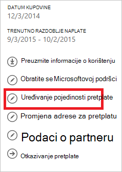

<properties
    pageTitle="Kako dodati ili promijeniti Azure administratorskih uloga | Microsoft Azure"
    description="U članku se opisuje kako dodati ili promijeniti Azure zajednički Administrator, Administrator servisa i računa administratora"
    services=""
    documentationCenter=""
    authors="genlin"
    manager="mbaldwin"
    editor=""
    tags="billing"/>

<tags
    ms.service="billing"
    ms.workload="na"
    ms.tgt_pltfrm="na"
    ms.devlang="na"
    ms.topic="article"
    ms.date="08/17/2016"
    ms.author="genli"/>

# Kako dodati ili promijeniti Azure administratorskih uloga

Postoje tri vrste administratorskih uloga u Microsoft Azure:

| Administratorska uloga   | Ograničenje  | Opis
| ------------- | ------------- |---------------|
|Administratorski račun (AA)  | 1 po račun za Azure  |Ovo je osoba koja se registrirali ili kupili Azure pretplate i ovlašten za pristup za [Centar za račun](https://account.windowsazure.com/Home/Index) i izvođenje različitih zadataka upravljanja. To obuhvaća mogućnost stvaranje pretplate, otkazivanje pretplate, promijenite naplate za pretplatu i promijenili administratora servisa.
| Administrator servisa (SA) | 1 po Azure pretplati  |Ta uloga ovlašten odjeljkom [Azure portal](https://portal.azure.com). Prema zadanim postavkama za novu pretplatu administratorski račun je Administrator servisa.|
|Suautorstvo administrator (CA) [Azure klasični portal](https://manage.windowsazure.com)|200 po pretplati| Ova uloga sadrži iste ovlasti kao Administrator servisa za pristup, no ne možete promijeniti pridruživanje pretplate Azure direktorija. |

> [AZURE.NOTE] Azure utemeljeno na ulogama Active Directory pristup kontrola (RBAC) omogućuje korisnicima želite dodati više uloge. Dodatne informacije potražite u članku [Utemeljen na Azure Active Directory uloga kontrola pristupa](./active-directory/role-based-access-control-configure.md).

> [AZURE.NOTE] Ako vam je potrebna dodatna pomoć u ovom članku u bilo kojem trenutku, ponovno se [obratiti službi za podršku](https://portal.azure.com/?#blade/Microsoft_Azure_Support/HelpAndSupportBlade) da biste dobili problem riješen brzo.

## Kako dodati administrator za pretplatu

**Portal za Azure**

1. Prijavite se na [portal za Azure](https://portal.azure.com).

2. Na izborniku koncentrator odaberite **pretplatu** > *pretplatu u koju želite da se administrator za pristup*.

    

3. U plohu pretplate odaberite **Postavke**> **korisnika**.

    
4. U plohu korisnici, odaberite **Dodaj**>**Odaberite ulogu** > **vlasnik**.

    

    **Napomena**
    - Uloga vlasnika ima isti prava pristupa zajednički administratorskog računa. Ta uloga pravo pristupa za [Azure centar za račun](https://account.windowsazure.com/subscriptions).
    - Vlasnici dodati putem [portala za Azure](https://portal.azure.com) nije moguće upravljati servisa [Azure klasični portal](https://manage.windowsazure.com).  

5. Upišite adresu e-pošte korisnika kojeg želite dodati kao vlasnik, kliknite ime korisnika, a zatim **Odaberite**.

    

**Azure klasični portal**

1. Prijavite se na [portal za Azure klasični](https://manage.windowsazure.com/).

2. U navigacijskom oknu odaberite **Postavke**> **Administratori**> **Dodaj**.  

    

3. Upišite adresu e-pošte osobe kojoj želite Dodaj kao suradnika administrator, a zatim odaberite pretplatu u koju želite zajednički administratorski pristup. 

     

Sljedeće adrese e-pošte moguće je dodati kao Administrator suautorstvo:

* **Microsoftov račun** (prijašnji Windows Live ID)  
 Koristite Microsoftov Account prijavite se na sve korisničke usmjerena Microsoftove proizvode i servise, kao što je Outlook (Hotmail), Skype (MSN), OneDrive, Windows Phone i Xbox LIVE u oblaku.
* **Račun tvrtke ili ustanove** 
 Račun tvrtke ili ustanove je račun koji je stvoren u odjeljku Azure Active Directory. Račun tvrtke ili ustanove adresa izgleda otprilike ovako: user@ &lt;domene&gt;. onmicrosoft.com

### Ograničenja i ograničenja

 * Pretplate pridruženo Azure AD direktorija (poznat i kao zadani imenik). Da biste pronašli imenika zadani je povezan s pretplatom, idite na [portal za Azure klasični](https://manage.windowsazure.com/), odaberite **Postavke** > **pretplate**. Potvrdite okvir ID pretplate da biste pronašli direktorija zadano.

 * Ako ste prijavljeni pomoću Microsoftova Account, možete dodati samo Microsoft Accounts drugih korisnika u direktoriju zadani zajednički administratorskog računa.

 * Ako ste prijavljeni pomoću računa tvrtke ili ustanove, možete dodati drugih računa tvrtke ili ustanove u tvrtki ili ustanovi zajednički administratorskog računa. Ako, na primjer, abby@contoso.com možete dodati bob@contoso.com kao Administrator servisa ili zajednički Administrator, ali ne možete dodati john@notcontoso.com osim ako john@noncontoso.com korisnika u imeniku zadano. Korisnici koji su prijavljeni pomoću računa tvrtke ili ustanove možete i dalje da biste dodali korisnike Microsoftov Account kao Administrator servisa ili zajednički administratora.

 * Moguće je da se prijavite u Azure pomoću računa tvrtke ili ustanove, ovdje su promjene Administrator servisa i zajednički administratorski račun preduvjetima:

    Način prijave| Dodavanje Microsoftova Account ili korisnika u direktoriju zadani kao CA ili Pacifička?  |Dodajte račun tvrtke ili ustanove u istoj organizaciji kao CA ili Pacifička? |Dodaj račun tvrtke ili ustanove različite tvrtke ili ustanove kao CA ili Pacifička?
    ------------- | ------------- |---------------|---------------
    Microsoftov račun |Da|ne|ne
    Račun tvrtke ili ustanove|Da|Da|ne

## Kako promijeniti Administrator servisa za pretplatu

Samo Administrator računa možete promijeniti Administrator servisa za pretplatu.

1. Prijavite se u [Centar za račun Azure](https://account.windowsazure.com/subscriptions) pomoću administratorski račun.

2. Odaberite pretplatu u koju želite promijeniti.

3. Na desnoj strani kliknite **pretplatu za uređivanje** pojedinosti.  

    

4. U okviru **ADMINISTRATOR SERVISA** unesite adresu e-pošte u nove administratora servisa sustava.  

    

## Kako promijeniti administratorski račun

Da biste prenijeli vlasništvo nad račun za Azure na drugi račun potražite u članku [Prijenos vlasništvo nad Azure pretplate](billing-subscription-transfer.md).

## Daljnji koraci

* Da biste saznali više o kako se kontrolira pristup resursa u Microsoft Azure, potražite u članku [objašnjenje resursa pristup servisu Azure](./active-directory/active-directory-understanding-resource-access.md)

* Dodatne informacije o odnosa Azure Active Directory u pretplatu za Azure, potražite u članku [kako Azure pretplate pridružuju Azure Active Directory](./active-directory/active-directory-how-subscriptions-associated-directory.md)

* Dodatne informacije o odnosa Azure Active Directory u pretplatu za Azure, potražite u članku [Dodjela administratorskih uloga u Azure Active Directory](./active-directory/active-directory-assign-admin-roles.md)

> [AZURE.NOTE] Ako i dalje imate dodatno pitanja, ponovno se [obratiti službi za podršku](https://portal.azure.com/?#blade/Microsoft_Azure_Support/HelpAndSupportBlade) da biste dobili problem riješen brzo.
