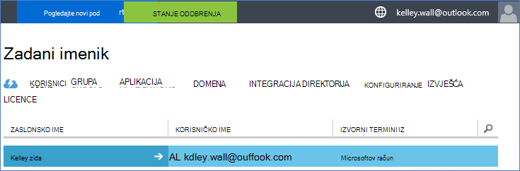
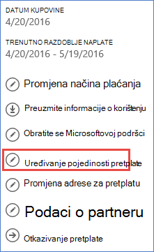
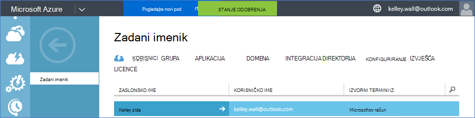

<properties
    pageTitle="Korištenje klijentu za Office 365 s pretplatom na Azure | Microsoft Azure"
    description="Saznajte kako dodati direktorija za Office 365 (klijentsko) Azure pretplatu da bi pridruživanja."
    services=""
    documentationCenter=""
    authors="JiangChen79"
    manager="mbaldwin"
    editor=""
    tags="billing,top-support-issue"/>

<tags
    ms.service="billing"
    ms.workload="na"
    ms.tgt_pltfrm="ibiza"
    ms.devlang="na"
    ms.topic="article"
    ms.date="09/16/2016"
    ms.author="cjiang"/>

# Pridruživanje klijentu za Office 365 Azure pretplate
Ako koju ste nabavili Azure i Office 365 pretplate zasebno u prošlosti, a sada ga želite dati pristup klijentu za Office 365 s Azure pretplate, jednostavno je da biste to učinili. U ovom se članku objašnjava kako.

> [AZURE.NOTE] Ovaj članak ne odnosi na kupci ugovor Enterprise (EA).

## Brze upute
Da biste se pridružili klijentu za Office 365 Azure pretplatu, koristite račun za Azure da biste dodali klijentu za Office 365, a zatim pretplate Azure pridružiti klijentu za Office 365.

## Detaljne upute
U ovom scenariju Kelley zida je korisnik pretplate u odjeljku račun za Azure kelley.wall@outlook.com. Kelley ima pretplatu na Office 365 u odjeljku račun kelley.wall@contoso.onmicrosoft.com. Sada Kelley želi da biste pristupili klijentu za Office 365 Azure pretplate.

### Preduvjeti
Za pridruživanje ispravno funkcionirao, potrebne su sljedeće preduvjete:

- Potreban vam je vjerodajnice administratora servisa Azure pretplate. Dodatnih administratora nije moguće izvesti podskup korake.
- Potreban vam je vjerodajnice globalni administrator klijentu za Office 365.
- Adresu e-pošte od administratora servisa moraju se nalaziti u klijentu za Office 365.
- Adresu e-pošte od administratora servisa mora odgovarati koji od klijentu za Office 365 globalnog administratora.
- Ako trenutno koristite adresu e-pošte koja je Microsoftov račun i račun tvrtke ili ustanove, privremeno promijeniti administrator servisa Azure pretplatu za korištenje drugog Microsoftova računa. Možete stvoriti novi Microsoftov račun na [stranicu prijava za Microsoftov račun](https://signup.live.com/).

Da biste promijenili administratora servisa, slijedite ove korake:

1. Prijavite se na [portal za upravljanje računima](https://account.windowsazure.com/subscriptions).
2. Odaberite pretplatu u koju želite promijeniti.
3. Odaberite **Uređivanje pojedinosti pretplate**.

    

4. U okviru **ADMINISTRATOR SERVISA** unesite adresu e-pošte novi administrator servisa.

    

### Pridruživanje klijentu za Office 365 Azure pretplate
Da biste se pridružili klijentu za Office 365 Azure pretplatu, slijedite ove korake:

1.  Prijavite se na [portal za upravljanje računa](https://account.windowsazure.com/subscriptions) s ovlastima administratora servisa.
2.  U lijevom oknu odaberite **Servisa ACTIVE DIRECTORY**.

    

    > [AZURE.NOTE] Prikazat će se ne klijentu za Office 365. Ako vidite, prijeđite na sljedeći korak.

    

3. Dodavanje klijentu za Office 365 u pretplatu za Azure.

    na. Odaberite **NOVO** > **DIREKTORIJA** > **PRILAGOĐENE Stvori**.

    

    b. Na stranici **Dodavanje direktorija** u **IMENIKU**, odaberite **Koristi postojeći imenik**. Zatim odaberite **sam spremni ste odjavljeni sada**i odaberite **dovrši** .

    

    c. Nakon što ste odjavljeni, prijavite se pomoću vjerodajnica globalni administrator za klijentski sustav Office 365.

    

    d. Odaberite **Dalje**.

    

    e. Odaberite **Odjavi se sada**.

    

    f. Prijavite se na [portal za upravljanje računa](https://account.windowsazure.com/subscriptions) s ovlastima administratora servisa.

    

    g. Trebali biste vidjeti klijentu za Office 365 na nadzornoj ploči.

    

4. Promijenite direktorij povezan s pretplatom Azure.

    na. Odaberite **Postavke**.

    

    b. Odaberite pretplatu Azure, a zatim **Uređivanje DIREKTORIJA**.
    

    c. Odaberite **Dalje** .

    

    > [AZURE.WARNING] Primit ćete upozorenje da će ukloniti sve dodatnih administratora.

    

    >[AZURE.WARNING] Osim toga, svi korisnici [na temelju uloga kontrole pristupa (RBAC)](./active-directory/role-based-access-control-configure.md) s pristupom kome je dodijeljeno u postojeće grupe resursa i bit će uklonjene. Međutim, upozorenja primate samo spominjanja uklanjanje dodatnih administratora.

    

    d. Odaberite **dovrši** .

5. Sada možete dodati račune za Office 365 za tvrtke ili ustanove kao dodatnih administratora klijenta Azure Active Directory.

    na. Odaberite karticu **ADMINISTRATORI** , a zatim odaberite **DODAJ**.

    

    b. Unesite račun tvrtke ili ustanove klijentu za Office 365, odaberite Azure pretplatu, a zatim odaberite **dovrši** .

    

    c. Vratite se na karticu **ADMINISTRATORI** . Trebali biste vidjeti račun tvrtke ili ustanove prikazuje kao zajednički administrator.

    

6. Sljedeće možete testirati pristup zajedničkoj administratora sustava.

    na. Odjavite se iz portala za upravljanje računima.

    b. Otvorite [portal za upravljanje računima](https://account.windowsazure.com/subscriptions) ili [Azure portal](https://portal.azure.com/).

    c. Ako je Azure stranica za prijavu u veze **prijavite pomoću računa tvrtke ili ustanove**, odaberite vezu. U suprotnom, preskočite ovaj korak.

    

    d. Unesite vjerodajnice za suautorstvo administrator, a zatim odaberite **prijavite se u**.

    

## Daljnji koraci
Scenariji za povezane obuhvaćaju sljedeće:

- Već imate pretplatu na Office 365 i spremni ste za Azure pretplatu, ali želite koristiti postojeće korisničke račune za Office 365 za pretplatu Azure.
- Su Azure pretplatnik, a želite dobiti pretplatu na Office 365 za korisnike u postojeće instanci Azure Active Directory.

Da biste saznali kako izvršiti sljedeće zadatke, potražite u članku [Korištenje postojećih Office 365 račun s pretplatom Azure i obrnuto](billing-use-existing-office-365-account-azure-subscription.md).
