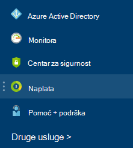
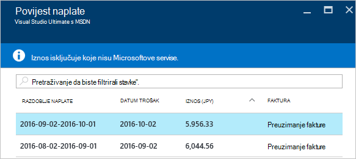

<properties
    pageTitle="Kako preuzeti vaše Azure naplata podataka o korištenju računa i dnevnu | Microsoft Azure"
    description="U članku se opisuje kako preuzeti Azure račun za naplatu i dnevnih podataka o korištenju"
    services=""
    documentationCenter=""
    authors="genlin"
    manager="mbaldwin"
    editor=""
    tags="billing"
    />

<tags
    ms.service="billing"
    ms.workload="na"
    ms.tgt_pltfrm="na"
    ms.devlang="na"
    ms.topic="article"
    ms.date="10/10/2016"
    ms.author="genli"/>

# Kako preuzeti vaše Azure naplata podataka o korištenju računa i svaki dan

> [AZURE.NOTE] Ako vam je potrebna dodatna pomoć u ovom članku u bilo kojem trenutku, ponovno se [obratiti službi za podršku](https://portal.azure.com/?#blade/Microsoft_Azure_Support/HelpAndSupportBlade) da biste dobili problem riješen brzo.

Kao administrator račun za Azure možete pogledati račun za naplatu i dnevnih podatke o korištenju na [portal za Azure](https://portal.azure.com) ili [Azure centar za račun](https://account.windowsazure.com/subscriptions). Evo kako:

## Portal za Azure

1. Prijavite se na [portal za Azure](https://portal.azure.com) administratorskog računa.

    >[AZURE.NOTE] Samo administrator računa imaju dozvolu za pristup podacima za naplatu. Dodatne informacije o tome kako saznati tko je administratorski račun pretplate potražite u članku [Najčešća pitanja](billing-subscription-transfer.md#faq).

2. Na izborniku koncentrator odaberite **naplata**. Na plohu **naplate** možete pronaći neki korisne informacije kao što su sljedeći datum plaćanja.

    
3. U odjeljku **pretplatu troškovi** odaberite pretplatu u koju želite prikazati.

    
4. Kliknite **naplata i korištenje**.

    

5. Na plohu **povijesti naplate** kliknite **Preuzimanje fakture** omogućili prikaz kopije računa. Kliknite na razdoblje naplate za prikaz dnevnih podataka o korištenju.

    

## Centar za račun za Azure

1. Prijavite se u [Centar za račun Azure](https://account.windowsazure.com/subscriptions) administratorskog računa.
2. Odaberite pretplatu za koju želite da podaci fakture i korištenje.
3. Odaberite **POVIJESTI NAPLATE**.  
4. Vidjet ćete svojih izjava za web-mjesto zadnje šest razdoblja naplate i u okvir za trenutno razdoblje unbilled.   
5. Odaberite **Pogledajte izjavu o trenutnom** da biste vidjeli Procjena naplata trenutku generirana procijenjenu vrijednost. Ove informacije samo ažurira svakodnevno i ne obuhvaća sve upotrebe. Mjesečni račun mogu se razlikovati od ovaj članak Procjena uvjeta.   
6. Odaberite **Račun za preuzimanje** da biste pogledali kopiju zadnjeg računa.  
7. Odaberite **Preuzimanje korištenje** da biste preuzeli dnevnih podatke o korištenju u CSV datoteku. 

> [AZURE.NOTE] Ako i dalje imate dodatno pitanja, ponovno se [obratiti službi za podršku](https://portal.azure.com/?#blade/Microsoft_Azure_Support/HelpAndSupportBlade) da biste dobili problem riješen brzo.
