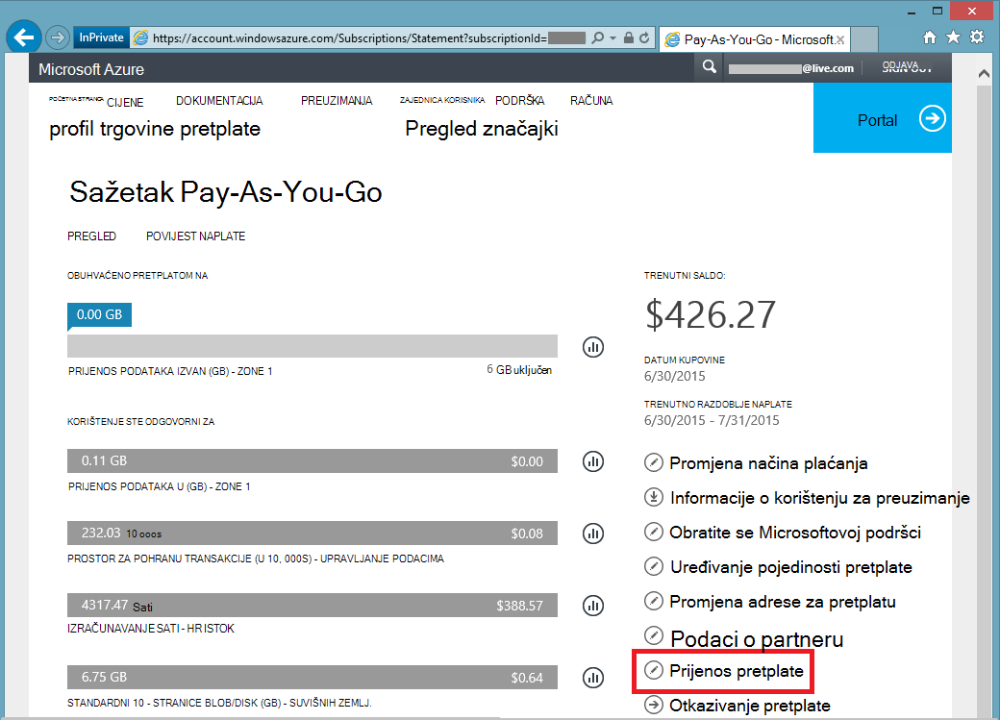

<properties
   pageTitle="Prijenos vlasništvo nad Azure pretplate | Microsoft Azure"
   description="Kako prenijeti Azure pretplate na neki drugi korisnik i nekih često postavljana pitanja o postupku"
   services=""
   documentationCenter=""
   authors="genlin"
   manager="stevenpo"
   editor=""
   tags="billing,top-support-issue"/>

<tags
   ms.service="billing"
   ms.workload="na"
   ms.tgt_pltfrm="na"
   ms.devlang="na"
   ms.topic="article"
   ms.date="10/10/2016"
   ms.author="genli"/>

# Prijenos vlasništvo nad Azure pretplate

Želite:

- Nije potrebno rukom preko naplata vlasništvo nad pretplate Azure nekome drugome?
- Želite li promijeniti račun koji se koristi da biste se registrirali za Azure? Možda koristi Microsoftova Account ali Predviđeni da koristite tvrtke ili obrazovne ustanove račun umjesto toga?
- Želite prijeći pretplate Azure iz imenika jedne na drugu?
- Imate Azure i Office 365 u različitim klijenata i želite konsolidirati?

Možete odmah to jednostavno u u programu Microsoft Azure račun centra - Pay-As-You-Go, MSDN, paket akcija ili BizSpark pretplate.  Dodali smo mogućnost prijenos pretplate na neki drugi korisnik. Drugim riječima, sada možete promijeniti administrator računa na sve Pay-As-You-Go, MSDN, paket akcija ili BizSpark pretplate da ste vlasnik, bez obzira na to koji države raditi u. Sada podržavamo prijenos Azure Marketplace Nabava za takvim pretplate.

> [AZURE.NOTE] Da biste promijenili pretplate različitu ponudu, potražite u članku [Prijelaz Azure pretplatu za drugu ponudu](billing-how-to-switch-azure-offer.md) dodatne informacije. Ako vam je potrebna dodatna pomoć u ovom članku u bilo kojem trenutku, provjerite [obratite službi za podršku](https://portal.azure.com/?#blade/Microsoft_Azure_Support/HelpAndSupportBlade) da biste dobili problem riješen brzo.

## Kako prenijeti vlasništvo nad Azure pretplate

> [AZURE.VIDEO transfer-an-azure-subscription]

1.  Prijavite se na adresi <https://account.windowsazure.com/Subscriptions>. Morate biti administrator računa za izvođenje o prijenosu vlasništvo. Dodatne informacije o tome kako saznati tko je administratorski račun pretplate potražite u članku [Najčešća pitanja](#faq).

2.  Odaberite pretplatu za prijenos.

3.  Kliknite mogućnost **Prijenos pretplate** .

    

4.  Slijedite upute da biste odredili primatelja.

    

5.  Primatelj automatski će primiti poruku e-pošte s vezom za prihvaćanje.

    

6.  Primatelj klikne vezu, a slijedi upute, uključujući unos svoje podatke o plaćanju.

    

    

7. Uspjeh! Sada se prenose pretplate.

## Najčešća pitanja

-   **Kako mogu znati tko je administratorski račun pretplate?**

    Možete potvrditi tko je administratorski račun pretplate na sljedeći način:

    1. Prijavite se na [portal za Azure](https://portal.azure.com).
    2. Na izborniku koncentrator odaberite **pretplatu**.
    3. Odaberite pretplatu koju želite provjeriti, a zatim odaberite **Postavke**.
    4. Odaberite **Svojstva**. Administratorski račun pretplate prikazat će se u okviru **Administratorskog računa** .  

-   **Ne pretplate prijenos rezultiraju nedostupnost bilo koji servis?**

    Postoji bez utjecaja na servis. To učinkovito otkazuje pretplate u odjeljku administratorski račun za trenutni i stvara novi u odjeljku račun primatelja, ali temeljni servisa Azure pridružuje na novu pretplatu. ID pretplate ostaje isto.

-   **Kako koristiti ovaj mehanizam da biste promijenili direktorija za pretplatu?**-   
    Azure pretplata se stvara u direktoriju koji pripada administratorskog računa. Tako, da biste promijenili imenika, samo transfer pretplate na korisnički račun u imeniku cilj. Kada se dovrši korake da biste prihvatili prijenos, pretplate automatski će se premjestiti direktorij cilj.

-   **Ako mogu preuzeti vlasništvo naplate pretplate iz druge tvrtke ili ustanove, oni i dalje će imati pristup Moje resursima?**

    Ako je pretplata prenijeli na drugi klijent, korisnici povezan s prethodne klijentu će pristup izgubiti s pretplatom. Čak i ako se korisnik nije administrator servisa ili ko administrator odjednom, oni mogu i dalje imate pristup pretplati putem ostale sigurnosne mehanizme. To obuhvaća:
    - Upravljanje potvrde dozvolite korisniku administratorska prava za resurse za pretplatu. Dodatne informacije potražite u članku [Stvaranje i prijenos upravljanje certifikat za Azure](https://msdn.microsoft.com/library/azure/gg551722.aspx)
    -   Tipkovni prečaci za servise kao što su prostora za pohranu. Dodatne informacije potražite u članku [Prikaz, Kopiraj i regenerate prostora za pohranu pristupnih tipki](storage-create-storage-account.md#view-copy-and-regenerate-storage-access-keys)
    -   Daljinski pristup vjerodajnice za servise kao što su Azure virtualnim strojevima

    Ovo nije cijeli popis. Primatelj razmislite o ažuriranju sve tajne povezan sa servisom ako im je to potrebno ograničiti pristup svojim resursi. Većina resursa može se ažurirati na sljedeći način:

    1.   Idite na portal za Azure: [ *https://portal.azure.com*](https://portal.azure.com)

    2.    Kliknite Pregledaj sve -&gt; svi resursi

    3.    Odaberite resurs. Otvorit će se plohu resursa.

    4.    U plohu resursa kliknite **Postavke**. Ovdje možete pogledati i ažurirati postojeće tajne.

-   **Ako prijenos pretplate u sredini ciklusu naplate ne primatelja plaćanje za cijelu naplata ciklusa?**

    Pošiljatelj je zadužen za isplatu za sve upotrebe koja prijavljena je do točke dovršetka prijenosa. Primatelj je zadužen za korištenje prijavljenih iz vrijeme prijenosa nadalje. Možda postoje neka korištenje koji došlo je do prije prijenosa, ali prijavljena je naknadno. To će biti priložene uz fakture primatelja.

-   **Mora li primatelj pristup korištenje i povijest naplate?**

    Trenutno objavljena primatelju samo podatke je iznos zadnjeg računa (ili trenutni saldo, ako je pretplata prenijeli prije nego što je generirana prvi računa). Ostale upotrebe i povijest naplate ne prenose se s pretplatom.

-   **Mogu li se ponudu mijenjati tijekom prijenosa?**

    Ponudu mora ostati isto. Da biste promijenili tu ponudu, morate se [obratiti službi za podršku](http://go.microsoft.com/fwlink/?LinkID=619338).

-   **Mogu li prenijeti pretplatu na korisnički račun u drugom zemlji?**

    Ne, trenutno nije podržano. Primatelja korisnički račun mora biti u istoj države.

-   **Može li primatelj pomoću mehanizam za različite plaćanja?**

    Da. Postoje ograničenja ovdje: sada pretplate povijesti naplate je podijeljen u dva računa. No prednost je li to možete učiniti bez potrebe za [obratiti službi za podršku](http://go.microsoft.com/fwlink/?LinkID=619338).

-   **Će način plaćanja neće utjecati kada se prenose Azure pretplate?**

    Da biste prihvatili prijenos pretplatu, kreditnom karticom ili sličan način plaćanja mora se navesti za plaćanje pretplate. Na primjer, ako Teo prenosi pretplatu Ane i Ane Prihvati prijenos, Ane morate navesti način plaćanja kojima ona će se koristiti za plaćanje pretplate. Po dovršetku prijenos Teo će se naplatiti za pretplatu on prenijeti Ane.

## Daljnji koraci nakon prihvaćanja vlasništvo pretplate

1. Sada ste Administrator računa. Pregledajte i ažuriranje Administrator servisa i dodatnih administratora. Upravljanje administratorima [Azure klasični portal](https://manage.windowsazure.com) tako da otvorite postavke. [Dodatne informacije](http://go.microsoft.com/fwlink/?LinkID=533293).
2. Kontrola pristupa na temelju uloga (RBAC) možete koristiti i za svoju pretplatu i usluge. Posjetite [Azure portal](https://portal.azure.com) [Dodatne informacije o RBAC](http://go.microsoft.com/fwlink/?LinkID=544802)
3. Ažurirajte vjerodajnicama servisa za ovu pretplatu. To obuhvaća:
    - Upravljanje potvrde dozvolite korisniku administratorska prava za resurse za pretplatu. Dodatne informacije potražite u članku [Stvaranje i prijenos na upravljanje certifikat za Azure](https://msdn.microsoft.com/library/azure/gg551722.aspx)
    -   Tipkovni prečaci za servise kao što su prostora za pohranu. Dodatne informacije potražite u članku [Prikaz, Kopiraj i regenerate prostora za pohranu pristupnih tipki](storage-create-storage-account.md#view-copy-and-regenerate-storage-access-keys)
    -   Daljinski pristup vjerodajnice za servise kao što su Azure virtualnim strojevima
4. Ažuriranje naplata upozorenja za ovu pretplatu u [Centar za račun Azure](https://account.windowsazure.com/Subscriptions)  [Saznajte više](http://go.microsoft.com/fwlink/?LinkID=533292)
5.  Ako radite s partnerom, razmislite o ažuriranju partnerskog ID-a na ovu pretplatu. To možete učiniti u [Centar za Azure računa](https://account.windowsazure.com/Subscriptions).

> [AZURE.NOTE] Ako i dalje imate dodatno pitanja, ponovno se [obratiti službi za podršku](https://portal.azure.com/?#blade/Microsoft_Azure_Support/HelpAndSupportBlade) da biste dobili problem riješen brzo.
