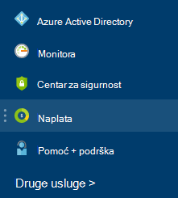

<properties
    pageTitle="Razumijevanje Azure vanjskih servisa naknade | Microsoft Azure"
    description="Saznajte više o naplata vanjske servise, prijašnji trgovine, naknade u Azure."
    services=""
    documentationCenter=""
    authors="adpick"
    manager="felixwu"
    editor=""
    tags="billing"
    />

<tags
    ms.service="billing"
    ms.workload="na"
    ms.tgt_pltfrm="na"
    ms.devlang="na"
    ms.topic="article"
    ms.date="10/12/2016"
    ms.author="adpick"/>

# Razumijevanje naplata Azure vanjskih servisa

U ovom se članku objašnjava naplata vanjske servise u Azure. Koristi vanjski services pozivanje trgovine narudžbe. Vanjske servise nudi neovisno servisa dobavljačima, ali su potpuno integrirani unutar Azure zajednici. Saznajte kako:

- Prepoznavanje vanjske servise
- Objašnjenje kako naplata razlikuje se od drugih Azure resursa
- Prikaz i pratiti sve troškove vam ako skupi koristi vanjske servise
- Upravljanje vanjskim servisom narudžbe i kako platiti za njih

## Što su Azure vanjske servise?

Koristi vanjski services pozivanje trgovine Windows Azure. Općenito govoreći, oni se usluge objavljuje proizvođačima dostupne za Azure. Na primjer, ClearDB i SendGrid su vanjske servise koje možete kupiti u Azure, ali nisu objavljene Microsoft.

### Prepoznavanje vanjske servise

Prilikom dodjele resursa novog vanjskog servisa ili resursa, kako je prikazano Upozorenje:

>[AZURE.NOTE] Vanjske servise koje su objavljene tvrtkama koje nisu Microsoft, ali ponekad Microsoftove proizvode i kategorizirane kao vanjske servise.

### Vanjske servise zasebno se naplaćuju

Vanjske servise smatraju pojedinačne narudžbe unutar Azure pretplatu. Razdoblje naplate za svaki servis je postavljen kad kupite servis. Ne želite da se zbuniti s razdoblje naplate pretplate na kojem ste kupili ga. Primite zasebnom računi i kreditne kartice naplatiti zasebno.

### Svaki vanjski servis sadrži različite naplate model

Neki servisi za naplatu pay-as-you-go način dok drugi koristiti mjesečni modela na temelju plaćanja. Potrebne su vam kreditnom karticom za Azure vanjske servise, ne možete kupiti vanjske usluge s ugovorima o fakturi plaćanje.

### Mjesečni besplatne kredita ne možete koristiti za vanjske servise

Ako koristite Azure pretplatu koja obuhvaća [besplatnu kredita](https://azure.microsoft.com/pricing/spending-limits/), nije moguće primijeniti na vanjskim servisom računi. Pomoću kreditnom karticom vanjske servise za kupnju.

## Prikaz vanjskim servisom trošite i povijest

Možete prikazati popis vanjskih usluga koje se nalaze na svaku pretplatu unutar [Azure portal](https://portal.azure.com/): 

1. Prijavite se na [portal za Azure](https://portal.azure.com/) i [otiđite do plohu **naplata** ](https://portal.azure.com/?flight=1#blade/Microsoft_Azure_Billing/BillingBlade).

     
  
2. U odjeljku **pretplatu troškovi** odaberite pretplatu u koju želite prikazati. 
   
    

3. Kliknite **vanjske servise**.

    

4. Trebali biste vidjeti svaku od narudžbenice vanjskih servisa, naziv izdavača, servis sloju ste kupili, naziv koji ste dali resursa i trenutno stanje narudžbi. Odaberite vanjske servisa da biste vidjeli zadnjih računi.

    

5. Na tom mjestu možete pogledati prošlih računa iznosi uključujući analitički Porezno.

    

## Upravljanje načina plaćanja za vanjske servisa narudžbe

Ažurirajte načinima plaćanja za narudžbe vanjsku uslugu iz [Centra za račun](https://account.windowsazure.com/).

> [AZURE.NOTE] Ako ste kupili pretplatu pomoću računa tvrtke ili obrazovne ustanove, trebali biste se [obratiti službi za podršku](https://portal.azure.com/?#blade/Microsoft_Azure_Support/HelpAndSupportBlade) da biste promijenili način plaćanja.

1. Prijavite se u [Centar za račun](https://account.windowsazure.com/) i [prijeđite na karticu **marketplace** ](https://account.windowsazure.com/Store)

    

2. Odaberite vanjske servis želite upravljati

    

3. Na desnoj strani stranice kliknite **Promijeni način plaćanja** . Sljedeću vezu donosi različite portal za upravljanje način plaćanja.
    
    

4. Kliknite **Uređivanje informacija** i slijedite upute da biste ažurirali podatke o plaćanju.

    
    
## Otkazivanje vanjskih servisu

Ako želite otkazati vanjskih servisu trebate izbrisati resursa za [Azure portal](https://portal.azure.com).

## Potrebna vam je pomoć? Obratite se podršci.

Ako i dalje imate dodatno pitanja, ponovno se [obratiti službi za podršku](https://portal.azure.com/?#blade/Microsoft_Azure_Support/HelpAndSupportBlade) da biste dobili problem riješen brzo.
