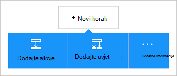

<properties
    pageTitle="Poveznik za Dynamics CRM Online dodati logiku aplikacija | Microsoft Azure"
    description="Stvorite logiku aplikacije sa servisom Azure aplikacije. Na Dynamics CRM Online davatelj veze sadrži API-JA za rad sa entiteti na Dynamics CRM Online."
    services="logic-apps"    
    documentationCenter=""     
    authors="MandiOhlinger"    
    manager="erikre"    
    editor="" 
    tags="connectors" />

<tags
ms.service="logic-apps"
ms.devlang="na"
ms.topic="article"
ms.tgt_pltfrm="na"
ms.workload="integration"
ms.date="08/15/2016"
ms.author="mandia"/>

# Početak rada s poveznik za Dynamics CRM Online
Povezivanje s Dynamics CRM Online da biste stvorili novi zapis, ažurirajte stavke i drugo. CRM Online možete učiniti sljedeće:

- Sastavljanje vaše tvrtke tijek utemeljenih na podacima koje ste dobili od CRM Online. 
- Korištenje akcije koje brisanje zapisa, zatražite entiteti i drugo. Ove se radnje dobiti odgovor, a zatim unesite dostupne za ostale akcije izlaz. Ako, na primjer, prilikom ažuriranja stavke u CRM, možete poslati poruku e-pošte pomoću sustava Office 365.

U ovoj se temi objašnjava korištenje poveznik za Dynamics CRM Online u aplikaciji logiku i i popise okidača i akcija.

>[AZURE.NOTE] Ovu verziju članka primjenjuje se na logike aplikacije Općenito dostupan (GA).

Da biste saznali više o aplikacijama logike, potražite u članku [što su logike aplikacije](../app-service-logic/app-service-logic-what-are-logic-apps.md) i [Stvaranje logike aplikacije](../app-service-logic/app-service-logic-create-a-logic-app.md).

## Povezivanje sa sustavom Dynamics CRM Online

Logika aplikacije možete pristupiti bilo koji servis, prvo stvorite *vezu* sa servisom. Veze navedene veze između logike aplikacije i drugih servisa. Na primjer, da biste se povezali sa sustavom Dynamics, najprije morate Dynamics CRM Online *veze*. Da biste stvorili vezu, unesite vjerodajnice obično koristite za pristup servisu koji se želite povezati. Stoga sa sustavom Dynamics, unesite vjerodajnice na račun za Dynamics CRM Online da biste stvorili vezu.

### Stvaranje veze

>[AZURE.INCLUDE [Steps to create a connection to Dynamics CRM Online Connection Provider](../../includes/connectors-create-api-crmonline.md)]

## Koristite okidač

Okidač je događaja koji se mogu koristiti za pokretanje tijeka rada definirano u aplikaciji logike. Okidača "ankete" usluge na interval i učestalost koju želite. [Dodatne informacije o okidača](../app-service-logic/app-service-logic-what-are-logic-apps.md#logic-app-concepts).

1. U aplikaciji logike upišite "dynamics" dobit ćete popis s okidačima:  

    

2. Odaberite **Dynamics CRM Online – stvaranja zapisa**. Ako veza već postoji, odaberite tvrtke ili ustanove i entitet s padajućeg popisa.

    

    Ako se od vas zatraži prijavite, unesite znak u detalja da biste stvorili vezu. [Stvaranje veza](connectors-create-api-crmonline.md#create-the-connection) u nastavku navedeni koraci. 

    > [AZURE.NOTE] U ovom primjeru aplikaciju logike pokreće prilikom stvaranja zapisa. Da biste vidjeli rezultate ovog okidača, dodajte drugih akcija koje vam šalje poruku e-pošte. Ako, na primjer, dodajte akciju Office 365 *poslati poruku e-pošte* koje poruke e-pošte koju kada se doda novi zapis. 

3. Odaberite gumb **Uredi** , a zatim postavite **Učestalost** i **Interval** vrijednosti. Ako, na primjer, ako želite da se okidača za svakih 15 minuta, pa **Učestalost** postavite **minutu**i postavite **Interval** **15**. 

    

4. **Spremite** promjene (gornjem lijevom kutu na alatnoj traci). Pokrenite aplikaciju logike se sprema i možda je automatski omogućena.

## Koristite akciju

Akciju je postupak provodi definirano u aplikaciji logike tijeka rada. [Dodatne informacije o akcije](../app-service-logic/app-service-logic-what-are-logic-apps.md#logic-app-concepts).

1. Odaberite znak plus. Pogledajte nekoliko mogućnosti: **Dodaj akciju**, **Dodaj uvjet**ili neke **Dodatne** mogućnosti.

    

2. Odaberite **Dodaj akciju**.

3. U tekstni okvir upišite "dynamics" da biste dobili popis dostupnih akcija.

    

4. U našem primjeru odaberite **Dynamics CRM Online – ažuriranje zapisa**. Ako se veza već postoji, odaberite **Naziv tvrtke ili ustanove**, **Naziv entitet**i druga svojstva:  

    

    Ako su za podatke o vezi od vas zatraži, unesite detalje da biste stvorili vezu. [Stvaranje veze](connectors-create-api-crmonline.md#create-the-connection) u ovoj se temi opisuju tih svojstava. 

    > [AZURE.NOTE] U ovom primjeru ažuriramo postojeći zapis u CRM Online. Izlaz iz drugog okidača možete koristiti za ažuriranje zapisa. Na primjer, dodati okidača SharePoint *prilikom izmjene postojeće stavke* . Zatim dodajte akciju *Ažuriranje zapisa* CRM Online koja koristi polja sustava SharePoint da biste ažurirali postojeći zapis u CRM Online. 

5. **Spremite** promjene (gornjem lijevom kutu na alatnoj traci). Pokrenite aplikaciju logike se sprema i možda je automatski omogućena.

## Tehničke pojedinosti

## Okidača

|Pokretanje | Opis|
|--- | ---|
|[Pri stvaranju zapisa](connectors-create-api-crmonline.md#when-a-record-is-created)|Prilikom stvaranja objekta u CRM, pokreće se u tijeku.|
|[Kada se ažurira zapis](connectors-create-api-crmonline.md#when-a-record-is-updated)|Prilikom izmjene objekta u CRM, pokreće se u tijeku.|
|[Prilikom brisanja zapisa](connectors-create-api-crmonline.md#when-a-record-is-deleted)|Nakon brisanja objekta u CRM, pokreće se u tijeku.|

## Akcija

|Akcija|Opis|
|--- | ---|
|[Popis zapisa](connectors-create-api-crmonline.md#list-records)|Ovaj postupak dohvaća zapise za entitet.|
|[Stvorite novi zapis](connectors-create-api-crmonline.md#create-a-new-record)|Ovaj postupak stvara novi zapis entitet.|
|[Dohvaćanje zapisa](connectors-create-api-crmonline.md#get-record)|Ovaj postupak može vidjeti navedeni zapis za entitet.|
|[Brisanje zapisa](connectors-create-api-crmonline.md#delete-a-record)|Ovaj postupak brisanje zapisa iz programa entitet zbirke.|
|[Ažuriranje zapisa](connectors-create-api-crmonline.md#update-a-record)|Ovaj postupak ažurira postojeći zapis za entitet.|

### Detalji o okidača i akcija

U ovom ćete odjeljku potražite u članku određene detalje o svakom okidača i akcija, uključujući obavezan ili nije unos svojstva i sve odgovarajuće izlaz pridružene poveznik.

#### Pri stvaranju zapisa
Prilikom stvaranja objekta u CRM, pokreće se u tijeku. 

|Naziv svojstva| Zaslonsko ime|Opis|
| ---|---|---|
|skup podataka *|Naziv tvrtke ili ustanove|Naziv tvrtke ili ustanove CRM kao što su Contoso|
|Tablica *|Naziv entitet|Naziv entitet|
|$skip|Preskoči numeriranje|Broj stavki da biste preskočili (zadani = 0)|
|$top|Maksimalna Get Count|Maksimalan broj stavki da biste dobili (zadani = 256)|
|$filter|Filtriranje upita|Upit ODATA filtar da biste ograničili stavke vraćaju|
|$orderby|Poredaj po|Upit orderBy ODATA za određivanje redoslijeda stavki|

Zvjezdicu (*), znači da je svojstvo obavezno.

##### Detalji o Izlaz
ItemsList

| Naziv svojstva | Vrsta podataka |
|---|---|
|vrijednost|polja|

#### Kada se ažurira zapis
Prilikom izmjene objekta u CRM, pokreće se u tijeku. 

|Naziv svojstva| Zaslonsko ime|Opis|
| ---|---|---|
|skup podataka *|Naziv tvrtke ili ustanove|Naziv tvrtke ili ustanove CRM kao što su Contoso|
|Tablica *|Naziv entitet|Naziv entitet|
|$skip|Preskoči numeriranje|Broj stavki da biste preskočili (zadani = 0)|
|$top|Maksimalna Get Count|Maksimalan broj stavki da biste dobili (zadani = 256)|
|$filter|Filtriranje upita|Upit ODATA filtar da biste ograničili stavke vraćaju|
|$orderby|Poredaj po|Upit orderBy ODATA za određivanje redoslijeda stavki|

Zvjezdicu (*), znači da je svojstvo obavezno.

##### Detalji o Izlaz
ItemsList

| Naziv svojstva | Vrsta podataka |
|---|---|
|vrijednost|polja|

#### Prilikom brisanja zapisa
Nakon brisanja objekta u CRM, pokreće se u tijeku. 

|Naziv svojstva| Zaslonsko ime|Opis|
| ---|---|---|
|skup podataka *|Naziv tvrtke ili ustanove|Naziv tvrtke ili ustanove CRM kao što su Contoso|
|Tablica *|Naziv entitet|Naziv entitet|
|$skip|Preskoči numeriranje|Broj stavki da biste preskočili (zadani = 0)|
|$top|Maksimalna Get Count|Maksimalan broj stavki da biste dobili (zadani = 256)|
|$filter|Filtriranje upita|Upit ODATA filtar da biste ograničili stavke vraćaju|
|$orderby|Poredaj po|Upit orderBy ODATA za određivanje redoslijeda stavki|

Zvjezdicu (*), znači da je svojstvo obavezno.

##### Detalji o Izlaz
ItemsList

| Naziv svojstva | Vrsta podataka |
|---|---|
|vrijednost|polja|

#### Popis zapisa
Ovaj postupak dohvaća zapise za entitet. 

|Naziv svojstva| Zaslonsko ime|Opis|
| ---|---|---|
|skup podataka *|Naziv tvrtke ili ustanove|Naziv tvrtke ili ustanove CRM kao što su Contoso|
|Tablica *|Naziv entitet|Naziv entitet|
|$skip|Preskoči numeriranje|Broj stavki da biste preskočili (zadani = 0)|
|$top|Maksimalna Get Count|Maksimalan broj stavki da biste dobili (zadani = 256)|
|$filter|Filtriranje upita|Upit ODATA filtar da biste ograničili stavke vraćaju|
|$orderby|Poredaj po|Upit orderBy ODATA za određivanje redoslijeda stavki|

Zvjezdicu (*), znači da je svojstvo obavezno.

##### Detalji o Izlaz
ItemsList

| Naziv svojstva | Vrsta podataka |
|---|---|
|vrijednost|polja|

#### Stvorite novi zapis
Ovaj postupak stvara novi zapis entitet. 

|Naziv svojstva| Zaslonsko ime|Opis|
| ---|---|---|
|skup podataka *|Naziv tvrtke ili ustanove|Naziv tvrtke ili ustanove CRM kao što su Contoso|
|Tablica *|Naziv entitet|Naziv entitet|

Zvjezdicu (*), znači da je svojstvo obavezno.

##### Detalji o Izlaz
Ništa.

#### Dohvaćanje zapisa
Ovaj postupak može vidjeti navedeni zapis za entitet. 

|Naziv svojstva| Zaslonsko ime|Opis|
| ---|---|---|
|skup podataka *|Naziv tvrtke ili ustanove|Naziv tvrtke ili ustanove CRM kao što su Contoso|
|Tablica *|Naziv entitet|Naziv entitet|
|ID *|Identifikator artikla|Navesti identifikator za zapis|

Zvjezdicu (*), znači da je svojstvo obavezno.

##### Detalji o Izlaz
Ništa.

#### Brisanje zapisa
Ovaj postupak brisanje zapisa iz programa entitet zbirke. 

|Naziv svojstva| Zaslonsko ime|Opis|
| ---|---|---|
|skup podataka *|Naziv tvrtke ili ustanove|Naziv tvrtke ili ustanove CRM kao što su Contoso|
|Tablica *|Naziv entitet|Naziv entitet|
|ID *|Identifikator artikla|Navesti identifikator za zapis|

Zvjezdicu (*), znači da je svojstvo obavezno.

#### Ažuriranje zapisa
Ovaj postupak ažurira postojeći zapis za entitet. 

|Naziv svojstva| Zaslonsko ime|Opis|
| ---|---|---|
|skup podataka *|Naziv tvrtke ili ustanove|Naziv tvrtke ili ustanove CRM kao što su Contoso|
|Tablica *|Naziv entitet|Naziv entitet|
|ID *|Identifikator zapisa|Navesti identifikator za zapis|

Zvjezdicu (*), znači da je svojstvo obavezno.

##### Detalji o Izlaz
Ništa.

## HTTP odgovora

Akcije i okidača možete se vratiti jedan ili više sljedećih HTTP kodovima stanja: 

|Ime|Opis|
|---|---|
|200|ok|
|202|Prihvatili|
|400|Neispravan zahtjev|
|401|Neovlašteno|
|403|Zabranjen|
|404|Nije pronađen|
|500|Interna pogreška poslužitelja. Došlo je do neočekivane pogreške.|
|Zadani|Nije uspjelo.|

## Daljnji koraci

[Stvaranje logike aplikacije](../app-service-logic/app-service-logic-create-a-logic-app.md). Istražite ostale dostupne poveznika u logiku aplikacija u našem [popisu API-ji](apis-list.md).

