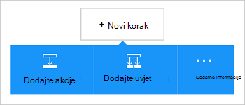
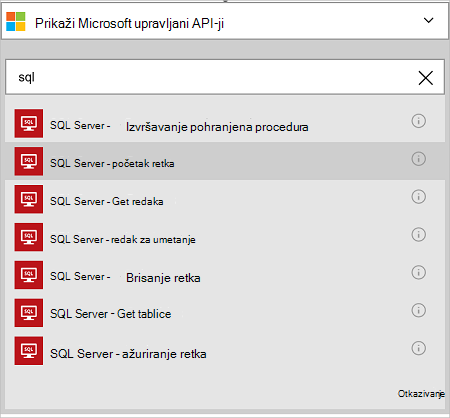

<properties
    pageTitle="Dodavanje poveznika baze podataka SQL Azure u aplikacijama za logiku | Microsoft Azure"
    description="Pregled poveznik baze podataka SQL Azure s parametrima REST API-JA"
    services=""
    documentationCenter="" 
    authors="MandiOhlinger"
    manager="anneta"
    editor=""
    tags="connectors"/>

<tags
   ms.service="logic-apps"
   ms.devlang="na"
   ms.topic="article"
   ms.tgt_pltfrm="na"
   ms.workload="na" 
   ms.date="10/18/2016"
   ms.author="mandia"/>

# Početak rada s bazom podataka SQL Azure poveznika
Pomoću poveznika baze podataka SQL Azure, stvaranje tijekova rada za tvrtku ili ustanovu koji upravljaju podataka u tablicama. 

S bazom podataka SQL vam:

- Stvaranje tijekova rada dodavanjem novog klijenta s bazom podataka klijentima ili ažuriranje reda u bazi podataka programa narudžbe.
- Početak retka podataka, umetnuli novi redak i čak i izbrisati pomoću akcije. Na primjer, stvaranja zapisa u sustavu Dynamics CRM Online (okidač), zatim Umetanje retka u baze podataka SQL Azure (akcije). 

U ovoj se temi pokazuje kako pomoću poveznika SQL baze podataka u aplikaciji logike pa se navode i akcije.

>[AZURE.NOTE] Ovu verziju članka primjenjuje se na logike aplikacije Općenito dostupan (GA). 

Da biste saznali više o aplikacijama logike, potražite u članku [što su logike aplikacije](../app-service-logic/app-service-logic-what-are-logic-apps.md) i [Stvaranje logike aplikacije](../app-service-logic/app-service-logic-create-a-logic-app.md).

## Povezivanje s bazom podataka Azure SQL

Logika aplikacije možete pristupiti bilo koji servis, prvo stvorite *vezu* sa servisom. Veze navedene veze između logike aplikacije i drugih servisa. Na primjer, da biste se povezali s bazom podataka SQL, stvaranja baze podataka SQL *vezu*. Da biste stvorili vezu, unesite vjerodajnice obično koristite za pristup servisu se povezujete s. Tako, u SQL baze podataka, unesite vjerodajnice SQL baze podataka da biste stvorili vezu. 

#### Stvaranje veze

>[AZURE.INCLUDE [Create the connection to SQL Azure](../../includes/connectors-create-api-sqlazure.md)]

## Koristite okidač

Ovaj poveznik ne sadrži sve okidača. Pomoću drugih okidača da biste pokrenuli aplikaciju logike, kao što su okidač ponavljanja, okidača HTTP Webhook, a zatim okidača dostupno u sklopu drugih poveznika i drugo. [Stvaranje aplikacije za logiku](../app-service-logic/app-service-logic-create-a-logic-app.md) navedeni primjer.

## Koristite akciju
    
Akciju je postupak provodi definirano u aplikaciji logike tijeka rada. [Dodatne informacije o akcije](../app-service-logic/app-service-logic-what-are-logic-apps.md#logic-app-concepts).

1. Odaberite znak plus. Pogledajte nekoliko mogućnosti: **Dodaj akciju**, **Dodaj uvjet**ili neke **Dodatne** mogućnosti.

    

2. Odaberite **Dodaj akciju**.

3. U tekstni okvir upišite "sql" da biste dobili popis dostupnih akcija.

     

4. U našem primjeru odaberite **SQL Server – početak retka**. Ako se veza već postoji, odaberite **naziv tablice** s padajućeg popisa i unesite **Identifikatora retka** koji želite vratiti.

    

    Ako su za podatke o vezi od vas zatraži, unesite detalje da biste stvorili vezu. [Stvaranje veze](connectors-create-api-sqlazure.md#create-the-connection) u ovoj se temi opisuju tih svojstava. 

    > [AZURE.NOTE] U ovom primjeru smo vratite redak iz tablice. Da biste vidjeli podatke u redak, dodajte drugih akcija stvara datoteku pomoću polja iz tablice. Na primjer, dodajte akciju OneDrive koji koristi polja ime i prezime da biste stvorili novu datoteku u oblak računa za pohranu. 

5. **Spremite** promjene (gornjem lijevom kutu na alatnoj traci). Pokrenite aplikaciju logike se sprema i možda je automatski omogućena.

## Tehničke pojedinosti

## Akcije SQL baze podataka
Akciju je postupak provodi definirano u aplikaciji logike tijeka rada. Poveznik za baze podataka SQL obuhvaća sljedeće radnje. 

|Akcija|Opis|
|--- | ---|
|[ExecuteProcedure](connectors-create-api-sqlazure.md#execute-stored-procedure)|Izvršava pohranjena procedura u SQL|
|[GetRow](connectors-create-api-sqlazure.md#get-row)|Dohvaća podatke u jedan redak iz tablice SQL|
|[GetRows](connectors-create-api-sqlazure.md#get-rows)|Dohvaća podatke u recima iz tablice SQL|
|[InsertRow](connectors-create-api-sqlazure.md#insert-row)|Umeće novi redak u tablici SQL|
|[DeleteRow](connectors-create-api-sqlazure.md#delete-row)|Brisanje retka iz tablice SQL|
|[GetTables](connectors-create-api-sqlazure.md#get-tables)|Dohvaća podatke u tablice iz baze podataka SQL|
|[UpdateRow](connectors-create-api-sqlazure.md#update-row)|Ažurira postojeći redak u tablici SQL|

### Detalji o akcija

U ovom ćete odjeljku potražite u članku određene detalje o svaku akciju, uključujući obavezan ili nije unos svojstva i sve odgovarajuće izlaz pridružene poveznik.

#### Izvršavanje pohranjena procedura
Pohranjena procedura izvršava u SQL.  

| Naziv svojstva| Zaslonsko ime |Opis|
| ---|---|---|
|postupak * | Naziv procedure | Naziv pohranjene procedure koju želite izvršiti |
|Parametri * | Ulaznih parametara | Parametri nisu dinamički i temelje se na pohranjena procedura odaberete.    Na primjer, ako koristite Adventure Works oglednu bazu podataka, odaberite *ufnGetCustomerInformation* pohranjene procedure. Prikazat će se na ulazni parametar **ID klijenta** . Unesite "6" ili neki drugi klijent ID-a. |

Zvjezdicu (*), znači da je svojstvo obavezno.

##### Detalji o Izlaz
ProcedureResult: Prenosi rezultat izvođenja pohranjena procedura

| Naziv svojstva | Vrsta podataka | Opis |
|---|---|---|
|OutputParameters|objekt|Izlaznih vrijednosti parametra |
|ReturnCode|cijeli broj|Kod postupak |
|ResultSets|objekt| Skupovima rezultata|

#### Početak retka 
Dohvaća podatke u jedan redak iz tablice SQL.  

| Naziv svojstva| Zaslonsko ime |Opis|
| ---|---|---|
|Tablica * | Naziv tablice |Naziv tablice SQL|
|ID * | Identifikatora retka |Jedinstveni identifikator retka koji želite dohvatiti|

Zvjezdicu (*), znači da je svojstvo obavezno.

##### Detalji o Izlaz
Stavke

| Naziv svojstva | Vrsta podataka |
|---|---|
|ItemInternalId|niz|

#### Početak retka 
Dohvaća podatke u recima iz tablice SQL.  

|Naziv svojstva| Zaslonsko ime|Opis|
| ---|---|---|
|Tablica *|Naziv tablice|Naziv tablice SQL|
|$skip|Preskoči numeriranje|Broj stavki da biste preskočili (zadani = 0)|
|$top|Maksimalna Get Count|Maksimalan broj stavki za dohvaćanje (zadani = 256)|
|$filter|Filtriranje upita|Upit ODATA filtar da biste ograničili broj stavki|
|$orderby|Poredaj po|Upit orderBy ODATA za određivanje redoslijeda stavki|

Zvjezdicu (*), znači da je svojstvo obavezno.

##### Detalji o Izlaz
ItemsList

| Naziv svojstva | Vrsta podataka |
|---|---|
|vrijednost|polja|

#### Umetanje retka 
Umetanje novog retka tablice SQL.  

|Naziv svojstva| Zaslonsko ime|Opis|
| ---|---|---|
|Tablica *|Naziv tablice|Naziv tablice SQL|
|stavke *|Redak|Redak za umetanje u navedenoj tablici u SQL|

Zvjezdicu (*), znači da je svojstvo obavezno.

##### Detalji o Izlaz
Stavke

| Naziv svojstva | Vrsta podataka |
|---|---|
|ItemInternalId|niz|

#### Brisanje retka 
Brisanje retka iz tablice SQL.  

|Naziv svojstva| Zaslonsko ime|Opis|
| ---|---|---|
|Tablica *|Naziv tablice|Naziv tablice SQL|
|ID *|Identifikatora retka|Jedinstveni identifikator retka koji želite izbrisati|

Zvjezdicu (*), znači da je svojstvo obavezno.

##### Detalji o Izlaz
Ništa.

#### Početak tablice 
Dohvaća podatke u tablice iz baze podataka SQL.  

Nema parametara za ovaj poziv. 

##### Detalji o Izlaz 
TablesList

| Naziv svojstva | Vrsta podataka |
|---|---|
|vrijednost|polja|

#### Ažuriranje retka 
Ažurira postojeći redak u tablici SQL.  

|Naziv svojstva| Zaslonsko ime|Opis|
| ---|---|---|
|Tablica *|Naziv tablice|Naziv tablice SQL|
|ID *|Identifikatora retka|Jedinstveni identifikator retka koji želite ažurirati|
|stavke *|Redak|Redak s ažuriranim vrijednosti|

Zvjezdicu (*), znači da je svojstvo obavezno.

##### Detalji o Izlaz  
Stavke

| Naziv svojstva | Vrsta podataka |
|---|---|
|ItemInternalId|niz|

### HTTP odgovora

Kada se upućivanje poziva za različite akcije, mogla bi vam se određene odgovore. Sljedeća tablica prikazuje odgovore i njihovi opisi:  

|Ime|Opis|
|---|---|
|200|ok|
|202|Prihvatili|
|400|Neispravan zahtjev|
|401|Neovlašteno|
|403|Zabranjen|
|404|Nije pronađen|
|500|Interna pogreška poslužitelja. Došlo je do nepoznate pogreške|
|Zadani|Nije uspjelo.|

## Daljnji koraci

[Stvaranje logike aplikacije](../app-service-logic/app-service-logic-create-a-logic-app.md). Istražite ostale dostupne poveznika u logiku aplikacija u našem [popisu API-ji](apis-list.md).
