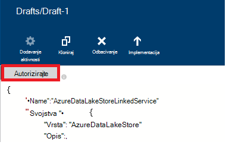

<properties
    pageTitle="Premještanje podataka da biste/Lake trgovini Azure podataka | Tvorničke Azure podataka"
    description="Upute za premještanje podataka iz spremišta Lake podataka za Azure pomoću tvorničke Azure podataka"
    services="data-factory"
    documentationCenter=""
    authors="linda33wj"
    manager="jhubbard"
    editor="monicar"/>

<tags
    ms.service="data-factory"
    ms.workload="data-services"
    ms.tgt_pltfrm="na"
    ms.devlang="na"
    ms.topic="article"
    ms.date="09/27/2016"
    ms.author="jingwang"/>

# Premještanje podataka i iz spremišta Lake podataka za Azure pomoću tvorničke Azure podataka
U ovom se članku opisuje kako možete koristiti aktivnosti Kopiraj u na tvorničke Azure podataka za premještanje podataka s Lake spremišta podataka za Azure iz drugog spremišta podataka. U ovom se članku sastavlja na članak [aktivnosti premještanje podataka](data-factory-data-movement-activities.md) koja predstavlja Općenito pregled premještanje podataka s Kopiraj aktivnosti i spremište kombinacijama podržanih.

> [AZURE.NOTE]
> Stvorite račun za Azure podataka Lake pohrane prije stvaranja na kanal s Kopiraj aktivnosti da biste premjestili sadržaj da biste/iz trgovine Azure podataka Lake. Da biste saznali više o Azure podataka Lake Store, potražite u članku [Početak rada s Lake spremišta podataka za Azure](../data-lake-store/data-lake-store-get-started-portal.md).
>  
> Pregledajte na [Sastavljanje prvom praktičnom vodiču kanal](data-factory-build-your-first-pipeline.md) detaljne upute za stvaranje podataka tvorničke, povezani servisi, skupova podataka i na kanal. Pomoću isječci JSON uređivač tvorničke podataka ili Visual Studio ili Azure PowerShell da biste stvorili entiteti tvorničke podataka.

## Čarobnjak za kopiranje podataka
Da biste stvorili kanala koja se kopira podatke iz spremišta Lake podataka za Azure najjednostavnije za korištenje čarobnjaka za kopiranje podataka. U odjeljku [Praktični vodič: Stvaranje kanal pomoću čarobnjaka za kopiranje](data-factory-copy-data-wizard-tutorial.md) Brzi vodič za stvaranje kanal pomoću čarobnjaka za kopiranje podataka. 

Sljedeći primjeri sadrže definicije JSON uzorka koje možete koristiti da biste stvorili na kanal pomoću [portala za Azure](data-factory-copy-activity-tutorial-using-azure-portal.md) ili [Visual Studio](data-factory-copy-activity-tutorial-using-visual-studio.md) ili [Azure PowerShell](data-factory-copy-activity-tutorial-using-powershell.md). Prikazuju kako kopirati podatke i iz spremišta Lake podataka za Azure i spremište blobova platforme Azure. Međutim, podaci mogu biti kopirana **izravno** iz bilo kojeg od izvora na neku razinu na primatelji navedeni [u nastavku](data-factory-data-movement-activities.md#supported-data-stores) pomoću aktivnosti Kopiraj u tvorničke Azure podataka.  

## Primjer: Kopiranje podataka iz blobova platforme Azure Lake spremišta podataka za Azure
Sljedeći primjer prikazuje:

1.  Povezane servis vrste [AzureStorage](#azure-storage-linked-service-properties).
2.  Povezane servis vrste [AzureDataLakeStore](#azure-data-lake-linked-service-properties).
3.  Za unos [dataset](data-factory-create-datasets.md) vrste [AzureBlob](#azure-blob-dataset-type-properties).
4.  Za izlazni [skup podataka](data-factory-create-datasets.md) vrste [AzureDataLakeStore](#azure-data-lake-dataset-type-properties).
4.  Na [kanal](data-factory-create-pipelines.md) s Kopiraj aktivnosti koje koristi [BlobSource](#azure-blob-copy-activity-type-properties) i [AzureDataLakeStoreSink](#azure-data-lake-copy-activity-type-properties).

Uzorak kopira vremenski niz podataka iz blobova Azure Azure podataka Lake spremište svaki sat. Svojstvima JSON koji se koriste u ta uzorka opisana su u odjeljcima pratiti primjere.

**Azure servis za pohranu povezana:**

    {
      "name": "StorageLinkedService",
      "properties": {
        "type": "AzureStorage",
        "typeProperties": {
          "connectionString": "DefaultEndpointsProtocol=https;AccountName=<accountname>;AccountKey=<accountkey>"
        }
      }
    }

**Azure podataka Lake povezana servisa:**

    {
        "name": "AzureDataLakeStoreLinkedService",
        "properties": {
            "type": "AzureDataLakeStore",
            "typeProperties": {
                "dataLakeStoreUri": "https://<accountname>.azuredatalakestore.net/webhdfs/v1",
                "sessionId": "<session ID>",
                "authorization": "<authorization URL>"
            }
        }
    }

### Da biste stvorili Azure Lake povezane usluga podataka pomoću uređivača tvorničke podataka
U nastavku navedeni koraci za stvaranje servis za pohranu Lake podataka za Azure povezana koji se tvorničke uređivaču podataka.

1. Kliknite **Spremanje nove podatke** na traci izbornika i odaberite **Lake spremišta podataka za Azure**.
2. U uređivaču JSON za svojstvo **dataLakeStoreUri** unesite URI lake podataka.
3. Kliknite gumb **ovlasti** na naredbenoj traci. Prikazat će se skočni prozor.

    

4. Koristite vjerodajnice za prijavu, a svojstvo **autorizacije** u na JSON trebaju biti dodijeljeni vrijednosti sada.
5. (neobavezno) Navedite vrijednosti za neobavezni parametri kao što su **accountName**, **subscriptionID**i **resourceGroupName** u na JSON (ili) brisanje tih svojstava s na JSON.
6. Kliknite **uvođenja** trake s naredbama za implementaciju povezane servisa.

> [AZURE.IMPORTANT] Kod autorizacije generira pomoću gumba **ovlasti** istječe nakon tijekom. **Reauthorize** pomoću **ovlasti** gumb kada **istekne token** i redeploy povezane servisa. Odjeljak [Usluga povezanih podataka Lake iz trgovine Azure](#azure-data-lake-store-linked-service-properties) potražite u članku detalje. 

**Azure Blob unos skup podataka:**

Podaci se izdvojiti iz novi blob svaki sat (učestalost: h, interval: 1). Put i naziv mape za blob-om dinamički vrednuju se temelji na vrijeme početka isječak koji obrađuje. Put do mape koristi godinu, mjesec i dan dio vremena početka i naziv datoteke koristi dio sat vremena početka. "vanjski": "true" postavka obavještava tvorničke podataka servisa tablici ne ovisi o tvorničke podataka, a ne osnovu aktivnost u tvorničke podataka.

    {
      "name": "AzureBlobInput",
      "properties": {
        "type": "AzureBlob",
        "linkedServiceName": "StorageLinkedService",
        "typeProperties": {
          "folderPath": "mycontainer/myfolder/yearno={Year}/monthno={Month}/dayno={Day}",
          "partitionedBy": [
            {
              "name": "Year",
              "value": {
                "type": "DateTime",
                "date": "SliceStart",
                "format": "yyyy"
              }
            },
            {
              "name": "Month",
              "value": {
                "type": "DateTime",
                "date": "SliceStart",
                "format": "MM"
              }
            },
            {
              "name": "Day",
              "value": {
                "type": "DateTime",
                "date": "SliceStart",
                "format": "dd"
              }
            },
            {
              "name": "Hour",
              "value": {
                "type": "DateTime",
                "date": "SliceStart",
                "format": "HH"
              }
            }
          ]
        },
        "external": true,
        "availability": {
          "frequency": "Hour",
          "interval": 1
        },
        "policy": {
          "externalData": {
            "retryInterval": "00:01:00",
            "retryTimeout": "00:10:00",
            "maximumRetry": 3
          }
        }
      }
    }

**Azure podataka Lake izlazni skup podataka:**

Uzorak kopira podatke u spremište Lake Azure podataka. Novi podaci primjeraka podataka Lake spremanje svaki sat.

    {
        "name": "AzureDataLakeStoreOutput",
        "properties": {
            "type": "AzureDataLakeStore",
            "linkedServiceName": "AzureDataLakeStoreLinkedService",
            "typeProperties": {
                "folderPath": "datalake/output/"
            },
            "availability": {
                "frequency": "Hour",
                "interval": 1
            }
        }
    }

**Kanali s Kopiraj aktivnosti:**

Kanal sadrži aktivnosti Kopiraj koji je konfiguriran za korištenje skupova podataka ulazni i izlazni je zakazano izvođenje svaki sat. U kanalu JSON definicija vrsta **izvora** postavljen na **BlobSource** , a **primatelj** je vrsta **AzureDataLakeStoreSink**.

    {  
        "name":"SamplePipeline",
        "properties":
        {  
            "start":"2014-06-01T18:00:00",
            "end":"2014-06-01T19:00:00",
            "description":"pipeline with copy activity",
            "activities":
            [  
                {
                    "name": "AzureBlobtoDataLake",
                    "description": "Copy Activity",
                    "type": "Copy",
                    "inputs": [
                    {
                        "name": "AzureBlobInput"
                    }
                    ],
                    "outputs": [
                    {
                        "name": "AzureDataLakeStoreOutput"
                    }
                    ],
                    "typeProperties": {
                        "source": {
                            "type": "BlobSource",
                            "treatEmptyAsNull": true,
                            "blobColumnSeparators": ","
                        },
                        "sink": {
                            "type": "AzureDataLakeStoreSink"
                        }
                    },
                    "scheduler": {
                        "frequency": "Hour",
                        "interval": 1
                    },
                    "policy": {
                        "concurrency": 1,
                        "executionPriorityOrder": "OldestFirst",
                        "retry": 0,
                        "timeout": "01:00:00"
                    }
                }
            ]
        }
    }

## Primjer: Kopiranje podataka iz Azure podataka Lake spremište blobova platforme Azure
Sljedeći primjer prikazuje:

1.  Povezane servis vrste [AzureDataLakeStore](#azure-data-lake-linked-service-properties).
2.  Povezane servis vrste [AzureStorage](#azure-storage-linked-service-properties).
3.  Za unos [dataset](data-factory-create-datasets.md) vrste [AzureDataLakeStore](#azure-data-lake-dataset-type-properties).
4.  Za izlazni [skup podataka](data-factory-create-datasets.md) vrste [AzureBlob](#azure-blob-dataset-type-properties).
5.  [Kanal](data-factory-create-pipelines.md) s Kopiraj aktivnosti koje koristi [AzureDataLakeStoreSource](#azure-data-lake-copy-activity-type-properties) i [BlobSink](#azure-blob-copy-activity-type-properties)

Uzorak kopira vremenski niz podataka iz trgovine Azure podataka Lake blobova platforme Azure svaki sat. Svojstvima JSON koji se koriste u ta uzorka opisana su u odjeljcima pratiti primjere.

**Spremište Lake podataka za Azure povezana servisa:**

    {
        "name": "AzureDataLakeStoreLinkedService",
        "properties": {
            "type": "AzureDataLakeStore",
            "typeProperties": {
                "dataLakeStoreUri": "https://<accountname>.azuredatalakestore.net/webhdfs/v1",
                "sessionId": "<session ID>",
                "authorization": "<authorization URL>"
            }
        }
    }

> [AZURE.NOTE] Pogledajte korake u prethodni uzorak da biste dobili autorizacije URL-a.  

**Azure servis za pohranu povezana:**

    {
      "name": "StorageLinkedService",
      "properties": {
        "type": "AzureStorage",
        "typeProperties": {
          "connectionString": "DefaultEndpointsProtocol=https;AccountName=<accountname>;AccountKey=<accountkey>"
        }
      }
    }

**Unos dataset Lake Azure podataka:**

Postavljanje **"vanjski": true** obavještava servis tvorničke podataka u tablici ne ovisi o tvorničke podataka, a ne osnovu aktivnost u tvorničke podataka.

    {
        "name": "AzureDataLakeStoreInput",
        "properties":
        {
            "type": "AzureDataLakeStore",
            "linkedServiceName": "AzureDataLakeStoreLinkedService",
            "typeProperties": {
                "folderPath": "datalake/input/",
                "fileName": "SearchLog.tsv",
                "format": {
                    "type": "TextFormat",
                    "rowDelimiter": "\n",
                    "columnDelimiter": "\t"
                }
            },
            "external": true,
            "availability": {
                "frequency": "Hour",
                "interval": 1
            },
            "policy": {
                "externalData": {
                    "retryInterval": "00:01:00",
                    "retryTimeout": "00:10:00",
                    "maximumRetry": 3
                }
            }
        }
    }

**Blobova platforme Azure izlazni skup podataka:**

Podaci se upisuju u novi blob svaki sat (učestalost: h, interval: 1). Put do mape za blob-om dinamički vrednuje na temelju vremena početka isječka koji obrađuje. Put do mape koristi godinu, mjesec, dan i sati dijelove vrijeme početka.

    {
      "name": "AzureBlobOutput",
      "properties": {
        "type": "AzureBlob",
        "linkedServiceName": "StorageLinkedService",
        "typeProperties": {
          "folderPath": "mycontainer/myfolder/yearno={Year}/monthno={Month}/dayno={Day}/hourno={Hour}",
          "partitionedBy": [
            {
              "name": "Year",
              "value": {
                "type": "DateTime",
                "date": "SliceStart",
                "format": "yyyy"
              }
            },
            {
              "name": "Month",
              "value": {
                "type": "DateTime",
                "date": "SliceStart",
                "format": "MM"
              }
            },
            {
              "name": "Day",
              "value": {
                "type": "DateTime",
                "date": "SliceStart",
                "format": "dd"
              }
            },
            {
              "name": "Hour",
              "value": {
                "type": "DateTime",
                "date": "SliceStart",
                "format": "HH"
              }
            }
          ],
          "format": {
            "type": "TextFormat",
            "columnDelimiter": "\t",
            "rowDelimiter": "\n"
          }
        },
        "availability": {
          "frequency": "Hour",
          "interval": 1
        }
      }
    }

**Kanali s Kopiraj aktivnosti:**

Kanal sadrži aktivnosti Kopiraj koji je konfiguriran za korištenje skupova podataka ulazni i izlazni je zakazano izvođenje svaki sat. U kanalu JSON definicija vrsta **izvora** postavljen na **AzureDataLakeStoreSource** , a **primatelj** je vrsta **BlobSink**.

    {  
        "name":"SamplePipeline",
        "properties":{  
            "start":"2014-06-01T18:00:00",
            "end":"2014-06-01T19:00:00",
            "description":"pipeline for copy activity",
            "activities":[  
                {
                    "name": "AzureDakeLaketoBlob",
                    "description": "copy activity",
                    "type": "Copy",
                    "inputs": [
                      {
                        "name": "AzureDataLakeStoreInput"
                      }
                    ],
                    "outputs": [
                      {
                        "name": "AzureBlobOutput"
                      }
                    ],
                    "typeProperties": {
                        "source": {
                            "type": "AzureDataLakeStoreSource",
                        },
                        "sink": {
                            "type": "BlobSink"
                        }
                    },
                    "scheduler": {
                        "frequency": "Hour",
                        "interval": 1
                    },
                    "policy": {
                        "concurrency": 1,
                        "executionPriorityOrder": "OldestFirst",
                        "retry": 0,
                        "timeout": "01:00:00"
                    }
                }
             ]
        }
    }

## Azure povezane usluge pohrane podataka Lake svojstva

Račun za Azure prostora za pohranu možete povezati na tvorničke Azure podataka putem servisa za pohranu Azure povezani. Sljedeća tablica sadrži opis elemenata JSON specifične za servis za pohranu Azure povezani.

| Svojstvo | Opis | Obavezno |
| :-------- | :----------- | :-------- |
| Vrsta | Svojstvo vrsta mora biti postavljeno na: **AzureDataLakeStore** | Da |
| dataLakeStoreUri | Odredite podatke o računu Lake spremišta podataka za Azure. Je u sljedećem obliku: https://<Azure Data Lake account name>.azuredatalakestore.net/webhdfs/v1 | Da |
| autorizacija | Kliknite gumb **ovlasti** u **Uređivač tvorničke podataka** , a zatim unesite svoje vjerodajnica koje se dodjeljuje automatski generirani autorizacije URL za to svojstvo.  | Da |
| ID sesije | Id sesije OAuth iz sesije autorizacije oauth. Svaki id sesije jedinstven i može se koristiti samo jedanput. Ta postavka automatski se generiraju kada koristite uređivač tvorničke podataka. | Da |  
| accountName | Naziv računa lake podataka | ne |
| subscriptionId | Azure pretplate ID-a. | Ne (Ako nije naveden, pretplatu na tvorničke podataka služi). |
| resourceGroupName |  Naziv grupe Azure resursa | Ne (Ako nije naveden, grupu resursa tvorničke podataka služi). |

## Istek tokena 
Kod autorizacije generiranje pomoću gumba **ovlasti** istječe nakon tijekom. Istek vremena za različite vrste korisničkih računa potražite u članku u sljedećoj tablici. Vidjet ćete sljedeće pogreške kada poruka provjere autentičnosti **istekne tokena**: "vjerodajnica operacija pogreške: invalid_grant - AADSTS70002: pogreške provjere valjanosti vjerodajnice. AADSTS70008: Dodjela navedeni pristup je istekla ili je povučen. Praćenje ID: ID korelacije d18629e8-af88-43c5-88e3-d8419eb1fca1: fac30a0c-6be6-4e02-8d69-a776d2ffefd7 vremenska oznaka: 2015 12 15 21 09 31Z ".

| Vrsta korisnika | Istječe nakon |
| :-------- | :----------- | 
| Korisnički računi ne upravlja Azure Active Directory (@hotmail.com, @live.com, itd.). | 12 sati |
| Računa korisnika upravlja po Azure Active Directory (AAD) | Pokrenite 14 dana nakon zadnjeg isječak.   90 dana, ako odsječak na temelju OAuth usluzi utemeljenoj na povezane izvodi najmanje jedanput 14 dana. |

Ako promijenite lozinku prije ovaj put isteka tokena, token istekne odmah, a se prikaže poruka koji se spominju u ovom odjeljku. 

Da biste izbjegli/Razriješi tu pogrešku, reauthorize pomoću **autorizacija** gumb kada **istekne token** i redeploy povezane servisa. Možete stvoriti i vrijednosti za **ID sesije** i **autorizacije** programski pomoću koda u sljedećem odjeljku svojstva:

### Da biste generirali programski ID sesije i autorizacije vrijednosti 

    if (linkedService.Properties.TypeProperties is AzureDataLakeStoreLinkedService ||
        linkedService.Properties.TypeProperties is AzureDataLakeAnalyticsLinkedService)
    {
        AuthorizationSessionGetResponse authorizationSession = this.Client.OAuth.Get(this.ResourceGroupName, this.DataFactoryName, linkedService.Properties.Type);

        WindowsFormsWebAuthenticationDialog authenticationDialog = new WindowsFormsWebAuthenticationDialog(null);
        string authorization = authenticationDialog.AuthenticateAAD(authorizationSession.AuthorizationSession.Endpoint, new Uri("urn:ietf:wg:oauth:2.0:oob"));

        AzureDataLakeStoreLinkedService azureDataLakeStoreProperties = linkedService.Properties.TypeProperties as AzureDataLakeStoreLinkedService;
        if (azureDataLakeStoreProperties != null)
        {
            azureDataLakeStoreProperties.SessionId = authorizationSession.AuthorizationSession.SessionId;
            azureDataLakeStoreProperties.Authorization = authorization;
        }

        AzureDataLakeAnalyticsLinkedService azureDataLakeAnalyticsProperties = linkedService.Properties.TypeProperties as AzureDataLakeAnalyticsLinkedService;
        if (azureDataLakeAnalyticsProperties != null)
        {
            azureDataLakeAnalyticsProperties.SessionId = authorizationSession.AuthorizationSession.SessionId;
            azureDataLakeAnalyticsProperties.Authorization = authorization;
        }
    }

Potražite u temama [Klase AzureDataLakeStoreLinkedService](https://msdn.microsoft.com/library/microsoft.azure.management.datafactories.models.azuredatalakestorelinkedservice.aspx), [AzureDataLakeAnalyticsLinkedService predmete](https://msdn.microsoft.com/library/microsoft.azure.management.datafactories.models.azuredatalakeanalyticslinkedservice.aspx)i [AuthorizationSessionGetResponse predmete](https://msdn.microsoft.com/library/microsoft.azure.management.datafactories.models.authorizationsessiongetresponse.aspx) detalje o klase tvorničke podataka koji se koristi u kodu. Dodavanje reference **2.9.10826.1824** verziju **Microsoft.IdentityModel.Clients.ActiveDirectory.WindowsForms.dll** klase WindowsFormsWebAuthenticationDialog koristi kod. 
 

## Svojstva vrste Dataset Lake Azure podataka

Potpuni popis JSON sekcije i svojstva dostupna za definiranje skupove podataka potražite u članku [Stvaranje skupova podataka](data-factory-create-datasets.md) . Sekcija kao što su strukturu, dostupnost i pravila dataset JSON su slične za sve vrste skup podataka (Azure SQL, blobova platforme Azure, tablica platforme Azure itd.).

U odjeljku **typeProperties** razlikuje za svaku vrstu skup podataka i daje informacije o lokaciji, oblikovati etc., podatke iz spremišta podataka. Odjeljak typeProperties za skup podataka vrste **AzureDataLakeStore** dataset sadrži sljedeća svojstva:

| Svojstvo | Opis | Obavezno |
| :-------- | :----------- | :-------- |
| folderPath | Put do kontejner i mape u podataka Lake Azure pohranite. | Da |
| Naziv datoteke | Naziv datoteke u spremištu Lake Azure podataka. Naziv datoteke je neobavezno i velika i mala slova.   Ako odredite naziv datoteke, aktivnosti (uključujući kopije) radi na određenom datotekom.  Kada datoteke nije naveden, Kopiraj sadrži sve datoteke u folderPath za unos skup podataka.  Kada se naziv datoteke za skup podataka za izlaz nije naveden, naziv datoteke generirani bio u nastavku ovaj oblik: podataka. <Guid>.txt (na primjer:: Data.0a405f8a-93ff-4c6f-b3be-f69616f1df7a.txt | ne |
| partitionedBy | partitionedBy je neobavezno svojstvo. Možete je koristiti da biste odredili dinamičke folderPath i naziv datoteke podataka niza vremena. Na primjer, folderPath može biti parametrizirane za svaki sat podataka U odjeljku [Korištenje partitionedBy svojstvo](#using-partitionedby-property) detalje i primjeri. | ne |
| Oblikovanje | Podržane su sljedeće vrste oblika: **TextFormat**, **AvroFormat**, **JsonFormat**, **OrcFormat**, **ParquetFormat**. Postavite svojstvo **Vrsta** u odjeljku oblik na jednu od ovih vrijednosti. [Određivanje TextFormat](#specifying-textformat), [Pri određivanju AvroFormat](#specifying-avroformat), [Određivanje JsonFormat](#specifying-jsonformat), [Određivanje OrcFormat](#specifying-orcformat)i [Određivanje ParquetFormat](#specifying-parquetformat) sekcije detalje potražite u članku. Ako želite kopirati datoteke kao-je između utemeljenih na datotekama trgovine (binarni kopiranje), možete preskočiti u odjeljku oblik i definicije ulazni i izlazni skup podataka.| ne
| Sažimanje | Navedite vrstu i razina kompresije za podatke. Podržane vrste su: **GZip**, **Deflate**i **BZip2** i podržanim razine: **Optimal** i **najbrže**. Trenutno postavki sažimanja nisu podržani za podatke u **AvroFormat** ili **OrcFormat**. Dodatne informacije potražite u članku [podrška za sažimanje](#compression-support) sekciji.  | ne |

### Pomoću svojstva partitionedBy
Možete odrediti dinamičke folderPath i naziv datoteke za vrijeme niza podataka u odjeljku **partitionedBy** , tvorničke podatkovne makronaredbe i sistemske varijable: SliceStart i SliceEnd, koja pokazuju vremena početka i završetka za podataka isječak.

U člancima [Stvaranje skupova podataka](data-factory-create-datasets.md) i [Raspored i izvršavanje](data-factory-scheduling-and-execution.md) da biste shvatili dodatne informacije o skupova vrijeme niz podataka, raspored i isječke.

#### Primjer 1

    "folderPath": "wikidatagateway/wikisampledataout/{Slice}",
    "partitionedBy":
    [
        { "name": "Slice", "value": { "type": "DateTime", "date": "SliceStart", "format": "yyyyMMddHH" } },
    ],

U ovom primjeru {isječak} je zamijenjena funkcijom vrijednost varijable tvorničke podataka sustava SliceStart u obliku (YYYYMMDDHH) naveden. U SliceStart se odnosi na početak isječak. Na folderPath razlikuje za svaki isječak. Na primjer: wikisampledataout/wikidatagateway/2014100103 ili wikisampledataout/wikidatagateway/2014100104

#### Primjer 2

    "folderPath": "wikidatagateway/wikisampledataout/{Year}/{Month}/{Day}",
    "fileName": "{Hour}.csv",
    "partitionedBy":
     [
        { "name": "Year", "value": { "type": "DateTime", "date": "SliceStart", "format": "yyyy" } },
        { "name": "Month", "value": { "type": "DateTime", "date": "SliceStart", "format": "MM" } },
        { "name": "Day", "value": { "type": "DateTime", "date": "SliceStart", "format": "dd" } },
        { "name": "Hour", "value": { "type": "DateTime", "date": "SliceStart", "format": "hh" } }
    ],

U ovom primjeru u zasebnom varijabli koje koriste folderPath i naziv svojstva se izdvajaju godinu, mjesec, dan i vrijeme SliceStart.

[AZURE.INCLUDE [data-factory-file-format](../../includes/data-factory-file-format.md)]
 

### Podrška za spajanje  
Obrada velikih skupova podataka mogu prouzročiti grla/i i mreže. Stoga sažete podatke u trgovine možete ne samo ubrzavanje prijenos podataka putem mreže i Štednja prostora na disku, ali premjestiti i poboljšanja performansi za značajan u obrada velikih skupova podataka. Trenutno sažimanja nije podržana za služi za pohranu datoteka na temelju podataka kao što su blobova platforme Azure i lokalnih datotečnom sustavu.  

Da biste odredili sažimanja za skup podataka, koristiti ovo svojstvo **sažimanja** u skupu podataka JSON kao u sljedećem primjeru:   

    {  
        "name": "AzureDatalakeStoreDataSet",  
        "properties": {  
            "availability": {  
                "frequency": "Day",  
                "interval": 1  
            },  
            "type": "AzureDatalakeStore",  
            "linkedServiceName": "DataLakeStoreLinkedService",  
            "typeProperties": {  
                "fileName": "pagecounts.csv.gz",  
                "folderPath": "compression/file/",  
                "compression": {  
                    "type": "GZip",  
                    "level": "Optimal"  
                }  
            }  
        }  
    }  
 
**Sažimanje** sekciji sastoji se od dva svojstva:  
  
- **Vrsta:** sažimanja kodek, što može biti **GZIP**, **Deflate** ili **BZIP2**.  
- **Razinu:** omjer spajanja, što može biti **Optimal** ili **najbrže**. 
    - **Najbrže:** Trebali biste operaciju spajanja dovršite brzo kao što je to moguće, čak i ako rezultat ne optimalnog komprimiranja datoteke. 
    - **Optimal**: operaciju spajanja mora biti optimalnog spojene, čak i ako se postupak traje dulje da biste dovršili. 
    
    Dodatne informacije potražite u članku [Razinu kompresije](https://msdn.microsoft.com/library/system.io.compression.compressionlevel.aspx) temu. 

Pretpostavimo da uzorka skupu podataka koristi se kao rezultat Kopiraj aktivnosti. Aktivnosti Kopiraj komprimira za izlazne podatke s GZIP kodek pomoću optimalnih omjer, a zatim piše sažete podatke u datoteku pod nazivom pagecounts.csv.gz u spremištu Lake Azure podataka.   

Kada odredite svojstvo sažimanja u unos dataset JSON, kanal čita sažete podatke iz izvorišnog web-mjesta. Kada je svojstvo koje ste naveli u izlaz dataset JSON, aktivnosti kopiju možete napisati sažete podatke na odredište. Evo nekoliko oglednih scenarija: 

- Čitanje GZIP sažete podatke iz trgovine Azure podataka Lake, dekomprimiranje ga, a zapisivanje podataka rezultat s bazom podataka Azure SQL. U ovom slučaju definirati unos dataset Lake spremišta podataka za Azure s spajanja JSON svojstvo. 
- Čitanje podataka iz datoteke običnog teksta s lokalnim datotečnog sustava, sažmite je pomoću GZip oblika i sažeti podaci za pisanje je iz trgovine Azure podataka Lake. U ovom slučaju definirati dataset Lake Azure podataka izlaz s spajanja JSON svojstvo.  
- Pročitajte GZIP spojene podataka iz trgovine Azure Lake podataka, dekomprimiranje ga, sažmite je pomoću BZIP2 i zapisivanje podataka rezultat je iz trgovine Azure podataka Lake. Postavljanje Postavljanje vrsta sažimanja kao GZIP i BZIP2 za unos i odnosno izlaz skupova podataka.   

## Azure svojstva vrste podataka Lake Kopiraj aktivnosti  
Potpuni popis sekcija i svojstva dostupna za definiranje aktivnosti, potražite u članku [Stvaranje kanali](data-factory-create-pipelines.md) . Svojstva kao što su naziv, opis, ulazni i izlazni tablice, i pravila dostupni su za sve vrste aktivnosti.

Svojstva dostupna u odjeljku typeProperties aktivnosti razlikuju se s druge strane sa svakom vrstom aktivnosti. Kopiraj aktivnosti, mogu se razlikovati ovisno o tome vrste izvora i primatelji

**AzureDataLakeStoreSource** podržava **typeProperties** odjeljku sljedeća svojstva:

| Svojstvo | Opis | Dopuštena vrijednost | Obavezno |
| -------- | ----------- | -------------- | -------- |
| rekurzivne | Upućuje na to je li podatke čitanje rekurzivno iz mape sub ili samo u određenu mapu. | False TRUE (Zadana vrijednost) | ne |

**AzureDataLakeStoreSink** podržava **typeProperties** odjeljku sljedeća svojstva:

| Svojstvo | Opis | Dopuštena vrijednost | Obavezno |
| -------- | ----------- | -------------- | -------- |
| copyBehavior | Određuje ponašanje Kopiraj. | **PreserveHierarchy:** zadržava hijerarhiji datoteka u odredišnoj. Relativni put izvornu datoteku da biste mapa izvora jednak relativni put ciljnu datoteku da biste ciljnu mapu.  **FlattenHierarchy:** sve datoteke iz mape izvora stvaraju se u prva razina ciljne mape. Ciljne datoteke se stvaraju automatski generira naziva.  **MergeFiles:** spaja sve datoteke iz mape izvora u jednu datoteku. Ako je naveden naziv datoteke/Blob, naziv datoteke spojenih bio je naziv naveden; u suprotnom, bilo bi automatski generirani naziv datoteke. | ne |

[AZURE.INCLUDE [data-factory-structure-for-rectangualr-datasets](../../includes/data-factory-structure-for-rectangualr-datasets.md)]

[AZURE.INCLUDE [data-factory-type-conversion-sample](../../includes/data-factory-type-conversion-sample.md)]

[AZURE.INCLUDE [data-factory-column-mapping](../../includes/data-factory-column-mapping.md)]

## Performanse i ugađanje  
Potražite u članku [Kopiranje aktivnosti performanse i vodič za ugađanje](data-factory-copy-activity-performance.md) dodatne informacije o ključa čimbenici koji utjecaj na performanse pomicanja podataka (Kopiraj aktivnosti) u tvorničke Azure podataka i razni načini optimizirati.
