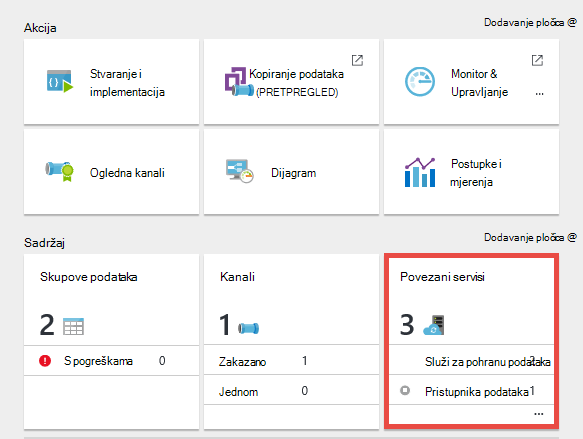

<properties 
    pageTitle="Pristupnik za upravljanje podacima za tvorničke podataka | Microsoft Azure"
    description="Premještanje podataka s lokalnog poslužitelja u oblak i postavljanje pristupnika podacima. Premještanje podataka pomoću pristupnika za upravljanje podacima u tvorničke Azure podataka." 
    services="data-factory" 
    documentationCenter="" 
    authors="linda33wj" 
    manager="jhubbard" 
    editor="monicar"/>

<tags 
    ms.service="data-factory" 
    ms.workload="data-services" 
    ms.tgt_pltfrm="na" 
    ms.devlang="na" 
    ms.topic="article" 
    ms.date="10/11/2016" 
    ms.author="jingwang"/>

# Pristupnik za upravljanje podacima
Pristupnik za upravljanje podacima je klijent agent koja morate instalirati u lokalnog okruženja za kopiranje podataka između oblaka i lokalnih podataka trgovine. Trgovine podataka na lokalni podržava tvorničke podataka navedene su u odjeljku [Podržani izvori podataka](data-factory-data-movement-activities.md##supported-data-stores) . 

> [AZURE.NOTE] Trenutno pristupnik ne podržava samo Kopiraj aktivnosti i pohranjena procedura aktivnosti u tvorničke podataka. Nije moguće koristiti s prilagođenom aktivnosti pristupnika pristupa lokalnim izvorima podataka. 

U ovom se članku dopuna vodič u na [Premještanje podataka s lokalnim i oblaka služi za pohranu podataka](data-factory-move-data-between-onprem-and-cloud.md) članka. U prikazu, stvorite kanal koji koristi pristupnik za premještanje podataka iz baze podataka sustava SQL Server lokalnog blobova platforme Azure. Ovaj članak sadrži detaljne informacije o pristupnik za upravljanje podacima.   

## Pregled

### Mogućnosti pristupnika za upravljanje podacima
Pristupnik za upravljanje podacima nudi sljedeće mogućnosti:

- Model lokalnih izvora podataka i izvore podataka unutar iste tvorničke podataka u oblaku i premještanje podataka.
- Imate jedan oknu staklenom za nadzor i upravljanje s uvid u stanje pristupnika iz plohu tvorničke podataka.
- Sigurno upravljanje pristupa lokalnim izvorima podataka.
    - Nema promjene na poslovni vatrozid. Pristupnik samo čini izlazne veze HTTP-poštu da biste otvorili internet.
    - Šifriranje vjerodajnica za lokalni trgovine za podatke u pomoću certifikata.
- Učinkovito premještanje podataka – podaci se prenose paralelno, prebacuju na Povremeni mrežni problemi s automatskog ponovnog pokušaja.

### Naredbe i tijek podataka
Kada koristite aktivnost Kopiraj da biste kopirali podatke između lokalnog i oblaka, aktivnosti koristi pristupnik da biste prenijeli podatke iz lokalnih izvora podataka u oblak i Potpredsjednik obrnuto.

Ovdje više razine podataka tijek provjere autentičnosti i sažetak korake za kopiju podataka pristupnika: 

1.  Podaci za razvojne inženjere stvara pristupnik za na tvorničke Azure podataka pomoću [portala za Azure](https://portal.azure.com) ili [Cmdlet ljuske PowerShell](https://msdn.microsoft.com/library/dn820234.aspx). 
2.  Podaci za razvojne inženjere stvara povezane služba za spremište podataka na lokalni navođenjem pristupnika. Kao dio postavljanja servisa povezane podatke za razvojne inženjere koristi aplikaciju za postavljanje vjerodajnica za određivanje vrste provjere autentičnosti i vjerodajnice.  Dijaloški okvir Postavke vjerodajnice aplikacije komunicira s spremišta podataka da biste testirali veze i pristupnik Spremi vjerodajnice.
3. Pristupnik šifrira vjerodajnice pomoću certifikata koji je povezan s pristupnika (unosi podatke za razvojne inženjere), prije spremanja vjerodajnica u oblaku.
4. Podatkovnog servisa tvorničke komunicira s pristupnik za planiranje i upravljanje zadacima putem kanala kontrole koja koristi zajedničke Azure service bus reda. Kada kopiranje aktivnosti posla mora biti kicked, podataka tvorničke redovi zahtjev uz podatke za vjerodajnica. Isključivanje posao nakon provjere reda kicks pristupnika.
5.  Pristupnika dešifrira vjerodajnice pomoću istog certifikata, a zatim se povezuje s lokalnog spremišta podataka s vrsta proper provjere autentičnosti i vjerodajnice.
6.  Pristupnik kopira podatke iz lokalnih trgovine za pohranu u oblaku, ili obrnuto ovisno o tome kako je konfigurirano aktivnosti Kopiraj u kanalu podataka. U ovom koraku pristupnika se izravno komunicira sa servisima pohrane u oblaku, kao što je spremište blobova platforme Azure putem sigurnog kanala (HTTPS).

### Okolnosti pri korištenju pristupnika
- Instancu pristupnik za upravljanje podacima može se koristiti za više lokalnih izvora podataka. Međutim, **samo jedan tvorničke Azure podataka je uz jedan pristupnik instancu** i nije moguće zajednički koristiti s drugom tvorničke podataka.
- Možete imati **samo jedan instance pristupnika za upravljanje podacima** instalirana na jednom računalu. Recimo da imate dvije factories podataka koji su potrebni za pristup lokalnog izvora podataka, morate instalirati pristupnik na dva lokalnog računala. Drugim riječima, je pristupnika uz tvorničke za određene podatke
- Na **pristupnika moraju biti na istom računalu kao izvor podataka**. Međutim, imate pristupnika bliže s izvorom podataka skraćuje vrijeme za pristupnik za povezivanje s izvorom podataka. Preporučujemo da instalirate pristupnika na računalu koji se razlikuje od onog koji hostira na lokalni izvor podataka. Kada u pristupnika i izvor podataka na različitim računalima, pristupnika nije se natječu za resurse s izvorom podataka.
- Možete imati **više pristupnika na različitim računalima povezivanje s istom lokalni izvor podataka**. Na primjer, imate dvije pristupnika posluživanje dva factories podataka, ali isti lokalni izvor podataka je registriran za factories podataka.
- Ako već imate instaliran na vašem računalu posluživanje scenarij **Power BI** pristupnik, instalirajte **zasebnom pristupnik za Azure podataka tvorničke** na nekom drugom računalu.
- Pristupnik mora se koristiti čak i kada koristite **ExpressRoute**.
- Smatraj s izvorom podataka na lokalni izvor podataka (u kojoj se nalazi iza vatrozida) čak i kada koristite **ExpressRoute**. Da biste uspostavili povezivanje između servisa i izvora podataka pomoću pristupnika.
- Morate **koristiti pristupnika** čak i ako je spremište podataka u oblaku na **Azure IaaS VM**. 

## Instalacija

### Preduvjeti
- Podržani **operacijski sustav** verzije su Windows 7, Windows 8/8.1, Windows 10, Windows Server 2008 R2, Windows Server 2012, Windows Server 2012 R2. Instalacija pristupnik za upravljanje podacima na kontroleru domene trenutno nije podržano.
- .NET framework 4.5.1 ili noviji potreban. Ako instalirate pristupnika na računalu Windows 7, instalirajte .NET Framework 4.5 ili noviji. Detalje potražite u članku [Sistemski preduvjeti za .NET Framework](https://msdn.microsoft.com/library/8z6watww.aspx) . 
- Preporučena **Konfiguracija** za pristupnom računalu je barem GHz 2, 4 jezgri, 8 GB RAM-a i 80 GB diska.
- Ako glavno računalo hibernira, pristupnik ne reagira na zahtjeve za podatke. Stoga konfigurirajte odgovarajuće **napajanja** na računalu prije instalacije pristupnika. Ako računalo nije konfiguriran za hibernacije, instalacija pristupnika traži poruke.
- Morate biti administrator na računalu možete instalirati i konfigurirati pristupnik za upravljanje podacima uspješno. Ostale korisnike možete dodati lokalne grupe sustava Windows **Korisnicima pristupnika za upravljanje podataka** . Članovi ove grupe mogu pomoću upravitelja konfiguracije pristupnika za upravljanje podacima alata za konfiguriranje pristupnika. 

Kao što je Kopiraj aktivnosti pokreće se odvijaju na određene učestalost, na korištenje resursa (CPU-a, memorije) na računalu slijedi isti uzorak s Vršna i vremena neaktivnosti. Upotreba resursa i ovisi o intenzivnog količinu podataka koja se premješta. Kada više kopija zadataka u tijeku, pogledajte korištenje resursa tijekom vremena Vršna se pomaknuli prema gore. 

### Mogućnosti instalacije
Pristupnik za upravljanje podacima moguće je instalirati na sljedeće načine: 

- Preuzimanjem msi-JA instalacijski paket iz [Microsoftova centra za preuzimanje](https://www.microsoft.com/download/details.aspx?id=39717).  Na MSI može se koristiti i nadograditi postojeće pristupnik za upravljanje podacima na najnoviju verziju, uz sve postavke sačuvati.
- Klikom na vezu za **Preuzimanje i instalacija pristupnik podacima** u odjeljku ručno postavljanje ili ponovno **instalirati izravno na računalo** u odjeljku Postavljanje EXPRESS. U članku [Premještanje podataka između lokalnog i oblaka](data-factory-move-data-between-onprem-and-cloud.md) detaljne upute za korištenje express postavljanje. Ručno korak vodi vas na centar za preuzimanje.  Upute za preuzimanje i instaliranje pristupnika iz centra za preuzimanje nalaze se u sljedećem odjeljku. 

### Instalacija najbolje prakse:
1.  Konfiguriranje napajanja na glavno računalo pristupnika tako da se računalo ne uspijeva. Ako glavno računalo hibernira, pristupnik ne reagira na zahtjeve za podatke.
2.  Sigurnosno kopirajte certifikat povezan s pristupnika.

### Instalacija pristupnika iz centra za preuzimanje
1. Dođite do [stranice za preuzimanje pristupnika za upravljanje podacima](https://www.microsoft.com/download/details.aspx?id=39717). 
2. Kliknite **Preuzimanje**, odaberite odgovarajuću verziju (**32-bitna** ili **64-bitni**) pa kliknite **Dalje**. 
3. Pokrenite **MSI** izravno ili spremiti na tvrdom disku i pokrenuti.
4. Na stranici **dobrodošlice** odaberite **jezik** , kliknite **Dalje**.
5. **Prihvaćanje** licencni ugovor za krajnjeg korisnika i kliknite **Dalje**. 
6. Odaberite **mapu** za instalaciju pristupnika i kliknite **Dalje**. 
7. Na stranici **spreman za instalaciju** kliknite **Instaliraj**. 
8. Kliknite **Završi** da biste dovršili instalaciju.
9. Pronađite ključ s portala za Azure. U sljedećem odjeljku detaljne upute. 
10. Na stranici **registrirati pristupnik** **Upravitelja konfiguracije pristupnika za upravljanje podacima** na vašem računalu, učinite sljedeće korake: 
    1. Zalijepite ključ tekst.
    2. Ako želite, kliknite **Prikaži ključ pristupnika** da biste vidjeli ključne tekst.
    3. Kliknite **Registracija**. 

### Registrirati pristupnik pomoću ključa

#### Ako već niste stvorili logičke pristupnika na portalu
Da biste stvorili pristupnik na portalu i ključ iz plohu **Konfiguriraj** , slijedite korake iz vodič u članku [Premještanje podataka između lokalnog i oblaka](data-factory-move-data-between-onprem-and-cloud.md) .    

#### Ako ste već stvorili logičke pristupnika na portalu
1. Azure portalu dođite do plohu **Tvorničke podataka** pa kliknite pločicu **Povezani servisi** .

    
2. U plohu **Povezani servisi** odaberite logičke **pristupnika** koji ste stvorili na portalu. 

      
2. U plohu **Pristupnik podacima** kliknite **Preuzmite i instalirajte pristupnik podacima**.

       
3. U plohu **Konfiguriraj** kliknite **ponovno stvoriti ključ**. Kliknite da na poruku upozorenja kad je pažljivo pročitate.

    
4. Kliknite gumb Kopiraj uz tipku. Ključ je kopirali u međuspremnik.
    
     

### Ikona palete sustava / obavijesti
Sljedeća slika prikazuje dio palete ikone koje se prikaže. 

Ako premjestite pokazivač miša iznad poruke ikona/obavijesti palete sustava, vidjet ćete detalje o stanju operacija pristupnika/ažuriranja u skočnom prozoru.

### Priključci i vatrozid
Postoje dvije vatrozidima treba uzeti u obzir: **vatrozid tvrtke** radi na središnje usmjerivač tvrtke ili ustanove i konfigurirati kao daemon na lokalnom računalu **Vatrozid za Windows** u kojem je instaliran pristupnik.  

Na razini tvrtke vatrozid morate konfigurirati sljedeće domene i izlazni priključke:

| Nazivi domena | Priključci | Opis |
| ------ | --------- | ------------ |
| *. servicebus.windows.net | 443, 80 | Slušače na servis preusmjeravanja Bus putem TCP (zahtijeva 443 za kontrolu pristupa tokena acquisition) | 
| *. servicebus.windows.net | 9350 9354 5671 | Neobavezno usluge preusmjeravanja bus putem TCP-a | 
| *. core.windows.net | 443 | HTTPS | 
| *. clouddatahub.net | 443 | HTTPS | 
| Graph.Windows.NET | 443 | HTTPS |
| login.Windows.NET | 443 | HTTPS | 

Na razini Vatrozid za windows, priključke izlaznog obično omogućena. Ako ne možete konfigurirati domene i priključaka sukladno tome na pristupnom računalu.

#### Kopirajte podatke iz izvora podataka spremišta primatelj izvor podataka

Provjerite je li pravila vatrozida pravilno omogućena na Korporacijski vatrozid, vatrozid za Windows na pristupnom računalu i spremanje podataka sam. Omogućivanje ta pravila omogućuje pristupnik za povezivanje s oba izvora i sita uspješno. Omogućivanje pravila za svaki spremišta podataka koji je uključen u postupak kopiranja.

Ako, na primjer, da biste kopirali iz **sustava lokalnog spremišta podataka za baze podataka SQL Azure primatelj ili programa Azure SQL Data Warehouse sita**, učinite sljedeće: 

- Omogućiti izlaznog komunikaciju **TCP** priključak **1433** za vatrozid za Windows i vatrozid tvrtke
- Konfigurirati postavke vatrozida Azure SQL server da biste dodali IP adresu na pristupnom računalu popis dopuštenih IP adresa. 

### Razmatranja proxy poslužitelja
Ako korporacijskom okruženju koristi proxy poslužitelj za pristup Internetu, konfigurirati pristupnik za upravljanje podacima da biste koristili odgovarajući proxy postavke. Možete postaviti proxy tijekom faze početne registracije. 

Pristupnik koristi proxy poslužitelj za povezivanje sa servisom cloud. Kliknite vezu za **promjenu** tijekom početne instalacije. Vidjet ćete dijaloški okvir **postavka proxyja** .

Postoje tri mogućnosti konfiguracije: 

- **Koristite proxy poslužitelj**: pristupnika nije izričito pomoću bilo kojeg proxy povezuju sa servisima u oblaku.
- **Korištenje sustava proxy**: pristupnik koristi se postavka proxy poslužitelja koji je konfiguriran u diahost.exe.config.  Ako nema proxy konfiguriran u diahost.exe.config, pristupnika se povezuje u oblaku izravno bez prolaze kroz proxy poslužitelja.
- **Korištenje prilagođenih proxy**: Konfiguriranje HTTP proxy koju želite koristiti za pristupnik umjesto korištenja konfiguracije u diahost.exe.config.  Potrebni su adresa i priključaka.  Korisničko ime i lozinka nisu obavezni ovisno o postavci vašeg proxy provjere autentičnosti.  Sve postavke su šifrirane pomoću certifikata vjerodajnica pristupnika i spremiti lokalno na pristupnom računalu glavnog računala.

Servisa za glavnog računala pristupnika za upravljanje podataka automatski se pokreće nakon što spremite postavke ažurirane proxy poslužitelja. 

Nakon pristupnika uspješno registrirani, ako želite pogledati ili ažurirati postavke proxyja, pomoću upravitelja konfiguracije pristupnika za upravljanje podacima. 

1. Pokretanje Upravitelja konfiguracije pristupnika za upravljanje podacima.
2. Prijelaz na karticu **Postavke** .
3. Kliknite **Promijeni** veza u odjeljku **HTTP Proxy** da biste pokrenuli dijaloški okvir **Postavljanje HTTP Proxy** .  
4. Nakon što kliknete gumb **Dalje** , vidjet ćete dijaloški okvir s upozorenjem traži dozvolu za spremanje postavka proxyja, a zatim ponovno pokrenite servis glavnog računala pristupnika.

Možete pregledavati i ažurirati HTTP proxy pomoću alata za Upravitelj konfiguracije. 

> [AZURE.NOTE] Ako postavljate proxy poslužitelj s provjerom autentičnosti na NTLM, servis glavnog računala pristupnika pokrenut će se u odjeljku račun domene. Ako promijenite lozinku za račun domene kasnije, ne zaboravite ažurirati konfiguracijske postavke za servis, a zatim ga ponovno pokrenite sukladno tome. Zbog taj zahtjev, predlažemo da koristite račun namjenski domene za pristup proxy poslužitelja koje je potrebno ažurirati lozinku često.

### Konfiguriranje postavke proxy poslužitelja u diahost.exe.config
Ako ste odabrali postavka za HTTP proxy na **korištenje sustava proxy** , pristupnik koristi postavka u diahost.exe.config proxy poslužitelja.  Ako nema proxy nije naveden u diahost.exe.config, pristupnika se povezuje u oblaku izravno bez prolaze kroz proxy poslužitelja. U nastavku sadrži upute za ažuriranje konfiguracijskoj datoteci. 

1.  U Eksploreru za datoteke, provjerite sigurni kopiju c:\Programske datoteke\Microsoft podataka upravljanja Gateway\2.0\Shared\diahost.exe.config sigurnosnu kopiju izvorne datoteke.
2.  Pokrenite Notepad.exe izvodi kao administrator i otvorite tekstnu datoteku "c:\Programske datoteke\Microsoft podataka upravljanja Gateway\2.0\Shared\diahost.exe.config. Pronađite odgovarajuću oznaku zadano za system.net kao što je prikazano u sljedećem kodu:

            <system.net>
                <defaultProxy useDefaultCredentials="true" />
            </system.net>   

    Zatim možete dodati proxy poslužitelja detalje kao što je prikazano u sljedećem primjeru:

            <system.net>
                  <defaultProxy enabled="true">
                        <proxy bypassonlocal="true" proxyaddress="http://proxy.domain.org:8888/" />
                  </defaultProxy>
            </system.net>

    Dodatna svojstva dopušteno unutar oznake proxy poslužitelja navedite potrebne postavke kao što je scriptLocation. Pogledajte [proxy Element (postavke mreže)](https://msdn.microsoft.com/library/sa91de1e.aspx) na sintakse.

            <proxy autoDetect="true|false|unspecified" bypassonlocal="true|false|unspecified" proxyaddress="uriString" scriptLocation="uriString" usesystemdefault="true|false|unspecified "/>

3. Spremite datoteku konfiguracije u izvornom mjestu, a zatim ponovno pokrenite servis glavnog računala za pristupnik za upravljanje podataka, koji uzima promjene. Ponovno pokretanje servisa: korištenje usluge apleta na upravljačkoj ploči ili od **Upravitelja konfiguracije pristupnika za upravljanje podacima** > kliknite gumb **Zaustavi servis** , a zatim kliknite **Pokretanje servisa**. Ako ne želite pokrenuti servis, vjerojatno je da je dodana netočan XML sintaksa oznake u datoteci konfiguracije aplikacije koji je uređivati.     

Osim tih točaka trebate provjerite je li Microsoft Azure u whitelist vaše tvrtke. Popis valjanih Microsoft Azure IP adrese se možete preuzeti iz [Microsoftova centra za preuzimanje](https://www.microsoft.com/download/details.aspx?id=41653).

#### Mogući simptomi za vatrozid i proxy poslužitelja probleme vezane uz
Ako naiđete na slični onima sljedeće pogreške, vjerojatno je zbog nepravilnom konfiguracijom vatrozida ili proxy poslužitelja koji blokira pristupnik za povezivanje s podacima tvorničke radi provjere autentičnosti. Potražite u prethodnom odjeljku da biste bili sigurni vatrozida i proxy poslužitelj pravilno konfigurirani.

1.  Prilikom registracije pristupnika prikazat će se sljedeća pogreška: "nije uspjela registracija ključ pristupnika. Prije no što pokušate ponovno registrirajte ključ pristupnika, potvrdite da pristupnik za upravljanje podacima u povezanim stanju i pokrenut servis za glavnog računala pristupnika za upravljanje podataka."
2.  Kada otvorite Upravitelj konfiguracije, vidjeti status kao "Nije povezan" ili "Povezivanje". Prilikom pregleda zapisnika događaja sustava Windows, u odjeljku "Preglednik događaja" > "Aplikacija i servisa zapisnika" > "Pristupnik za upravljanje podacima" se prikaže poruka o pogrešci kao što je sljedeća pogreška:`Unable to connect to the remote server` 
    `A component of Data Management Gateway has become unresponsive and restarts automatically. Component name: Gateway.`

### Otvorite priključak 8050 za šifriranje vjerodajnica 
Koristi aplikacije **Postavka vjerodajnice** ulazni priključak **8050** za prijenos vjerodajnice pristupnika prilikom postavljanja lokalnog povezana servisa na portalu za Azure. Tijekom instalacije pristupnika po zadanom instalacije pristupnik za upravljanje podacima otvoriti na pristupnom računalu.
 
Ako koristite vatrozid trećih strana, priključak 8050 možete otvoriti ručno. Ako naiđete na problem vatrozid tijekom postavljanja pristupnika, pokušajte upotrijebiti sljedeću naredbu da biste instalirali pristupnika bez Konfiguriranje vatrozida.

    msiexec /q /i DataManagementGateway.msi NOFIREWALL=1

Ako odlučite da ne želite otvoriti priključak 8050 na pristupnom računalu, poslužite se mehanizme osim upotrebe aplikaciju za **Postavljanje vjerodajnica** za konfiguriranje vjerodajnica za spremište podataka. Ako, na primjer, nije moguće pomoću cmdleta [New-AzureRmDataFactoryEncryptValue](https://msdn.microsoft.com/library/mt603802.aspx) PowerShell. Pogledajte odjeljak [Postavljanje vjerodajnica i sigurnost](#set-credentials-and-securityy) na kako podataka vjerodajnice za pohranu možete postaviti.

## Ažuriranje 
Prema zadanim postavkama pristupnik za upravljanje podacima automatski ažurirati kada je dostupna novija verzija pristupnika. Pristupnik je ažurirati dok gotovi zakazane zadatke. Nema daljnje zadataka obrađuju se pristupnik za sve dok se ne dovrši ažuriranja. Ažuriranje ne uspije, pristupnik je vraćen starije verzije. 

Vrijeme zakazanog ažuriranja potražite na sljedećim mjestima:

- Svojstva plohu pristupnika na portalu za Azure.
- Početna stranica od podataka upravljanja upravitelju konfiguracije pristupnika
- Obavijesti palete sustava. 

Na kartici Polazno od podataka upravljanja upravitelju konfiguracije pristupnika prikazuje raspored ažuriranja i zadnji put pristupnika nije instaliran/ažurirati. 

Možete odmah instalirajte ažuriranje ili pričekajte da se automatski ažurirati zakazano vrijeme pristupnik. Na primjer, Sljedeća slika prikazuje obavijest prikazati u upravitelju konfiguracije pristupnika uz gumb Ažuriraj koju možete kliknuti da biste odmah instalirali. 

Poruke s obavijesti u paleti sustava izgleda kao što je prikazano na sljedećoj slici: 

Prikaz statusa postupak ažuriranja (ručno ili automatsko) u paleti sustava. Kada sljedeći put pokrenete upravitelja konfiguracije pristupnika, se prikaže poruka na traci obavijest da pristupnika prilagođen uz vezu na [što je novu temu](data-factory-gateway-release-notes.md).

### Onemogući Omogući automatsko ažuriranje značajke
Možete Onemogući ili omogućiti značajku Automatsko ažuriranje tako da učinite sljedeće: 

1. Pokrenite Windows PowerShell na pristupnom računalu. 
2. Prelazak u mapu C:\Program Files\Microsoft podataka upravljanja Gateway\2.0\PowerShellScript.
3. Pokreni sljedeću naredbu da biste uključili automatsko ažuriranje značajka isključivanje (Onemogući).   

        .\GatewayAutoUpdateToggle.ps1  -off

4. Da biste ga ponovno uključite: 
    
        .\GatewayAutoUpdateToggle.ps1  -on  

## Upravitelj konfiguracije 
Kada instalirate pristupnika, možete pokrenuti upravitelj konfiguracijama pristupnika za upravljanje podacima u jednom od sljedećih načina: 

- U prozoru za **pretraživanje** upišite **Pristupnik za upravljanje podacima** da biste pristupili uslužni. 
- Pokretanje izvršne **ConfigManager.exe** u mapi: **C:\Programske datoteke\Microsoft podataka upravljanja Gateway\2.0\Shared** 
 
### Početna stranica
Početna stranica omogućuje vam da biste učinili sljedeće radnje: 

- Pogledati status pristupnika (povezani sa servisom cloud itd.). 
- **Registrirajte se** pomoću tipke na portalu.
- **Zaustavljanje** i početak **servis glavnog računala za pristupnik za upravljanje podacima** na pristupnom računalu.
- **Raspored ažuriranja** u određenom trenutku dana.
- Prikaz datuma kada je pristupnika **zadnje ažuriranje**. 

### Postavke stranice
Na stranici Postavke omogućuje vam da biste učinili sljedeće radnje:

- Prikaz, promjena i izvoz **certifikat** koji koristi pristupnik. Certifikat za šifriranje vjerodajnica za izvor podataka.
- Promjena **HTTPS priključak** za krajnju točku. Pristupnik otvara priključak za postavljanje vjerodajnica za izvor podataka. 
- **Status** krajnje točke
- Prikaži **SSL certifikat** koristi se za SSL komunikaciju između portal i pristupnik za postavljanje vjerodajnica za izvore podataka.  

### Dijagnostika stranice
Stranica za dijagnostiku omogućuje vam da biste učinili sljedeće radnje:

- Omogućite opširno **zapisivanje**, zapisnicima preglednik događaja i poslati zapisnike Microsoftu ako pojavila se pogreška.
- **Testiraj vezu** s izvorom podataka.  

### Stranica za pomoć
Na stranici pomoć prikazuju se sljedeće informacije:  

- Kratak opis pristupnika
- Broj verzije
- Veze na internetske pomoći, Izjava o zaštiti privatnosti i licencni ugovor.  

## Otklanjanje poteškoća

- Možete pronaći detaljne informacije u pristupnika zapisnike u zapisnika događaja sustava Windows. Možete ih pronaći pomoću Windows **Preglednik događaja** u odjeljku **aplikacije i servise zapisnika** > **Pristupnik za upravljanje podacima**. Pri otklanjanju poteškoća vezanih uz pristupnika, obratite pažnju na razine događaje s pogreškom u događaja preglednika.
- U slučaju pristupnika nakon **promijeniti certifikat**, ponovno pokrenite **Servis za pristupnik za upravljanje podacima** pomoću alata za Microsoft upravitelja konfiguracije pristupnika za upravljanje podacima ili apleta upravljačke ploče za servise. Ako i dalje prikazuje se pogreška, možda ćete morati dati izričite dozvole za pristupnik za upravljanje podacima korisnika servisa za pristup certifikat u upravitelju certifikata (certmgr.msc).  Zadani korisnički račun za servis je: **NT Service\DIAHostService**. 
- Ne uspijete aplikacije **Upravitelj vjerodajnica** za **šifriranje** vjerodajnica kada kliknete gumb za šifriranje u podataka tvorničke Editor, provjerite je li koristite ovu aplikaciju na **pristupnom računalu**. Ako nije, pokrenite aplikaciju na pristupnom računalu i pokušajte za šifriranje vjerodajnica.  
- Ako vidite podataka pohrana veze ili pogrešaka vezanih uz upravljački program, učinite sljedeće: 
    - Pokretanje **Upravitelja konfiguracije pristupnika za upravljanje podacima** na pristupnom računalu.
    - Prijelaz na karticu **dijagnostiku**
    - Odaberite i unesite odgovarajuće vrijednosti za polja u grupi **Testiraj vezu da biste pomoću ovog pristupnika na lokalni izvor podataka**
    - Kliknite **Testiraj vezu** da biste vidjeli ako se možete povezati s lokalnim izvorom podataka na pristupnom računalu koristeći podatke o vezi i vjerodajnice. Ako Testiranje veze neuspješna i nakon što instalirate upravljački program, ponovno pokrenite pristupnika da bi obraditi najnovije promjene.  

    

### Slanje zapisnika pristupnika Microsoftu
Kada se obraćate Microsoftove Support da biste dobili pomoć pri otklanjanju poteškoća pristupnika, možda ćete morati zajednički koristite svoje zapisnika pristupnika. Verzije pristupnika omogućuje jednostavno zajedničko korištenje zapisnika potrebna pristupnika pomoću dva klika na gumb u upravitelja konfiguracije pristupnika za.   

1. Prebacite se na karticu **Dijagnostika** od upravitelja konfiguracije pristupnika.
 
    
2. Kliknite **Pošalji zapisnike** vezu da biste vidjeli dijaloški okvir sljedeće: 

    
3. (neobavezno) Kliknite **Prijavi prikaz** za pregled zapisnika u preglednik događaja.
4. (neobavezno) Kliknite **izjave o zaštiti privatnosti** za pregled Izjava o zaštiti privatnosti za Microsoft online services. 
3. Kada budete zadovoljni što ćete prenijeti, kliknite **Pošalji zapisnike** zapravo poslati zapisnike iz zadnjih sedam dana Microsoftu za otklanjanje poteškoća. Trebali biste vidjeti status zapisnika operacije Pošalji kao što je prikazano na sljedećoj slici:

    
4. Nakon dovršetka postupka koji se prikaže dijaloški okvir kao što je prikazano na sljedećoj slici:
    
    
5. Imajte na umu dolje **ID izvješća** te je zajednički koristite s Microsoft Support. ID izvješća koristi se za pronalaženje vaše zapisnika pristupnika ste prenijeli za otklanjanje poteškoća.  ID izvješća i sprema se u preglednik događaja za referencu.  Možete pronaći tako da pogledate ID događaja "25" i potvrdite okvir datum i vrijeme.
    
        

### Pristupnik za arhiviranje prijavi pristupnika glavno računalo
Postoje nekim scenarijima kojima imate poteškoća pristupnika i ne možete izravno dijeliti pristupnik zapisnika: 

- Ručno instalirajte pristupnika i registrirati pristupnik;
- Pokušavate se registrirati pristupnik sa regenerated ključ na Upravitelj konfiguracije; 
- Pokušate poslati zapisnike i servis glavnog računala pristupnika se ne može povezati;

U tim slučajevima, spremanje zapisnika pristupnika kao zip datoteku i zajednički koristite kada se obratiti Microsoftovoj službi za podršku kasnije. Na primjer, ako primite poruku o pogrešci prilikom registracije pristupnika kao prikazano na sljedećoj slici:   

Kliknite vezu zapisnika **pristupnik za arhiviranje** arhiviranje i spremanje zapisnika i omogućivanje zajedničkog korištenja zip datoteke s Microsoftovoj službi za podršku. 

### Pristupnik je na mreži s ograničenim funkcijama 
Pogledajte status pristupnika kao **mreži s ograničenim funkcijama** zbog nekog od sljedećih razloga.

- Pristupnik ne može povezati na servis u oblaku putem servisa bus.
- Servis u oblaku ne može povezati s pristupnik putem servisa bus.

Kada pristupnik je na mreži s ograničenim funkcijama, možda neće moći koristiti Čarobnjak za kopiranje tvorničke podataka da biste stvorili kanali podataka za kopiranje podataka iz lokalnih podataka trgovine.

Razlučivost/zaobilazno rješenje za taj problem (mreži s ograničenim funkcijama) temelji se na li pristupnik mogao povezati servis u oblaku ili, Suprotno tome. Sljedeći odjeljci sadrže te zaobilazna rješenja. 

#### Pristupnik ne može povezati s servis u oblaku putem servisa bus
Slijedite ove korake da biste dobili pristupnika mrežni način: 

1. Omogućivanje izlazni priključci 9350 9354 na oba Vatrozid za Windows na pristupnom računalu i vatrozid tvrtke. Odjeljak [priključci i vatrozida](#ports-and-firewall) potražite u članku za detalja.
2. Konfiguriranje postavki proxyja na pristupnika. Potražite u članku [Proxy poslužitelja pitanja vezana uz](#proxy-server-considerations) odjeljak za detalja. 

Kao zaobilazno rješenje, koristite uređivač tvorničke podataka u Azure portal (ili) Visual Studio (ili) Azure PowerShell.

#### Pogreška: U oblaku ne može se povezati s pristupnik putem servisa bus.
Slijedite ove korake da biste dobili pristupnika mrežni način:
 
1. Omogućivanje izlaznog priključke 5671 i 9350 9354 na oba Vatrozid za Windows na pristupnom računalu i vatrozid tvrtke. Odjeljak [priključci i vatrozida](#ports-and-firewall) potražite u članku za detalja.
2. Konfiguriranje postavki proxyja na pristupnika. Potražite u članku [Proxy poslužitelja pitanja vezana uz](#proxy-server-considerations) odjeljak za detalja.
3. Uklanjanje statičke IP ograničenje na proxy poslužitelju. 

Kao zaobilazno rješenje, možete koristiti uređivač tvorničke podataka u Azure portal (ili) Visual Studio (ili) Azure PowerShell.
 
## Pomicanje pristupnika na računalu na drugu
Ovo poglavlje sadrži korake za klijenta za premještanje pristupnika s jednog računala na drugo računalo. 

2. Na portalu na **početnoj stranici tvorničke podataka**pa kliknite pločicu **Povezani servisi** . 

     
3. U odjeljku **Podataka PRISTUPNIKA** plohu **Povezani servisi** odaberite pristupnikom.
    
    
4. U plohu **pristupnik podacima** kliknite **Preuzmite i instalirajte pristupnik podacima**.
    
     
5. U plohu **Konfiguriraj** kliknite **Preuzmite i instalirajte pristupnika podataka**pa slijedite upute da biste instalirali pristupnika podataka na računalu. 

    
6. **Upravitelj konfiguracijama pristupnika za upravljanje podacima Microsoft** ostati otvoren. 
 
     
7. U plohu **Konfiguriraj** na portalu, kliknite **ponovno stvoriti ključ** na naredbenoj traci, a za poruku upozorenja, kliknite **da** . Kliknite **gumb Kopiraj** pokraj ključa tekst koji tipku kopira u međuspremnik. Pristupnik na računalu stare zaustavlja funkcionira kao uskoro ponovno stvoriti ključ.  
    
    
     
8. Zalijepite **ključ** u tekstni okvir na stranici **Registrirati pristupnik** **Upravitelja konfiguracije pristupnika za upravljanje podacima** na vašem računalu. (neobavezno) Kliknite **Pokaži ključ pristupnika** potvrdni okvir da biste vidjeli ključne tekst. 
 
    
9. Kliknite **registrirati** registrirajte pristupnik sa servisom cloud.
10. Na kartici **Postavke** kliknite **Promijeni** da biste odabrali isti certifikat koji je korišten sa starom pristupnika, unesite **lozinku**pa kliknite **Završi**. 
 
    

    Certifikat iz stare pristupnika možete izvesti tako da učinite sljedeće: pokretanje upravitelja konfiguracije pristupnika za upravljanje podacima na stari računalu, prijeđite na karticu **certifikata** , kliknite gumb **Izvezi** i slijedite upute. 
10. Nakon uspješne registracije pristupnika, trebali biste vidjeti **Registracija** postavljen na **registriran** i **Status** postavljen na **Prvi koraci** na početnoj stranici od upravitelja konfiguracije pristupnika. 

## Šifriranje vjerodajnica 
Za šifriranje vjerodajnica u uređivač tvorničke podataka, učinite sljedeće:

1. Pokretanje web-pregledniku na **pristupnom računalu**, otvorite [Centar za Azure](http://portal.azure.com). Traženje podataka tvorničke ako je potrebno, tvorničke Otvori podataka u plohu **TVORNIČKE podataka** , a zatim kliknite **autora i uvođenja** da biste pokrenuli uređivač tvorničke podataka.   
1. Kliknite na postojeće **povezane servisa** u prikazu stabla da biste vidjeli njegova definicija JSON ili stvaranje povezanih servisa koje je potrebno pristupnik za upravljanje podacima (na primjer: SQL Server ili Oracle). 
2. U uređivaču JSON za svojstvo **gatewayName** unesite naziv pristupnika. 
3. Unesite naziv poslužitelja za svojstvo **Izvor podataka** u **connectionString**.
4. Unesite naziv baze podataka za svojstvo **Početnog kataloga** u **connectionString**.    
5. Kliknite gumb za **šifriranje** na naredbenoj traci koja se pokreće kliknite-jednom programa **Upravitelj vjerodajnica** . Trebali biste vidjeti dijaloški okvir **Postavljanje vjerodajnica** . 
    
6. U dijaloškom okviru **Postavljanje vjerodajnica** učinite sljedeće:  
    1.  Odaberite **provjere autentičnosti** koje želite tvorničke podataka servisa za povezivanje s bazom podataka. 
    2.  Unesite ime korisnika koji imaju pristup bazi podataka za postavku **korisničko ime** . 
    3.  Unesite lozinku za korisnika za postavku **LOZINKE** .  
    4.  Kliknite **u redu** da biste šifriranje vjerodajnica i zatvaranje dijaloškog okvira. 
5.  Svojstvo **encryptedCredential** u **connectionString** trebali biste vidjeti sada.      
        
            {
                "name": "SqlServerLinkedService",
                "properties": {
                    "type": "OnPremisesSqlServer",
                    "description": "",
                    "typeProperties": {
                        "connectionString": "data source=myserver;initial catalog=mydatabase;Integrated Security=False;EncryptedCredential=eyJDb25uZWN0aW9uU3R",
                        "gatewayName": "adftutorialgateway"
                    }
                }
            }

Ako na portalu pristupiti s računala koja se razlikuje od pristupnom računalu, provjerite jesu li vjerodajnice Upravitelj aplikacija možete povezati pristupnom računalu. Ako aplikacija ne može pristupiti pristupnom računalu, ona ne dopušta postavljanje vjerodajnica za izvor podataka i testiranje veze s izvorom podataka.  

Kada koristite aplikaciju za **Postavljanje vjerodajnica** , portala za šifrira vjerodajnice pomoću certifikata naveden na kartici **certifikat** **Upravitelja konfiguracije pristupnika** na pristupnom računalu. 

Ako tražite pristup za šifriranje vjerodajnica za API-poštu, koristite cmdlet ljuske PowerShell [Novo AzureRmDataFactoryEncryptValue](https://msdn.microsoft.com/library/mt603802.aspx) za šifriranje vjerodajnica. Cmdlet koristi certifikat pristupnika za tu je konfiguriran za korištenje za šifriranje vjerodajnica. Dodajte šifrirane vjerodajnice element **EncryptedCredential** **connectionString** u na JSON. Na JSON koristiti pomoću cmdleta [New-AzureRmDataFactoryLinkedService](https://msdn.microsoft.com/library/mt603647.aspx) ili u uređivač tvorničke podataka. 

    "connectionString": "Data Source=<servername>;Initial Catalog=<databasename>;Integrated Security=True;EncryptedCredential=<encrypted credential>",

Postoji jedan više pristup za postavljanje vjerodajnica uređivaču tvorničke podataka. Ako stvarate servisa SQL Server povezana korištenjem uređivača i unesite vjerodajnice u obliku običnog teksta, vjerodajnice šifrirane pomoću certifikata vlasništvu servis tvorničke podataka. Korištenje certifikata za pristupnik za tu je konfiguriran za korištenje. Iako takvog može biti malo brže u nekim slučajevima, je manje sigurna. Stoga preporučujemo da slijedite taj se način samo za razvoj/testiranje svrhe. 

## Cmdleta ljuske PowerShell 
U ovom se odjeljku opisuje kako stvoriti i registrirati pristupnik pomoću cmdleta ljuske PowerShell Azure. 

1. **Azure PowerShell** pokrenite u načinu rada za administratora. 
2. Prijavite se na račun za Azure pokretanjem sljedeće naredbe i unosom Azure vjerodajnice. 

    Prijava AzureRmAccount
2. Pomoću cmdleta **New-AzureRmDataFactoryGateway** da biste stvorili pristupnik za logičke na sljedeći način:

        $MyDMG = New-AzureRmDataFactoryGateway -Name <gatewayName> -DataFactoryName <dataFactoryName> -ResourceGroupName ADF –Description <desc>

    **Primjer naredbe i izlaz**:

        PS C:\> $MyDMG = New-AzureRmDataFactoryGateway -Name MyGateway -DataFactoryName $df -ResourceGroupName ADF –Description “gateway for walkthrough”

        Name              : MyGateway
        Description       : gateway for walkthrough
        Version           :
        Status            : NeedRegistration
        VersionStatus     : None
        CreateTime        : 9/28/2014 10:58:22
        RegisterTime      :
        LastConnectTime   :
        ExpiryTime        :
        ProvisioningState : Succeeded
        Key               : ADF#00000000-0000-4fb8-a867-947877aef6cb@fda06d87-f446-43b1-9485-78af26b8bab0@4707262b-dc25-4fe5-881c-c8a7c3c569fe@wu#nfU4aBlq/heRyYFZ2Xt/CD+7i73PEO521Sj2AFOCmiI

    
4. Prebacivanje u mapu u Azure PowerShell: * *C:\Program Files\Microsoft podataka upravljanja Gateway\2.0\PowerShellScript\**. Pokrenite * *RegisterGateway.ps1* * pridružene lokalnu varijablu * *$Key** kao što je prikazano u sljedeću naredbu. Ova skripta registrira instaliran na računalu s logičke pristupnika ranije stvorili agent klijenta.

        PS C:\> .\RegisterGateway.ps1 $MyDMG.Key
        
        Agent registration is successful!

    Pomoću parametar IsRegisterOnRemoteMachine možete registrirati pristupnik na udaljenom računalu. Primjer:
        
        .\RegisterGateway.ps1 $MyDMG.Key -IsRegisterOnRemoteMachine true

5. Cmdlet **Get-AzureRmDataFactoryGateway** možete koristiti da biste dobili popis pristupnika na tvorničke vaše podatke. Kada za **Status** prikazana vrijednost **online**, to znači da pristupnikom spremna je za korištenje.

        Get-AzureRmDataFactoryGateway -DataFactoryName <dataFactoryName> -ResourceGroupName ADF

Možete ukloniti pristupnika pomoću cmdleta **Ukloni AzureRmDataFactoryGateway** i ažurirajte opis pristupnika pomoću cmdleta **Skup AzureRmDataFactoryGateway** . Sintaksa i druge detalje o tih cmdleta potražite u članku referenca za Cmdlet tvorničke podataka.  

### Popis pristupnika pomoću komponente PowerShell

    Get-AzureRmDataFactoryGateway -DataFactoryName jasoncopyusingstoredprocedure -ResourceGroupName ADF_ResourceGroup

### Uklanjanje pristupnika pomoću komponente PowerShell
    
    Remove-AzureRmDataFactoryGateway -Name JasonHDMG_byPSRemote -ResourceGroupName ADF_ResourceGroup -DataFactoryName jasoncopyusingstoredprocedure -Force 

## Daljnji koraci
- U odjeljku [Premještanje podataka s lokalnim i oblaka služi za pohranu podataka](data-factory-move-data-between-onprem-and-cloud.md) članka. U prikazu, stvorite kanal koji koristi pristupnik za premještanje podataka iz baze podataka sustava SQL Server lokalnog blobova platforme Azure.  
