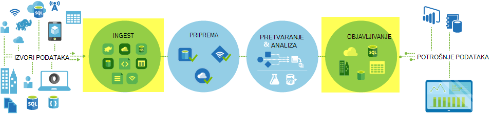
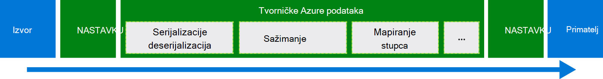
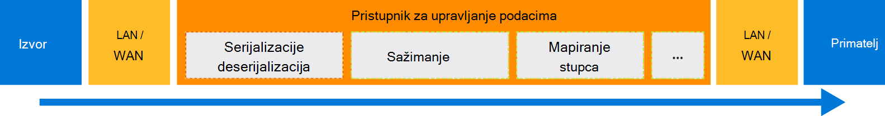

<properties
    pageTitle="Premještanje podataka pomoću naredbe Kopiraj aktivnosti | Microsoft Azure"
    description="Dodatne informacije o premještanju podataka u kanali tvorničke podataka: prijenos podataka između trgovine oblaka i između programa lokalne pohrane i spremište u oblaku. Koristite aktivnost Kopiraj."
    keywords="Kopiranje podataka, premještanje podataka, a zatim prijenos podataka, prijenos podataka"
    services="data-factory"
    documentationCenter=""
    authors="linda33wj"
    manager="jhubbard"
    editor="monicar"/>

<tags
    ms.service="data-factory"
    ms.workload="data-services"
    ms.tgt_pltfrm="na"
    ms.devlang="na"
    ms.topic="article"
    ms.date="09/22/2016"
    ms.author="jingwang"/>

# Premještanje podataka pomoću naredbe Kopiraj aktivnosti

## Pregled
U Azure tvorničke podataka, možete koristiti kopiju aktivnosti da biste kopirali podatke različitih oblika iz različitih lokalnih i izvore podataka da biste Azure u oblaku. Kada se podaci kopiraju se, može se dodatno transformacije i analizirati. Kopiraj aktivnosti možete koristiti i da biste objavili transformaciju i analiza rezultata za poslovno obavještavanje (BI) i potrošnje aplikacije.

Kopiraj aktivnosti se pokreće sigurne, pouzdan, skalabilni, a [globalno raspoloživ servis](#global). Ovaj članak sadrži detalje na premještanje podataka u tvorničke podataka i Kopiraj aktivnosti.

Najprije Pogledajmo kako pojavljuje se prijenos podataka između dva oblaka podataka služi za pohranu i između programa spremišta lokalnih podataka i oblaka izvor podataka.

> [AZURE.NOTE] Da biste saznali više o aktivnosti Općenito, potražite u članku [objašnjenje kanali i aktivnosti](data-factory-create-pipelines.md).

### Kopiranje podataka između dva oblaka podataka služi za pohranu
Kad su izvor i primatelj spremišta podataka u oblaku, Kopiraj aktivnosti prolazi kroz sljedeće faze da biste kopirali podatke iz izvora primatelj. Servis koji potencije Kopiraj aktivnosti:

1. Čita podatke iz spremišta izvora podataka.
2. Izvodi serijalizacije/deserijalizacija, sažimanje/dekompresiju, a zatim stupac mapiranja, a zatim upišite pretvorbe. To se događa te operacije na temelju konfiguracije unos dataset, izlazni skup podataka i Kopiraj aktivnosti.
3.  Zapisuje podatke na odredišno spremište podataka.

Servis automatski odabire optimalnih područja za izvođenje premještanje podataka. Tom području je obično najbliže primatelj spremište podataka.

### Kopiranje podataka između programa spremišta lokalnih podataka i oblaka izvor podataka
Sigurno premještanju podataka između programa spremišta lokalnih podataka i oblaka izvor podataka, na vašem računalu lokalnog instalirati pristupnik za upravljanje podacima. Pristupnik za upravljanje podacima je koji omogućuje premještanje podataka hibridnog i obrada. Možete ga instalirati na istom računalu kao što je s podacima pohraniti sam ili na zasebnom računalu koje ima pristup spremišta podataka.

U ovom scenariju pristupnik za upravljanje podacima izvodi serijalizacije/deserijalizacija, sažimanje/dekompresiju, stupac mapiranja pa upišite pretvorbe. Putem servisa Azure podataka tvorničke tijek podataka. Umjesto toga pristupnik za upravljanje podacima izravno zapisuje podatke na odredišno spremište.

U odjeljku [Premještanje podataka s lokalnim i oblaka služi za pohranu podataka](data-factory-move-data-between-onprem-and-cloud.md) uvod i vodič. Detaljne informacije o ovom agent potražite u članku [Pristupnik za upravljanje podacima](data-factory-data-management-gateway.md) .

Možete premjestiti i podataka s podržane podataka služi za pohranu koji se nalaze na Azure IaaS virtualnim strojevima (VMs) pomoću pristupnika za upravljanje podacima. U tom slučaju možete instalirati pristupnik za upravljanje podacima na istom VM kao što je s podacima pohraniti sam ili na zasebnom VM koja omogućuje pristup spremište podataka.

## Služi za pohranu podržanih i oblici
[AZURE.INCLUDE [data-factory-supported-data-stores](../../includes/data-factory-supported-data-stores.md)]

Ako vam je potrebna za premještanje podataka iz podatkovnog spremiti kopiju aktivnosti ne podržava, **prilagođene aktivnosti** u koristiti tvorničke podataka s vlastitim logike za kopiranje i premještanje podataka. Detalje o stvaranju i korištenju prilagođene aktivnosti, potražite u članku [korištenje prilagođene aktivnosti u kanalu na tvorničke Azure podataka](data-factory-use-custom-activities.md).

### Podržani oblici datoteka
Kopiraj aktivnosti možete koristiti da biste kopirali datoteke kao-između dvije datoteku na temelju podataka služi za pohranu, kao što su blobova platforme Azure i datotečnim sustavom HDFS. Da biste to učinili, možete preskočiti u [odjeljku oblik](data-factory-create-datasets.md) definicije ulazni i izlazni skup podataka. Podaci kopiraju učinkovito bez sve serijalizacije/deserijalizacija.

Kopiraj aktivnosti čita iz i piše datoteke navedeni oblika: tekst, Avro, ORC, Parquet i JSON. Sljedećih aktivnosti Kopiraj, možete učiniti na primjer:

-   Kopirajte podatke u obliku teksta (CSV) iz blobova platforme Azure i pisanje s bazom podataka SQL Azure.
-   Kopiranje datoteke u obliku teksta (CSV) datotečnom sustavu lokalnim i pisati blobova platforme Azure u obliku Avro.
-   Kopiranje podataka u bazi podataka SQL Azure i HDFS lokalnog u obliku ORC za pisanje.

## Premještanje globalno dostupne podataka
Azure tvorničke podataka dostupna je samo u SAD Zapad, Istočni SAD-a i Sjeverna Europa regijama. Međutim, servis koji Potenciranje Kopiraj aktivnosti dostupna globalno u sljedećim regijama i geographies. Globalno dostupne topologije osigurava pomicanja učinkovitog podataka obično izbjegava preskakanja više područja. Dostupnost podataka tvorničke i premještanje podataka u regiji potražite u članku [Servisi po regijama](https://azure.microsoft.com/regions/#services) .

### Kopiranje podataka između služi za pohranu podataka oblaka
Kad su izvor i primatelj spremišta podataka u oblaku, tvorničke podataka koristi servis za implementaciju u regiji koji se nalazi najbliže primatelj u istom Zemljopis da biste premjestili podatke. Pogledajte u sljedećoj su tablici za mapiranje:

Područje Odredišno spremište podataka | Područje koje se koriste za premještanje podataka
:----------------------------------- | :----------------------------
Istočni SAD-a | Istočni SAD-a
Istočni sad 2 | Istočni sad 2
Zapad SAD-a | Zapad SAD-a
Zapad sad 2 | Zapad SAD-a
Središnje SAD-a | Središnje SAD-a
Zapad središnje SAD-a | Središnje SAD-a
Sjeverna središnje SAD-a | Sjeverna središnje SAD-a
Južna središnje SAD-a | Južna središnje SAD-a
Sjeverna Europa | Sjeverna Europa
Europa Zapad | Europa Zapad
Jugoistočne Azije | Jugoistočne Azije
Istočnoazijski | Jugoistočne Azije
Istok Japan | Istok Japan
Japan Zapad | Istok Japan
Južna Brazil | Južna Brazil
Istok Australija | Istok Australija
Australija Jugoistok | Australija Jugoistok
Središnje Indija | Središnje Indija
Južna Indija | Središnje Indija
Indija Zapad | Središnje Indija

> [AZURE.NOTE] Ako regija Odredišno spremište podataka ne nalazi na prethodnom popisu, aktivnosti kopiranja neće uspjeti umjesto prolaze kroz zamjenski regija.

### Kopiranje podataka između programa spremišta lokalnih podataka i oblaka izvor podataka
Kada se podaci kopiraju između lokalnog (ili Azure virtualnim strojevima/IaaS) i oblaka služi za pohranu, [Pristupnik za upravljanje podacima](data-factory-data-management-gateway.md) provodi premještanje podataka na lokalnom računalu ili virtualnog računala. Podaci tijeka putem servisa u oblaku, osim ako ne koristite mogućnost [Kopiraj kopirana bez postavljanja](data-factory-copy-activity-performance.md#staged-copy) . U ovom slučaju podataka teče kroz pripremna spremište blobova platforme Azure prije nego što je napisan u spremište podataka primatelj.

## Stvaranje na kanal s Kopiraj aktivnosti
Možete stvoriti na kanal s aktivnosti Kopiraj na nekoliko načina:

### Pomoću čarobnjaka za kopiranje
Čarobnjak za kopiranje podataka tvorničke pomaže vam da biste stvorili na kanal s Kopiraj aktivnosti. U ovom kanal omogućuje vam da biste kopirali podatke iz podržanih izvora odredišta *bez pisanja JSON* definicije povezani servisi, skupova podataka i kanali. Pojedinosti o čarobnjaku potražite u članku [Čarobnjak za kopiranje tvorničke podataka](data-factory-copy-wizard.md) .  

### Putem skripti JSON
Uređivač tvorničke podataka u Azure portal, Visual Studio ili Azure PowerShell možete koristiti da biste stvorili definiciju JSON na kanal (pomoću aktivnosti Kopiraj). Nakon toga možete implementirati da biste stvorili kanal na tvorničke podataka. U odjeljku [Praktični vodič: korištenje kopije aktivnosti u kanalu na tvorničke Azure podataka](data-factory-copy-data-from-azure-blob-storage-to-sql-database.md) vodič s detaljnim uputama.    

Svojstva JSON (kao što su naziv, opis, ulazni i izlazni tablice i pravila) dostupni su za sve vrste aktivnosti. Svojstva koje su dostupne u na `typeProperties` odjeljak aktivnosti razlikuju se ovisno o vrsti aktivnosti.

Kopiraj aktivnosti, u `typeProperties` sekcija razlikuje se ovisno o vrsti izvora i primatelja. Kliknite na izvor/primatelj u odjeljku [Podržani izvori i primatelji](#supported-data-stores) dodatne informacije o svojstva vrste koji podržava Kopiraj aktivnosti za spremišta podataka.   

Evo definiciju JSON uzorka.

    {
      "name": "ADFTutorialPipeline",
      "properties": {
        "description": "Copy data from Azure blob to Azure SQL table",
        "activities": [
          {
            "name": "CopyFromBlobToSQL",
            "type": "Copy",
            "inputs": [
              {
                "name": "InputBlobTable"
              }
            ],
            "outputs": [
              {
                "name": "OutputSQLTable"
              }
            ],
            "typeProperties": {
              "source": {
                "type": "BlobSource"
              },
              "sink": {
                "type": "SqlSink",
                "writeBatchSize": 10000,
                "writeBatchTimeout": "60:00:00"
              }
            },
            "Policy": {
              "concurrency": 1,
              "executionPriorityOrder": "NewestFirst",
              "retry": 0,
              "timeout": "01:00:00"
            }
          }
        ],
        "start": "2016-07-12T00:00:00Z",
        "end": "2016-07-13T00:00:00Z"
      }
    }

Raspored koji je definiran u skupu podataka za izlaz određuje kada se pokrene aktivnost (na primjer: **dnevne**, učestalost kao **dan**i interval kao **1**). Aktivnost kopira podatke iz ulaznog skup podataka (**izvor**) dataset izlazna (**primatelj**).

Možete navesti više od jedne unos dataset aktivnošću Kopiraj. Se koriste za provjeru ovisnosti prije pokretanja aktivnosti. Međutim, samo podaci iz prvog skupa podataka kopiraju se odredište skup podataka. Dodatne informacije potražite u članku [Zakazivanje sastanka te izvršavanja](data-factory-scheduling-and-execution.md).  

## Performanse i ugađanje
Potražite u [aktivnosti Kopiraj performanse i ugađanje vodič](data-factory-copy-activity-performance.md), koji opisuje ključa čimbenici koji utječu na performanse premještanje podataka (Kopiraj aktivnosti) na tvorničke Azure podataka. Također navodi opaženih performanse tijekom internog testiranja i razmatra razne načine radi optimiziranja performansi Kopiraj aktivnosti.

## Zakazivanje i uzastopnih Kopiraj
Potražite u članku [Zakazivanje sastanka te izvođenja](data-factory-scheduling-and-execution.md) detaljne informacije o zakazivanja i izvođenja funkcioniranje u tvorničke podataka. Nije moguće pokrenuti više kopija postupke nakon međusobno način uzastopnih/naručili. U odjeljku [naručili Kopiraj](data-factory-scheduling-and-execution.md#ordered-copy) .

## Pretvorbe vrsta
Služi za pohranu podataka imati drugu vrstu nativnih sustava. Kopiraj aktivnosti izvodi Automatska vrsta pretvorbi iz sita vrste s sljedeća dva koraka pristup vrste izvora:

1. Pretvorba iz vrste nativni izvora u vrstu .NET.
2. Pretvorite iz vrste .NET vrstu izvorni primatelj.

Mapiranje vrsta nativnog sustava .NET vrstu spremišta podataka nalazi se u članku spremište odgovarajući podaci. (Kliknite određeni vezu u tablici [podržane služi za pohranu podataka](#supported-data-stores) ). Mapiranja možete koristiti da biste odredili odgovarajuće vrste prilikom stvaranja tablice, tako da se Kopiraj aktivnosti izvodi desnom pretvorbe.

## Daljnji koraci
- Dodatne informacije o aktivnosti Kopiraj, potražite u članku [Kopiranje podataka iz spremišta blobova Azure s bazom podataka SQL Azure](data-factory-copy-data-from-azure-blob-storage-to-sql-database.md).
- Dodatne informacije o premještanju podataka iz trgovine podataka na lokalni izvor podataka oblaka, potražite u članku [Premještanje podataka iz lokalnih podataka u oblaku u sprema](data-factory-move-data-between-onprem-and-cloud.md).
