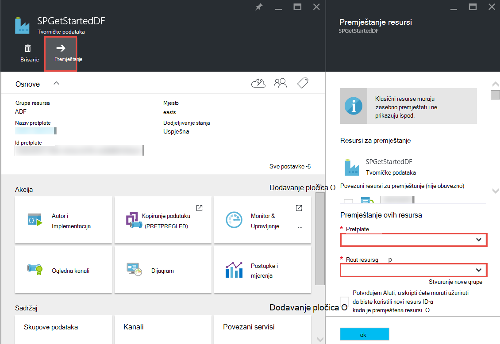

<properties 
    pageTitle="Tvorničke Azure podataka – najčešća pitanja" 
    description="Najčešća pitanja o tvorničke Azure podataka." 
    services="data-factory" 
    documentationCenter="" 
    authors="sharonlo101" 
    manager="jhubbard" 
    editor="monicar"/>

<tags 
    ms.service="data-factory" 
    ms.workload="data-services" 
    ms.tgt_pltfrm="na" 
    ms.devlang="na" 
    ms.topic="article" 
    ms.date="09/12/2016" 
    ms.author="shlo"/>

# Tvorničke Azure podataka – najčešća pitanja

## Općenita pitanja

### Što je tvorničke podataka Azure?

Oblak utemeljen je na tvorničke podataka Integracija podataka servisa te **automatizira premještanja i transformacije podataka**. Baš kao i tvorničke koja se pokreće opreme da biste snimili sirovina i njihovo pretvaranje u gotovih proizvoda tvorničke podataka orchestrates postojeće koje prikupljanje sirovim podacima i njihovo pretvaranje u podaci spremni za korištenje usluge. 
 
Tvorničke podataka omogućuje vam da biste stvorili utemeljenih na podacima tijekova rada za premještanje podataka s i lokalne i služi za pohranu podataka oblaka kao i proces/pretvorbe podataka pomoću računalnim servise kao što su Azure HDInsight i Azure podataka Lake analize. Kada stvorite kanal koja izvršava akciju koju vam je potrebna, možete planirati da povremeno pokretanje (hourly, jedanput dnevno, tjedno itd.).   

Potražite u članku [Pregled i koncepata ključ](data-factory-introduction.md) više pojedinosti. 

### Gdje mogu pronaći cijene detalje za Azure podataka tvorničke?

Posjetite [stranicu Detalji cijene tvorničke podataka] [ adf-pricing-details] detalje cijene za podataka tvorničke Azure.  

### Kako započeti rad s tvorničke podataka Azure?

- Pregled tvorničke Azure podataka potražite u članku [Uvod u tvorničke Azure podataka](data-factory-introduction.md).
- Vodič za **Kopiranje i premještanje podataka** pomoću Kopiraj aktivnosti, potražite u članku [Kopiranje podataka iz spremišta blobova Azure s bazom podataka SQL Azure](data-factory-copy-data-from-azure-blob-storage-to-sql-database.md).
- Vodič za **pretvaranje podataka** koristi aktivnost vrste Hive HDInsight. Potražite u članku [postupak podataka tako da pokrenete grozd skripte na Hadoop klaster](data-factory-build-your-first-pipeline.md) 
  
### Što je dostupnost regija tvorničke podataka?
Tvorničke podataka dostupna je u **SAD -a regije zapada** i **Sjeverna Europa**. S računalnim i servisi za pohranu koriste factories podataka može biti u drugim regijama. U odjeljku [podržani područja](data-factory-introduction.md#supported-regions). 
 
### Koja su ograničenja broja podataka factories/kanali/aktivnosti/skupove podataka?
 
Potražite u članku **Azure podataka tvorničke ograničenja** dijelu članka [Azure pretplate i ograničenja servisa, kvote, i ograničenja](../azure-subscription-service-limits.md#data-factory-limits) .

### Što je u okruženje za izradu/programiranje sa servisom Azure podataka tvorničke?

Autor/stvorite factories podataka pomoću nešto od sljedećeg:

- **Portal za Azure**  
   blades na tvorničke podataka na portalu za Azure pružaju obogaćenog korisničko sučelje za stvaranje podatkovni factories ad povezani servisi. **Uređivač tvorničke podataka**, koji je dio portalu, omogućuje jednostavno stvaranje povezani servisi, tablice, skupova podataka i kanali navođenjem JSON definicije za te elemente. Potražite u članku [Sastavljanje vaš prvi kanal podataka pomoću portala za Azure](data-factory-build-your-first-pipeline-using-editor.md) primjer pomoću portal/uređivača za stvaranje i implementacija podataka tvorničke.

- **Visual Studio**  
   Visual Studio možete koristiti za stvaranje na tvorničke Azure podataka. Potražite u članku [Sastavljanje vaš prvi kanal podataka pomoću Visual Studio](data-factory-build-your-first-pipeline-using-vs.md) detalje. 

- **Azure PowerShell**  
   potražite u članku [Stvaranje i praćenje Azure podataka tvorničke pomoću komponente PowerShell Azure](data-factory-build-your-first-pipeline-using-powershell.md) Praktični vodič/vodič za stvaranje podataka tvorničke pomoću komponente PowerShell. Potražite u članku [Referenca za Cmdlet tvorničke podataka] [ adf-powershell-reference] sadržaja na MSDN biblioteke potpun dokumentacije cmdleta tvorničke podataka.
   
- **Biblioteka klasa .NET**  
   factories podataka možete stvoriti programski pomoću SDK za .NET tvorničke podataka. Stvaranje podataka tvorničke pomoću .NET SDK vodič potražite u članku [Stvaranje, nadzor, i upravljanje factories podataka pomoću .NET SDK-a](data-factory-create-data-factories-programmatically.md) . Potražite u članku [Referenca za Biblioteka klasa tvorničke podataka] [ msdn-class-library-reference] potpun dokumentacije SDK za .NET tvorničke podataka.

- **REST API-JA**  
   REST API-JA vidljiva pomoću servisa Azure podataka tvorničke možete koristiti i za stvaranje i implementacija factories podataka. Potražite u članku [Podataka tvorničke REST API referenca] [ msdn-rest-api-reference] potpun dokumentacije podataka tvorničke REST API-JA.
 
- **Predloška Azure resursima** 
   potražite u članku [Praktični vodič: Izrada vaš prvi tvorničke Azure podataka pomoću predloška Azure Voditelj resursa](data-factory-build-your-first-pipeline-using-arm.md) pojedinosti fonta. 

### Mogu li preimenovati podataka tvorničke?
ne. Kao što su druge Azure resursa, naziv na tvorničke Azure podataka nije moguće promijeniti. 

### Možete prijeći na tvorničke podataka s jednog Azure pretplate na drugu? 
Da. Pomoću gumba za **Premještanje** na vašem plohu tvorničke podataka kao što je prikazano na sljedećem su dijagramu. 

### Što su okruženja računalnim podržava tvorničke podataka?
Sljedeća tablica sadrži popis računalnim okruženja podržava tvorničke podataka i aktivnosti koje možete pokrenuti na njima. 

| Okruženje za izračun | aktivnosti |
| ------------------- | -------- | 
| [Na zahtjev HDInsight klaster](data-factory-compute-linked-services.md#azure-hdinsight-on-demand-linked-service) ili [vlastite HDInsight klaster](data-factory-compute-linked-services.md#azure-hdinsight-linked-service) | [DotNet](data-factory-use-custom-activities.md), [vrste Hive](data-factory-hive-activity.md), [Svinja](data-factory-pig-activity.md), [MapReduce](data-factory-map-reduce.md), [Hadoop strujanje](data-factory-hadoop-streaming-activity.md) | 
| [Grupe za Azure](data-factory-compute-linked-services.md#azure-batch-linked-service) | [DotNet](data-factory-use-custom-activities.md) |  
| [Azure strojnog učenja](data-factory-compute-linked-services.md#azure-machine-learning-linked-service) | [Strojne grupe učenje aktivnosti: izvođenja grupe i resursa za ažuriranje](data-factory-azure-ml-batch-execution-activity.md) |
| [Analitički Lake Azure podataka](data-factory-compute-linked-services.md#azure-data-lake-analytics-linked-service) | [U-SQL Lake analize podataka](data-factory-usql-activity.md)
| [Azure SQL](data-factory-compute-linked-services.md#azure-sql-linked-service), [Azure SQL Data Warehouse](data-factory-compute-linked-services.md#azure-sql-data-warehouse-linked-service) [SQL Server](data-factory-compute-linked-services.md#sql-server-linked-service) | [Pohranjena procedura](data-factory-stored-proc-activity.md)

## Aktivnosti – najčešća Pitanja
### Što su različite vrste aktivnosti koje možete koristiti u podataka tvorničke kanal? 

- [Aktivnosti premještanje podataka](data-factory-data-movement-activities.md) da biste premjestili sadržaj.
- [Aktivnosti transformacije podataka](data-factory-data-transformation-activities.md) za proces/transformacije podataka. 

### Kada se pokreće aktivnosti?
Postavke konfiguracije **dostupnost** izlaznu tablicu podataka određuje kada se pokrene aktivnosti. Ako su navedeni unos skupova podataka, aktivnosti provjerava je li sve ovisnosti ulaznih podataka su zadovoljena (to jest, **spremni** stanja) prije pokretanja pokrenut. 

## Kopiranje aktivnost – najčešća Pitanja
### Je li bolje kanal s više aktivnosti ni zasebnom kanal za svaku aktivnost? 
Kanali bi se trebao grupirajte povezane aktivnosti. Ako skupove podataka koji se povezuju ih ne troše druge aktivnosti izvan kanal, možete zadržati aktivnosti u jedan kanal. Na taj način ne trebali biste lanac kanal aktivni razdoblja poravnanja međusobno. Osim toga, integriteta podataka u tablicama interni kanal bolje zadržava se prilikom ažuriranja kanal. Ažuriranje kanal zapravo zaustavlja sve aktivnosti unutar kanal uklanja ih te ih ponovno stvara. Iz perspektive za izradu, možda također je lakše vidjeti protok podataka u povezane aktivnosti u jednoj datoteci JSON za kanal.

### Što su podržanih služi za pohranu?
[AZURE.INCLUDE [data-factory-supported-data-stores](../../includes/data-factory-supported-data-stores.md)]

### Što su podržane formate datoteka? 
[AZURE.INCLUDE [data-factory-file-format](../../includes/data-factory-file-format.md)]

### Gdje se provodi operacija Kopiraj? 
Odjeljak [Premještanje globalno dostupne podataka](data-factory-data-movement-activities.md#global) potražite u članku detalje. Ukratko, kada je uključen je lokalnog spremišta podataka, kopija se provodi operacija pristupnik za upravljanje podacima u lokalnog okruženja. A kad je premještanje podataka između dva trgovine oblaka, u području najbliže primatelj mjesto u istoj Zemljopis se provodi operacija Kopiraj. 

## HDInsight aktivnost – najčešća Pitanja

### Što područja podržava HDInsight?

U sljedećem članku u odjeljku geografske dostupnost: ili u [Detaljima cijene HDInsight][hdinsight-supported-regions].

### Regiju koristi se klaster HDInsight na zahtjev?

HDInsight klaster osvježavati stvara se na istom području tamo gdje postoje prostora za pohranu koje ste naveli koja će se koristiti s klaster.    

### Kako se pridružiti računi dodatni prostor za pohranu za svoj klaster HDInsight?

Ako koristite vlastitu HDInsight klaster (BYOC - ponijeti vaše vlastite klaster), potražite u sljedećim temama: 

- [Pomoću programa HDInsight klaster računi zamjenski prostora za pohranu i Metastores][hdinsight-alternate-storage]
- [Korištenje računa dodatni prostor za pohranu s HDInsight grozd][hdinsight-alternate-storage-2]

Ako koristite programa klaster na zahtjev koji je stvoren pomoću usluge tvorničke podatke, odrediti račune dodatni prostor za pohranu za na HDInsight povezana servis tako da je servis tvorničke podataka možete ih registrirati u vaše ime. U definiciji JSON povezane servisa na zahtjev za svojstvo **additionalLinkedServiceNames** da biste naveli zamjenski prostora za pohranu račune kao što je prikazano u sljedećim JSON isječak:
 
    {
        "name": "MyHDInsightOnDemandLinkedService",
        "properties":
        {
            "type": "HDInsightOnDemandLinkedService",
            "typeProperties": {
                "clusterSize": 1,
                "timeToLive": "00:01:00",
                "linkedServiceName": "LinkedService-SampleData",
                "additionalLinkedServiceNames": [ "otherLinkedServiceName1", "otherLinkedServiceName2" ] 
            }
        }
    } 

U gornjem primjeru otherLinkedServiceName1 i otherLinkedServiceName2 predstavljaju povezani servisi čije definicije sadrže vjerodajnica koje klaster HDInsight potrebne za pristup računa zamjenski prostora za pohranu.

## Isječke – najčešća Pitanja

### Zašto se moj unos isječaka nije u stanju spremno?  
Česta pogreška nije postavka **vanjske** svojstvo **true** na unos dataset kada je uneseni podaci izvan tvorničke podataka (ne osnovu tvorničke podataka). 

U sljedećem primjeru samo morate postaviti **vanjskih** na true na **dataset1**.  

**DataFactory1** Kanali 1: dataset1 -> activity1 -> dataset2 -> activity2 -> dataset3 kanal 2: dataset3 -> activity3 -> dataset4

Ako imate drugu tvorničke podataka s kanal koji vodi dataset4 (koje je stvorio kanal 2 u podataka tvorničke 1), Označi dataset4 kao vanjski skup podataka jer skup podataka koje je stvorio različitih vrsta tvorničke (DataFactory1, ne DataFactory2).  

**DataFactory2**    
Kanal 1: dataset4 -> activity4 -> dataset5

Ako je svojstvo vanjskih pravilno postavljen, provjerite je li postoji li ulaznih podataka na mjestu naveden u definiciji unos skup podataka. 

### Kako pokrenuti isječak kasnije od ponoći kada isječak se proizvodi svakodnevno?
Svojstvo **Pomak** koristiti da biste naveli vrijeme isječak treba proizvesti. Odjeljak [dostupnosti skupa podataka](data-factory-create-datasets.md#Availability) potražite u članku dodatne informacije o tom svojstvu. Evo brzog primjera:

    "availability":
    {
        "frequency": "Day",
        "interval": 1,
        "offset": "06:00:00"
    }

Dnevni isječke Počni od **6 AM** umjesto zadanog ponoći.     

### Kako pokrenite isječak?
Možete ponovno pokrenite isječak na jedan od sljedećih načina: 

- Pomoću nadzor i upravljanje aplikacije, ponovno pokrenite prozor aktivnost ili isječak. Pogledajte [ponovno pokrenite odabran windows aktivnosti](data-factory-monitor-manage-app.md#re-run-selected-activity-windows) upute.   
- Kliknite **Pokreni** na naredbenoj traci na plohu **ISJEČAK podataka** za odsječak na portalu za Azure.
- Pokrenite cmdlet za **Postavljanje AzureRmDataFactorySliceStatus** čiji je Status postavljen na **čekanju** za isječak.   
    
        Set-AzureRmDataFactorySliceStatus -Status Waiting -ResourceGroupName $ResourceGroup -DataFactoryName $df -TableName $table -StartDateTime "02/26/2015 19:00:00" -EndDateTime "02/26/2015 20:00:00" 

U odjeljku [Postavljanje AzureRmDataFactorySliceStatus] [ set-azure-datafactory-slice-status] detalje o cmdletu. 

### Koliko je trajati za obradu isječak?
Korištenje Eksplorera za prozor aktivnosti u nadzor i upravljanje aplikacije Saznajte koliko je potrebno za provođenje podataka isječak. Detalje potražite u članku [Explorer prozora aktivnosti](data-factory-monitor-manage-app.md#activity-window-explorer) . 

Možete učiniti i sljedeće Azure portalu:  

1. Kliknite pločicu **skupova podataka** na **TVORNIČKE podataka** plohu za vaše podatke tvorničke.
2. Kliknite određeni skup podataka na plohu **skupova podataka** .
3. Odaberite isječak koji vas zanima na popisu **nedavno korištenih isječaka** na plohu **TABLICE** .
4. Kliknite aktivnosti pokrenuti na popisu **Aktivnosti pokreće** plohu **ODSJEČAK podataka** . 
5. Kliknite pločicu **Svojstva** na plohu **Pojedinosti pokretanje aktivnosti** . 
6. Trebali biste vidjeti polje **TRAJANJE** s vrijednošću. Ta vrijednost je vrijeme za obradu isječak.   

### Kako spriječiti izvodi isječak?
Ako vam je potrebna da biste prestali kanala izvršavaju, koristite cmdlet [Suspend AzureRmDataFactoryPipeline](https://msdn.microsoft.com/library/mt603721.aspx) . Trenutno zatvaranja kanal prekinuti izvršavanja isječak koji su u tijeku. Kada završite s izvršavanja u tijeku, bez dodatnih isječak je izdvojiti prema gore.

Ako želite zaista odmah prekinuti sva izvršavanja, samo onako kako bi se da biste izbrisali kanal i ponovno ga stvoriti. Ako odaberete da biste izbrisali kanal, nije potrebno da biste izbrisali tablice i povezani servisi koristi kanal. 

[create-factory-using-dotnet-sdk]: data-factory-create-data-factories-programmatically.md
[msdn-class-library-reference]: https://msdn.microsoft.com/library/dn883654.aspx
[msdn-rest-api-reference]: https://msdn.microsoft.com/library/dn906738.aspx

[adf-powershell-reference]: https://msdn.microsoft.com/library/dn820234.aspx 
[azure-portal]: http://portal.azure.com
[set-azure-datafactory-slice-status]: https://msdn.microsoft.com/library/mt603522.aspx

[adf-pricing-details]: http://go.microsoft.com/fwlink/?LinkId=517777
[hdinsight-supported-regions]: http://azure.microsoft.com/pricing/details/hdinsight/
[hdinsight-alternate-storage]: http://social.technet.microsoft.com/wiki/contents/articles/23256.using-an-hdinsight-cluster-with-alternate-storage-accounts-and-metastores.aspx
[hdinsight-alternate-storage-2]: http://blogs.msdn.com/b/cindygross/archive/2014/05/05/use-additional-storage-accounts-with-hdinsight-hive.aspx
 
