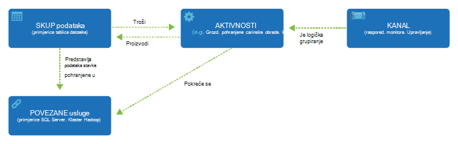

<properties 
    pageTitle="Uvod u tvorničke podataka, podatkovnog servisa Integracija | Microsoft Azure" 
    description="Saznajte što je tvorničke Azure podataka: servise u oblaku podataka Integracija orchestrates i automatizira premještanja i transformacije podataka." 
    keywords="Integracija podataka, Integracija podataka oblaka, što je tvorničke azure podataka"
    services="data-factory" 
    documentationCenter="" 
    authors="sharonlo101" 
    manager="jhubbard" 
    editor="monicar"/>

<tags 
    ms.service="data-factory" 
    ms.workload="data-services" 
    ms.tgt_pltfrm="na" 
    ms.devlang="na" 
    ms.topic="get-started-article" 
    ms.date="09/22/2016" 
    ms.author="shlo"/>

# Uvod u Azure podatkovnog tvorničke servisa, servis za integraciju podataka u oblaku

## Što je tvorničke podataka Azure? 
Tvorničke podataka je oblaku podataka Integracija servis orchestrates i automatizira **premještanja** i **transformacije** podataka. Možete stvoriti podataka Integracija rješenja putem servisa za tvorničke podataka koje možete ingest podatke iz različitih služi za pohranu podataka, transformacija/obradu podataka i objavljivanje podataka rezultat služi za pohranu podataka. 

Usluga tvorničke podataka omogućuje stvaranje kanali podataka koji se premjestiti i pretvaranje podataka i zatim pokrenuti na kanali na određenom rasporedu (hourly, dnevno, tjedno itd.). Također nudi obogaćenim vizualizacijama da biste prikazali o podrijetlu i ovisnosti među svoje podatke kanali, a pratiti sve svoje kanali podataka s jednog objedinjenih prikaza na jednostavno pinpoint problemi i postavljanje upozorenja za nadzor.

**Figure1.** Ingest podataka iz različitih izvora podataka, Priprema, pretvorba, i analizirati podatke i objavljivanje spremni za korištenje podataka za potrošnju.

## Kanali i aktivnosti
U rješenje tvorničke podataka, stvorite jedan ili više podataka **kanali**. Na kanal je logički grupiranja aktivnosti. Koriste se za grupu aktivnosti u jedinica zajedno zadatak. 

**Aktivnosti** definiraju akcije da biste izvršili nad podacima. Na primjer, možda pomoću Kopiraj aktivnosti i kopirajte podatke iz spremišta podataka s jednog u drugo spremište podataka. Slično tome, možete koristiti grozd aktivnosti, koji se izvodi upit grozd na programa Azure HDInsight klaster transformacija ili o analizi podataka. Tvorničke podataka podržava dvije vrste aktivnosti: aktivnosti premještanje podataka i aktivnosti transformacije podataka. 
  
## Aktivnosti premještanje podataka 
[AZURE.INCLUDE [data-factory-supported-data-stores](../../includes/data-factory-supported-data-stores.md)]

Članak [Aktivnosti premještanje podataka](data-factory-data-movement-activities.md) potražite u članku dodatne informacije. 

## Aktivnosti transformacije podataka
[AZURE.INCLUDE [data-factory-transformation-activities](../../includes/data-factory-transformation-activities.md)]

Pogledajte članak [Aktivnosti transformacije podataka](data-factory-data-transformation-activities.md) više pojedinosti.

Ako vam je potrebna za premještanje podataka iz podatkovnog pohranite da Kopiraj aktivnosti ne podržava, ili pretvaranje podataka pomoću vlastite logike, stvoriti **prilagođene aktivnosti .NET**. Detalje o stvaranju i korištenju prilagođene aktivnosti, potražite u članku [korištenje prilagođene aktivnosti u kanalu na tvorničke Azure podataka](data-factory-use-custom-activities.md).

## Povezani servisi
Povezani servisi definirati podatke koji su potrebni za tvorničke podatke za povezivanje s vanjskim izvorima (Primjeri: Azure prostor za pohranu, lokalnog sustava SQL Server Azure HDInsight). Povezani servisi koriste dva svrhe na tvorničke podataka:

- Za predstavljanje na **spremišta podataka** uključujući, ali ne i ograničeno na lokalnog sustava SQL Server, baze podataka tvrtke Oracle, datoteka za zajedničko korištenje ili račun spremište blobova platforme Azure. Pogledajte odjeljak [aktivnosti premještanje podataka](data-factory-data-movement-activities.md) za popis podržanih trgovine. 
- Da biste na **izračunati resursa** koje možete hostirati izvršavanje aktivnosti. Ako, na primjer, aktivnosti HDInsightHive pokreće programa klaster HDInsight Hadoop. Potražite u članku [aktivnosti transformacije podataka](data-factory-data-transformation-activities.md) dio za popis podržanih računalnim okruženja. 

## Skupove podataka 
Povezani servisi veza služi za pohranu podataka na tvorničke Azure podataka. Skupove podataka predstavljaju strukture podataka s u služi za pohranu podataka. Na primjer, servis za pohranu Azure povezana sadrži informacije o vezi za tvorničke podataka da biste se povezali s računom za Azure prostora za pohranu. U skupu podataka blobova platforme Azure određuje blob kontejner i mape u spremište blobova platforme Azure s kojeg kanal namijenjen podatke. Isto tako, na servis SQL Azure povezana pruža informacije o vezi za baze podataka Azure SQL i skup podataka sustava Azure SQL određuje tablicu koja sadrži podatke.   

## Odnos između entiteti tvorničke podataka
Tvorničke podataka ima nekoliko ključa entiteti koji zajedno rade definiranje ulazni i izlazni podatke, obradu događaji i raspored i resurse potrebne za izvršavanje tijek željene podatke.

**Slika 2.** Odnosi između skup podataka, aktivnosti, kanal i povezani servisa

S četiri jednostavne konceptima povezani servisi, skupova podataka, aktivnosti i kanali, spremni ste za početak rada! Možete [izraditi vaš prvi kanal](data-factory-build-your-first-pipeline.md). 

## Podržanih regija
Trenutno, možete stvoriti factories podataka u **Zapad SAD -a**, **Istočni SAD -a**i **Sjeverna Europa** regijama. Međutim, podataka tvorničke možete pristupiti služi za pohranu podataka i usluge u drugim Azure regijama premještanje podataka s podacima trgovine za izračun ili postupak podataka pomoću servisa za izračun. 

Azure tvorničke podataka sam spremiti sve podatke. Omogućuje stvaranje utemeljenih na podacima tokova da biste orkestrirali premještanje podataka između [podržane služi za pohranu podataka](data-factory-data-movement-activities.md#supported-data-stores) i obrada podataka pomoću [servisa za izračun](data-factory-compute-linked-services.md) u drugim regijama ili lokalnog okruženja. Omogućuje vam [nadzor i upravljanje tijekova rada](data-factory-monitor-manage-pipelines.md) pomoću oba programski i mehanizme korisničkog Sučelja. 

Iako tvorničke Azure podataka dostupna je u samo **Zapad SAD -a**, **Istočni SAD -a**i područja **Sjeverna Europa** , servis powering premještanje podataka na tvorničke podataka je dostupna [globalno](data-factory-data-movement-activities.md#global) na nekoliko područja. U slučaju da spremišta podataka nalazi iza vatrozida zatim [Pristupnik za upravljanje podacima](data-factory-move-data-between-onprem-and-cloud.md) instaliran u lokalnog okruženja umjesto premješta podatke. 

Na primjer, Javite nam pretpostavlja vašeg okruženja računalnim kao što su Azure HDInsight klaster i Azure strojnog učenja su dovoljno Zapad Europe regija. Stvaranje i korištenje instancu tvorničke Azure podataka u Sjevernoj Europi i omogućuje zakazivanje zadataka na vašem računalnim okruženja u kojima se u Europi Zapad. Potrebno nekoliko milisekundi za tvorničke podataka da biste pokrenuli posao o okruženju sustava računalnim, no to vrijeme za posao sustavom računalno okruženje promijeniti.

Ne možemo namjeravate imaju tvorničke Azure podataka u svakoj Zemljopis podržava Azure u budućnosti.
  
## Daljnji koraci
Da biste saznali kako izraditi factories podataka s podacima kanali, slijedite upute u sljedeći vodiči za. 

Praktični vodič | Opis
-------- | -----------
[Stvaranje kanala podataka koji obrađuje podataka pomoću Hadoop klaster](data-factory-build-your-first-pipeline.md) | Pomoću ovog praktičnog vodiča stvaranja prvog tvorničke Azure podataka s podacima kanal **procesa podataka** tako da pokrenete grozd skripte na klasteru programa Azure HDInsight (Hadoop). |
[Stvaranje kanala podataka premještanje podataka s dva oblaka podataka služi za pohranu](data-factory-copy-data-from-azure-blob-storage-to-sql-database.md) | U ovom ćete praktičnom vodiču stvorite podataka tvorničke s na kanal te **premješta podatke** iz spremišta blobova s bazom podataka SQL.
[Stvaranje kanala podataka za premještanje podataka između programa spremišta lokalnih podataka i izvor podataka oblak pomoću pristupnika za upravljanje podacima](data-factory-move-data-between-onprem-and-cloud.md) | U ovom ćete praktičnom vodiču stvaranja tvorničke podataka s na kanal te **premješta podatke** iz **lokalne** baze podataka SQL Server Azure blob. U prikazu, dio instalirate i konfigurirate pristupnik za upravljanje podacima na vašem računalu. 
