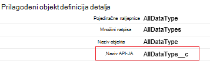

<properties
    pageTitle="Premještanje podataka iz servisa Salesforce pomoću podataka tvorničke | Microsoft Azure"
    description="Saznajte kako premještanje podataka iz servisa Salesforce pomoću tvorničke Azure podataka."
    services="data-factory"
    documentationCenter=""
    authors="linda33wj"
    manager="jhubbard"
    editor="monicar"/>

<tags
    ms.service="data-factory"
    ms.workload="data-services"
    ms.tgt_pltfrm="na"
    ms.devlang="na"
    ms.topic="article"
    ms.date="10/25/2016"
    ms.author="jingwang"/>

# Premještanje podataka iz servisa Salesforce pomoću tvorničke Azure podataka
U ovom se članku opisuje kako možete koristiti kopiju aktivnosti u na tvorničke Azure podataka da biste kopirali podatke iz Salesforce sve spremišta podataka koji se nalazi u odjeljku primatelj stupca u tablici [Podržani izvori i primatelji](data-factory-data-movement-activities.md#supported-data-stores) . U ovom se članku sastavlja na članak [aktivnosti premještanje podataka](data-factory-data-movement-activities.md) koja predstavlja Općenito pregled premještanje podataka s Kopiraj aktivnosti i kombinacijama podržanih trgovine.

Azure tvorničke podataka trenutno podržava samo premještanje podataka iz servisa Salesforce [stores]((data-factory-data-movement-activities.md#supported-data-stores) podržani primatelj podataka, ali ne podržava premještanje podataka iz drugih podataka pohranjuje za Salesforce.

## Preduvjeti
- Morate koristiti jedan od sljedeća izdanja Salesforce: Developer Edition, Professional Edition, Enterprise Edition ili neograničeno Edition.
- API dozvolu mora biti omogućen. U odjeljku [kako omogućiti pristup API-JA u Salesforce skup dozvola?](https://www.data2crm.com/migration/faqs/enable-api-access-salesforce-permission-set/)
- Da biste kopirali podatke iz Salesforce lokalnih podataka trgovine, morate imati barem podataka upravljanja pristupnika 2.0 instalirali u drugom lokalnog okruženja.

## Ograničenja zahtjeva za Salesforce
Salesforce ima ograničenja za Ukupno API zahtjeve i istovremeni zahtjevi API-JA. U odjeljku "API zahtjev ograničenja" u članku [Ograničenja za razvojne inženjere Salesforce](http://resources.docs.salesforce.com/200/20/en-us/sfdc/pdf/salesforce_app_limits_cheatsheet.pdf) detalje. Napomena Ako broj istovremeni zahtjevi premašuje ograničenje, ograničavanje pojavljuje, a vidjet ćete slučajni neuspjeha; Ako ukupan broj zahtjeva premašuje ograničenje, će se 24 sata; blokirati račun servisa Salesforce Pogreška "REQUEST_LIMIT_EXCEEDED" mogu primati i u oba scenarija.

## Čarobnjak za kopiranje podataka
Da biste stvorili kanal koji kopira podataka iz servisa Salesforce svih podržanih primatelj služi za pohranu podataka najjednostavnije za korištenje čarobnjaka za kopiranje podataka. U odjeljku [Praktični vodič: Stvaranje kanal pomoću čarobnjaka za kopiranje](data-factory-copy-data-wizard-tutorial.md) Brzi vodič za stvaranje na kanal pomoću čarobnjaka za kopiranje podataka.

U sljedećem primjeru sadrži ogledne JSON definicije koje možete koristiti da biste stvorili na kanal pomoću [portala za Azure](data-factory-copy-activity-tutorial-using-azure-portal.md), [Visual Studio](data-factory-copy-activity-tutorial-using-visual-studio.md)ili [Azure PowerShell](data-factory-copy-activity-tutorial-using-powershell.md). Prikazuju kako kopirati podatke iz Salesforce spremište blobova platforme Azure. Međutim, podaci mogu kopirati na neku razinu na primatelji navedeni [u nastavku](data-factory-data-movement-activities.md#supported-data-stores) pomoću aktivnosti Kopiraj u tvorničke Azure podataka.   

## Primjer: Kopiranje podataka iz servisa Salesforce blobova platforme Azure
Ovaj primjer kopiranje podataka iz servisa Salesforce blobova platforme Azure svaki sat. Svojstva JSON koje se koriste u ovim se primjerima su opisane u odjeljcima nakon primjeri. Podatke možete kopirati izravno u bilo koji od primatelji navedene u članku [aktivnosti premještanje podataka](data-factory-data-movement-activities.md#supported-data-stores) pomoću aktivnosti Kopiraj u tvorničke Azure podataka.

Evo artefakte tvorničke podataka koje ćete morati stvoriti implementaciju scenarij. U odjeljcima koji slijede popisu navode pojedinosti o tim koracima.

- Servis za povezane vrste [Salesforce](#salesforce-linked-service-properties)
- Servis za povezane vrste [AzureStorage](data-factory-azure-blob-connector.md#azure-storage-linked-service-properties)
- Unos [dataset](data-factory-create-datasets.md) vrstu [RelationalTable](#salesforce-dataset-properties)
- Za izlazni [skup podataka](data-factory-create-datasets.md) vrste [AzureBlob](data-factory-azure-blob-connector.md#azure-blob-dataset-type-properties)
- [Kanal](data-factory-create-pipelines.md) s Kopiraj aktivnosti koje koristi [RelationalSource](#relationalsource-type-properties) i [BlobSink](data-factory-azure-blob-connector.md#azure-blob-copy-activity-type-properties)

**Servisa Salesforce povezana**

U ovom se primjeru koristi servisa **Salesforce** povezani. U odjeljku [Salesforce povezana servisa](#salesforce-linked-service-properties) za svojstva koje podržava povezane servis.  Potražite u članku [se sigurnosni token](https://help.salesforce.com/apex/HTViewHelpDoc?id=user_security_token.htm) upute za ponovno postavljanje/Dohvaćanje sigurnosnog tokena.

    {
        "name": "SalesforceLinkedService",
        "properties":
        {
            "type": "Salesforce",
            "typeProperties":
            {
                "username": "<user name>",
                "password": "<password>",
                "securityToken": "<security token>"
            }
        }
    }

**Azure servis za pohranu povezana**

    {
      "name": "AzureStorageLinkedService",
      "properties": {
        "type": "AzureStorage",
        "typeProperties": {
          "connectionString": "DefaultEndpointsProtocol=https;AccountName=<accountname>;AccountKey=<accountkey>"
        }
      }
    }

**Unos dataset Salesforce**

    {
        "name": "SalesforceInput",
        "properties": {
            "linkedServiceName": "SalesforceLinkedService",
            "type": "RelationalTable",
            "typeProperties": {
                "tableName": "AllDataType__c"  
            },
            "availability": {
                "frequency": "Hour",
                "interval": 1
            },
            "external": true,
            "policy": {
                "externalData": {
                    "retryInterval": "00:01:00",
                    "retryTimeout": "00:10:00",
                    "maximumRetry": 3
                }
            }
        }
    }

Postavka **vanjske** **True** obavještava servis tvorničke podataka skup podataka ne ovisi o tvorničke podataka, a ne osnovu aktivnost u tvorničke podataka.

> [AZURE.IMPORTANT] "__C" dio naziva API je potrebno za prilagođene objekte.

**Skup podataka za izlaz blobova platforme Azure**

Podaci se upisuju u novi blob svaki sat (učestalost: h, interval: 1).

    {
        "name": "AzureBlobOutput",
        "properties":
        {
            "type": "AzureBlob",
            "linkedServiceName": "AzureStorageLinkedService",
            "typeProperties":
            {
                "folderPath": "adfgetstarted/alltypes_c"
            },
            "availability":
            {
                "frequency": "Hour",
                "interval": 1
            }
        }
    }

**Kanal s Kopiraj aktivnosti**

Kanal sadrži kopiju aktivnosti, koji je konfiguriran za korištenje iznad ulazni i izlazni skupova podataka, a je zakazano izvođenje svaki sat. U kanalu JSON definicija vrsta **izvora** postavljen na **RelationalSource**, a **primatelj** vrsta postavljena na **BlobSink**.

Popis svojstava koje podržava na RelationalSource potražite u članku [RelationalSource vrsta svojstva](#relationalsource-type-properties) .

    {  
        "name":"SamplePipeline",
        "properties":{  
            "start":"2016-06-01T18:00:00",
            "end":"2016-06-01T19:00:00",
            "description":"pipeline with copy activity",
            "activities":[  
            {
                "name": "SalesforceToAzureBlob",
                "description": "Copy from Salesforce to an Azure blob",
                "type": "Copy",
                "inputs": [
                {
                    "name": "SalesforceInput"
                }
                ],
                "outputs": [
                {
                    "name": "AzureBlobOutput"
                }
                ],
                "typeProperties": {
                    "source": {
                        "type": "RelationalSource",
                        "query": "SELECT Id, Col_AutoNumber__c, Col_Checkbox__c, Col_Currency__c, Col_Date__c, Col_DateTime__c, Col_Email__c, Col_Number__c, Col_Percent__c, Col_Phone__c, Col_Picklist__c, Col_Picklist_MultiSelect__c, Col_Text__c, Col_Text_Area__c, Col_Text_AreaLong__c, Col_Text_AreaRich__c, Col_URL__c, Col_Text_Encrypt__c, Col_Lookup__c FROM AllDataType__c"             
                    },
                    "sink": {
                        "type": "BlobSink"
                    }
                },
                "scheduler": {
                    "frequency": "Hour",
                    "interval": 1
                },
                "policy": {
                    "concurrency": 1,
                    "executionPriorityOrder": "OldestFirst",
                    "retry": 0,
                    "timeout": "01:00:00"
                }
            }
            ]
        }
    }

> [AZURE.IMPORTANT] "__C" dio naziva API je potrebno za prilagođene objekte.

## Svojstva servisa Salesforce povezana

Sljedeća tablica sadrži opisi elemenata JSON specifične za servisa Salesforce povezani.

| Svojstvo | Opis | Obavezno |
| -------- | ----------- | -------- |
| Vrsta | Svojstvo vrsta mora biti postavljeno na: **Salesforce**. | Da |
| korisničko ime |Navedite korisničko ime za korisnički račun. | Da |
| lozinke | Unesite lozinku za korisnički račun.  | Da |
| securityToken | Navedite sigurnosni token za korisnički račun. Potražite u članku [se sigurnosni token](https://help.salesforce.com/apex/HTViewHelpDoc?id=user_security_token.htm) upute za ponovno postavljanje/Dohvaćanje sigurnosnog tokena. Da biste saznali više o sigurnosnih tokena Općenito govoreći, u odjeljku [Sigurnost i na API-JA](https://developer.salesforce.com/docs/atlas.en-us.api.meta/api/sforce_api_concepts_security.htm).  | Da |

## Svojstva skupa podataka Salesforce

Potpuni popis sekcije i svojstva koje su dostupne za definiranje skupove podataka potražite u članku [Stvaranje skupova podataka](data-factory-create-datasets.md) . Sekcija kao što su strukturu, dostupnost i pravila dataset JSON su slične za sve vrste skup podataka (Azure SQL, blobova platforme Azure, Azure tablice i tako dalje).

U odjeljku **typeProperties** razlikuje za svaku vrstu skup podataka i daje informacije o lokaciji podataka u spremištu podataka. Odjeljak typeProperties za skup podataka vrste **RelationalTable** sadrži sljedeća svojstva:

| Svojstvo | Opis | Obavezno |
| -------- | ----------- | -------- |
| tableName | Naziv tablice u Salesforce. | Ne (Ako je naveden je **upit** **RelationalSource** ) |

> [AZURE.IMPORTANT]  "__C" dio naziva API je potrebno za prilagođene objekte.

## Svojstva vrste RelationalSource

Potpuni popis sekcije i svojstva koje su dostupne za definiranje aktivnosti, potražite u članku [Stvaranje kanali](data-factory-create-pipelines.md) . Svojstva kao što su naziv, opis, ulazni i izlazni tablica, a za sve vrste aktivnosti dostupne su različite pravila.

Svojstva koje su dostupne u odjeljku typeProperties aktivnosti razlikuju se s druge strane, sa svakom vrstom aktivnosti. Kopiraj aktivnosti, oni ovisi o vrsti izvora i primatelji.

U kopiji aktivnosti, kad je izvor vrste **RelationalSource** (koji sadrži Salesforce), sljedeća svojstva dostupne su u odjeljku typeProperties:

| Svojstvo | Opis | Dopuštena vrijednost | Obavezno |
| -------- | ----------- | -------------- | -------- |
| upit | Čitanje podataka pomoću prilagođenog upita. | SQL-92 upita ili upit [Salesforce objekta upita jezik (SOQL)](https://developer.salesforce.com/docs/atlas.en-us.soql_sosl.meta/soql_sosl/sforce_api_calls_soql.htm) . Na primjer: `select * from MyTable__c`. | Ne (Ako je naveden **tableName** **skup podataka** ) |

> [AZURE.IMPORTANT] "__C" dio naziva API je potrebno za prilagođene objekte.

## Savjeti za upit

### Dohvaćanje podataka pomoću where uvjet na stupac datuma i vremena
Kada odredite SOQL ili SQL upita, plaćanje pozornost razlika oblik datuma i vremena. Ako, na primjer:

- **Uzorak SOQL**: $$Text.Format ("odaberite Id, naziv, a zatim BillingCity iz računa gdje Datumzadnjeizmjene > = {0:yyyy-MM-ddTHH:mm:ssZ} i Datumzadnjeizmjene < {1:yyyy-MM-ddTHH:mm:ssZ}", WindowStart, WindowEnd)
- **Uzorak SQL**: $$Text.Format ("odaberite * iz računa gdje Datumzadnjeizmjene > = {{ts\'{0:yyyy-MM-dd hh}\'}} i Datumzadnjeizmjene < {{ts\'{1:yyyy-MM-dd hh}\'}}", WindowStart, WindowEnd) ".

### Dohvaćanje podataka iz izvješća servisa Salesforce
Dohvaćanje podataka iz izvješća servisa Salesforce navođenjem upita kao `{call "<report name>"}`, npr. `"query": "{call \"TestReport\"}"`.

### Dohvaćanje izbrisati zapise iz koša za smeće servisa Salesforce
Upit mekim izbrisane zapise iz koša za smeće servisa Salesforce, možete odrediti **"IsDeleted = 1"** u upitu. Na primjer, 

- Da biste upit izbrisane zapise, navedite "odaberite *MyTable__c * *gdje IsDeleted = 1**"
- Upita za sve zapise uključujući postojeći i s izbrisanim, navedite "odaberite *MyTable__c * *gdje IsDeleted = 0 ili IsDeleted = 1**"

[AZURE.INCLUDE [data-factory-structure-for-rectangualr-datasets](../../includes/data-factory-structure-for-rectangualr-datasets.md)]

### Mapiranje vrsta za Salesforce
Vrsta Salesforce | . Neto temelji vrsta
--------------- | ---------------
Automatsko numeriranje | Niz
Potvrdni okvir | Booleove vrijednosti
Valuta | Dvaput
Datum | Datum i vrijeme
Datuma/vremena | Datum i vrijeme
E-pošte | Niz
ID-a | Niz
Traženje odnosa | Niz
Odabir za višestruki odabir | Niz
Broj | Dvaput
Postotka | Dvaput
Telefon | Niz
Popis za odabir | Niz
Tekst | Niz
Područje teksta | Niz
Područje teksta (dugi) | Niz
Područje teksta (Rich) | Niz
Tekst (šifrirane i) | Niz
URL-A | Niz

[AZURE.INCLUDE [data-factory-column-mapping](../../includes/data-factory-column-mapping.md)]
[AZURE.INCLUDE [data-factory-structure-for-rectangualr-datasets](../../includes/data-factory-structure-for-rectangualr-datasets.md)]

## Performanse i ugađanje  
U odjeljku [Kopiraj aktivnosti performanse i ugađanje vodič za](data-factory-copy-activity-performance.md) dodatne informacije o ključa čimbenici koji utjecaj na performanse pomicanja podataka (Kopiraj aktivnosti) u tvorničke Azure podataka i razni načini optimizirali.
