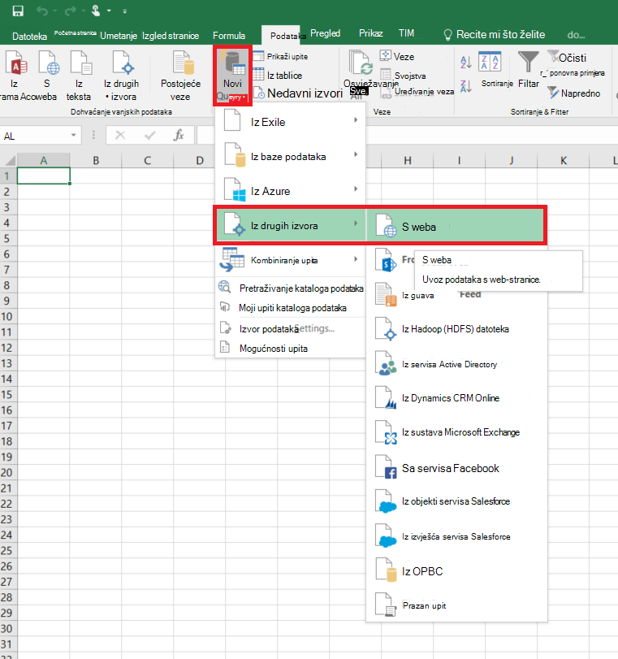
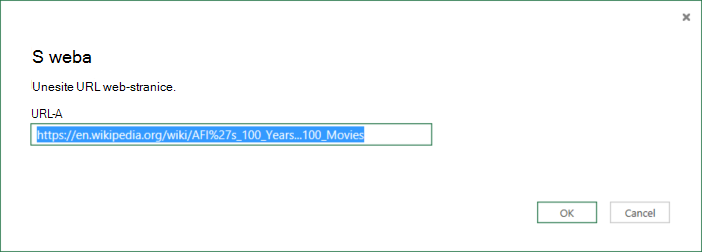
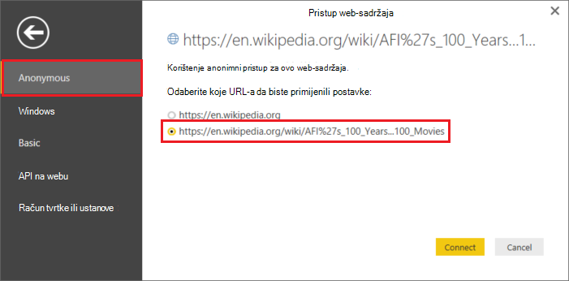
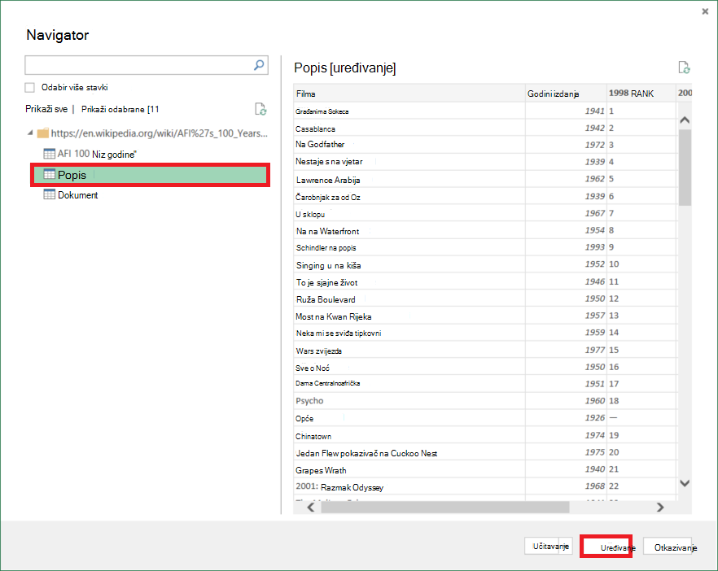
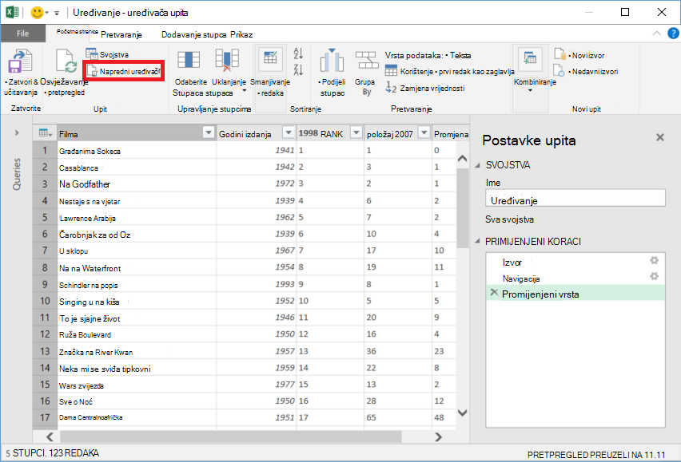
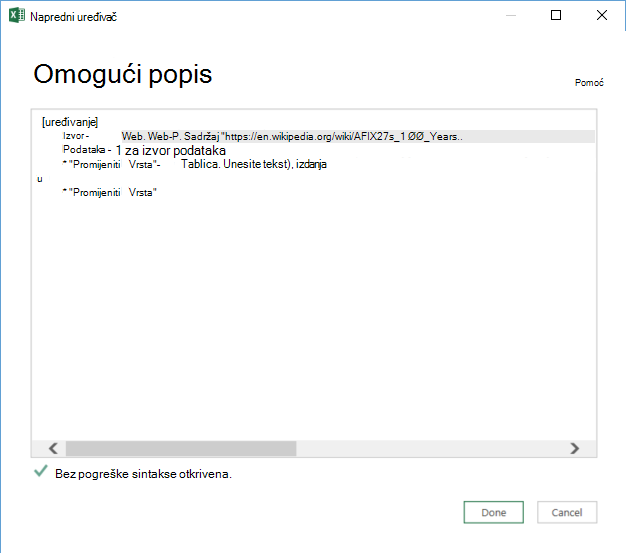

<properties 
    pageTitle="Premještanje podataka iz web-tablice | Tvorničke Azure podataka" 
    description="Saznajte kako premjestiti podatke iz lokalnih tablice u web-stranicu pomoću tvorničke Azure podataka." 
    services="data-factory" 
    documentationCenter="" 
    authors="linda33wj" 
    manager="jhubbard" 
    editor="monicar"/>

<tags 
    ms.service="data-factory" 
    ms.workload="data-services" 
    ms.tgt_pltfrm="na" 
    ms.devlang="na" 
    ms.topic="article" 
    ms.date="09/26/2016" 
    ms.author="jingwang"/>

# Premještanje podataka iz web-tablice izvor pomoću tvorničke Azure podataka
U ovom se članku opisuje kako možete koristiti aktivnosti Kopiraj u na tvorničke Azure podataka za kopiranje podataka iz tablice u web-stranice na drugu spremišta podataka. U ovom se članku sastavlja na članak [aktivnosti premještanje podataka](data-factory-data-movement-activities.md) koja predstavlja Općenito pregled premještanje podataka s Kopiraj aktivnosti i kombinacijama podržanih trgovine.

Tvorničke podataka trenutno podržava samo premještanje podataka iz web-tablice u drugim spremišta podataka, ali ne premještanje podataka iz drugih podataka pohranjuje na odredište Web tablice.

> [AZURE.NOTE] Poveznik za Web trenutno podržava samo izdvajanje tablice sadržaja iz HTML stranicu.

## Primjer: Kopirajte podatke iz web-tablice u blobova platforme Azure

Prikazuje se uzorak u nastavku:

1.  Povezane servis vrsta [Web](#web-linked-service-properties).
2.  Povezane servis vrste [AzureStorage](data-factory-azure-blob-connector.md#azure-storage-linked-service-properties).
3.  Za unos [dataset](data-factory-create-datasets.md) vrste [WebTable](#WebTable-dataset-properties).
4.  Za izlazni [skup podataka](data-factory-create-datasets.md) vrste [AzureBlob](data-factory-azure-blob-connector.md#azure-blob-dataset-type-properties).
4.  Na [kanal](data-factory-create-pipelines.md) s Kopiraj aktivnosti koje koristi [WebSource](#websource-copy-activity-type-properties) i [BlobSink](data-factory-azure-blob-connector.md#azure-blob-copy-activity-type-properties).

Uzorak kopira podatke s web-tablice blobova platforme Azure svaki sat. Svojstvima JSON koji se koriste u ta uzorka opisana su u odjeljcima pratiti primjere. 

Sljedeći primjer prikazuje način da biste kopirali podatke iz web-tablice blobova platforme Azure. Međutim, podaci mogu kopirati izravno u bilo koji od primatelji naveden u članku [Aktivnosti premještanje podataka](data-factory-data-movement-activities.md) pomoću aktivnosti Kopiraj u tvorničke Azure podataka. 

**Web povezana servisa** U ovom se primjeru koristi web-povezane usluge sa anonimna provjera autentičnosti. Sekciji [Web povezani servisa](#web-linked-service-properties) potražite u članku za različite vrste provjere autentičnosti možete koristiti. 

    {
        "name": "WebLinkedService",
        "properties":
        {
            "type": "Web",
            "typeProperties":
            {
                "authenticationType": "Anonymous",
                "url" : "https://en.wikipedia.org/wiki/"
            }
        }
    }

**Azure servis za pohranu povezana**

    {
      "name": "AzureStorageLinkedService",
      "properties": {
        "type": "AzureStorage",
        "typeProperties": {
          "connectionString": "DefaultEndpointsProtocol=https;AccountName=<accountname>;AccountKey=<accountkey>"
        }
      }
    }

**Unos dataset WebTable** Postavka **vanjske** **True** obavještava servis tvorničke podataka skup podataka ne ovisi o tvorničke podataka, a ne osnovu aktivnost u tvorničke podataka.

> [AZURE.NOTE] Potražite u članku [Početak indeksa tablice u HTML stranicu](#get-index-of-a-table-in-an-html-page) sekcije korake za početak indeksa tablice u HTML stranicu.  

    
    {
        "name": "WebTableInput",
        "properties": {
            "type": "WebTable",
            "linkedServiceName": "WebLinkedService",
            "typeProperties": {
                "index": 1,
                "path": "AFI's_100_Years...100_Movies"
            },
            "external": true,
            "availability": {
                "frequency": "Hour",
                "interval":  1
            }
        }
    }

**Blobova platforme Azure izlazni skup podataka**

Podaci se upisuju u novi blob svaki sat (učestalost: h, interval: 1). 

    {
        "name": "AzureBlobOutput",
        "properties":
        {
            "type": "AzureBlob",
            "linkedServiceName": "AzureStorageLinkedService",
            "typeProperties":
            {
                "folderPath": "adfgetstarted/Movies"
            },
            "availability":
            {
                "frequency": "Hour",
                "interval": 1
            }
        }
    }

**Kanal s Kopiraj aktivnosti**

Kanal sadrži aktivnosti Kopiraj koji je konfiguriran za korištenje iznad ulazni i izlazni skupova podataka i zakazana da biste pokrenuli svaki sat. U kanalu JSON definicija vrsta **izvora** postavljen na **WebSource** , a **primatelj** je vrsta **BlobSink**. 

Popis svojstava podržava na WebSource potražite u članku [WebSource vrsta svojstva](#websource-copy-activity-type-properties) . 
    
    {  
        "name":"SamplePipeline",
        "properties":{  
        "start":"2014-06-01T18:00:00",
        "end":"2014-06-01T19:00:00",
        "description":"pipeline with copy activity",
        "activities":[  
          {
            "name": "WebTableToAzureBlob",
            "description": "Copy from a Web table to an Azure blob",
            "type": "Copy",
            "inputs": [
              {
                "name": "WebTableInput"
              }
            ],
            "outputs": [
              {
                "name": "AzureBlobOutput"
              }
            ],
            "typeProperties": {
              "source": {
                "type": "WebSource"
              },
              "sink": {
                "type": "BlobSink"
              }
            },
           "scheduler": {
              "frequency": "Hour",
              "interval": 1
            },
            "policy": {
              "concurrency": 1,
              "executionPriorityOrder": "OldestFirst",
              "retry": 0,
              "timeout": "01:00:00"
            }
          }
          ]
       }
    }

## Web-servis za povezane svojstva

Sljedeća tablica sadrži opis elemenata JSON specifične za web-servis povezani.

| Svojstvo | Opis | Obavezno |
| -------- | ----------- | -------- | 
| Vrsta | Svojstvo vrsta mora biti postavljeno na: **Web** | Da | 
| URL-a | URL web-izvoru | Da |
| authenticationType | Anonimni ili osnovni. | Da |
| korisničko ime | Korisničko ime za osnovnu provjeru autentičnosti. | Da (za osnovnu provjeru autentičnosti)
| lozinke | Lozinka za osnovnu provjeru autentičnosti. | Da (za osnovnu provjeru autentičnosti)

### Korištenje anonimna provjera autentičnosti

    {
        "name": "web",
        "properties":
        {
            "type": "Web",
            "typeProperties":
            {
                "authenticationType": "Anonymous",
                "url" : "https://en.wikipedia.org/wiki/"
            }
        }
    }

### Korištenje Osnovna provjera autentičnosti
    
    {
        "name": "web",
        "properties":
        {
            "type": "Web",
            "typeProperties":
            {
                "authenticationType": "basic",
                "url" : "http://myit.mycompany.com/",
                "userName": "Administrator",
                "password": "password"
            }
        }
    }

## Svojstva WebTable skup podataka

Potpuni popis sekcija i svojstva dostupna za definiranje skupove podataka potražite u članku [Stvaranje skupova podataka](data-factory-create-datasets.md) . Sekcija kao što su strukturu, dostupnost i pravila dataset JSON su slične za sve vrste skup podataka (Azure SQL, blobova platforme Azure, tablica platforme Azure itd.).

U odjeljku **typeProperties** razlikuje za svaku vrstu skup podataka i daje informacije o lokaciji podataka u spremištu podataka. Odjeljak typeProperties za skup podataka vrste **WebTable** sadrži sljedeća svojstva

Svojstvo | Opis | Obavezno
:-------- | :----------- | :--------
Vrsta    | Vrsta skupu podataka. mora biti postavljeno na **WebTable** | Da
put | Relativni URL resursa koja sadrži tablicu. | ne. Kada put nije naveden, koristi se samo URL naveden u definiciji povezane servisa. 
Indeks | Indeks tablice u resurs. Potražite u članku [Početak indeksa tablice u HTML stranicu](#get-index-of-a-table-in-an-html-page) sekcije korake za početak indeksa tablice u HTML stranicu. | Da

**Primjer:**

    {
        "name": "WebTableInput",
        "properties": {
            "type": "WebTable",
            "linkedServiceName": "WebLinkedService",
            "typeProperties": {
                "index": 1,
                "path": "AFI's_100_Years...100_Movies"
            },
            "external": true,
            "availability": {
                "frequency": "Hour",
                "interval":  1
            }
        }
    }

## WebSource - svojstva vrste aktivnosti Kopiraj

Potpuni popis sekcija i svojstva dostupna za definiranje aktivnosti, potražite u članku [Stvaranje kanali](data-factory-create-pipelines.md) . Svojstva kao što su naziv, opis, ulazni i izlazni tablice, i pravila dostupni su za sve vrste aktivnosti. 

Svojstva dostupna u odjeljku typeProperties aktivnosti razlikuju se s druge strane sa svakom vrstom aktivnosti. Kopiraj aktivnosti, oni ovisi o vrsti izvora i primatelji.

Trenutno kad je izvor u kopiju aktivnosti vrste **WebSource**, podržani su bez dodatna svojstva. 

## Dobivanje indeksa tablice u HTML stranica

1. Pokrenite **Excel 2016** i prijeđite na kartici **Podaci** .  
2. Na alatnoj traci kliknite **Novi upit** , pokažite na **Iz drugih izvora** i kliknite **S weba**.
    
     
3. U dijaloškom okviru **S weba** unesite **URL** koje želite koristiti u povezane servisa JSON (na primjer: https://en.wikipedia.org/wiki/) uz put želite navesti za skup podataka (na primjer: AFI % 27s_100_Years... 100_Movies), a zatim kliknite **u redu**. 

     

    URL-a u ovom primjeru koriste: https://en.wikipedia.org/wiki/AFI%27s_100_Years...100_Movies 
4.  Ako se prikaže dijaloški okvir za **pristup web-sadržaja** , odaberite desno **URL-a**, **provjere autentičnosti**, a zatim kliknite **Poveži**. 

    
5.  Kliknite **tablicu** stavke u prikazu stabla vidjeti sadržaj iz tablice, a zatim kliknite gumb **Uređivanje** pri dnu.  

     

5. U prozor **Uređivača upita** kliknite **Napredni uređivač** gumb na alatnoj traci.

    

6. U dijaloškom okviru Napredni uređivač je broj uz stavku "Izvor" indeks.

     

Ako koristite Excel 2013, koristite [Microsoft Power Query za Excel](https://www.microsoft.com/download/details.aspx?id=39379) da biste dobili indeksa. Potražite u članku [Povezivanje s web-stranicu](https://support.office.com/article/Connect-to-a-web-page-Power-Query-b2725d67-c9e8-43e6-a590-c0a175bd64d8) članka detalje. Koraci su slične ako koristite [Microsoft Power BI za radnu površinu](https://powerbi.microsoft.com/desktop/). 

[AZURE.INCLUDE [data-factory-column-mapping](../../includes/data-factory-column-mapping.md)]

[AZURE.INCLUDE [data-factory-structure-for-rectangualr-datasets](../../includes/data-factory-structure-for-rectangualr-datasets.md)]

## Performanse i ugađanje  
Potražite u članku [Kopiranje aktivnosti performanse i vodič za ugađanje](data-factory-copy-activity-performance.md) dodatne informacije o ključa čimbenici koji utjecaj na performanse pomicanja podataka (Kopiraj aktivnosti) u tvorničke Azure podataka i razni načini optimizirati.
