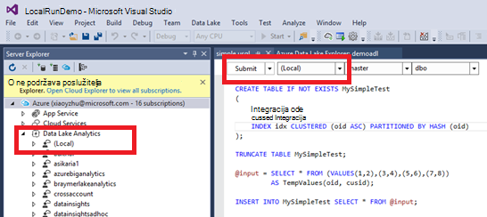

<properties
   pageTitle="Razvoj U SQL skripte pomoću alata za Lake podataka za Visual Studio | Azure"
   description="Saznajte kako instalirati Data Lake Tools za Visual Studio, razvoju i testiranje U SQL skripte. "
   services="data-lake-analytics"
   documentationCenter=""
   authors="edmacauley"
   manager="jhubbard"
   editor="cgronlun"/>

<tags
   ms.service="data-lake-analytics"
   ms.devlang="na"
   ms.topic="get-started-article"
   ms.tgt_pltfrm="na"
   ms.workload="big-data"
   ms.date="05/16/2016"
   ms.author="edmaca"/>

# Praktični vodič: razvoj U SQL skripte pomoću alata za Lake podataka za Visual Studio

[AZURE.INCLUDE [get-started-selector](../../includes/data-lake-analytics-selector-get-started.md)]

Saznajte kako instalirati Data Lake Tools za Visual Studio i koristiti Data Lake Tools za Visual Studio za pisanje i testirati U SQL skripte.

U SQL je hyper prilagodljivi, izrazito jezik za pripremu, pretvorba i analiza sve podatke u lake podataka i izvan. Dodatne informacije potražite u članku [referenca U SQL] (http://go.microsoft.com/fwlink/p/?LinkId=691348).

##Preduvjeti

- **Visual Studio 2015, Visual Studio 2013 ažurirajte 4 ili Visual Studio 2012. Enterprise (Ultimate na Premium), Professional zajednice izdanja podržani; Express edition nije podržano. Visual Studio "15" trenutno nije podržano i Radimo na koji.**
- **Microsoft Azure SDK za .NET verzije 2.7.1 ili noviji**.  Instalirajte ga pomoću [installer platformu za Web](http://www.microsoft.com/web/downloads/platform.aspx).
- **[Lake podataka Tools za Visual Studio](http://aka.ms/adltoolsvs)**.

    Kad instalirate Data Lake Tools za Visual Studio, vidjet ćete čvor "Analize podataka Lake" u programu Explorer poslužitelja u odjeljku čvor "Azure" (možete otvoriti poslužitelja explorer pritiskom na kombinaciju tipki Ctrl + Alt + S).

- **Proći kroz sljedeća dva odjeljka [Početak rada s Lake analize podataka za Azure](data-lake-analytics-get-started-portal.md)pomoću portala za Azure**.

    - [Stvaranje računa Azure podataka Lake analize](data-lake-analytics-get-started-portal.md#create_adl_analytics_account).
    - [Prijenos SearchLog.tsv zadani račun za pohranu Lake podataka](data-lake-analytics-get-started-portal.md#update-data-to-the-default-adl-storage-account).

    Praktičan, skriptu PowerShell uzorka za stvaranje podataka Lake analitički usluge i prijenos datoteke izvora podataka moguće je pronaći u [Appx-A PowerShell uzorka za pripremu vodič](data-lake-analytics-data-lake-tools-get-started.md#appx-a-powershell-sample-for-preparing-the-tutorial).

    Lake Alati podataka ne podržava stvaranje analize podataka Lake računi. Tako ćete morati stvoriti pomoću Azure portalu Azure PowerShell, .NET SDK ili EŽA Azure. Da biste pokrenuli analize podataka Lake posla, trebat će vam neke podatke. Iako Lake Alati podataka podržava prijenos podataka, na portalu će koristiti da biste prenijeli ogledne podatke da biste olakšali praćenje ovog praktičnog vodiča.

## Povezivanje s Azure

**Povezivanje s podacima Lake analize**

1. Otvorite Visual Studio.
2. Na izborniku **Prikaz** kliknite **Poslužitelj Explorer** otvorite Eksplorer za poslužitelj. Ili pritisnite **[CTRL] + [ALT] + S**.
3. Desnom tipkom miša kliknite **Azure**, kliknite "Povezivanje za Microsoft Azure pretplate", a zatim slijedite upute.
4. Iz programa **Explorer poslužitelja**proširite **Azure**, a zatim **Analitika Lake podataka**. Prikazat će popis računa analize podataka Lake ako ih ima. Ne možete stvoriti račune analize podataka Lake iz Visual Studio. Da biste stvorili račun, pročitajte članak [Početak rada s Lake analize podataka za Azure pomoću portala za Azure](data-lake-analytics-get-started-portal.md) ili [Početak rada s Azure podataka Lake analize pomoću komponente PowerShell Azure](data-lake-analytics-get-started-powershell.md).

## Prijenos datoteka izvora podataka

Neki podaci u odjeljku **pripremni** ste prenijeli ranije u ovom praktičnom vodiču.  

U slučaju da želite koristiti vlastitim podacima, Evo postupke za prijenos podataka iz alata za Lake podataka.

**Da biste prenijeli datoteke zavisne Azure podataka Lake računa**

1. Iz programa **Explorer poslužitelja**proširite **Azure**, proširite **Analize podataka Lake**, proširite računa analize podataka Lake, proširite **Račune za pohranu**. Moraju vidjeti zadani pohrana podataka Lake račun i povezane poslovne subjekte za pohranu podataka Lake i povezane poslovne subjekte u Azure prostora za pohranu. Zadani račun Lake podataka ima natpis "Zadani račun za pohranu".
2. Desnom tipkom miša kliknite zadani račun za pohranu Lake podataka, a zatim kliknite **Explorer**.  Otvara se Lake Alati podataka za oknu Eksplorer za Visual Studio.  S lijeve strane prikazuje u prikazu stabla prikazu sadržaja je na desnoj strani.
3. Pronađite mapu u koju želite prenijeti datoteke,
4. Desnom tipkom miša kliknite bilo koji prazan prostor, a zatim kliknite **Prenesi**.

    

**Da biste prenijeli datoteke povezanih računa spremišta blobova platforme Azure**

1. Iz programa **Explorer poslužitelja**proširite **Azure**, proširite **Analize podataka Lake**, proširite računa analize podataka Lake, proširite **Račune za pohranu**. Moraju vidjeti zadani pohrana podataka Lake račun i povezane poslovne subjekte za pohranu podataka Lake i povezane poslovne subjekte u Azure prostora za pohranu.
2. Proširite račun za Azure prostora za pohranu.
3. Desnom tipkom miša kliknite spremnik mjesto na koje želite prenijeti datoteke, a zatim kliknite **Explorer**. Ako nemate spremniku, najprije morate stvoriti pomoću portala za Azure, Azure PowerShell ili druge alate za.
4. Pronađite mapu u koju želite prenijeti datoteke,
5. Desnom tipkom miša kliknite bilo koji prazan prostor, a zatim kliknite **Prenesi**.

## Razvoj U SQL skripte

Poslovi analize podataka Lake zapisuju U SQL jeziku. Dodatne informacije o U SQL potražite u članku [Uvod U SQL jezika](data-lake-analytics-u-sql-get-started.md) i [U SQL jezične preporuke](http://go.microsoft.com/fwlink/?LinkId=691348).

**Stvaranje i slanje analize podataka Lake posla**

1. Na izborniku **datoteka** kliknite **Novo**, a zatim **projekta**.
2. Odaberite vrstu **Projekta U SQL** .

    

3. Kliknite **u redu**. Visual studio stvara rješenje pomoću **Script.usql** datoteke.
4. Unesite sljedeću skriptu u **Script.usql**:

        @searchlog =
            EXTRACT UserId          int,
                    Start           DateTime,
                    Region          string,
                    Query           string,
                    Duration        int?,
                    Urls            string,
                    ClickedUrls     string
            FROM "/Samples/Data/SearchLog.tsv"
            USING Extractors.Tsv();

        @res =
            SELECT *
            FROM @searchlog;        

        OUTPUT @res   
            TO "/Output/SearchLog-from-Data-Lake.csv"
        USING Outputters.Csv();

    Ova skripta U SQL čita izvornu datoteku podataka pomoću **Extractors.Tsv()**i stvara u csv datoteku pomoću **Outputters.Csv()**.

    Nemojte mijenjati dva puta osim ako koji ste kopirali izvornu datoteku na drugo mjesto.  Ako ne postoji analize podataka Lake će stvoriti Izlazna datoteka.

    To je jednostavnije koristiti relativni putovi za datoteke spremljene u zadanom podataka Lake računi. Možete koristiti i apsolutni putovi.  Na primjer

        adl://<Data LakeStorageAccountName>.azuredatalakestore.net:443/Samples/Data/SearchLog.tsv

    Koristite apsolutne putova da biste pristupili datotekama u povezane poslovne subjekte prostora za pohranu.  Vidjet ćete da sintaksa za datoteke spremljene u povezani poslovni subjekt za pohranu Azure je:

        wasb://<BlobContainerName>@<StorageAccountName>.blob.core.windows.net/Samples/Data/SearchLog.tsv

    >[AZURE.NOTE] Azure Blob kontejner s javnim blob-ova ili dozvole za pristup javnim spremnika trenutno nisu podržani.  

    Obratite pozornost na sljedeće značajke:

    - **IntelliSense**

        Naziv automatski dovršiti i članove koji se prikazuju za skup redaka, klase, baze podataka, sheme i korisnički definirani objekti (UDOs).

        Značajke IntelliSense za katalog entiteti (baza podataka sheme, tablice, UDOs itd.) povezana je s računalnim račun. Provjerite trenutni aktivni računalnim račun, baze podataka i shema u gornjoj alatnoj traci i ih prijeđite do na padajućem popisu.

    - **Proširivanje* stupaca**

        Kliknite s desne strane *, prikazat će plava podcrte ispod na *. Zadržite pokazivač miša na plavo podcrtano, a zatim kliknite strelicu prema dolje.
        

        Kliknite **Proširivanje stupaca**, zamijenit će alat za * s nazivima stupaca.

    - **Automatsko oblikovanje**

        Korisnici mogu promijeniti uvlaka U SQL skripte na temelju šifre strukture u odjeljku uređivanje -> Dodatno:

        - Oblikovanje dokumenta (Ctrl + E, D): Oblicima cijeli dokument   
        - Odabir oblika (Ctrl + K, Ctrl + F): Oblicima odabira. Ako je učinio nije odabrano, ovaj prečac oblikovanja je pokazivač u redak.  

        Sva oblikovanja pravila se može konfigurirati u odjeljku Alati za -> Mogućnosti -> uređivač teksta - > SIP -> Oblikovanje.  
    - **Pametno uvlake**

        Da biste uvukli izraza automatski dok pišete skripte je Data Lake Tools za Visual Studio. Značajka je onemogućena prema zadanim postavkama, korisnici morati omogućiti putem provjere U-SQL -> Mogućnosti i postavki -> parametri -> Omogući pametno uvlaku.

    - **Idite na definiciju i pronađite sve reference**

        Desnom tipkom miša kliknete naziv skup redaka/parametar/stupac/UDO itd., a zatim kliknite Idi na definiciju (F12) omogućuje da biste došli do njegova definicija. Klikom na pronašli sve reference (Shift + F12) prikazivat će se sve reference.

    - **Umetanje Azure put**

        Umjesto plaćanju put Azure datoteke pa upišite ručno prilikom pisanja skripte, Data Lake Tools za Visual Studio pruža jednostavan način: desnom tipkom miša kliknite u uređivaču, kliknite Umetanje Azure put. Dođite do datoteke u dijaloškom okviru preglednika blobova platforme Azure. Kliknite **u redu**. put datoteke se umeće kod.

5. Navedite račun analize podataka Lake, baze podataka i shemu. Možete odabrati **(lokalno)** da biste pokrenuli skriptu lokalno u svrhu testiranja. Dodatne informacije potražite u članku [Pokretanje U-SQL lokalno](#run-u-sql-locally).

    

    Dodatne informacije potražite u članku [U SQL za korištenje kataloga](data-lake-analytics-use-u-sql-catalog.md).

5. U **Pregledniku rješenja**, desnom tipkom miša kliknite **Script.usql**, a zatim **Stvoriti skriptu**. Provjerite je li rezultata u oknu Izlaz.
6. U **Pregledniku rješenja**, desnom tipkom miša kliknite **Script.usql**, a zatim **Pošalji skripte**. Ako želite, možete kliknuti i **Slanje** iz okna Script.usql.  Pogledajte prethodni snimku zaslona.  Kliknite strelicu prema dolje pokraj gumba Pošalji da biste poslali pomoću naprednih mogućnosti:
7. Navedite **Naziv zadatka**, provjerite **Analize računa**, a zatim **Pošalji**. Slanje rezultata i veze za posao dostupni su u alatima za Visual Studio uzrokuje prozor za Lake podataka po dovršetku slanja.

    

8. Mora kliknuti gumb Osvježi da biste vidjeli najnovije stanja zadatka i osvježavanje zaslona. Kada uspjeha zadatak je vidjet ćete u **Grafikonu posla**, **Operacija Meta podataka** **Stanja povijesti** **dijagnostiku**:

    

    * Sažetak posla. Prikaz sažetak informacija trenutnog posla, npr.: Stanje tijeka, vrijeme izvođenja, izvođenja naziv, slanja itd.   
    * Detalji o posao. Detaljne informacije o ovaj zadatak nije naveden, uključujući skriptu, resursa, vrh izvođenja prikaz.
    * Graph za posao. Četiri grafikona služe za Vizualizirajte podatke na posao: tijek, čitanje podataka, zapisan podataka, vrijeme izvođenja, Prosječno vrijeme izvođenja po čvor, propusnost unos, izlazna propusnost.
    * Operacije metapodataka. Prikazuje sve operacije metapodataka.
    * Stanja povijesti.
    * Dijagnostika. Data Lake Tools za Visual Studio će automatski dijagnosticiranje izvođenja posla. Primit ćete obavijesti o kad postoje neke pogreške ili probleme s performansama u svoje zadatke. Zadatak dio Dijagnostika (veza TBD) dodatne informacije potražite u članku.

**Da biste provjerili stanje posla**

1. Iz programa Explorer poslužitelja proširite **Azure**, proširite **Analize podataka Lake**, proširite naziv računa analize podataka Lake
2. Dvokliknite **zadataka** na popisu poslove.
2. Kliknite zadatak da biste vidjeli status.

**Da biste vidjeli izlaz posla**

1. Iz programa **Explorer poslužitelja**proširite **Azure**, proširite **Analize podataka Lake**, proširite računa analize podataka Lake, proširite **Račune za pohranu**, desnom tipkom miša kliknite zadani račun za pohranu Lake podataka, a zatim **Explorer**.
2.  Dvokliknite **Izlaz** otvorite mapu
3.  Dvokliknite **SearchLog iz adltools.csv**.

###Reprodukcija posla

Reprodukcija posao omogućuje pogledajte napretka izvođenja posla i vizualno otkriti anomalies performanse i grla. Ta značajka može se koristiti prije nego što se posao dovrši izvođenja (odnosno tijekom vremena zadatak aktivno izvršava), kao i kada se dovrši izvođenje. Način reprodukcije tijekom izvođenja posla će korisnicima da biste reproducirali tijeku do trenutnog vremena.

**Da biste pogledali napretka izvođenja posla**  

1. U gornjem desnom kutu kliknite **Učitaj profila** . Pogledajte na prethodni zaslon snimka.
2. Kliknite gumb Reproduciraj u donjem lijevom kutu da biste pregledali izvođenja napretka posla.
3. Tijekom reprodukcije, kliknite **Pauziraj** zaustavite ili izravno povucite traku tijeku određene položaje.

###Karte ekstrema

Data Lake Tools za Visual Studio omogućuje korisniku moguće odabrati boju preklapajućeg na prikaz zadatka da biste naznačili tijeku podataka/i, vrijeme izvođenja, / i propusnost svakoj fazi. Kroz, korisnici mogu utvrđivanje potencijalne probleme i distribucija svojstva zadatka izravno i intuitivno. Možete odabrati izvor podataka za prikaz na padajućem popisu.  

## U SQL izvodi lokalno

Koristi lokalno U SQL pokretanje sučelje u Visual Studio, možete učiniti sljedeće:

- Pokrenite U SQL skripte lokalno, zajedno s C# sklopova.
- C# sklopova lokalno za ispravljanje pogrešaka.
- Stvaranje i brisanje/prikaza lokalne baze podataka, skupovi, sheme i tablice u programu Explorer poslužitelja samo kao što možete učiniti za servis Azure podataka Lake Analytics.

Prikazat će se *Lokalni* račun u Visual Studio i instalacijski program stvara *DataRoot* mapa nalazi *C:\LocalRunRoot*. Koristit će se u mapu DataRoot:

- Spremište metapodataka uključujući tablice, DBs, TVFs itd.
- Za određene skriptu: Ako relativni put poziva na ulazni i izlazni putova, ne možemo će izgledati prema gore na DataRoot (kao i u skriptu put ako je to je unos)
- Mapu DataRoot će se pozivati ako pokušavate registrirati u sklopu te koristite relativni put (pogledajte "sklopova koristite kada način lokalne cilja" dio više pojedinosti)

U ovom videozapisu prikazuje U SQL lokalne za pokretanje značajke:

>[AZURE.VIDEO usql-localrun]

### Poznatim problemima i ograničenjima

- Nije moguće stvoriti tablicu/DB itd u programu Explorer poslužitelja za lokalni račun.
- Kada su navedeni relativni put:

    - U skripti unos (izdvajanje * POŠILJATELJ "/ put/abc")-put DataRoot i put skripte pretraživati.
    - Za skripte izlaz (IZLAZ na "put na abc"): put DataRoot bit će upotrijebljen kao izlazna datoteka.
    - U Registracija skupa (Stvaranje SKUPA neki od "/ put/abc"): put skripte će pretraživati, ali ne DataRoot.
    - Na registriran TVF/vidjeti ili drugi entiteti metapodataka: put DataRoot će pretraživati, ali ne i skripte put.

    Za skripte pokrenut servis za Lake podataka, zadani račun za pohranu bit će upotrijebljen kao korijenske mape i pretražuju se sukladno tome.

### Testiranje U SQL skripte lokalno
Upute za razvoj U SQL skripte, potražite [U razvoju-SQL skripte](#develop-and-test-u-sql-scripts). Stvaranje i pokretanje U SQL skripte lokalno, odaberite **(lokalno)** na padajućem popisu klaster pa kliknite **Pošalji**. Provjerite je li imate odgovarajuće podatke poziva – ili se odnositi na apsolutni put ili smjestiti podatke u mapi DataRoot.

Možete i desnom tipkom miša kliknite skripte i zatim kliknite **Pokreni lokalne Plan** na kontekstnom izborniku, ili pritisnite **CTRL + F5** okidača lokalni pokrenuti.

### Korištenje sklopova u lokalnoj na pokrenite

Da biste pokrenuli prilagođene C# datoteke na dva načina:

- Pisanje sklopova kod iza datoteke i u sklopova bit će automatski registered i prekine po završetku skriptu.
- Stvaranje skupa projekta C# i registrirati dll izlaz za lokalni račun putem skripte kao što su ispod. Uzmite u obzir put je odnosu skriptu umjesto DataRoot mapu.

### Ispravljanje pogrešaka u skripti i C# sklopova lokalno

Možete ispraviti pogreške C# sklopova bez slanja i Prijava na servis Lake analize podataka za Azure. Možete postaviti prekidne točke u oba kod u pozadini datoteke i referentne C# projekta.

**Za ispravljanje pogrešaka lokalne kod u kod iza datoteka**
1.  Postavite prekidne točke u kodu iza datoteke.
2.  Pritisnite **F5** za ispravljanje pogrešaka u skripti lokalno.

Ovaj postupak funkcionira samo u Visual Studio 2015. U starijim Visual Studio morati ručno dodati pdb datoteke.

**Za ispravljanje pogrešaka lokalne kod u referencirani C# projekta**
1.  Stvaranje projekta C# skupa pa je da biste generirali dll izlaz.
2.  Registriranje dll pomoću U SQL naredbe:

        CREATE ASSEMBLY assemblyname FROM @"..\..\path\to\output\.dll";
3.  Postavljanje prekidne točke u C# kod.
4.  Pritisnite **F5** za ispravljanje pogrešaka u skripti pomoću pozivanju C# dll lokalno.  

##Vidi također

Početak rada s podacima Lake analize pomoću raznih alata, potražite u članku:

- [Početak rada s podacima Lake analize pomoću portala za Azure](data-lake-analytics-get-started-portal.md)
- [Početak rada s podacima Lake analize pomoću komponente PowerShell Azure](data-lake-analytics-get-started-powershell.md)
- [Početak rada s podacima Lake analize pomoću .NET SDK](data-lake-analytics-get-started-net-sdk.md)
- [C# kod u zadacima U SQL za ispravljanje pogrešaka](data-lake-analytics-debug-u-sql-jobs.md)

Da biste vidjeli dodatne teme razvoj:

- [Analiza weblogovi pomoću analize podataka Lake](data-lake-analytics-analyze-weblogs.md)
- [Razvoj U SQL skripte pomoću alata za Lake podataka za Visual Studio](data-lake-analytics-data-lake-tools-get-started.md)
- [Početak rada s jezikom Azure podataka Lake analize U-SQL](data-lake-analytics-u-sql-get-started.md)
- [Razvoj U SQL korisnički definirane operatori za analize podataka Lake poslove](data-lake-analytics-u-sql-develop-user-defined-operators.md)

##Ogledna PowerShell Appx-A za pripremu vodič

Sljedeću skriptu komponente PowerShell Priprema račun za Azure podataka Lake analize i izvorišne podatke umjesto vas, pa možete preskočiti [razviti U – SQL skripte](data-lake-analytics-data-lake-tools-get-started.md#develop-u-sql-scripts).

    #region - used for creating Azure service names
    $nameToken = "<Enter an alias>"
    $namePrefix = $nameToken.ToLower() + (Get-Date -Format "MMdd")
    #endregion

    #region - service names
    $resourceGroupName = $namePrefix + "rg"
    $dataLakeStoreName = $namePrefix + "adas"
    $dataLakeAnalyticsName = $namePrefix + "adla"
    $location = "East US 2"
    #endregion

    # Treat all errors as terminating
    $ErrorActionPreference = "Stop"

    #region - Connect to Azure subscription
    Write-Host "`nConnecting to your Azure subscription ..." -ForegroundColor Green
    try{Get-AzureRmContext}
    catch{Login-AzureRmAccount}
    #endregion

    #region - Create an Azure Data Lake Analytics service account
    Write-Host "Create a resource group ..." -ForegroundColor Green
    New-AzureRmResourceGroup `
        -Name  $resourceGroupName `
        -Location $location

    Write-Host "Create a Data Lake account ..."  -ForegroundColor Green
    New-AzureRmDataLakeStoreAccount `
        -ResourceGroupName $resourceGroupName `
        -Name $dataLakeStoreName `
        -Location $location

    Write-Host "Create a Data Lake Analytics account ..."  -ForegroundColor Green
    New-AzureRmDataLakeAnalyticsAccount `
        -Name $dataLakeAnalyticsName `
        -ResourceGroupName $resourceGroupName `
        -Location $location `
        -DefaultDataLake $dataLakeStoreName

    Write-Host "The newly created Data Lake Analytics account ..."  -ForegroundColor Green
    Get-AzureRmDataLakeAnalyticsAccount `
        -ResourceGroupName $resourceGroupName `
        -Name $dataLakeAnalyticsName  
    #endregion

    #region - prepare the source data
    Write-Host "Import the source data ..."  -ForegroundColor Green
    $localFolder = "C:\Tutorials\Downloads\" # A temp location for the file.
    $storageAccount = "adltutorials"  # Don't modify this value.
    $container = "adls-sample-data"  #Don't modify this value.

    # Create the temp location  
    New-Item -Path $localFolder -ItemType Directory -Force

    # Download the sample file from Azure Blob storage
    $context = New-AzureStorageContext -StorageAccountName $storageAccount -Anonymous
    $blobs = Azure\Get-AzureStorageBlob -Container $container -Context $context
    $blobs | Get-AzureStorageBlobContent -Context $context -Destination $localFolder

    # Upload the file to the default Data Lake Store account    
    Import-AzureRmDataLakeStoreItem -AccountName $dataLakeStoreName -Path $localFolder"SearchLog.tsv" -Destination "/Samples/Data/SearchLog.tsv"

    Write-Host "List the source data ..."  -ForegroundColor Green
    Get-AzureRmDataLakeStoreChildItem -Account $dataLakeStoreName -Path  "/Samples/Data/"
    #endregion
