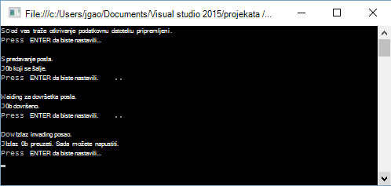

<properties 
   pageTitle="Početak rada s Azure podataka Lake analize pomoću .NET SDK | Azure" 
   description="Saznajte kako koristiti .NET SDK da biste stvorili računi trgovine Lake podataka, stvoriti analize podataka Lake zadacima i slanje poslove pisane U SQL. " 
   services="data-lake-analytics" 
   documentationCenter="" 
   authors="edmacauley" 
   manager="jhubbard" 
   editor="cgronlun"/>
 
<tags
   ms.service="data-lake-analytics"
   ms.devlang="na"
   ms.topic="hero-article"
   ms.tgt_pltfrm="na"
   ms.workload="big-data" 
   ms.date="10/26/2016"
   ms.author="edmaca"/>

# Praktični vodič: početak rada s Azure podataka Lake analize pomoću .NET SDK-a

[AZURE.INCLUDE [get-started-selector](../../includes/data-lake-analytics-selector-get-started.md)]

Saznajte kako koristiti Azure .NET SDK slanje poslove pisane [U SQL](data-lake-analytics-u-sql-get-started.md) analize podataka Lake. Dodatne informacije o analize Lake podataka potražite u članku [Pregled Azure podataka Lake analize](data-lake-analytics-overview.md).

U ovom ćete praktičnom vodiču će razviti C# program konzole za slanje U SQL zadatak koji se čita karticu datoteku (TSV) vrijednosti odvojenih i pretvara ga u datoteku (CSV) vrijednosti odvojenih zarezom. Da biste došli do isti praktičnom vodiču pomoću drugih alata za podržane, klikom na kartice pri vrhu stranice u ovom se članku.

##Preduvjeti

Prije početka ovog praktičnog vodiča, morate imati sljedeće:

- **Visual Studio 2015, Visual Studio 2013 ažurirati 4, ili Visual Studio 2012 s Visual C++ instaliran**.
- **Microsoft Azure SDK za .NET verzije 2.5 ili noviji**.  Instalirajte ga pomoću [installer platformu za Web](http://www.microsoft.com/web/downloads/platform.aspx).
- **Račun programa Azure analize Lake podataka**. Potražite u članku [Upravljanje podacima Lake analize pomoću Azure .NET SDK](data-lake-analytics-manage-use-dotnet-sdk.md).

##Stvaranje aplikacije konzole

U ovom ćete praktičnom vodiču procesa nekim zapisnicima pretraživanja.  U zapisniku pretraživanja može se spremiti u spremište podataka Lake ili spremište blobova platforme Azure. 

Zapisnik pretraživanja uzorka pronaći ćete u spremniku javno blobova platforme Azure. U aplikaciji će preuzeti datoteku na vaše radne stanice, a zatim Prenesite datoteku na zadani spremišta podataka Lake račun vašeg računa analize podataka Lake.

**Da biste stvorili skriptu U SQL**

Poslovi analize podataka Lake zapisuju U SQL jeziku. Dodatne informacije o U SQL potražite u članku [Uvod U SQL jezika](data-lake-analytics-u-sql-get-started.md) i [U SQL jezične preporuke](http://go.microsoft.com/fwlink/?LinkId=691348).

Stvaranje datoteke **SampleUSQLScript.txt** pomoću sljedeće skripte U SQL i postavite datoteku u na **C:\temp\* * put.  Put je koji nisu u aplikaciji za .NET koje ste stvorili u sljedeći postupak.  

    @searchlog =
        EXTRACT UserId          int,
                Start           DateTime,
                Region          string,
                Query           string,
                Duration        int?,
                Urls            string,
                ClickedUrls     string
        FROM "/Samples/Data/SearchLog.tsv"
        USING Extractors.Tsv();
    
    OUTPUT @searchlog   
        TO "/Output/SearchLog-from-Data-Lake.csv"
    USING Outputters.Csv();

Ova skripta U SQL čita izvornu datoteku podataka pomoću **Extractors.Tsv()**i stvara u csv datoteku pomoću **Outputters.Csv()**. 

U C# programu morate Priprema **/Samples/Data/SearchLog.tsv** datoteke i mape **/Output/** .    

To je jednostavnije koristiti relativni putovi za datoteke spremljene u zadanom podataka Lake računi. Možete koristiti i apsolutni putovi.  Na primjer 

    adl://<Data LakeStorageAccountName>.azuredatalakestore.net:443/Samples/Data/SearchLog.tsv
    
Morate koristiti apsolutne putova da biste pristupili datotekama u povezane poslovne subjekte prostora za pohranu.  Vidjet ćete da sintaksa za datoteke spremljene u povezani poslovni subjekt za pohranu Azure je:

    wasb://<BlobContainerName>@<StorageAccountName>.blob.core.windows.net/Samples/Data/SearchLog.tsv

>[AZURE.NOTE] Trenutno je poznat problem sa servisom Azure podataka Lake.  Ako aplikaciju uzorka prekine ili naiđe na pogrešku, možda morati ručno izbrisati spremišta Lake podataka i analize podataka Lake račune koji stvara skriptu.  Ako niste upoznati s portala za Azure, vodič za [Upravljanje Lake Analytics za Azure podataka pomoću portala za Azure](data-lake-analytics-manage-use-portal.md) će vam pri prvim koracima.       

**Da biste stvorili aplikacije**

1. Otvorite Visual Studio.
2. Stvaranje konzole aplikacije C#.
3. Otvorite konzolu za upravljanje NuGet paket, a zatim izvršite sljedeće naredbe:

        Install-Package Microsoft.Azure.Management.DataLake.Analytics -Pre
        Install-Package Microsoft.Azure.Management.DataLake.Store -Pre
        Install-Package Microsoft.Azure.Management.DataLake.StoreUploader -Pre
        Install-Package Microsoft.Rest.ClientRuntime.Azure.Authentication -Pre
        Install-Package WindowsAzure.Storage

       
5. U Program.cs, zalijepite sljedeći kod:

        using System;
        using System.IO;
        using System.Collections.Generic;
        using System.Threading;
        using Microsoft.Rest;
        using Microsoft.Rest.Azure.Authentication;
        using Microsoft.Azure.Management.DataLake.Store;
        using Microsoft.Azure.Management.DataLake.StoreUploader;
        using Microsoft.Azure.Management.DataLake.Analytics;
        using Microsoft.Azure.Management.DataLake.Analytics.Models;
        using Microsoft.WindowsAzure.Storage.Blob;

        namespace SdkSample
        {
          class Program
          {
            private const string SUBSCRIPTIONID = "<Enter Your Azure Subscription ID>";
            private const string CLIENTID = "1950a258-227b-4e31-a9cf-717495945fc2";
            private const string DOMAINNAME = "common"; // Replace this string with the user's Azure Active Directory tenant ID or domain name, if needed.

            private static string _adlaAccountName = "<Enter an Existing Data Lake Analytics Account Name>";
            private static string _adlsAccountName = "<Enter the default Data Lake Store Account Name>";

            private static DataLakeAnalyticsAccountManagementClient _adlaClient;
            private static DataLakeStoreFileSystemManagementClient _adlsFileSystemClient;
            private static DataLakeAnalyticsJobManagementClient _adlaJobClient;
        
            private static void Main(string[] args)
            {
                string localFolderPath = @"c:\temp\";

                // Connect to Azure
                var creds = AuthenticateAzure(DOMAINNAME, CLIENTID);

                SetupClients(creds, SUBSCRIPTIONID);

                // Transfer the source file from a public Azure Blob container to Data Lake Store.
                CloudBlockBlob blob = new CloudBlockBlob(new Uri("https://adltutorials.blob.core.windows.net/adls-sample-data/SearchLog.tsv"));
                blob.DownloadToFile(localFolderPath + "SearchLog.tsv", FileMode.Create); // from WASB
                UploadFile(localFolderPath + "SearchLog.tsv", "/Samples/Data/SearchLog.tsv"); // to ADLS
                WaitForNewline("Source data file prepared.", "Submitting a job.");

                // Submit the job
                Guid jobId = SubmitJobByPath(localFolderPath + "SampleUSQLScript.txt", "My First ADLA Job");
                WaitForNewline("Job submitted.", "Waiting for job completion.");

                // Wait for job completion
                WaitForJob(jobId);
                WaitForNewline("Job completed.", "Downloading job output.");

                // Download job output
                DownloadFile(@"/Output/SearchLog-from-Data-Lake.csv", localFolderPath + "SearchLog-from-Data-Lake.csv");
        
                WaitForNewline("Job output downloaded. You can now exit.");
            }
        
            public static ServiceClientCredentials AuthenticateAzure(
                string domainName,
                string nativeClientAppCLIENTID)
            {
                // User login via interactive popup
                SynchronizationContext.SetSynchronizationContext(new SynchronizationContext());
                // Use the client ID of an existing AAD "Native Client" application.
                var activeDirectoryClientSettings = ActiveDirectoryClientSettings.UsePromptOnly(nativeClientAppCLIENTID, new Uri("urn:ietf:wg:oauth:2.0:oob"));
                return UserTokenProvider.LoginWithPromptAsync(domainName, activeDirectoryClientSettings).Result;
            }

            public static void SetupClients(ServiceClientCredentials tokenCreds, string subscriptionId)
            {
                _adlaClient = new DataLakeAnalyticsAccountManagementClient(tokenCreds);
                _adlaClient.SubscriptionId = subscriptionId;

                _adlaJobClient = new DataLakeAnalyticsJobManagementClient(tokenCreds);

                _adlsFileSystemClient = new DataLakeStoreFileSystemManagementClient(tokenCreds);
            }

            public static void UploadFile(string srcFilePath, string destFilePath, bool force = true)
            {
                var parameters = new UploadParameters(srcFilePath, destFilePath, _adlsAccountName, isOverwrite: force);
                var frontend = new DataLakeStoreFrontEndAdapter(_adlsAccountName, _adlsFileSystemClient);
                var uploader = new DataLakeStoreUploader(parameters, frontend);
                uploader.Execute();
            }

            public static void DownloadFile(string srcPath, string destPath)
            {
                var stream = _adlsFileSystemClient.FileSystem.Open(_adlsAccountName, srcPath);
                var fileStream = new FileStream(destPath, FileMode.Create);

                stream.CopyTo(fileStream);
                fileStream.Close();
                stream.Close();
            }

            // Helper function to show status and wait for user input
            public static void WaitForNewline(string reason, string nextAction = "")
            {
                Console.WriteLine(reason + "\r\nPress ENTER to continue...");

                Console.ReadLine();

                if (!String.IsNullOrWhiteSpace(nextAction))
                    Console.WriteLine(nextAction);
            }

            // List all Data Lake Analytics accounts within the subscription
            public static List<DataLakeAnalyticsAccount> ListADLAAccounts()
            {
                var response = _adlaClient.Account.List();
                var accounts = new List<DataLakeAnalyticsAccount>(response);

                while (response.NextPageLink != null)
                {
                    response = _adlaClient.Account.ListNext(response.NextPageLink);
                    accounts.AddRange(response);
                }

                Console.WriteLine("You have %i Data Lake Analytics account(s).", accounts.Count);
                for (int i = 0; i < accounts.Count; i++)
                {
                    Console.WriteLine(accounts[i].Name);
                }

                return accounts;
            }
            public static Guid SubmitJobByPath(string scriptPath, string jobName)
            {
                var script = File.ReadAllText(scriptPath);

                var jobId = Guid.NewGuid();
                var properties = new USqlJobProperties(script);
                var parameters = new JobInformation(jobName, JobType.USql, properties, priority: 1, degreeOfParallelism: 1, jobId: jobId);
                var jobInfo = _adlaJobClient.Job.Create(_adlaAccountName, jobId, parameters);

                return jobId;
            }

            public static JobResult WaitForJob(Guid jobId)
            {
                var jobInfo = _adlaJobClient.Job.Get(_adlaAccountName, jobId);
                while (jobInfo.State != JobState.Ended)
                {
                    jobInfo = _adlaJobClient.Job.Get(_adlaAccountName, jobId);
                }
                return jobInfo.Result.Value;
            }
          }
        }

6. Pritisnite **F5** da biste pokrenuli aplikaciju. Rezultat je kao što su:

    

7. Potvrdite okvir Izlazna datoteka.  Zadani put i naziv je c:\Temp\SearchLog-from-Data-Lake.csv.

## Vidi također

- Da biste vidjeli iste praktičnom vodiču pomoću drugih alata, kliknite karticu Birači pri vrhu stranice.
- Da biste vidjeli složeniji upit, potražite u članku [zapisnika analiza web-mjesta pomoću Azure podataka Lake analize](data-lake-analytics-analyze-weblogs.md).
- Prvi koraci u razvoju aplikacija U SQL, potražite u članku [razviti U – SQL skripte pomoću alata za Lake podataka za Visual Studio](data-lake-analytics-data-lake-tools-get-started.md).
- Da biste saznali U SQL, potražite u članku [Početak rada s jezikom Azure podataka Lake analize U – SQL](data-lake-analytics-u-sql-get-started.md)i [U SQL jezične preporuke](http://go.microsoft.com/fwlink/?LinkId=691348).
- Upravljanje zadacima, potražite u članku [Upravljanje Lake Analytics za Azure podataka pomoću portala za Azure](data-lake-analytics-manage-use-portal.md).
- Da biste dobili pregled analize podataka Lake, potražite u članku [Pregled Azure podataka Lake analize](data-lake-analytics-overview.md).
