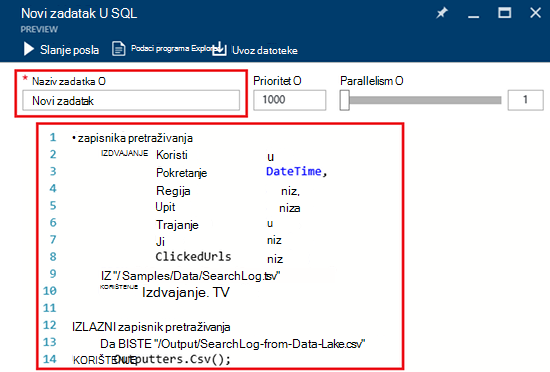

<properties 
   pageTitle="Početak rada s analize Lake podataka za Azure pomoću portala za Azure | Azure" 
   description="Saznajte kako pomoću portala za Azure da biste stvorili analize podataka Lake račun, stvorite posao analize Lake podataka koji se koristi U SQL i slanje posao. " 
   services="data-lake-analytics" 
   documentationCenter="" 
   authors="edmacauley" 
   manager="jhubbard" 
   editor="cgronlun"/>
 
<tags
   ms.service="data-lake-analytics"
   ms.devlang="na"
   ms.topic="hero-article"
   ms.tgt_pltfrm="na"
   ms.workload="big-data" 
   ms.date="10/06/2016"
   ms.author="edmaca"/>

# Praktični vodič: početak rada s analize Lake podataka za Azure pomoću portala za Azure

[AZURE.INCLUDE [get-started-selector](../../includes/data-lake-analytics-selector-get-started.md)]

Saznajte kako stvoriti račune Lake analize podataka za Azure, definirati analize podataka Lake zadacima [U SQL](data-lake-analytics-u-sql-get-started.md)i slanje zadacima sa servisom analize podataka Lake pomoću portala za Azure. Dodatne informacije o analize Lake podataka potražite u članku [Pregled Azure podataka Lake analize](data-lake-analytics-overview.md).

U ovom ćete praktičnom vodiču razviti zadatak koji se čita karticu datoteku (TSV) vrijednosti odvojenih i pretvara ga u datoteku razdvojene zarezom (CSV). Da biste došli do isti praktičnom vodiču pomoću drugih alata za podržane, klikom na kartice pri vrhu stranice u ovom se odjeljku. Nakon uspješnog vaš prvi posao možete početi pisati složenije transformacije podataka s U SQL.

##Preduvjeti

Prije početka ovog praktičnog vodiča, morate imati sljedeće stavke:

- **Mogući Azure pretplate**. Pogledajte [Početak Azure besplatnu probnu verziju](https://azure.microsoft.com/pricing/free-trial/).

##Stvaranje računa analize podataka Lake

Morate imati račun analize podataka Lake prije pokretanja sve zadatke.

Svaki račun analize podataka Lake ima ovisnost računa [Spremišta Lake za Azure podataka]() .  Taj račun se nazivaju zadanog računa za spremište Lake podataka.  Možete stvoriti račun spremišta podataka Lake prije toga ili prilikom stvaranja računa analize podataka Lake. U ovom ćete praktičnom vodiču ćete stvoriti računa spremišta Lake podataka s računom analize podataka Lake.

**Da biste stvorili analize podataka Lake račun**

1. Prijavite se [portal za Azure](https://portal.azure.com).
2. Kliknite **Novo**, kliknite **Obavještavanje + analize**, a zatim **Analize podataka Lake**.
3. Upišite ili odaberite sljedeće vrijednosti:

    

    - **Naziv**: naziv računa analize podataka Lake.
    - **Pretplate**: Odaberite Azure pretplatu koristi za račun analize.
    - **Grupa resursa**. Odaberite postojeću grupu resursa Azure ili stvorite novi. Azure Voditelj resursa omogućuje rad s resursima u aplikaciji kao grupu. Dodatne informacije potražite u članku [Pregled upravljanja resursima Azure](resource-group-overview.md). 
    - **Mjesto**. Odaberite centar za Azure podataka za račun analize podataka Lake. 
    - **Pohrana podataka Lake**: račun za svakog analize podataka Lake sadrži zavisne računa spremišta Lake podataka. Račun analize podataka Lake i o njima ovisne računa spremišta podataka Lake moraju nalaziti u istoj Azure podatkovnog centra. Pratite upute za stvaranje novog računa spremišta Lake podataka ili odaberite postojeći.

8. Kliknite **Stvori**. Koje je potrebno portala početni zaslon. Novu pločicu dodaje se na StartBoard s natpisom prikazuje "Implementacija Azure podataka Lake analize". Potrebno stvoriti račun analize podataka Lake trenutak. Prilikom stvaranja računa portalu otvorit će se račun na novu plohu.

Nakon stvaranja analize podataka Lake računa možete dodati dodatne spremišta podataka Lake računi i računi servisa Azure prostora za pohranu. Upute potražite u članku [Upravljanje analize podataka lake računa izvora podataka](data-lake-analytics-manage-use-portal.md#manage-account-data-sources).

##Priprema izvora podataka

U ovom ćete praktičnom vodiču procesa nekim zapisnicima pretraživanja.  U zapisniku pretraživanja može se spremiti u spremištu dData Lake ili spremište blobova platforme Azure. 

Portal za Azure nudi korisničko sučelje za kopiranje neke ogledne podatkovne datoteke na zadani račun spremišta Lake podataka, što obuhvaća datoteku zapisnika pretraživanja.

**Da biste kopirali oglednim podatkovnim datotekama**

1. S [portala za Azure](https://portal.azure.com), otvorite račun analize podataka Lake.  Pročitajte članak [Upravljanje analize podataka Lake račune](data-lake-analytics-get-started-portal.md#manage-accounts) da biste stvorili i otvorite račun na portalu.
3. Proširite okno **Osnove** , a zatim kliknite **Istraži ogledne skripte**. Otvara se drugi plohu naziva **Ogledne skripte**.

    

4. Kliknite da biste kopirali oglednim podatkovnim datotekama **Ogledni podaci koji nedostaju** . Kada završi, na portalu prikazuje **ogledne podatke uspješno su ažurirani**.
7. Račun plohu analize podataka Lake kliknite **Explorer podataka** na vrhu. 

    

    Otvara se dva blades. Jedna je **Explorer podataka**, a drugi je zadani račun za spremište Lake podataka.
8. U račun plohu spremišta podataka Lake zadani kliknite **uzorke** da biste proširili mapu, a zatim **podataka** da biste proširili mapu. Prikazat će se sljedeće datoteke i mape:

    - AmbulanceData /
    - AdsLog.tsv
    - SearchLog.tsv
    - Version.txt
    - WebLog.log
    
    U ovom ćete praktičnom vodiču pomoću SearchLog.tsv.

U praksi ili program aplikacija za zapisivanje podataka u račune za povezane prostora za pohranu ili prijenos podataka. Prijenos datoteka potražite u članku [prijenos podataka u spremištu Lake podataka](data-lake-analytics-manage-use-portal.md#upload-data-to-adls) ili [prijenos podataka sa spremištem blobova](data-lake-analytics-manage-use-portal.md#upload-data-to-wasb).

##Stvaranje i slanje analize podataka Lake poslova

Kada ste spremni izvorišne podatke, možete pokrenuti razvoj skriptu U SQL.  

**Da biste poslali posao**

1. Na Lake podataka analize račun plohu na portalu, kliknite **Novi zadatak**. 

    

    Ako ne vidite na plohu, potražite u članku [otvorite analize podataka Lake račun s portala](data-lake-analytics-manage-use-portal.md#access-adla-account).
2. Unesite **Naziv zadatka**i sljedeću skriptu U SQL:

        @searchlog =
            EXTRACT UserId          int,
                    Start           DateTime,
                    Region          string,
                    Query           string,
                    Duration        int?,
                    Urls            string,
                    ClickedUrls     string
            FROM "/Samples/Data/SearchLog.tsv"
            USING Extractors.Tsv();
        
        OUTPUT @searchlog   
            TO "/Output/SearchLog-from-Data-Lake.csv"
        USING Outputters.Csv();

    

    Ova skripta U SQL čita izvornu datoteku podataka pomoću **Extractors.Tsv()**i stvara u csv datoteku pomoću **Outputters.Csv()**. 
    
    Nemojte mijenjati dva puta osim ako kopirate izvornu datoteku na drugo mjesto.  Analize podataka Lake stvara Izlazna datoteka ako ne postoji.  U ovom slučaju ne možemo koriste jednostavne, relativni putovi.  
    
    To je jednostavnije koristiti relativni putovi za datoteke spremljene u zadane podatke Lake račune. Možete koristiti i apsolutni putovi.  Na primjer 
    
        adl://<Data LakeStorageAccountName>.azuredatalakestore.net:443/Samples/Data/SearchLog.tsv
      

    Da biste saznali više o U SQL, pogledajte [Početak rada s jezikom Azure podataka Lake analize U – SQL](data-lake-analytics-u-sql-get-started.md) i [U SQL jezične preporuke](http://go.microsoft.com/fwlink/?LinkId=691348).
     
3. Kliknite **Pošalji posla** od vrha.   
4. Pričekajte dok se ne promijeni status zadatka da biste **je uspio**. Vidjet ćete posao traje jednu minutu da biste dovršili.
    
    U slučaju da nije uspjela posao, pročitajte članak [monitora i otklanjanje poteškoća sa zadacima analize podataka Lake](data-lake-analytics-monitor-and-troubleshoot-jobs-tutorial.md).

5. Pri dnu zaslona u plohu, kliknite karticu **Izlazni** , a zatim **SearchLog-na-podataka Lake.csv**. Možete pretpregledati, preuzmite, preimenovanje i brisanje Izlazna datoteka.

    

##Vidi također

- Da biste vidjeli složeniji upit, potražite u članku [zapisnika analiza web-mjesta pomoću Azure podataka Lake analize](data-lake-analytics-analyze-weblogs.md).
- Prvi koraci u razvoju aplikacija U SQL, potražite u članku [razviti U – SQL skripte pomoću alata za Lake podataka za Visual Studio](data-lake-analytics-data-lake-tools-get-started.md).
- Da biste saznali U SQL, potražite u članku [Početak rada s jezikom Azure podataka Lake analize U-SQL](data-lake-analytics-u-sql-get-started.md).
- Upravljanje zadacima, potražite u članku [Upravljanje Lake Analytics za Azure podataka pomoću portala za Azure](data-lake-analytics-manage-use-portal.md).
- Da biste dobili pregled analize podataka Lake, potražite u članku [Pregled Azure podataka Lake analize](data-lake-analytics-overview.md).
- Da biste vidjeli iste praktičnom vodiču pomoću drugih alata, kliknite karticu Birači pri vrhu stranice.
- Da biste se prijavili Dijagnostika informacije potražite u članku [Accessing dijagnostički zapisnici Lake analitičkih podataka za Azure](data-lake-analytics-diagnostic-logs.md)
