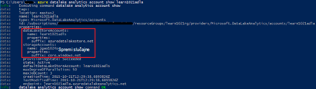

<properties 
   pageTitle="Upravljanje Azure podataka Lake analize korištenja sučelja naredbenog retka za Azure | Azure" 
   description="Informirajte se o upravljanju analize podataka Lake račune, izvora podataka, zadatke i korisnici koji koriste EŽA Azure" 
   services="data-lake-analytics" 
   documentationCenter="" 
   authors="edmacauley" 
   manager="jhubbard" 
   editor="cgronlun"/>
 
<tags
   ms.service="data-lake-analytics"
   ms.devlang="na"
   ms.topic="article"
   ms.tgt_pltfrm="na"
   ms.workload="big-data" 
   ms.date="05/16/2016"
   ms.author="edmaca"/>

# Upravljanje Azure podataka Lake analize pomoću Azure sučelje naredbenog retka (EŽA)

[AZURE.INCLUDE [manage-selector](../../includes/data-lake-analytics-selector-manage.md)]

Informirajte se o upravljanju Lake analize podataka za Azure račune, izvora podataka, korisnici i zadatke pomoću na Azure. Da biste vidjeli upravljanje teme pomoću drugih alata, kliknite odaberite karticu iznad.

**Preduvjeti**

Prije početka ovog praktičnog vodiča, morate imati sljedeće:

- **Mogući Azure pretplate**. Pogledajte [Početak Azure besplatnu probnu verziju](https://azure.microsoft.com/pricing/free-trial/).
- **Azure EŽA**. U odjeljku [instalirati i konfigurirati Azure EŽA](../xplat-cli-install.md).
    - Preuzmite i instalirajte **predizdanje** [Alati za Azure EŽA](https://github.com/MicrosoftBigData/AzureDataLake/releases) kako bi obavili ovaj pokazni videozapis.
- **Provjera autentičnosti**, pomoću naredbe za sljedeće:

        azure login
    Dodatne informacije o provjera autentičnosti pomoću računa tvrtke ili obrazovne ustanove, potražite u članku [Povezivanje Azure pretplatu s EŽA Azure](../xplat-cli-connect.md).
- **Da biste prešli na način upravljanja resursima Azure**pomoću sljedeće naredbe:

        azure config mode arm

**Da biste popis naredbi spremišta Lake podataka i analize podataka Lake:**

    azure datalake store
    azure datalake analytics

<!-- ################################ -->
<!-- ################################ -->
## Upravljanje računima

Prije pokretanja svih poslova analize podataka Lake, morate imati račun analize podataka Lake. Za razliku od servisom Azure HDInsight ne platiti račun analize kada je pokrenut posao.  Samo plaćate put kada je pokrenut posao.  Dodatne informacije potražite u članku [Pregled Analytics za Azure podataka Lake](data-lake-analytics-overview.md).  

###Stvaranje računa

    azure datalake analytics account create "<Data Lake Analytics Account Name>" "<Azure Location>" "<Resource Group Name>" "<Default Data Lake Account Name>"

###Ažuriranje računa

Sljedeća naredba ažuriranja svojstva postojeći račun analize podataka Lake
    
    azure datalake analytics account set "<Data Lake Analytics Account Name>"

###Računi popisu

Računi analize Lake popisa podataka 

    azure datalake analytics account list

Popis podataka Lake analize računi unutar određene grupe resursa

    azure datalake analytics account list -g "<Azure Resource Group Name>"

Dohvaćanje detalja određeni analize podataka Lake račun

    azure datalake analytics account show -g "<Azure Resource Group Name>" -n "<Data Lake Analytics Account Name>"

###Brisanje računa analize podataka Lake

    azure datalake analytics account delete "<Data Lake Analytics Account Name>"

<!-- ################################ -->
<!-- ################################ -->
## Upravljanje izvorima podataka na račun

Analitički Lake podataka trenutno podržava sljedećih izvora podataka:

- [Spremište Lake podataka za Azure](../data-lake-store/data-lake-store-overview.md)
- [Azure prostora za pohranu](../storage/storage-introduction.md)

Kada stvorite račun analize, mora se odrediti račun Lake pohrana podataka za Azure bude zadani račun za pohranu. Zadani račun za pohranu ADL služi za pohranu posao metapodataka i posao zapisnika nadzora. Kada stvorite račun analize, možete dodati dodatne račune za pohranu podataka Lake i/ili račun za Azure prostora za pohranu. 

### Pronalaženje zadani ADL račun za pohranu

    azure datalake analytics account show "<Data Lake Analytics Account Name>"

Vrijednost se nalazi u odjeljku svojstva: datalakeStoreAccount:name.

### Dodavanje dodatnih računa spremišta blobova platforme Azure

    azure datalake analytics account datasource add -n "<Data Lake Analytics Account Name>" -b "<Azure Blob Storage Account Short Name>" -k "<Azure Storage Account Key>"

>[AZURE.NOTE] Podržani su samo Blob prostora za pohranu kratki nazive.  Nemojte koristiti FQDN, primjerice "myblob.blob.core.windows.net".

### Dodavanje dodatnih računa spremišta Lake podataka

    azure datalake analytics account datasource add -n "<Data Lake Analytics Account Name>" -l "<Data Lake Store Account Name>" [-d]

[-d] je neobavezan parametar koji označava je li Lake podataka koji se dodaje zadani račun Lake podataka. 

### Ažuriranje postojećeg izvora podataka

Da biste postavili postojećeg računa za spremište podataka Lake da bude zadan:

    azure datalake analytics account datasource set -n "<Data Lake Analytics Account Name>" -l "<Azure Data Lake Store Account Name>" -d
      
Da biste ažurirali postojeće Blob prostora za pohranu računa ključa:

    azure datalake analytics account datasource set -n "<Data Lake Analytics Account Name>" -b "<Blob Storage Account Name>" -k "<New Blob Storage Account Key>"

### Popis izvora podataka:

    azure datalake analytics account show "<Data Lake Analytics Account Name>"
    

### Brisanje izvora podataka:

Da biste izbrisali spremišta podataka Lake računa:

    azure datalake analytics account datasource delete "<Data Lake Analytics Account Name>" "<Azure Data Lake Store Account Name>"

Da biste izbrisali račun za spremište blobova platforme:

    azure datalake analytics account datasource delete "<Data Lake Analytics Account Name>" "<Blob Storage Account Name>"

## Upravljanje zadacima

Morate imati račun analize podataka Lake da biste mogli stvarati posao.  Dodatne informacije potražite u članku [Upravljanje analize podataka Lake računi](#manage-accounts).

### Popis zadataka

    azure datalake analytics job list -n "<Data Lake Analytics Account Name>"

### Dohvaćanje detalja posla

    azure datalake analytics job show -n "<Data Lake Analytics Account Name>" -j "<Job ID>"
    
### Slanje poslova

> [AZURE.NOTE] Prioritet zadani posla 1000, a zadani stupanj parallelism za posao 1.

    azure datalake analytics job create  "<Data Lake Analytics Account Name>" "<Job Name>" "<Script>"

### Otkazati poslove

Koristite naredbu popis da biste pronašli id zadatka, a zatim koristite Odustani da biste Odustani posao.

    azure datalake analytics job list -n "<Data Lake Analytics Account Name>"
    azure datalake analytics job cancel "<Data Lake Analytics Account Name>" "<Job ID>"

## Upravljanje kataloga

Katalog U SQL koristi se za strukturiranje podataka i kod tako da ih mogu zajednički koristiti tako da U SQL skripte. Katalog omogućuje najveće performanse moguće s podacima u Lake Azure podataka. Dodatne informacije potražite u članku [U SQL za korištenje kataloga](data-lake-analytics-use-u-sql-catalog.md).
 
###Popis stavki kataloga

    #List databases
    azure datalake analytics catalog list -n "<Data Lake Analytics Account Name>" -t database

    #List tables
    azure datalake analytics catalog list -n "<Data Lake Analytics Account Name>" -t table
    
Vrsta uvrštavanje baze podataka, sheme, skupa, vanjski izvor podataka, tablicu, funkcija tablice s vrijednostima i Statistika tablice.

###Stvaranje tajna kataloga

    azure datalake analytics catalog secret create -n "<Data Lake Analytics Account Name>" <databaseName> <hostUri> <secretName>

### Izmjena tajna kataloga

    azure datalake analytics catalog secret set -n "<Data Lake Analytics Account Name>" <databaseName> <hostUri> <secretName>

###Brisanje tajna kataloga

    azure datalake analytics catalog secrete delete -n "<Data Lake Analytics Account Name>" <databaseName> <hostUri> <secretName>

<!-- ################################ -->
<!-- ################################ -->
## Korištenje OKVIRA grupa

Aplikacija obično se sastoje od više komponente, primjerice web-aplikacijama, baze podataka, poslužitelj baze podataka, za pohranu i 3 davatelja usluga. Azure upravitelj resursa (ARM) omogućuje rad s resursima u aplikaciji grupe se nazivaju i grupu resursa Azure. Možete uvesti, ažuriranje, praćenje ili izbrisati sve resurse aplikacije u jednom, usklađenih postupak. Pomoću predloška za implementaciju i taj predložak možete iskoristiti različitim okruženjima kao što su testiranje pripremna i proizvodnje. Pregledom kumulativne troškove za cijelu grupu možete pojašnjavaju naplate za tvrtku ili ustanovu. Dodatne informacije potražite u članku [Pregled upravljanja resursima Azure](../azure-resource-manager/resource-group-overview.md). 

Servis za analize podataka Lake mogu sadržavati sljedeće komponente:

- Račun za Azure podataka Lake analize
- Potrebne zadani račun za Azure podataka Lake prostora za pohranu
- Dodatni Azure podataka Lake prostora za pohranu računa
- Dodatne račune za pohranu za Azure

Možete stvoriti te komponente u jednu grupu OKVIRA radi lakšeg upravljanja.

Analize podataka Lake računa i račune zavisne prostora za pohranu mora biti smješten u isti Azure podatkovnog centra.
Grupa ARM no može se nalaziti u centru za različite podatke.  

##Vidi također 

- [Pregled analize podataka Lake za Microsoft Azure](data-lake-analytics-overview.md)
- [Početak rada s podacima Lake analize pomoću portala za Azure](data-lake-analytics-get-started-portal.md)
- [Upravljanje analizom Lake podataka za Azure pomoću portala za Azure](data-lake-analytics-manage-use-portal.md)
- [Praćenje i rješavanje problema s poslove Lake analize podataka za Azure pomoću portala za Azure](data-lake-analytics-monitor-and-troubleshoot-jobs-tutorial.md)

