<properties 
   pageTitle="Upravljanje analizom Lake podataka za Azure pomoću portala za Azure | Azure" 
   description="Informirajte se o upravljanju analize podataka Lake acounts, izvora podataka, korisnici i zadacima." 
   services="data-lake-analytics" 
   documentationCenter="" 
   authors="edmacauley" 
   manager="jhubbard" 
   editor="cgronlun"/>
 
<tags
   ms.service="data-lake-analytics"
   ms.devlang="na"
   ms.topic="article"
   ms.tgt_pltfrm="na"
   ms.workload="big-data" 
   ms.date="10/06/2016"
   ms.author="edmaca"/>

# Upravljanje analizom Lake podataka za Azure pomoću portala za Azure

[AZURE.INCLUDE [manage-selector](../../includes/data-lake-analytics-selector-manage.md)]

Informirajte se o upravljanju Lake analize podataka za Azure račune, izvora podataka na račun, korisnici i zadatke pomoću portala za Azure. Da biste vidjeli upravljanje teme pomoću drugih alata, kliknite birač tabulatora pri vrhu stranice.

**Preduvjeti**

Prije početka ovog praktičnog vodiča, morate imati sljedeće stavke:

- **Mogući Azure pretplate**. Pogledajte [Početak Azure besplatnu probnu verziju](https://azure.microsoft.com/pricing/free-trial/).

<!-- ################################ -->
<!-- ################################ -->
## Upravljanje računima

Prije pokretanja svih poslova analize podataka Lake, morate imati račun analize podataka Lake. Za razliku od servisom Azure HDInsight samo plaćate za račun analize podataka Lake kada pokrenete posao.  Samo plaćate put kada je pokrenut posao.  Dodatne informacije potražite u članku [Pregled Analytics za Azure podataka Lake](data-lake-analytics-overview.md).  

**Da biste stvorili analize podataka Lake račun**

1. Prijavite se [portal za Azure](https://portal.azure.com).
2. Kliknite **Novo**, kliknite **Obavještavanje + analize**, a zatim **Analize podataka Lake**.
3. Upišite ili odaberite sljedeće vrijednosti:

    

    - **Naziv**: naziv računa analize podataka Lake.
    - **Pretplate**: Odaberite Azure pretplatu koristi za račun analize.
    - **Grupa resursa**. Odaberite postojeću grupu resursa Azure ili stvorite novi. Azure Voditelj resursa omogućuje rad s resursima u aplikaciji kao grupu. Dodatne informacije potražite u članku [Pregled upravljanja resursima Azure](resource-group-overview.md). 
    - **Mjesto**. Odaberite centar za Azure podataka za račun analize podataka Lake. 
    - **Pohrana podataka Lake**: račun za svakog analize podataka Lake sadrži zavisne računa spremišta Lake podataka. Račun analize podataka Lake i ovisne računa spremišta podataka Lake moraju nalaziti u istoj Azure podatkovnog centra. Pratite upute za stvaranje novog računa spremišta Lake podataka ili odaberite postojeći.

8. Kliknite **Stvori**. Koje je potrebno portala početni zaslon. Novu pločicu dodaje se na StartBoard s natpisom prikazuje "Implementacija Azure podataka Lake analize". Potrebno stvoriti račun analize podataka Lake trenutak. Prilikom stvaranja računa portalu otvorit će se račun na novu plohu.

Nakon stvaranja analize podataka Lake računa možete dodati dodatne spremišta podataka Lake računi i računi servisa Azure prostora za pohranu. Upute potražite u članku [Upravljanje analize podataka lake računa izvora podataka](data-lake-analytics-manage-use-portal.md#manage-account-data-sources).

**Pristup/Otvori analize podataka Lake računa**

1. Prijavite se [portal za Azure](https://portal.azure.com/).
2. Na lijevom izborniku kliknite **Analize podataka Lake** .  Ako ga ne vidite, kliknite **više usluga**, a zatim **Analize podataka Lake** u odjeljku **Obavještavanje + analize**.
3. Kliknite analize podataka Lake račun koji želite im pristupiti. Račun otvara se u novi plohu.

**Da biste izbrisali analize podataka Lake računa**

1. Otvorite analize podataka Lake račun koji želite izbrisati. Upute potražite u članku [račune za pristup podacima Lake analize](#access-adla-account).
2. Kliknite **Izbriši** na izborniku gumba pri vrhu stranice na plohu.
3. Unesite naziv računa, a zatim kliknite **Izbriši**.

Brisanje podataka Lake analize računa izbrišite zavisne računa spremišta Lake podataka. Upute brisanja računa za pohranu Lake podataka potražite u članku [računa spremišta Lake za brisanje podataka](data-lake-store-get-started-portal.md#delete-azure-data-lake-store-account).

<!-- ################################ -->
<!-- ################################ -->
## Upravljanje izvorima podataka na račun

Analitički Lake podataka trenutno podržava sljedećih izvora podataka:

- [Spremište Lake podataka za Azure](../data-lake-store/data-lake-store-overview.md)
- [Azure prostora za pohranu](../storage/storage-introduction.md)

Kada stvorite analize podataka Lake račun, morate označiti računa spremišta Lake podataka za Azure bude zadani račun za pohranu. Zadani račun za spremište Lake podataka koristi se za pohranu posao metapodataka i posao zapisnika nadzora. Nakon stvaranja analize podataka Lake računa možete dodati dodatne račune spremišta Lake podataka i/ili račun za Azure prostora za pohranu. 

**Da biste pronašli zadani račun za pohranu podataka Lake**

- Otvorite analize podataka Lake račun koji želite upravljati. Upute potražite u članku [račune za pristup podacima Lake analize](#access-adla-account). Zadano spremište Lake podataka prikazuju se u **ključna**:

    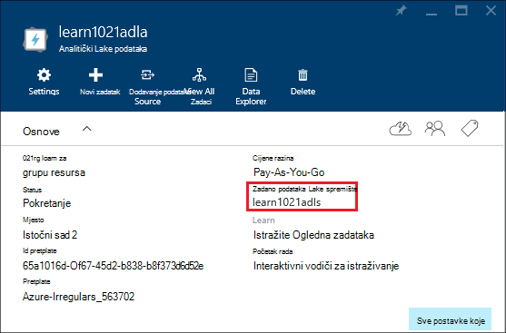

**Da biste dodali dodatne izvore podataka**

1. Otvorite analize podataka Lake račun koji želite upravljati. Upute potražite u članku [račune za pristup podacima Lake analize](#access-adla-account).
2. Kliknite **Postavke** , a zatim kliknite **Izvori podataka**. Prikazat će spremišta podataka Lake zadani račun nema na popisu. 
3. Kliknite **Dodavanje izvora podataka**.

    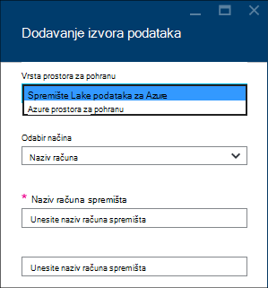

    Da biste dodali račun za Azure podataka Lake trgovine, potreban vam je na račun ime i pristup računu da biste mogli je upit.
    Da biste dodali Azure blobova, potreban je račun za pohranu i ključ računa koju je moguće pronaći tako da odete na račun za pohranu na portalu.

**Da biste istražili izvora podataka**  

1. Otvorite analize račun koji želite upravljati. Upute potražite u članku [račune za pristup podacima Lake analize](#access-adla-account).
2. Kliknite **Postavke** , a zatim kliknite **Explorer podataka**. 
 
    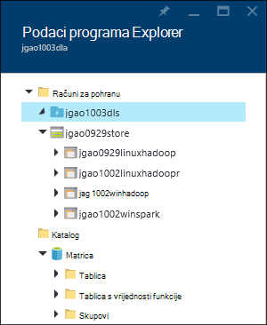
    
3. Kliknite spremište podataka Lake račun da biste otvorili račun.

    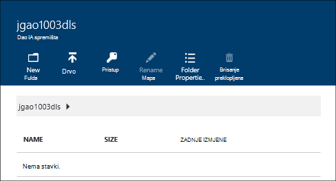
    
    Za svaki račun spremišta Lake podataka, možete ga
    
    - **Nova mapa**: Dodaj novu mapu.
    - **Prijenos**: prijenos datoteka na račun za pohranu iz vaše radne stanice.
    - **Pristup**: Konfiguriranje programa access dozvole.
    - **Preimenovanje mape**: Promjena naziva mape.
    - **Svojstva mape**: Prikaz svojstava datoteke ili mape, kao što su WASB put, put WEBHDFS zadnje izmjene vremena i tako dalje.
    - **Izbriši mapu**: Brisanje mape.

**Da biste prenijeli datoteke spremišta podataka Lake račun**

1. S portala sustava na lijevom izborniku kliknite **Pregledaj** , a zatim **Spremišta Lake podataka**.
2. Kliknite spremište podataka Lake račun koji želite prenijeti podatke. Zadani račun za pohranu Lake podataka potražite [u nastavku](#default-adl-account).
3. Na gornjoj izborniku kliknite **Explorer podataka** .
4. Kliknite **Novi direktorij** da biste stvorili novu mapu ili naziv mape da biste promijenili mapu.
6. Kliknite **Prenesi** na izborniku gornji da biste prenijeli datoteku.

**Da biste prenijeli datoteke na račun za spremište blobova platforme Azure**

Potražite u članku [prijenos podataka za Hadoop poslove u HDInsight](../hdinsight/hdinsight-upload-data.md).  Informacije odnose se na analize podataka Lake.

## Upravljanje korisnicima

Analize podataka Lake koristi kontrola pristupa na temelju uloga sa servisu Azure Active Directory. Kada stvorite analize podataka Lake račun, ulozi "Pretplate administratori" dodaje se na račun. Možete dodati dodatni korisnici i sigurnosne grupe s sljedeće uloge:

|Uloga|Opis|
|----|-----------|
|Vlasnik|Omogućuju upravljanje sve, uključujući pristup resursima.|
|Suradnik|Pristup portalu; Slanje i praćenje zadataka. Da biste mogli slati zadacima, suradnik mora čitanje ili pisanje dozvole za spremište Lake podataka računa.|
|DataLakeAnalyticsDeveloper | Slanje, praćenje i poništavanje zadatke.  Ti korisnici samo možete otkazati vlastitih zadataka. Ih nije moguće upravljati vlastiti račun, na primjer, dodajte korisnike, promjena dozvola ili brisanje računa. Da biste mogli pokrenuti zadacima, koje su im potrebne čitanja i pisanja računa spremišta Lake podataka     | 
|Čitač|Omogućuje prikaz sve, ali ne unesite željene promjene.|  
|DevTest Labs korisnika|Možete pogledati sve te je povežite početka, ponovno pokretanje i zatvaranje virtualnog računala.|  
|Korisnički pristup administratora|Omogućuje upravljanje korisničkim pristupom Azure resursima.|  

Informacije o stvaranju Azure Active Directory korisnici i sigurnosne grupe potražite u članku [što je Azure Active Directory](../active-directory/active-directory-whatis.md).

**Da biste dodali korisnike ili sigurnosne grupe s računom analize podataka Lake**

1. Otvorite analize račun koji želite upravljati. Upute potražite u članku [račune za pristup podacima Lake analize](#access-adla-account).
2. Kliknite **Postavke**, a zatim kliknite **korisnike**. Možete kliknuti i **pristup** na naslovnoj traci **Essentials** kao što je prikazano u sljedećim snimku zaslona:

    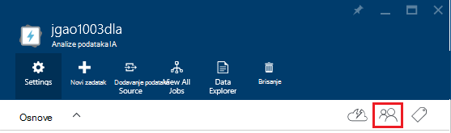
3. Plohu **korisnika** , kliknite **Dodaj**.
4. Odaberite ulogu i dodavanje korisnika, a zatim **u redu**.

**Napomena: Ako ovog korisnika ili sigurnosnu grupu mora poslati zadacima, moraju dobiti dozvolu za spremište podataka Lake kao i. Dodatne informacije potražite u članku [sigurno podatke pohranjene u spremištu Lake podataka](../data-lake-store/data-lake-store-secure-data.md).**

<!-- ################################ -->
<!-- ################################ -->
## Upravljanje zadacima

Morate imati račun analize podataka Lake prije pokretanja sve zadatke U SQL.  Dodatne informacije potražite u članku [Upravljanje analize podataka Lake računi](#manage-data-lake-analytics-accounts).

**Da biste stvorili zadatak**

1. Otvorite analize račun koji želite upravljati. Upute potražite u članku [račune za pristup podacima Lake analize](#access-adla-account).
2. Kliknite **novi zadatak**.

    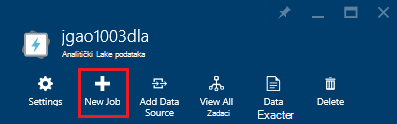

    Prikazat će novi plohu slično:

    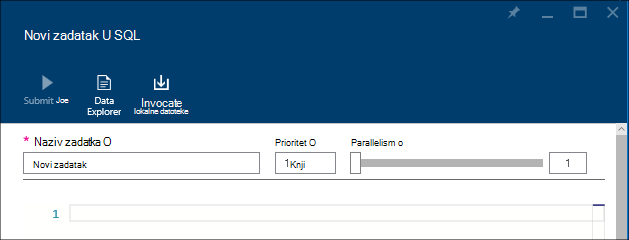

    Za svaki zadatak možete konfigurirati

  	|Ime|Opis|
  	|----|-----------|
  	|Naziv zadatka|Unesite naziv zadatka.|
  	|Prioritet|Manji broj ima viši prioritet. Dva su oboje u redu čekanja, jedan s manji prioritet pokrenuti najprije|
  	|Parallelism |Maksimalan broj računalnim postupaka koji se može dogoditi u isto vrijeme. Povećanje taj broj možete poboljšati performanse, ali možete povećati trošak.|
  	|Skripta|Unesite U SQL skripta za posao.|

    Korištenje istog sučelja, možete i istraživanje veza izvora podataka i dodavati datoteke izvora povezanih podataka. 
3. Ako želite poslati posla, kliknite **Pošalji posao** .

**Da biste poslali posao**

Potražite u članku [Stvaranje analize podataka Lake zadatke](#create-job).

**Praćenje zadataka**

1. Otvorite analize račun koji želite upravljati. Upute potražite u članku [račune za pristup podacima Lake analize](#access-adla-account). Ploča za upravljanje prikazuje informacije o zadatku osnovni:

    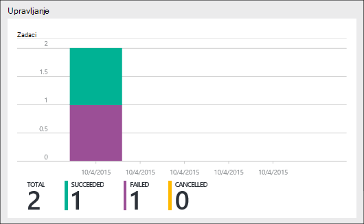

3. Kliknite **Upravljanje** kao što je prikazano u prethodno snimku zaslona.

    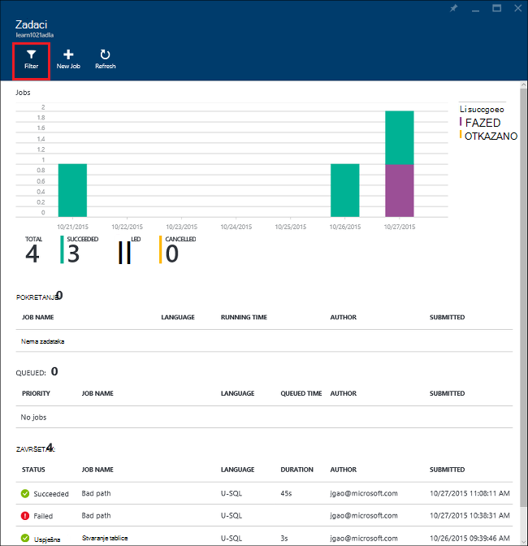

4. Kliknite zadatak s popisa. Ili kliknite **Filtar** da biste lakše pronašli zadatke:

    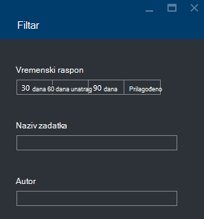

    Možete filtrirati i zadacima **Vremenski raspon**, **Naziv zadatka**i **Autor**.
5. Ako želite ponovno posla, kliknite **ponovno pošaljite** .

**Da biste ponovno posao**

U odjeljku [analize Lake podataka za praćenje zadataka](#monitor-jobs).

##Nadzor korištenja računa

**Korištenje računa za praćenje**

1. Otvorite analize račun koji želite upravljati. Upute potražite u članku [račune za pristup podacima Lake analize](#access-adla-account). Ploča za korištenje prikazuje korištenje:

    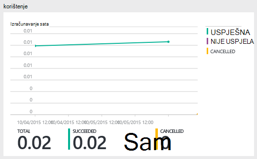

2. Dvokliknite okna da biste vidjeli dodatne detalje.

##Katalog U SQL prikaz

[U SQL kataloga](data-lake-analytics-use-u-sql-catalog.md) koristi se za strukturiranje podataka i kod tako da ih mogu zajednički koristiti tako da U SQL skripte. Katalog omogućuje najviših performanse moguće s podacima u Lake Azure podataka. Na portalu Azure se moći pregledavati U SQL kataloga.

**Da biste pregledali kataloga U SQL**

1. Otvorite analize račun koji želite upravljati. Upute potražite u članku [račune za pristup podacima Lake analize](#access-adla-account).
2. Na gornjoj izborniku kliknite **Explorer podataka** .
3. Proširite **kataloga**, proširite **matrice**, proširite **tablice ili **tablice vrijednosti funkcije**, ili **sklopova **. Sljedeće snimka zaslona prikazuje jednu funkciju tablice s vrijednostima.

    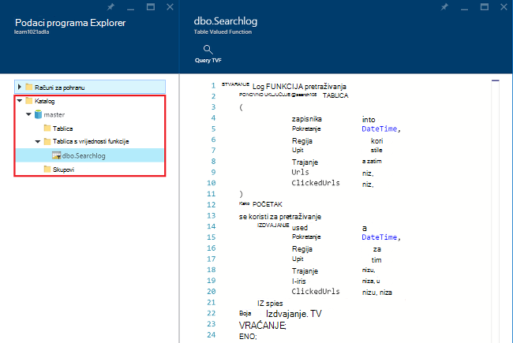

<!-- ################################ -->
<!-- ################################ -->
## Korištenje upravitelja resursa Azure grupa

Aplikacija obično se sastoje od više komponenti, primjerice web-aplikacijama, baze podataka, poslužitelj baze podataka, za pohranu i servisa drugih proizvođača. Azure Voditelj resursa omogućuje rad s resursima u aplikaciji grupe se nazivaju i grupu resursa Azure. Možete uvesti, ažuriranje, praćenje i brisanje svih resursa za aplikacije u jednom, usklađenih postupak. Pomoću predloška za implementaciju i taj predložak možete iskoristiti različitim okruženjima kao što su testiranja, pripremna i proizvodnje. Pregledom kumulativne troškove za cijelu grupu možete pojašnjavaju naplate za tvrtku ili ustanovu. Dodatne informacije potražite u članku [Pregled upravljanja resursima Azure](../azure-resource-manager/resource-group-overview.md). 

Servis za analize podataka Lake mogu sadržavati sljedeće komponente:

- Račun za Azure podataka Lake analize
- Potrebnu zadanu računa spremišta Lake podataka za Azure
- Računi dodatni Azure podataka Lake trgovine
- Dodatne račune za pohranu za Azure

Možete stvoriti te komponente u odjeljku jedne grupe Upravljanje resursima radi lakšeg upravljanja.

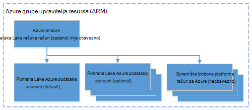

Analize podataka Lake računa i račune zavisne prostora za pohranu mora biti smješten u isti Azure podatkovnog centra.
Grupa Upravljanje resursima no može se nalaziti u centru za različite podatke.  

##Vidi također 

- [Pregled analize podataka Lake za Microsoft Azure](data-lake-analytics-overview.md)
- [Početak rada s podacima Lake analize pomoću portala za Azure](data-lake-analytics-get-started-portal.md)
- [Upravljanje Azure podataka Lake analize pomoću komponente PowerShell Azure](data-lake-analytics-manage-use-powershell.md)
- [Praćenje i rješavanje problema s poslove Lake analize podataka za Azure pomoću portala za Azure](data-lake-analytics-monitor-and-troubleshoot-jobs-tutorial.md)

