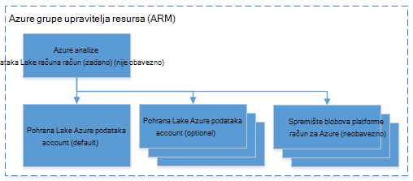

<properties 
   pageTitle="Upravljanje Azure podataka Lake analize pomoću komponente PowerShell Azure | Azure" 
   description="Saznajte kako upravljati zadacima analize podataka Lake, izvora podataka, a zatim korisnika. " 
   services="data-lake-analytics" 
   documentationCenter="" 
   authors="edmacauley" 
   manager="jhubbard" 
   editor="cgronlun"/>
 
<tags
   ms.service="data-lake-analytics"
   ms.devlang="na"
   ms.topic="article"
   ms.tgt_pltfrm="na"
   ms.workload="big-data" 
   ms.date="05/16/2016"
   ms.author="edmaca"/>

# Upravljanje Azure podataka Lake analize pomoću komponente PowerShell Azure

[AZURE.INCLUDE [manage-selector](../../includes/data-lake-analytics-selector-manage.md)]

Informirajte se o upravljanju Lake analize podataka za Azure račune, izvora podataka, korisnici i zadatke pomoću komponente PowerShell Azure. Da biste vidjeli upravljanje teme pomoću drugih alata, kliknite odaberite karticu iznad.

**Preduvjeti**

Prije početka ovog praktičnog vodiča, morate imati sljedeće:

- **Mogući Azure pretplate**. Pogledajte [Početak Azure besplatnu probnu verziju](https://azure.microsoft.com/pricing/free-trial/).

<!-- ################################ -->
<!-- ################################ -->

##Instaliranje modula Azure PowerShell 1.0 ili noviji

U odjeljku pripremni [Pomoću ljuske Azure s Azure Voditelj resursa](powershell-azure-resource-manager.md#prerequisites).
    
## Upravljanje računima

Prije pokretanja svih poslova analize podataka Lake, morate imati račun analize podataka Lake. Za razliku od servisom Azure HDInsight ne platiti račun analize kada je pokrenut posao.  Samo plaćate put kada je pokrenut posao.  Dodatne informacije potražite u članku [Pregled Analytics za Azure podataka Lake](data-lake-analytics-overview.md).  

###Stvaranje računa

    $resourceGroupName = "<ResourceGroupName>"
    $dataLakeStoreName = "<DataLakeAccountName>"
    $dataLakeAnalyticsAccountName = "<DataLakeAnalyticsAccountName>"
    $location = "<Microsoft Data Center>"
    
    Write-Host "Create a resource group ..." -ForegroundColor Green
    New-AzureRmResourceGroup `
        -Name  $resourceGroupName `
        -Location $location
    
    Write-Host "Create a Data Lake account ..."  -ForegroundColor Green
    New-AzureRmDataLakeStoreAccount `
        -ResourceGroupName $resourceGroupName `
        -Name $dataLakeStoreName `
        -Location $location 
    
    Write-Host "Create a Data Lake Analytics account ..."  -ForegroundColor Green
    New-AzureRmDataLakeAnalyticsAccount `
        -Name $dataLakeAnalyticsAccountName `
        -ResourceGroupName $resourceGroupName `
        -Location $location `
        -DefaultDataLake $dataLakeStoreName
    
    Write-Host "The newly created Data Lake Analytics account ..."  -ForegroundColor Green
    Get-AzureRmDataLakeAnalyticsAccount `
        -ResourceGroupName $resourceGroupName `
        -Name $dataLakeAnalyticsAccountName  

Možete koristiti i predložak Azure grupu resursa. Predložak za stvaranje analize podataka Lake računa i o njima ovisne računa spremišta podataka Lake se [dodatak A](#appendix-a). Spremanje predloška u datoteku s predloškom .json, a zatim koristite sljedeću skriptu komponente PowerShell da biste pozvali je:

    $AzureSubscriptionID = "<Your Azure Subscription ID>"
    
    $ResourceGroupName = "<New Azure Resource Group Name>"
    $Location = "EAST US 2"
    $DefaultDataLakeStoreAccountName = "<New Data Lake Store Account Name>"
    $DataLakeAnalyticsAccountName = "<New Data Lake Analytics Account Name>"
    
    $DeploymentName = "MyDataLakeAnalyticsDeployment"
    $ARMTemplateFile = "E:\Tutorials\ADL\ARMTemplate\azuredeploy.json"  # update the Json template path 
    
    Login-AzureRmAccount
    
    Select-AzureRmSubscription -SubscriptionId $AzureSubscriptionID
    
    # Create the resource group
    New-AzureRmResourceGroup -Name $ResourceGroupName -Location $Location
    
    # Create the Data Lake Analytics account with the default Data Lake Store account.
    $parameters = @{"adlAnalyticsName"=$DataLakeAnalyticsAccountName; "adlStoreName"=$DefaultDataLakeStoreAccountName}
    New-AzureRmResourceGroupDeployment -Name $DeploymentName -ResourceGroupName $ResourceGroupName -TemplateFile $ARMTemplateFile -TemplateParameterObject $parameters 

 
###Popis računa

Popis podataka Lake analize računi unutar trenutne pretplate

    Get-AzureRmDataLakeAnalyticsAccount
    
Izlaz:

    Id         : /subscriptions/xxxxxxxxxxxxxxxxxxxxxxxxxxxxxxxxxxxx/resourceGroups/learn1021rg/providers/Microsoft.DataLakeAnalytics/accounts/learn1021adla
    Location   : eastus2
    Name       : learn1021adla
    Properties : Microsoft.Azure.Management.DataLake.Analytics.Models.DataLakeAnalyticsAccountProperties
    Tags       : {}
    Type       : Microsoft.DataLakeAnalytics/accounts

Popis podataka Lake analize računi unutar određene grupe resursa

    Get-AzureRmDataLakeAnalyticsAccount -ResourceGroupName $resourceGroupName

Dohvaćanje detalja određeni analize podataka Lake račun

    Get-AzureRmDataLakeAnalyticsAccount -Name $adlAnalyticsAccountName

Testiranje postojanje određeni analize podataka Lake račun

    Test-AzureRmDataLakeAnalyticsAccount -Name $adlAnalyticsAccountName

Cmdlet će vratiti **vrijednost True** ili **False**.

###Brisanje računa analize podataka Lake

    $resourceGroupName = "<ResourceGroupName>"
    $dataLakeAnalyticsAccountName = "<DataLakeAnalyticsAccountName>"
    
    Remove-AzureRmDataLakeAnalyticsAccount -Name $dataLakeAnalyticsAccountName 

Brisanje podataka Lake analize računa će izbrisati zavisne pohrana podataka Lake račun. U sljedećem primjeru briše analize podataka Lake računa i zadanog računa za spremište Lake podataka

    $resourceGroupName = "<ResourceGroupName>"
    $dataLakeAnalyticsAccountName = "<DataLakeAnalyticsAccountName>"
    $dataLakeStoreName = (Get-AzureRmDataLakeAnalyticsAccount -ResourceGroupName $resourceGroupName -Name $dataLakeAnalyticAccountName).Properties.DefaultDataLakeAccount

    Remove-AzureRmDataLakeAnalyticsAccount -ResourceGroupName $resourceGroupName -Name $dataLakeAnalyticAccountName 
    Remove-AzureRmDataLakeStoreAccount -ResourceGroupName $resourceGroupName -Name $dataLakeStoreName

<!-- ################################ -->
<!-- ################################ -->
## Upravljanje izvorima podataka na račun

Analitički Lake podataka trenutno podržava sljedećih izvora podataka:

- [Spremište Lake podataka za Azure](../data-lake-store/data-lake-store-overview.md)
- [Azure prostora za pohranu](storage-introduction.md)

Kada stvorite račun analize, mora se odrediti račun Lake pohrana podataka za Azure bude zadani račun za pohranu. Zadani račun za spremište Lake podataka koristi se za pohranu posao metapodataka i posao zapisnika nadzora. Kada stvorite račun analize, možete dodati dodatne račune za pohranu podataka Lake i/ili račun za Azure prostora za pohranu. 

### Pronalaženje zadanog računa za spremište Lake podataka

    $resourceGroupName = "<ResourceGroupName>"
    $dataLakeAnalyticsAccountName = "<DataLakeAnalyticsAccountName>"
    $dataLakeStoreName = (Get-AzureRmDataLakeAnalyticsAccount -ResourceGroupName $resourceGroupName -Name $dataLakeAnalyticAccountName).Properties.DefaultDataLakeAccount

### Dodavanje dodatnih računa spremišta blobova platforme Azure

    $resourceGroupName = "<ResourceGroupName>"
    $dataLakeAnalyticsAccountName = "<DataLakeAnalyticsAccountName>"
    $AzureStorageAccountName = "<AzureStorageAccountName>"
    $AzureStorageAccountKey = "<AzureStorageAccountKey>"
    
    Add-AzureRmDataLakeAnalyticsDataSource -ResourceGroupName $resourceGroupName -Account $dataLakeAnalyticAccountName -AzureBlob $AzureStorageAccountName -AccessKey $AzureStorageAccountKey

### Dodavanje dodatnih računa spremišta Lake podataka

    $resourceGroupName = "<ResourceGroupName>"
    $dataLakeAnalyticsAccountName = "<DataLakeAnalyticsAccountName>"
    $AzureDataLakeName = "<DataLakeStoreName>"
    
    Add-AzureRmDataLakeAnalyticsDataSource -ResourceGroupName $resourceGroupName -Account $dataLakeAnalyticAccountName -DataLake $AzureDataLakeName 

### Popis izvora podataka:

    $resourceGroupName = "<ResourceGroupName>"
    $dataLakeAnalyticsAccountName = "<DataLakeAnalyticsAccountName>"

    (Get-AzureRmDataLakeAnalyticsAccount -ResourceGroupName $resourceGroupName -Name $dataLakeAnalyticAccountName).Properties.DataLakeStoreAccounts
    (Get-AzureRmDataLakeAnalyticsAccount -ResourceGroupName $resourceGroupName -Name $dataLakeAnalyticAccountName).Properties.StorageAccounts
    

<!-- ################################ -->
<!-- ################################ -->
## Upravljanje zadacima

Morate imati račun analize podataka Lake da biste mogli stvarati posao.  Dodatne informacije potražite u članku [Upravljanje analize podataka Lake računi](#manage-data-lake-analytics-accounts).

### Popis zadataka

    $dataLakeAnalyticsAccountName = "<DataLakeAnalyticsAccountName>"
    
    Get-AzureRmDataLakeAnalyticsJob -Account $dataLakeAnalyticAccountName
    
    Get-AzureRmDataLakeAnalyticsJob -Account $dataLakeAnalyticAccountName -State Running, Queued
    #States: Accepted, Compiling, Ended, New, Paused, Queued, Running, Scheduling, Starting
    
    Get-AzureRmDataLakeAnalyticsJob -Account $dataLakeAnalyticAccountName -Result Cancelled
    #Results: Cancelled, Failed, None, Successed 
    
    Get-AzureRmDataLakeAnalyticsJob -Account $dataLakeAnalyticAccountName -Name <Job Name>
    Get-AzureRmDataLakeAnalyticsJob -Account $dataLakeAnalyticAccountName -Submitter <Job submitter>

    # List all jobs submitted on January 1 (local time)
    Get-AzureRmDataLakeAnalyticsJob -Account $dataLakeAnalyticAccountName `
        -SubmittedAfter "2015/01/01"
        -SubmittedBefore "2015/01/02"   

    # List all jobs that succeeded on January 1 after 2 pm (UTC time)
    Get-AzureRmDataLakeAnalyticsJob -Account $dataLakeAnalyticAccountName `
        -State Ended
        -Result Succeeded
        -SubmittedAfter "2015/01/01 2:00 PM -0"
        -SubmittedBefore "2015/01/02 -0"

    # List all jobs submitted in the past hour
    Get-AzureRmDataLakeAnalyticsJob -Account $dataLakeAnalyticAccountName `
        -SubmittedAfter (Get-Date).AddHours(-1)

### Dohvaćanje detalja posla

    $dataLakeAnalyticsAccountName = "<DataLakeAnalyticsAccountName>"
    Get-AzureRmDataLakeAnalyticsJob -Account $dataLakeAnalyticAccountName -JobID <Job ID>
    
### Slanje poslova

    $dataLakeAnalyticsAccountName = "<DataLakeAnalyticsAccountName>"

    #Pass script via path
    Submit-AzureRmDataLakeAnalyticsJob -Account $dataLakeAnalyticAccountName `
        -Name $jobName `
        -ScriptPath $scriptPath

    #Pass script contents
    Submit-AzureRmDataLakeAnalyticsJob -Account $dataLakeAnalyticAccountName `
        -Name $jobName `
        -Script $scriptContents

> [AZURE.NOTE] Prioritet zadani posla 1000, a zadani stupanj parallelism za posao 1.

### Otkazati poslove

    Stop-AzureRmDataLakeAnalyticsJob -Account $dataLakeAnalyticAccountName `
        -JobID $jobID

## Upravljanje stavki kataloga

Katalog U SQL koristi se za strukturiranje podataka i kod tako da ih mogu zajednički koristiti tako da U SQL skripte. Katalog omogućuje najveće performanse moguće s podacima u Lake Azure podataka. Dodatne informacije potražite u članku [U SQL za korištenje kataloga](data-lake-analytics-use-u-sql-catalog.md).

###Popis stavki kataloga

    #List databases
    Get-AzureRmDataLakeAnalyticsCatalogItem `
        -Account $adlAnalyticsAccountName `
        -ItemType Database
    
    
    
    #List tables
    Get-AzureRmDataLakeAnalyticsCatalogItem `
        -Account $adlAnalyticsAccountName `
        -ItemType Table `
        -Path "master.dbo"

###Dohvaćanje detalja stavke kataloga 

    #Get a database
    Get-AzureRmDataLakeAnalyticsCatalogItem `
        -Account $adlAnalyticsAccountName `
        -ItemType Database `
        -Path "master"
    
    #Get a table
    Get-AzureRmDataLakeAnalyticsCatalogItem `
        -Account $adlAnalyticsAccountName `
        -ItemType Table `
        -Path "master.dbo.mytable"

###Testiranje postojanje stavke kataloga

    Test-AzureRmDataLakeAnalyticsCatalogItem  `
        -Account $adlAnalyticsAccountName `
        -ItemType Database `
        -Path "master"

###Stvaranje tajna kataloga
    New-AzureRmDataLakeAnalyticsCatalogSecret  `
            -Account $adlAnalyticsAccountName `
            -DatabaseName "master" `
            -Secret (Get-Credential -UserName "username" -Message "Enter the password")

### Izmjena tajna kataloga
    Set-AzureRmDataLakeAnalyticsCatalogSecret  `
            -Account $adlAnalyticsAccountName `
            -DatabaseName "master" `
            -Secret (Get-Credential -UserName "username" -Message "Enter the password")

###Brisanje tajna kataloga
    Remove-AzureRmDataLakeAnalyticsCatalogSecret  `
            -Account $adlAnalyticsAccountName `
            -DatabaseName "master"

## Korištenje upravitelja resursa Azure grupa

Aplikacija obično se sastoje od više komponente, primjerice web-aplikacijama, baze podataka, poslužitelj baze podataka, za pohranu i 3 davatelja usluga. Azure upravitelj resursa (ARM) omogućuje rad s resursima u aplikaciji grupe se nazivaju i grupu resursa Azure. Možete uvesti, ažuriranje, praćenje ili izbrisati sve resurse aplikacije u jednom, usklađenih postupak. Pomoću predloška za implementaciju i taj predložak možete iskoristiti različitim okruženjima kao što su testiranje pripremna i proizvodnje. Pregledom kumulativne troškove za cijelu grupu možete pojašnjavaju naplate za tvrtku ili ustanovu. Dodatne informacije potražite u članku [Pregled upravljanja resursima Azure](../azure-resource-manager/resource-group-overview.md). 

Servis za analize podataka Lake mogu sadržavati sljedeće komponente:

- Račun za Azure podataka Lake analize
- Potrebne zadani račun za Azure podataka Lake prostora za pohranu
- Dodatni Azure podataka Lake prostora za pohranu računa
- Dodatne račune za pohranu za Azure

Možete stvoriti te komponente u jednu grupu OKVIRA radi lakšeg upravljanja.

Analize podataka Lake računa i račune zavisne prostora za pohranu mora biti smješten u isti Azure podatkovnog centra.
Grupa ARM no može se nalaziti u centru za različite podatke.  

##Vidi također 

- [Pregled analize podataka Lake za Microsoft Azure](data-lake-analytics-overview.md)
- [Početak rada s podacima Lake analize pomoću portala za Azure](data-lake-analytics-get-started-portal.md)
- [Upravljanje analizom Lake podataka za Azure pomoću portala za Azure](data-lake-analytics-manage-use-portal.md)
- [Praćenje i rješavanje problema s poslove Lake analize podataka za Azure pomoću portala za Azure](data-lake-analytics-monitor-and-troubleshoot-jobs-tutorial.md)

##Dodatak A - predložak podataka Lake analize ARM

Sljedeći ARM predložak se može koristiti za implementaciju analize podataka Lake računa i njegov zavisne računa spremišta Lake podataka.  Spremanje u obliku datoteke json, a zatim pomoću skriptu PowerShell poziva predložak. Dodatne informacije potražite u članku [uvođenja aplikacije pomoću predloška Azure Voditelj resursa](../resource-group-template-deploy.md#deploy-with-powershell) i [Voditelj resursa za Azure za izradu predložaka](../resource-group-authoring-templates.md).

    {
      "$schema": "http://schema.management.azure.com/schemas/2015-01-01/deploymentTemplate.json#",
      "contentVersion": "1.0.0.0",
      "parameters": {
        "adlAnalyticsName": {
          "type": "string",
          "metadata": {
            "description": "The name of the Data Lake Analytics account to create."
          }
        },
        "adlStoreName": {
          "type": "string",
          "metadata": {
            "description": "The name of the Data Lake Store account to create."
          }
        }
      },
      "resources": [
        {
          "name": "[parameters('adlStoreName')]",
          "type": "Microsoft.DataLakeStore/accounts",
          "location": "East US 2",
          "apiVersion": "2015-10-01-preview",
          "dependsOn": [ ],
          "tags": { }
        },
        {
          "name": "[parameters('adlAnalyticsName')]",
          "type": "Microsoft.DataLakeAnalytics/accounts",
          "location": "East US 2",
          "apiVersion": "2015-10-01-preview",
          "dependsOn": [ "[concat('Microsoft.DataLakeStore/accounts/',parameters('adlStoreName'))]" ],
          "tags": { },
          "properties": {
            "defaultDataLakeStoreAccount": "[parameters('adlStoreName')]",
            "dataLakeStoreAccounts": [
              { "name": "[parameters('adlStoreName')]" }
            ]
          }
        }
      ],
      "outputs": {
        "adlAnalyticsAccount": {
          "type": "object",
          "value": "[reference(resourceId('Microsoft.DataLakeAnalytics/accounts',parameters('adlAnalyticsName')))]"
        },
        "adlStoreAccount": {
          "type": "object",
          "value": "[reference(resourceId('Microsoft.DataLakeStore/accounts',parameters('adlStoreName')))]"
        }
      }
    }

