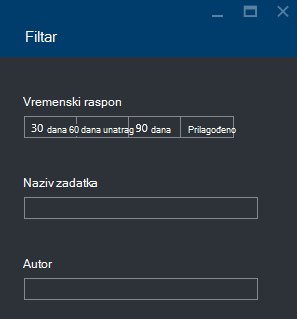

<properties 
   pageTitle="Otklanjanje poteškoća sa zadacima Lake analize podataka za Azure pomoću portala za Azure | Azure" 
   description="Saznajte kako pomoću portala za Azure otklanjanje poteškoća s analize podataka Lake zadatke. " 
   services="data-lake-analytics" 
   documentationCenter="" 
   authors="edmacauley" 
   manager="jhubbard" 
   editor="cgronlun"/>
 
<tags
   ms.service="data-lake-analytics"
   ms.devlang="na"
   ms.topic="article"
   ms.tgt_pltfrm="na"
   ms.workload="big-data" 
   ms.date="05/16/2016"
   ms.author="edmaca"/>

# Otklanjanje poteškoća sa zadacima Lake analize podataka za Azure pomoću portala za Azure

Saznajte kako pomoću portala za Azure otklanjanje poteškoća s analize podataka Lake zadatke.

U ovom ćete praktičnom vodiču će nedostaje problem izvor datoteke za postavljanje, a pomoću portala za Azure za otklanjanje poteškoća.

**Preduvjeti**

Prije početka ovog praktičnog vodiča, morate imati sljedeće:

- **Osnovno znanje analize podataka Lake posla postupak**. Potražite u članku [Početak rada s analize Lake podataka za Azure pomoću portala za Azure](data-lake-analytics-get-started-portal.md).
- **A podataka Lake analize računa**. Potražite u članku [Početak rada s analize Lake podataka za Azure pomoću portala za Azure](data-lake-analytics-get-started-portal.md#create-adl-analytics-account).
- **Kopirajte ogledne podatke na zadani račun spremišta Lake podataka**.  Potražite u članku [Priprema izvora podataka](data-lake-analytics-get-started-portal.md#prepare-source-data)

##Slanje podataka Lake analize posla

Sada ćete stvoriti U SQL zadatak pod nazivom neispravni izvora.  

**Da biste poslali posao**

1. Na portalu Azure kliknite **Microsoft Azure** u gornjem lijevom kutu.
2. Kliknite pločicu s nazivom vašeg analize podataka Lake računa.  To je prikvačena ovdje prilikom stvaranja računa.
Ako račun ne postoji prikvačene, potražite u članku [Otvaranje analize račun s portala](data-lake-analytics-manage-use-portal.md#access-adla-account).
3. Na gornjoj izborniku kliknite **Novi zadatak** .
4. Unesite naziv zadatka i sljedeću skriptu U SQL:

        @searchlog =
            EXTRACT UserId          int,
                    Start           DateTime,
                    Region          string,
                    Query           string,
                    Duration        int?,
                    Urls            string,
                    ClickedUrls     string
            FROM "/Samples/Data/SearchLog.tsv1"
            USING Extractors.Tsv();
        
        OUTPUT @searchlog   
            TO "/output/SearchLog-from-adls.csv"
        USING Outputters.Csv();

    Izvornu datoteku definirano u skripti je **/Samples/Data/SearchLog.tsv1**, pri čemu će biti **/Samples/Data/SearchLog.tsv**.
     
5. Kliknite **Pošalji posla** od vrha. Otvorit će se novi okna s detaljima za posao. Na naslovnoj traci prikazuje status zadatka. U svega nekoliko minuta da biste završili. Kliknite **Osvježi** da biste dobili najnovije stanje.
6. Pričekajte dok se ne mijenja se statusu zadatka **nije uspjelo**.  Ako je zadatak **je uspio**, to znači mapu /Samples niste ukloniti. U odjeljku **pripremni** na početku vodič.

Koje možda se pitate li se - Zašto traje toliko dugo za small posao.  Imajte na umu analize podataka Lake osmišljena je za obradu velikih skupova podataka.  Ga shines tijekom obrade veliku količinu podataka pomoću njegovog raspodijeljeno sustava.

Pogledajmo pretpostavlja da ste poslali posla, a zatim zatvorite portalu.  U sljedećem odjeljku će Saznajte kako otkloniti poteškoće s posla.

## Otklanjanje poteškoća s posla

U odjeljku zadnju su poslane posla, a nije uspjela posao.  

**Da biste vidjeli sve zadatke**

1. Na portalu Azure kliknite **Microsoft Azure** u gornjem lijevom kutu.
2. Kliknite pločicu s nazivom vašeg analize podataka Lake računa.  Prikazuje se sažetak zadatka na pločici **Upravljanje** .

    
    
    Zadatak upravljanja daje Kratak pregled o statusu zadatka. Obratite pozornost na to je nije uspio posao.
   
3. Kliknite pločicu **Upravljanje** da biste vidjeli poslove. Poslove koji su kategorizirani u **pokrenut**, **Queued**i **Ended**. Nije uspjelo posla u odjeljku **Ended** moraju vidjeti. Ne moraju biti prvoga na popisu. Ako imate mnogo zadataka, možete pritisnuti **Filtar** da biste lakše pronašli zadatke.

    

4. Kliknite nije uspjelo zadatka s popisa da biste otvorili posao pojedinosti u novi plohu:

    
    
    Obratite pozornost na gumb **ponovno pošaljite** . Nakon što riješite problem, možete ponovno posao.

5. Kliknite istaknutu dio iz prethodne snimku zaslona da biste otvorili detalje o pogrešci.  Prikazat će otprilike ovako:

    

    Nalaže mapa izvora nije pronađen.
    
6. Kliknite **duplikata skriptu**.
7. Ažurirajte put **od** sljedećeg:

    "/ Samples/Data/SearchLog.tsv"

8. Kliknite **Slanje posla**.

##Vidi također

- [Pregled analize Lake Azure podataka](data-lake-analytics-overview.md)
- [Početak rada s Azure podataka Lake analize pomoću komponente PowerShell Azure](data-lake-analytics-get-started-powershell.md)
- [Početak rada s Azure podataka Lake analize i U SQL pomoću Visual Studio](data-lake-analytics-u-sql-get-started.md)
- [Upravljanje analizom Lake podataka za Azure pomoću portala za Azure](data-lake-analytics-manage-use-portal.md)

