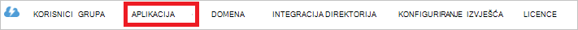

<properties
   pageTitle="Autentičnost s trgovinom Lake u podatke pomoću servisa Active Directory | Microsoft Azure"
   description="Saznajte kako provjeriti autentičnost s trgovinom Lake u podatke pomoću servisa Active Directory"
   services="data-lake-store"
   documentationCenter=""
   authors="nitinme"
   manager="jhubbard"
   editor="cgronlun"/>

<tags
   ms.service="data-lake-store"
   ms.devlang="na"
   ms.topic="article"
   ms.tgt_pltfrm="na"
   ms.workload="big-data"
   ms.date="10/17/2016"
   ms.author="nitinme"/>

# Provjera autentičnosti servisa servisna s spremišta Lake podataka pomoću servisa Azure Active Directory

> [AZURE.SELECTOR]
- [Provjera autentičnosti servisa servisa](data-lake-store-authenticate-using-active-directory.md)
- [Provjera autentičnosti krajnjeg korisnika](data-lake-store-end-user-authenticate-using-active-directory.md)

Spremište Lake za Azure podataka koristi Azure Active Directory za provjeru autentičnosti. Prije aplikacije koja funkcionira s Lake spremišta podataka za Azure ili Azure podataka Lake Analytics za izradu, morate najprije odlučite način provjere autentičnosti aplikacije s Azure Active Directory (Azure AD). Dva glavna dostupne su sljedeće mogućnosti:

* Provjera autentičnosti krajnjeg korisnika, a 
* Provjera autentičnosti na servis za servis. 

Obje mogućnosti rezultat u aplikaciji koja se dao OAuth 2.0 token, koja se dobiva priložiti svaki zahtjev Lake spremišta podataka za Azure ili Azure podataka Lake analize.

U ovom se članku talks o stvorite Azure AD web-aplikacije za provjeru autentičnosti servis za servis. Upute o konfiguraciji aplikacije Azure AD za provjeru autentičnosti krajnjeg korisnika potražite u članku [Provjera autentičnosti krajnjeg korisnika s spremišta Lake podataka pomoću servisa Azure Active Directory](data-lake-store-end-user-authenticate-using-active-directory.md).

## Preduvjeti

* Azure pretplate. Pogledajte [Početak Azure besplatnu probnu verziju](https://azure.microsoft.com/pricing/free-trial/).
* Vaša pretplata ID-a. Možete je dohvatiti na portalu Azure. Na primjer, je dostupna plohu računa spremišta Lake podataka.

    

* Azure AD naziv vaše domene. Možete je dohvatiti držanjem miša u gornjem desnom kutu Portal za Azure. U nastavku snimka naziv domene je **contoso.microsoft.com**i GUID unutar zagrada ID klijenta 

    

## Provjera autentičnosti servisa servisa

To je preporučeni način ako želite da se aplikacija za automatski provjeru s Azure AD bez potrebe za krajnji korisnik možete unijeti vjerodajnice. Aplikacija će biti moguće provjeriti autentičnost sam za dugo kao njegov vjerodajnice nisu valjane, koji može se prilagoditi radi se obliku godina.

### Što je potrebno koristiti taj pristup?

* Azure AD naziv domene. To je već naveden u preduvjeta ovog članka.

* Azure AD **web-aplikacije**.

* ID klijenta za Azure AD web-aplikaciju.

* Tajna klijent za Azure AD web-aplikaciju.

* Tokena krajnja točka za Azure AD web-aplikaciju.

* Omogućivanje pristupa za web-aplikaciju Azure AD na u spremištu podataka Lake datoteka/mapa ili analize podataka Lake račun koji želite raditi.

Upute o stvaranju Azure AD web-aplikacije i konfigurirati za uvjete navedene u odjeljku [Stvaranje aplikacije komponente Active Directory](#create-an-active-directory-application) ispod.

>[AZURE.NOTE] Prema zadanim postavkama aplikacije Azure AD je konfiguriran za korištenje tajna klijenta koji možete dohvatiti iz aplikacije za Azure AD. Međutim, ako želite da se aplikacija Azure AD namijenjenu certifikat, morate stvoriti web-aplikacije Azure AD pomoću Azure PowerShell kao što je opisano na [Stvori glavni certifikatom servisa](../resource-group-authenticate-service-principal.md#create-service-principal-with-certificate).

## Stvaranje aplikacije komponente Active Directory

U ovom odjeljku smo Saznajte upute za stvaranje i konfiguriranje Azure AD web-aplikacije za provjeru autentičnosti servis za servis pomoću Lake spremišta podataka za Azure pomoću servisa Azure Active Directory. 

### Korak 1: Stvaranje aplikacije servisa Azure Active Directory

>[AZURE.NOTE] Koraci u nastavku pomoću portala za Azure. Možete stvoriti i aplikaciju Azure AD pomoću [Azure PowerShell](../resource-group-authenticate-service-principal.md) ili [Azure EŽA](../resource-group-authenticate-service-principal-cli.md).

1. Prijavite se na račun za Azure putem [klasične portal](https://manage.windowsazure.com/).

2. U lijevom oknu odaberite **Servisa Active Directory** .

     
     
3. Odaberite servisa Active Directory koji želite koristiti za stvaranje nove aplikacije. Ako imate više od jednog servisa Active Directory, obično želite stvoriti aplikaciju u imeniku gdje se nalazi pretplate. Samo može dati pristup resursu za pretplatu za aplikacije u direktoriju isti kao svoju pretplatu.  

     
    
    
3. Da biste pregledali aplikacije u direktoriju, kliknite **aplikacije**.

     

4. Ako niste stvorili aplikacije u tom direktoriju prije vidjet ćete nešto slično kao na sljedećoj slici. Kliknite **DODAJ APLIKACIJU**

     

     Ili kliknite **Dodaj** u dnu okna.

     

6. Navedite naziv aplikacije, a zatim odaberite vrstu aplikacije koju želite stvoriti. U ovom ćete praktičnom vodiču stvaranje **API WEB AND/OR APLIKACIJU za WEB** i kliknite gumb Dalje.

     

7. Unesite svojstva za aplikacije. Za **Prijavu na URL**, navedite URI na web-mjesto koji opisuje aplikacije. Ne provjerava postojanje web-mjesta. Za **Aplikacije ID URI**pružaju URI koja služi za identifikaciju aplikacije.

     

    Kliknite kvačicu da biste dovršili Čarobnjak i stvaranje aplikacije.

### Korak 2: Dohvaćanje id klijenta, tajna klijenta i tokena krajnje točke

Kada se programski prijaviti, morate id za svoju aplikaciju. Ako se aplikacija pokreće se u odjeljku vlastitu vjerodajnice, također ćete ključa za provjeru autentičnosti.

1. Na kartici **Konfiguriraj** da biste konfigurirali lozinka vaša aplikacija kliknite.

     

2. Kopirajte **ID KLIJENTA**.
  
     

3. Ako aplikacija će pokrenuti u odjeljku vlastitu vjerodajnice, pomaknite se prema dolje do odjeljka **tipke** i odaberite koliko želite lozinke moraju biti valjane.

     

4. Odaberite **Spremi** da biste stvorili ključa.

    

    Prikazuje se tipku spremljena, a možete je kopirati. Nećete moći kasnije dohvatiti tipku tako da ga morate kopirati sada.

    

5. Dohvaćanje krajnju točku tokena tako da odaberete **Prikaz krajnje točke** pri dnu zaslona i dohvaćanje vrijednosti za polje **Tokena krajnjoj točki 2.0 OAuth** , kao što je prikazano u nastavku.  

    

### Korak 3: Dodjeljivanje aplikacije Azure AD Lake spremišta podataka za Azure račun datoteka ili mapa (samo za servis za servis provjera autentičnosti)

1. Prijavite se novom [Portalu Azure](https://portal.azure.com) i otvorili račun za Azure podataka Lake spremište koje želite pridružiti Azure Active Directory aplikaciju koju ste ranije stvorili.

1. U vašem plohu računa spremišta Lake podataka kliknite **Explorer podataka**.

    ![Stvaranje imenika računa spremišta Lake podataka] (./media/data-lake-store-authenticate-using-active-directory/adl.start.data.explorer.png "Stvaranje imenika Lake podataka računa")

2. U plohu **Explorer podataka** kliknite datoteku ili mapu za koju želite omogućiti pristup aplikaciji Azure AD, a zatim **programa Access**. Da biste konfigurirali pristup datoteke, mora kliknuti **programa Access** iz plohu **Pretpregled datoteka** .

    ![Postavljanje ACL-a podataka Lake datotečnom sustavu] (./media/data-lake-store-authenticate-using-active-directory/adl.acl.1.png "Postavljanje ACL-a podataka Lake datotečnom sustavu")

3. **Pristup** plohu navedeni standardne pristup i prilagođeni pristup već dodijelili korijenskom. Kliknite ikonu **Dodaj** da biste dodali ACL-a Prilagođena razina.

    ![Pristup standardnih ili prilagođenih popisa] (./media/data-lake-store-authenticate-using-active-directory/adl.acl.2.png "Pristup standardnih ili prilagođenih popisa")

4. Kliknite ikonu **Dodaj** da biste otvorili plohu **Dodajte prilagođeni pristup** . U ovom plohu kliknite **Odabir korisnika ili grupu**, a zatim **Odaberite korisnika ili grupu** plohu potražite sigurnosne grupe koji ste prethodno stvorili Azure Active Directory. Ako imate mnogo grupa za pretraživanje, koristiti tekstni okvir na vrhu da biste filtrirali naziv grupe. Kliknite grupu koju želite dodati, a zatim kliknite **Odaberi**.

    ![Dodaj grupu] (./media/data-lake-store-authenticate-using-active-directory/adl.acl.3.png "Dodaj grupu")

5. Kliknite **Odaberite dozvole**odaberite dozvole i ima li želite dodijeliti dozvole kao zadano ACL pristup ACL ili i jedno i drugo. Kliknite **u redu**.

    ![Dodjela dozvola grupi] (./media/data-lake-store-authenticate-using-active-directory/adl.acl.4.png "Dodjela dozvola grupi")

    Dodatne informacije o dozvolama u spremištu Lake podataka i zadane/pristup ACL-a potražite u članku [Kontrola pristupa u spremištu Lake podataka](data-lake-store-access-control.md).

6. U plohu **Dodajte prilagođeni pristup** kliknite **u redu**. Grupi novododani s dozvolama za povezane sada će se prikazati u **programu Access** plohu.

    ![Dodjela dozvola grupi] (./media/data-lake-store-authenticate-using-active-directory/adl.acl.5.png "Dodjela dozvola grupi") 

## Daljnji koraci

U ovom članku stvorili Azure AD web-aplikacije i prikupili potrebne informacije u vašem klijentskim aplikacijama autor pomoću .NET SDK, Java SDK itd. Sada možete nastaviti u sljedećim člancima koji objasniti kako pomoću web-aplikacije Azure AD uspješnoj spremišta Lake podataka i druge radnje za spremište.

- [Početak rada s spremišta Lake podataka za Azure pomoću .NET SDK-a](data-lake-store-get-started-net-sdk.md)
- [Početak rada s spremišta Lake podataka za Azure pomoću Java SDK](data-lake-store-get-started-java-sdk.md)
