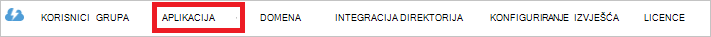

<properties
   pageTitle="Autentičnost s trgovinom Lake u podatke pomoću servisa Active Directory | Microsoft Azure"
   description="Saznajte kako provjeriti autentičnost s trgovinom Lake u podatke pomoću servisa Active Directory"
   services="data-lake-store"
   documentationCenter=""
   authors="nitinme"
   manager="jhubbard"
   editor="cgronlun"/>

<tags
   ms.service="data-lake-store"
   ms.devlang="na"
   ms.topic="article"
   ms.tgt_pltfrm="na"
   ms.workload="big-data"
   ms.date="10/17/2016"
   ms.author="nitinme"/>

# Provjera autentičnosti krajnjeg korisnika s spremišta Lake podataka pomoću servisa Azure Active Directory

> [AZURE.SELECTOR]
- [Provjera autentičnosti servisa servisa](data-lake-store-authenticate-using-active-directory.md)
- [Provjera autentičnosti krajnjeg korisnika](data-lake-store-end-user-authenticate-using-active-directory.md)

Spremište Lake za Azure podataka koristi Azure Active Directory za provjeru autentičnosti. Prije aplikacije koja funkcionira s Lake spremišta podataka za Azure ili Azure podataka Lake Analytics za izradu, morate najprije odlučite način provjere autentičnosti aplikacije s Azure Active Directory (Azure AD). Dva glavna dostupne su sljedeće mogućnosti:

* Provjera autentičnosti krajnjeg korisnika, a 
* Provjera autentičnosti na servis za servis. 

Obje mogućnosti rezultat u aplikaciji koja se dao OAuth 2.0 token, koja se dobiva priložiti svaki zahtjev Lake spremišta podataka za Azure ili Azure podataka Lake analize.

U ovom se članku talks o stvorite Azure AD web-aplikacije za provjeru autentičnosti krajnjeg korisnika. Upute o konfiguraciji aplikacije Azure AD za provjeru autentičnosti servis za servis potražite u članku [Provjera autentičnosti servis za servis s spremišta Lake podataka pomoću servisa Azure Active Directory](data-lake-store-authenticate-using-active-directory.md).

## Preduvjeti

* Azure pretplate. Pogledajte [Početak Azure besplatnu probnu verziju](https://azure.microsoft.com/pricing/free-trial/).
* Vaša pretplata ID-a. Možete je dohvatiti na portalu Azure. Na primjer, je dostupna plohu računa spremišta Lake podataka.

    

* Azure AD naziv vaše domene. Možete je dohvatiti držanjem miša u gornjem desnom kutu Portal za Azure. U nastavku snimka naziv domene je **contoso.microsoft.com**i GUID unutar zagrada ID klijenta 

    

## Provjera autentičnosti krajnjeg korisnika

Ako želite da se krajnji korisnik da biste se prijavili aplikaciju putem Azure AD, to je preporučeni način. Aplikacija će moći pristupiti Azure resursi jednaku razinu pristupa kao krajnji korisnik koji su prijavljeni. Vaš krajnjeg korisnika morat ćete navesti svoja uvjerenja povremeno redoslijedom aplikacije da biste zadržali programa access.

Rezultat pojavljuju krajnji korisnik prijaviti je aplikacija dobiva token za pristup i osvježavanje token. Token za pristup dobiva priložiti svaki zahtjev za spremište Lake podataka ili analize podataka Lake, a to vrijedi za jedan sat po zadanom. Token osvježavanja može koristiti da biste dobili novi token za pristup, a to vrijedi za dva tjedna po zadanom Ako redovito koristiti. Možete koristiti dvije različite postupke za prijavljivanje krajnjeg korisnika.

### Korištenje skočni prozor OAuth 2.0

Aplikaciju možete pokrenuti na OAuth 2.0 autorizacije skočni prozor, u koju krajnji korisnik može unijeti vjerodajnice. U ovom se skočni prozor funkcionira i sa postupak provjere autentičnosti Azure AD dvofaktorska analiza varijance (2FA), po potrebi. 

>[AZURE.NOTE] Ta metoda još nije podržana u na Azure AD provjera autentičnosti biblioteke (ADAL) za Python ili Java.

### Izravno prosljeđivanje u korisničke vjerodajnice

Aplikaciju možete izravno daje korisničke vjerodajnice za Azure AD. Ova metoda funkcionira samo s organizacijske ID korisničke račune; nije kompatibilno s osobnim / "live ID-JA" korisničkih računa, uključujući one koji završava na @outlook.com ili @live.com. Osim toga, ova metoda nije kompatibilno s korisničkim računima koji zahtijeva provjeru autentičnosti Azure AD dvofaktorska analiza varijance (2FA).

### Što je potrebno koristiti taj pristup?

* Azure AD naziv domene. To je već naveden u preduvjeta ovog članka.

* Azure AD **web-aplikacije**

* ID klijenta za web-aplikaciju Azure AD

* Odgovori URI za web-aplikaciju Azure AD

* Postavljanje delegirani dozvola

Upute o stvaranju Azure AD web-aplikacije i konfigurirati za uvjete navedene u odjeljku [Stvaranje aplikacije komponente Active Directory](#create-an-active-directory-application) ispod. 

## Stvaranje aplikacije komponente Active Directory

U ovom odjeljku smo Saznajte upute za stvaranje i konfiguriranje Azure AD web-aplikacije za provjeru autentičnosti krajnjeg korisnika s trgovinom Lake podataka za Azure pomoću servisa Azure Active Directory.

### Korak 1: Stvaranje aplikacije servisa Azure Active Directory

>[AZURE.NOTE] Koraci u nastavku pomoću portala za Azure. Možete stvoriti i aplikaciju Azure AD pomoću [Azure PowerShell](../resource-group-authenticate-service-principal.md) ili [Azure EŽA](../resource-group-authenticate-service-principal-cli.md).

1. Prijavite se na račun za Azure putem [klasične portal](https://manage.windowsazure.com/).

2. U lijevom oknu odaberite **Servisa Active Directory** .

     
     
3. Odaberite servisa Active Directory koji želite koristiti za stvaranje nove aplikacije. Ako imate više od jednog servisa Active Directory, obično želite stvoriti aplikaciju u imeniku gdje se nalazi pretplate. Samo može dati pristup resursu za pretplatu za aplikacije u direktoriju isti kao svoju pretplatu.  

     
    
    
3. Da biste pregledali aplikacije u direktoriju, kliknite **aplikacije**.

     

4. Ako niste stvorili aplikacije u tom direktoriju prije vidjet ćete nešto slično kao na sljedećoj slici. Kliknite **DODAJ APLIKACIJU**

     

     Ili kliknite **Dodaj** u dnu okna.

     

6. Navedite naziv aplikacije, a zatim odaberite vrstu aplikacije koju želite stvoriti. U ovom ćete praktičnom vodiču stvaranje **API WEB AND/OR APLIKACIJU za WEB** i kliknite gumb Dalje.

     

7. Unesite svojstva za aplikacije. Za **Prijavu na URL**, navedite URI na web-mjesto koji opisuje aplikacije. Ne provjerava postojanje web-mjesta. Za **Aplikacije ID URI**pružaju URI koja služi za identifikaciju aplikacije.

     

    Kliknite kvačicu da biste dovršili Čarobnjak i stvaranje aplikacije.

### Korak 2: Dohvaćanje id klijenta, odgovorite URI i postavljanje dozvola za prijenos ovlasti

1. Na kartici **Konfiguriraj** da biste konfigurirali lozinka vaša aplikacija kliknite.

     

2. Kopirajte **ID KLIJENTA**.
  
     

3. U odjeljku **jedinstvenu prijavu** kopirajte **URI odgovor**.

    

4. U odjeljku **dozvole drugim aplikacijama**, kliknite **Dodaj aplikaciju**

    

5. U čarobnjaku za **dozvole drugim aplikacijama** odaberite **Lake Azure podataka** i **Windows** **Azure usluga upravljanja API**pa kliknite kvačicu.

6. Po zadanom se **Dodijeliti dozvole** za novododani servise postavljen na nulu. Kliknite **Dodijeliti dozvole** padajućeg izbornika za Azure podataka Lake i servisa za upravljanje sustava Windows Azure, a zatim odaberite dostupne potvrdne okvire da biste postavili vrijednosti na 1. Rezultat trebao bi izgledati ovako.

     

7. Kliknite **Spremi**.

## Daljnji koraci

U ovom članku stvorili Azure AD web-aplikacije i prikupili potrebne informacije u vašem klijentskim aplikacijama autor pomoću .NET SDK, Java SDK itd. Sada možete nastaviti u sljedećim člancima koji objasniti kako pomoću web-aplikacije Azure AD uspješnoj spremišta Lake podataka i druge radnje za spremište.

- [Početak rada s spremišta Lake podataka za Azure pomoću .NET SDK-a](data-lake-store-get-started-net-sdk.md)
- [Početak rada s spremišta Lake podataka za Azure pomoću Java SDK](data-lake-store-get-started-java-sdk.md)
