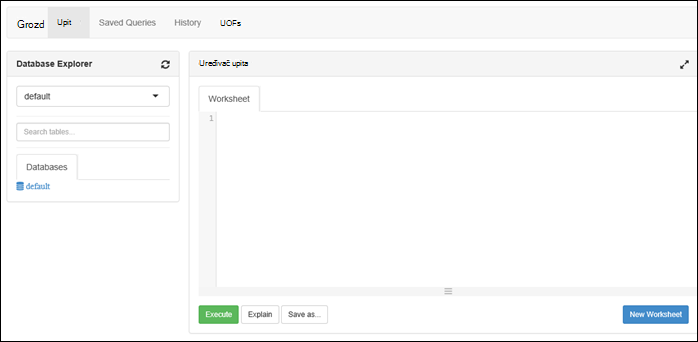

<properties
   pageTitle="Stvaranje HDInsight klastere s trgovinom Lake podataka za Azure pomoću portala za | Azure"
   description="Pomoću portala za Azure možete stvarati i koristiti HDInsight klastere s Lake spremišta podataka za Azure"
   services="data-lake-store,hdinsight" 
   documentationCenter=""
   authors="nitinme"
   manager="jhubbard"
   editor="cgronlun"/>

<tags
   ms.service="data-lake-store"
   ms.devlang="na"
   ms.topic="article"
   ms.tgt_pltfrm="na"
   ms.workload="big-data"
   ms.date="10/21/2016"
   ms.author="nitinme"/>

# Stvaranje programa HDInsight klaster s spremišta Lake podataka pomoću portala za Azure

> [AZURE.SELECTOR]
- [Pomoću portala](data-lake-store-hdinsight-hadoop-use-portal.md)
- [Pomoću komponente PowerShell](data-lake-store-hdinsight-hadoop-use-powershell.md)
- [Pomoću upravitelja resursa](data-lake-store-hdinsight-hadoop-use-resource-manager-template.md)

Saznajte kako koristiti Azure Portal da biste stvorili klaster HDInsight (Hadoop, HBase, Spark ili oluja) s pristupom Lake spremišta podataka za Azure. U ovom izdanju neke važne stavke:

* **Spark za klastere (Linux) i klastere Hadoop (Windows i Linux)**, Lake spremišta podataka mogu se koristiti samo kao račun dodatnog prostora za pohranu. Zadani račun za pohranu za pretraživanje kao skupina će i dalje biti Azure blob polja za pohranu (WASB).

* **Oluja za klastere (Windows i Linux)**, Lake spremišta podataka mogu se zapisivanje podataka iz oluja topologije. Spremište Lake podataka mogu i poslužiti da biste pohranili podatke reference koja se zatim može čitati oluja topologije. Dodatne informacije potražite u članku [Lake spremišta podataka koristi u oluja topologiji](#use-data-lake-store-in-a-storm-topology).

* **HBase za klastere (Windows i Linux)**, Lake spremišta podataka može se koristiti kao na zadani prostor za pohranu, kao i dodatni prostor za pohranu. Dodatne informacije potražite u članku [Spremišta Lake pomoću podataka s HBase klastere](#use-data-lake-store-with-hbase-clusters).

> [AZURE.NOTE] Napomena neke važne točke. 
> 
> * Mogućnost stvaranja HDInsight klastere s pristupom spremišta podataka Lake je dostupan samo za HDInsight verzije 3,2 3.4 (za klastere Hadoop, HBase i oluja sustava Windows, kao i Linux). Za klastere Spark na Linux, ova mogućnost dostupna je samo na klastere HDInsight 3.4.
>
> * Kao što je rečeno iznad spremišta Lake podataka dostupna je kao zadani prostor za pohranu za neke vrste klaster (HBase) i dodatni prostor za pohranu za ostale vrste klaster (Hadoop, Spark, oluja). Korištenje spremišta podataka Lake kao račun dodatnog prostora za pohranu ne utječu na performanse ili omogućuje čitanje/pisanje za pohranu iz skupine. U scenariju kao dodatni prostor za pohranu na kojoj se koristi spremište Lake podataka, datoteke vezane uz klaster (kao što su zapisnike, itd.) zapisuju se zadani prostor za pohranu (Azure blob-ova), dok je s podacima koje želite obrađivati može se spremiti u spremištu Lake podataka računa.

## Preduvjeti

Prije početka ovog praktičnog vodiča, morate imati sljedeće:

- **Mogući Azure pretplate**. Pogledajte [Početak Azure besplatnu probnu verziju](https://azure.microsoft.com/pricing/free-trial/).

- **Račun za azure podataka Lake trgovine**. Slijedite upute na [Početak rada s spremišta Lake podataka za Azure pomoću portala za Azure](data-lake-store-get-started-portal.md). 

- **Prijenos oglednih podataka na račun servisa Azure podataka Lake trgovine**. Kada stvorite račun, izvedite sljedeće zadatke da biste prenijeli ogledne podatke. Morat ćete ove podatke u nastavku Praktični vodič da biste pokrenuli zadataka iz programa klaster HDInsight koji pristupa podacima u spremištu Lake podataka.

    * [Stvaranje mape u spremištu Lake podataka](data-lake-store-get-started-portal.md#createfolder).
    * [Prijenos datoteke u spremište Lake podataka](data-lake-store-get-started-portal.md#uploaddata). Ako tražite ogledne podatke da biste prenijeli, možete dobiti mapu **Podataka Ambulance** [Azure podataka Lake brojka spremište](https://github.com/Azure/usql/tree/master/Examples/Samples/Data/AmbulanceData).

- **Azure Active Directory servisa glavnicu**. Koraci u ovom ćete praktičnom vodiču sadrže upute za stvaranje glavni servisa u Azure AD. Međutim, morate biti administrator Azure AD da biste mogli stvoriti glavni servisa. Ako ste administrator Azure AD, preskočite ovaj preduvjeta i vodič za nastavak.
    
    **Ako niste administrator Azure AD**, nećete moći korake potrebne za stvaranje glavni servisa. U tom slučaju administratoru Azure AD najprije stvorite glavni servisa da biste mogli stvarati programa HDInsight klaster s trgovinom Lake podataka. Osim toga, Upravitelj servisa moraju se stvoriti pomoću certifikata, kao što je opisano na [stvorite glavni certifikatom za uslugu](../resource-group-authenticate-service-principal.md#create-service-principal-with-certificate).

## Učiniti saznat ćete brže s videozapisima?

Pogledajte videozapise u nastavku da biste shvatili Dodjela resursa za klastere HDInsight s pristupom spremišta Lake podataka.

* [Stvaranje programa HDInsight klaster s pristupom spremišta Lake podataka](https://mix.office.com/watch/l93xri2yhtp2)
* Kada je klaster postavite, [podataka programa Access u spremištu Lake podataka pomoću grozd i Svinja skripti](https://mix.office.com/watch/1n9g5w0fiqv1q)

## Stvaranje programa HDInsight klaster s pristupom Lake spremišta podataka za Azure

U ovom ćete odjeljku stvoriti programa klaster HDInsight Hadoop koji koristi pohranu Lake podataka kao dodatan prostor za pohranu. U ovom izdanju za klaster Hadoop, spremišta podataka Lake mogu se koristiti samo kao dodatan prostor za pohranu za klaster. Zadani prostor za pohranu će i dalje biti Azure prostora za pohranu blob-ova (WASB). Tako, ne možemo ćete prvo stvorite račun za pohranu i potpisu potrebne za klaster.

1. Prijavite se novom [Portalu Azure](https://portal.azure.com).

2. Slijedite korake na [Stvaranje Hadoop klastere u HDInsight](../hdinsight/hdinsight-provision-clusters.md#create-using-the-preview-portal) da biste pokrenuli dodjele resursa za klaster HDInsight.

3. Na plohu **Neobavezno konfiguracije** kliknite **Izvor podataka**. U plohu **Izvora podataka** odredite detalje o računu za pohranu i spremnik za pohranu, odrediti **mjesto** kao **Istočni sad 2**, a zatim **Klaster AAD identitet**.

    ![Dodavanje servisa glavni HDInsight klaster] (./media/data-lake-store-hdinsight-hadoop-use-portal/hdi.adl.1.png "Dodavanje servisa glavni HDInsight klaster")

4. Na plohu **Klaster AAD identitet** možete odabrati da biste odabrali postojeći glavnice za servis ili stvorite novi.

    * **Stvaranje nove glavni servisa**

        * U plohu **Klaster AAD identiteta** kliknite **Stvori novi**, kliknite **Usluge**i zatim plohu **stvorite glavni servisa** unesite vrijednosti da biste stvorili novi Upravitelj servisa. Kao dio sustava koji certifikat i aplikaciju Azure Active Directory i stvara se. Kliknite **Stvori**.

            ![Dodavanje servisa glavni HDInsight klaster] (./media/data-lake-store-hdinsight-hadoop-use-portal/hdi.adl.2.png "Dodavanje servisa glavni HDInsight klaster")

        * Na plohu **Klaster AAD identiteta** kliknite **Upravljanje ADLS pristup**. U oknu prikazuje računa spremišta Lake podataka povezan s pretplatom. Međutim, možete postaviti dozvole samo za račun koji ste stvorili. Odaberite dozvole za ČITANJE/PISANJE/IZVRŠAVANJE za račun koji želite pridružiti HDInsight klaster, a zatim kliknite **Spremi dozvole**.

            ![Dodavanje servisa glavni HDInsight klaster] (./media/data-lake-store-hdinsight-hadoop-use-portal/hdi.adl.3.png "Dodavanje servisa glavni HDInsight klaster")

        * Na plohu **Klaster AAD identiteta** kliknite **Certifikat za preuzimanje** da biste preuzeli certifikat koji je povezan sa servisom glavni koju ste stvorili. To je korisno ako želite koristiti isti glavnicu servisa u budućnosti prilikom stvaranja dodatne klastere HDInsight. Kliknite **Odaberi**.

            ![Dodavanje servisa glavni HDInsight klaster] (./media/data-lake-store-hdinsight-hadoop-use-portal/hdi.adl.4.png "Dodavanje servisa glavni HDInsight klaster")

    * **Odaberite postojeći glavnice za servis**

        * U plohu **Klaster AAD identiteta** kliknite **Koristi postojeći**, kliknite **Usluge**i zatim u plohu **Odaberite glavni servisa** potražite postojeće glavnice za servis. Kliknite glavni naziv servisa, a zatim **Odaberite**.

            ![Dodavanje servisa glavni HDInsight klaster] (./media/data-lake-store-hdinsight-hadoop-use-portal/hdi.adl.5.png "Dodavanje servisa glavni HDInsight klaster")

        * Na plohu **Klaster AAD identiteta** prijenos certifikat (.pfx) povezan s glavnicu servis koji ste odabrali, a zatim unesite lozinku za potvrdu.

5. Kliknite **Upravljanje ADLS pristup** , a zatim **Odaberite dozvole za datoteku**. 

    ![Dodavanje servisa glavni HDInsight klaster] (./media/data-lake-store-hdinsight-hadoop-use-portal/hdi.adl.5.existing.save.png "Dodavanje servisa glavni HDInsight klaster")

6. U plohu **Odaberite datoteka dozvole** iz **računa** padajućem popisu, odaberite računa spremišta Lake podataka koje želite pridružene klaster HDInsight. Na plohu popis datoteke i mape koje su dostupne u odabrani račun spremišta Lake podataka. 
 
    ![Pristup osiguraj spremišta Lake podataka] (./media/data-lake-store-hdinsight-hadoop-use-portal/hdi-adl-permission-1.png "Pristup osiguraj spremišta Lake podataka")

    Nakon toga određivanje za dozvole koje želite koristiti za odabrane datoteke i mape. Mape, odrediti hoće li dozvole primjenjuju se u mapu samo ili mapu i sve podređene stavke u mapi. Odabir možete učiniti tako da odaberete odgovarajuću vrijednost u **Primijeni na** padajućeg popisa. Da biste uklonili dozvolu, kliknite ikonu **Izbriši**

    ![Pristup osiguraj spremišta Lake podataka] (./media/data-lake-store-hdinsight-hadoop-use-portal/hdi-adl-permission-2.png "Pristup osiguraj spremišta Lake podataka")

    Ponovite ove korake da biste pridružene datoteke i mape s drugih računa spremišta Lake podataka kao i. Kada dovršite Dodjela dozvola, kliknite **Odaberite** pri dnu zaslona u plohu.

7. U plohu **dodijelili dozvole za odabrani** pregled dozvola koju ste naveli, a zatim kliknite **Pokreni** da biste dodijelili dozvole.

    ![Pristup osiguraj spremišta Lake podataka] (./media/data-lake-store-hdinsight-hadoop-use-portal/hdi-adl-permission-3.png "Pristup osiguraj spremišta Lake podataka")

    Stupac Stanje prikazuje napredak. Kada uspješno dodjeljuju sve dozvole, kliknite **gotovo**. 

6. Kliknite **Odaberi** blades **Klaster AAD identiteta** i **Izvor podataka** , a zatim nastavite s klaster stvaranja kao što je opisano na [Stvaranje Hadoop klastere u HDInsight](../hdinsight/hdinsight-hadoop-create-linux-clusters-portal.md).

7. Kada je dodjeli klaster, možete provjeriti glavnicu servisa vezan uz klaster HDInsight. Da biste to učinili, iz plohu klaster, kliknite **Klaster AAD identiteta** da biste vidjeli povezane Upravitelj servisa.

    ![Dodavanje servisa glavni HDInsight klaster] (./media/data-lake-store-hdinsight-hadoop-use-portal/hdi.adl.6.png "Dodavanje servisa glavni HDInsight klaster")

## Pokrenite test zadatke na klaster HDInsight da koristi spremište Lake Azure podataka

Nakon što ste konfigurirali za HDInsight klaster, možete pokrenuti testiranje zadatke na klaster da biste testirali klaster HDInsight možete pristupiti podacima u spremištu Lake podataka za Azure. Da biste to učinili, ne možemo će se pokrenuti neki upiti grozd cilj Lake pohrane podataka.

### Za Linux klaster

1. Otvorite plohu klaster za klaster koji ste upravo dodijelili resurse, a zatim kliknite **nadzorne ploče**. Time ćete otvoriti Ambari za klaster Linux. Prilikom pristupanja Ambari, zatražit će se za provjeru autentičnosti web-mjesta. Administrator (zadani administratora), unesite račun ime i lozinku koje se koriste prilikom stvaranja klaster.

    ![Pokretanje klaster nadzorne ploče] (./media/data-lake-store-hdinsight-hadoop-use-portal/hdiadlcluster1.png "Pokretanje klaster nadzorne ploče")

    Možete i pristupiti izravno Ambari tako da odaberete https://CLUSTERNAME.azurehdinsight.net u web-pregledniku (gdje je **CLUSTERNAME** naziv svoj klaster HDInsight).

2. Otvorite prikaz grozd. Odaberite skup kvadrata na izborniku stranice (pokraj veza za **administratora** i gumb na desnoj strani stranice,) da biste popis dostupnih prikaza. Odaberite prikaz **vrste Hive** .

    

3. Trebali biste vidjeti stranicu koja je slična sljedećoj:

    

4. U odjeljku **Uređivača upita** na stranici zalijepite sljedeću naredbu HiveQL u radnom listu:

        CREATE EXTERNAL TABLE vehicles (str string) LOCATION 'adl://mydatalakestore.azuredatalakestore.net:443/mynewfolder'

5. Kliknite gumb **izvrši** pri dnu **Uređivača upita** da biste pokrenuli upit. Sekcije **Rezultata upita postupak** mora se prikazati ispod **Uređivača upita** i prikazivati informacije o posao.

6. Po dovršetku upita u odjeljku **Rezultati upita postupak** će prikazati rezultate operacije. Kartica **rezultata** mora sadržavati sljedeće informacije:

7. Pokrenite sljedeći upit da biste provjerili je li stvoriti tablicu.

        SHOW TABLES;

    Kartica **rezultata** treba prikazati sljedeće:

        hivesampletable
        vehicles

    **vozila** nalazi se tablica koji ste prethodno stvorili. **hivesampletable** je dostupna u svim HDInsight klastere po zadanom ogledne tablice.

8. Možete i pokrenuti upit za dohvaćanje podataka iz tablice **vozila** .

        SELECT * FROM vehicles LIMIT 5;

### Za Windows klaster

1. Otvorite plohu klaster za klaster koji ste upravo dodijelili resurse, a zatim kliknite **nadzorne ploče**.

    ![Pokretanje klaster nadzorne ploče] (./media/data-lake-store-hdinsight-hadoop-use-portal/hdiadlcluster1.png "Pokretanje klaster nadzorne ploče")

    Kada se to od vas zatraži, unesite vjerodajnice administratora za klaster.

2. Otvorit će se konzole za upit sustava Microsoft Azure HDInsight. Kliknite **vrste Hive uređivač**.

    ![Otvaranje vrste Hive uređivača] (./media/data-lake-store-hdinsight-hadoop-use-portal/hdiadlcluster2.png "Otvaranje vrste Hive uređivača")

3. U uređivaču vrste Hive unesite sljedeći upit, a zatim kliknite **Pošalji**.

        CREATE EXTERNAL TABLE vehicles (str string) LOCATION 'adl://mydatalakestore.azuredatalakestore.net:443/mynewfolder'

    U ovom upitu grozd smo stvorili tablicu iz podataka pohranjenih u spremištu Lake podataka na `adl://mydatalakestore.azuredatalakestore.net:443/mynewfolder`. To mjesto sadrži ogledne podatkovne datoteke koje treba ste prethodno prenijeli.

    Tablica **Sesiju posao** pri dnu prikazuje status posla zamjenjivanje **Initializing** **pokrenut**, na **Dovršeno**. Možete kliknuti i **Prikaz detalja** da biste vidjeli dodatne informacije o dovršeni zadatak.

    ![Stvaranje tablice] (./media/data-lake-store-hdinsight-hadoop-use-portal/hdiadlcluster3.png "Stvaranje tablice")

4. Pokrenite sljedeći upit da biste provjerili je li stvoriti tablicu.

        SHOW TABLES;

    Kliknite **Prikaži detalje** odgovara ovaj upit i izlaz treba prikazati na sljedeći način:

        hivesampletable
        vehicles

    **vozila** nalazi se tablica koji ste prethodno stvorili. **hivesampletable** je dostupna u svim HDInsight klastere po zadanom ogledne tablice.

5. Možete i pokrenuti upit za dohvaćanje podataka iz tablice **vozila** .

        SELECT * FROM vehicles LIMIT 5;

## Pristup podataka iz trgovine Lake pomoću naredbi HDFS

Nakon što ste konfigurirali klaster HDInsight da koristi spremište Lake podataka, koristite naredbe ljuske HDFS za pristup spremište.

### Za Linux klaster

U ovoj sekciji koju će SSH u klaster i pokretanje naredbe HDFS. Windows ne nudi ugrađene SSH klijenta. Preporučujemo korištenje **PuTTY**, koji možete preuzeti s [http://www.chiark.greenend.org.uk/~sgtatham/putty/download.html](http://www.chiark.greenend.org.uk/~sgtatham/putty/download.html).

Dodatne informacije o korištenju PuTTY potražite u članku [Korištenje SSH sa sustavom Linux Hadoop na HDInsight iz sustava Windows](../hdinsight/hdinsight-hadoop-linux-use-ssh-windows.md).

Nakon uspostave koristite sljedeću naredbu datotečnom sustavu HDFS na popisu datoteka u spremištu Lake podataka.

    hdfs dfs -ls adl://<Data Lake Store account name>.azuredatalakestore.net:443/

To treba popis datoteka koje ste prethodno prenijeli Lake spremište podataka.

    15/09/17 21:41:15 INFO web.CaboWebHdfsFileSystem: Replacing original urlConnectionFactory with org.apache.hadoop.hdfs.web.URLConnectionFactory@21a728d6
    Found 1 items
    -rwxrwxrwx   0 NotSupportYet NotSupportYet     671388 2015-09-16 22:16 adl://mydatalakestore.azuredatalakestore.net:443/mynewfolder

Možete koristiti u `hdfs dfs -put` naredbu za prijenos neke datoteke Lake spremište podataka, a zatim pomoću `hdfs dfs -ls` da biste provjerili je li datoteka uspješno prenijeli.

### Za Windows klaster

1. Prijavite se novom [Portalu Azure](https://portal.azure.com).

2. Kliknite **Pregledaj**, kliknite **HDInsight klastere**, a zatim klaster HDInsight koji ste stvorili.

3. U plohu klaster kliknite **Udaljene radne površine**, a zatim plohu **Udaljene radne površine** kliknite **Poveži**.

    ![Udaljena u HDI klaster] (./media/data-lake-store-hdinsight-hadoop-use-portal/ADL.HDI.PS.Remote.Desktop.png "Stvaranje grupe sustava Azure resursa")

    Kada se to od vas zatraži, unesite vjerodajnice navedene za udaljene radne površine korisnika.

4. U udaljenu sesiju pokrenite Windows PowerShell i naredbama HDFS datotečnom sustavu popis datoteka u spremištu Lake Azure podataka.

        hdfs dfs -ls adl://<Data Lake Store account name>.azuredatalakestore.net:443/

    To treba popis datoteka koje ste prethodno prenijeli Lake spremište podataka.

        15/09/17 21:41:15 INFO web.CaboWebHdfsFileSystem: Replacing original urlConnectionFactory with org.apache.hadoop.hdfs.web.URLConnectionFactory@21a728d6
        Found 1 items
        -rwxrwxrwx   0 NotSupportYet NotSupportYet     671388 2015-09-16 22:16 adl://mydatalakestore.azuredatalakestore.net:443/mynewfolder

    Možete koristiti u `hdfs dfs -put` naredbu za prijenos neke datoteke Lake spremište podataka, a zatim pomoću `hdfs dfs -ls` da biste provjerili je li datoteka uspješno prenijeli.

## Korištenje podataka Lake trgovine s Spark klaster

U ovom se odjeljku pomoću Jupyter bilježnice dostupne s HDInsight Spark klastere pokrenuti posao koja čita podatke iz spremišta podataka Lake račun koji je pridružen HDInsight Spark klaster, umjesto zadani račun za Azure spremišta blobova.

1. Kopirajte iznad neke ogledne podatke iz zadani prostor za pohranu račun (WASB) pridružene klaster Spark račun iz trgovine Azure podataka Lake pridružene klaster. [Alat za ADLCopy](http://aka.ms/downloadadlcopy) možete koristiti da biste to učinili. Preuzmite i instalirajte alat veze.

2. Otvorite naredbeni redak, a zatim otvorite direktorija AdlCopy instaliranim obično `%HOMEPATH%\Documents\adlcopy`.

3. Pokrenite sljedeću naredbu da biste kopirali određene blob iz izvora spremnik Lake izvor podataka:

        AdlCopy /source https://<source_account>.blob.core.windows.net/<source_container>/<blob name> /dest swebhdfs://<dest_adls_account>.azuredatalakestore.net/<dest_folder>/ /sourcekey <storage_account_key_for_storage_container>

    U ovom ćete praktičnom vodiču kopirajte **HVAC.csv** ogledne podatkovne datoteke pri **/HdiSamples/HdiSamples/SensorSampleData/hvac/** na račun za Azure podataka Lake trgovine. Isječak koda trebao bi izgledati kao što su:

        AdlCopy /Source https://mydatastore.blob.core.windows.net/mysparkcluster/HdiSamples/HdiSamples/SensorSampleData/hvac/HVAC.csv /dest swebhdfs://mydatalakestore.azuredatalakestore.net/hvac/ /sourcekey uJUfvD6cEvhfLoBae2yyQf8t9/BpbWZ4XoYj4kAS5Jf40pZaMNf0q6a8yqTxktwVgRED4vPHeh/50iS9atS5LQ==

    >[AZURE.WARNING] Provjerite nalaze li se naziva datoteke i puta velikim početnim slovom.

4. Zatražit će se da biste unijeli vjerodajnice za Azure pretplatu na kojem imate računa spremišta Lake podataka. Prikazat će se na Izlaz sličnu ovoj:

        Initializing Copy.
        Copy Started.
        100% data copied.
        Copy Completed. 1 file copied.

    Podatkovne datoteke (**HVAC.csv**) kopirat će se u odjeljku mape **/hvac** u spremištu Lake podataka računa.

4. S [Portala za Azure](https://portal.azure.com/), iz startboard, kliknite pločicu za svoj klaster Spark (Ako ste ga prikvačiti na startboard). Možete se kretati svoj klaster u odjeljku **Pregledaj sve** > **Klastere HDInsight**.   

2. Iz klaster plohu Spark kliknite **Brze veze**, pa iz plohu **Nadzorne ploče klaster** **Jupyter bilježnice**. Ako se to od vas zatraži, unesite administratorskih vjerodajnica za klaster.

    > [AZURE.NOTE] Možda dosegne i Jupyter bilježnicu za svoj klaster tako da otvorite sljedeći URL u pregledniku. Zamijenite __CLUSTERNAME__ pod nazivom svoj klaster:
    >
    > `https://CLUSTERNAME.azurehdinsight.net/jupyter`

2. Stvaranje nove bilježnice. Kliknite **Novo**, a zatim kliknite **PySpark**.

    ![Stvaranje nove bilježnice Jupyter] (./media/data-lake-store-hdinsight-hadoop-use-portal/hdispark.note.jupyter.createnotebook.png "Stvaranje nove bilježnice Jupyter")

3. Nova bilježnica se stvara i otvara pod nazivom **Untitled.pynb**. 

4. Budući da ste stvorili pomoću otklanjanje PySpark bilježnice, ne morate izričito stvaranje sve konteksta. Konteksta Spark i grozd će se automatski stvara za vas kada pokrenete prvu ćeliju kod. Možete započeti tako da uvezete vrste potrebne za taj scenarij. Da biste to učinili, zalijepite sljedeći isječak koda u ćeliji, a zatim pritisnite **SHIFT + ENTER**.

        from pyspark.sql.types import *
        
    Svaki put kada pokrenete posao u Jupyter, naslov prozora preglednika web prikazivat će se status **(zauzet)** uz naziv bilježnice. Prikazat će se i Ispunjeni krug pokraj teksta **PySpark** u gornjem desnom kutu. Po dovršetku posao to promijenit će prazni krug.

     ![Status posla Jupyter bilježnice] (./media/data-lake-store-hdinsight-hadoop-use-portal/hdispark.jupyter.job.status.png "Status posla Jupyter bilježnice")

4. Učitavanje ogledne podatke u privremena pomoću datoteke **HVAC.csv** koji ste kopirali računa spremišta Lake podataka. Možete pristupiti podatke u spremište podataka Lake račun pomoću sljedećeg uzorka URL-a.

        adl://<data_lake_store_name>.azuredatalakestore.net/<path_to_file>

    U praznu ćeliju, zalijepite sljedeći primjer koda, zamijenite **MYDATALAKESTORE** naziv računa spremišta Lake podataka i pritisnite **SHIFT + ENTER**. U ovom se primjeru kod registrira podatke u privremenu tablicu pod nazivom **hvac**.

        # Load the data
        hvacText = sc.textFile("adl://MYDATALAKESTORE.azuredatalakestore.net/hvac/HVAC.csv")
        
        # Create the schema
        hvacSchema = StructType([StructField("date", StringType(), False),StructField("time", StringType(), False),StructField("targettemp", IntegerType(), False),StructField("actualtemp", IntegerType(), False),StructField("buildingID", StringType(), False)])
        
        # Parse the data in hvacText
        hvac = hvacText.map(lambda s: s.split(",")).filter(lambda s: s[0] != "Date").map(lambda s:(str(s[0]), str(s[1]), int(s[2]), int(s[3]), str(s[6]) ))
        
        # Create a data frame
        hvacdf = sqlContext.createDataFrame(hvac,hvacSchema)
        
        # Register the data fram as a table to run queries against
        hvacdf.registerTempTable("hvac")

5. Budući da koristite PySpark otklanjanje, možete odmah izravno pokrenuti SQL upita na privremena **hvac** koju ste upravo stvorili pomoću na `%%sql` poseban. Dodatne informacije o na `%%sql` poseban, kao i druge magics dostupno u sklopu otklanjanje PySpark potražite u članku [jezgre dostupne na Jupyter bilježnica s klastere Spark HDInsight](hdinsight-apache-spark-jupyter-notebook-kernels.md#why-should-i-use-the-new-kernels).
        
        %%sql
        SELECT buildingID, (targettemp - actualtemp) AS temp_diff, date FROM hvac WHERE date = \"6/1/13\"

5. Kada posao je uspješno dovršena, po zadanom prikazuju sljedeće tablični izlaz.

    ![Izlaz tablice rezultata upita] (./media/data-lake-store-hdinsight-hadoop-use-portal/tabular.output.png "Izlaz tablice rezultata upita")

    Možete pogledati i rezultatima u drugim vizualizacijama. Na primjer, u područje grafikon u rezultatu isti izgledati sljedeće.

    ![Površinski grafikon rezultata upita] (./media/data-lake-store-hdinsight-hadoop-use-portal/area.output.png "Površinski grafikon rezultata upita")

6. Nakon što dovršite pokrenuti aplikaciju, trebali biste zatvaranja bilježnice da biste predali resurse. Da biste to učinili, na izborniku **datoteka** bilježnicu, kliknite **Zatvori i zaustavili**. Ovaj će zatvaranja i Zatvori bilježnicu.

## Korištenje podataka Lake pohrane u oluja topologiji

Lake spremišta podataka možete koristiti za zapisivanje podataka iz oluja topologije. Upute o tome da biste postigli scenarij potražite u članku [Spremišta podataka koristi Azure Lake s oluja Apache s HDInsight](../hdinsight/hdinsight-storm-write-data-lake-store.md).

## Spremište Lake pomoću podataka s HBase klaster

S klastere HBase spremišta Lake podataka možete koristiti kao na zadani prostor za pohranu, kao i dodatni prostor za pohranu. Da biste to učinili:

1.  U plohu **Izvora podataka** za **Mjesto HBase podataka**, odaberite **Spremišta Lake podataka** .
2.  Odaberite naziv je spremište Lake podataka ili stvorite novi.
3.  Na kraju, navedite **HBase korijenske mape** u spremištu Lake podataka. Ako račun spremišta podataka Lake korijensku mapu, stvorite novi.

    ![HBase s trgovinom Lake podataka] (./media/data-lake-store-hdinsight-hadoop-use-portal/hbase-data-lake-store.png "Stvaranje grupe sustava Azure resursa")

### Prilikom korištenja spremišta podataka Lake kao zadani prostor za pohranu za klastere HBase

* Možete koristiti isti račun spremišta Lake podataka za više od jedne HBase klaster. Međutim, **HBase korijensku mapu** u kojoj se omogućavaju klaster (koraku 4 u snimke zaslona) mora biti jedinstvena. **Ne morate** koristiti istu korijenske mape preko dvije različite klastere HBase.
* Čak i ako koristite račun spremišta podataka Lake kao zadani prostor za pohranu, u datoteke zapisnika HBase klaster pohranjuju u na Azure prostora za pohranu blob polja (WASB) pridružene klaster. Istaknuta je u okviru plava snimke zaslona iznad.

## Vidi također

* [PowerShell: Stvaranje programa HDInsight klaster da koristi spremište Lake podataka](data-lake-store-hdinsight-hadoop-use-powershell.md)

[makecert]: https://msdn.microsoft.com/library/windows/desktop/ff548309(v=vs.85).aspx
[pvk2pfx]: https://msdn.microsoft.com/library/windows/desktop/ff550672(v=vs.85).aspx
