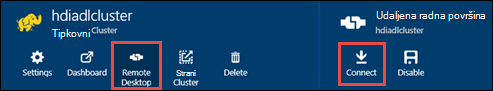

<properties
   pageTitle="Stvaranje HDInsight klastere s trgovinom Lake podataka za Azure pomoću predložaka resursima | Microsoft Azure"
   description="Korištenje predložaka Azure Voditelj resursa za stvaranje i korištenje klastere HDInsight s trgovinom Lake podataka za Azure"
   services="data-lake-store,hdinsight"
   documentationCenter=""
   authors="nitinme"
   manager="jhubbard"
   editor="cgronlun"/>

<tags
   ms.service="data-lake-store"
   ms.devlang="na"
   ms.topic="article"
   ms.tgt_pltfrm="na"
   ms.workload="big-data"
   ms.date="10/21/2016"
   ms.author="nitinme"/>

# <a name="create-an-hdinsight-cluster-with-data-lake-store-using-azure-resource-manager-template"></a>Stvaranje programa HDInsight klaster s spremišta Lake podataka pomoću predloška Azure Voditelj resursa

> [AZURE.SELECTOR] - [Pomoću portala](data-lake-store-hdinsight-hadoop-use-portal.md) - [pomoću komponente PowerShell](data-lake-store-hdinsight-hadoop-use-powershell.md) - [pomoću upravitelja resursa](data-lake-store-hdinsight-hadoop-use-resource-manager-template.md)

Saznajte kako koristiti predložak Azure Voditelj resursa za konfiguriranje programa HDInsight klaster s pristupom Lake spremišta podataka za Azure. U ovom izdanju neke važne stavke:

-   **Spark za klastere (Linux) i Hadoop/oluja klastere (Windows i Linux)**, Lake spremišta podataka mogu se koristiti samo kao račun dodatnog prostora za pohranu. Zadani račun za pohranu za pretraživanje kao skupina će i dalje biti Azure blob polja za pohranu (WASB).

-   **HBase za klastere (Windows i Linux)**, Lake spremišta podataka može se koristiti kao zadani prostor za pohranu ili dodatni prostor za pohranu.

> [AZURE.NOTE] Napomena neke važne točke.
>
> - Mogućnost stvaranja HDInsight klastere s pristupom spremišta podataka Lake je dostupan samo za HDInsight verzije 3,2 3.4 (za klastere Hadoop, HBase i oluja sustava Windows, kao i Linux). Za klastere Spark na Linux, ova mogućnost dostupna je samo na klastere HDInsight 3.4.
>
> - Kao što je rečeno iznad spremišta Lake podataka dostupna je kao zadani prostor za pohranu za neke vrste klaster (HBase) i dodatni prostor za pohranu za ostale vrste klaster (Hadoop, Spark, oluja). Korištenje spremišta podataka Lake kao račun dodatnog prostora za pohranu ne utječu na performanse ili omogućuje čitanje/pisanje za pohranu iz skupine. U scenariju kao dodatni prostor za pohranu na kojoj se koristi spremište Lake podataka, datoteke vezane uz klaster (kao što su zapisnike, itd.) zapisuju se zadani prostor za pohranu (Azure blob-ova), dok je s podacima koje želite obrađivati može se spremiti u spremištu Lake podataka računa.
>

U ovom se članku smo Dodjela Hadoop klaster s trgovinom Lake podataka kao dodatni prostor za pohranu.

## <a name="prerequisites"></a>Preduvjeti

Prije početka ovog praktičnog vodiča, morate imati sljedeće:

-   **Mogući Azure pretplate**. Pogledajte [Početak Azure besplatnu probnu verziju](https://azure.microsoft.com/pricing/free-trial/).

-   **Azure PowerShell 1.0 ili noviji**. Saznajte [kako instalirati i konfigurirati Azure PowerShell](../powershell-install-configure.md).

- **Azure Active Directory servisa glavnicu**. Koraci u ovom ćete praktičnom vodiču sadrže upute za stvaranje glavni servisa u Azure AD. Međutim, morate biti administrator Azure AD da biste mogli stvoriti glavni servisa. Ako ste administrator Azure AD, preskočite ovaj preduvjeta i vodič za nastavak.
    
    **Ako niste administrator Azure AD**, nećete moći korake potrebne za stvaranje glavni servisa. U tom slučaju administratoru Azure AD najprije stvorite glavni servisa da biste mogli stvarati programa HDInsight klaster s trgovinom Lake podataka. Osim toga, Upravitelj servisa moraju se stvoriti pomoću certifikata, kao što je opisano na [stvorite glavni certifikatom za uslugu](../resource-group-authenticate-service-principal.md#create-service-principal-with-certificate).

## <a name="create-an-hdinsight-cluster-with-azure-data-lake-store"></a>Stvaranje programa HDInsight klaster s Lake spremišta podataka za Azure

Predložak Voditelj resursa i preduvjeti za korištenje predloška, dostupne su na GitHub pri [uvođenja HDInsight Linux klaster s nove trgovine Lake podataka](https://github.com/Azure/azure-quickstart-templates/tree/master/201-hdinsight-datalake-store-azure-storage). Slijedite upute na ovu vezu da biste stvorili programa HDInsight klaster Lake spremišta podataka Azure kao dodatan prostor za pohranu.

Upute za veze na prethodno navedenim zahtijevaju PowerShell. Prije nego što počnete s te upute, provjerite je li se prijaviti na račun za Azure. Na radnoj površini otvaranje novog prozora Azure PowerShell pa unesite sljedeće isječci. Kada se to od vas zatraži da biste se prijavili, provjerite je li se prijaviti kao jedan od admininistrators/vlasnik pretplate:

```
# Log in to your Azure account
Login-AzureRmAccount

# List all the subscriptions associated to your account
Get-AzureRmSubscription

# Select a subscription
Set-AzureRmContext -SubscriptionId <subscription ID>
```

## <a name="upload-sample-data-to-the-azure-data-lake-store"></a>Prijenos ogledne podatke u spremištu Lake Azure podataka

Voditelj resursa predložak stvara novi račun za pohranu podataka Lake i povezuje s klaster HDInsight. Sada morate prenesite oglednih podataka Lake pohrane podataka. Morat ćete ove podatke u nastavku Praktični vodič da biste pokrenuli zadataka iz programa klaster HDInsight koji pristupa podacima u spremištu Lake podataka. Upute za prijenos podataka, potražite u članku [Prijenos datoteke u spremište Lake podataka](data-lake-store-get-started-portal.md#uploaddata). Ako tražite oglednih podataka za prijenos **Podataka Ambulance** mape možete pristupiti iz [Azure podataka Lake brojka spremište](https://github.com/Azure/usql/tree/master/Examples/Samples/Data/AmbulanceData).

## <a name="set-relevant-acls-on-the-sample-data"></a>Postavljanje odgovarajuće ACL-a na ogledne podatke

Da biste provjerili je li se može pristupiti iz servisa HDInsight klaster ogledne podatke koji prenosite datoteke, morate omogućiti da Azure AD aplikaciju koja se koristi da bi se mogao utvrditi identitet između HDInsight klaster i spremišta podataka Lake ima pristup mapa pokušavate pristupiti. Da biste to učinili, poduzeti sljedeće korake.

1.  Pronađite naziv aplikacije za Azure AD koji je pridružen HDInsight klaster i Lake pohrane podataka. Da biste potražili naziv tako da otvorite plohu klaster HDInsight koji ste stvorili pomoću predloška za Voditelj resursa, kliknite karticu **Klaster AAD identiteta** , a potražite vrijednost **Usluge zaslonsko ime**.

2.  Sada omogućuje pristup ovu aplikaciju Azure AD na datoteka/mapa koje želite pristupiti iz skupine HDInsight. Da biste postavili desno ACL-a na datoteka/mapa u spremištu Lake podataka, potražite u članku [Zaštita podataka u spremištu Lake podataka](data-lake-store-secure-data.md#assign-users-or-security-group-as-acls-to-the-azure-data-lake-store-file-system).

## <a name="run-test-jobs-on-the-hdinsight-cluster-to-use-the-data-lake-store"></a>Pokrenite test zadatke na klaster HDInsight da koristi spremište Lake podataka

Nakon što ste konfigurirali za HDInsight klaster, možete pokrenuti testiranje zadatke na klaster da biste testirali klaster HDInsight pristupite spremištu Lake podataka. Da biste to učinili, ne možemo će se pokrenuti posao grozd uzorka koji stvara tablicu korištenje oglednih podataka koji ste prenijeli ranije Lake spremište podataka.

### <a name="for-a-linux-cluster"></a>Za Linux klaster

U ovom odjeljku će SSH u klaster i pokrenite na primjer grozd upita. Windows ne nudi ugrađene SSH klijenta. Preporučujemo korištenje **PuTTY**, koji možete preuzeti s [http://www.chiark.greenend.org.uk/~sgtatham/putty/download.html](http://www.chiark.greenend.org.uk/~sgtatham/putty/download.html).

Dodatne informacije o korištenju PuTTY potražite u članku [Korištenje SSH sa sustavom Linux Hadoop na HDInsight iz sustava Windows ](../hdinsight/hdinsight-hadoop-linux-use-ssh-windows.md).

1.  Nakon uspostave pokrenuti EŽA vrste Hive u sljedeću naredbu:

    ```
    hive
    ```

2.  Koristi se EŽA, unesite sljedeće naredbe za stvaranje nove tablice pod nazivom **vozila** pomoću ogledne podatke u spremištu Lake podataka:

    ```
    DROP TABLE vehicles;
    CREATE EXTERNAL TABLE vehicles (str string) LOCATION 'adl://<mydatalakestore>.azuredatalakestore.net:443/';
    SELECT * FROM vehicles LIMIT 10;
    ```

    Trebali biste vidjeti na Izlaz sličnu ovoj:

    ```
    1,1,2014-09-14 00:00:03,46.81006,-92.08174,51,S,1
    1,2,2014-09-14 00:00:06,46.81006,-92.08174,13,NE,1
    1,3,2014-09-14 00:00:09,46.81006,-92.08174,48,NE,1
    1,4,2014-09-14 00:00:12,46.81006,-92.08174,30,W,1
    1,5,2014-09-14 00:00:15,46.81006,-92.08174,47,S,1
    1,6,2014-09-14 00:00:18,46.81006,-92.08174,9,S,1
    1,7,2014-09-14 00:00:21,46.81006,-92.08174,53,N,1
    1,8,2014-09-14 00:00:24,46.81006,-92.08174,63,SW,1
    1,9,2014-09-14 00:00:27,46.81006,-92.08174,4,NE,1
    1,10,2014-09-14 00:00:30,46.81006,-92.08174,31,N,1
    ```

### <a name="for-a-windows-cluster"></a>Za Windows klaster

Koristite sljedeće Cmdlete da biste pokrenuli upit grozd. U ovom upitu smo stvaranje tablice iz podataka u spremištu Lake podataka i pokrenuti upit s izdvajanjem stvorili tablicu.

```
$queryString = "DROP TABLE vehicles;" + "CREATE EXTERNAL TABLE vehicles (str string) LOCATION 'adl://$dataLakeStoreName.azuredatalakestore.net:443/';" + "SELECT * FROM vehicles LIMIT 10;"

$hiveJobDefinition = New-AzureRmHDInsightHiveJobDefinition -Query $queryString

$hiveJob = Start-AzureRmHDInsightJob -ResourceGroupName $resourceGroupName -ClusterName $clusterName -JobDefinition $hiveJobDefinition -ClusterCredential $httpCredentials

Wait-AzureRmHDInsightJob -ResourceGroupName $resourceGroupName -ClusterName $clusterName -JobId $hiveJob.JobId -ClusterCredential $httpCredentials
```

Imat će sljedeći rezultat. **ExitValue** 0 u izlaz predlaže uspješno dovršena posao.

```
Cluster         : hdiadlcluster.
HttpEndpoint    : hdiadlcluster.azurehdinsight.net
State           : SUCCEEDED
JobId           : job_1445386885331_0012
ParentId        :
PercentComplete :
ExitValue       : 0
User            : admin
Callback        :
Completed       : done
```

Dohvaćanje Izlaz iz posla pomoću sljedeći cmdlet:

```
Get-AzureRmHDInsightJobOutput -ClusterName $clusterName -JobId $hiveJob.JobId -DefaultContainer $containerName -DefaultStorageAccountName $storageAccountName -DefaultStorageAccountKey $storageAccountKey -ClusterCredential $httpCredentials
```

Izlaz posao izgleda otprilike ovako:

```
1,1,2014-09-14 00:00:03,46.81006,-92.08174,51,S,1
1,2,2014-09-14 00:00:06,46.81006,-92.08174,13,NE,1
1,3,2014-09-14 00:00:09,46.81006,-92.08174,48,NE,1
1,4,2014-09-14 00:00:12,46.81006,-92.08174,30,W,1
1,5,2014-09-14 00:00:15,46.81006,-92.08174,47,S,1
1,6,2014-09-14 00:00:18,46.81006,-92.08174,9,S,1
1,7,2014-09-14 00:00:21,46.81006,-92.08174,53,N,1
1,8,2014-09-14 00:00:24,46.81006,-92.08174,63,SW,1
1,9,2014-09-14 00:00:27,46.81006,-92.08174,4,NE,1
1,10,2014-09-14 00:00:30,46.81006,-92.08174,31,N,1
```

## <a name="access-data-lake-store-using-hdfs-commands"></a>Pristup podataka iz trgovine Lake pomoću naredbi HDFS

Nakon što ste konfigurirali klaster HDInsight da koristi spremište Lake podataka, koristite naredbe ljuske HDFS za pristup spremište.

### <a name="for-a-linux-cluster"></a>Za Linux klaster

U ovoj sekciji koju će SSH u klaster i pokretanje naredbe HDFS. Windows ne nudi ugrađene SSH klijenta. Preporučujemo korištenje **PuTTY**, koji možete preuzeti s [http://www.chiark.greenend.org.uk/~sgtatham/putty/download.html](http://www.chiark.greenend.org.uk/~sgtatham/putty/download.html).

Dodatne informacije o korištenju PuTTY potražite u članku [Korištenje SSH sa sustavom Linux Hadoop na HDInsight iz sustava Windows ](../hdinsight/hdinsight-hadoop-linux-use-ssh-windows.md).

Nakon uspostave koristite sljedeću naredbu datotečnom sustavu HDFS na popisu datoteka u spremištu Lake podataka.

```
hdfs dfs -ls adl://<Data Lake Store account name>.azuredatalakestore.net:443/
```

To trebao bi stajati datoteku koju ste prethodno prenijeli Lake spremište podataka.

```
15/09/17 21:41:15 INFO web.CaboWebHdfsFileSystem: Replacing original urlConnectionFactory with org.apache.hadoop.hdfs.web.URLConnectionFactory@21a728d6
Found 1 items
-rwxrwxrwx   0 NotSupportYet NotSupportYet     671388 2015-09-16 22:16 adl://mydatalakestore.azuredatalakestore.net:443/mynewfolder
```

Možete koristiti u `hdfs dfs -put` naredbu za prijenos neke datoteke Lake spremište podataka, a zatim pomoću `hdfs dfs -ls` da biste provjerili je li datoteka uspješno prenijeli.

### <a name="for-a-windows-cluster"></a>Za Windows klaster

1.  Prijavite se novom [Portalu Azure](https://portal.azure.com).

2.  Kliknite **Pregledaj**, kliknite **HDInsight klastere**, a zatim klaster HDInsight koji ste stvorili.

3.  U plohu klaster kliknite **Udaljene radne površine**, a zatim plohu **Udaljene radne površine** kliknite **Poveži**.

    

    Kada se to od vas zatraži, unesite vjerodajnice navedene za udaljene radne površine korisnika.

4.  U udaljenu sesiju pokrenite Windows PowerShell i naredbama HDFS datotečnom sustavu popis datoteka u spremištu Lake Azure podataka.

    ```
    hdfs dfs -ls adl://<Data Lake Store account name>.azuredatalakestore.net:443/
    ```

    To treba popis datoteka koje ste prethodno prenijeli Lake spremište podataka.

    ```
    15/09/17 21:41:15 INFO web.CaboWebHdfsFileSystem: Replacing original urlConnectionFactory with org.apache.hadoop.hdfs.web.URLConnectionFactory@21a728d6
    Found 1 items
    -rwxrwxrwx   0 NotSupportYet NotSupportYet     671388 2015-09-16 22:16 adl://mydatalakestore.azuredatalakestore.net:443/vehicle1_09142014.csv
    ```

    Možete koristiti u `hdfs dfs -put` naredbu za prijenos neke datoteke Lake spremište podataka, a zatim pomoću `hdfs dfs -ls` da biste provjerili je li datoteka uspješno prenijeli.

## <a name="next-steps"></a>Daljnji koraci

-   [Kopirajte podatke iz blob polja za pohranu Azure u spremištu Lake podataka](data-lake-store-copy-data-wasb-distcp.md)
