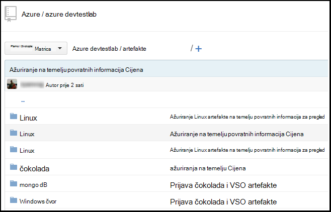
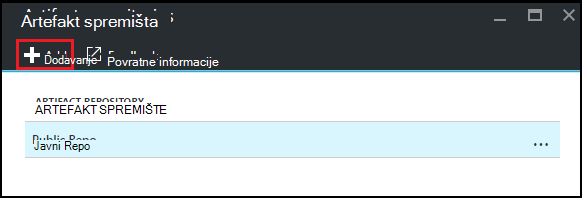
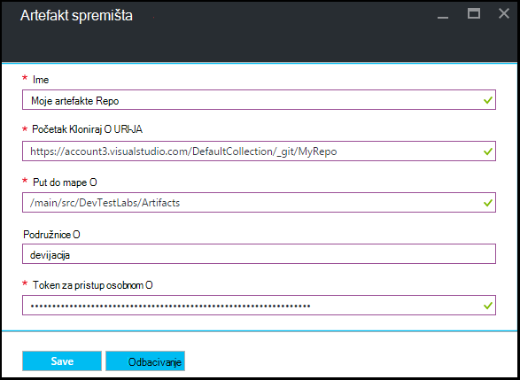

<properties
    pageTitle="Dodavanje spremište artefakt brojka Laboratorija u Azure DevTest Labs | Microsoft Azure"
    description="Dodavanje GitHub ili Visual Studio tim servisima brojka spremište za izvor prilagođene artefakte u Azure DevTest Labs"
    services="devtest-lab,virtual-machines,visual-studio-online"
    documentationCenter="na"
    authors="tomarcher"
    manager="douge"
    editor=""/>

<tags
    ms.service="devtest-lab"
    ms.workload="na"
    ms.tgt_pltfrm="na"
    ms.devlang="na"
    ms.topic="article"
    ms.date="09/06/2016"
    ms.author="tarcher"/>

# Dodavanje spremište artefakt brojka Laboratorija u Azure DevTest Labs

> [AZURE.VIDEO how-to-add-your-private-artifacts-repository-in-a-devtest-lab]

U Azure DevTest Labs, artefakte su *Akcije* – kao što su instalacije softvera ili izvodi skripte i naredbe - stvaranja na VM. Po zadanom je Laboratorija obuhvaćaju artefakte službeni spremištu artefakt Azure DevTest Labs. Spremište artefakt brojka možete dodati na Laboratorija da biste uključili artefakte koji stvori vaš tim. Spremište mogu nalaziti na [GitHub](https://github.com) ili [Visual Studio tima Services (VSTS)](https://visualstudio.com).

- Da biste saznali kako stvoriti spremište GitHub, potražite u članku [GitHub Bootcamp](https://help.github.com/categories/bootcamp/).
- Da biste saznali kako stvoriti Team Services projekta s brojka spremište, potražite u članku [povezivanje za Visual Studio Team Services](https://www.visualstudio.com/get-started/setup/connect-to-visual-studio-online).

Na sljedećoj je snimci zaslona prikazuje primjer spremište koje sadrže artefakte možda izgleda u GitHub:  

## Spremište podataka i vjerodajnice

Da biste dodali u spremištu artefakt vaše Laboratorija, najprije morate dobiti određene podatke na spremištu. U sljedećim se odjeljcima će vas voditi kroz početak ove informacije o artefakt spremištima hostirane na GitHub i Visual Studio Team Services.

### Traženje GitHub spremište Kloniraj URL i osobne pristup tokena

Da biste dobili spremište Kloniraj GitHub URL i token osobne pristup, slijedite ove korake:

1. Otvorite početnu stranicu u spremištu GitHub koji sadrži definicije artefakt.

1. Odaberite **web-mjesto Kloniraj ili u okvir za preuzimanje**.

1. Odaberite gumb da biste kopirali **HTTPS Kloniraj url** u međuspremnik i spremite URL-a za kasnije korištenje.

1. Odaberite sliku profila u gornjem desnom kutu GitHub, a zatim odaberite **Postavke**.

1. Na izborniku **osobne postavke** na lijevoj strani odaberite **tokeni osobne programa access**.

1. Odaberite **novi token Generiraj**.

1. Na stranici **Novi osobne pristup token** unesite **Opis tokena**, prihvatite zadani stavki **Odaberite opsega**pa odaberite **Generiranje tokena**.

1. Spremiti generirani tokena koje vam kasnije trebati.

1. Sada možete zatvoriti GitHub.   

1. Prijeđite na odjeljak [Povezivanje vaše Laboratorija artefakt spremište](#connect-your-lab-to-the-artifact-repository) .

### Početak Visual Studio Team Services spremište Kloniraj URL i osobne pristup tokena

Da biste dobili Visual Studio Team Services spremište Kloniraj URL i token osobne pristup, slijedite ove korake:

1. Otvorite početnu stranicu zbirke tima (Ako, na primjer, `https://contoso-web-team.visualstudio.com`), a zatim odaberite artefakt projekta.

1. Na početnoj stranici projekt odaberite **kod**.

1. Da biste vidjeli URL Kloniraj **kodna** stranica projekta, odaberite **Kloniraj**.

1. Koliko vam je potrebno kasnije u ovom ćete praktičnom vodiču, spremite URL-a.

1. Da biste stvorili web osobni pristup tokena, odaberite **Moj profil** s padajućeg izbornika za korisnički račun.

1. Na stranici informacije o profilu odaberite **Sigurnost**.

1. Na kartici **Sigurnost** odaberite **Dodaj**.

1. Na stranici **Stvaranje osobnih pristup tokena** :

    - Unesite **Opis** token.
    - Odaberite **180 dana** s popisa **Istekne u** .
    - **Računi** popisu odaberite **sve dostupne račune** .
    - Odaberite mogućnost **svih opsega** .
    - Odaberite **Stvaranje tokena**.

1. Kada završite, na popisu **Osobne pristupna tokena** pojavit će se novi token. Odaberite **Kopiraj tokena**, a zatim spremite tokena vrijednost za kasnije korištenje.

1. Prijeđite na odjeljak [Povezivanje vaše Laboratorija artefakt spremište](#connect-your-lab-to-the-artifact-repository) .

##Povezivanje sustava Laboratorija spremište artefakt

1. Prijavite se na [portal za Azure](http://go.microsoft.com/fwlink/p/?LinkID=525040).

1. Odaberite **Više servisa**, a zatim na popisu odaberite **DevTest Labs** .

1. Na popisu labs odaberite željeni Laboratorija.   

1. Na plohu u Laboratorija odaberite **Konfiguracija**.

1. Na plohu **konfiguracije** na Laboratorija, odaberite **Spremištima artefakte**.

1. Na plohu **Artefakte spremištima** odaberite **+ Dodaj**.

    
 
1. Na drugom plohu **Artefakte spremištima** navedite sljedeće:

    - **Ime** - unesite naziv u spremištu.
    - **Brojka Kloniraj Url** - unesite URL Kloniraj HTTPS brojka koju ste ranije kopirali GitHub ili Visual Studio Team Services. 
    - **Put do mape** – unesite put do mape u odnosu Kloniraj URL koji sadrži artefakt definicija.
    - **Podružnice** - unesite granu da biste dobili artefakt definicija.
    - **Osobni pristup tokena** - unesite token za pristup osobnom ste nabavili ranije GitHub ili Visual Studio Team Services. 
     
    

1. Odaberite **Spremi**.

[AZURE.INCLUDE [devtest-lab-try-it-out](../../includes/devtest-lab-try-it-out.md)]

## Srodni bloga
- [Otklanjanje poteškoća s neuspješnih artefakte u AzureDevTestLabs](http://www.visualstudiogeeks.com/blog/DevOps/How-to-troubleshoot-failing-artifacts-in-AzureDevTestLabs)
- [Uključivanje u VM postojeće AD domenom pomoću predloška za ARM u Azure razvojni Test Laboratorija](http://www.visualstudiogeeks.com/blog/DevOps/Join-a-VM-to-existing-AD-domain-using-ARM-template-AzureDevTestLabs)