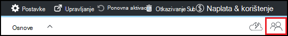

<properties
    pageTitle="Dodavanje vlasnicima i korisnika u Azure DevTest Labs | Microsoft Azure"
    description="Dodavanje vlasnicima i korisnika u Azure DevTest Labs pomoću portala za Azure ili PowerShell"
    services="devtest-lab,virtual-machines"
    documentationCenter="na"
    authors="tomarcher"
    manager="douge"
    editor=""/>

<tags
    ms.service="devtest-lab"
    ms.workload="na"
    ms.tgt_pltfrm="na"
    ms.devlang="na"
    ms.topic="article"
    ms.date="09/12/2016"
    ms.author="tarcher"/>

# Dodavanje vlasnicima i korisnika u Azure DevTest Labs

> [AZURE.VIDEO how-to-set-security-in-your-devtest-lab]

Access u Azure DevTest Labs upravlja [Kontrola pristupa na Azure Role-Based (RBAC)](../active-directory/role-based-access-control-what-is.md). Pomoću RBAC, koje možete segregate obavezama koje imate u tim u *uloge* kojima dodijeliti samo iznos potrebno korisnicima izvođenje svoje zadatke u programu access. Tri te uloge RBAC su *vlasnik*, *DevTest Labs korisnika*i *suradnika*. U ovom se članku Saznajte što može izvoditi u svakoj od tri glavne RBAC uloge. Iz nje, Saznajte kako dodati korisnike Laboratorija - putem portala i putem skriptu PowerShell i kako dodati korisnike na razini pretplate.

## Akcije koje možete izvršiti u ulogama

Postoje tri glavna uloge koje možete dodijeliti korisnika:

- Vlasnik
- DevTest Labs korisnika
- Suradnik

Sljedeća tablica prikazuje postupaka koji se može izvoditi korisnika u svakoj od tih uloga:

| **Možete izvedite akcije koje korisnici u ta uloga** | **DevTest Labs korisnika**            | **Vlasnik** | **Suradnik** |
|---|---|---|---|
| **Laboratorija zadataka**                          |                              |       |             |
| Dodavanje korisnika u Laboratorija                     | ne                           | Da   | ne          |
| Ažuriranje postavki trošak                   | ne                           | Da   | Da         |
| **Osnovni zadaci VM**                      |                              |       |             |
| Dodavanje i uklanjanje prilagođene slike           | ne                           | Da   | Da         |
| Dodavanje, ažuriranje i brisanje formula       | Da                          | Da   | Da         |
| Slika Whitelist Azure Marketplace     | ne                           | Da   | Da         |
| **VM zadataka**                           |                              |       |             |
| Stvaranje VMs                             | Da                          | Da   | Da         |
| Pokretanje, zaustavljanje i brisanje VMs            | Samo VMs stvorio korisnik | Da   | Da         |
| Ažuriranje VM pravila                     | ne                           | Da   | Da         |
| Dodavanje i uklanjanje podataka diskova iz VMs      | Samo VMs stvorio korisnik | Da   | Da         |
| **Zadaci artefakt**                     |                              |       |             |
| Dodavanje i uklanjanje artefakta spremišta   | ne                           | Da   | Da         |
| Primjena artefakte                        | Da                          | Da   | Da         |

> [AZURE.NOTE] Kada korisnik stvara na VM, korisniku se automatski dodjeljuju ulogu **vlasnik** stvoreni VM.

## Dodavanje vlasnik ili korisnika na razini Laboratorija

Vlasnici i korisnici mogu dodati na razini Laboratorija putem portala za Azure. To obuhvaća vanjskih korisnika s ispravan [Microsoftov račun (MSA)](devtest-lab-faq.md#what-is-a-microsoft-account).
Sljedeći koraci će vas voditi kroz postupak dodavanja vlasnik ili korisnik Laboratorija u Azure DevTest Labs:

1. Prijavite se na [portal za Azure](http://go.microsoft.com/fwlink/p/?LinkID=525040).

1. Odaberite **nove servise**, a zatim na popisu odaberite **DevTest Labs** .

1. Na popisu labs odaberite željeni Laboratorija.

1. Na plohu u Laboratorija odaberite **Konfiguracija**. 

1. Na plohu **konfiguracije** odaberite **korisnici**.

1. Na plohu **korisnika** odaberite **+ Dodaj**.

    

1. Na plohu **Odaberite ulogu** odaberite željenu ulogu. U odjeljku [Akcije koje možete izvršiti u svaku ulogu](#actions-that-can-be-performed-in-each-role) navedene različite radnje koje može izvoditi korisnici vlasnika, DevTest korisnika i uloga suradnika.

1. Na plohu **Dodavanje korisnika** , unesite adresu e-pošte ili imena korisnika koje želite dodati u ulogu koju ste naveli. Ako korisnik nije moguće pronaći, poruka o pogrešci objašnjava problem. Ako se pronađe korisniku, korisnik je naveden i. 

1. Odaberite **Odaberi**.

1. Odaberite **u redu** da biste zatvorili plohu **Dodaj pristup** .

1. Kada se vratite na plohu **korisnika** , korisnik dodan.  

## Dodavanje vanjskih korisnika u Laboratorija pomoću komponente PowerShell

Osim dodavanja korisnika na portalu za Azure, možete dodati vanjskog korisnika sustava Laboratorija pomoću skriptu PowerShell. U sljedećem primjeru, jednostavno izmijeniti vrijednosti parametara u odjeljku **vrijednosti da biste promijenili** komentar.
Možete dohvatiti na `subscriptionId`, `labResourceGroup`, a `labName` vrijednosti iz plohu Laboratorija na portalu za Azure.

> [AZURE.NOTE]
> Ogledne skripte pretpostavlja da navedeni korisnik dodan kao gost sa servisom Active Directory, i neće uspjeti ako to nije slučaj. Da biste dodali korisnik ne u servisu Active Directory u Laboratorija, pomoću portala za Azure korisnika dodijeliti ulogu kao što je prikazano u odjeljku [Dodavanje vlasnika ili korisnika na razini Laboratorija](#add-an-owner-or-user-at-the-lab-level).   

    # Add an external user in DevTest Labs user role to a lab
    # Ensure that guest users can be added to the Azure Active directory:
    # https://azure.microsoft.com/en-us/documentation/articles/active-directory-create-users/#set-guest-user-access-policies

    # Values to change
    $subscriptionId = "<Enter Azure subscription ID here>"
    $labResourceGroup = "<Enter lab's resource name here>"
    $labName = "<Enter lab name here>"
    $userDisplayName = "<Enter user's display name here>"

    # Log into your Azure account
    Login-AzureRmAccount
    
    # Select the Azure subscription that contains the lab. 
    # This step is optional if you have only one subscription.
    Select-AzureRmSubscription -SubscriptionId $subscriptionId
    
    # Retrieve the user object
    $adObject = Get-AzureRmADUser -SearchString $userDisplayName
    
    # Create the role assignment. 
    $labId = ('subscriptions/' + $subscriptionId + '/resourceGroups/' + $labResourceGroup + '/providers/Microsoft.DevTestLab/labs/' + $labName)
    New-AzureRmRoleAssignment -ObjectId $adObject.Id -RoleDefinitionName 'DevTest Labs User' -Scope $labId

## Dodavanje vlasnik ili korisnika na razini pretplate

Dozvole za Azure prenose iz nadređeni opseg podređeni doseg u Azure. Stoga, vlasnici Azure pretplatu koja sadrži labs su automatski vlasnika te labs. Mogu se i vlasnik u VMs i ostale resurse stvorenu u Laboratorija korisnika i servisa Azure DevTest Labs. 

Možete dodati dodatne vlasnici Laboratorija putem na Laboratorija plohu [Azure portal](http://go.microsoft.com/fwlink/p/?LinkID=525040). Međutim, je dodana vlasnik djelokrug administracije više usko od opseg vlasnik pretplate. Na primjer, dodane vlasnici imaju puni pristup nekih resursa koje su stvorene u pretplate DevTest Labs servis. 

Da biste dodali vlasnika Azure pretplati, slijedite ove korake:

1. Prijavite se na [portal za Azure](http://go.microsoft.com/fwlink/p/?LinkID=525040).

1. Odaberite **Više servisa**, a zatim na popisu odaberite **pretplate** .

1. Odaberite željeni pretplatu.

1. Odaberite ikonu **programa Access** . 

    

1. Na plohu **korisnici** , odaberite **Dodaj**.

    

1. Na plohu **Odaberite ulogu** odaberite **vlasnik**.

1. Na plohu **Dodavanje korisnika** , unesite adresu e-pošte ili imena korisnika koje želite dodati kao vlasnika. Ako korisnik nije moguće pronaći, prikazat će se poruka o pogrešci u kojoj se navodi problem. Ako se pronađe korisniku, korisnik nalazi se u odjeljku tekstni okvir **korisnika** .

1. Odaberite nalazi korisničko ime.

1. Odaberite **Odaberi**.

1. Odaberite **u redu** da biste zatvorili plohu **Dodaj pristup** .

1. Kada se vratite na plohu **korisnika** , znači da je korisnik dodan vlasnik. Taj korisnik sada je vlasnika bilo koje labs stvorene u odjeljku ove pretplate i stoga moći izvršavati zadatke vlasnik. 

[AZURE.INCLUDE [devtest-lab-try-it-out](../../includes/devtest-lab-try-it-out.md)]
