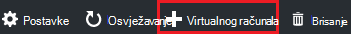
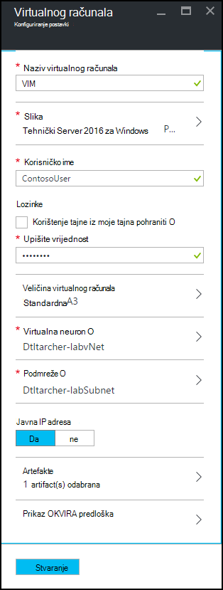
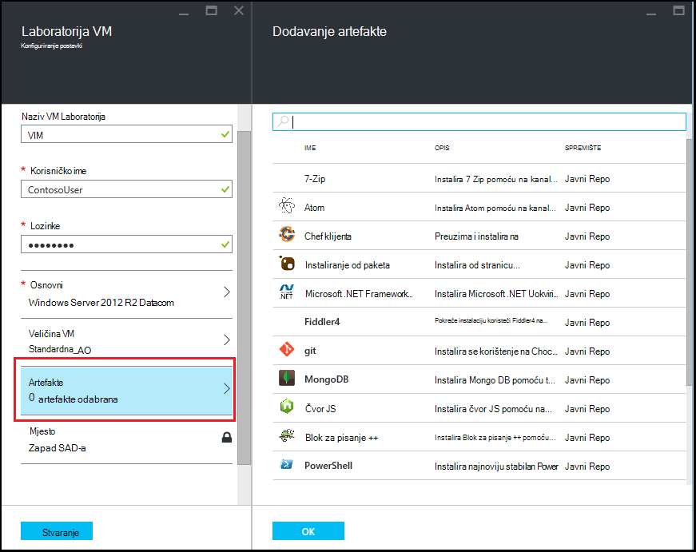
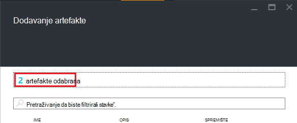

<properties
    pageTitle="Dodavanje VM s artefakte Laboratorija u Azure DevTest Labs | Microsoft Azure"
    description="Saznajte kako dodati VM s artefakte u Azure DevTest Labs"
    services="devtest-lab,virtual-machines"
    documentationCenter="na"
    authors="tomarcher"
    manager="douge"
    editor=""/>

<tags
    ms.service="devtest-lab"
    ms.workload="na"
    ms.tgt_pltfrm="na"
    ms.devlang="na"
    ms.topic="article"
    ms.date="08/30/2016"
    ms.author="tarcher"/>

# Dodavanje VM s artefakte Laboratorija u Azure DevTest Labs

> [AZURE.VIDEO how-to-create-vms-with-artifacts-in-a-devtest-lab]

Stvaranje na VM u Laboratorija iz na *osnovnu* koji je na [prilagođenu sliku](./devtest-lab-create-template.md), [formule](./devtest-lab-manage-formulas.md)ili [Slika trgovine](./devtest-lab-configure-marketplace-images.md).

DevTest Labs *artefakte* omogućuju vam navođenje *Akcije* koje se izvode kada je stvorena u VM. 

Akcije artefakt možete izvršiti postupaka kao što su pokrenute skripte komponente Windows PowerShell, radi tulumu naredbe i instalaciju softvera. 

Artefakt *parametara* omogućuju Prilagodba artefakt za određeni scenariju.

U ovom se članku objašnjava da biste stvorili na VM u vašem Laboratorija s artefakte.

## Dodavanje VM s artefakte

1. Prijavite se na [portal za Azure](http://go.microsoft.com/fwlink/p/?LinkID=525040).

1. Odaberite **Više servisa**, a zatim na popisu odaberite **DevTest Labs** .

1. Na popisu labs odaberite Laboratorija u kojoj želite stvoriti u VM.  

1. Na na Laboratorija plohu **Pregled** , odaberite **+ virtualnog računala**.  
    

1. Na plohu **Odaberite osnovu** odaberite osnovu za na VM.

1. Na plohu **virtualnog računala** unesite naziv nove virtualnog računala u tekstni okvir **naziv virtualnog računala** .

    

1. Unesite **Korisničko ime** koje će biti odobren administratorske ovlasti na virtualnog računala.  

1. Ako želite koristiti lozinku pohranjenima u *tajnu trgovine*, odaberite **koristi tajne iz moje tajnu trgovine**, a odredite ključnu vrijednost koja odgovara tajna (lozinka). U suprotnom, unesite lozinku u tekstno polje s natpisom **upišite vrijednost**.
 
1. Odaberite **veličinu virtualnog računala** i odaberite jednu od unaprijed definiranih stavki koje navode jezgri procesora, veličina RAM-a i veličine tvrdog diska VM da biste stvorili.

1. Odaberite **virtualne mreže** i odaberite željeni virtualne mreže.

1. Odaberite **podmreže** i podmreže.

1. Ako je pravilnik Laboratorija postavljen da biste omogućili javnu IP adresa za odabrani podmreži, navedite želite li da se s IP adresom biti javno tako da odaberete **da** ili **ne**. U suprotnom, onemogućeno i će biti odabrana **bez**tu mogućnost. 

1. Odaberite **artefakte** - s popisa artefakte - odaberite i konfiguriranje artefakte koju želite dodati osnovni slike. 
**Bilješke:** Ako ste novi korisnik DevTest Labs ili konfiguriranje artefakte, prijeđite na odjeljak [Dodavanje postojećih artefakt da biste na VM](#add-an-existing-artifact-to-a-vm) i zatim se vratite ovdje kada završite.

1. Želite li prikaz ili kopiranje predloška Azure Voditelj resursa, prijeđite na odjeljak [Voditelj resursa za Azure spremanje predloška](#save-arm-template) i vratite se ovamo kada završite.

1. Odaberite **Stvori** da biste dodali navedeni VM na Laboratorija.

1. Plohu Laboratorija prikazuje status stvaranja na VM; najprije kao **Stvaranje**, zatim kao **pokrenut** nakon na VM je pokrenut.

1. Prijeđite na odjeljak [Daljnji koraci](#next-steps) . 

## Dodavanje postojećeg artefakt na VM

Prilikom stvaranja na VM, možete dodati postojeće artefakte. Svaki Laboratorija obuhvaća artefakte javno DevTest spremište artefakt Labs, kao i artefakte koju ste stvorili i dodati vlastite artefakt spremište.
Da biste otkrili kako stvoriti artefakte, potražite u članku [upute za stvaranje vlastitog artefakte za korištenje s DevTest Labs](devtest-lab-artifact-author.md).

1. Na plohu **virtualnog računala** odaberite **artefakte**. 

1. Na plohu **artefakte Dodaj** odaberite željeni artefakt.  

    

1. Unesite vrijednosti obavezan parametar i neobavezne parametre koje su vam potrebne.  

1. Odaberite **Dodaj** da biste dodali u artefakt i vratili plohu **Dodavanje artefakte** .

1. Nastavite dodavati artefakte kao što je potrebno za vaše VM.

1. Kada dodate na artefakte, možete [promijeniti redoslijed kojim će se izvoditi na artefakte](#change-the-order-in-which-artifacts-are-run). Možete se vratiti na [Prikaz i izmjena artefakt](#view-or-modify-an-artifact).

## Promjena redoslijeda kojim se izvoditi artefakte

Prema zadanim postavkama, akcije na artefakte se provode redoslijedom u kojem se dodaju u VM. Sljedeći koraci objašnjavaju kako promijeniti redoslijed kojim će se izvoditi na artefakte.

1. Pri vrhu plohu **Dodavanje artefakte** , odaberite vezu koji označava broj artefakte koji su dodani u VM.

    

1. Da biste odredili redoslijed kojim će se izvoditi na artefakte, povucite i ispustite na artefakte u željeni redoslijed. **Bilješke:** Ako imate problema s povlačenjem u artefakt, provjerite je li da povlačite s lijeve strane na artefakt. 

1. Odaberite **u redu** kada to učinite.  

## Prikaz i izmjena artefakt

Sljedeći koraci objašnjavaju kako pogledati ili izmijenite parametre artefakt:

1. Pri vrhu plohu **Dodavanje artefakte** , odaberite vezu koji označava broj artefakte koji su dodani u VM.

    

1. Na plohu **Odabrana artefakte** odaberite artefakt koju želite pregledavati ili uređivati.  

1. Na plohu **Dodavanje artefakt** napravite sve željene promjene i odaberite **u redu** da biste zatvorili plohu **Dodavanje artefakt** .

1. Odaberite **u redu** da biste zatvorili plohu **Odabrana artefakte** .

## Spremanje predloška Azure Voditelj resursa

Predložak programa Azure Voditelj resursa omogućuje deklarativno definirati kontrolirani implementacije. Sljedeći koraci objašnjavaju kako spremiti predloška Azure Voditelj resursa za VM stvoren.
Nakon spremanja možete koristiti predložak Azure Voditelj resursa za [implementaciju novi VMs s Azure PowerShell](../azure-resource-manager/resource-group-overview.md#template-deployment).

1. **Prikaz OKVIRA predložak**odaberite na plohu **virtualnog računala** .

1. Na **plohu resursima Azure postojećeg predloška prikaza**, odaberite tekst predloška.

1. Kopiranje odabranog teksta u međuspremnik.

1. Odaberite **u redu** da biste zatvorili **plohu resursima Azure postojećeg predloška prikaza**.

1. Otvorite uređivač teksta.

1. Zalijepite tekst predloška iz međuspremnika.

1. Spremite datoteku za kasnije korištenje.

[AZURE.INCLUDE [devtest-lab-try-it-out](../../includes/devtest-lab-try-it-out.md)]

## Daljnji koraci

- Nakon što u VM, možete se povezati s VM tako da odaberete **Povezivanje** na plohu u VM.
- Saznajte kako [stvoriti prilagođene artefakte za vaše VM Labs DevTest](devtest-lab-artifact-author.md).
- Istraživanje u [galeriji predložaka DevTest Labs OKVIRA brzi početak rada](https://github.com/Azure/azure-devtestlab/tree/master/ARMTemplates)