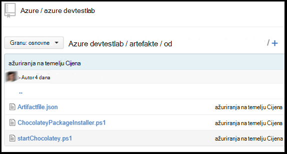

<properties 
    pageTitle="Stvaranje prilagođene artefakte za vaše VM Labs DevTest | Microsoft Azure"
    description="Upute za stvaranje vlastitog artefakte za korištenje s DevTest Labs"
    services="devtest-lab,virtual-machines"
    documentationCenter="na"
    authors="tomarcher"
    manager="douge"
    editor=""/>

<tags
    ms.service="devtest-lab"
    ms.workload="na"
    ms.tgt_pltfrm="na"
    ms.devlang="na"
    ms.topic="article"
    ms.date="08/25/2016"
    ms.author="tarcher"/>

#Stvaranje prilagođene artefakte za vaše VM Labs DevTest

> [AZURE.VIDEO how-to-author-custom-artifacts] 

## Pregled
**Artefakte** koriste se za uvođenje i konfigurirali aplikaciju nakon što je VM je dodijeljeni resursi. Artefakt sastoji se od datoteku definicije artefakt i drugih datoteka skripte koje se pohranjuju u mapi u spremište brojka. Datoteka za definiciju artefakta se sastoje od JSON i izraza koje možete koristiti da biste odredili što će se instalirati na na VM. Na primjer, možete definirati naziv artefakt, naredbu koju želite pokrenuti i parametrima koji su bili dostupni prilikom pokretanja naredbe. Možete se referirati na druge datoteke skripte unutar datoteka za definiciju artefakta po nazivu.

##Oblik datoteke definicije artefakt
Sljedeći primjer prikazuje sekcije koje čine osnovna struktura datoteka za definiciju.

    {
      "$schema": "https://raw.githubusercontent.com/Azure/azure-devtestlab/master/schemas/2015-01-01/dtlArtifacts.json",
      "title": "",
      "description": "",
      "iconUri": "",
      "targetOsType": "",
      "parameters": {
        "<parameterName>": {
          "type": "",
          "displayName": "",
          "description": ""
        }
      },
      "runCommand": {
        "commandToExecute": ""
      }
    }

| Naziv elementa | Obavezan? | Opis
| ------------ | --------- | -----------
| $schema      | ne        | Mjesto datoteke sheme JSON koji olakšava u testiranje valjanost datoteka za definiciju.
| Naslov        | Da       | Naziv artefakt velikim na Laboratorija.
| Opis  | Da       | Opis artefakt velikim na Laboratorija.
| iconUri      | ne        | URI ikonu velikim na Laboratorija.
| targetOsType | Da       | Operacijski sustav VM instaliranim artefakt. Mogućnosti podržane su: Windows i Linux.
| Parametri   | ne        | Vrijednosti koje su dobili prilikom pokretanja naredbe Instaliraj artefakt na računalo. Pomaže u prilagodbu vašeg artefakt.
| runCommand   | Da       | Artefakt instalirajte naredbu koja se izvršava na na VM.

###Parametri artefakt

U odjeljku parametara datoteka za definiciju Navedite vrijednosti koje korisnik može unos prilikom instalacije artefakt. Može se odnositi na ove vrijednosti u naredbi artefakt Instaliraj.

Definiranje parametara će sljedeću strukturu.

    "parameters": {
        "<parameterName>": {
          "type": "<type-of-parameter-value>",
          "displayName": "<display-name-of-parameter>",
          "description": "<description-of-parameter>"
        }
      }

| Naziv elementa | Obavezan? | Opis
| ------------ | --------- | -----------
| Vrsta         | Da       | Vrsta vrijednosti parametra. Pogledajte popis ispod za dopuštene vrste:
| riješiti problem da       | Naziv parametra koji se prikazuje za korisnika u na Laboratorija.
| Opis  | Da       | Opis parametra koji se prikazuje u na Laboratorija.

Dopuštene vrste su:

- niz – bilo koji valjani niz JSON
- INT – bilo koji valjani JSON cijeli broj
- booleovom – bilo koji valjani JSON Booleova
- polja – bilo koji valjani JSON polja

##Artefakt izrazima i funkcijama

Izraz možete koristiti i funkcije za sastavljanje u artefakt instalirajte naredbe.
Izrazi zatvorene uglatim zagradama ([a]), a vrednuju se nakon instalacije na artefakt. Izraze mogu pojaviti bilo gdje u vrijednost niza JSON i uvijek vratiti neku drugu vrijednost JSON. Ako trebate koristiti slovni niz koji započinje s uglate zagrade [, morate koristiti dvije uglate zagrade [[.
Obično ćete koristiti izraze s funkcijama za sastavljanje vrijednost. Baš kao i u JavaScript, funkcija pozive su oblikovani kao functionName(arg1,arg2,arg3)

Na sljedećem popisu navedene uobičajenih funkcije.

- PARAMETERS(parameterName) - vraća vrijednost parametra koja se nudi prilikom pokretanja naredbe artefakt.
- Slika (arg1, arg2, arg3,...) – kombinira višestruke vrijednosti niza. Ova funkcija može potrajati bilo koji broj argumenata.

Sljedeći primjer pokazuje kako koristiti izraza i funkcije da biste izradili vrijednost.

    runCommand": {
         "commandToExecute": "[concat('powershell.exe -File startChocolatey.ps1'
    , ' -RawPackagesList ', parameters('packages')
    , ' -Username ', parameters('installUsername')
    , ' -Password ', parameters('installPassword'))]"
    }

##Stvaranje prilagođene artefakt

Stvorite svoje prilagođene artefakt tako da slijedite korake u nastavku:

1. Instaliranje programa za uređivanje JSON – morat ćete JSON uređivača za rad s datotekama artefakt definicija. Preporučujemo korištenje [Visual Studio kod](https://code.visualstudio.com/)koji je dostupan za Windows, Linux i OS X.

1. Početak uzorka artifactfile.json – odjavu artefakte stvorio Azure DevTest Labs tima na našem [GitHub spremište](https://github.com/Azure/azure-devtestlab) koju ste stvorili biblioteku obogaćenog artefakte koji će vam pomoći da biste stvorili vlastiti artefakte. Preuzmite datoteku definicije artefakt i promjene da biste stvorili vlastiti artefakte.

1. Koristio IntelliSense - Leverage IntelliSense da biste vidjeli valjani elemente koji se mogu koristiti za sastavljanje datoteku definicije artefakt. Također možete vidjeti različite mogućnosti za vrijednosti element. Na primjer, IntelliSense pokazati dvije mogućnosti sustava Windows ili Linux prilikom uređivanja **targetOsType** element.

1. Spremište artefakt u spremište brojka
    1. Stvorite zaseban direktorij za svaki artefakt gdje naziv direktorija ista je kao artefakt naziv.
    1. Spremanje datoteka za definiciju artefakta (artifactfile.json) u direktoriju koji ste stvorili.
    1. Pohranite skripte koji su referencirani od naredbe artefakt Instaliraj.

    Evo primjera kako izgleda mapom artefakt:

    

1. Dodavanje spremište artefakte da biste Laboratorija – pogledajte u članku [Dodavanje spremište artefakt brojka da biste na Laboratorija](devtest-lab-add-artifact-repo.md).

[AZURE.INCLUDE [devtest-lab-try-it-out](../../includes/devtest-lab-try-it-out.md)]

## Srodni bloga
- [Otklanjanje poteškoća s neuspješnih artefakte u AzureDevTestLabs](http://www.visualstudiogeeks.com/blog/DevOps/How-to-troubleshoot-failing-artifacts-in-AzureDevTestLabs)
- [Uključivanje u VM postojeće AD domenom pomoću predloška za ARM u Azure razvojni Test Laboratorija](http://www.visualstudiogeeks.com/blog/DevOps/Join-a-VM-to-existing-AD-domain-using-ARM-template-AzureDevTestLabs)

## Daljnji koraci

- Saznajte kako [dodati spremište artefakt brojka da biste na Laboratorija](devtest-lab-add-artifact-repo.md).
